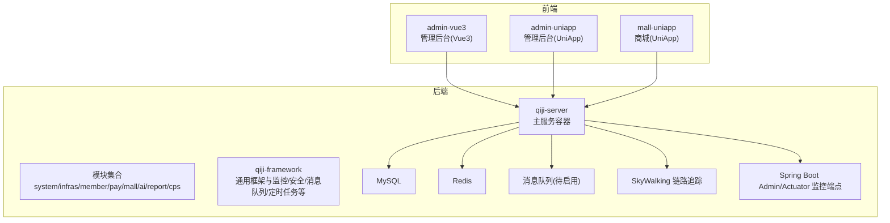
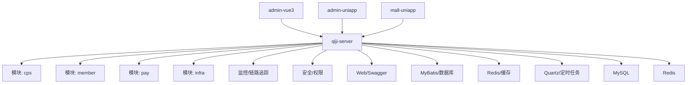
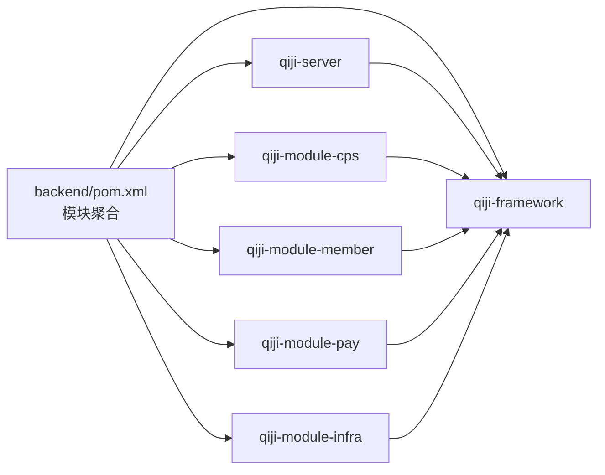

# 故障排查

<cite>
**本文引用的文件**
- [README.md](file://README.md)
- [backend/pom.xml](file://backend/pom.xml)
- [backend/qiji-server/Dockerfile](file://backend/qiji-server/Dockerfile)
- [backend/script/docker/docker-compose.yml](file://backend/script/docker/docker-compose.yml)
- [backend/script/docker/docker.env](file://backend/script/docker/docker.env)
- [backend/qiji-framework/qiji-spring-boot-starter-monitor/src/main/java/com/qiji/cps/framework/tracer](file://backend/qiji-framework/qiji-spring-boot-starter-monitor/src/main/java/com/qiji/cps/framework/tracer)
- [backend/qiji-framework/qiji-spring-boot-starter-monitor/src/main/resources/META-INF/spring](file://backend/qiji-framework/qiji-spring-boot-starter-monitor/src/main/resources/META-INF/spring)
- [backend/qiji-framework/qiji-spring-boot-starter-monitor/《芋道 Spring Boot 监控工具 Admin 入门》.md](file://backend/qiji-framework/qiji-spring-boot-starter-monitor/《芋道 Spring Boot 监控工具 Admin 入门》.md)
- [backend/qiji-framework/qiji-spring-boot-starter-monitor/《芋道 Spring Boot 监控端点 Actuator 入门》.md](file://backend/qiji-framework/qiji-spring-boot-starter-monitor/《芋道 Spring Boot 监控端点 Actuator 入门》.md)
- [backend/qiji-framework/qiji-spring-boot-starter-monitor/《芋道 Spring Boot 链路追踪 SkyWalking 入门》.md](file://backend/qiji-framework/qiji-spring-boot-starter-monitor/《芋道 Spring Boot 链路追踪 SkyWalking 入门》.md)
- [backend/qiji-framework/qiji-spring-boot-starter-web/src/main/java/com/qiji/cps/framework/web](file://backend/qiji-framework/qiji-spring-boot-starter-web/src/main/java/com/qiji/cps/framework/web)
- [backend/qiji-framework/qiji-spring-boot-starter-web/src/main/resources/META-INF/spring](file://backend/qiji-framework/qiji-spring-boot-starter-web/src/main/resources/META-INF/spring)
- [backend/qiji-framework/qiji-spring-boot-starter-web/《芋道 Spring Boot API 接口文档 Swagger 入门》.md](file://backend/qiji-framework/qiji-spring-boot-starter-web/《芋道 Spring Boot API 接口文档 Swagger 入门》.md)
- [backend/qiji-framework/qiji-spring-boot-starter-web/《芋道 Spring Boot SpringMVC 入门》.md](file://backend/qiji-framework/qiji-spring-boot-starter-web/《芋道 Spring Boot SpringMVC 入门》.md)
- [backend/qiji-framework/qiji-spring-boot-starter-mybatis/《芋道 Spring Boot MyBatis 入门》.md](file://backend/qiji-framework/qiji-spring-boot-starter-mybatis/《芋道 Spring Boot MyBatis 入门》.md)
- [backend/qiji-framework/qiji-spring-boot-starter-redis/《芋道 Spring Boot Redis 入门》.md](file://backend/qiji-framework/qiji-spring-boot-starter-redis/《芋道 Spring Boot Redis 入门》.md)
- [backend/qiji-framework/qiji-spring-boot-starter-job/《芋道 Spring Boot 定时任务入门》.md](file://backend/qiji-framework/qiji-spring-boot-starter-job/《芋道 Spring Boot 定时任务入门》.md)
- [backend/qiji-framework/qiji-spring-boot-starter-security/《芋道 Spring Boot 安全框架 Spring Security 入门》.md](file://backend/qiji-framework/qiji-spring-boot-starter-security/《芋道 Spring Boot 安全框架 Spring Security 入门》.md)
- [backend/qiji-module-cps/qiji-module-cps-api/src/main/java/com/qiji/cps/module/cps/enums](file://backend/qiji-module-cps/qiji-module-cps-api/src/main/java/com/qiji/cps/module/cps/enums)
- [backend/qiji-module-cps/qiji-module-cps-biz/src/main/java/com/qiji/cps/module/cps](file://backend/qiji-module-cps/qiji-module-cps-biz/src/main/java/com/qiji/cps/module/cps)
- [backend/sql/mysql/ruoyi-vue-pro.sql](file://backend/sql/mysql/ruoyi-vue-pro.sql)
- [backend/script/shell/deploy.sh](file://backend/script/shell/deploy.sh)
- [frontend/admin-vue3/package.json](file://frontend/admin-vue3/package.json)
- [frontend/admin-uniapp/vite.config.ts](file://frontend/admin-uniapp/vite.config.ts)
- [frontend/mall-uniapp/vite.config.ts](file://frontend/mall-uniapp/vite.config.ts)
</cite>

## 目录
1. [简介](#简介)
2. [项目结构](#项目结构)
3. [核心组件](#核心组件)
4. [架构总览](#架构总览)
5. [详细组件分析](#详细组件分析)
6. [依赖分析](#依赖分析)
7. [性能考虑](#性能考虑)
8. [故障排查指南](#故障排查指南)
9. [结论](#结论)
10. [附录](#附录)

## 简介
本指导文档面向运维与开发团队，围绕 AgenticCPS 的故障排查与稳定性保障，提供系统化的启动失败排查、数据库连接问题、API 接口异常、性能问题诊断的方法论；深入说明日志分析方法（日志级别配置、关键日志定位、错误信息解读、调试技巧）；阐述系统监控配置（监控指标、告警规则、性能瓶颈分析与优化建议）；给出故障应急响应流程（问题分类、影响评估、处理优先级、恢复验证）；并提供预防性维护与容量规划、安全漏洞扫描与合规检查的定期执行方案，确保系统稳定运行。

## 项目结构
AgenticCPS 采用前后端分离、模块化多仓库聚合的 Maven 结构，后端以 Spring Boot 3.5.9 为核心，前端包含 Vue3 管理后台与 UniApp 移动端。系统通过 Docker Compose 提供一键拉起 MySQL、Redis、后端服务与前端面板的能力，并内置监控、链路追踪与日志中心等基础设施模块。

**图表来源**
- [backend/pom.xml:10-25](file://backend/pom.xml#L10-L25)
- [README.md:305-351](file://README.md#L305-L351)
- [backend/script/docker/docker-compose.yml](file://backend/script/docker/docker-compose.yml)
- [backend/qiji-server/Dockerfile](file://backend/qiji-server/Dockerfile)

**章节来源**
- [README.md:267-302](file://README.md#L267-L302)
- [backend/pom.xml:10-25](file://backend/pom.xml#L10-L25)
- [README.md:305-351](file://README.md#L305-L351)

## 核心组件
- 后端服务容器：qiji-server，聚合各模块，提供统一入口与监控集成。
- 模块化架构：system、infra、member、pay、mall、ai、report、cps 等模块，按领域拆分，便于独立演进与故障隔离。
- 基础设施框架：qiji-framework 提供安全、缓存、多租户、定时任务、消息队列、监控、链路追踪、Web、MyBatis、Redis、安全等通用能力。
- 前端：admin-vue3、admin-uniapp、mall-uniapp，分别对应管理后台、管理后台移动端与商城移动端。
- 数据与缓存：MySQL（支持多数据库方言）、Redis。
- 监控与链路追踪：Spring Boot Admin、Actuator、SkyWalking。
- 定时任务：Quartz，用于订单同步、状态更新等周期性任务。

**章节来源**
- [backend/pom.xml:10-25](file://backend/pom.xml#L10-L25)
- [README.md:267-302](file://README.md#L267-L302)
- [backend/qiji-framework/qiji-spring-boot-starter-monitor/《芋道 Spring Boot 监控工具 Admin 入门》.md](file://backend/qiji-framework/qiji-spring-boot-starter-monitor/《芋道 Spring Boot 监控工具 Admin 入门》.md)
- [backend/qiji-framework/qiji-spring-boot-starter-monitor/《芋道 Spring Boot 监控端点 Actuator 入门》.md](file://backend/qiji-framework/qiji-spring-boot-starter-monitor/《芋道 Spring Boot 监控端点 Actuator 入门》.md)
- [backend/qiji-framework/qiji-spring-boot-starter-monitor/《芋道 Spring Boot 链路追踪 SkyWalking 入门》.md](file://backend/qiji-framework/qiji-spring-boot-starter-monitor/《芋道 Spring Boot 链路追踪 SkyWalking 入门》.md)

## 架构总览
系统采用“前端多端 + 后端微模块 + 基础设施框架 + 外部中间件”的架构。前端通过 HTTP/HTTPS 与后端交互，后端通过 MyBatis/Redis/Quartz 等组件与外部系统交互，同时通过 SkyWalking 进行链路追踪，通过 Spring Boot Admin/Actuator 进行健康与指标监控。

**图表来源**
- [backend/pom.xml:10-25](file://backend/pom.xml#L10-L25)
- [README.md:229-249](file://README.md#L229-L249)
- [backend/qiji-framework/qiji-spring-boot-starter-monitor/《芋道 Spring Boot 监控工具 Admin 入门》.md](file://backend/qiji-framework/qiji-spring-boot-starter-monitor/《芋道 Spring Boot 监控工具 Admin 入门》.md)
- [backend/qiji-framework/qiji-spring-boot-starter-monitor/《芋道 Spring Boot 监控端点 Actuator 入门》.md](file://backend/qiji-framework/qiji-spring-boot-starter-monitor/《芋道 Spring Boot 监控端点 Actuator 入门》.md)
- [backend/qiji-framework/qiji-spring-boot-starter-monitor/《芋道 Spring Boot 链路追踪 SkyWalking 入门》.md](file://backend/qiji-framework/qiji-spring-boot-starter-monitor/《芋道 Spring Boot 链路追踪 SkyWalking 入门》.md)

## 详细组件分析

### 启动失败排查
- 环境与依赖
  - JDK 版本：17 或 21（推荐 21），确保本地与 CI 环境一致。
  - Maven、Node.js、pnpm 版本满足前端与后端要求。
  - Docker 环境可用，Compose 文件与环境变量正确。
- 后端启动
  - 使用 Maven 编译后运行主类，或通过 Docker Compose 一键拉起。
  - 若使用本地编译，请确认 application-local.yaml 的数据库、Redis、端口等配置项。
- 前端启动
  - admin-vue3 与 admin-uniapp 分别安装依赖并启动开发服务器。
  - 确认跨域与后端接口地址一致。
- 常见症状与定位
  - 端口占用：检查 48080、80、3306、6379 映射是否冲突。
  - 数据库连接失败：核对连接串、账号密码、网络连通性。
  - Redis 连接失败：核对 host/port/密码/认证。
  - 前端 404/跨域：确认后端 CORS 配置与路由前缀。

**章节来源**
- [README.md:307-367](file://README.md#L307-L367)
- [backend/script/docker/docker-compose.yml](file://backend/script/docker/docker-compose.yml)
- [backend/script/docker/docker.env](file://backend/script/docker/docker.env)
- [backend/qiji-server/Dockerfile](file://backend/qiji-server/Dockerfile)

### 数据库连接问题
- 连接参数核对
  - 数据库类型与驱动：MySQL 5.7/8.0+，支持多数据库方言。
  - 连接串、用户名、密码、字符集、时区。
- 连通性验证
  - 使用命令行或客户端工具验证网络可达性。
  - 检查防火墙与安全组策略。
- 初始化脚本
  - 导入 ruoyi-vue-pro.sql 与模块子 SQL。
  - 确认核心业务表存在且初始化完成。
- 连接池与超时
  - 检查连接池大小、最大空闲、最小空闲、连接超时。
  - 关注慢查询与高并发下的连接争用。

**章节来源**
- [README.md:307-333](file://README.md#L307-L333)
- [backend/sql/mysql/ruoyi-vue-pro.sql](file://backend/sql/mysql/ruoyi-vue-pro.sql)
- [backend/qiji-framework/qiji-spring-boot-starter-mybatis/《芋道 Spring Boot MyBatis 入门》.md](file://backend/qiji-framework/qiji-spring-boot-starter-mybatis/《芋道 Spring Boot MyBatis 入门》.md)

### API 接口异常
- 接口文档与路由
  - Swagger 接口文档用于查看与调试接口。
  - Spring MVC 控制器层负责路由与参数绑定。
- 常见异常类型
  - 参数校验失败、鉴权失败、业务异常、限流熔断、跨域问题。
- 排查步骤
  - 使用 Swagger/Postman 发送请求，观察状态码与响应体。
  - 检查控制器、服务层、DAO 层调用链。
  - 关注异常拦截器与全局异常处理。
- 前端联调
  - 确认接口前缀、路径、参数命名与后端一致。
  - 检查 Cookie/Token 传递与刷新机制。

**章节来源**
- [backend/qiji-framework/qiji-spring-boot-starter-web/《芋道 Spring Boot API 接口文档 Swagger 入门》.md](file://backend/qiji-framework/qiji-spring-boot-starter-web/《芋道 Spring Boot API 接口文档 Swagger 入门》.md)
- [backend/qiji-framework/qiji-spring-boot-starter-web/《芋道 Spring Boot SpringMVC 入门》.md](file://backend/qiji-framework/qiji-spring-boot-starter-web/《芋道 Spring Boot SpringMVC 入门》.md)

### 性能问题诊断
- 指标基线
  - 单平台搜索 P99 < 2 秒，多平台比价 P99 < 5 秒，转链生成 < 1 秒，订单同步延迟 < 30 分钟。
- 诊断路径
  - CPU/内存/IO：结合 Spring Boot Admin 与操作系统监控。
  - 数据库：慢查询日志、索引缺失、连接池饱和。
  - 缓存：命中率、过期策略、热点键。
  - 网络：DNS、TLS、上游平台限流。
  - 链路：SkyWalking 调用链定位慢调用与异常。
- 优化建议
  - 索引优化、SQL 改写、分页与去重。
  - 缓存热点数据、合理设置 TTL。
  - 异步化与批量处理。
  - 限流与熔断策略。

**章节来源**
- [README.md:369-379](file://README.md#L369-L379)
- [backend/qiji-framework/qiji-spring-boot-starter-monitor/《芋道 Spring Boot 监控工具 Admin 入门》.md](file://backend/qiji-framework/qiji-spring-boot-starter-monitor/《芋道 Spring Boot 监控工具 Admin 入门》.md)
- [backend/qiji-framework/qiji-spring-boot-starter-monitor/《芋道 Spring Boot 监控端点 Actuator 入门》.md](file://backend/qiji-framework/qiji-spring-boot-starter-monitor/《芋道 Spring Boot 监控端点 Actuator 入门》.md)
- [backend/qiji-framework/qiji-spring-boot-starter-monitor/《芋道 Spring Boot 链路追踪 SkyWalking 入门》.md](file://backend/qiji-framework/qiji-spring-boot-starter-monitor/《芋道 Spring Boot 链路追踪 SkyWalking 入门》.md)

## 依赖分析
- 模块依赖
  - qiji-server 聚合各模块，模块间通过 API 层与服务层交互。
  - qiji-framework 为所有模块提供通用能力与约定。
- 外部依赖
  - Spring Boot 3.5.9、Spring Security、MyBatis Plus、Redis/Redisson、Quartz、SkyWalking。
- 监控与链路追踪
  - Spring Boot Admin 与 Actuator 提供健康检查与指标暴露。
  - SkyWalking 用于分布式链路追踪。

**图表来源**
- [backend/pom.xml:10-25](file://backend/pom.xml#L10-L25)

**章节来源**
- [backend/pom.xml:10-25](file://backend/pom.xml#L10-L25)

## 性能考虑
- 指标与阈值
  - 搜索与比价延迟、转链生成、订单同步与返利入账时效。
- 监控与告警
  - 基于 Actuator 指标与 Admin 控制台建立告警规则。
  - SkyWalking 关键链路超时告警。
- 优化方向
  - 数据库层面：索引、分页、读写分离、连接池。
  - 缓存层面：热点数据、TTL、淘汰策略。
  - 网络与上游：限流、降级、熔断。
  - 异步与批处理：定时任务与消息队列。

**章节来源**
- [README.md:369-379](file://README.md#L369-L379)
- [backend/qiji-framework/qiji-spring-boot-starter-monitor/《芋道 Spring Boot 监控端点 Actuator 入门》.md](file://backend/qiji-framework/qiji-spring-boot-starter-monitor/《芋道 Spring Boot 监控端点 Actuator 入门》.md)
- [backend/qiji-framework/qiji-spring-boot-starter-job/《芋道 Spring Boot 定时任务入门》.md](file://backend/qiji-framework/qiji-spring-boot-starter-job/《芋道 Spring Boot 定时任务入门》.md)

## 故障排查指南

### 启动失败排查
- 环境检查
  - JDK、Maven、Node.js、pnpm、Docker 版本满足要求。
- 依赖与配置
  - application-local.yaml 中数据库、Redis、端口、日志路径等配置正确。
  - docker-compose.yml 与 docker.env 的环境变量一致。
- 启动方式
  - 本地：Maven 编译后运行主类；或使用 Docker Compose 一键拉起。
  - 前端：分别进入 admin-vue3 与 admin-uniapp 目录安装依赖并启动。
- 常见症状与处理
  - 端口冲突：调整映射或释放端口。
  - 数据库不可达：检查网络、账号、权限、防火墙。
  - Redis 不可用：检查认证、网络、实例状态。
  - 前端跨域：确认后端 CORS 与接口前缀。

**章节来源**
- [README.md:307-367](file://README.md#L307-L367)
- [backend/script/docker/docker-compose.yml](file://backend/script/docker/docker-compose.yml)
- [backend/script/docker/docker.env](file://backend/script/docker/docker.env)
- [backend/qiji-server/Dockerfile](file://backend/qiji-server/Dockerfile)

### 数据库连接问题
- 参数核对
  - 连接串、用户名、密码、字符集与时区。
- 连通性验证
  - 使用命令行工具验证网络与账号权限。
- 初始化与迁移
  - 导入 ruoyi-vue-pro.sql 与模块子 SQL。
- 连接池与超时
  - 调整连接池大小、空闲与超时参数。
  - 监控慢查询与高并发下的连接争用。

**章节来源**
- [README.md:307-333](file://README.md#L307-L333)
- [backend/sql/mysql/ruoyi-vue-pro.sql](file://backend/sql/mysql/ruoyi-vue-pro.sql)

### API 接口异常
- 文档与路由
  - 通过 Swagger 查看接口定义与示例。
  - 核对控制器层路由、参数与返回体。
- 排查步骤
  - 使用 Swagger/Postman 发送请求，观察状态码与响应。
  - 检查参数校验、鉴权、业务异常与全局异常处理。
- 前端联调
  - 确认接口前缀、路径、参数与后端一致。
  - 检查 Cookie/Token 传递与刷新。

**章节来源**
- [backend/qiji-framework/qiji-spring-boot-starter-web/《芋道 Spring Boot API 接口文档 Swagger 入门》.md](file://backend/qiji-framework/qiji-spring-boot-starter-web/《芋道 Spring Boot API 接口文档 Swagger 入门》.md)
- [backend/qiji-framework/qiji-spring-boot-starter-web/《芋道 Spring Boot SpringMVC 入门》.md](file://backend/qiji-framework/qiji-spring-boot-starter-web/《芋道 Spring Boot SpringMVC 入门》.md)

### 性能问题诊断
- 指标与阈值
  - 搜索/比价/转链/订单同步/返利入账的 P99 时延目标。
- 诊断路径
  - 结合 Spring Boot Admin、Actuator 与 SkyWalking。
  - 关注慢查询、缓存命中率、CPU/内存/IO。
- 优化建议
  - 索引与 SQL 改写、分页与去重。
  - 缓存热点数据、合理 TTL。
  - 异步化与批量处理、限流与熔断。

**章节来源**
- [README.md:369-379](file://README.md#L369-L379)
- [backend/qiji-framework/qiji-spring-boot-starter-monitor/《芋道 Spring Boot 监控工具 Admin 入门》.md](file://backend/qiji-framework/qiji-spring-boot-starter-monitor/《芋道 Spring Boot 监控工具 Admin 入门》.md)
- [backend/qiji-framework/qiji-spring-boot-starter-monitor/《芋道 Spring Boot 监控端点 Actuator 入门》.md](file://backend/qiji-framework/qiji-spring-boot-starter-monitor/《芋道 Spring Boot 监控端点 Actuator 入门》.md)
- [backend/qiji-framework/qiji-spring-boot-starter-monitor/《芋道 Spring Boot 链路追踪 SkyWalking 入门》.md](file://backend/qiji-framework/qiji-spring-boot-starter-monitor/《芋道 Spring Boot 链路追踪 SkyWalking 入门》.md)

### 日志分析方法
- 日志级别配置
  - 后端通过 application-local.yaml 配置根日志级别与包级别。
  - 建议生产环境使用 INFO，问题定位时临时提升到 DEBUG/WARN/ERROR。
- 关键日志定位
  - Web 层：请求进入、参数校验、鉴权、异常捕获。
  - 业务层：关键业务节点、参数转换、调用下游。
  - 数据层：SQL 执行、慢查询、连接池状态。
  - 定时任务：任务触发、执行耗时、异常回滚。
- 错误信息解读
  - 结合堆栈与上下文，定位异常发生的服务与方法。
  - 关注第三方平台返回码与错误描述。
- 调试技巧
  - 使用 SkyWalking 定位链路中的慢节点与异常节点。
  - 使用 Actuator 指标与 Admin 控制台观察 JVM 与业务指标。
  - 前端通过浏览器 Network 面板与后端日志交叉验证。

**章节来源**
- [backend/qiji-framework/qiji-spring-boot-starter-monitor/《芋道 Spring Boot 监控工具 Admin 入门》.md](file://backend/qiji-framework/qiji-spring-boot-starter-monitor/《芋道 Spring Boot 监控工具 Admin 入门》.md)
- [backend/qiji-framework/qiji-spring-boot-starter-monitor/《芋道 Spring Boot 监控端点 Actuator 入门》.md](file://backend/qiji-framework/qiji-spring-boot-starter-monitor/《芋道 Spring Boot 监控端点 Actuator 入门》.md)
- [backend/qiji-framework/qiji-spring-boot-starter-monitor/《芋道 Spring Boot 链路追踪 SkyWalking 入门》.md](file://backend/qiji-framework/qiji-spring-boot-starter-monitor/《芋道 Spring Boot 链路追踪 SkyWalking 入门》.md)

### 系统监控配置
- 指标设置
  - JVM 指标：堆内存、GC、线程数、类加载。
  - 应用指标：请求 QPS、成功率、P99 延迟、活动连接数。
  - 业务指标：搜索/比价/转链/订单同步/返利入账等关键路径。
- 告警规则
  - 基于 Admin/Actuator 指标设置阈值告警。
  - SkyWalking 设置链路超时与异常比例告警。
- 性能瓶颈分析
  - 通过链路追踪定位慢调用与异常节点。
  - 通过指标面板观察资源瓶颈与流量峰值。
- 优化建议
  - 数据库层面：索引、SQL 改写、连接池。
  - 缓存层面：热点数据、TTL、淘汰策略。
  - 网络与上游：限流、降级、熔断。
  - 异步与批处理：定时任务与消息队列。

**章节来源**
- [backend/qiji-framework/qiji-spring-boot-starter-monitor/《芋道 Spring Boot 监控工具 Admin 入门》.md](file://backend/qiji-framework/qiji-spring-boot-starter-monitor/《芋道 Spring Boot 监控工具 Admin 入门》.md)
- [backend/qiji-framework/qiji-spring-boot-starter-monitor/《芋道 Spring Boot 监控端点 Actuator 入门》.md](file://backend/qiji-framework/qiji-spring-boot-starter-monitor/《芋道 Spring Boot 监控端点 Actuator 入门》.md)
- [backend/qiji-framework/qiji-spring-boot-starter-monitor/《芋道 Spring Boot 链路追踪 SkyWalking 入门》.md](file://backend/qiji-framework/qiji-spring-boot-starter-monitor/《芋道 Spring Boot 链路追踪 SkyWalking 入门》.md)

### 故障应急响应流程
- 问题分类
  - 启动类：端口冲突、依赖缺失、配置错误。
  - 数据类：数据库不可用、连接池耗尽、慢查询。
  - 接口类：鉴权失败、参数异常、业务异常、跨域。
  - 性能类：延迟升高、吞吐下降、资源瓶颈。
- 影响评估
  - 服务不可用、部分功能不可用、用户体验下降、数据一致性风险。
- 处理优先级
  - P0：服务完全不可用，立即回滚/重启/扩容。
  - P1：核心功能不可用，快速修复或降级。
  - P2：非核心功能异常，按计划修复。
- 恢复验证
  - 通过 Swagger/自动化测试验证接口可用性。
  - 通过 Admin/Actuator 观察指标回归正常。
  - 通过 SkyWalking 验证链路恢复正常。

**章节来源**
- [README.md:307-367](file://README.md#L307-L367)
- [backend/qiji-framework/qiji-spring-boot-starter-monitor/《芋道 Spring Boot 监控工具 Admin 入门》.md](file://backend/qiji-framework/qiji-spring-boot-starter-monitor/《芋道 Spring Boot 监控工具 Admin 入门》.md)
- [backend/qiji-framework/qiji-spring-boot-starter-monitor/《芋道 Spring Boot 监控端点 Actuator 入门》.md](file://backend/qiji-framework/qiji-spring-boot-starter-monitor/《芋道 Spring Boot 监控端点 Actuator 入门》.md)
- [backend/qiji-framework/qiji-spring-boot-starter-monitor/《芋道 Spring Boot 链路追踪 SkyWalking 入门》.md](file://backend/qiji-framework/qiji-spring-boot-starter-monitor/《芋道 Spring Boot 链路追踪 SkyWalking 入门》.md)

### 预防性维护与容量规划
- 预防性维护
  - 定期巡检：数据库、Redis、磁盘、网络、JVM。
  - 代码与配置审计：参数校验、安全配置、日志级别。
- 容量规划预警
  - 基于历史流量与增长趋势，提前扩容数据库与缓存。
  - 设置容量阈值告警，避免突发流量导致雪崩。
- 安全漏洞扫描
  - 定期扫描依赖漏洞，及时升级。
  - 审计敏感配置与密钥管理。
- 合规性检查
  - 数据留存与删除策略、隐私政策执行。
  - 第三方平台接口合规与数据使用范围。

**章节来源**
- [README.md:307-367](file://README.md#L307-L367)
- [backend/qiji-framework/qiji-spring-boot-starter-security/《芋道 Spring Boot 安全框架 Spring Security 入门》.md](file://backend/qiji-framework/qiji-spring-boot-starter-security/《芋道 Spring Boot 安全框架 Spring Security 入门》.md)

## 结论
通过系统化的启动排查、数据库与 API 诊断、性能与日志分析、监控与应急流程，以及预防性维护与容量规划，AgenticCPS 可以在高并发与多变的业务场景下保持稳定运行。建议将上述流程固化为标准作业手册，并结合 SkyWalking、Admin/Actuator 等工具形成闭环监控与快速响应能力。

## 附录
- 前端工程配置参考
  - admin-vue3：package.json 中的脚本与依赖版本。
  - admin-uniapp、mall-uniapp：vite.config.ts 中的构建与开发配置。
- 部署脚本
  - backend/script/shell/deploy.sh：部署脚本入口，可用于自动化部署流程。

**章节来源**
- [frontend/admin-vue3/package.json](file://frontend/admin-vue3/package.json)
- [frontend/admin-uniapp/vite.config.ts](file://frontend/admin-uniapp/vite.config.ts)
- [frontend/mall-uniapp/vite.config.ts](file://frontend/mall-uniapp/vite.config.ts)
- [backend/script/shell/deploy.sh](file://backend/script/shell/deploy.sh)