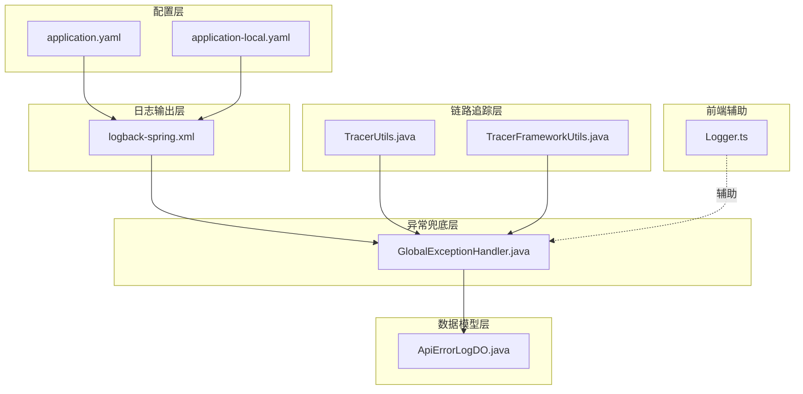
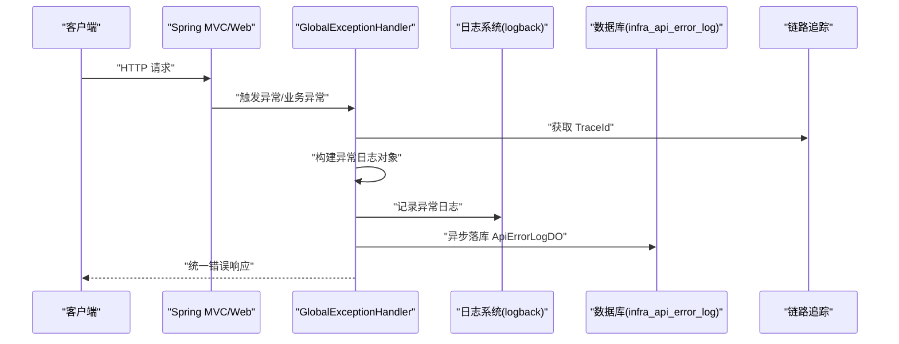
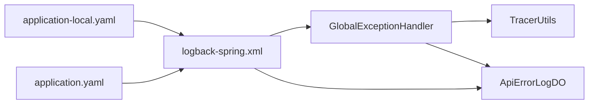

# 日志分析

<cite>
**本文引用的文件**
- [application.yaml](file://backend/qiji-server/src/main/resources/application.yaml)
- [application-local.yaml](file://backend/qiji-server/src/main/resources/application-local.yaml)
- [logback-spring.xml](file://backend/qiji-server/src/main/resources/logback-spring.xml)
- [GlobalExceptionHandler.java](file://backend/qiji-framework/qiji-spring-boot-starter-web/src/main/java/com/qiji/cps/framework/web/core/handler/GlobalExceptionHandler.java)
- [ApiErrorLogDO.java](file://backend/qiji-module-infra/src/main/java/com/qiji/cps/module/infra/dal/dataobject/logger/ApiErrorLogDO.java)
- [TracerUtils.java](file://backend/qiji-framework/qiji-common/src/main/java/com/qiji/cps/framework/common/util/monitor/TracerUtils.java)
- [TracerFrameworkUtils.java](file://backend/qiji-framework/qiji-spring-boot-starter-monitor/src/main/java/com/qiji/cps/framework/tracer/core/util/TracerFrameworkUtils.java)
- [Logger.ts](file://frontend/admin-vue3/src/utils/Logger.ts)
- [ruoyi-vue-pro.sql](file://backend/sql/sqlserver/ruoyi-vue-pro.sql)
</cite>

## 目录
1. [简介](#简介)
2. [项目结构](#项目结构)
3. [核心组件](#核心组件)
4. [架构总览](#架构总览)
5. [详细组件分析](#详细组件分析)
6. [依赖分析](#依赖分析)
7. [性能考量](#性能考量)
8. [故障排查指南](#故障排查指南)
9. [结论](#结论)
10. [附录](#附录)

## 简介
本技术文档面向 AgenticCPS 项目的日志分析与排障，围绕以下目标展开：
- 明确日志级别配置方法与适用场景，指导不同排查阶段选择合适的日志级别以获得最佳诊断信息。
- 总结关键日志定位技巧：异常堆栈跟踪分析、请求链路日志追踪、业务流程断点标记等。
- 提供错误信息解读指南：常见异常类型识别、错误码含义解析、错误上下文分析、根因定位技巧。
- 分享调试技巧：断点调试设置、性能分析工具使用、内存分析方法、网络抓包分析等。
- 给出完整的日志分析流程、工具使用指南与最佳实践。

## 项目结构
AgenticCPS 后端采用 Spring Boot + 多模块架构，日志体系由以下部分组成：
- 配置层：application.yaml、application-local.yaml 控制应用基础配置与日志级别。
- 日志输出层：logback-spring.xml 定义控制台与文件输出、异步写入与可选 SkyWalking 集成。
- 异常兜底层：GlobalExceptionHandler 将异常转换为统一响应并落盘 API 异常日志。
- 数据模型层：ApiErrorLogDO 定义异常日志持久化字段。
- 链路追踪层：TracerUtils、TracerFrameworkUtils 提供 TraceId 与异常 Span 标记能力。
- 前端辅助：Logger.ts 提供浏览器控制台彩色打印与对象展示能力，便于前端侧日志分析。

图表来源
- [application.yaml:1-362](file://backend/qiji-server/src/main/resources/application.yaml#L1-L362)
- [application-local.yaml:167-194](file://backend/qiji-server/src/main/resources/application-local.yaml#L167-L194)
- [logback-spring.xml:1-57](file://backend/qiji-server/src/main/resources/logback-spring.xml#L1-L57)
- [GlobalExceptionHandler.java:342-383](file://backend/qiji-framework/qiji-spring-boot-starter-web/src/main/java/com/qiji/cps/framework/web/core/handler/GlobalExceptionHandler.java#L342-L383)
- [ApiErrorLogDO.java:1-162](file://backend/qiji-module-infra/src/main/java/com/qiji/cps/module/infra/dal/dataobject/logger/ApiErrorLogDO.java#L1-L162)
- [TracerUtils.java:1-30](file://backend/qiji-framework/qiji-common/src/main/java/com/qiji/cps/framework/common/util/monitor/TracerUtils.java#L1-L30)
- [TracerFrameworkUtils.java:1-46](file://backend/qiji-framework/qiji-spring-boot-starter-monitor/src/main/java/com/qiji/cps/framework/tracer/core/util/TracerFrameworkUtils.java#L1-L46)
- [Logger.ts:1-101](file://frontend/admin-vue3/src/utils/Logger.ts#L1-L101)

章节来源
- [application.yaml:1-362](file://backend/qiji-server/src/main/resources/application.yaml#L1-L362)
- [application-local.yaml:167-194](file://backend/qiji-server/src/main/resources/application-local.yaml#L167-L194)
- [logback-spring.xml:1-57](file://backend/qiji-server/src/main/resources/logback-spring.xml#L1-L57)

## 核心组件
- 日志级别配置
  - application.yaml：全局基础配置，包含应用名、编码、缓存、接口文档、消息队列、AI 配置等。
  - application-local.yaml：本地开发环境配置，重点在于 logging.level 下的包级日志级别与 debug 标志。
- 日志输出与异步
  - logback-spring.xml：定义控制台与文件输出、滚动策略、异步 Appender、可选 SkyWalking 集成。
- 异常兜底与落库
  - GlobalExceptionHandler：统一异常处理，构建 ApiErrorLogCreateReqDTO 并异步落库。
  - ApiErrorLogDO：异常日志持久化字段，包含异常名、消息、根因、栈轨迹、类名、文件、方法、行号、请求上下文、TraceId 等。
- 链路追踪
  - TracerUtils：获取 TraceId。
  - TracerFrameworkUtils：将异常写入 Span 标记。
- 前端日志辅助
  - Logger.ts：浏览器控制台彩色打印、对象表格化展示，便于前端侧日志分析。

章节来源
- [GlobalExceptionHandler.java:342-383](file://backend/qiji-framework/qiji-spring-boot-starter-web/src/main/java/com/qiji/cps/framework/web/core/handler/GlobalExceptionHandler.java#L342-L383)
- [ApiErrorLogDO.java:1-162](file://backend/qiji-module-infra/src/main/java/com/qiji/cps/module/infra/dal/dataobject/logger/ApiErrorLogDO.java#L1-L162)
- [TracerUtils.java:1-30](file://backend/qiji-framework/qiji-common/src/main/java/com/qiji/cps/framework/common/util/monitor/TracerUtils.java#L1-L30)
- [TracerFrameworkUtils.java:1-46](file://backend/qiji-framework/qiji-spring-boot-starter-monitor/src/main/java/com/qiji/cps/framework/tracer/core/util/TracerFrameworkUtils.java#L1-L46)
- [Logger.ts:1-101](file://frontend/admin-vue3/src/utils/Logger.ts#L1-L101)

## 架构总览
下图展示了从请求进入、异常捕获、日志落库到链路追踪的关键交互：

图表来源
- [GlobalExceptionHandler.java:342-383](file://backend/qiji-framework/qiji-spring-boot-starter-web/src/main/java/com/qiji/cps/framework/web/core/handler/GlobalExceptionHandler.java#L342-L383)
- [ApiErrorLogDO.java:1-162](file://backend/qiji-module-infra/src/main/java/com/qiji/cps/module/infra/dal/dataobject/logger/ApiErrorLogDO.java#L1-L162)
- [logback-spring.xml:1-57](file://backend/qiji-server/src/main/resources/logback-spring.xml#L1-L57)
- [TracerUtils.java:1-30](file://backend/qiji-framework/qiji-common/src/main/java/com/qiji/cps/framework/common/util/monitor/TracerUtils.java#L1-L30)

## 详细组件分析

### 日志级别配置与适用场景
- 全局级别
  - root 级别：logback-spring.xml 中 root 级别默认 INFO，控制台输出与异步文件输出同时开启，兼顾可观测性与性能。
  - 调试标志：application.yaml 中 debug: false，如需开启可在本地临时改为 true。
- 包级级别
  - application-local.yaml 中针对各模块 Mapper 与业务包设置了 debug/INFO 级别，便于定位 SQL 与业务逻辑问题。
  - 示例要点：
    - 模块 Mapper：避免与全局异常处理器重复打印，部分 Mapper 设为 INFO。
    - 模块业务包：如 iot、ai、member、trade 等设为 debug，便于细化排查。
- 排查阶段建议
  - 初查：INFO 级别，关注异常与关键业务入口。
  - 复查：按模块提升至 DEBUG，聚焦 SQL 与业务流程。
  - 定位：仅对可疑包临时提升为 DEBUG，缩小范围后再恢复。

章节来源
- [logback-spring.xml:48-54](file://backend/qiji-server/src/main/resources/logback-spring.xml#L48-L54)
- [application.yaml](file://backend/qiji-server/src/main/resources/application.yaml#L362)
- [application-local.yaml:167-194](file://backend/qiji-server/src/main/resources/application-local.yaml#L167-L194)

### 关键日志定位技巧
- 异常堆栈跟踪分析
  - 全局异常处理器会提取异常名、消息、根因、完整栈轨迹，并记录异常发生的类名、文件、方法、行号，便于快速定位。
  - 建议：优先查看根因消息与首行栈帧，再逐步回溯调用链。
- 请求链路日志追踪
  - 通过 TracerUtils 获取 TraceId，贯穿请求生命周期，配合日志输出与数据库异常记录，形成闭环。
  - 建议：在关键业务入口、DAO 层、远程调用处显式输出 TraceId，便于跨进程串联。
- 业务流程断点标记
  - 在复杂流程中增加带 TraceId 的 INFO/DEBUG 日志断点，标注“开始/结束/分支/合并”，有助于还原执行路径。
- 前端日志辅助
  - 使用 Logger.ts 的彩色打印与对象表格化展示，快速筛选与对比关键字段。

章节来源
- [GlobalExceptionHandler.java:355-383](file://backend/qiji-framework/qiji-spring-boot-starter-web/src/main/java/com/qiji/cps/framework/web/core/handler/GlobalExceptionHandler.java#L355-L383)
- [ApiErrorLogDO.java:87-140](file://backend/qiji-module-infra/src/main/java/com/qiji/cps/module/infra/dal/dataobject/logger/ApiErrorLogDO.java#L87-L140)
- [TracerUtils.java:26-28](file://backend/qiji-framework/qiji-common/src/main/java/com/qiji/cps/framework/common/util/monitor/TracerUtils.java#L26-L28)
- [Logger.ts:58-98](file://frontend/admin-vue3/src/utils/Logger.ts#L58-L98)

### 错误信息解读指南
- 常见异常类型识别
  - 参数缺失/类型不匹配：MissingServletRequestParameterException、MethodArgumentTypeMismatchException。
  - 参数校验失败：MethodArgumentNotValidException、BindException、ConstraintViolationException。
  - 请求方法/媒体类型不支持：HttpRequestMethodNotSupportedException、HttpMediaTypeNotSupportedException。
  - 资源不存在：NoHandlerFoundException、NoResourceFoundException。
  - 权限不足：AccessDeniedException。
  - 业务异常 ServiceException：由业务模块抛出，携带业务错误码与消息。
- 错误码含义解析
  - 全局错误码：参考 GlobalErrorCodeConstants（在异常处理器中使用）。
  - 业务错误码区间：ServiceErrorCodeRange 定义业务模块错误码区间，便于区分模块与定位。
- 错误上下文分析
  - 请求 URL、方法、参数、IP、UA、TraceId、异常时间等均被记录，结合数据库表结构可快速还原现场。
- 根因定位技巧
  - 优先查看 exceptionRootCauseMessage 与 exceptionStackTrace。
  - 若为表不存在类异常，异常处理器会提示具体模块（报表、工作流、微信公众号、商城、ERP、CRM、支付、AI、IoT）并给出开启指引。

章节来源
- [GlobalExceptionHandler.java:78-119](file://backend/qiji-framework/qiji-spring-boot-starter-web/src/main/java/com/qiji/cps/framework/web/core/handler/GlobalExceptionHandler.java#L78-L119)
- [GlobalExceptionHandler.java:391-451](file://backend/qiji-framework/qiji-spring-boot-starter-web/src/main/java/com/qiji/cps/framework/web/core/handler/GlobalExceptionHandler.java#L391-L451)
- [ApiErrorLogDO.java:87-140](file://backend/qiji-module-infra/src/main/java/com/qiji/cps/module/infra/dal/dataobject/logger/ApiErrorLogDO.java#L87-L140)
- [ruoyi-vue-pro.sql:357-411](file://backend/sql/sqlserver/ruoyi-vue-pro.sql#L357-L411)

### 调试技巧分享
- 断点调试设置
  - 在可疑业务方法、DAO 层、远程调用前设置断点，观察入参与上下文。
  - 使用 IDE 条件断点，仅在特定 TraceId 或参数条件下命中。
- 性能分析工具使用
  - 使用 Spring Boot Admin 与 Actuator 暴露的端点监控应用健康与指标。
  - 结合异步日志与慢 SQL 监控（application-local.yaml 中 druid 慢 SQL 配置）定位热点。
- 内存分析方法
  - 通过 JVM 参数与可视化工具（如 JProfiler、Arthas）观察堆栈与 GC 行为，结合异常日志中的内存相关线索定位。
- 网络抓包分析
  - 使用 Wireshark/Fiddler/Charles 抓取请求/响应，核对请求参数、头部、状态码与异常响应体。
  - 结合 TraceId 交叉验证前后端链路一致性。

章节来源
- [application-local.yaml:14-47](file://backend/qiji-server/src/main/resources/application-local.yaml#L14-L47)
- [application.yaml:146-151](file://backend/qiji-server/src/main/resources/application.yaml#L146-L151)

## 依赖分析
- 组件耦合
  - GlobalExceptionHandler 依赖 TracerUtils 获取 TraceId，依赖 Servlet 工具类获取请求上下文，最终将异常信息持久化到 ApiErrorLogDO。
  - 日志输出由 logback-spring.xml 驱动，异步 Appender 提升吞吐，避免阻塞主线程。
- 外部集成
  - SkyWalking 日志 Appender 可选启用，实现日志中心化采集。
  - Druid 监控与慢 SQL 记录，辅助数据库层面的性能与异常定位。

图表来源
- [GlobalExceptionHandler.java:342-383](file://backend/qiji-framework/qiji-spring-boot-starter-web/src/main/java/com/qiji/cps/framework/web/core/handler/GlobalExceptionHandler.java#L342-L383)
- [ApiErrorLogDO.java:1-162](file://backend/qiji-module-infra/src/main/java/com/qiji/cps/module/infra/dal/dataobject/logger/ApiErrorLogDO.java#L1-L162)
- [logback-spring.xml:1-57](file://backend/qiji-server/src/main/resources/logback-spring.xml#L1-L57)
- [application-local.yaml:167-194](file://backend/qiji-server/src/main/resources/application-local.yaml#L167-L194)
- [application.yaml:146-151](file://backend/qiji-server/src/main/resources/application.yaml#L146-L151)

章节来源
- [GlobalExceptionHandler.java:342-383](file://backend/qiji-framework/qiji-spring-boot-starter-web/src/main/java/com/qiji/cps/framework/web/core/handler/GlobalExceptionHandler.java#L342-L383)
- [logback-spring.xml:1-57](file://backend/qiji-server/src/main/resources/logback-spring.xml#L1-L57)

## 性能考量
- 异步日志
  - logback-spring.xml 使用 AsyncAppender，降低 IO 对主线程的影响，提高吞吐。
- 队列与丢弃策略
  - discardingThreshold 与 queueSize 可根据业务峰值调优，避免在高并发下丢失关键日志。
- 输出策略
  - 控制台高亮与文件滚动策略兼顾可读性与磁盘占用，建议生产环境开启异步与滚动。
- 数据库落库
  - 异常落库采用异步 API，避免阻塞请求线程，但需关注数据库写入延迟与容量。

章节来源
- [logback-spring.xml:31-35](file://backend/qiji-server/src/main/resources/logback-spring.xml#L31-L35)

## 故障排查指南
- 快速定位步骤
  - 确认日志级别：按模块临时提升至 DEBUG，缩小范围后恢复。
  - 查找 TraceId：从异常响应或日志中提取 TraceId，串联前后端日志。
  - 核对异常字段：异常名、根因消息、栈轨迹、类名/方法/行号、请求 URL/方法/参数/IP/UA。
  - 检查模块表结构：若出现“表不存在”类异常，依据异常处理器提示开启对应模块。
- 常见问题与对策
  - 参数缺失/类型不匹配：修正客户端请求或接口契约。
  - 权限不足：检查鉴权与角色授权。
  - 业务异常：依据 ServiceException 的错误码与消息，定位业务规则或数据状态。
  - 数据库异常：结合慢 SQL 与异常栈，定位 SQL 与事务问题。

章节来源
- [GlobalExceptionHandler.java:78-119](file://backend/qiji-framework/qiji-spring-boot-starter-web/src/main/java/com/qiji/cps/framework/web/core/handler/GlobalExceptionHandler.java#L78-L119)
- [GlobalExceptionHandler.java:391-451](file://backend/qiji-framework/qiji-spring-boot-starter-web/src/main/java/com/qiji/cps/framework/web/core/handler/GlobalExceptionHandler.java#L391-L451)
- [application-local.yaml:14-47](file://backend/qiji-server/src/main/resources/application-local.yaml#L14-L47)

## 结论
通过规范的日志级别配置、完善的异常兜底与落库、清晰的链路追踪与前端辅助工具，AgenticCPS 形成了覆盖请求全生命周期的日志分析体系。遵循本文提供的流程与技巧，可在不同排查阶段高效定位问题，提升排障效率与稳定性。

## 附录
- 日志字段说明（来源于 ApiErrorLogDO 与异常处理器）
  - 异常相关：异常名、异常消息、根因消息、栈轨迹、类名、文件、方法、行号。
  - 请求相关：请求方法、URL、参数、IP、UA。
  - 追踪相关：TraceId、应用名、异常时间。
  - 处理相关：处理状态、处理时间、处理人。

章节来源
- [ApiErrorLogDO.java:87-160](file://backend/qiji-module-infra/src/main/java/com/qiji/cps/module/infra/dal/dataobject/logger/ApiErrorLogDO.java#L87-L160)
- [GlobalExceptionHandler.java:355-383](file://backend/qiji-framework/qiji-spring-boot-starter-web/src/main/java/com/qiji/cps/framework/web/core/handler/GlobalExceptionHandler.java#L355-L383)
- [ruoyi-vue-pro.sql:357-411](file://backend/sql/sqlserver/ruoyi-vue-pro.sql#L357-L411)