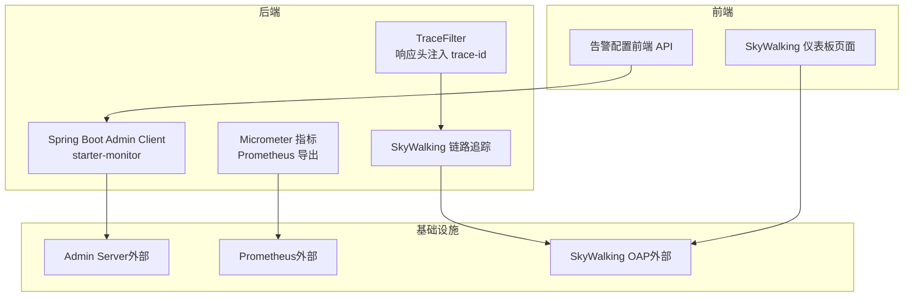
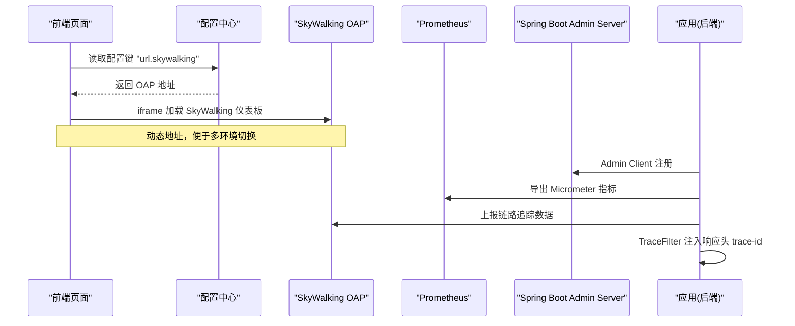
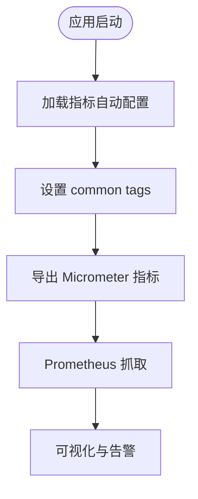
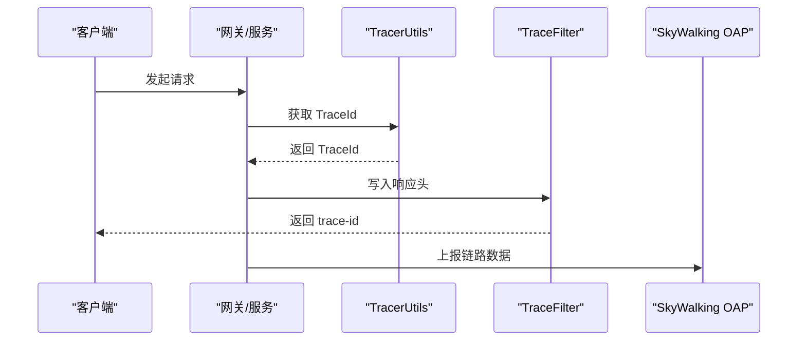
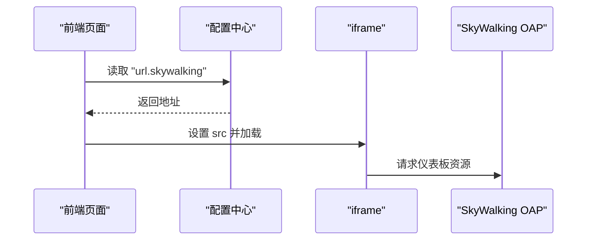
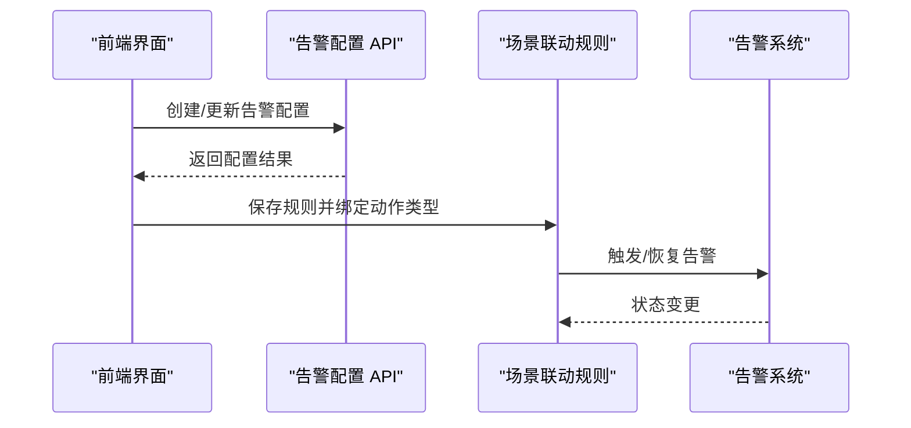
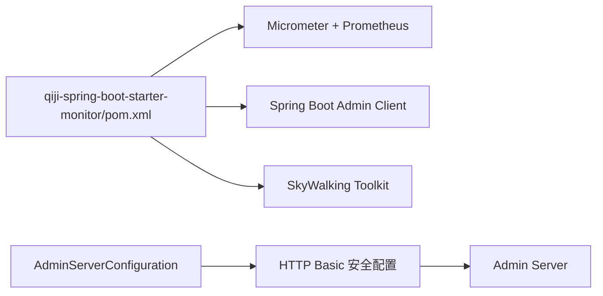

# 系统监控

<cite>
**本文引用的文件**   
- [TraceFilter.java](file://backend/qiji-framework/qiji-spring-boot-starter-monitor/src/main/java/com/qiji/cps/framework/tracer/core/filter/TraceFilter.java)
- [QijiMetricsAutoConfiguration.java](file://backend/qiji-framework/qiji-spring-boot-starter-monitor/src/main/java/com/qiji/cps/framework/trace/config/QijiMetricsAutoConfiguration.java)
- [qiji-spring-boot-starter-monitor/pom.xml](file://backend/qiji-framework/qiji-spring-boot-starter-monitor/pom.xml)
- [AdminServerConfiguration.java](file://backend/qiji-module-infra/src/main/java/com/qiji/cps/module/infra/framework/monitor/config/AdminServerConfiguration.java)
- [TracerUtils.java](file://backend/qiji-framework/qiji-common/src/main/java/com/qiji/cps/framework/common/util/monitor/TracerUtils.java)
- [index.vue（SkyWalking 仪表板）](file://frontend/admin-vue3/src/views/infra/skywalking/index.vue)
- [AlertConfig API（前端）](file://frontend/admin-vue3/src/api/iot/alert/config/index.ts)
- [ActionSection（场景联动执行器）](file://frontend/admin-vue3/src/views/iot/rule/scene/form/sections/ActionSection.vue)
- [ruoyi-vue-pro.sql（MySQL 菜单）](file://backend/sql/mysql/ruoyi-vue-pro.sql)
- [ruoyi-vue-pro.sql（PostgreSQL 菜单）](file://backend/sql/postgresql/ruoyi-vue-pro.sql)
- [docker-compose.yml（部署编排）](file://backend/script/docker/docker-compose.yml)
</cite>

## 目录
1. [简介](#简介)
2. [项目结构](#项目结构)
3. [核心组件](#核心组件)
4. [架构总览](#架构总览)
5. [详细组件分析](#详细组件分析)
6. [依赖分析](#依赖分析)
7. [性能考虑](#性能考虑)
8. [故障排查指南](#故障排查指南)
9. [结论](#结论)
10. [附录](#附录)

## 简介
本指南面向 AgenticCPS 企业级应用，围绕监控体系的“指标采集—告警配置—性能诊断—优化方案”闭环，结合后端监控组件（Spring Boot Admin、Micrometer+Prometheus、SkyWalking）、前端监控入口（SkyWalking 仪表板）以及物联网告警配置能力，提供可落地的监控配置与管理实践，帮助构建稳定、可观测、可预警的生产环境。

## 项目结构
AgenticCPS 的监控能力由以下部分组成：
- 后端监控组件（starter-monitor）：提供链路追踪、指标采集、客户端注册到 Admin Server 的能力
- 前端监控入口：通过 iframe 集成 SkyWalking 仪表板，并支持从配置中心动态获取地址
- 物联网告警配置：提供告警配置的增删改查与在规则场景中的触发/恢复动作集成
- 部署编排：通过 docker-compose 提供本地/开发环境的快速部署

图表来源
- [qiji-spring-boot-starter-monitor/pom.xml:18-76](file://backend/qiji-framework/qiji-spring-boot-starter-monitor/pom.xml#L18-L76)
- [AdminServerConfiguration.java:29-107](file://backend/qiji-module-infra/src/main/java/com/qiji/cps/module/infra/framework/monitor/config/AdminServerConfiguration.java#L29-L107)
- [TraceFilter.java:17-33](file://backend/qiji-framework/qiji-spring-boot-starter-monitor/src/main/java/com/qiji/cps/framework/tracer/core/filter/TraceFilter.java#L17-L33)
- [index.vue（SkyWalking 仪表板）:1-27](file://frontend/admin-vue3/src/views/infra/skywalking/index.vue#L1-L27)
- [AlertConfig API（前端）:1-46](file://frontend/admin-vue3/src/api/iot/alert/config/index.ts#L1-L46)

章节来源
- [qiji-spring-boot-starter-monitor/pom.xml:18-76](file://backend/qiji-framework/qiji-spring-boot-starter-monitor/pom.xml#L18-L76)
- [AdminServerConfiguration.java:29-107](file://backend/qiji-module-infra/src/main/java/com/qiji/cps/module/infra/framework/monitor/config/AdminServerConfiguration.java#L29-L107)
- [TraceFilter.java:17-33](file://backend/qiji-framework/qiji-spring-boot-starter-monitor/src/main/java/com/qiji/cps/framework/tracer/core/filter/TraceFilter.java#L17-L33)
- [index.vue（SkyWalking 仪表板）:1-27](file://frontend/admin-vue3/src/views/infra/skywalking/index.vue#L1-L27)
- [AlertConfig API（前端）:1-46](file://frontend/admin-vue3/src/api/iot/alert/config/index.ts#L1-L46)

## 核心组件
- 指标与客户端注册
  - 通过 Micrometer + Prometheus 导出 JVM/应用指标，便于 Prometheus 抓取
  - 通过 Spring Boot Admin Client 将实例注册到 Admin Server，统一运维视图
- 链路追踪
  - 通过 SkyWalking Toolkit 注入 TraceId，TraceFilter 将 TraceId 写入响应头，便于跨服务定位
- 前端监控入口
  - SkyWalking 仪表板通过 iframe 加载，地址来自配置中心键值，支持动态切换
- 物联网告警配置
  - 提供告警配置的分页查询、详情、创建、更新、删除与简单列表
  - 场景联动规则可将“触发告警/恢复告警”作为执行器动作，绑定具体告警配置

章节来源
- [QijiMetricsAutoConfiguration.java:16-27](file://backend/qiji-framework/qiji-spring-boot-starter-monitor/src/main/java/com/qiji/cps/framework/trace/config/QijiMetricsAutoConfiguration.java#L16-L27)
- [qiji-spring-boot-starter-monitor/pom.xml:66-75](file://backend/qiji-framework/qiji-spring-boot-starter-monitor/pom.xml#L66-L75)
- [AdminServerConfiguration.java:29-107](file://backend/qiji-module-infra/src/main/java/com/qiji/cps/module/infra/framework/monitor/config/AdminServerConfiguration.java#L29-L107)
- [TracerUtils.java:12-30](file://backend/qiji-framework/qiji-common/src/main/java/com/qiji/cps/framework/common/util/monitor/TracerUtils.java#L12-L30)
- [TraceFilter.java:17-33](file://backend/qiji-framework/qiji-spring-boot-starter-monitor/src/main/java/com/qiji/cps/framework/tracer/core/filter/TraceFilter.java#L17-L33)
- [index.vue（SkyWalking 仪表板）:1-27](file://frontend/admin-vue3/src/views/infra/skywalking/index.vue#L1-L27)
- [AlertConfig API（前端）:16-46](file://frontend/admin-vue3/src/api/iot/alert/config/index.ts#L16-L46)
- [ActionSection（场景联动执行器）:179-255](file://frontend/admin-vue3/src/views/iot/rule/scene/form/sections/ActionSection.vue#L179-L255)

## 架构总览
下图展示监控体系在系统中的位置与交互路径：后端应用通过 Admin Client 注册到 Admin Server；指标通过 Micrometer 导出至 Prometheus；链路追踪通过 SkyWalking Toolkit 与 TraceFilter 协同工作；前端 SkyWalking 仪表板通过配置中心动态加载 OAP 地址；物联网告警配置与场景联动规则打通“触发/恢复”动作。

图表来源
- [index.vue（SkyWalking 仪表板）:16-26](file://frontend/admin-vue3/src/views/infra/skywalking/index.vue#L16-L26)
- [AdminServerConfiguration.java:29-107](file://backend/qiji-module-infra/src/main/java/com/qiji/cps/module/infra/framework/monitor/config/AdminServerConfiguration.java#L29-L107)
- [qiji-spring-boot-starter-monitor/pom.xml:66-75](file://backend/qiji-framework/qiji-spring-boot-starter-monitor/pom.xml#L66-L75)
- [TraceFilter.java:24-31](file://backend/qiji-framework/qiji-spring-boot-starter-monitor/src/main/java/com/qiji/cps/framework/tracer/core/filter/TraceFilter.java#L24-L31)

## 详细组件分析

### 指标与监控端点（Micrometer + Prometheus）
- 自动配置
  - 通过条件注解启用指标配置，支持通过配置项禁用
  - 统一添加 common tags，便于多实例聚合与筛选
- 导出与抓取
  - 依赖 Micrometer Prometheus Registry，暴露 /actuator/prometheus 端点
  - Prometheus 以固定间隔抓取，形成时序数据
- 最佳实践
  - 为关键业务维度打标签（如模块、版本），提升查询效率
  - 结合 Admin Server 观察实例健康度与 JVM 指标，辅助容量规划

图表来源
- [QijiMetricsAutoConfiguration.java:16-27](file://backend/qiji-framework/qiji-spring-boot-starter-monitor/src/main/java/com/qiji/cps/framework/trace/config/QijiMetricsAutoConfiguration.java#L16-L27)
- [qiji-spring-boot-starter-monitor/pom.xml:66-70](file://backend/qiji-framework/qiji-spring-boot-starter-monitor/pom.xml#L66-L70)

章节来源
- [QijiMetricsAutoConfiguration.java:16-27](file://backend/qiji-framework/qiji-spring-boot-starter-monitor/src/main/java/com/qiji/cps/framework/trace/config/QijiMetricsAutoConfiguration.java#L16-L27)
- [qiji-spring-boot-starter-monitor/pom.xml:66-75](file://backend/qiji-framework/qiji-spring-boot-starter-monitor/pom.xml#L66-L75)

### 链路追踪与请求追踪（SkyWalking + TraceFilter）
- 工具与过滤器
  - TracerUtils 提供获取 TraceId 的静态方法
  - TraceFilter 在响应阶段将 TraceId 写入响应头，便于前端或下游系统关联
- 集成方式
  - 通过 SkyWalking Toolkit 注入 TraceId，结合 TraceFilter 形成端到端追踪
- 最佳实践
  - 在网关/服务间传递 trace-id，保证跨进程链路完整
  - 将 trace-id 作为日志上下文字段，提升问题定位效率

图表来源
- [TracerUtils.java:12-30](file://backend/qiji-framework/qiji-common/src/main/java/com/qiji/cps/framework/common/util/monitor/TracerUtils.java#L12-L30)
- [TraceFilter.java:17-33](file://backend/qiji-framework/qiji-spring-boot-starter-monitor/src/main/java/com/qiji/cps/framework/tracer/core/filter/TraceFilter.java#L17-L33)

章节来源
- [TracerUtils.java:12-30](file://backend/qiji-framework/qiji-common/src/main/java/com/qiji/cps/framework/common/util/monitor/TracerUtils.java#L12-L30)
- [TraceFilter.java:17-33](file://backend/qiji-framework/qiji-spring-boot-starter-monitor/src/main/java/com/qiji/cps/framework/tracer/core/filter/TraceFilter.java#L17-L33)

### 前端监控入口（SkyWalking 仪表板）
- 动态地址
  - 通过配置中心键值动态设置 SkyWalking OAP 地址，支持多环境切换
- 页面集成
  - 采用 iframe 嵌入，减少重复开发，统一入口体验

图表来源
- [index.vue（SkyWalking 仪表板）:16-26](file://frontend/admin-vue3/src/views/infra/skywalking/index.vue#L16-L26)

章节来源
- [index.vue（SkyWalking 仪表板）:1-27](file://frontend/admin-vue3/src/views/infra/skywalking/index.vue#L1-L27)

### 物联网告警配置与场景联动
- 告警配置
  - 提供分页查询、详情、创建、更新、删除、简单列表等接口
  - 字段包含配置编号、名称、描述、级别、状态、关联场景联动规则、接收人与接收类型等
- 场景联动动作
  - 支持“触发告警/恢复告警”动作类型，绑定具体告警配置 ID
  - 动作类型变更时，清理无关配置，保持数据一致性

图表来源
- [AlertConfig API（前端）:16-46](file://frontend/admin-vue3/src/api/iot/alert/config/index.ts#L16-L46)
- [ActionSection（场景联动执行器）:179-255](file://frontend/admin-vue3/src/views/iot/rule/scene/form/sections/ActionSection.vue#L179-L255)

章节来源
- [AlertConfig API（前端）:1-46](file://frontend/admin-vue3/src/api/iot/alert/config/index.ts#L1-L46)
- [ActionSection（场景联动执行器）:179-255](file://frontend/admin-vue3/src/views/iot/rule/scene/form/sections/ActionSection.vue#L179-L255)
- [ruoyi-vue-pro.sql（MySQL 菜单）:2320-2325](file://backend/sql/mysql/ruoyi-vue-pro.sql#L2320-L2325)
- [ruoyi-vue-pro.sql（PostgreSQL 菜单）:2711-2716](file://backend/sql/postgresql/ruoyi-vue-pro.sql#L2711-L2716)

## 依赖分析
- starter-monitor 依赖
  - Micrometer Prometheus Registry：指标导出
  - Spring Boot Admin Client：实例注册
  - SkyWalking Toolkit：链路追踪
- Admin Server 安全与过滤链
  - 独立的 SecurityFilterChain，使用 HTTP Basic 认证保护 Admin Server 端点
  - 与现有 Token 认证机制隔离，避免相互影响

图表来源
- [qiji-spring-boot-starter-monitor/pom.xml:18-76](file://backend/qiji-framework/qiji-spring-boot-starter-monitor/pom.xml#L18-L76)
- [AdminServerConfiguration.java:29-107](file://backend/qiji-module-infra/src/main/java/com/qiji/cps/module/infra/framework/monitor/config/AdminServerConfiguration.java#L29-L107)

章节来源
- [qiji-spring-boot-starter-monitor/pom.xml:18-76](file://backend/qiji-framework/qiji-spring-boot-starter-monitor/pom.xml#L18-L76)
- [AdminServerConfiguration.java:29-107](file://backend/qiji-module-infra/src/main/java/com/qiji/cps/module/infra/framework/monitor/config/AdminServerConfiguration.java#L29-L107)

## 性能考虑
- 指标与采样
  - 控制自定义指标数量与标签基数，避免高基数导致的内存与存储压力
  - 对热点指标进行降采样或聚合，保留关键阈值型指标
- 链路追踪
  - 合理设置采样率，避免对高吞吐场景造成额外开销
  - 将 trace-id 透传至下游，减少跨服务定位成本
- 监控系统负载
  - Prometheus 抓取间隔与超时合理配置，避免集中拉取引发抖动
  - Admin Server 与 OAP 的资源预留应满足峰值实例数与数据量
- 前端仪表板
  - SkyWalking 仪表板查询范围与时间窗口限制，避免一次性拉取过多数据

## 故障排查指南
- 无法访问 SkyWalking 仪表板
  - 检查配置中心键值 "url.skywalking" 是否正确
  - 确认前端页面已成功读取并设置 iframe 的 src
- Admin Server 无法发现实例
  - 检查 Admin Client 的用户名/密码与 Admin Server 的安全配置是否一致
  - 确认实例注册端点未被 CSRF 忽略策略影响
- 指标缺失或异常
  - 检查指标自动配置是否启用，common tags 是否正确设置
  - 确认 Prometheus 已成功抓取 /actuator/prometheus
- 链路追踪异常
  - 检查 TraceFilter 是否生效，响应头是否包含 trace-id
  - 确认 SkyWalking Agent 正常注入，OAP 可达

章节来源
- [index.vue（SkyWalking 仪表板）:16-26](file://frontend/admin-vue3/src/views/infra/skywalking/index.vue#L16-L26)
- [AdminServerConfiguration.java:57-105](file://backend/qiji-module-infra/src/main/java/com/qiji/cps/module/infra/framework/monitor/config/AdminServerConfiguration.java#L57-L105)
- [QijiMetricsAutoConfiguration.java:16-27](file://backend/qiji-framework/qiji-spring-boot-starter-monitor/src/main/java/com/qiji/cps/framework/trace/config/QijiMetricsAutoConfiguration.java#L16-L27)
- [TraceFilter.java:24-31](file://backend/qiji-framework/qiji-spring-boot-starter-monitor/src/main/java/com/qiji/cps/framework/tracer/core/filter/TraceFilter.java#L24-L31)

## 结论
AgenticCPS 的监控体系以“指标可观测 + 链路可追踪 + 实例可治理 + 告警可编排”为核心，结合 Spring Boot Admin、Micrometer+Prometheus、SkyWalking 与前端 SkyWalking 仪表板，形成覆盖全栈的监控闭环。配合物联网告警配置与场景联动，能够快速构建企业级的监控与告警能力，支撑业务稳定运行与持续优化。

## 附录
- 部署与环境
  - 使用 docker-compose 快速搭建本地/开发环境，便于验证监控链路
- 菜单与权限
  - MySQL/PostgreSQL 初始化脚本中包含“告警中心/告警配置”菜单与权限，便于在后台管理界面中进行导航与授权

章节来源
- [docker-compose.yml（部署编排）](file://backend/script/docker/docker-compose.yml)
- [ruoyi-vue-pro.sql（MySQL 菜单）:2320-2325](file://backend/sql/mysql/ruoyi-vue-pro.sql#L2320-L2325)
- [ruoyi-vue-pro.sql（PostgreSQL 菜单）:2711-2716](file://backend/sql/postgresql/ruoyi-vue-pro.sql#L2711-L2716)