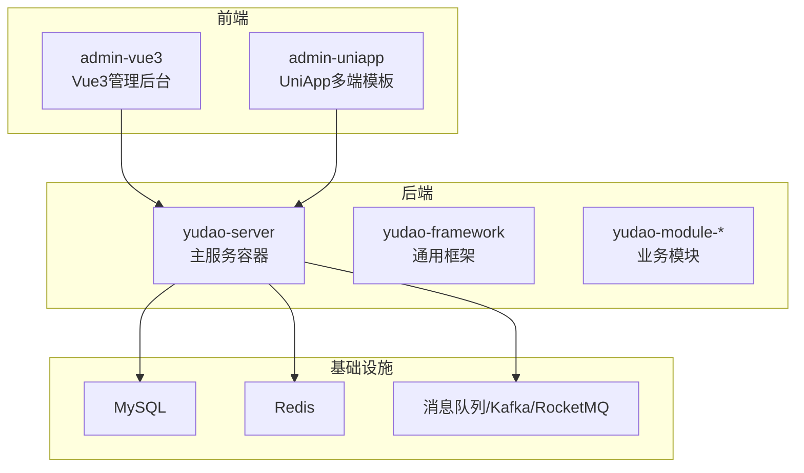
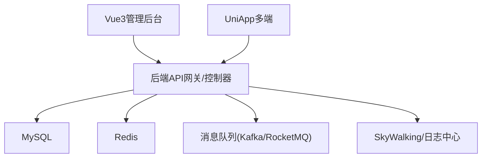
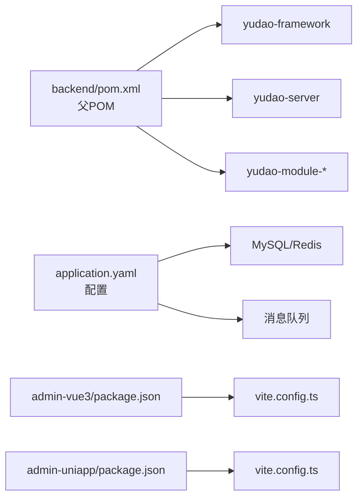
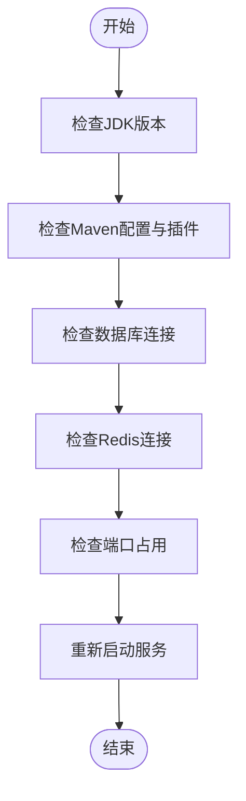
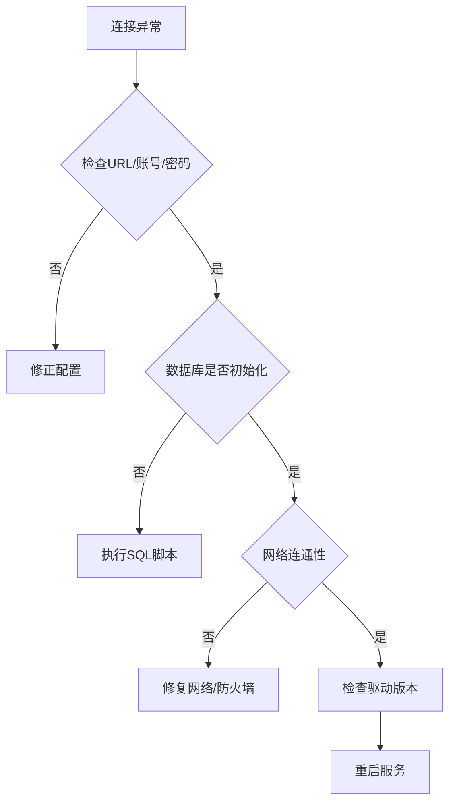
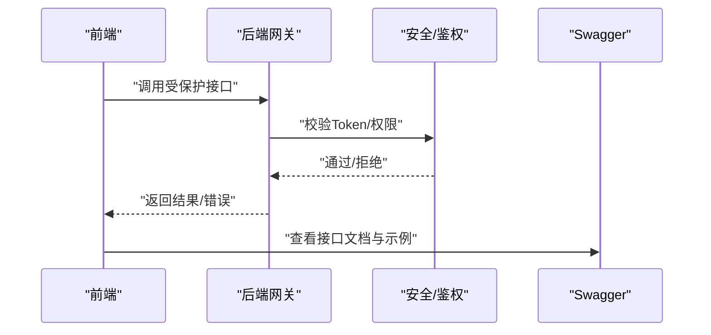
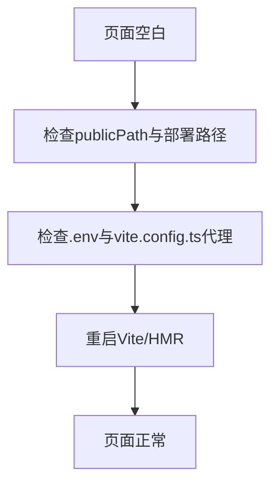

# 常见问题解答

<cite>
**本文引用的文件**
- [README.md](file://README.md)
- [backend/pom.xml](file://backend/pom.xml)
- [backend/yudao-server/src/main/resources/application.yaml](file://backend/yudao-server/src/main/resources/application.yaml)
- [backend/script/docker/docker.env](file://backend/script/docker/docker.env)
- [frontend/admin-uniapp/package.json](file://frontend/admin-uniapp/package.json)
- [frontend/admin-uniapp/vite.config.ts](file://frontend/admin-uniapp/vite.config.ts)
- [frontend/admin-uniapp/env/.env.development](file://frontend/admin-uniapp/env/.env.development)
- [frontend/admin-vue3/package.json](file://frontend/admin-vue3/package.json)
- [frontend/admin-vue3/vite.config.ts](file://frontend/admin-vue3/vite.config.ts)
- [agent_improvement/sdk_demo/dataoke-sdk-java/pom.xml](file://agent_improvement/sdk_demo/dataoke-sdk-java/pom.xml)
</cite>

## 目录
1. [简介](#简介)
2. [项目结构](#项目结构)
3. [核心组件](#核心组件)
4. [架构总览](#架构总览)
5. [详细组件分析](#详细组件分析)
6. [依赖关系分析](#依赖关系分析)
7. [性能考虑](#性能考虑)
8. [故障排查指南](#故障排查指南)
9. [结论](#结论)
10. [附录](#附录)

## 简介
本FAQ面向AgenticCPS项目开发人员，聚焦后端Spring Boot、前端Vue与UniApp、数据库与容器化部署等常见问题，提供症状、原因分析、解决步骤与预防措施，帮助快速定位与解决问题。

## 项目结构
AgenticCPS采用前后端分离架构：
- 后端：基于Spring Boot多模块工程，包含框架、模块与服务端容器
- 前端：提供Vue3管理后台与UniApp移动端模板
- 数据库与中间件：MySQL、Redis、消息队列等
- 容器化：提供Docker环境变量与Compose样例

**章节来源**
- [README.md: 267-302:267-302](file://README.md#L267-L302)
- [backend/pom.xml: 10-24:10-24](file://backend/pom.xml#L10-L24)

## 核心组件
- 后端核心：Spring Boot 3.5.9、MyBatis Plus、Redisson、Flowable、Quartz、SkyWalking
- 前端核心：Vue 3 + Element Plus、UniApp 3、Vite、TypeScript
- 数据库：MySQL（支持8种方言SQL脚本）
- 安全与监控：Spring Security、Actuator、Admin、链路追踪

**章节来源**
- [README.md: 286-302:286-302](file://README.md#L286-L302)
- [backend/pom.xml: 30-44:30-44](file://backend/pom.xml#L30-L44)

## 架构总览
后端通过统一的Yudao框架提供安全、缓存、权限、多租户、定时任务、消息队列、监控等能力；前端通过HTTP与WebSocket与后端交互；数据库与缓存支撑业务与会话。

**章节来源**
- [README.md: 229-249:229-249](file://README.md#L229-L249)
- [backend/yudao-server/src/main/resources/application.yaml: 146-225:146-225](file://backend/yudao-server/src/main/resources/application.yaml#L146-L225)

## 详细组件分析

### 后端启动失败排查
- 症状
  - 启动报错、端口占用、找不到主类、依赖冲突
- 可能原因
  - JDK版本不符（要求17或21）
  - Maven编译插件配置缺失或版本不匹配
  - 数据库/Redis连接未就绪
  - 端口被占用
- 解决步骤
  - 确认JDK版本与pom一致
  - 清理并重新编译：执行清理与编译生命周期
  - 检查application.yaml中的数据库与Redis配置
  - 检查端口占用并调整server.port
  - 使用Docker Compose启动依赖服务
- 预防措施
  - 使用统一的Maven仓库镜像
  - 在IDE中使用正确的JDK与Maven版本
  - 启动前先拉起MySQL与Redis

**章节来源**
- [README.md: 307-316:307-316](file://README.md#L307-L316)
- [backend/pom.xml: 30-44:30-44](file://backend/pom.xml#L30-L44)
- [backend/yudao-server/src/main/resources/application.yaml: 32-38:32-38](file://backend/yudao-server/src/main/resources/application.yaml#L32-L38)

### 数据库连接配置问题
- 症状
  - 连接超时、认证失败、驱动缺失
- 可能原因
  - JDBC URL、用户名、密码错误
  - MySQL版本与驱动不匹配
  - 未初始化数据库脚本
- 解决步骤
  - 校验application.yaml中的数据源配置
  - 使用提供的SQL脚本初始化数据库
  - 确认网络连通与防火墙放行
  - 如使用Docker，参考docker.env中的变量
- 预防措施
  - 使用Docker Compose统一拉起数据库
  - 在CI中增加数据库可用性检查

**章节来源**
- [backend/yudao-server/src/main/resources/application.yaml: 66-82:66-82](file://backend/yudao-server/src/main/resources/application.yaml#L66-L82)
- [backend/script/docker/docker.env: 1-13:1-13](file://backend/script/docker/docker.env#L1-L13)

### API接口调用异常诊断
- 症状
  - 401/403鉴权失败、跨域问题、接口返回空或异常
- 可能原因
  - 未登录或Token失效
  - CORS未配置或路径不匹配
  - 后端未正确暴露Swagger或接口文档
- 解决步骤
  - 确认登录态与权限
  - 检查后端CORS与安全配置
  - 通过Swagger UI核对接口路径与参数
- 预防措施
  - 统一在application.yaml中配置安全白名单
  - 前端固定后端域名与前缀

**章节来源**
- [backend/yudao-server/src/main/resources/application.yaml: 281-290:281-290](file://backend/yudao-server/src/main/resources/application.yaml#L281-L290)
- [backend/yudao-server/src/main/resources/application.yaml: 41-54:41-54](file://backend/yudao-server/src/main/resources/application.yaml#L41-L54)

### 前端页面加载错误
- 症状
  - 页面空白、静态资源404、HMR热更新失败
- 可能原因
  - Vite代理未正确转发、端口冲突
  - 资源路径与publicPath不一致
  - 依赖安装不完整或版本冲突
- 解决步骤
  - 检查.env与vite.config.ts中的代理与端口
  - 确认publicPath与实际部署路径一致
  - 使用包管理器安装依赖并清理缓存
- 预防措施
  - 使用统一的Node与包管理器版本
  - 在CI中执行类型检查与构建

**章节来源**
- [frontend/admin-uniapp/vite.config.ts: 185-200:185-200](file://frontend/admin-uniapp/vite.config.ts#L185-L200)
- [frontend/admin-uniapp/env/.env.development: 1-10:1-10](file://frontend/admin-uniapp/env/.env.development#L1-L10)
- [frontend/admin-vue3/vite.config.ts: 27-40:27-40](file://frontend/admin-vue3/vite.config.ts#L27-L40)

### Maven依赖冲突
- 症状
  - 编译报错、找不到符号、MapStruct/Lombok/编译器处理器冲突
- 可能原因
  - 版本不一致、重复依赖、传递依赖冲突
- 解决步骤
  - 使用dependencyManagement统一版本
  - 显式声明冲突依赖并排除传递依赖
  - 清理本地仓库缓存并重新下载
- 预防措施
  - 在父POM中集中管理版本
  - 使用flatten-maven-plugin统一版本

**章节来源**
- [backend/pom.xml: 46-56:46-56](file://backend/pom.xml#L46-L56)
- [backend/pom.xml: 74-104:74-104](file://backend/pom.xml#L74-L104)

### Spring Boot配置问题
- 症状
  - Profile未生效、Bean循环依赖、缓存未命中
- 可能原因
  - active profile错误、循环依赖未允许、缓存类型未启用
- 解决步骤
  - 检查profiles.active与对应配置文件
  - 允许循环依赖或重构依赖关系
  - 启用Redis缓存并配置TTL
- 预防措施
  - 在application.yaml中集中配置常用参数
  - 使用环境变量区分开发/测试/生产

**章节来源**
- [backend/yudao-server/src/main/resources/application.yaml: 5-10:5-10](file://backend/yudao-server/src/main/resources/application.yaml#L5-L10)
- [backend/yudao-server/src/main/resources/application.yaml: 26-31:26-31](file://backend/yudao-server/src/main/resources/application.yaml#L26-L31)

### Vue前端编译错误
- 症状
  - 类型检查失败、打包体积过大、Chunk拆分不合理
- 可能原因
  - TypeScript版本不匹配、第三方库未声明类型、依赖未优化
- 解决步骤
  - 执行类型检查并修复错误
  - 使用manualChunks拆分大依赖（如echarts、form-create）
  - 关闭不必要的SourceMap与Console
- 预防措施
  - 在CI中执行类型检查与构建
  - 使用统一的TypeScript与Vite版本

**章节来源**
- [frontend/admin-vue3/package.json: 155-158:155-158](file://frontend/admin-vue3/package.json#L155-L158)
- [frontend/admin-vue3/vite.config.ts: 76-84:76-84](file://frontend/admin-vue3/vite.config.ts#L76-L84)

### UniApp多端兼容性问题
- 症状
  - 某端编译失败、API不可用、样式差异
- 可能原因
  - 平台差异API未封装、组件未按平台引入、分包配置不当
- 解决步骤
  - 使用平台插件与manifest同步插件
  - 按平台引入组件与API，避免跨端不兼容代码
  - 合理配置分包与异步跨包引用
- 预防措施
  - 在vite.config.ts中启用平台与布局插件
  - 使用类型声明文件辅助开发

**章节来源**
- [frontend/admin-uniapp/vite.config.ts: 67-107:67-107](file://frontend/admin-uniapp/vite.config.ts#L67-L107)
- [frontend/admin-uniapp/vite.config.ts: 147-154:147-154](file://frontend/admin-uniapp/vite.config.ts#L147-L154)

### Java SDK依赖问题（示例：dataoke-sdk-java）
- 症状
  - 依赖版本过低、编译失败、运行时报错
- 可能原因
  - Spring Boot 2.2.5与高版本依赖不兼容
  - Java版本过低（1.8）
- 解决步骤
  - 升级Spring Boot版本或保持与项目一致
  - 升级Java版本至17/21
  - 使用dependencyManagement统一版本
- 预防措施
  - 在子模块中统一继承父POM版本策略

**章节来源**
- [agent_improvement/sdk_demo/dataoke-sdk-java/pom.xml: 5-24:5-24](file://agent_improvement/sdk_demo/dataoke-sdk-java/pom.xml#L5-L24)
- [backend/pom.xml: 30-44:30-44](file://backend/pom.xml#L30-L44)

## 依赖关系分析

**图表来源**
- [backend/pom.xml: 10-24:10-24](file://backend/pom.xml#L10-L24)
- [backend/yudao-server/src/main/resources/application.yaml: 146-225:146-225](file://backend/yudao-server/src/main/resources/application.yaml#L146-L225)
- [frontend/admin-vue3/package.json: 1-160:1-160](file://frontend/admin-vue3/package.json#L1-L160)
- [frontend/admin-uniapp/package.json: 1-194:1-194](file://frontend/admin-uniapp/package.json#L1-L194)

**章节来源**
- [backend/pom.xml: 10-24:10-24](file://backend/pom.xml#L10-L24)
- [frontend/admin-vue3/package.json: 1-160:1-160](file://frontend/admin-vue3/package.json#L1-L160)
- [frontend/admin-uniapp/package.json: 1-194:1-194](file://frontend/admin-uniapp/package.json#L1-L194)

## 性能考虑
- 接口性能：单平台搜索P99<2秒、多平台比价P99<5秒
- 订单同步：延迟<30分钟，返利入账<24小时
- MCP工具：搜索类<3秒、查询类<1秒
- 建议
  - 启用Redis缓存与连接池
  - 合理拆分前端Chunk，减少首屏体积
  - 使用SkyWalking进行链路追踪与性能分析

**章节来源**
- [README.md: 332-341:332-341](file://README.md#L332-L341)

## 故障排查指南

### 启动失败（后端）

**图表来源**
- [backend/pom.xml: 30-44:30-44](file://backend/pom.xml#L30-L44)
- [backend/yudao-server/src/main/resources/application.yaml: 32-38:32-38](file://backend/yudao-server/src/main/resources/application.yaml#L32-L38)

**章节来源**
- [backend/pom.xml: 30-44:30-44](file://backend/pom.xml#L30-L44)
- [backend/yudao-server/src/main/resources/application.yaml: 32-38:32-38](file://backend/yudao-server/src/main/resources/application.yaml#L32-L38)

### 数据库连接异常

**图表来源**
- [backend/yudao-server/src/main/resources/application.yaml: 66-82:66-82](file://backend/yudao-server/src/main/resources/application.yaml#L66-L82)
- [backend/script/docker/docker.env: 1-13:1-13](file://backend/script/docker/docker.env#L1-L13)

**章节来源**
- [backend/yudao-server/src/main/resources/application.yaml: 66-82:66-82](file://backend/yudao-server/src/main/resources/application.yaml#L66-L82)
- [backend/script/docker/docker.env: 1-13:1-13](file://backend/script/docker/docker.env#L1-L13)

### API调用异常

**图表来源**
- [backend/yudao-server/src/main/resources/application.yaml: 281-290:281-290](file://backend/yudao-server/src/main/resources/application.yaml#L281-L290)
- [backend/yudao-server/src/main/resources/application.yaml: 41-54:41-54](file://backend/yudao-server/src/main/resources/application.yaml#L41-L54)

**章节来源**
- [backend/yudao-server/src/main/resources/application.yaml: 281-290:281-290](file://backend/yudao-server/src/main/resources/application.yaml#L281-L290)
- [backend/yudao-server/src/main/resources/application.yaml: 41-54:41-54](file://backend/yudao-server/src/main/resources/application.yaml#L41-L54)

### 前端页面加载错误

**图表来源**
- [frontend/admin-uniapp/vite.config.ts: 185-200:185-200](file://frontend/admin-uniapp/vite.config.ts#L185-L200)
- [frontend/admin-vue3/vite.config.ts: 27-40:27-40](file://frontend/admin-vue3/vite.config.ts#L27-L40)

**章节来源**
- [frontend/admin-uniapp/vite.config.ts: 185-200:185-200](file://frontend/admin-uniapp/vite.config.ts#L185-L200)
- [frontend/admin-vue3/vite.config.ts: 27-40:27-40](file://frontend/admin-vue3/vite.config.ts#L27-L40)

## 结论
通过统一的版本管理、完善的配置与严格的CI流程，可有效降低AgenticCPS在开发与部署阶段的故障率。遇到问题时，建议按“症状→原因→步骤→预防”的思路逐项排查，并结合本文档提供的图表与来源定位根因。

## 附录
- 快速启动与环境要求可参考项目README
- Docker环境变量可参考docker.env
- 前端依赖与脚本可参考各package.json与vite.config.ts

**章节来源**
- [README.md: 305-316:305-316](file://README.md#L305-L316)
- [backend/script/docker/docker.env: 1-26:1-26](file://backend/script/docker/docker.env#L1-L26)
- [frontend/admin-uniapp/package.json: 25-28:25-28](file://frontend/admin-uniapp/package.json#L25-L28)
- [frontend/admin-vue3/package.json: 155-158:155-158](file://frontend/admin-vue3/package.json#L155-L158)