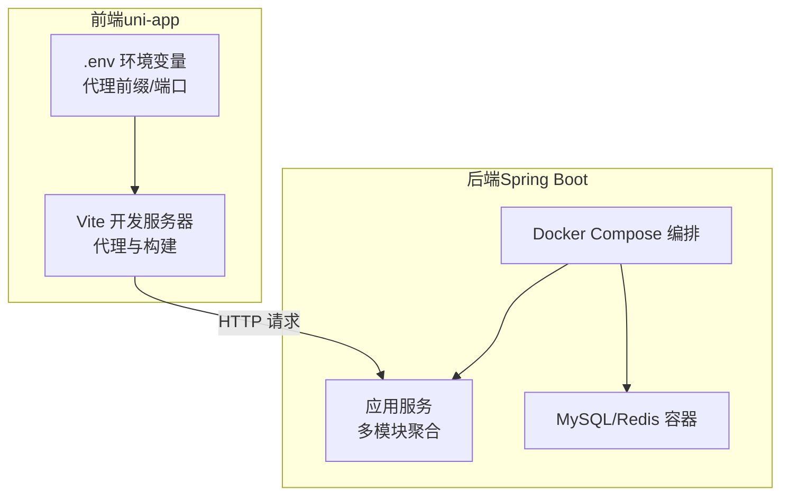
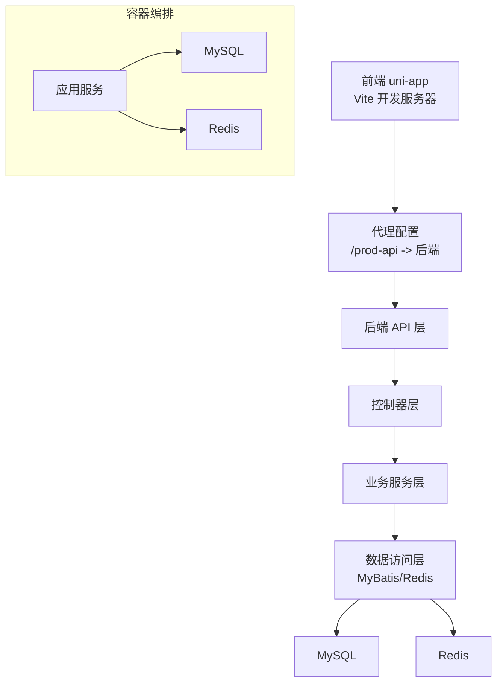
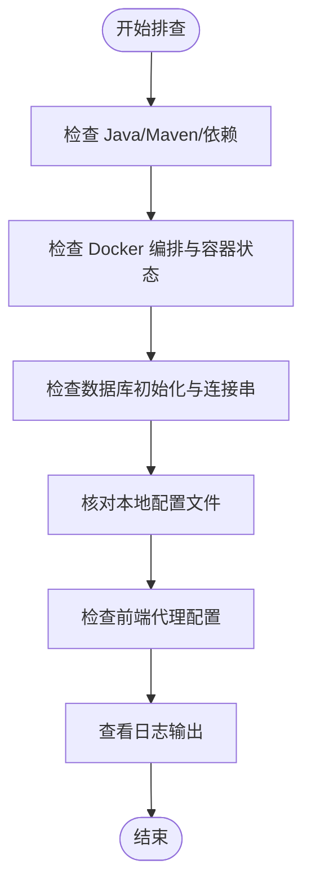
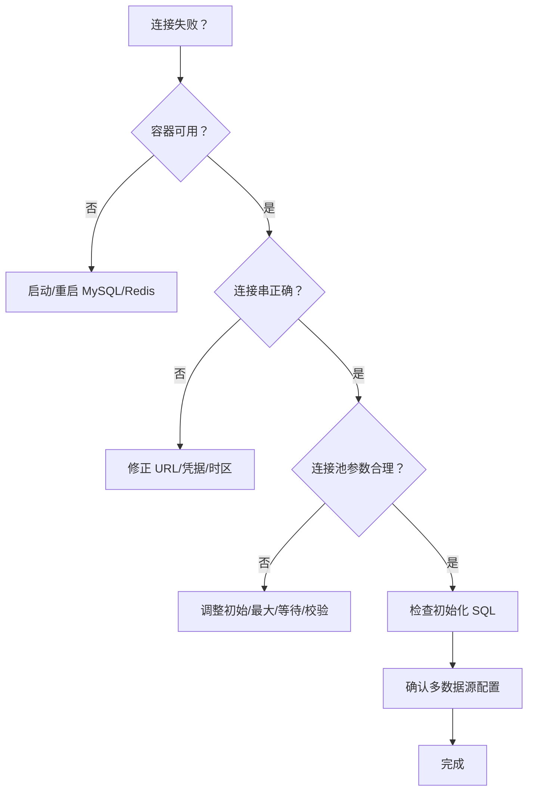
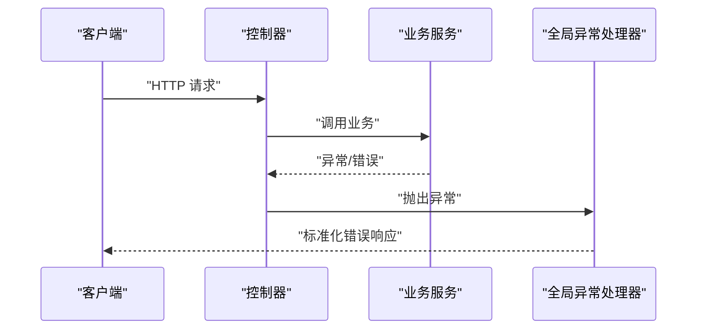
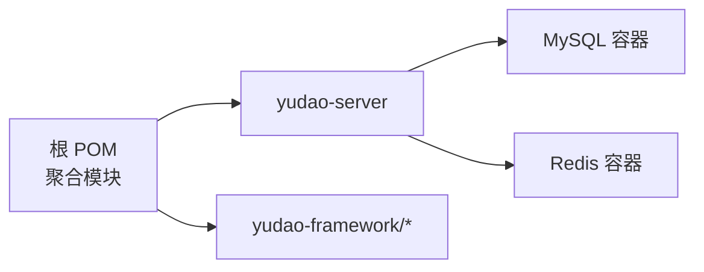

# 故障排除与常见问题

<cite>
**本文引用的文件**
- [pom.xml](file://backend/pom.xml)
- [application.yaml](file://backend/yudao-server/src/main/resources/application.yaml)
- [application-local.yaml](file://backend/yudao-server/src/main/resources/application-local.yaml)
- [application-dev.yaml](file://backend/yudao-server/src/main/resources/application-dev.yaml)
- [docker-compose.yml](file://backend/script/docker/docker-compose.yml)
- [vite.config.ts](file://frontend/admin-uniapp/vite.config.ts)
- [.env.development](file://frontend/admin-uniapp/env/.env.development)
- [.env.production](file://frontend/admin-uniapp/env/.env.production)
- [GlobalExceptionHandler.java](file://backend/yudao-framework/yudao-spring-boot-starter-web/src/main/java/cn/iocoder/yudao/framework/web/core/handler/GlobalExceptionHandler.java)
- [ApiAccessLogCommonApi.java](file://backend/yudao-framework/yudao-common/src/main/java/cn/iocoder/yudao/framework/common/biz/infra/logger/ApiAccessLogCommonApi.java)
- [ApiErrorLogCommonApi.java](file://backend/yudao-framework/yudao-common/src/main/java/cn/iocoder/yudao/framework/common/biz/infra/logger/ApiErrorLogCommonApi.java)
- [ApiAccessLogCreateReqDTO.java](file://backend/yudao-framework/yudao-common/src/main/java/cn/iocoder/yudao/framework/common/biz/infra/logger/dto/ApiAccessLogCreateReqDTO.java)
- [ApiErrorLogCreateReqDTO.java](file://backend/yudao-framework/yudao-common/src/main/java/cn/iocoder/yudao/framework/common/biz/infra/logger/dto/ApiErrorLogCreateReqDTO.java)
- [InvocableHandlerMethod.java](file://backend/yudao-framework/yudao-spring-boot-starter-biz-tenant/src/main/java/org/springframework/messaging/handler/invocation/InvocableHandlerMethod.java)
- [ruoyi-vue-pro.sql](file://backend/sql/mysql/ruoyi-vue-pro.sql)
- [Docker-HOWTO.md](file://backend/script/docker/Docker-HOWTO.md)
</cite>

## 目录
1. [简介](#简介)
2. [项目结构](#项目结构)
3. [核心组件](#核心组件)
4. [架构总览](#架构总览)
5. [详细组件分析](#详细组件分析)
6. [依赖分析](#依赖分析)
7. [性能考虑](#性能考虑)
8. [故障排除指南](#故障排除指南)
9. [结论](#结论)
10. [附录](#附录)

## 简介
本文件面向开发与运维工程师，提供 AgenticCPS 项目的系统性故障排除与常见问题解答。内容覆盖启动失败排查、数据库连接问题、API 接口异常诊断、性能问题分析、日志分析方法、性能分析工具使用、数据库与前端调试技巧，并给出问题分类、快速解决方案、预防措施与升级迁移注意事项，帮助快速定位与解决问题。

## 项目结构
项目采用前后端分离架构，后端为多模块 Maven 工程，前端为 uni-app/Vue3 工程。后端通过 Docker Compose 提供本地一体化运行环境，包含 MySQL、Redis 与服务端应用容器。

图表来源
- [docker-compose.yml:1-85](file://backend/script/docker/docker-compose.yml#L1-L85)
- [vite.config.ts:185-200](file://frontend/admin-uniapp/vite.config.ts#L185-L200)
- [application.yaml:1-362](file://backend/yudao-server/src/main/resources/application.yaml#L1-L362)

章节来源
- [pom.xml:10-24](file://backend/pom.xml#L10-L24)
- [docker-compose.yml:1-85](file://backend/script/docker/docker-compose.yml#L1-L85)
- [vite.config.ts:1-214](file://frontend/admin-uniapp/vite.config.ts#L1-L214)

## 核心组件
- 后端服务：Spring Boot 多模块工程，包含安全、监控、消息队列、定时任务、MyBatis、Redis、Web 等启动器模块。
- 数据库与缓存：MySQL 与 Redis，通过 Docker Compose 提供本地开发环境。
- 前端：uni-app，Vite 驱动，支持多端（H5/App/小程序），内置代理、打包分析与分包优化插件。
- 日志与异常：全局异常处理器、访问日志与错误日志通用 API，便于统一记录与检索。

章节来源
- [application.yaml:1-362](file://backend/yudao-server/src/main/resources/application.yaml#L1-L362)
- [application-local.yaml:33-50](file://backend/yudao-server/src/main/resources/application-local.yaml#L33-L50)
- [application-dev.yaml:36-54](file://backend/yudao-server/src/main/resources/application-dev.yaml#L36-L54)
- [vite.config.ts:1-214](file://frontend/admin-uniapp/vite.config.ts#L1-L214)

## 架构总览
后端通过 Docker Compose 启动 MySQL、Redis 与服务端应用，前端通过 Vite 代理转发请求至后端。全局异常处理器与日志组件贯穿后端，便于问题定位与审计。

图表来源
- [docker-compose.yml:5-57](file://backend/script/docker/docker-compose.yml#L5-L57)
- [vite.config.ts:185-200](file://frontend/admin-uniapp/vite.config.ts#L185-L200)
- [application.yaml:1-362](file://backend/yudao-server/src/main/resources/application.yaml#L1-L362)

## 详细组件分析

### 启动失败排查
- 环境与依赖
  - Java 版本与 Maven 插件：确保使用 Java 17 与匹配的 Maven 插件版本，避免编译与注解处理器冲突。
  - 依赖管理：检查 yudao-dependencies 的版本与仓库镜像配置，避免依赖解析失败。
- 容器编排
  - MySQL/Redis 容器健康：确认端口映射与卷挂载正常，数据库初始化 SQL 已就绪。
  - 应用容器：检查环境变量（如数据库连接串、Redis 主机）与 JVM 参数。
- 本地配置
  - application-local.yaml 与 application-dev.yaml：核对数据库连接串、用户名密码、连接池参数与主从配置。
- 前端代理
  - Vite 代理：确认 VITE_APP_PROXY_ENABLE、VITE_APP_PROXY_PREFIX、VITE_SERVER_BASEURL 配置正确，避免跨域与 404。

图表来源
- [pom.xml:30-44](file://backend/pom.xml#L30-L44)
- [docker-compose.yml:37-56](file://backend/script/docker/docker-compose.yml#L37-L56)
- [application-local.yaml:33-50](file://backend/yudao-server/src/main/resources/application-local.yaml#L33-L50)
- [application-dev.yaml:36-54](file://backend/yudao-server/src/main/resources/application-dev.yaml#L36-L54)
- [vite.config.ts:185-200](file://frontend/admin-uniapp/vite.config.ts#L185-L200)

章节来源
- [pom.xml:30-44](file://backend/pom.xml#L30-L44)
- [docker-compose.yml:37-56](file://backend/script/docker/docker-compose.yml#L37-L56)
- [application-local.yaml:33-50](file://backend/yudao-server/src/main/resources/application-local.yaml#L33-L50)
- [application-dev.yaml:36-54](file://backend/yudao-server/src/main/resources/application-dev.yaml#L36-L54)
- [vite.config.ts:185-200](file://frontend/admin-uniapp/vite.config.ts#L185-L200)

### 数据库连接问题
- 连接串与凭据
  - 确认 MASTER/SLAVE 数据源 URL、用户名、密码与时区参数正确。
  - 连接池参数：初始连接、最大活跃、最大等待、空闲检测周期、校验语句等。
- 容器网络
  - MySQL/Redis 容器名称与主机名一致，端口映射无冲突。
- 初始化脚本
  - 确认初始化 SQL 已挂载并执行成功，必要时手动导入。
- 多数据源与读写分离
  - 懒加载从库配置，避免启动慢；按需开启从库连接。

图表来源
- [docker-compose.yml:6-18](file://backend/script/docker/docker-compose.yml#L6-L18)
- [application-local.yaml:33-50](file://backend/yudao-server/src/main/resources/application-local.yaml#L33-L50)
- [application-dev.yaml:36-54](file://backend/yudao-server/src/main/resources/application-dev.yaml#L36-L54)
- [ruoyi-vue-pro.sql:1-50](file://backend/sql/mysql/ruoyi-vue-pro.sql#L1-L50)

章节来源
- [docker-compose.yml:6-18](file://backend/script/docker/docker-compose.yml#L6-L18)
- [application-local.yaml:33-50](file://backend/yudao-server/src/main/resources/application-local.yaml#L33-L50)
- [application-dev.yaml:36-54](file://backend/yudao-server/src/main/resources/application-dev.yaml#L36-L54)
- [ruoyi-vue-pro.sql:1-50](file://backend/sql/mysql/ruoyi-vue-pro.sql#L1-L50)

### API 接口异常诊断
- 全局异常处理
  - 使用全局异常处理器捕获常见异常类型（参数绑定、校验、请求方法不支持、上传大小超限等），统一返回结构，便于前端提示与日志记录。
- 控制器参数校验
  - InvocableHandlerMethod 在调试模式下输出参数错误日志，有助于定位入参问题。
- 访问与错误日志
  - 通过 ApiAccessLogCommonApi 与 ApiErrorLogCommonApi 统一记录访问与错误日志，结合 DTO 结构快速检索。

图表来源
- [GlobalExceptionHandler.java:81-108](file://backend/yudao-framework/yudao-spring-boot-starter-web/src/main/java/cn/iocoder/yudao/framework/web/core/handler/GlobalExceptionHandler.java#L81-L108)
- [InvocableHandlerMethod.java:185-217](file://backend/yudao-framework/yudao-spring-boot-starter-biz-tenant/src/main/java/org/springframework/messaging/handler/invocation/InvocableHandlerMethod.java#L185-L217)

章节来源
- [GlobalExceptionHandler.java:81-108](file://backend/yudao-framework/yudao-spring-boot-starter-web/src/main/java/cn/iocoder/yudao/framework/web/core/handler/GlobalExceptionHandler.java#L81-L108)
- [InvocableHandlerMethod.java:185-217](file://backend/yudao-framework/yudao-spring-boot-starter-biz-tenant/src/main/java/org/springframework/messaging/handler/invocation/InvocableHandlerMethod.java#L185-L217)
- [ApiAccessLogCommonApi.java](file://backend/yudao-framework/yudao-common/src/main/java/cn/iocoder/yudao/framework/common/biz/infra/logger/ApiAccessLogCommonApi.java)
- [ApiErrorLogCommonApi.java](file://backend/yudao-framework/yudao-common/src/main/java/cn/iocoder/yudao/framework/common/biz/infra/logger/ApiErrorLogCommonApi.java)
- [ApiAccessLogCreateReqDTO.java](file://backend/yudao-framework/yudao-common/src/main/java/cn/iocoder/yudao/framework/common/biz/infra/logger/dto/ApiAccessLogCreateReqDTO.java)
- [ApiErrorLogCreateReqDTO.java](file://backend/yudao-framework/yudao-common/src/main/java/cn/iocoder/yudao/framework/common/biz/infra/logger/dto/ApiErrorLogCreateReqDTO.java)

### 性能问题分析
- 前端性能
  - Vite 打包分析：H5 生产环境启用可视化分析，定位体积与依赖热点。
  - 分包优化：Uni-Ku Bundle Optimizer 优化跨包调用与异步组件，减少首屏负载。
  - SourceMap：按需开启，避免生产环境额外开销。
- 后端性能
  - 连接池参数：根据并发与事务特性调整初始、最大、等待与空闲检测周期。
  - 缓存策略：Redis TTL 与序列化策略，避免过期风暴与序列化瓶颈。
  - 监控与链路追踪：结合 Actuator 与 Admin/Tracing 组件观测延迟与错误率。

章节来源
- [vite.config.ts:138-146](file://frontend/admin-uniapp/vite.config.ts#L138-L146)
- [vite.config.ts:84-94](file://frontend/admin-uniapp/vite.config.ts#L84-L94)
- [application.yaml:26-31](file://backend/yudao-server/src/main/resources/application.yaml#L26-L31)
- [application-local.yaml:33-50](file://backend/yudao-server/src/main/resources/application-local.yaml#L33-L50)

## 依赖分析
- Maven 聚合与模块
  - yudao-server 聚合各模块，yudao-dependencies 统一版本与仓库镜像，提升构建稳定性。
- Docker 服务依赖
  - server 依赖 mysql 与 redis，admin 依赖 server。

图表来源
- [pom.xml:10-24](file://backend/pom.xml#L10-L24)
- [docker-compose.yml:54-56](file://backend/script/docker/docker-compose.yml#L54-L56)

章节来源
- [pom.xml:10-24](file://backend/pom.xml#L10-L24)
- [docker-compose.yml:54-56](file://backend/script/docker/docker-compose.yml#L54-L56)

## 性能考虑
- 前端
  - 生产环境移除 console 与 debugger，减小包体与运行时开销。
  - 启用分包与异步组件，降低首屏依赖。
- 后端
  - 合理设置连接池参数，避免连接泄漏与抖动。
  - 使用缓存与合理的序列化策略，避免热点键与序列化瓶颈。
- 监控
  - 启用 Actuator/ Admin/Tracing，持续观察延迟、错误率与 GC 情况。

章节来源
- [.env.production:3-6](file://frontend/admin-uniapp/env/.env.production#L3-L6)
- [vite.config.ts:204-211](file://frontend/admin-uniapp/vite.config.ts#L204-L211)
- [application.yaml:26-31](file://backend/yudao-server/src/main/resources/application.yaml#L26-L31)
- [application-local.yaml:33-50](file://backend/yudao-server/src/main/resources/application-local.yaml#L33-L50)

## 故障排除指南

### 启动失败
- 症状：服务无法启动或容器退出
  - 检查容器日志与端口占用，确认 MySQL/Redis 可用。
  - 核对 application-local.yaml 与 docker-compose 环境变量。
  - 确认依赖仓库镜像可用，避免依赖下载失败。
- 快速步骤
  - 重启容器与服务
  - 清理本地缓存与依赖
  - 检查本地配置文件与 .env

章节来源
- [docker-compose.yml:37-56](file://backend/script/docker/docker-compose.yml#L37-L56)
- [application-local.yaml:33-50](file://backend/yudao-server/src/main/resources/application-local.yaml#L33-L50)
- [pom.xml:144-172](file://backend/pom.xml#L144-L172)

### 数据库连接失败
- 症状：启动时报连接超时、认证失败或初始化 SQL 未生效
  - 核对 MASTER/SLAVE URL、用户名、密码与时区参数
  - 检查连接池参数与校验语句
  - 确认初始化 SQL 已挂载并执行
- 快速步骤
  - 修改 application-dev.yaml 或 docker-compose 环境变量
  - 重启容器与服务
  - 查看数据库容器日志

章节来源
- [application-dev.yaml:36-54](file://backend/yudao-server/src/main/resources/application-dev.yaml#L36-L54)
- [application-local.yaml:33-50](file://backend/yudao-server/src/main/resources/application-local.yaml#L33-L50)
- [docker-compose.yml:16-18](file://backend/script/docker/docker-compose.yml#L16-L18)
- [ruoyi-vue-pro.sql:1-50](file://backend/sql/mysql/ruoyi-vue-pro.sql#L1-L50)

### API 接口异常
- 症状：404/405/参数校验失败/上传超限
  - 全局异常处理器会捕获并统一返回
  - 控制器参数校验异常会在调试日志中体现
  - 访问与错误日志可用于回溯
- 快速步骤
  - 查看后端日志与异常栈
  - 核对请求路径、方法与参数
  - 检查访问/错误日志记录

章节来源
- [GlobalExceptionHandler.java:81-108](file://backend/yudao-framework/yudao-spring-boot-starter-web/src/main/java/cn/iocoder/yudao/framework/web/core/handler/GlobalExceptionHandler.java#L81-L108)
- [InvocableHandlerMethod.java:185-217](file://backend/yudao-framework/yudao-spring-boot-starter-biz-tenant/src/main/java/org/springframework/messaging/handler/invocation/InvocableHandlerMethod.java#L185-L217)
- [ApiAccessLogCommonApi.java](file://backend/yudao-framework/yudao-common/src/main/java/cn/iocoder/yudao/framework/common/biz/infra/logger/ApiAccessLogCommonApi.java)
- [ApiErrorLogCommonApi.java](file://backend/yudao-framework/yudao-common/src/main/java/cn/iocoder/yudao/framework/common/biz/infra/logger/ApiErrorLogCommonApi.java)

### 前端代理与跨域问题
- 症状：H5 开发时出现跨域或 404
  - 检查 VITE_APP_PROXY_ENABLE、VITE_APP_PROXY_PREFIX、VITE_SERVER_BASEURL
  - 确认代理 rewrite 规则与后端实际前缀一致
- 快速步骤
  - 修改 .env.development/.env.production
  - 重启 Vite 开发服务器

章节来源
- [vite.config.ts:185-200](file://frontend/admin-uniapp/vite.config.ts#L185-L200)
- [.env.development:1-10](file://frontend/admin-uniapp/env/.env.development#L1-L10)
- [.env.production:1-10](file://frontend/admin-uniapp/env/.env.production#L1-L10)

### 性能问题
- 症状：页面加载慢、接口响应慢、CPU/内存高
  - 前端：启用打包分析，检查分包与异步组件
  - 后端：检查连接池、缓存与序列化
  - 监控：启用 Actuator/Admin/Tracing
- 快速步骤
  - 生产环境移除 console，启用分包优化
  - 调整连接池参数与缓存策略
  - 启用监控并观察指标

章节来源
- [vite.config.ts:138-146](file://frontend/admin-uniapp/vite.config.ts#L138-L146)
- [vite.config.ts:84-94](file://frontend/admin-uniapp/vite.config.ts#L84-L94)
- [application.yaml:26-31](file://backend/yudao-server/src/main/resources/application.yaml#L26-L31)
- [application-local.yaml:33-50](file://backend/yudao-server/src/main/resources/application-local.yaml#L33-L50)

### 日志分析方法
- 访问日志
  - 通过 ApiAccessLogCommonApi 记录请求上下文、耗时与结果，便于回放与分析。
- 错误日志
  - 通过 ApiErrorLogCommonApi 记录异常类名、消息、根因与堆栈，支持按时间与异常类型检索。
- 建议
  - 前端：保留必要字段，避免敏感信息泄露
  - 后端：统一字段与索引，定期清理过期日志

章节来源
- [ApiAccessLogCommonApi.java](file://backend/yudao-framework/yudao-common/src/main/java/cn/iocoder/yudao/framework/common/biz/infra/logger/ApiAccessLogCommonApi.java)
- [ApiErrorLogCommonApi.java](file://backend/yudao-framework/yudao-common/src/main/java/cn/iocoder/yudao/framework/common/biz/infra/logger/ApiErrorLogCommonApi.java)
- [ApiAccessLogCreateReqDTO.java](file://backend/yudao-framework/yudao-common/src/main/java/cn/iocoder/yudao/framework/common/biz/infra/logger/dto/ApiAccessLogCreateReqDTO.java)
- [ApiErrorLogCreateReqDTO.java](file://backend/yudao-framework/yudao-common/src/main/java/cn/iocoder/yudao/framework/common/biz/infra/logger/dto/ApiErrorLogCreateReqDTO.java)

### 数据库调试技巧
- 连接池参数
  - 初始连接、最大活跃、最大等待、空闲检测周期、校验语句与预处理语句缓存
- 多数据源
  - 主从分离与懒加载从库，避免启动慢
- 初始化脚本
  - 确认初始化 SQL 已挂载并执行成功

章节来源
- [application-local.yaml:33-50](file://backend/yudao-server/src/main/resources/application-local.yaml#L33-L50)
- [application-dev.yaml:36-54](file://backend/yudao-server/src/main/resources/application-dev.yaml#L36-L54)
- [docker-compose.yml:16-18](file://backend/script/docker/docker-compose.yml#L16-L18)
- [ruoyi-vue-pro.sql:1-50](file://backend/sql/mysql/ruoyi-vue-pro.sql#L1-L50)

### 前端调试技巧
- 代理与跨域
  - 使用 Vite 代理，确保 rewrite 与后端前缀一致
- 分包与异步组件
  - 启用 Bundle Optimizer，减少首屏依赖
- 打包分析
  - H5 生产环境启用可视化分析，定位体积与依赖热点

章节来源
- [vite.config.ts:185-200](file://frontend/admin-uniapp/vite.config.ts#L185-L200)
- [vite.config.ts:84-94](file://frontend/admin-uniapp/vite.config.ts#L84-L94)
- [vite.config.ts:138-146](file://frontend/admin-uniapp/vite.config.ts#L138-L146)

### 升级迁移注意事项
- 后端
  - Maven 与 Java 版本升级需同步插件与依赖版本，避免编译与注解处理器冲突
  - Docker 环境变量与初始化 SQL 需同步更新
- 前端
  - Node/PNPM 版本满足要求，依赖与插件版本需兼容
  - 代理与构建配置需与后端前缀保持一致

章节来源
- [pom.xml:30-44](file://backend/pom.xml#L30-L44)
- [docker-compose.yml:37-56](file://backend/script/docker/docker-compose.yml#L37-L56)
- [package.json:25-28](file://frontend/admin-uniapp/package.json#L25-L28)

## 结论
通过规范的环境配置、完善的日志与异常处理、合理的性能优化与监控体系，AgenticCPS 项目可实现高效的问题定位与快速恢复。建议在团队内建立标准的故障排查流程与知识库，持续沉淀经验，提升整体交付质量与稳定性。

## 附录
- Docker 使用说明：参考 Docker-HOWTO.md，了解容器编排与环境变量配置。
- 本地开发环境：使用 docker-compose 启动 MySQL/Redis/Server，按需修改 .env 与 application-local.yaml。

章节来源
- [Docker-HOWTO.md](file://backend/script/docker/Docker-HOWTO.md)
- [docker-compose.yml:1-85](file://backend/script/docker/docker-compose.yml#L1-L85)
- [application-local.yaml:33-50](file://backend/yudao-server/src/main/resources/application-local.yaml#L33-L50)