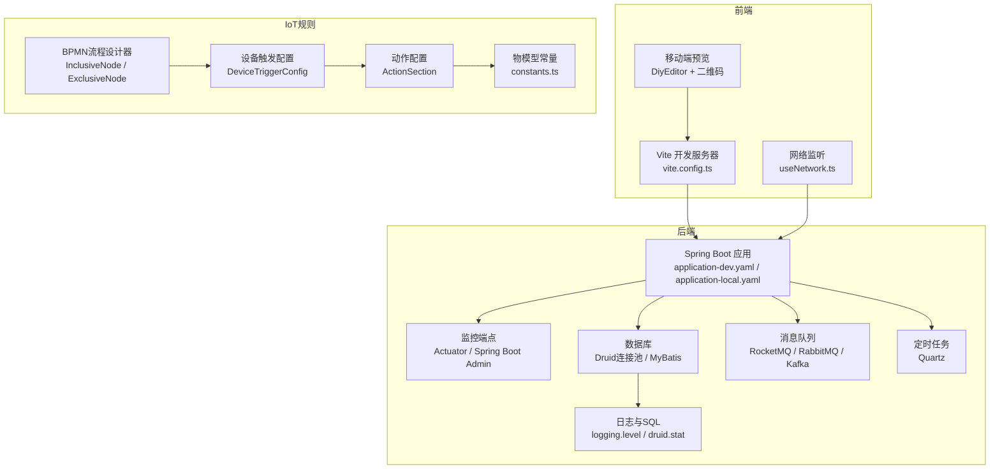
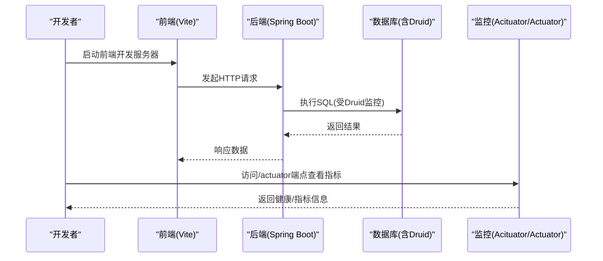
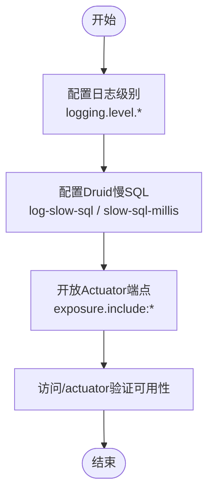
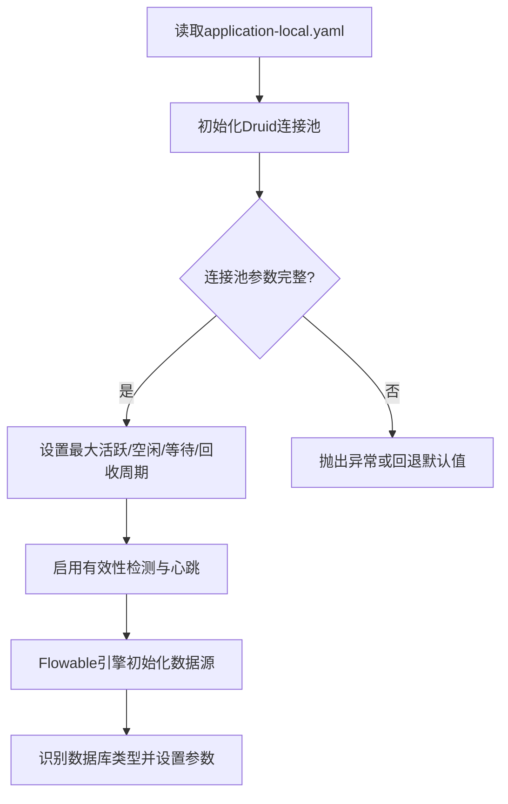
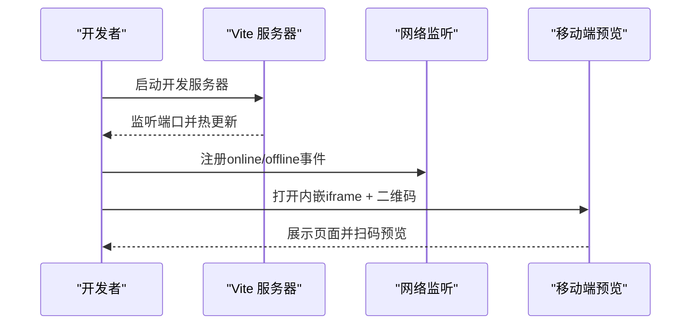
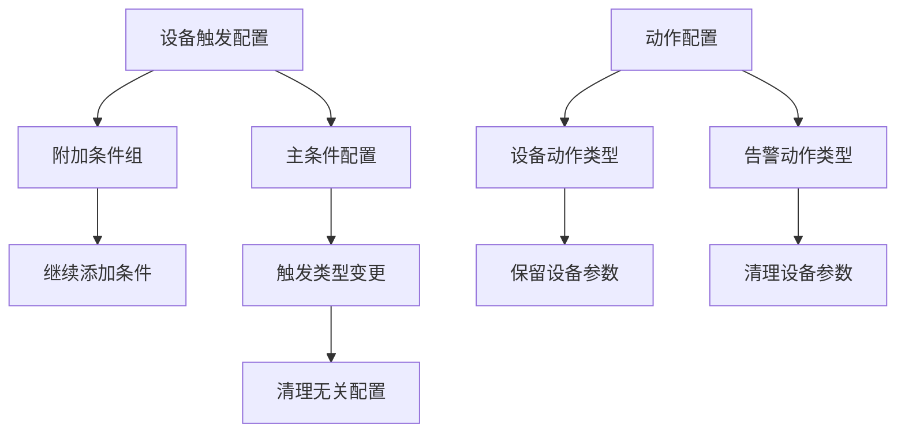
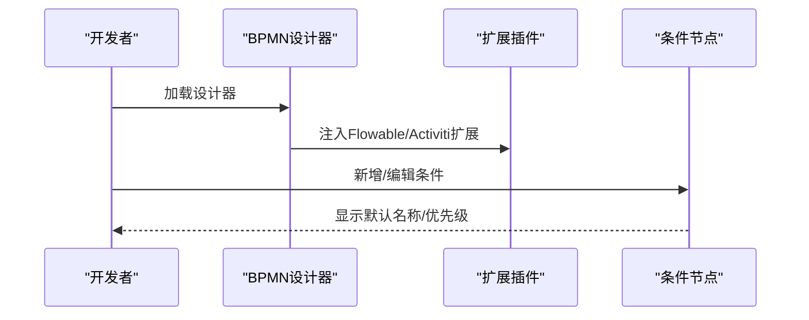
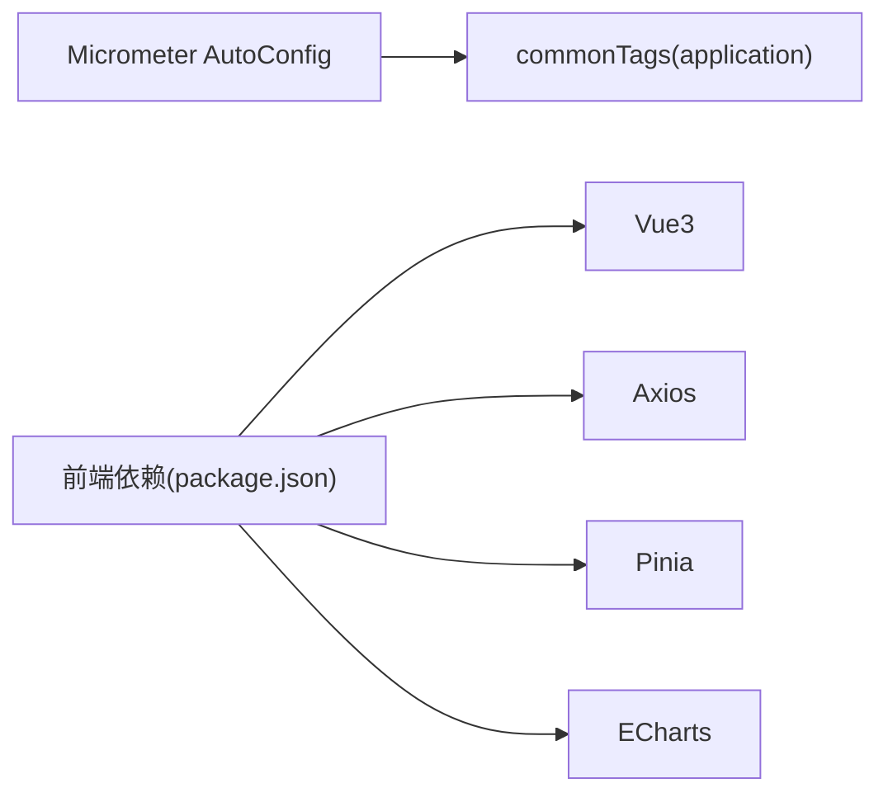

# 调试技巧与工具

<cite>
**本文引用的文件**
- [application-dev.yaml](file://backend/yudao-server/src/main/resources/application-dev.yaml)
- [application-local.yaml](file://backend/yudao-server/src/main/resources/application-local.yaml)
- [vite.config.ts](file://frontend/admin-vue3/vite.config.ts)
- [package.json](file://frontend/admin-vue3/package.json)
- [useNetwork.ts](file://frontend/admin-vue3/src/hooks/web/useNetwork.ts)
- [YudaoMetricsAutoConfiguration.java](file://backend/yudao-framework/yudao-spring-boot-starter-monitor/src/main/java/cn/iocoder/yudao/framework/tracer/config/YudaoMetricsAutoConfiguration.java)
- [《芋道 Spring Boot 监控端点 Actuator 入门》.md](file://backend/yudao-framework/yudao-spring-boot-starter-monitor/《芋道 Spring Boot 监控端点 Actuator 入门》.md)
- [AbstractEngineConfiguration.java](file://backend/sql/dm/flowable-patch/src/main/java/org/flowable/common/engine/impl/AbstractEngineConfiguration.java)
- [ActionSection.vue](file://frontend/admin-vue3/src/views/iot/rule/scene/form/sections/ActionSection.vue)
- [DeviceTriggerConfig.vue](file://frontend/admin-vue3/src/views/iot/rule/scene/form/configs/DeviceTriggerConfig.vue)
- [SubConditionGroupConfig.vue](file://frontend/admin-vue3/src/views/iot/rule/scene/form/configs/SubConditionGroupConfig.vue)
- [InclusiveNode.vue](file://frontend/admin-vue3/src/components/SimpleProcessDesignerV2/src/nodes/InclusiveNode.vue)
- [ExclusiveNode.vue](file://frontend/admin-vue3/src/components/SimpleProcessDesignerV2/src/nodes/ExclusiveNode.vue)
- [index.js (flowable)](file://frontend/admin-vue3/src/components/bpmnProcessDesigner/package/designer/plugins/extension-moddle/flowable/index.js)
- [index.js (activiti)](file://frontend/admin-vue3/src/components/bpmnProcessDesigner/package/designer/plugins/extension-moddle/activiti/index.js)
- [index.vue (DiyEditor)](file://frontend/admin-vue3/src/components/DiyEditor/index.vue)
- [constants.ts](file://frontend/admin-vue3/src/views/iot/utils/constants.ts)
</cite>

## 目录
1. [简介](#简介)
2. [项目结构](#项目结构)
3. [核心组件](#核心组件)
4. [架构总览](#架构总览)
5. [详细组件分析](#详细组件分析)
6. [依赖分析](#依赖分析)
7. [性能考虑](#性能考虑)
8. [故障排查指南](#故障排查指南)
9. [结论](#结论)
10. [附录](#附录)

## 简介
本指南面向AgenticCPS项目的后端、前端与IoT规则场景，系统化梳理调试技巧与工具使用方法，覆盖以下主题：
- 后端日志与SQL调试：Spring Boot日志配置、Druid慢SQL记录、MyBatis日志级别、Actuator监控端点
- 性能分析工具：JProfiler、VisualVM、Chrome DevTools在前后端的应用要点
- 数据库调试：慢查询分析、索引优化、连接池监控与调优
- 前端调试：Vue DevTools、网络请求调试、移动端预览与真机调试
- 工作流与IoT规则调试：BPMN流程设计器、条件分支、设备触发与动作配置
- 通用调试实践：断点设置、性能瓶颈定位、日志分析方法

## 项目结构
本项目包含后端Spring Boot服务、前端Admin-Vue3与多套前端工程（含移动端），以及IoT规则与流程设计相关组件。调试相关的关键位置如下：
- 后端：日志、监控、Actuator、Druid连接池、Quartz定时任务、消息队列配置
- 前端：Vite开发服务器、构建优化、网络监听、移动端预览与二维码
- IoT规则：设备触发、条件组合、动作配置、流程节点

**图表来源**
- [application-dev.yaml:146-195](file://backend/yudao-server/src/main/resources/application-dev.yaml#L146-L195)
- [application-local.yaml:145-195](file://backend/yudao-server/src/main/resources/application-local.yaml#L145-L195)
- [vite.config.ts:27-40](file://frontend/admin-vue3/vite.config.ts#L27-L40)
- [useNetwork.ts:1-21](file://frontend/admin-vue3/src/hooks/web/useNetwork.ts#L1-L21)
- [index.vue (DiyEditor):166-177](file://frontend/admin-vue3/src/components/DiyEditor/index.vue#L166-L177)

**章节来源**
- [application-dev.yaml:1-213](file://backend/yudao-server/src/main/resources/application-dev.yaml#L1-L213)
- [application-local.yaml:1-294](file://backend/yudao-server/src/main/resources/application-local.yaml#L1-L294)
- [vite.config.ts:1-89](file://frontend/admin-vue3/vite.config.ts#L1-L89)
- [useNetwork.ts:1-21](file://frontend/admin-vue3/src/hooks/web/useNetwork.ts#L1-L21)
- [index.vue (DiyEditor):166-177](file://frontend/admin-vue3/src/components/DiyEditor/index.vue#L166-L177)

## 核心组件
- 后端日志与SQL
  - 日志文件输出与模块化日志级别配置
  - Druid慢SQL记录与阈值设置
  - MyBatis Mapper日志级别控制
- 监控与端点
  - Actuator端点开放策略
  - Spring Boot Admin客户端配置
  - Micrometer指标公共标签
- 前端开发与调试
  - Vite开发服务器端口、代理、构建优化
  - 网络在线状态监听
  - 移动端预览与二维码
- IoT规则与流程
  - 条件节点（排他/包容）、设备触发、动作配置
  - 物模型协议常量

**章节来源**
- [application-dev.yaml:146-195](file://backend/yudao-server/src/main/resources/application-dev.yaml#L146-L195)
- [application-local.yaml:145-195](file://backend/yudao-server/src/main/resources/application-local.yaml#L145-L195)
- [YudaoMetricsAutoConfiguration.java:16-27](file://backend/yudao-framework/yudao-spring-boot-starter-monitor/src/main/java/cn/iocoder/yudao/framework/tracer/config/YudaoMetricsAutoConfiguration.java#L16-L27)
- [vite.config.ts:27-87](file://frontend/admin-vue3/vite.config.ts#L27-L87)
- [useNetwork.ts:1-21](file://frontend/admin-vue3/src/hooks/web/useNetwork.ts#L1-L21)
- [ActionSection.vue:192-201](file://frontend/admin-vue3/src/views/iot/rule/scene/form/sections/ActionSection.vue#L192-L201)
- [DeviceTriggerConfig.vue:1-35](file://frontend/admin-vue3/src/views/iot/rule/scene/form/configs/DeviceTriggerConfig.vue#L1-L35)
- [constants.ts:55-113](file://frontend/admin-vue3/src/views/iot/utils/constants.ts#L55-L113)

## 架构总览
后端通过Actuator暴露运行时状态，Druid监控SQL与连接池，前端通过Vite提供开发体验与移动端预览能力。IoT规则通过BPMN节点与设备触发/动作配置实现业务编排。

**图表来源**
- [vite.config.ts:27-40](file://frontend/admin-vue3/vite.config.ts#L27-L40)
- [application-dev.yaml:125-150](file://backend/yudao-server/src/main/resources/application-dev.yaml#L125-L150)
- [application-local.yaml:145-170](file://backend/yudao-server/src/main/resources/application-local.yaml#L145-L170)

## 详细组件分析

### 后端日志与SQL调试
- 日志文件与级别
  - 日志文件路径与模块化日志级别配置，便于按模块定位问题
  - MyBatis Mapper日志级别控制，避免重复打印与噪声
- Druid慢SQL
  - 开启慢SQL记录与阈值设置，结合SQL审计定位性能瓶颈
- Actuator端点
  - 开放全部端点以便快速诊断，结合Spring Boot Admin集中查看

**图表来源**
- [application-dev.yaml:146-195](file://backend/yudao-server/src/main/resources/application-dev.yaml#L146-L195)
- [application-local.yaml:145-195](file://backend/yudao-server/src/main/resources/application-local.yaml#L145-L195)

**章节来源**
- [application-dev.yaml:146-195](file://backend/yudao-server/src/main/resources/application-dev.yaml#L146-L195)
- [application-local.yaml:167-195](file://backend/yudao-server/src/main/resources/application-local.yaml#L167-L195)

### 连接池与数据库调试
- Druid连接池配置
  - 初始/最小/最大连接数、等待超时、空闲回收周期、有效性检测SQL
  - 开启PreparedStatement缓存与每连接缓存上限
- Flowable引擎数据源初始化
  - 自动识别数据库类型、设置连接池参数、启用心跳检测

**图表来源**
- [application-local.yaml:33-76](file://backend/yudao-server/src/main/resources/application-local.yaml#L33-L76)
- [AbstractEngineConfiguration.java:440-494](file://backend/sql/dm/flowable-patch/src/main/java/org/flowable/common/engine/impl/AbstractEngineConfiguration.java#L440-L494)

**章节来源**
- [application-local.yaml:33-76](file://backend/yudao-server/src/main/resources/application-local.yaml#L33-L76)
- [AbstractEngineConfiguration.java:440-494](file://backend/sql/dm/flowable-patch/src/main/java/org/flowable/common/engine/impl/AbstractEngineConfiguration.java#L440-L494)

### 前端调试与移动端预览
- Vite开发服务器
  - 端口、主机、自动打开、构建优化与依赖拆分
- 网络状态监听
  - 在线/离线事件监听，辅助判断网络相关问题
- 移动端预览
  - 内嵌iframe与二维码，便于H5/小程序联调

**图表来源**
- [vite.config.ts:27-40](file://frontend/admin-vue3/vite.config.ts#L27-L40)
- [useNetwork.ts:1-21](file://frontend/admin-vue3/src/hooks/web/useNetwork.ts#L1-L21)
- [index.vue (DiyEditor):166-177](file://frontend/admin-vue3/src/components/DiyEditor/index.vue#L166-L177)

**章节来源**
- [vite.config.ts:1-89](file://frontend/admin-vue3/vite.config.ts#L1-L89)
- [useNetwork.ts:1-21](file://frontend/admin-vue3/src/hooks/web/useNetwork.ts#L1-L21)
- [index.vue (DiyEditor):166-177](file://frontend/admin-vue3/src/components/DiyEditor/index.vue#L166-L177)

### IoT规则与流程调试
- 条件节点
  - 排他/包容节点支持多条件分支、默认流、优先级与交互编辑
- 设备触发
  - 主条件与附加条件组，支持继续添加条件
- 动作配置
  - 设备属性设置/服务调用、告警触发/恢复等类型切换与清理无关配置
- 物模型协议
  - 设备属性、事件、服务调用、配置推送、OTA升级等方法常量

**图表来源**
- [DeviceTriggerConfig.vue:1-35](file://frontend/admin-vue3/src/views/iot/rule/scene/form/configs/DeviceTriggerConfig.vue#L1-L35)
- [SubConditionGroupConfig.vue:31-71](file://frontend/admin-vue3/src/views/iot/rule/scene/form/configs/SubConditionGroupConfig.vue#L31-L71)
- [ActionSection.vue:192-201](file://frontend/admin-vue3/src/views/iot/rule/scene/form/sections/ActionSection.vue#L192-L201)
- [InclusiveNode.vue:180-195](file://frontend/admin-vue3/src/components/SimpleProcessDesignerV2/src/nodes/InclusiveNode.vue#L180-L195)
- [ExclusiveNode.vue:176-189](file://frontend/admin-vue3/src/components/SimpleProcessDesignerV2/src/nodes/ExclusiveNode.vue#L176-L189)
- [constants.ts:55-113](file://frontend/admin-vue3/src/views/iot/utils/constants.ts#L55-L113)

**章节来源**
- [DeviceTriggerConfig.vue:1-35](file://frontend/admin-vue3/src/views/iot/rule/scene/form/configs/DeviceTriggerConfig.vue#L1-L35)
- [SubConditionGroupConfig.vue:31-71](file://frontend/admin-vue3/src/views/iot/rule/scene/form/configs/SubConditionGroupConfig.vue#L31-L71)
- [ActionSection.vue:192-201](file://frontend/admin-vue3/src/views/iot/rule/scene/form/sections/ActionSection.vue#L192-L201)
- [InclusiveNode.vue:180-195](file://frontend/admin-vue3/src/components/SimpleProcessDesignerV2/src/nodes/InclusiveNode.vue#L180-L195)
- [ExclusiveNode.vue:176-189](file://frontend/admin-vue3/src/components/SimpleProcessDesignerV2/src/nodes/ExclusiveNode.vue#L176-L189)
- [constants.ts:55-113](file://frontend/admin-vue3/src/views/iot/utils/constants.ts#L55-L113)

### BPMN扩展与设计器
- Flowable/Activiti扩展插件
  - 通过moddle扩展注入，增强BPMN建模能力
- 设计器节点
  - 条件节点支持交互编辑、新增条件、默认命名与优先级显示

**图表来源**
- [index.js (flowable):1-10](file://frontend/admin-vue3/src/components/bpmnProcessDesigner/package/designer/plugins/extension-moddle/flowable/index.js#L1-L10)
- [index.js (activiti):1-11](file://frontend/admin-vue3/src/components/bpmnProcessDesigner/package/designer/plugins/extension-moddle/activiti/index.js#L1-L11)
- [InclusiveNode.vue:180-195](file://frontend/admin-vue3/src/components/SimpleProcessDesignerV2/src/nodes/InclusiveNode.vue#L180-L195)
- [ExclusiveNode.vue:176-189](file://frontend/admin-vue3/src/components/SimpleProcessDesignerV2/src/nodes/ExclusiveNode.vue#L176-L189)

**章节来源**
- [index.js (flowable):1-10](file://frontend/admin-vue3/src/components/bpmnProcessDesigner/package/designer/plugins/extension-moddle/flowable/index.js#L1-L10)
- [index.js (activiti):1-11](file://frontend/admin-vue3/src/components/bpmnProcessDesigner/package/designer/plugins/extension-moddle/activiti/index.js#L1-L11)
- [InclusiveNode.vue:180-195](file://frontend/admin-vue3/src/components/SimpleProcessDesignerV2/src/nodes/InclusiveNode.vue#L180-L195)
- [ExclusiveNode.vue:176-189](file://frontend/admin-vue3/src/components/SimpleProcessDesignerV2/src/nodes/ExclusiveNode.vue#L176-L189)

## 依赖分析
- 后端监控
  - Micrometer自动配置注入common tags，统一应用标识
- 前端依赖
  - Vue3、Element Plus、Axios、Pinia、ECharts等，支撑开发与调试工具链

**图表来源**
- [YudaoMetricsAutoConfiguration.java:21-25](file://backend/yudao-framework/yudao-spring-boot-starter-monitor/src/main/java/cn/iocoder/yudao/framework/tracer/config/YudaoMetricsAutoConfiguration.java#L21-L25)
- [package.json:27-84](file://frontend/admin-vue3/package.json#L27-L84)

**章节来源**
- [YudaoMetricsAutoConfiguration.java:16-27](file://backend/yudao-framework/yudao-spring-boot-starter-monitor/src/main/java/cn/iocoder/yudao/framework/tracer/config/YudaoMetricsAutoConfiguration.java#L16-L27)
- [package.json:1-160](file://frontend/admin-vue3/package.json#L1-L160)

## 性能考虑
- 后端
  - 启用Druid慢SQL记录与阈值设置，结合Actuator端点观察JVM与线程池状态
  - 合理设置连接池参数，避免高并发下的连接争用
- 前端
  - 构建时移除debugger与console，减少生产包体积与运行开销
  - 依赖拆分与懒加载，缩短首屏时间
- IoT规则
  - 条件节点与动作配置尽量精简，避免复杂嵌套导致执行延迟

[本节为通用指导，无需列出具体文件来源]

## 故障排查指南
- 后端
  - 检查日志文件路径与模块日志级别，确认SQL日志是否开启
  - 通过/actuator端点查看健康状态与指标，定位异常
  - 若连接池异常，核对初始/最大连接数与等待超时配置
- 前端
  - 使用在线状态监听判断网络问题
  - 移动端预览失败时，检查iframe与二维码生成逻辑
- IoT规则
  - 触发条件过多或动作类型不匹配时，清理无关配置并重命名节点

**章节来源**
- [application-dev.yaml:146-195](file://backend/yudao-server/src/main/resources/application-dev.yaml#L146-L195)
- [application-local.yaml:145-195](file://backend/yudao-server/src/main/resources/application-local.yaml#L145-L195)
- [useNetwork.ts:1-21](file://frontend/admin-vue3/src/hooks/web/useNetwork.ts#L1-L21)
- [index.vue (DiyEditor):166-177](file://frontend/admin-vue3/src/components/DiyEditor/index.vue#L166-L177)
- [ActionSection.vue:252-255](file://frontend/admin-vue3/src/views/iot/rule/scene/form/sections/ActionSection.vue#L252-L255)

## 结论
通过合理配置后端日志与监控、利用前端开发工具链与移动端预览能力、以及规范化的IoT规则与流程设计，可以显著提升问题定位效率与调试体验。建议在开发与测试环境中开启详尽日志与慢SQL记录，在生产环境谨慎平衡可观测性与性能。

[本节为总结性内容，无需列出具体文件来源]

## 附录
- 参考文档入口（Actuator）
  - [《芋道 Spring Boot 监控端点 Actuator 入门》.md:1-2](file://backend/yudao-framework/yudao-spring-boot-starter-monitor/《芋道 Spring Boot 监控端点 Actuator 入门》.md#L1-L2)

**章节来源**
- [《芋道 Spring Boot 监控端点 Actuator 入门》.md:1-2](file://backend/yudao-framework/yudao-spring-boot-starter-monitor/《芋道 Spring Boot 监控端点 Actuator 入门》.md#L1-L2)