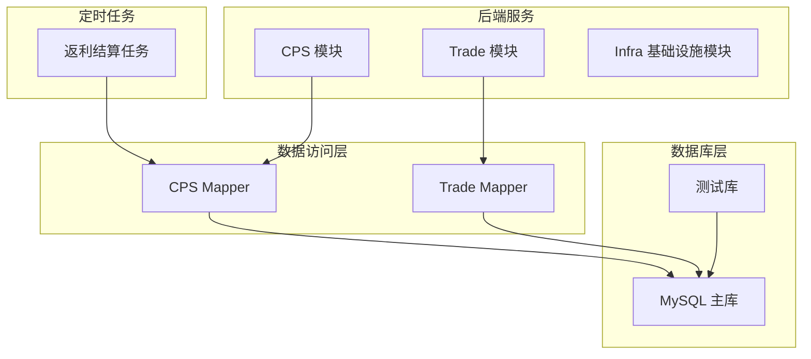
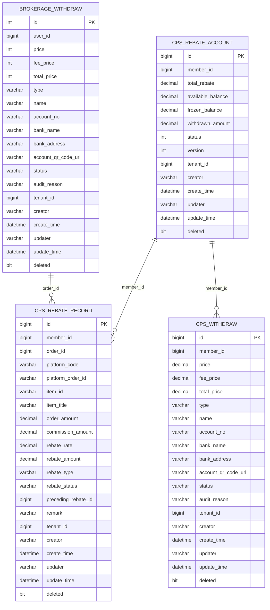
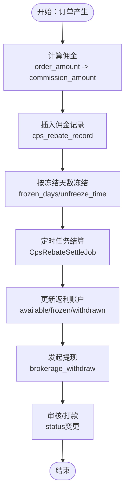
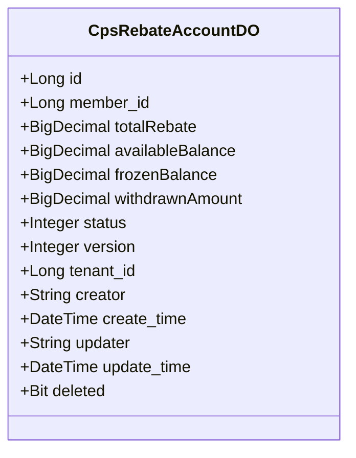
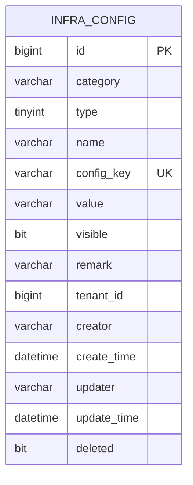
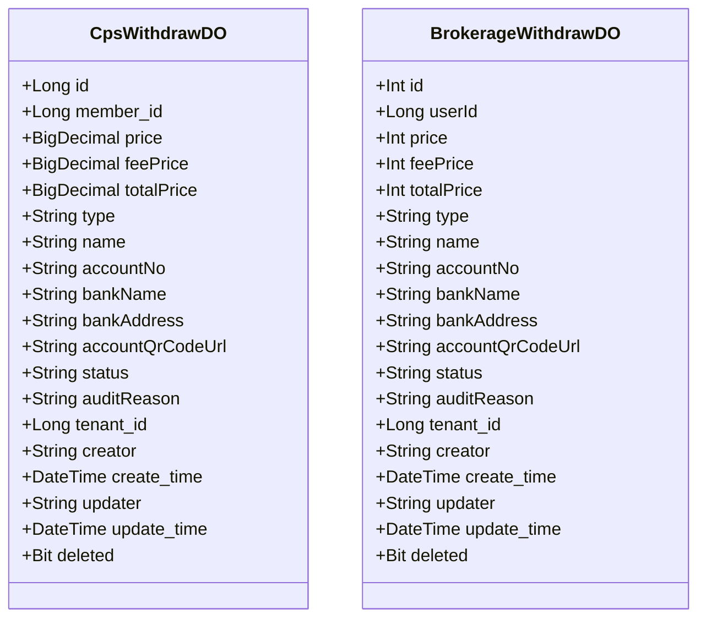
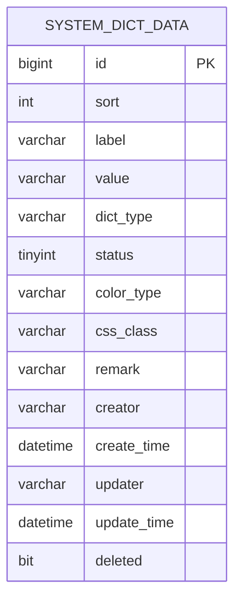
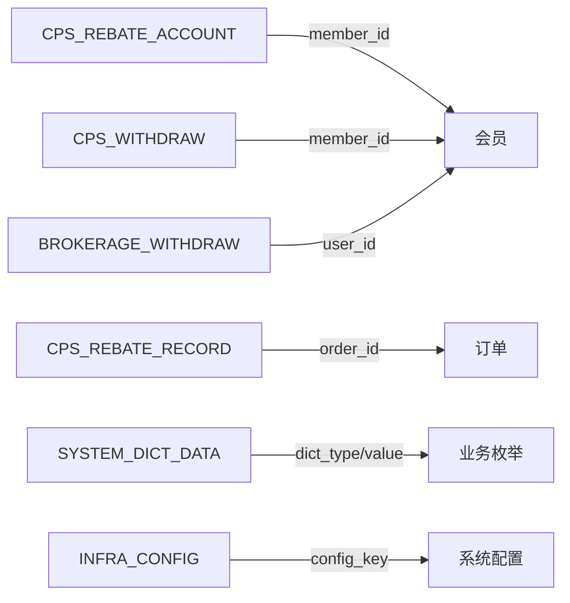

# 数据库设计

<cite>
**本文引用的文件**
- [ruoyi-vue-pro.sql](file://backend/sql/mysql/ruoyi-vue-pro.sql)
- [create_tables.sql](file://backend/qiji-module-mall/qiji-module-trade/src/test/resources/sql/create_tables.sql)
- [CpsRebateAccountDO.java](file://backend/qiji-module-cps/qiji-module-cps-biz/src/main/java/com/qiji/cps/module/cps/dal/dataobject/rebate/CpsRebateAccountDO.java)
- [CpsRebateRecordDO.java](file://backend/qiji-module-cps/qiji-module-cps-biz/src/main/java/com/qiji/cps/module/cps/dal/dataobject/rebate/CpsRebateRecordDO.java)
- [CpsRebateConfigDO.java](file://backend/qiji-module-cps/qiji-module-cps-biz/src/main/java/com/qiji/cps/module/cps/dal/dataobject/rebate/CpsRebateConfigDO.java)
- [CpsWithdrawDO.java](file://backend/qiji-module-cps/qiji-module-cps-biz/src/main/java/com/qiji/cps/module/cps/dal/dataobject/withdraw/CpsWithdrawDO.java)
- [BrokerageWithdrawDO.java](file://backend/qiji-module-mall/qiji-module-trade/src/main/java/com/qiji/cps/module/trade/dal/dataobject/brokerage/BrokerageWithdrawDO.java)
- [CpsRebateSettleJob.java](file://backend/qiji-module-cps/qiji-module-cps-biz/src/main/java/com/qiji/cps/module/cps/job/CpsRebateSettleJob.java)
- [init_cps_test_data.py](file://script/test/init_cps_test_data.py)
- [CpsRebateStatusEnum.java](file://backend/qiji-module-cps/qiji-module-cps-api/src/main/java/com/qiji/cps/module/cps/enums/CpsRebateStatusEnum.java)
- [CpsRebateTypeEnum.java](file://backend/qiji-module-cps/qiji-module-cps-api/src/main/java/com/qiji/cps/module/cps/enums/CpsRebateTypeEnum.java)
- [CpsWithdrawStatusEnum.java](file://backend/qiji-module-cps/qiji-module-cps-api/src/main/java/com/qiji/cps/module/cps/enums/CpsWithdrawStatusEnum.java)
- [BrokerageWithdrawMapper.java](file://backend/qiji-module-mall/qiji-module-trade/src/main/java/com/qiji/cps/module/trade/dal/mysql/brokerage/BrokerageWithdrawMapper.java)
- [CpsRebateRecordMapper.java](file://backend/qiji-module-cps/qiji-module-cps-biz/src/main/java/com/qiji/cps/module/cps/dal/mysql/rebate/CpsRebateRecordMapper.java)
- [CpsRebateAccountMapper.java](file://backend/qiji-module-cps/qiji-module-cps-biz/src/main/java/com/qiji/cps/module/cps/dal/mysql/rebate/CpsRebateAccountMapper.java)
- [CpsRebateConfigMapper.java](file://backend/qiji-module-cps/qiji-module-cps-biz/src/main/java/com/qiji/cps/module/cps/dal/mysql/rebate/CpsRebateConfigMapper.java)
- [CpsWithdrawMapper.java](file://backend/qiji-module-cps/qiji-module-cps-biz/src/main/java/com/qiji/cps/module/cps/dal/mysql/withdraw/CpsWithdrawMapper.java)
</cite>

## 目录
1. [简介](#简介)
2. [项目结构](#项目结构)
3. [核心组件](#核心组件)
4. [架构总览](#架构总览)
5. [详细组件分析](#详细组件分析)
6. [依赖分析](#依赖分析)
7. [性能考量](#性能考量)
8. [故障排查指南](#故障排查指南)
9. [结论](#结论)
10. [附录](#附录)

## 简介
本文件面向 AgenticCPS 数据库设计，围绕数据库选型与配置、表结构设计原则、索引优化策略、核心业务表（订单、返利账户、平台配置、提现记录、风控规则等）的数据模型、实体关系、字段定义、主外键约束、索引设计进行系统化梳理；同时覆盖数据访问模式、缓存策略、性能考虑、数据生命周期管理、迁移路径与版本管理策略、数据安全与隐私保护、访问控制机制以及数据库监控指标与性能瓶颈分析。

## 项目结构
AgenticCPS 采用前后端分离的微服务架构，数据库层以 MySQL 为主要持久化存储，配合 MyBatis-Plus 实现数据访问层（DAO/DO），并通过定时任务与枚举常量驱动业务流程。数据库脚本位于 backend/sql/mysql/ruoyi-vue-pro.sql，业务相关表结构在各模块的 DAL 层（Data Access Layer）中以 DO 类定义，测试数据初始化脚本位于 script/test/init_cps_test_data.py。

图示来源
- [ruoyi-vue-pro.sql](file://backend/sql/mysql/ruoyi-vue-pro.sql)
- [CpsRebateSettleJob.java](file://backend/qiji-module-cps/qiji-module-cps-biz/src/main/java/com/qiji/cps/module/cps/job/CpsRebateSettleJob.java)

章节来源
- [ruoyi-vue-pro.sql](file://backend/sql/mysql/ruoyi-vue-pro.sql)

## 核心组件
- 数据库选型：MySQL（版本 8.2+），兼容多厂商 SQL 方言脚本（如 DM、Kingbase、PostgreSQL、openGauss、SQLServer）。
- ORM 框架：MyBatis-Plus，结合注解映射表结构与字段，支持乐观锁、序列、租户隔离等特性。
- 枚举与字典：系统字典表 system_dict_data 提供状态、类型等枚举值，业务枚举类（如返利状态、提现状态）用于强类型约束。
- 定时任务：通过 Quartz 或基础设施模块的定时任务表 infra_job 驱动周期性业务（如返利结算）。

章节来源
- [ruoyi-vue-pro.sql](file://backend/sql/mysql/ruoyi-vue-pro.sql)
- [CpsRebateSettleJob.java](file://backend/qiji-module-cps/qiji-module-cps-biz/src/main/java/com/qiji/cps/module/cps/job/CpsRebateSettleJob.java)

## 架构总览
数据库层采用“集中式主库 + 多模块共享”的设计，通过租户字段 tenant_id 支持多租户隔离；业务表遵循统一的审计字段规范（creator、create_time、updater、update_time、deleted），便于审计与归档。

图示来源
- [CpsRebateAccountDO.java](file://backend/qiji-module-cps/qiji-module-cps-biz/src/main/java/com/qiji/cps/module/cps/dal/dataobject/rebate/CpsRebateAccountDO.java)
- [CpsRebateRecordDO.java](file://backend/qiji-module-cps/qiji-module-cps-biz/src/main/java/com/qiji/cps/module/cps/dal/dataobject/rebate/CpsRebateRecordDO.java)
- [CpsWithdrawDO.java](file://backend/qiji-module-cps/qiji-module-cps-biz/src/main/java/com/qiji/cps/module/cps/dal/dataobject/withdraw/CpsWithdrawDO.java)
- [BrokerageWithdrawDO.java](file://backend/qiji-module-mall/qiji-module-trade/src/main/java/com/qiji/cps/module/trade/dal/dataobject/brokerage/BrokerageWithdrawDO.java)

## 详细组件分析

### 订单表设计（基于测试脚本中的“佣金记录”与“提现记录”）
- 佣金记录表（trade_brokerage_withdraw 的注释说明了“佣金记录”表结构，字段包括 biz_id、biz_type、title、price、total_price、status、frozen_days、unfreeze_time 等），用于记录与交易相关的佣金明细。
- 提现记录表（trade_brokerage_withdraw）字段包括 user_id、price、fee_price、total_price、type、name、account_no、bank_name、bank_address、account_qr_code_url、status、audit_reason 等，支撑佣金提现流程。

图示来源
- [create_tables.sql](file://backend/qiji-module-mall/qiji-module-trade/src/test/resources/sql/create_tables.sql)
- [CpsRebateSettleJob.java](file://backend/qiji-module-cps/qiji-module-cps-biz/src/main/java/com/qiji/cps/module/cps/job/CpsRebateSettleJob.java)

章节来源
- [create_tables.sql](file://backend/qiji-module-mall/qiji-module-trade/src/test/resources/sql/create_tables.sql)

### 返利账户表（CpsRebateAccountDO）
- 字段要点：member_id 关联会员；total_rebate 累计返利总额；available_balance 可用余额；frozen_balance 冻结余额；withdrawn_amount 已提现金额；status 状态（冻结/正常）；version 乐观锁；tenant_id 租户隔离。
- 约束与索引：主键 id；可按 member_id 建二级索引以支持按会员查询；deleted + tenant_id 组合条件用于软删除与租户过滤。

图示来源
- [CpsRebateAccountDO.java](file://backend/qiji-module-cps/qiji-module-cps-biz/src/main/java/com/qiji/cps/module/cps/dal/dataobject/rebate/CpsRebateAccountDO.java)

章节来源
- [CpsRebateAccountDO.java](file://backend/qiji-module-cps/qiji-module-cps-biz/src/main/java/com/qiji/cps/module/cps/dal/dataobject/rebate/CpsRebateAccountDO.java)

### 平台配置表（infra_config）
- 字段要点：category 分组；type 参数类型；name/ config_key/value 键值对；visible 可见性；remark 备注；deleted 软删除；tenant_id 租户。
- 索引：建议按 config_key 建唯一索引，保障配置项唯一性与快速检索。

图示来源
- [ruoyi-vue-pro.sql](file://backend/sql/mysql/ruoyi-vue-pro.sql)

章节来源
- [ruoyi-vue-pro.sql](file://backend/sql/mysql/ruoyi-vue-pro.sql)

### 提现记录表（CpsWithdrawDO 与 BrokerageWithdrawDO）
- 字段要点：member_id/user_id、price、fee_price、total_price、type（账户类型）、name/account_no/bank_name/bank_address/account_qr_code_url、status、audit_reason、tenant_id、deleted。
- 约束：按 member_id/user_id 建二级索引；status 建二级索引以支持按状态批量处理；deleted + tenant_id 组合过滤。

图示来源
- [CpsWithdrawDO.java](file://backend/qiji-module-cps/qiji-module-cps-biz/src/main/java/com/qiji/cps/module/cps/dal/dataobject/withdraw/CpsWithdrawDO.java)
- [BrokerageWithdrawDO.java](file://backend/qiji-module-mall/qiji-module-trade/src/main/java/com/qiji/cps/module/trade/dal/dataobject/brokerage/BrokerageWithdrawDO.java)

章节来源
- [CpsWithdrawDO.java](file://backend/qiji-module-cps/qiji-module-cps-biz/src/main/java/com/qiji/cps/module/cps/dal/dataobject/withdraw/CpsWithdrawDO.java)
- [BrokerageWithdrawDO.java](file://backend/qiji-module-mall/qiji-module-trade/src/main/java/com/qiji/cps/module/trade/dal/dataobject/brokerage/BrokerageWithdrawDO.java)

### 风控规则表（系统字典 system_dict_data）
- 用途：通过字典类型 dict_type 与 value 标识不同规则类别与状态（如返利状态、提现状态、订单状态等），实现规则化与可配置化。
- 建议：为 dict_type + value 建唯一索引，确保规则项唯一且查询高效。

图示来源
- [ruoyi-vue-pro.sql](file://backend/sql/mysql/ruoyi-vue-pro.sql)

章节来源
- [ruoyi-vue-pro.sql](file://backend/sql/mysql/ruoyi-vue-pro.sql)

### 数据访问模式与缓存策略
- 访问模式：MyBatis-Plus Mapper + DO，支持分页、条件构造器、乐观锁；统一审计字段由基类 TenantBaseDO 提供。
- 缓存策略：热点数据（如配置项、账户余额）可引入 Redis 缓存；写路径采用 Cache-Aside 模式，读路径优先命中缓存，写入数据库后失效对应缓存键。

章节来源
- [CpsRebateAccountMapper.java](file://backend/qiji-module-cps/qiji-module-cps-biz/src/main/java/com/qiji/cps/module/cps/dal/mysql/rebate/CpsRebateAccountMapper.java)
- [CpsRebateRecordMapper.java](file://backend/qiji-module-cps/qiji-module-cps-biz/src/main/java/com/qiji/cps/module/cps/dal/mysql/rebate/CpsRebateRecordMapper.java)
- [CpsRebateConfigMapper.java](file://backend/qiji-module-cps/qiji-module-cps-biz/src/main/java/com/qiji/cps/module/cps/dal/mysql/rebate/CpsRebateConfigMapper.java)
- [CpsWithdrawMapper.java](file://backend/qiji-module-cps/qiji-module-cps-biz/src/main/java/com/qiji/cps/module/cps/dal/mysql/withdraw/CpsWithdrawMapper.java)
- [BrokerageWithdrawMapper.java](file://backend/qiji-module-mall/qiji-module-trade/src/main/java/com/qiji/cps/module/trade/dal/mysql/brokerage/BrokerageWithdrawMapper.java)

### 性能考虑与索引优化
- 常用查询维度：
  - 返利账户：member_id、status、tenant_id
  - 返利记录：member_id、order_id、platform_code、rebate_status、tenant_id
  - 提现记录：member_id/user_id、status、tenant_id
- 建议索引：
  - 返利账户：idx_member_id(member_id)、idx_tenant_deleted(tenant_id, deleted)
  - 返利记录：idx_member_time(member_id, create_time)、idx_order_platform(order_id, platform_code)、idx_status(status)
  - 提现记录：idx_user_status(user_id, status)、idx_member_status(member_id, status)
- 批处理与分页：对大表采用分页扫描 + 索引覆盖，避免回表；对高频统计使用物化视图或定期汇总表。

章节来源
- [CpsRebateAccountDO.java](file://backend/qiji-module-cps/qiji-module-cps-biz/src/main/java/com/qiji/cps/module/cps/dal/dataobject/rebate/CpsRebateAccountDO.java)
- [CpsRebateRecordDO.java](file://backend/qiji-module-cps/qiji-module-cps-biz/src/main/java/com/qiji/cps/module/cps/dal/dataobject/rebate/CpsRebateRecordDO.java)
- [CpsWithdrawDO.java](file://backend/qiji-module-cps/qiji-module-cps-biz/src/main/java/com/qiji/cps/module/cps/dal/dataobject/withdraw/CpsWithdrawDO.java)
- [BrokerageWithdrawDO.java](file://backend/qiji-module-mall/qiji-module-trade/src/main/java/com/qiji/cps/module/trade/dal/dataobject/brokerage/BrokerageWithdrawDO.java)

### 数据生命周期管理、保留策略与归档
- 软删除：统一使用 deleted 字段，逻辑删除避免数据丢失。
- 保留策略：根据业务合规要求设置历史数据保留期限（如返利记录、提现记录、日志表）。
- 归档规则：按月/季度归档旧数据至冷存储；对归档表建立只读副本，保留审计字段与必要索引。

章节来源
- [ruoyi-vue-pro.sql](file://backend/sql/mysql/ruoyi-vue-pro.sql)

### 数据迁移路径与版本管理
- 版本管理：采用数据库版本控制（如 Flyway/liquibase），每个版本包含 up/down 脚本，确保环境一致性。
- 迁移路径：先在测试库验证，再灰度到预生产，最后发布到生产；对大表迁移采用在线DDL或影子表方案。
- 初始化数据：通过 init_cps_test_data.py 脚本批量插入测试数据，验证表结构与业务流程。

章节来源
- [init_cps_test_data.py](file://script/test/init_cps_test_data.py)

### 数据安全、隐私与访问控制
- 数据脱敏：敏感字段（如银行账号、手机号）在展示层脱敏处理。
- 访问控制：基于租户隔离（tenant_id）与角色权限控制数据访问范围；审计字段记录操作轨迹。
- 加密：静态加密（存储层）与传输加密（TLS）；敏感数据加密存储。

章节来源
- [ruoyi-vue-pro.sql](file://backend/sql/mysql/ruoyi-vue-pro.sql)

## 依赖分析
- 模块耦合：CPS 模块与 Trade 模块共享部分业务（如提现），通过统一的 DO/Mapper 降低耦合。
- 外部依赖：定时任务依赖基础设施模块的定时任务表；配置依赖 infra_config；字典依赖 system_dict_data。

图示来源
- [CpsRebateAccountDO.java](file://backend/qiji-module-cps/qiji-module-cps-biz/src/main/java/com/qiji/cps/module/cps/dal/dataobject/rebate/CpsRebateAccountDO.java)
- [CpsRebateRecordDO.java](file://backend/qiji-module-cps/qiji-module-cps-biz/src/main/java/com/qiji/cps/module/cps/dal/dataobject/rebate/CpsRebateRecordDO.java)
- [CpsWithdrawDO.java](file://backend/qiji-module-cps/qiji-module-cps-biz/src/main/java/com/qiji/cps/module/cps/dal/dataobject/withdraw/CpsWithdrawDO.java)
- [BrokerageWithdrawDO.java](file://backend/qiji-module-mall/qiji-module-trade/src/main/java/com/qiji/cps/module/trade/dal/dataobject/brokerage/BrokerageWithdrawDO.java)
- [ruoyi-vue-pro.sql](file://backend/sql/mysql/ruoyi-vue-pro.sql)

## 性能考量
- 查询优化：针对高频查询建立复合索引；避免 SELECT *，使用覆盖索引；对大结果集分页。
- 写入优化：批量插入、事务合并；对热点表采用分区或分库分表。
- 缓存：热点数据缓存 + 失效策略；读写分离 + 读库扩展。
- 监控：慢查询日志、执行计划分析、QPS/TPS/延迟指标。

## 故障排查指南
- 常见问题：
  - 返利重复结算：检查乐观锁 version 与状态机流转。
  - 提现状态不一致：核对 status 字段与审核流程。
  - 查询性能差：确认索引使用情况与执行计划。
- 排查步骤：
  - 查看定时任务日志（infra_job_log）与异常日志（infra_api_error_log）。
  - 核对字典表 system_dict_data 的状态值是否正确。
  - 使用审计字段定位问题时间点与责任人。

章节来源
- [ruoyi-vue-pro.sql](file://backend/sql/mysql/ruoyi-vue-pro.sql)

## 结论
AgenticCPS 数据库设计以 MySQL 为核心，结合 MyBatis-Plus 与枚举字典实现高内聚低耦合的业务模型；通过租户隔离、软删除与统一审计字段满足合规与审计需求；配合索引优化、缓存策略与定时任务保障性能与可靠性。建议持续完善版本管理与迁移流程，强化数据安全与隐私保护，并建立完善的监控与告警体系。

## 附录
- 业务枚举参考：
  - 返利状态：CpsRebateStatusEnum
  - 返利类型：CpsRebateTypeEnum
  - 提现状态：CpsWithdrawStatusEnum

章节来源
- [CpsRebateStatusEnum.java](file://backend/qiji-module-cps/qiji-module-cps-api/src/main/java/com/qiji/cps/module/cps/enums/CpsRebateStatusEnum.java)
- [CpsRebateTypeEnum.java](file://backend/qiji-module-cps/qiji-module-cps-api/src/main/java/com/qiji/cps/module/cps/enums/CpsRebateTypeEnum.java)
- [CpsWithdrawStatusEnum.java](file://backend/qiji-module-cps/qiji-module-cps-api/src/main/java/com/qiji/cps/module/cps/enums/CpsWithdrawStatusEnum.java)