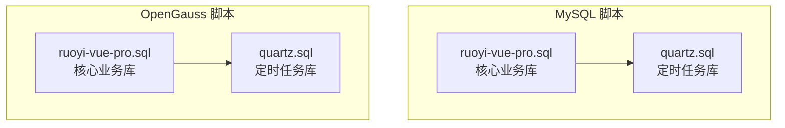
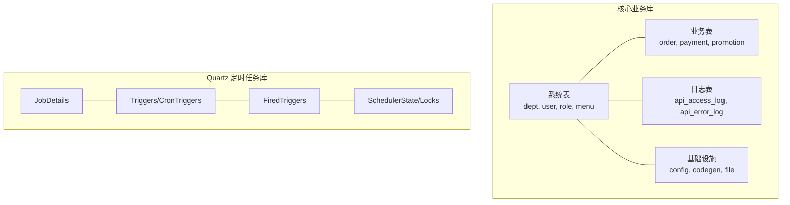
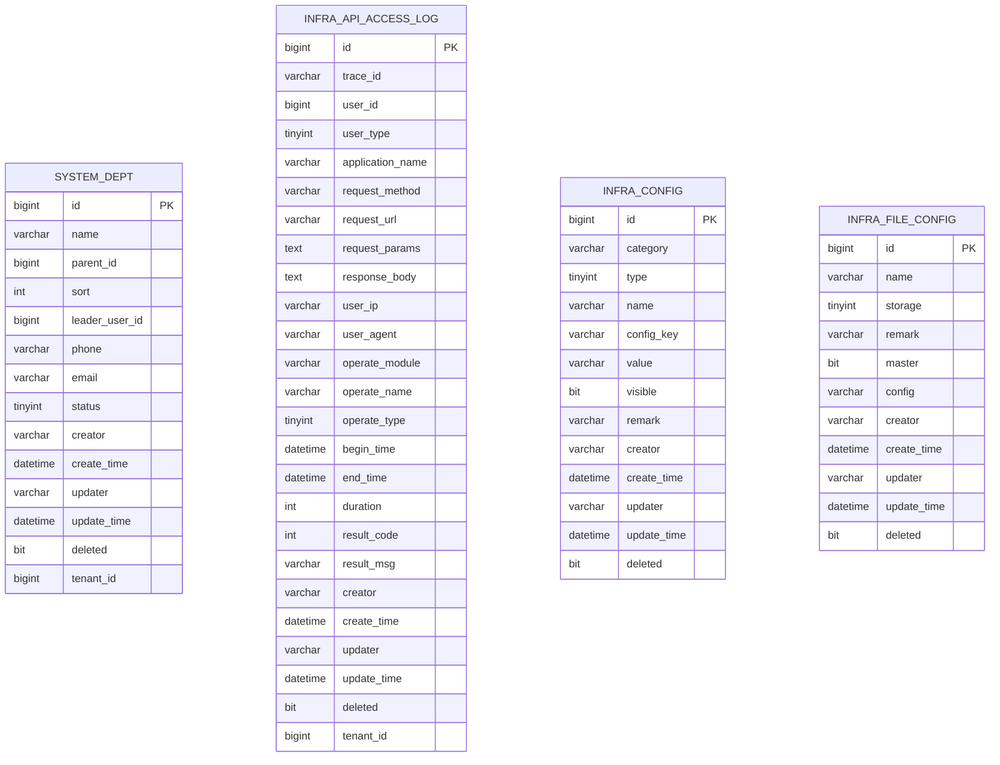
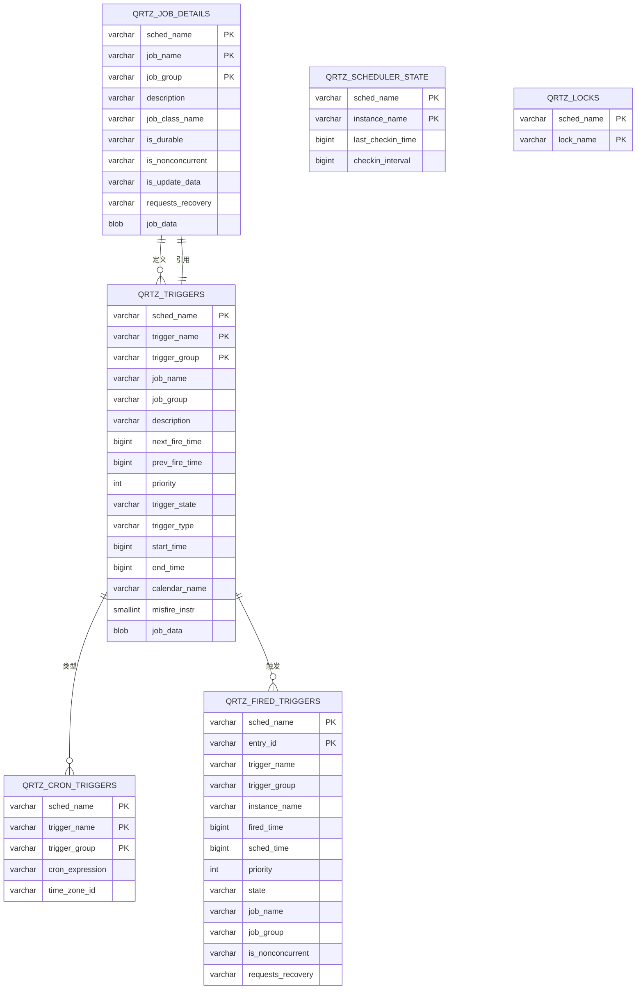
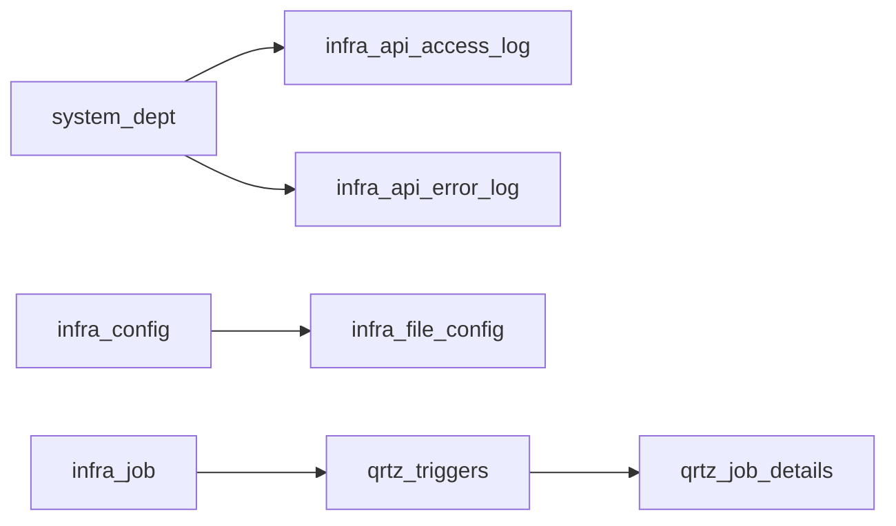

# 数据库架构概览

<cite>
**本文档引用的文件**
- [ruoyi-vue-pro.sql](file://backend/sql/mysql/ruoyi-vue-pro.sql)
- [quartz.sql](file://backend/sql/mysql/quartz.sql)
- [ruoyi-vue-pro.sql](file://backend/sql/opengauss/ruoyi-vue-pro.sql)
- [quartz.sql](file://backend/sql/opengauss/quartz.sql)
</cite>

## 目录
1. [项目简介](#项目简介)
2. [项目结构](#项目结构)
3. [核心组件](#核心组件)
4. [架构总览](#架构总览)
5. [详细组件分析](#详细组件分析)
6. [依赖关系分析](#依赖关系分析)
7. [性能考虑](#性能考虑)
8. [故障排除指南](#故障排除指南)
9. [结论](#结论)
10. [附录](#附录)

## 项目简介
本文件面向数据库架构设计，基于 ruoyi-vue-pro 项目的数据库脚本，系统化梳理核心数据库与 Quartz 定时任务数据库的设计思路、表空间规划、分区策略、字符集与排序规则、连接池与事务管理、并发控制、多租户隔离与数据权限控制，以及性能监控与容量规划建议。文档同时覆盖 MySQL 与 OpenGauss 的差异实现，帮助读者在不同数据库引擎下进行架构迁移与优化。

## 项目结构
数据库相关资源主要分布在 backend/sql 目录下，按数据库类型与功能划分：
- mysql：标准 MySQL 脚本，包含 ruoyi-vue-pro 核心业务库与 Quartz 定时任务库
- opengauss：针对 OpenGauss 的适配脚本，包含数据类型映射与索引差异

**图表来源**
- [ruoyi-vue-pro.sql](file://backend/sql/mysql/ruoyi-vue-pro.sql)
- [quartz.sql](file://backend/sql/mysql/quartz.sql)
- [ruoyi-vue-pro.sql](file://backend/sql/opengauss/ruoyi-vue-pro.sql)
- [quartz.sql](file://backend/sql/opengauss/quartz.sql)

**章节来源**
- [ruoyi-vue-pro.sql](file://backend/sql/mysql/ruoyi-vue-pro.sql)
- [quartz.sql](file://backend/sql/mysql/quartz.sql)
- [ruoyi-vue-pro.sql](file://backend/sql/opengauss/ruoyi-vue-pro.sql)
- [quartz.sql](file://backend/sql/opengauss/quartz.sql)

## 核心组件
- 核心业务库（ruoyi-vue-pro）
  - 日志与基础设施：API 访问日志、异常日志、代码生成、参数配置、文件存储等
  - 组织与权限：部门、用户、角色、菜单、数据权限字典等
  - 业务模块：支付、订单、营销、售后、报表等（根据实际业务扩展）
- Quartz 定时任务库
  - 任务调度：JobDetails、Triggers、CronTriggers、FiredTriggers、SchedulerState、Locks 等

这些组件共同构成系统的数据层基础，支撑上层业务逻辑与自动化调度。

**章节来源**
- [ruoyi-vue-pro.sql](file://backend/sql/mysql/ruoyi-vue-pro.sql)
- [quartz.sql](file://backend/sql/mysql/quartz.sql)

## 架构总览
数据库架构采用“核心业务库 + Quartz 定时任务库”的双库设计，核心业务库承载组织、权限、日志与业务实体，Quartz 库独立存放调度元数据，避免与业务库耦合。多租户通过租户 ID 字段实现逻辑隔离；数据权限通过字典与策略约束实现。

**图表来源**
- [ruoyi-vue-pro.sql](file://backend/sql/mysql/ruoyi-vue-pro.sql)
- [quartz.sql](file://backend/sql/mysql/quartz.sql)

## 详细组件分析

### 核心业务库（ruoyi-vue-pro）
- 字符集与排序规则
  - MySQL 版本统一使用 utf8mb4 字符集与 utf8mb4_unicode_ci 排序规则，确保多语言与表情符号支持
- 主要表族
  - 系统与权限：system_dept、system_dict_data 等，支撑组织架构与数据字典
  - 日志与审计：infra_api_access_log、infra_api_error_log，记录接口访问与异常
  - 基础设施：infra_config、infra_file、infra_codegen_table 等，支撑配置中心、文件存储与代码生成
  - 业务实体：根据模块扩展（如 trade、pay、promotion 等），统一带 deleted 字段支持软删除
- 租户隔离
  - 多数业务表包含 tenant_id 字段，结合业务层过滤实现租户级数据隔离
- 并发控制
  - 通过唯一索引（如字典类型+键）、乐观锁字段（update_time）与事务保证一致性
- 分区策略
  - 建议对日志类大表（如访问日志、错误日志）按时间分区（月/季度），并建立按 create_time 的二级索引以优化扫描

**图表来源**
- [ruoyi-vue-pro.sql](file://backend/sql/mysql/ruoyi-vue-pro.sql)

**章节来源**
- [ruoyi-vue-pro.sql](file://backend/sql/mysql/ruoyi-vue-pro.sql)

### Quartz 定时任务库
- 表结构与关系
  - JobDetails：任务定义
  - Triggers/CronTriggers：触发器与 Cron 表达式
  - FiredTriggers：已触发记录
  - SchedulerState/Locks：调度器状态与分布式锁
- 关系约束
  - 外键约束保证触发器与任务、触发器与具体触发器类型的一致性
- 并发与一致性
  - 通过 locks 实现分布式锁，避免重复调度
  - SchedulerState 心跳检测保障调度器存活

**图表来源**
- [quartz.sql](file://backend/sql/mysql/quartz.sql)

**章节来源**
- [quartz.sql](file://backend/sql/mysql/quartz.sql)

### 多租户与数据权限
- 多租户隔离
  - 在核心业务库中，通过在关键表添加 tenant_id 字段实现租户级数据隔离
  - 建议在查询层默认加入 tenant_id 过滤，避免误读跨租户数据
- 数据权限控制
  - 通过系统字典与权限策略（如角色、部门范围）限制数据访问范围
  - 建议在业务层增加数据权限拦截器，统一处理数据范围过滤

**章节来源**
- [ruoyi-vue-pro.sql](file://backend/sql/mysql/ruoyi-vue-pro.sql)

### 字符集与排序规则
- MySQL 版本
  - 统一使用 utf8mb4 字符集与 utf8mb4_unicode_ci 排序规则，支持更广泛的字符与排序行为
- OpenGauss 适配
  - 类型映射：tinyint → int2，bigint → int8，text → text，blob → bytea
  - 保持一致的排序规则与索引策略，确保跨引擎一致性

**章节来源**
- [ruoyi-vue-pro.sql](file://backend/sql/mysql/ruoyi-vue-pro.sql)
- [ruoyi-vue-pro.sql](file://backend/sql/opengauss/ruoyi-vue-pro.sql)

### 分区策略
- 建议对日志类大表（如 API 访问日志、异常日志）按时间分区（月/季度）
- 为分区表建立按 create_time 的二级索引，提升按时间范围查询效率
- 对高频写入的表（如任务日志）可考虑归档策略，降低在线表膨胀

**章节来源**
- [ruoyi-vue-pro.sql](file://backend/sql/mysql/ruoyi-vue-pro.sql)

## 依赖关系分析
- 业务表依赖系统表（如部门、字典）进行展示与校验
- 日志表作为审计与监控的数据来源，为运营与安全分析提供依据
- Quartz 任务库与业务库解耦，通过任务处理器与业务服务交互

**图表来源**
- [ruoyi-vue-pro.sql](file://backend/sql/mysql/ruoyi-vue-pro.sql)
- [quartz.sql](file://backend/sql/mysql/quartz.sql)

**章节来源**
- [ruoyi-vue-pro.sql](file://backend/sql/mysql/ruoyi-vue-pro.sql)
- [quartz.sql](file://backend/sql/mysql/quartz.sql)

## 性能考虑
- 连接池配置
  - 建议连接池大小与业务峰值 QPS 匹配，启用空闲回收与连接健康检查
  - 对只读查询使用只读连接，减少写锁竞争
- 事务管理
  - 将短事务最小化，避免长事务占用锁资源
  - 对批量写入使用批处理与事务合并，减少往返开销
- 并发控制
  - 使用唯一索引与乐观锁字段（如 update_time）避免并发冲突
  - 对热点表采用分片或读写分离，降低单点压力
- 监控指标
  - 连接池：活跃连接数、等待时间、拒绝次数
  - SQL：慢查询数量、平均执行时间、锁等待时间
  - 磁盘与内存：缓冲池命中率、日志刷盘频率、临时表使用情况
- 容量规划
  - 基于日志表增长趋势估算存储需求，制定定期归档与清理策略
  - 对高并发表预留 20%-30% 的增长余量，避免高峰期抖动

[本节为通用指导，无需特定文件引用]

## 故障排除指南
- 连接问题
  - 检查连接池配置与最大连接数上限
  - 核对字符集与排序规则是否匹配（utf8mb4_unicode_ci）
- 性能问题
  - 分析慢查询日志，确认缺少索引或分区缺失
  - 对大表执行 EXPLAIN，优化 WHERE 条件与 JOIN 顺序
- Quartz 调度异常
  - 检查 SchedulerState 心跳与 Locks 状态，确认调度器存活
  - 核对 Cron 表达式与时区配置
- 多租户数据泄露
  - 确认业务层是否正确注入 tenant_id 过滤
  - 校验字典与权限策略是否覆盖所有数据访问路径

**章节来源**
- [quartz.sql](file://backend/sql/mysql/quartz.sql)
- [ruoyi-vue-pro.sql](file://backend/sql/mysql/ruoyi-vue-pro.sql)

## 结论
该数据库架构以“核心业务库 + Quartz 任务库”为核心，结合多租户字段与数据权限策略，形成清晰的职责边界与隔离机制。通过统一字符集与排序规则、合理的索引与分区策略，以及完善的监控与容量规划，能够满足高并发与多租户场景下的稳定性与可维护性要求。在不同数据库引擎（MySQL/OpenGauss）下，遵循类型映射与索引差异，可实现平滑迁移与一致性保障。

[本节为总结性内容，无需特定文件引用]

## 附录
- 版本兼容性
  - MySQL：8.2.0 及以上版本
  - OpenGauss：兼容 MySQL 语法，注意数据类型映射与索引差异
- 建议的运维实践
  - 定期备份与恢复演练
  - 对日志表实施自动清理与归档
  - 监控关键指标并建立告警阈值

**章节来源**
- [ruoyi-vue-pro.sql](file://backend/sql/mysql/ruoyi-vue-pro.sql)
- [quartz.sql](file://backend/sql/mysql/quartz.sql)
- [ruoyi-vue-pro.sql](file://backend/sql/opengauss/ruoyi-vue-pro.sql)
- [quartz.sql](file://backend/sql/opengauss/quartz.sql)