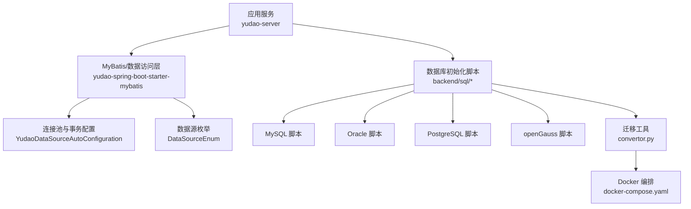
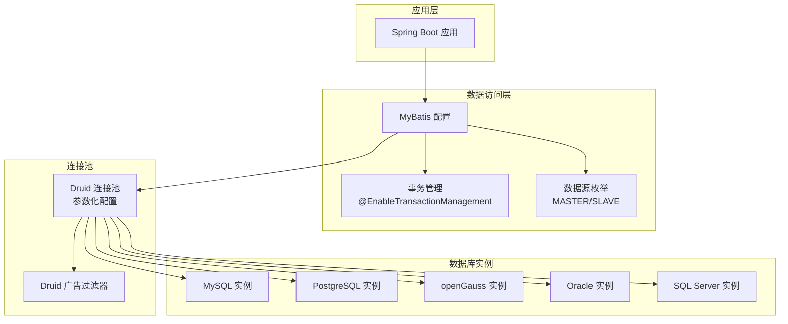
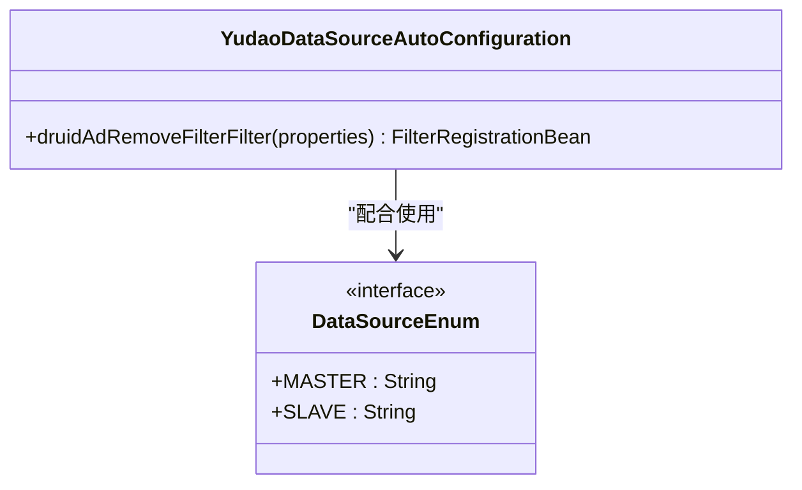
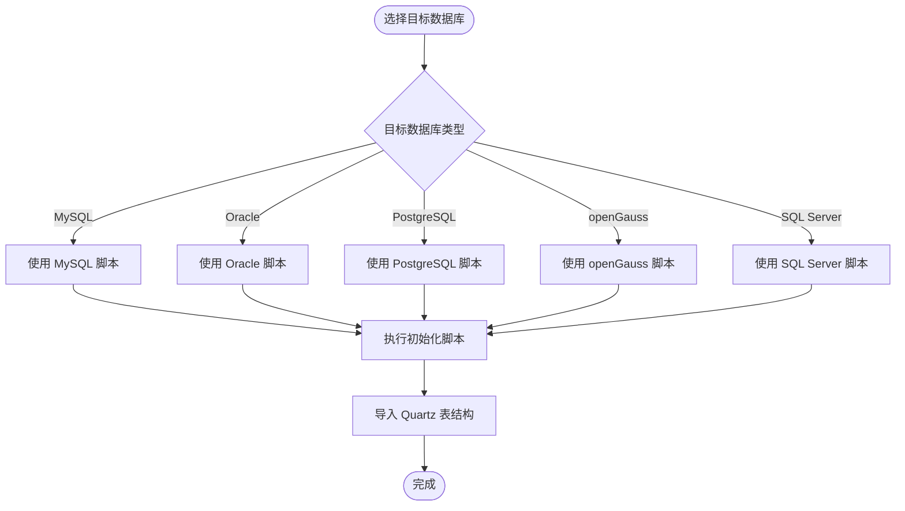
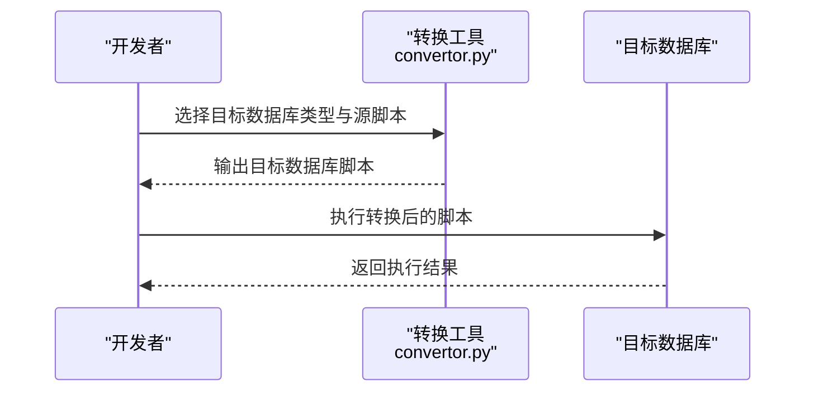
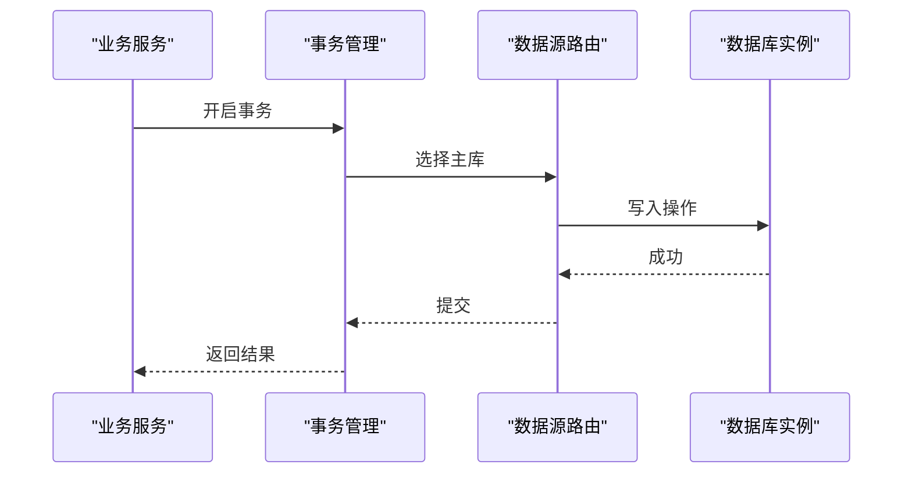
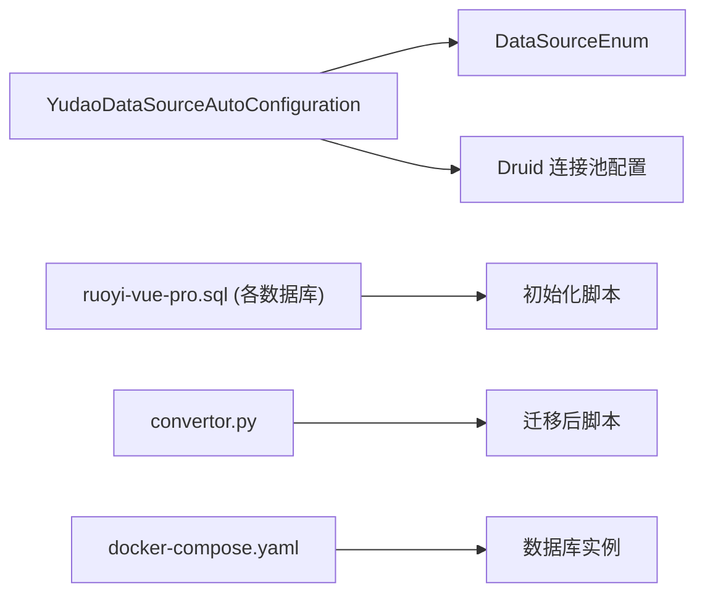

# 数据库架构设计

<cite>
**本文档引用的文件**
- [YudaoDataSourceAutoConfiguration.java](file://backend/yudao-framework/yudao-spring-boot-starter-mybatis/src/main/java/cn/iocoder/yudao/framework/datasource/config/YudaoDataSourceAutoConfiguration.java)
- [DataSourceEnum.java](file://backend/yudao-framework/yudao-spring-boot-starter-mybatis/src/main/java/cn/iocoder/yudao/framework/datasource/core/enums/DataSourceEnum.java)
- [ruoyi-vue-pro.sql (MySQL)](file://backend/sql/mysql/ruoyi-vue-pro.sql)
- [quartz.sql (MySQL)](file://backend/sql/mysql/quartz.sql)
- [ruoyi-vue-pro.sql (Oracle)](file://backend/sql/oracle/ruoyi-vue-pro.sql)
- [ruoyi-vue-pro.sql (PostgreSQL)](file://backend/sql/postgresql/ruoyi-vue-pro.sql)
- [ruoyi-vue-pro.sql (openGauss)](file://backend/sql/opengauss/ruoyi-vue-pro.sql)
- [convertor.py](file://backend/sql/tools/convertor.py)
- [docker-compose.yaml](file://backend/sql/tools/docker-compose.yaml)
- [application-local.yaml](file://backend/yudao-server/src/main/resources/application-local.yaml)
</cite>

## 目录
1. [简介](#简介)
2. [项目结构](#项目结构)
3. [核心组件](#核心组件)
4. [架构总览](#架构总览)
5. [详细组件分析](#详细组件分析)
6. [依赖关系分析](#依赖关系分析)
7. [性能考虑](#性能考虑)
8. [故障排查指南](#故障排查指南)
9. [结论](#结论)
10. [附录](#附录)

## 简介
本文件面向AgenticCPS项目的数据库架构设计，系统化阐述多数据库支持策略（MySQL 8.0、Oracle、PostgreSQL、SQL Server、openGauss等）、连接池与事务管理、数据一致性保障、初始化脚本与跨数据库迁移、性能优化与监控、备份恢复与高可用部署等关键主题。文档以仓库现有实现为依据，结合脚本与配置，形成可落地的设计说明。

## 项目结构
数据库相关资源主要分布在以下位置：
- 初始化脚本：backend/sql 下按数据库类型划分的schema脚本与定时任务脚本
- 迁移工具：backend/sql/tools 中的数据库脚本转换器与容器编排
- 连接池与事务：backend/yudao-framework/yudao-spring-boot-starter-mybatis 中的自动配置与枚举
- 应用配置：backend/yudao-server/src/main/resources/application-local.yaml 中的连接池与数据源配置示例

图表来源
- [YudaoDataSourceAutoConfiguration.java:17-40](file://backend/yudao-framework/yudao-spring-boot-starter-mybatis/src/main/java/cn/iocoder/yudao/framework/datasource/config/YudaoDataSourceAutoConfiguration.java#L17-L40)
- [DataSourceEnum.java:11-22](file://backend/yudao-framework/yudao-spring-boot-starter-mybatis/src/main/java/cn/iocoder/yudao/framework/datasource/core/enums/DataSourceEnum.java#L11-L22)
- [application-local.yaml:33-50](file://backend/yudao-server/src/main/resources/application-local.yaml#L33-L50)
- [ruoyi-vue-pro.sql (MySQL):1-200](file://backend/sql/mysql/ruoyi-vue-pro.sql#L1-L200)
- [ruoyi-vue-pro.sql (Oracle):1-200](file://backend/sql/oracle/ruoyi-vue-pro.sql#L1-L200)
- [ruoyi-vue-pro.sql (PostgreSQL):1-200](file://backend/sql/postgresql/ruoyi-vue-pro.sql#L1-L200)
- [ruoyi-vue-pro.sql (openGauss):1-200](file://backend/sql/opengauss/ruoyi-vue-pro.sql#L1-L200)
- [convertor.py:923-960](file://backend/sql/tools/convertor.py#L923-L960)
- [docker-compose.yaml:45-134](file://backend/sql/tools/docker-compose.yaml#L45-L134)

章节来源
- [YudaoDataSourceAutoConfiguration.java:17-40](file://backend/yudao-framework/yudao-spring-boot-starter-mybatis/src/main/java/cn/iocoder/yudao/framework/datasource/config/YudaoDataSourceAutoConfiguration.java#L17-L40)
- [DataSourceEnum.java:11-22](file://backend/yudao-framework/yudao-spring-boot-starter-mybatis/src/main/java/cn/iocoder/yudao/framework/datasource/core/enums/DataSourceEnum.java#L11-L22)
- [application-local.yaml:33-50](file://backend/yudao-server/src/main/resources/application-local.yaml#L33-L50)

## 核心组件
- 连接池与事务配置
  - 自动装配启用事务管理，并集成Druid监控过滤器，用于移除广告脚本并暴露监控页面。
  - Druid连接池参数覆盖初始大小、最小空闲、最大活跃、获取超时、空闲回收周期、空闲/存活阈值、校验查询、预编译语句缓存等。
- 多数据源枚举
  - 定义主库与从库标识，配合注解实现读写分离路由。
- 初始化脚本
  - 提供MySQL、Oracle、PostgreSQL、openGauss等多套schema脚本，覆盖基础日志表、配置表、代码生成表等。
  - Quartz定时任务表脚本独立维护，便于后台任务调度。
- 迁移与容器化
  - Python脚本支持将MySQL脚本转换为目标数据库（PostgreSQL、Oracle、SQL Server、达梦、金仓、openGauss）语法。
  - docker-compose提供多种数据库的快速拉起与初始化脚本挂载。

章节来源
- [YudaoDataSourceAutoConfiguration.java:17-40](file://backend/yudao-framework/yudao-spring-boot-starter-mybatis/src/main/java/cn/iocoder/yudao/framework/datasource/config/YudaoDataSourceAutoConfiguration.java#L17-L40)
- [DataSourceEnum.java:11-22](file://backend/yudao-framework/yudao-spring-boot-starter-mybatis/src/main/java/cn/iocoder/yudao/framework/datasource/core/enums/DataSourceEnum.java#L11-L22)
- [ruoyi-vue-pro.sql (MySQL):1-200](file://backend/sql/mysql/ruoyi-vue-pro.sql#L1-L200)
- [quartz.sql (MySQL):1-200](file://backend/sql/mysql/quartz.sql#L1-L200)
- [convertor.py:923-960](file://backend/sql/tools/convertor.py#L923-L960)
- [docker-compose.yaml:45-134](file://backend/sql/tools/docker-compose.yaml#L45-L134)

## 架构总览
下图展示应用如何通过MyBatis与多数据库交互，以及连接池与事务管理的关键节点。

图表来源
- [YudaoDataSourceAutoConfiguration.java:17-40](file://backend/yudao-framework/yudao-spring-boot-starter-mybatis/src/main/java/cn/iocoder/yudao/framework/datasource/config/YudaoDataSourceAutoConfiguration.java#L17-L40)
- [DataSourceEnum.java:11-22](file://backend/yudao-framework/yudao-spring-boot-starter-mybatis/src/main/java/cn/iocoder/yudao/framework/datasource/core/enums/DataSourceEnum.java#L11-L22)
- [application-local.yaml:33-50](file://backend/yudao-server/src/main/resources/application-local.yaml#L33-L50)

## 详细组件分析

### 连接池与事务管理
- 事务管理
  - 通过@EnableTransactionManagement启用声明式事务，代理目标类，确保注解驱动的事务生效。
- Druid连接池
  - 初始连接数、最小空闲、最大活跃、获取超时、空闲回收周期、空闲/存活阈值、校验查询、预编译语句缓存等参数均在配置中体现。
  - 支持stat-view监控页面，可通过过滤器移除common.js中的广告脚本，提升监控页面体验。
- 数据源枚举
  - 提供MASTER与SLAVE标识，配合注解实现读写分离路由。

图表来源
- [YudaoDataSourceAutoConfiguration.java:17-40](file://backend/yudao-framework/yudao-spring-boot-starter-mybatis/src/main/java/cn/iocoder/yudao/framework/datasource/config/YudaoDataSourceAutoConfiguration.java#L17-L40)
- [DataSourceEnum.java:11-22](file://backend/yudao-framework/yudao-spring-boot-starter-mybatis/src/main/java/cn/iocoder/yudao/framework/datasource/core/enums/DataSourceEnum.java#L11-L22)

章节来源
- [YudaoDataSourceAutoConfiguration.java:17-40](file://backend/yudao-framework/yudao-spring-boot-starter-mybatis/src/main/java/cn/iocoder/yudao/framework/datasource/config/YudaoDataSourceAutoConfiguration.java#L17-L40)
- [DataSourceEnum.java:11-22](file://backend/yudao-framework/yudao-spring-boot-starter-mybatis/src/main/java/cn/iocoder/yudao/framework/datasource/core/enums/DataSourceEnum.java#L11-L22)
- [application-local.yaml:33-50](file://backend/yudao-server/src/main/resources/application-local.yaml#L33-L50)

### 多数据库支持与脚本结构
- MySQL
  - 提供完整的schema脚本与Quartz定时任务脚本，覆盖日志、配置、代码生成等核心表。
- Oracle
  - 使用NUMBER/VARCHAR2/CLOB/DATE等类型映射，提供序列与索引定义，适配PL/SQL语法。
- PostgreSQL/openGauss
  - 使用timestamp/text/int8/int2等类型映射，提供序列与索引定义，适配PostgreSQL生态。
- SQL Server
  - 在docker-compose中提供镜像与初始化脚本挂载，便于快速验证。

图表来源
- [ruoyi-vue-pro.sql (MySQL):1-200](file://backend/sql/mysql/ruoyi-vue-pro.sql#L1-L200)
- [ruoyi-vue-pro.sql (Oracle):1-200](file://backend/sql/oracle/ruoyi-vue-pro.sql#L1-L200)
- [ruoyi-vue-pro.sql (PostgreSQL):1-200](file://backend/sql/postgresql/ruoyi-vue-pro.sql#L1-L200)
- [ruoyi-vue-pro.sql (openGauss):1-200](file://backend/sql/opengauss/ruoyi-vue-pro.sql#L1-L200)
- [quartz.sql (MySQL):1-200](file://backend/sql/mysql/quartz.sql#L1-L200)

章节来源
- [ruoyi-vue-pro.sql (MySQL):1-200](file://backend/sql/mysql/ruoyi-vue-pro.sql#L1-L200)
- [ruoyi-vue-pro.sql (Oracle):1-200](file://backend/sql/oracle/ruoyi-vue-pro.sql#L1-L200)
- [ruoyi-vue-pro.sql (PostgreSQL):1-200](file://backend/sql/postgresql/ruoyi-vue-pro.sql#L1-L200)
- [ruoyi-vue-pro.sql (openGauss):1-200](file://backend/sql/opengauss/ruoyi-vue-pro.sql#L1-L200)
- [quartz.sql (MySQL):1-200](file://backend/sql/mysql/quartz.sql#L1-L200)

### 跨数据库迁移方案
- 转换工具
  - convertor.py支持将MySQL脚本转换为PostgreSQL、Oracle、SQL Server、达梦、金仓、openGauss等目标数据库语法。
  - 工具会处理默认值、类型映射、约束与索引差异等。
- 容器编排
  - docker-compose提供各数据库镜像与初始化脚本挂载，便于本地或CI环境快速验证迁移结果。

图表来源
- [convertor.py:923-960](file://backend/sql/tools/convertor.py#L923-L960)
- [docker-compose.yaml:45-134](file://backend/sql/tools/docker-compose.yaml#L45-L134)

章节来源
- [convertor.py:923-960](file://backend/sql/tools/convertor.py#L923-L960)
- [docker-compose.yaml:45-134](file://backend/sql/tools/docker-compose.yaml#L45-L134)

### 事务管理机制与数据一致性
- 声明式事务
  - 通过@EnableTransactionManagement启用事务，结合注解实现方法级事务边界控制。
- 连接池校验
  - Druid配置validation-query与test-while-idle等参数，确保连接有效性，降低脏读与不一致风险。
- 多数据源一致性
  - 通过MASTER/SLAVE枚举与注解路由，确保写操作走主库，读操作走从库，避免读写冲突。

图表来源
- [YudaoDataSourceAutoConfiguration.java:17-40](file://backend/yudao-framework/yudao-spring-boot-starter-mybatis/src/main/java/cn/iocoder/yudao/framework/datasource/config/YudaoDataSourceAutoConfiguration.java#L17-L40)
- [DataSourceEnum.java:11-22](file://backend/yudao-framework/yudao-spring-boot-starter-mybatis/src/main/java/cn/iocoder/yudao/framework/datasource/core/enums/DataSourceEnum.java#L11-L22)

章节来源
- [YudaoDataSourceAutoConfiguration.java:17-40](file://backend/yudao-framework/yudao-spring-boot-starter-mybatis/src/main/java/cn/iocoder/yudao/framework/datasource/config/YudaoDataSourceAutoConfiguration.java#L17-L40)
- [DataSourceEnum.java:11-22](file://backend/yudao-framework/yudao-spring-boot-starter-mybatis/src/main/java/cn/iocoder/yudao/framework/datasource/core/enums/DataSourceEnum.java#L11-L22)
- [application-local.yaml:33-50](file://backend/yudao-server/src/main/resources/application-local.yaml#L33-L50)

### 性能优化与索引策略
- 连接池参数
  - 合理设置initial-size、min-idle、max-active、max-wait、min-evictable-idle-time-millis等，平衡并发与资源占用。
  - 开启pool-prepared-statements与限制每个连接的缓存数量，减少预编译开销。
- 索引策略
  - 基于高频查询字段建立索引（如create_time），避免全表扫描；同时关注写入成本与存储空间。
- Quartz优化
  - Quartz表结构包含必要索引，建议结合任务负载调整触发器表达式与并发度。

章节来源
- [application-local.yaml:33-50](file://backend/yudao-server/src/main/resources/application-local.yaml#L33-L50)
- [ruoyi-vue-pro.sql (MySQL):20-200](file://backend/sql/mysql/ruoyi-vue-pro.sql#L20-L200)
- [quartz.sql (MySQL):1-200](file://backend/sql/mysql/quartz.sql#L1-L200)

### 读写分离实现
- 枚举与注解
  - 使用MASTER/SLAVE枚举与注解标注方法或类，实现读写分离路由。
- 运维建议
  - 主从延迟监控与隔离级别设置，避免“读到未提交”问题；对强一致场景采用主库直连。

章节来源
- [DataSourceEnum.java:11-22](file://backend/yudao-framework/yudao-spring-boot-starter-mybatis/src/main/java/cn/iocoder/yudao/framework/datasource/core/enums/DataSourceEnum.java#L11-L22)

### 监控指标与备份恢复
- 监控
  - Druid stat-view监控页面可用于观察连接池健康、SQL执行统计与慢查询。
- 备份恢复
  - 建议基于数据库原生命令进行定期逻辑备份；容器化部署时结合卷持久化与初始化脚本恢复。
- 高可用
  - 生产环境建议采用主从复制、VIP或数据库集群方案；结合连接池超时与重试策略提升可用性。

章节来源
- [YudaoDataSourceAutoConfiguration.java:25-38](file://backend/yudao-framework/yudao-spring-boot-starter-mybatis/src/main/java/cn/iocoder/yudao/framework/datasource/config/YudaoDataSourceAutoConfiguration.java#L25-L38)
- [docker-compose.yaml:45-134](file://backend/sql/tools/docker-compose.yaml#L45-L134)

## 依赖关系分析
- 组件耦合
  - 数据访问层依赖连接池与事务配置；数据源枚举为路由提供契约。
- 外部依赖
  - 多数据库脚本与迁移工具构成外部输入，容器编排提供运行时环境。

图表来源
- [YudaoDataSourceAutoConfiguration.java:17-40](file://backend/yudao-framework/yudao-spring-boot-starter-mybatis/src/main/java/cn/iocoder/yudao/framework/datasource/config/YudaoDataSourceAutoConfiguration.java#L17-L40)
- [DataSourceEnum.java:11-22](file://backend/yudao-framework/yudao-spring-boot-starter-mybatis/src/main/java/cn/iocoder/yudao/framework/datasource/core/enums/DataSourceEnum.java#L11-L22)
- [ruoyi-vue-pro.sql (MySQL):1-200](file://backend/sql/mysql/ruoyi-vue-pro.sql#L1-L200)
- [convertor.py:923-960](file://backend/sql/tools/convertor.py#L923-L960)
- [docker-compose.yaml:45-134](file://backend/sql/tools/docker-compose.yaml#L45-L134)

章节来源
- [YudaoDataSourceAutoConfiguration.java:17-40](file://backend/yudao-framework/yudao-spring-boot-starter-mybatis/src/main/java/cn/iocoder/yudao/framework/datasource/config/YudaoDataSourceAutoConfiguration.java#L17-L40)
- [DataSourceEnum.java:11-22](file://backend/yudao-framework/yudao-spring-boot-starter-mybatis/src/main/java/cn/iocoder/yudao/framework/datasource/core/enums/DataSourceEnum.java#L11-L22)
- [ruoyi-vue-pro.sql (MySQL):1-200](file://backend/sql/mysql/ruoyi-vue-pro.sql#L1-L200)
- [convertor.py:923-960](file://backend/sql/tools/convertor.py#L923-L960)
- [docker-compose.yaml:45-134](file://backend/sql/tools/docker-compose.yaml#L45-L134)

## 性能考虑
- 连接池调优
  - 根据QPS与并发线程数设定max-active与max-wait；开启test-while-idle与合理min-evictable-idle-time-millis，降低无效连接。
- SQL与索引
  - 针对高频查询字段建立合适索引；避免SELECT *，减少网络与解析开销。
- Quartz负载
  - 合理设置触发器频率与并发度，避免热点时段集中执行。

## 故障排查指南
- 连接池问题
  - 观察Druid监控页面的连接数、排队时间与异常SQL；检查max-wait与test-while-idle配置。
- 多数据源路由
  - 确认方法/类上的数据源注解与枚举常量一致；核对主从库配置与延迟情况。
- 跨数据库迁移
  - 使用convertor.py转换后，先在容器中验证脚本执行；核对类型映射与默认值差异。
- 定时任务
  - 检查Quartz表结构与索引；确认触发器表达式与实例心跳状态。

章节来源
- [YudaoDataSourceAutoConfiguration.java:25-38](file://backend/yudao-framework/yudao-spring-boot-starter-mybatis/src/main/java/cn/iocoder/yudao/framework/datasource/config/YudaoDataSourceAutoConfiguration.java#L25-L38)
- [DataSourceEnum.java:11-22](file://backend/yudao-framework/yudao-spring-boot-starter-mybatis/src/main/java/cn/iocoder/yudao/framework/datasource/core/enums/DataSourceEnum.java#L11-L22)
- [convertor.py:923-960](file://backend/sql/tools/convertor.py#L923-L960)
- [quartz.sql (MySQL):1-200](file://backend/sql/mysql/quartz.sql#L1-L200)

## 结论
本架构以多数据库脚本与迁移工具为基础，结合Druid连接池与声明式事务，实现了对MySQL、Oracle、PostgreSQL、openGauss等数据库的支持，并通过枚举与注解实现读写分离。配合容器化编排与监控指标，能够满足开发、测试与生产的多样化需求。建议在生产环境中进一步完善高可用、备份恢复与容量规划策略。

## 附录
- 关键配置参考路径
  - [application-local.yaml:33-50](file://backend/yudao-server/src/main/resources/application-local.yaml#L33-L50)
- 脚本与工具参考路径
  - [ruoyi-vue-pro.sql (MySQL):1-200](file://backend/sql/mysql/ruoyi-vue-pro.sql#L1-L200)
  - [ruoyi-vue-pro.sql (Oracle):1-200](file://backend/sql/oracle/ruoyi-vue-pro.sql#L1-L200)
  - [ruoyi-vue-pro.sql (PostgreSQL):1-200](file://backend/sql/postgresql/ruoyi-vue-pro.sql#L1-L200)
  - [ruoyi-vue-pro.sql (openGauss):1-200](file://backend/sql/opengauss/ruoyi-vue-pro.sql#L1-L200)
  - [quartz.sql (MySQL):1-200](file://backend/sql/mysql/quartz.sql#L1-L200)
  - [convertor.py:923-960](file://backend/sql/tools/convertor.py#L923-L960)
  - [docker-compose.yaml:45-134](file://backend/sql/tools/docker-compose.yaml#L45-L134)