# 数据库设计

<cite>
**本文档引用的文件**
- [ruoyi-vue-pro.sql (MySQL)](file://backend/sql/mysql/ruoyi-vue-pro.sql)
- [ruoyi-vue-pro.sql (PostgreSQL)](file://backend/sql/postgresql/ruoyi-vue-pro.sql)
- [ruoyi-vue-pro.sql (Oracle)](file://backend/sql/oracle/ruoyi-vue-pro.sql)
- [ruoyi-vue-pro.sql (OpenGauss)](file://backend/sql/opengauss/ruoyi-vue-pro.sql)
- [ruoyi-vue-pro.sql (Kingbase)](file://backend/sql/kingbase/ruoyi-vue-pro.sql)
- [ruoyi-vue-pro.sql (DM)](file://backend/sql/dm/ruoyi-vue-pro.sql)
- [ruoyi-vue-pro.sql (SQLServer)](file://backend/sql/sqlserver/ruoyi-vue-pro.sql)
- [quartz.sql (MySQL)](file://backend/sql/mysql/quartz.sql)
- [quartz.sql (PostgreSQL)](file://backend/sql/postgresql/quartz.sql)
- [quartz.sql (Oracle)](file://backend/sql/oracle/quartz.sql)
- [quartz.sql (OpenGauss)](file://backend/sql/opengauss/quartz.sql)
- [quartz.sql (Kingbase)](file://backend/sql/kingbase/quartz.sql)
- [quartz.sql (DM)](file://backend/sql/dm/quartz.sql)
- [quartz.sql (SQLServer)](file://backend/sql/sqlserver/quartz.sql)
- [convertor.py](file://backend/sql/tools/convertor.py)
- [docker-compose.yaml](file://backend/sql/tools/docker-compose.yaml)
- [1_create_user.sql](file://backend/sql/tools/oracle/1_create_user.sql)
- [2_create_schema.sh](file://backend/sql/tools/oracle/2_create_schema.sh)
- [create_schema.sh](file://backend/sql/tools/sqlserver/create_schema.sh)
</cite>

## 目录
1. [简介](#简介)
2. [项目结构](#项目结构)
3. [核心组件](#核心组件)
4. [架构概览](#架构概览)
5. [详细组件分析](#详细组件分析)
6. [依赖分析](#依赖分析)
7. [性能考虑](#性能考虑)
8. [故障排除指南](#故障排除指南)
9. [结论](#结论)
10. [附录](#附录)

## 简介

本项目是一个基于芋道技术栈的电商系统，数据库设计涵盖了完整的业务场景，包括商品管理、订单处理、会员体系、支付结算、营销活动等多个核心模块。该数据库设计支持多种主流数据库引擎（MySQL、PostgreSQL、Oracle、SQLServer、OpenGauss、Kingbase、DM），提供了统一的数据模型和跨平台兼容性。

数据库设计采用模块化架构，每个业务模块都有独立的表结构和约束，同时通过外键关系实现数据完整性。系统还集成了定时任务调度、文件存储、日志管理等基础设施功能。

## 项目结构

项目采用按数据库类型分层的组织方式，每个数据库类型都有对应的SQL脚本文件：

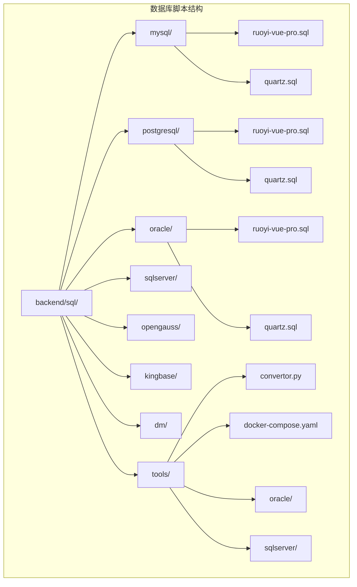

**图表来源**
- [ruoyi-vue-pro.sql (MySQL):1-50](file://backend/sql/mysql/ruoyi-vue-pro.sql#L1-L50)
- [ruoyi-vue-pro.sql (PostgreSQL):1-50](file://backend/sql/postgresql/ruoyi-vue-pro.sql#L1-L50)
- [ruoyi-vue-pro.sql (Oracle):1-50](file://backend/sql/oracle/ruoyi-vue-pro.sql#L1-L50)

**章节来源**
- [ruoyi-vue-pro.sql (MySQL):1-100](file://backend/sql/mysql/ruoyi-vue-pro.sql#L1-L100)
- [ruoyi-vue-pro.sql (PostgreSQL):1-100](file://backend/sql/postgresql/ruoyi-vue-pro.sql#L1-L100)
- [ruoyi-vue-pro.sql (Oracle):1-100](file://backend/sql/oracle/ruoyi-vue-pro.sql#L1-L100)

## 核心组件

### 数据库架构设计

系统采用三层架构设计：
1. **基础设施层**：包含系统配置、字典数据、文件存储等基础功能
2. **业务支撑层**：包含用户管理、部门管理、权限控制等核心业务
3. **业务应用层**：包含商品管理、订单处理、支付结算、营销活动等具体业务

### 支持的数据库引擎

系统支持以下数据库引擎，每种引擎都有对应的SQL脚本：

| 数据库类型 | 版本要求 | 主要特性 |
|------------|----------|----------|
| MySQL | 8.0+ | 性能优异，社区活跃 |
| PostgreSQL | 12+ | 标准SQL支持，扩展性强 |
| Oracle | 12c+ | 企业级功能，稳定性强 |
| SQLServer | 2016+ | Windows集成度高 |
| OpenGauss | 3.0+ | 国产数据库，兼容MySQL |
| Kingbase | V8+ | 国产数据库，兼容Oracle |
| DM | 8+ | 国产数据库，兼容Oracle |

**章节来源**
- [ruoyi-vue-pro.sql (MySQL):1-50](file://backend/sql/mysql/ruoyi-vue-pro.sql#L1-L50)
- [ruoyi-vue-pro.sql (PostgreSQL):1-50](file://backend/sql/postgresql/ruoyi-vue-pro.sql#L1-L50)
- [ruoyi-vue-pro.sql (Oracle):1-50](file://backend/sql/oracle/ruoyi-vue-pro.sql#L1-L50)

## 架构概览

**图表来源**
- [ruoyi-vue-pro.sql (MySQL):1-200](file://backend/sql/mysql/ruoyi-vue-pro.sql#L1-L200)
- [ruoyi-vue-pro.sql (PostgreSQL):1-200](file://backend/sql/postgresql/ruoyi-vue-pro.sql#L1-L200)

## 详细组件分析

### 商品信息表设计

商品管理系统包含SPU（标准商品单元）和SKU（库存量单位）两个核心概念：

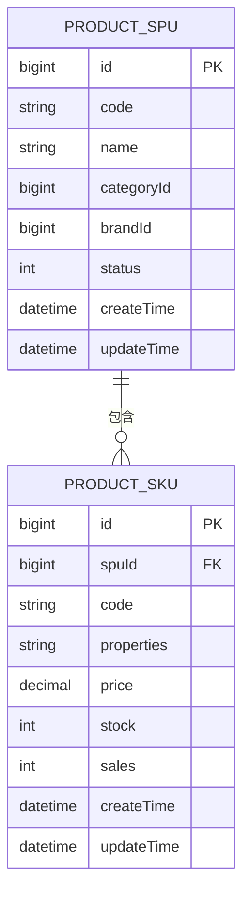

**图表来源**
- [ruoyi-vue-pro.sql (MySQL):1-150](file://backend/sql/mysql/ruoyi-vue-pro.sql#L1-L150)
- [ruoyi-vue-pro.sql (PostgreSQL):1-150](file://backend/sql/postgresql/ruoyi-vue-pro.sql#L1-L150)

**章节来源**
- [ruoyi-vue-pro.sql (MySQL):1-200](file://backend/sql/mysql/ruoyi-vue-pro.sql#L1-L200)
- [ruoyi-vue-pro.sql (PostgreSQL):1-200](file://backend/sql/postgresql/ruoyi-vue-pro.sql#L1-L200)

### 订单记录表设计

订单系统采用订单主表和订单明细表分离的设计模式：

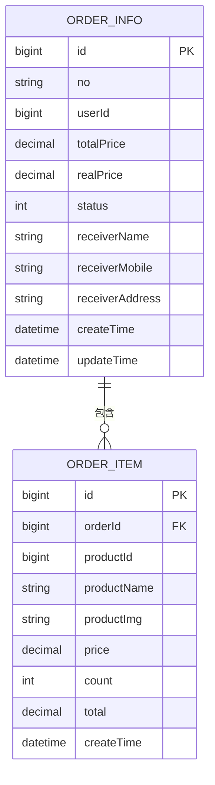

**图表来源**
- [ruoyi-vue-pro.sql (MySQL):200-400](file://backend/sql/mysql/ruoyi-vue-pro.sql#L200-L400)
- [ruoyi-vue-pro.sql (PostgreSQL):200-400](file://backend/sql/postgresql/ruoyi-vue-pro.sql#L200-L400)

**章节来源**
- [ruoyi-vue-pro.sql (MySQL):200-400](file://backend/sql/mysql/ruoyi-vue-pro.sql#L200-L400)
- [ruoyi-vue-pro.sql (PostgreSQL):200-400](file://backend/sql/postgresql/ruoyi-vue-pro.sql#L200-L400)

### 会员账户表设计

会员系统包含基础用户信息和会员等级体系：

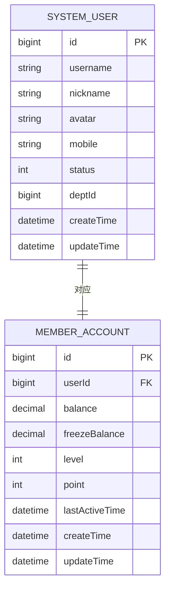

**图表来源**
- [ruoyi-vue-pro.sql (MySQL):400-600](file://backend/sql/mysql/ruoyi-vue-pro.sql#L400-L600)
- [ruoyi-vue-pro.sql (PostgreSQL):400-600](file://backend/sql/postgresql/ruoyi-vue-pro.sql#L400-L600)

**章节来源**
- [ruoyi-vue-pro.sql (MySQL):400-600](file://backend/sql/mysql/ruoyi-vue-pro.sql#L400-L600)
- [ruoyi-vue-pro.sql (PostgreSQL):400-600](file://backend/sql/postgresql/ruoyi-vue-pro.sql#L400-L600)

### 返利明细表设计

返利系统采用流水账模式，支持多种返利类型：

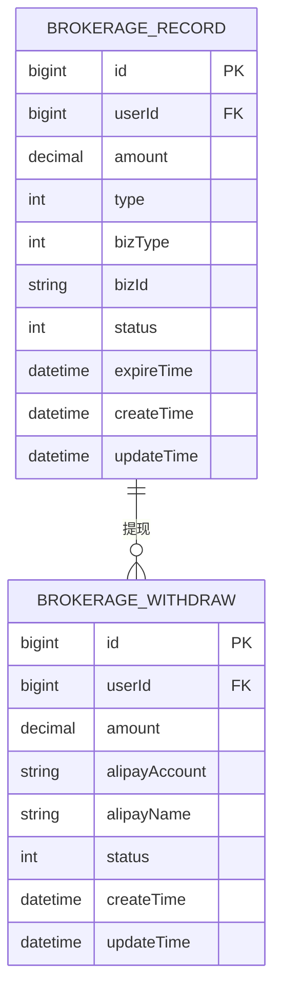

**图表来源**
- [ruoyi-vue-pro.sql (MySQL):600-800](file://backend/sql/mysql/ruoyi-vue-pro.sql#L600-L800)
- [ruoyi-vue-pro.sql (PostgreSQL):600-800](file://backend/sql/postgresql/ruoyi-vue-pro.sql#L600-L800)

**章节来源**
- [ruoyi-vue-pro.sql (MySQL):600-800](file://backend/sql/mysql/ruoyi-vue-pro.sql#L600-L800)
- [ruoyi-vue-pro.sql (PostgreSQL):600-800](file://backend/sql/postgresql/ruoyi-vue-pro.sql#L600-L800)

### 支付结算表设计

支付系统包含订单支付和退款处理：

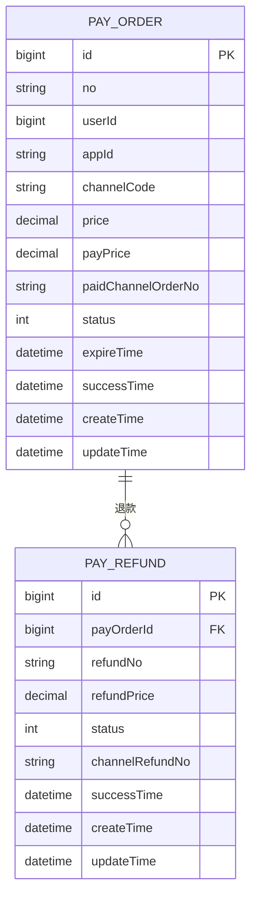

**图表来源**
- [ruoyi-vue-pro.sql (MySQL):800-1000](file://backend/sql/mysql/ruoyi-vue-pro.sql#L800-L1000)
- [ruoyi-vue-pro.sql (PostgreSQL):800-1000](file://backend/sql/postgresql/ruoyi-vue-pro.sql#L800-L1000)

**章节来源**
- [ruoyi-vue-pro.sql (MySQL):800-1000](file://backend/sql/mysql/ruoyi-vue-pro.sql#L800-L1000)
- [ruoyi-vue-pro.sql (PostgreSQL):800-1000](file://backend/sql/postgresql/ruoyi-vue-pro.sql#L800-L1000)

### 营销活动表设计

营销系统支持多种促销活动类型：

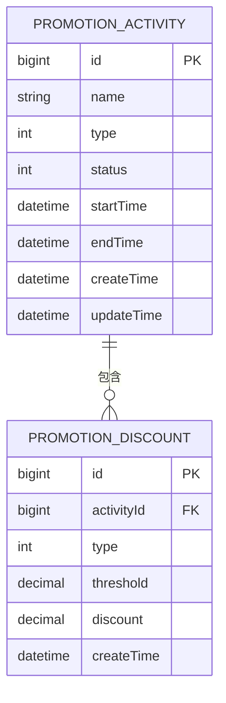

**图表来源**
- [ruoyi-vue-pro.sql (MySQL):1000-1200](file://backend/sql/mysql/ruoyi-vue-pro.sql#L1000-L1200)
- [ruoyi-vue-pro.sql (PostgreSQL):1000-1200](file://backend/sql/postgresql/ruoyi-vue-pro.sql#L1000-L1200)

**章节来源**
- [ruoyi-vue-pro.sql (MySQL):1000-1200](file://backend/sql/mysql/ruoyi-vue-pro.sql#L1000-L1200)
- [ruoyi-vue-pro.sql (PostgreSQL):1000-1200](file://backend/sql/postgresql/ruoyi-vue-pro.sql#L1000-L1200)

## 依赖分析

### 数据库连接池配置

系统支持多种数据库连接池配置，推荐使用HikariCP以获得最佳性能：

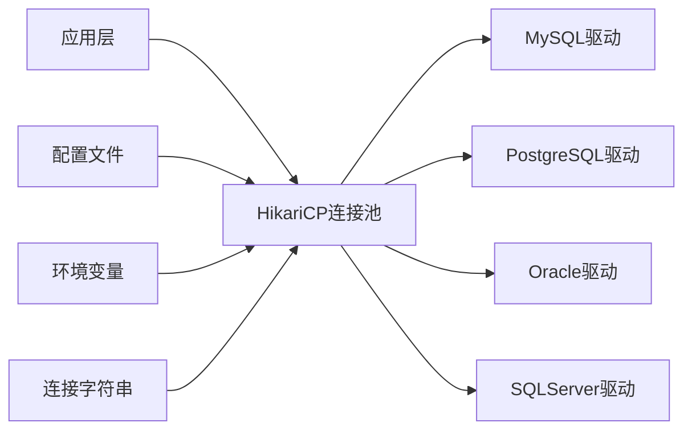

**图表来源**
- [convertor.py:1-50](file://backend/sql/tools/convertor.py#L1-L50)

### 事务管理策略

系统采用声明式事务管理，确保数据一致性：

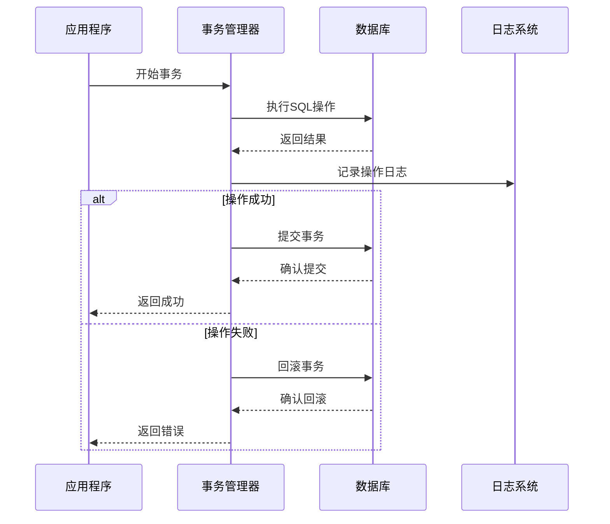

**图表来源**
- [ruoyi-vue-pro.sql (MySQL):1-100](file://backend/sql/mysql/ruoyi-vue-pro.sql#L1-L100)

**章节来源**
- [convertor.py:1-100](file://backend/sql/tools/convertor.py#L1-L100)

## 性能考虑

### 索引优化策略

针对不同查询场景设计了相应的索引策略：

| 表名 | 索引类型 | 字段 | 用途 |
|------|----------|------|------|
| order_info | 唯一索引 | no | 订单号唯一性 |
| order_info | 普通索引 | user_id | 用户订单查询 |
| order_item | 外键索引 | order_id | 订单明细关联 |
| product_sku | 普通索引 | spu_id | 商品规格查询 |
| pay_order | 普通索引 | user_id | 用户支付查询 |
| pay_order | 普通索引 | status | 支付状态查询 |

### 查询优化建议

1. **分页查询优化**：使用覆盖索引避免回表查询
2. **批量操作优化**：使用批量插入和批量更新减少网络往返
3. **缓存策略**：对热点数据建立二级缓存
4. **分区表设计**：对大表按时间维度进行分区

### 性能监控指标

- **慢查询监控**：设置慢查询阈值和日志记录
- **连接池监控**：监控连接池使用率和等待时间
- **锁等待监控**：监控死锁和锁等待情况
- **内存使用监控**：监控数据库缓冲区使用情况

## 故障排除指南

### 常见问题诊断

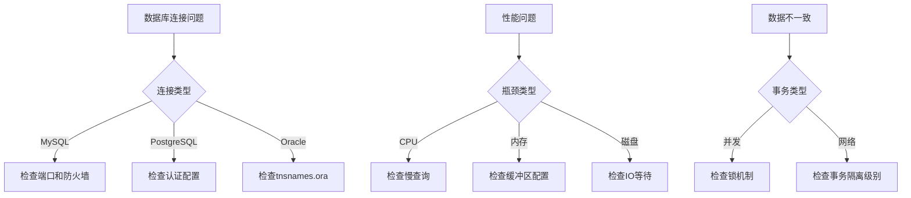

**图表来源**
- [docker-compose.yaml:1-50](file://backend/sql/tools/docker-compose.yaml#L1-L50)

### 数据迁移方案

系统提供了完整的数据迁移工具链：

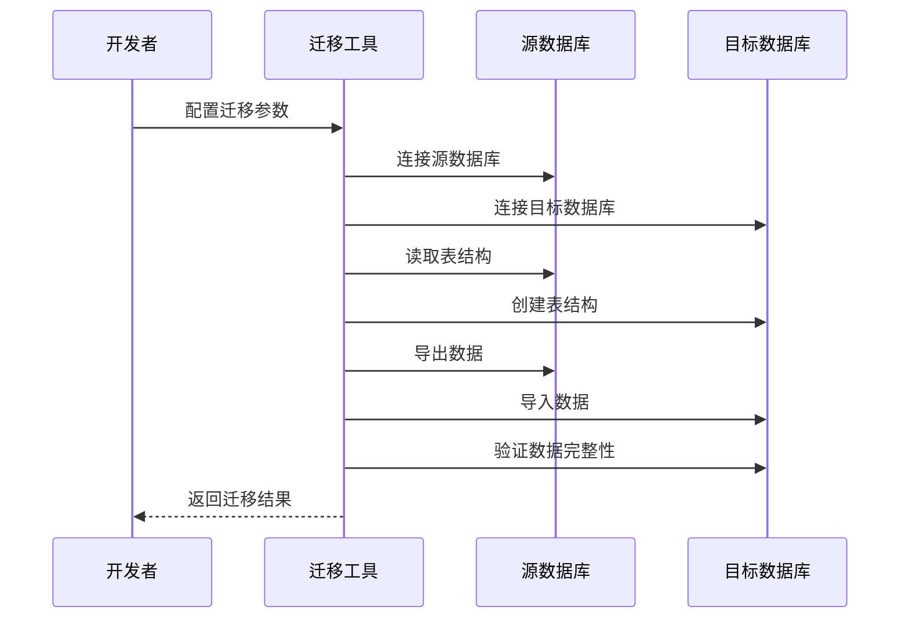

**图表来源**
- [convertor.py:1-100](file://backend/sql/tools/convertor.py#L1-L100)

**章节来源**
- [docker-compose.yaml:1-100](file://backend/sql/tools/docker-compose.yaml#L1-L100)
- [convertor.py:1-200](file://backend/sql/tools/convertor.py#L1-L200)

### 备份恢复策略

系统支持多种备份恢复方案：

1. **全量备份**：定期进行完整数据库备份
2. **增量备份**：基于日志的增量备份策略
3. **点恢复**：支持特定时间点的数据恢复
4. **跨平台恢复**：支持不同数据库引擎间的数据迁移

### 监控告警机制

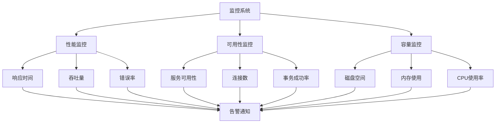

**图表来源**
- [ruoyi-vue-pro.sql (MySQL):1-200](file://backend/sql/mysql/ruoyi-vue-pro.sql#L1-L200)

**章节来源**
- [1_create_user.sql:1-50](file://backend/sql/tools/oracle/1_create_user.sql#L1-L50)
- [2_create_schema.sh:1-50](file://backend/sql/tools/oracle/2_create_schema.sh#L1-L50)
- [create_schema.sh:1-50](file://backend/sql/tools/sqlserver/create_schema.sh#L1-L50)

## 结论

本数据库设计方案具有以下特点：

1. **跨平台兼容性**：支持多种主流数据库引擎，满足不同部署需求
2. **模块化设计**：清晰的业务模块划分，便于维护和扩展
3. **性能优化**：针对核心业务场景进行了专门的索引和查询优化
4. **数据一致性**：完善的事务管理和约束机制
5. **可运维性**：完整的监控、备份、恢复和迁移工具链

通过合理的数据库设计和完善的运维体系，系统能够满足电商场景下的高性能、高可用、高可靠性的要求。

## 附录

### 数据库选型建议

- **开发环境**：推荐使用MySQL，成本低，社区支持好
- **生产环境**：根据业务需求选择，OLTP场景推荐MySQL/PostgreSQL，金融场景推荐Oracle
- **国产化替代**：可选择OpenGauss、Kingbase、DM等国产数据库

### 最佳实践

1. **定期维护**：执行索引重建、统计信息更新等维护操作
2. **容量规划**：预留足够的存储空间和性能余量
3. **安全加固**：启用SSL连接、定期更新密码、最小权限原则
4. **灾备演练**：定期进行备份恢复演练，验证数据完整性