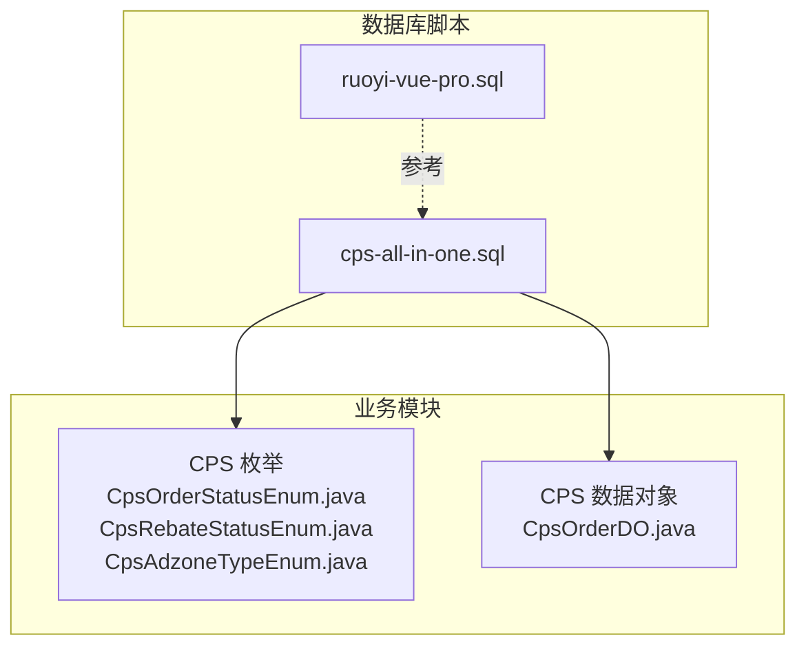
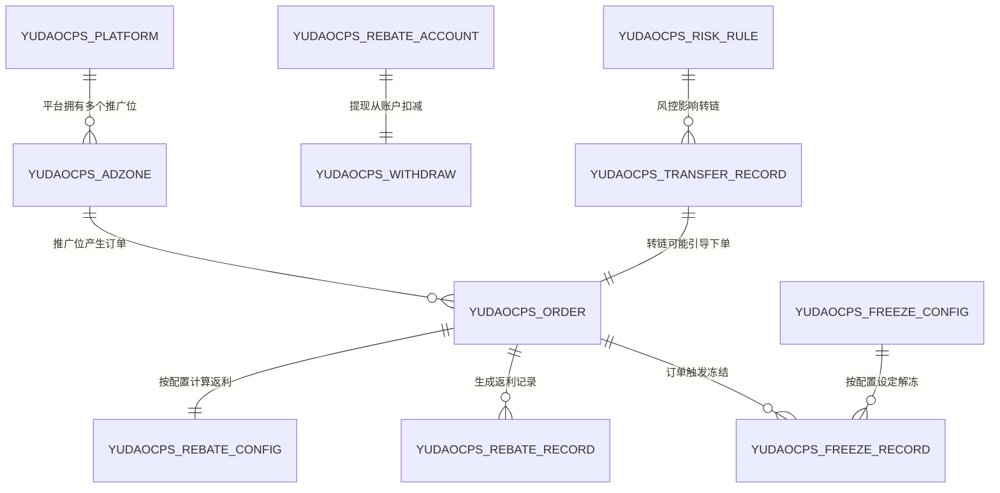
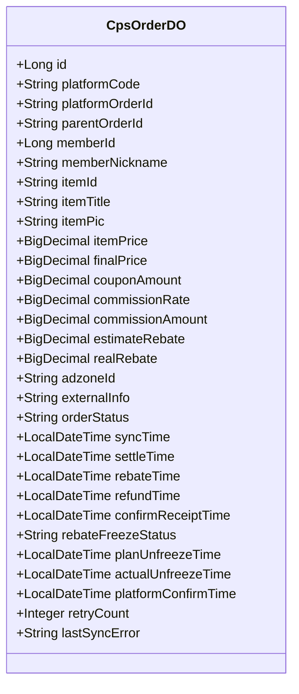
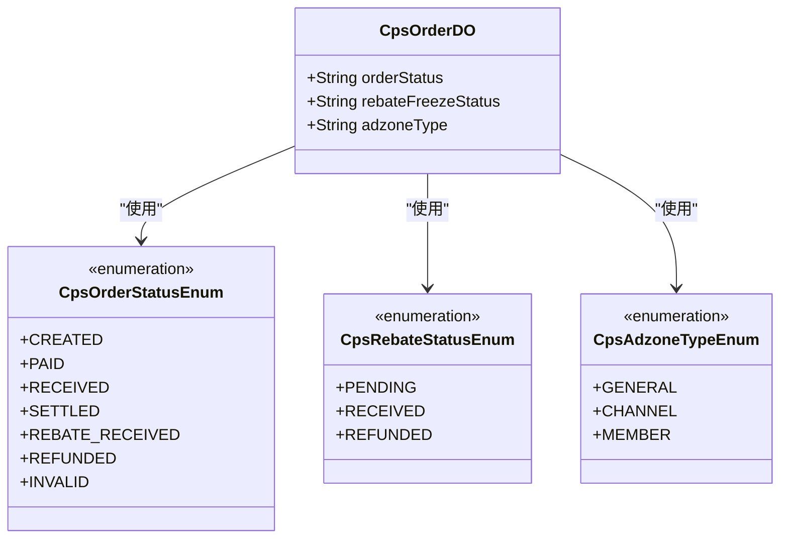

# 数据库设计

<cite>
**本文引用的文件**
- [ruoyi-vue-pro.sql](file://backend/sql/mysql/ruoyi-vue-pro.sql)
- [cps-all-in-one.sql](file://backend/sql/module/cps-all-in-one.sql)
- [CpsOrderStatusEnum.java](file://backend/yudao-module-cps/yudao-module-cps-api/src/main/java/cn/iocoder/yudao/module/cps/enums/CpsOrderStatusEnum.java)
- [CpsRebateStatusEnum.java](file://backend/yudao-module-cps/yudao-module-cps-api/src/main/java/cn/iocoder/yudao/module/cps/enums/CpsRebateStatusEnum.java)
- [CpsAdzoneTypeEnum.java](file://backend/yudao-module-cps/yudao-module-cps-api/src/main/java/cn/iocoder/yudao/module/cps/enums/CpsAdzoneTypeEnum.java)
- [CpsOrderDO.java](file://backend/yudao-module-cps/yudao-module-cps-biz/src/main/java/cn/iocoder/yudao/module/cps/dal/dataobject/order/CpsOrderDO.java)
</cite>

## 目录
1. [简介](#简介)
2. [项目结构](#项目结构)
3. [核心组件](#核心组件)
4. [架构总览](#架构总览)
5. [详细组件分析](#详细组件分析)
6. [依赖分析](#依赖分析)
7. [性能考虑](#性能考虑)
8. [故障排查指南](#故障排查指南)
9. [结论](#结论)
10. [附录](#附录)

## 简介
本文件面向 AgenticCPS 项目的数据库设计，聚焦于 CPS 联盟返利系统的数据库架构、表结构、实体关系映射与索引策略，并结合 MyBatis Plus 的 DAO 实现与通用 CRUD 操作进行说明。文档同时覆盖查询优化、性能考量、数据迁移与版本管理、备份恢复以及数据安全与访问控制的设计要点。

## 项目结构
- 数据库脚本位于 backend/sql 下，包含多数据库方言与模块化脚本。CPS 模块采用一体化脚本，集中定义了平台配置、推广位、订单、返利、账户、提现、统计、风控等核心表。
- 业务枚举位于 yudao-module-cps-api 模块，用于统一状态与类型定义，确保数据库枚举值与 Java 枚举保持一致。
- 数据对象（DO）位于 yudao-module-cps-biz 模块，基于 MyBatis Plus 注解映射到对应表，体现字段与表的强一致性。

**图表来源**
- [cps-all-in-one.sql](file://backend/sql/module/cps-all-in-one.sql)
- [CpsOrderStatusEnum.java](file://backend/yudao-module-cps/yudao-module-cps-api/src/main/java/cn/iocoder/yudao/module/cps/enums/CpsOrderStatusEnum.java)
- [CpsRebateStatusEnum.java](file://backend/yudao-module-cps/yudao-module-cps-api/src/main/java/cn/iocoder/yudao/module/cps/enums/CpsRebateStatusEnum.java)
- [CpsAdzoneTypeEnum.java](file://backend/yudao-module-cps/yudao-module-cps-api/src/main/java/cn/iocoder/yudao/module/cps/enums/CpsAdzoneTypeEnum.java)
- [CpsOrderDO.java](file://backend/yudao-module-cps/yudao-module-cps-biz/src/main/java/cn/iocoder/yudao/module/cps/dal/dataobject/order/CpsOrderDO.java)

**章节来源**
- [cps-all-in-one.sql](file://backend/sql/module/cps-all-in-one.sql)
- [CpsOrderStatusEnum.java](file://backend/yudao-module-cps/yudao-module-cps-api/src/main/java/cn/iocoder/yudao/module/cps/enums/CpsOrderStatusEnum.java)
- [CpsRebateStatusEnum.java](file://backend/yudao-module-cps/yudao-module-cps-api/src/main/java/cn/iocoder/yudao/module/cps/enums/CpsRebateStatusEnum.java)
- [CpsAdzoneTypeEnum.java](file://backend/yudao-module-cps/yudao-module-cps-api/src/main/java/cn/iocoder/yudao/module/cps/enums/CpsAdzoneTypeEnum.java)
- [CpsOrderDO.java](file://backend/yudao-module-cps/yudao-module-cps-biz/src/main/java/cn/iocoder/yudao/module/cps/dal/dataobject/order/CpsOrderDO.java)

## 核心组件
- 平台配置表（yudao_cps_platform）：维护平台编码、密钥、默认推广位、服务费率等。
- 推广位表（yudao_cps_adzone）：管理 PID、类型（通用/渠道专属/用户专属）、关联关系与状态。
- 订单表（yudao_cps_order）：记录平台订单号、会员归因、商品信息、佣金与返利金额、状态与时间戳、冻结相关字段。
- 返利配置表（yudao_cps_rebate_config）：按会员等级与平台设置返利比例、上下限与优先级。
- 返利记录表（yudao_cps_rebate_record）：记录返利类型（入账/扣回/调整）、状态、关联订单与冻结记录。
- 会员返利账户表（yudao_cps_rebate_account）：账户余额、冻结余额、乐观锁版本号与状态。
- 提现申请表（yudao_cps_withdraw）：提现单号、账户信息、金额、手续费、状态与打款状态。
- 统计数据表（yudao_cps_statistics）：按日统计订单数、金额、佣金、返利、利润与活跃会员数。
- MCP 管理与日志表（yudao_cps_mcp_api_key、yudao_cps_mcp_access_log）：API Key 管理与调用日志。
- 转链记录表（yudao_cps_transfer_record）：淘口令/推广链接生成与有效期。
- 冻结配置与记录表（yudao_cps_freeze_config、yudao_cps_freeze_record）：解冻周期与冻结明细。
- 订单同步日志表（yudao_cps_order_sync_log）：同步类型、时间维度、耗时与错误信息。
- 风控规则表（yudao_cps_risk_rule）：频率限制与黑名单规则。

**章节来源**
- [cps-all-in-one.sql](file://backend/sql/module/cps-all-in-one.sql)

## 架构总览
CPS 数据库围绕“平台-推广位-订单-返利-账户-提现-统计-风控”形成闭环，MyBatis Plus 通过注解将 Java DO 映射到对应表，配合枚举保证状态一致性。

**图表来源**
- [cps-all-in-one.sql](file://backend/sql/module/cps-all-in-one.sql)

## 详细组件分析

### 平台配置表（yudao_cps_platform）
- 字段要点：平台编码（唯一）、名称、Logo、AppKey/AppSecret、API 基础 URL、默认推广位、服务费率、排序、状态、扩展配置、备注、租户字段。
- 约束：主键自增；平台编码唯一；状态启用/禁用；带租户隔离。
- 用途：统一接入多平台，集中管理密钥与默认推广位。

**章节来源**
- [cps-all-in-one.sql](file://backend/sql/module/cps-all-in-one.sql)

### 推广位表（yudao_cps_adzone）
- 字段要点：平台编码、推广位 ID、名称、类型（通用/渠道专属/用户专属）、关联类型与 ID、是否默认、状态、租户。
- 索引：平台编码、推广位 ID 上建立索引，便于快速定位。
- 用途：对不同渠道与用户进行精准归因与推广。

**章节来源**
- [cps-all-in-one.sql](file://backend/sql/module/cps-all-in-one.sql)

### 订单表（yudao_cps_order）
- 字段要点：平台编码与订单号（唯一）、父订单号、会员归因、商品信息、价格与优惠券金额、佣金比例与金额、预估/实际返利、推广位、外部追踪参数、状态、各类时间戳、冻结状态与解冻时间、同步重试与错误信息、租户。
- 索引：会员 ID、订单状态、创建时间、平台编码、复合索引（会员+状态、平台+创建时间）。
- 用途：核心业务表，承载订单生命周期与返利计算依据。

**图表来源**
- [CpsOrderDO.java](file://backend/yudao-module-cps/yudao-module-cps-biz/src/main/java/cn/iocoder/yudao/module/cps/dal/dataobject/order/CpsOrderDO.java)

**章节来源**
- [cps-all-in-one.sql](file://backend/sql/module/cps-all-in-one.sql)
- [CpsOrderDO.java](file://backend/yudao-module-cps/yudao-module-cps-biz/src/main/java/cn/iocoder/yudao/module/cps/dal/dataobject/order/CpsOrderDO.java)

### 返利配置表（yudao_cps_rebate_config）
- 字段要点：会员等级、平台编码、返利比例、最大/最小返利金额、状态、优先级、租户。
- 索引：会员等级、平台编码。
- 用途：按等级与平台差异化返利策略。

**章节来源**
- [cps-all-in-one.sql](file://backend/sql/module/cps-all-in-one.sql)

### 返利记录表（yudao_cps_rebate_record）
- 字段要点：会员、订单、平台编码与订单号、商品信息、订单金额、佣金、返利比例与金额、类型（入账/扣回/调整）、状态、前序返利与冻结记录关联、备注、租户。
- 索引：会员、订单、平台订单号、类型、状态、创建时间。
- 用途：精确追踪每笔返利的生命周期与状态。

**章节来源**
- [cps-all-in-one.sql](file://backend/sql/module/cps-all-in-one.sql)

### 会员返利账户表（yudao_cps_rebate_account）
- 字段要点：会员唯一、累计返利总额、可用余额、冻结余额、已提现金额、状态、乐观锁版本号、租户。
- 索引：状态、会员唯一。
- 用途：账户级余额与并发控制。

**章节来源**
- [cps-all-in-one.sql](file://backend/sql/module/cps-all-in-one.sql)

### 提现申请表（yudao_cps_withdraw）
- 字段要点：会员、提现单号（唯一）、类型（支付宝/微信/银行卡）、账户与名称、金额、手续费、实际到账、状态、审核人与时间、打款状态与时间、错误信息、租户。
- 索引：会员、状态、创建时间、审核人、打款状态。
- 用途：提现流程跟踪与对账。

**章节来源**
- [cps-all-in-one.sql](file://backend/sql/module/cps-all-in-one.sql)

### 统计数据表（yudao_cps_statistics）
- 字段要点：统计日期、平台编码（含全平台汇总）、订单数、金额、佣金、返利、利润、活跃会员数、已结算/待结算佣金等。
- 索引：日期、日期+平台+租户唯一。
- 用途：运营与财务报表的数据来源。

**章节来源**
- [cps-all-in-one.sql](file://backend/sql/module/cps-all-in-one.sql)

### MCP 管理与日志表
- API Key 管理：名称、值（存储摘要）、描述、状态、过期时间、最后使用时间、调用次数、租户。
- 访问日志：工具名、请求参数、响应摘要、状态、错误信息、耗时、客户端 IP、租户。
- 用途：对接第三方工具的鉴权与审计。

**章节来源**
- [cps-all-in-one.sql](file://backend/sql/module/cps-all-in-one.sql)

### 转链记录表（yudao_cps_transfer_record）
- 字段要点：会员、平台、原始内容、商品信息、推广链接、淘口令、关联订单、推广位、过期时间、状态、租户。
- 索引：会员、关联订单、状态。
- 用途：追踪推广转化路径。

**章节来源**
- [cps-all-in-one.sql](file://backend/sql/module/cps-all-in-one.sql)

### 冻结配置与记录表
- 配置：平台编码、解冻天数、状态、备注、租户。
- 记录：会员、订单、冻结金额、计划/实际解冻时间、状态、租户。
- 用途：保障返利资金安全与合规解冻。

**章节来源**
- [cps-all-in-one.sql](file://backend/sql/module/cps-all-in-one.sql)

### 订单同步日志表（yudao_cps_order_sync_log）
- 字段要点：平台编码、同步类型、查询维度、时间窗口、状态、总数/新增/更新/忽略、耗时、错误信息、租户。
- 索引：平台、状态、创建时间。
- 用途：监控与排障。

**章节来源**
- [cps-all-in-one.sql](file://backend/sql/module/cps-all-in-one.sql)

### 风控规则表（yudao_cps_risk_rule）
- 字段要点：规则类型（频率限制/黑名单）、目标类型（会员/IP）、目标值、限制次数、状态、备注、租户。
- 索引：规则类型、目标值。
- 用途：限制刷单与滥用行为。

**章节来源**
- [cps-all-in-one.sql](file://backend/sql/module/cps-all-in-one.sql)

## 依赖分析
- 枚举驱动：CpsOrderStatusEnum、CpsRebateStatusEnum、CpsAdzoneTypeEnum 在 Java 层统一状态值，数据库以字符串存取，需在迁移与代码中保持一致。
- MyBatis Plus 映射：CpsOrderDO 通过 @TableName 与表名对应，字段命名遵循驼峰映射。
- 租户隔离：所有表均包含 tenant_id 字段，支持多租户场景。

**图表来源**
- [CpsOrderStatusEnum.java](file://backend/yudao-module-cps/yudao-module-cps-api/src/main/java/cn/iocoder/yudao/module/cps/enums/CpsOrderStatusEnum.java)
- [CpsRebateStatusEnum.java](file://backend/yudao-module-cps/yudao-module-cps-api/src/main/java/cn/iocoder/yudao/module/cps/enums/CpsRebateStatusEnum.java)
- [CpsAdzoneTypeEnum.java](file://backend/yudao-module-cps/yudao-module-cps-api/src/main/java/cn/iocoder/yudao/module/cps/enums/CpsAdzoneTypeEnum.java)
- [CpsOrderDO.java](file://backend/yudao-module-cps/yudao-module-cps-biz/src/main/java/cn/iocoder/yudao/module/cps/dal/dataobject/order/CpsOrderDO.java)

**章节来源**
- [CpsOrderStatusEnum.java](file://backend/yudao-module-cps/yudao-module-cps-api/src/main/java/cn/iocoder/yudao/module/cps/enums/CpsOrderStatusEnum.java)
- [CpsRebateStatusEnum.java](file://backend/yudao-module-cps/yudao-module-cps-api/src/main/java/cn/iocoder/yudao/module/cps/enums/CpsRebateStatusEnum.java)
- [CpsAdzoneTypeEnum.java](file://backend/yudao-module-cps/yudao-module-cps-api/src/main/java/cn/iocoder/yudao/module/cps/enums/CpsAdzoneTypeEnum.java)
- [CpsOrderDO.java](file://backend/yudao-module-cps/yudao-module-cps-biz/src/main/java/cn/iocoder/yudao/module/cps/dal/dataobject/order/CpsOrderDO.java)

## 性能考虑
- 索引策略
  - 订单表：按会员+状态、平台+创建时间建立复合索引，支撑常见查询与分页。
  - 返利记录表：按会员+状态建立复合索引，提升统计与对账效率。
  - 转链记录表：按会员+创建时间建立复合索引，便于查询与导出。
  - 其他表：按状态、创建时间、平台等维度建立单列索引，避免全表扫描。
- 查询优化
  - 使用复合索引覆盖查询条件，减少回表。
  - 分页查询限制 offset，必要时使用“书签式”分页或反向键分页。
  - 统计类查询尽量走分区或物化视图（如支持），并定期归档历史数据。
- 写入优化
  - 批量插入与更新，减少事务粒度。
  - 控制热点字段（如会员余额）的并发写入，必要时引入队列削峰。
- 存储与归档
  - 历史订单与日志表按月/季度归档，保留最近 12-18 个月在线数据。
  - 冷数据迁移至低频存储或数据湖。

[本节为通用性能建议，无需特定文件引用]

## 故障排查指南
- 订单同步异常
  - 检查 yudao_cps_order_sync_log 中的错误信息与耗时，定位平台接口问题或网络异常。
  - 关注 retry_count 与 last_sync_error 字段，必要时人工干预重试。
- 返利冻结与解冻
  - 核对 yudao_cps_freeze_record 的计划/实际解冻时间与状态，排查定时任务执行情况。
  - 对比 yudao_cps_freeze_config 的解冻天数配置。
- 提现对账
  - 对照 yudao_cps_withdraw 的状态与打款状态，核对账户余额与冻结余额。
- 风控拦截
  - 查看 yudao_cps_risk_rule 的规则类型与限制次数，确认是否误判。

**章节来源**
- [cps-all-in-one.sql](file://backend/sql/module/cps-all-in-one.sql)

## 结论
该数据库设计以“订单-返利-账户-提现-统计-风控”为主线，通过清晰的表结构、合理的索引与枚举约束，支撑 CPS 系统的高并发与多平台接入需求。结合 MyBatis Plus 的注解映射与租户隔离能力，可在保证数据一致性的同时，满足业务演进与性能优化的双重目标。

[本节为总结性内容，无需特定文件引用]

## 附录

### 数据访问层（DAO）与 MyBatis Plus 配置
- DO 映射：通过 @TableName 指定表名，字段命名遵循驼峰映射，避免硬编码 SQL。
- 通用 CRUD：基于 MyBatis Plus BaseMapper，提供标准的增删改查与分页能力。
- 乐观锁：账户表使用 version 字段实现乐观锁，防止并发写冲突。
- 租户隔离：继承 TenantBaseDO，自动注入 tenant_id，确保跨租户数据隔离。

**章节来源**
- [CpsOrderDO.java](file://backend/yudao-module-cps/yudao-module-cps-biz/src/main/java/cn/iocoder/yudao/module/cps/dal/dataobject/order/CpsOrderDO.java)

### 数据迁移策略与版本管理
- 版本号：一体化脚本包含版本号与日期，便于追踪变更。
- 迁移步骤
  - 备份现有数据库。
  - 应用一体化脚本，先创建新表与索引，再迁移数据。
  - 更新枚举与业务代码，确保状态值一致。
  - 验证关键查询与统计结果。
- 回滚策略：保留上一版本脚本与快照，按逆向顺序回滚。

**章节来源**
- [cps-all-in-one.sql](file://backend/sql/module/cps-all-in-one.sql)

### 备份恢复方案
- 全量备份：每周全备，每日增量备份。
- 点恢复：基于 binlog 的时间点恢复，保留至少 15 天的滚动窗口。
- 跨环境同步：通过逻辑备份与结构迁移工具，将生产数据安全同步至测试环境。

[本节为通用方案建议，无需特定文件引用]

### 数据安全、隐私保护与访问控制
- 数据脱敏：敏感字段（如提现账户）在展示层进行脱敏处理。
- 访问控制：基于租户 ID 的数据隔离，结合 RBAC 权限控制接口访问。
- 日志审计：MCP 访问日志记录请求摘要与错误信息，便于审计与追踪。
- 合规要求：遵循最小化收集原则，明确数据保留期限，提供用户删除与导出权利。

**章节来源**
- [cps-all-in-one.sql](file://backend/sql/module/cps-all-in-one.sql)