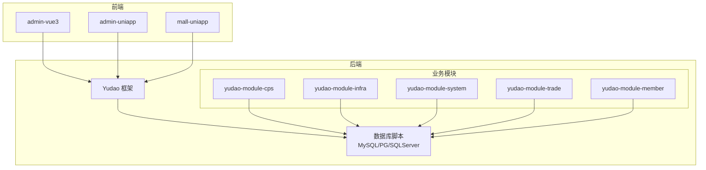
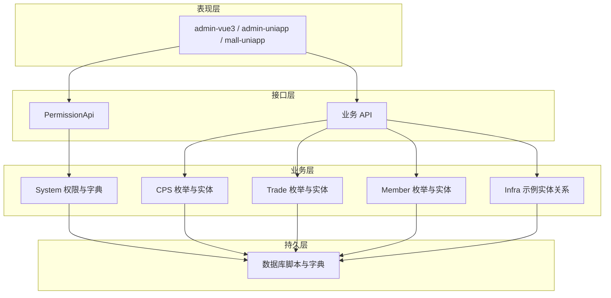
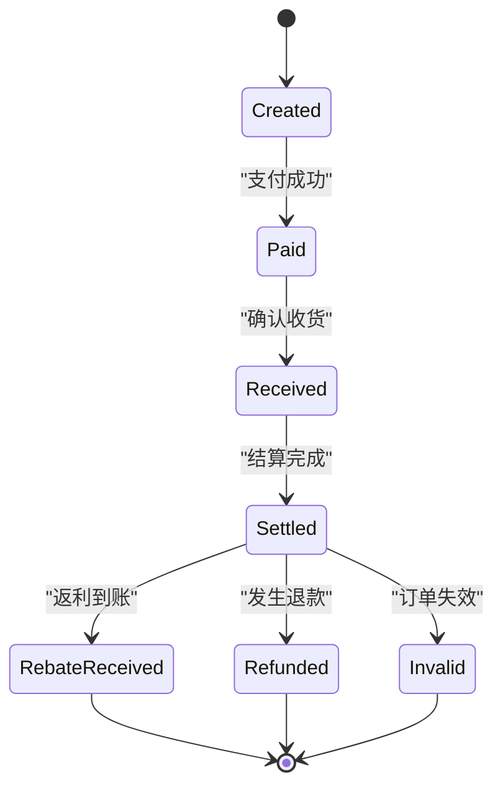
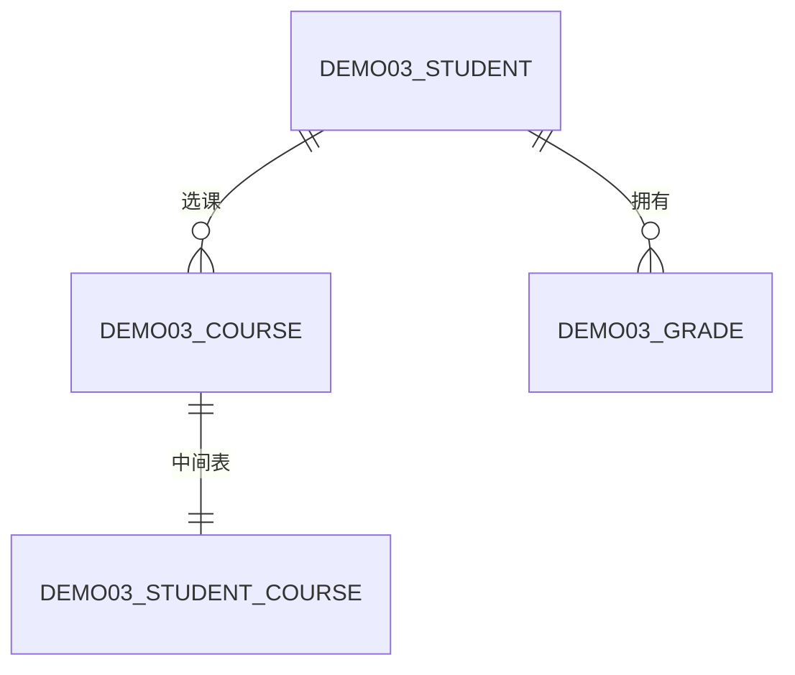
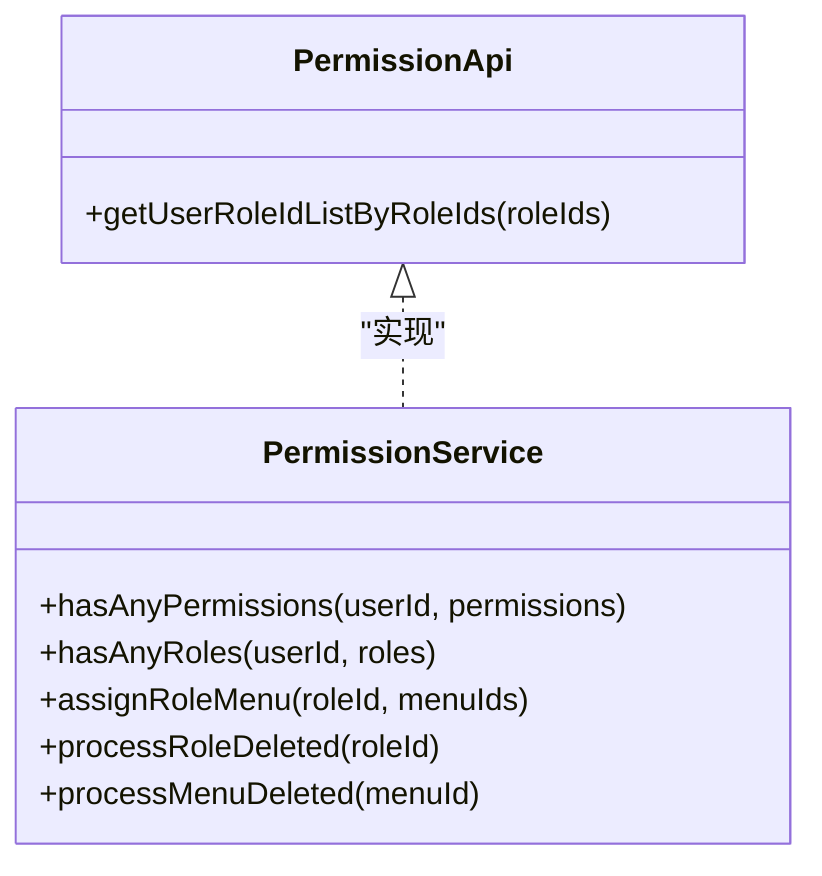
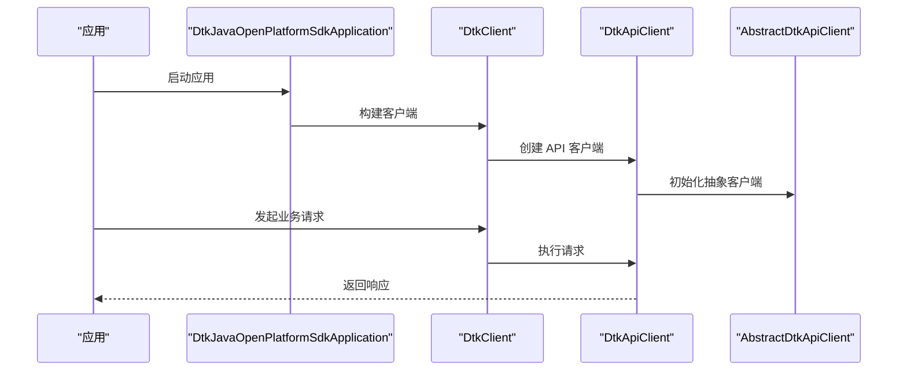
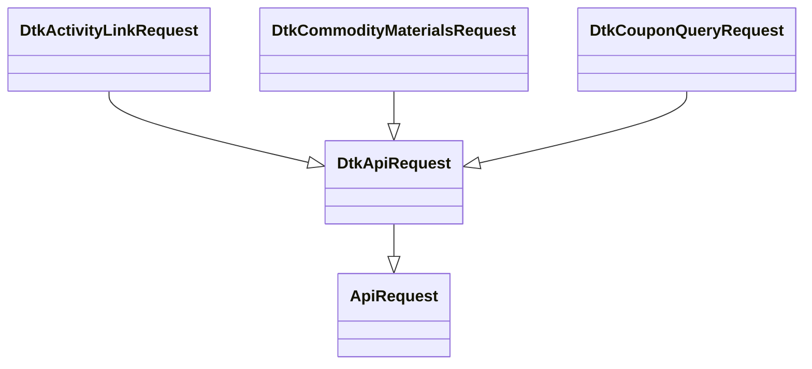
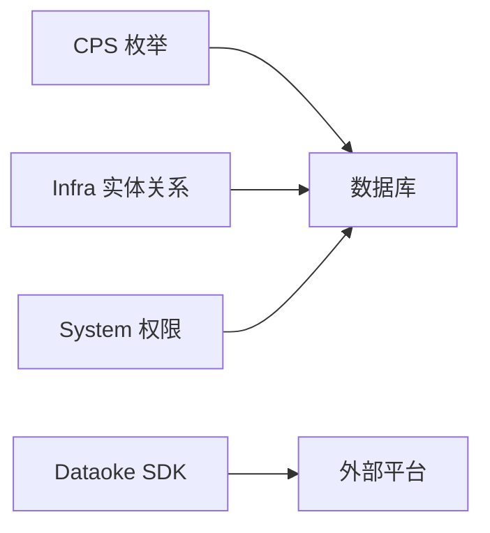

# 数据模型关系

<cite>
**本文引用的文件**
- [CpsAdzoneTypeEnum.java](file://backend/yudao-module-cps/yudao-module-cps-api/src/main/java/cn/iocoder/yudao/module/cps/enums/CpsAdzoneTypeEnum.java)
- [CpsOrderStatusEnum.java](file://backend/yudao-module-cps/yudao-module-cps-api/src/main/java/cn/iocoder/yudao/module/cps/enums/CpsOrderStatusEnum.java)
- [CpsRebateStatusEnum.java](file://backend/yudao-module-cps/yudao-module-cps-api/src/main/java/cn/iocoder/yudao/module/cps/enums/CpsRebateStatusEnum.java)
- [CpsWithdrawStatusEnum.java](file://backend/yudao-module-cps/yudao-module-cps-api/src/main/java/cn/iocoder/yudao/module/cps/enums/CpsWithdrawStatusEnum.java)
- [CpsPlatformCodeEnum.java](file://backend/yudao-module-cps/yudao-module-cps-api/src/main/java/cn/iocoder/yudao/module/cps/enums/CpsPlatformCodeEnum.java)
- [Demo03StudentNormalServiceImpl.java](file://backend/yudao-module-infra/src/main/java/cn/iocoder/yudao/module/infra/service/demo/demo03/normal/Demo03StudentNormalServiceImpl.java)
- [Demo03StudentInnerServiceImpl.java](file://backend/yudao-module-infra/src/main/java/cn/iocoder/yudao/module/infra/service/demo/demo03/inner/Demo03StudentInnerServiceImpl.java)
- [Demo03StudentErpServiceImpl.java](file://backend/yudao-module-infra/src/main/java/cn/iocoder/yudao/module/infra/service/demo/demo03/erp/Demo03StudentErpServiceImpl.java)
- [PermissionApi.java](file://backend/yudao-module-system/src/main/java/cn/iocoder/yudao/module/system/api/permission/PermissionApi.java)
- [PermissionService.java](file://backend/yudao-module-system/src/main/java/cn/iocoder/yudao/module/system/service/permission/PermissionService.java)
- [ruoyi-vue-pro.sql](file://backend/sql/mysql/ruoyi-vue-pro.sql)
- [ruoyi-vue-pro.sql](file://backend/sql/postgresql/ruoyi-vue-pro.sql)
- [ruoyi-vue-pro.sql](file://backend/sql/sqlserver/ruoyi-vue-pro.sql)
- [DtkJavaOpenPlatformSdkApplication.java](file://agent_improvement/sdk_demo/dataoke-sdk-java/src/main/java/com/dtk/api/DtkJavaOpenPlatformSdkApplication.java)
- [AbstractDtkApiClient.java](file://agent_improvement/sdk_demo/dataoke-sdk-java/src/main/java/com/dtk/api/client/AbstractDtkApiClient.java)
- [DtkApiClient.java](file://agent_improvement/sdk_demo/dataoke-sdk-java/src/main/java/com/dtk/api/client/DtkApiClient.java)
- [DtkApiRequest.java](file://agent_improvement/sdk_demo/dataoke-sdk-java/src/main/java/com/dtk/api/client/DtkApiRequest.java)
- [DtkClient.java](file://agent_improvement/sdk_demo/dataoke-sdk-java/src/main/java/com/dtk/api/client/DtkClient.java)
- [ApiRequest.java](file://agent_improvement/sdk_demo/dataoke-sdk-java/src/main/java/com/dtk/api/client/ApiRequest.java)
- [DtkActivityLinkRequest.java](file://agent_improvement/sdk_demo/dataoke-sdk-java/src/main/java/com/dtk/api/request/mastertool/DtkActivityLinkRequest.java)
- [DtkCommodityMaterialsRequest.java](file://agent_improvement/sdk_demo/dataoke-sdk-java/src/main/java/com/dtk/api/request/mastertool/DtkCommodityMaterialsRequest.java)
- [DtkCouponQueryRequest.java](file://agent_improvement/sdk_demo/dataoke-sdk-java/src/main/java/com/dtk/api/request/mastertool/DtkCouponQueryRequest.java)
</cite>

## 目录
1. [简介](#简介)
2. [项目结构](#项目结构)
3. [核心组件](#核心组件)
4. [架构总览](#架构总览)
5. [详细组件分析](#详细组件分析)
6. [依赖分析](#依赖分析)
7. [性能考虑](#性能考虑)
8. [故障排查指南](#故障排查指南)
9. [结论](#结论)
10. [附录](#附录)

## 简介
本文件聚焦于 AgenticCPS 项目的“数据模型关系”，系统性梳理实体之间的关联与继承、组合关系，解释一对一、一对多、多对多在数据库中的实现与外键设计；文档化枚举类型的数据库映射、状态机设计与业务流程控制；给出实体关系图（ERD）、类图与序列图，并说明数据一致性保障、级联与级联删除策略、软删除、数据版本控制与审计跟踪的设计思路，以及跨模块数据关联与数据权限控制的实现方案。

## 项目结构
本项目采用多模块分层架构，后端以 Yudao 框架为基础，按业务域拆分为多个 Module，如 cps、infra、system、trade、member 等。数据模型主要分布在各模块的 DAL（数据访问层）与枚举定义中，同时配合 SQL 初始化脚本与前端常量/字典配置共同构成完整的数据模型体系。

## 核心组件
本节从“实体-枚举-服务-接口”四个维度，抽取与数据模型关系密切的核心构件，作为后续 ERD、类图与流程图的基础。

- 枚举与状态机
  - 推广位类型：CpsAdzoneTypeEnum
  - 订单状态：CpsOrderStatusEnum
  - 返利状态：CpsRebateStatusEnum
  - 提现状态：CpsWithdrawStatusEnum
  - 平台编码：CpsPlatformCodeEnum

- 示例实体关系（演示模块）
  - Demo03StudentNormalServiceImpl、Demo03StudentInnerServiceImpl、Demo03StudentErpServiceImpl：体现一对多/多对多的父子表维护与事务级联删除策略

- 权限与数据范围
  - PermissionApi、PermissionService：提供角色-菜单/角色-部门/用户-角色等权限判定与授权管理能力

- 外部平台对接
  - Dataoke SDK（Dtk*）：用于对接外部联盟平台，涉及请求封装、客户端调用与响应解析

章节来源
- [CpsAdzoneTypeEnum.java:1-40](file://backend/yudao-module-cps/yudao-module-cps-api/src/main/java/cn/iocoder/yudao/module/cps/enums/CpsAdzoneTypeEnum.java#L1-L40)
- [CpsOrderStatusEnum.java:1-48](file://backend/yudao-module-cps/yudao-module-cps-api/src/main/java/cn/iocoder/yudao/module/cps/enums/CpsOrderStatusEnum.java#L1-L48)
- [CpsRebateStatusEnum.java:1-40](file://backend/yudao-module-cps/yudao-module-cps-api/src/main/java/cn/iocoder/yudao/module/cps/enums/CpsRebateStatusEnum.java#L1-L40)
- [CpsWithdrawStatusEnum.java:1-44](file://backend/yudao-module-cps/yudao-module-cps-api/src/main/java/cn/iocoder/yudao/module/cps/enums/CpsWithdrawStatusEnum.java#L1-L44)
- [CpsPlatformCodeEnum.java:1-45](file://backend/yudao-module-cps/yudao-module-cps-api/src/main/java/cn/iocoder/yudao/module/cps/enums/CpsPlatformCodeEnum.java#L1-L45)
- [Demo03StudentNormalServiceImpl.java:53-128](file://backend/yudao-module-infra/src/main/java/cn/iocoder/yudao/module/infra/service/demo/demo03/normal/Demo03StudentNormalServiceImpl.java#L53-L128)
- [Demo03StudentInnerServiceImpl.java:53-93](file://backend/yudao-module-infra/src/main/java/cn/iocoder/yudao/module/infra/service/demo/demo03/inner/Demo03StudentInnerServiceImpl.java#L53-L93)
- [Demo03StudentErpServiceImpl.java:62-104](file://backend/yudao-module-infra/src/main/java/cn/iocoder/yudao/module/infra/service/demo/demo03/erp/Demo03StudentErpServiceImpl.java#L62-L104)
- [PermissionApi.java:1-23](file://backend/yudao-module-system/src/main/java/cn/iocoder/yudao/module/system/api/permission/PermissionApi.java#L1-L23)
- [PermissionService.java:1-54](file://backend/yudao-module-system/src/main/java/cn/iocoder/yudao/module/system/service/permission/PermissionService.java#L1-L54)

## 架构总览
下图展示数据模型在系统中的分布与交互：业务模块（CPS、Trade、Member 等）通过枚举与实体对象承载领域语义；权限模块提供数据范围控制；前端通过 API 获取数据并渲染；数据库脚本统一定义表结构、索引与字典值。

## 详细组件分析

### 枚举与状态机设计
- 枚举职责
  - 统一业务状态/类型常量，避免魔法字符串
  - 提供数组化查询支持（如 IN 查询）
  - 支持按值查找（如平台编码、订单状态）

- 数据库映射
  - 建议将枚举值映射为字典表（dict_type + dict_value），并在初始化脚本中插入对应条目，确保前后端一致
  - 字段类型建议使用 VARCHAR/CHAR，长度依据枚举值长度设定

- 状态机与业务流程
  - 订单状态：created → paid → received → settled → rebate_received/refunded/invalid
  - 返利状态：pending → received/refunded
  - 提现状态：created → reviewing → passed/rejected → success/failed → refunded
  - 平台编码：taobao/jd/pdd/douyin

图表来源
- [CpsOrderStatusEnum.java:18-24](file://backend/yudao-module-cps/yudao-module-cps-api/src/main/java/cn/iocoder/yudao/module/cps/enums/CpsOrderStatusEnum.java#L18-L24)
- [CpsRebateStatusEnum.java:18-20](file://backend/yudao-module-cps/yudao-module-cps-api/src/main/java/cn/iocoder/yudao/module/cps/enums/CpsRebateStatusEnum.java#L18-L20)
- [CpsWithdrawStatusEnum.java:18-24](file://backend/yudao-module-cps/yudao-module-cps-api/src/main/java/cn/iocoder/yudao/module/cps/enums/CpsWithdrawStatusEnum.java#L18-L24)

章节来源
- [CpsAdzoneTypeEnum.java:16-32](file://backend/yudao-module-cps/yudao-module-cps-api/src/main/java/cn/iocoder/yudao/module/cps/enums/CpsAdzoneTypeEnum.java#L16-L32)
- [CpsOrderStatusEnum.java:16-46](file://backend/yudao-module-cps/yudao-module-cps-api/src/main/java/cn/iocoder/yudao/module/cps/enums/CpsOrderStatusEnum.java#L16-L46)
- [CpsRebateStatusEnum.java:16-38](file://backend/yudao-module-cps/yudao-module-cps-api/src/main/java/cn/iocoder/yudao/module/cps/enums/CpsRebateStatusEnum.java#L16-L38)
- [CpsWithdrawStatusEnum.java:16-42](file://backend/yudao-module-cps/yudao-module-cps-api/src/main/java/cn/iocoder/yudao/module/cps/enums/CpsWithdrawStatusEnum.java#L16-L42)
- [CpsPlatformCodeEnum.java:16-42](file://backend/yudao-module-cps/yudao-module-cps-api/src/main/java/cn/iocoder/yudao/module/cps/enums/CpsPlatformCodeEnum.java#L16-L42)

### 实体关系与外键设计（基于演示模块）
演示模块展示了典型的“一对多/多对多”关系与事务级联删除策略：
- 主表：学生（Demo03Student）
- 子表：课程（Demo03Course）、成绩（Demo03Grade）
- 关系：学生-课程（多对多，通过中间表）、学生-成绩（一对一或一对多）

图表来源
- [Demo03StudentNormalServiceImpl.java:120-128](file://backend/yudao-module-infra/src/main/java/cn/iocoder/yudao/module/infra/service/demo/demo03/normal/Demo03StudentNormalServiceImpl.java#L120-L128)
- [Demo03StudentInnerServiceImpl.java:53-93](file://backend/yudao-module-infra/src/main/java/cn/iocoder/yudao/module/infra/service/demo/demo03/inner/Demo03StudentInnerServiceImpl.java#L53-L93)
- [Demo03StudentErpServiceImpl.java:62-104](file://backend/yudao-module-infra/src/main/java/cn/iocoder/yudao/module/infra/service/demo/demo03/erp/Demo03StudentErpServiceImpl.java#L62-L104)

章节来源
- [Demo03StudentNormalServiceImpl.java:53-128](file://backend/yudao-module-infra/src/main/java/cn/iocoder/yudao/module/infra/service/demo/demo03/normal/Demo03StudentNormalServiceImpl.java#L53-L128)
- [Demo03StudentInnerServiceImpl.java:53-93](file://backend/yudao-module-infra/src/main/java/cn/iocoder/yudao/module/infra/service/demo/demo03/inner/Demo03StudentInnerServiceImpl.java#L53-L93)
- [Demo03StudentErpServiceImpl.java:62-104](file://backend/yudao-module-infra/src/main/java/cn/iocoder/yudao/module/infra/service/demo/demo03/erp/Demo03StudentErpServiceImpl.java#L62-L104)

### 类图（权限与数据范围）

图表来源
- [PermissionApi.java:13-23](file://backend/yudao-module-system/src/main/java/cn/iocoder/yudao/module/system/api/permission/PermissionApi.java#L13-L23)
- [PermissionService.java:17-54](file://backend/yudao-module-system/src/main/java/cn/iocoder/yudao/module/system/service/permission/PermissionService.java#L17-L54)

章节来源
- [PermissionApi.java:1-23](file://backend/yudao-module-system/src/main/java/cn/iocoder/yudao/module/system/api/permission/PermissionApi.java#L1-L23)
- [PermissionService.java:1-54](file://backend/yudao-module-system/src/main/java/cn/iocoder/yudao/module/system/service/permission/PermissionService.java#L1-L54)

### 序列图（外部平台对接）
以下序列图展示 Dataoke SDK 的典型调用链：应用启动 → 客户端构建 → 发起请求 → 解析响应。

图表来源
- [DtkJavaOpenPlatformSdkApplication.java](file://agent_improvement/sdk_demo/dataoke-sdk-java/src/main/java/com/dtk/api/DtkJavaOpenPlatformSdkApplication.java)
- [DtkClient.java](file://agent_improvement/sdk_demo/dataoke-sdk-java/src/main/java/com/dtk/api/client/DtkClient.java)
- [DtkApiClient.java](file://agent_improvement/sdk_demo/dataoke-sdk-java/src/main/java/com/dtk/api/client/DtkApiClient.java)
- [AbstractDtkApiClient.java](file://agent_improvement/sdk_demo/dataoke-sdk-java/src/main/java/com/dtk/api/client/AbstractDtkApiClient.java)

章节来源
- [DtkJavaOpenPlatformSdkApplication.java](file://agent_improvement/sdk_demo/dataoke-sdk-java/src/main/java/com/dtk/api/DtkJavaOpenPlatformSdkApplication.java)
- [DtkClient.java](file://agent_improvement/sdk_demo/dataoke-sdk-java/src/main/java/com/dtk/api/client/DtkClient.java)
- [DtkApiClient.java](file://agent_improvement/sdk_demo/dataoke-sdk-java/src/main/java/com/dtk/api/client/DtkApiClient.java)
- [AbstractDtkApiClient.java](file://agent_improvement/sdk_demo/dataoke-sdk-java/src/main/java/com/dtk/api/client/AbstractDtkApiClient.java)

### 外部平台请求封装（类图）

图表来源
- [ApiRequest.java](file://agent_improvement/sdk_demo/dataoke-sdk-java/src/main/java/com/dtk/api/client/ApiRequest.java)
- [DtkApiRequest.java](file://agent_improvement/sdk_demo/dataoke-sdk-java/src/main/java/com/dtk/api/client/DtkApiRequest.java)
- [DtkActivityLinkRequest.java](file://agent_improvement/sdk_demo/dataoke-sdk-java/src/main/java/com/dtk/api/request/mastertool/DtkActivityLinkRequest.java)
- [DtkCommodityMaterialsRequest.java](file://agent_improvement/sdk_demo/dataoke-sdk-java/src/main/java/com/dtk/api/request/mastertool/DtkCommodityMaterialsRequest.java)
- [DtkCouponQueryRequest.java](file://agent_improvement/sdk_demo/dataoke-sdk-java/src/main/java/com/dtk/api/request/mastertool/DtkCouponQueryRequest.java)

章节来源
- [ApiRequest.java](file://agent_improvement/sdk_demo/dataoke-sdk-java/src/main/java/com/dtk/api/client/ApiRequest.java)
- [DtkApiRequest.java](file://agent_improvement/sdk_demo/dataoke-sdk-java/src/main/java/com/dtk/api/client/DtkApiRequest.java)
- [DtkActivityLinkRequest.java](file://agent_improvement/sdk_demo/dataoke-sdk-java/src/main/java/com/dtk/api/request/mastertool/DtkActivityLinkRequest.java)
- [DtkCommodityMaterialsRequest.java](file://agent_improvement/sdk_demo/dataoke-sdk-java/src/main/java/com/dtk/api/request/mastertool/DtkCommodityMaterialsRequest.java)
- [DtkCouponQueryRequest.java](file://agent_improvement/sdk_demo/dataoke-sdk-java/src/main/java/com/dtk/api/request/mastertool/DtkCouponQueryRequest.java)

## 依赖分析
- 模块内聚与耦合
  - CPS 枚举与业务实体紧密耦合，便于状态流转与规则校验
  - Infra 演示模块展示了跨表事务与级联删除的实践
  - System 权限模块提供跨模块的数据范围控制

- 外部依赖
  - Dataoke SDK 作为外部平台对接的客户端封装，通过统一的请求基类扩展不同业务请求

## 性能考虑
- 枚举与字典
  - 使用字典表 + 缓存可降低频繁查询成本
- 索引设计
  - 建议在外键列、状态列、平台编码列建立索引，提升过滤与连接效率
- 事务边界
  - 对多表更新/删除采用单事务，减少中间态与并发冲突
- 分页与批量
  - 大数据量场景优先使用分页与批量操作，避免一次性加载过多数据

## 故障排查指南
- 状态迁移异常
  - 检查枚举映射是否与字典表一致，核对状态机转换条件
- 级联删除失败
  - 确认外键约束与触发器设置，确保删除顺序正确
- 权限误判
  - 核查角色-菜单/角色-部门授权是否生效，检查用户角色缓存刷新

章节来源
- [CpsOrderStatusEnum.java:43-45](file://backend/yudao-module-cps/yudao-module-cps-api/src/main/java/cn/iocoder/yudao/module/cps/enums/CpsOrderStatusEnum.java#L43-L45)
- [CpsPlatformCodeEnum.java:40-42](file://backend/yudao-module-cps/yudao-module-cps-api/src/main/java/cn/iocoder/yudao/module/cps/enums/CpsPlatformCodeEnum.java#L40-L42)

## 结论
本文件从“枚举与状态机、实体关系与外键设计、权限与数据范围、外部平台对接”四个方面系统梳理了数据模型关系。通过字典表映射、状态机约束、事务级联与权限控制，确保业务一致性与可维护性。建议在实际落地中结合数据库脚本与前端字典配置，形成统一的数据契约。

## 附录

### 数据库脚本与字典参考
- MySQL/PostgreSQL/SQLServer 初始化脚本中包含大量 dict_type 与 dict_data 的插入，用于支撑状态枚举的字典化映射与前端渲染

章节来源
- [ruoyi-vue-pro.sql](file://backend/sql/mysql/ruoyi-vue-pro.sql)
- [ruoyi-vue-pro.sql](file://backend/sql/postgresql/ruoyi-vue-pro.sql)
- [ruoyi-vue-pro.sql](file://backend/sql/sqlserver/ruoyi-vue-pro.sql)