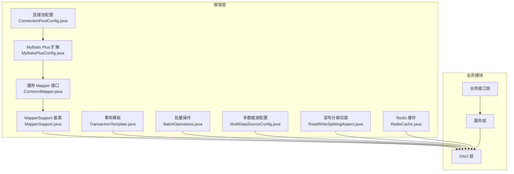
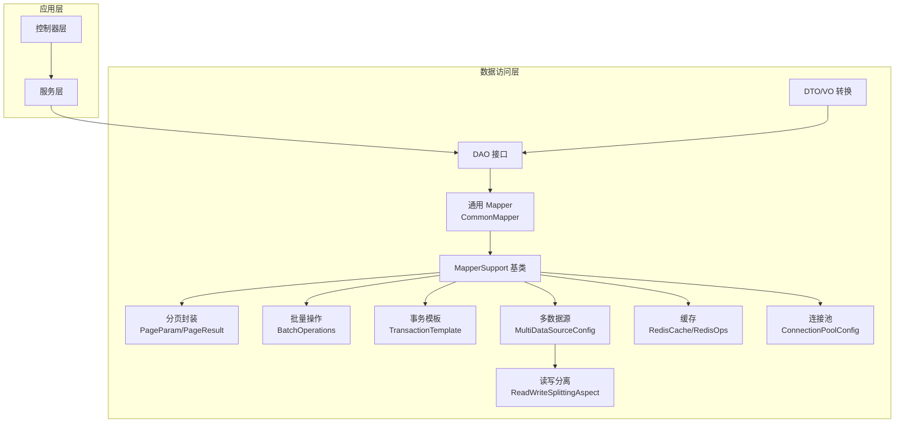
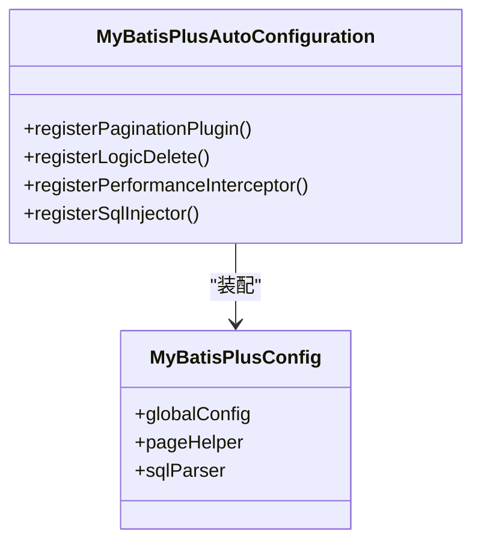
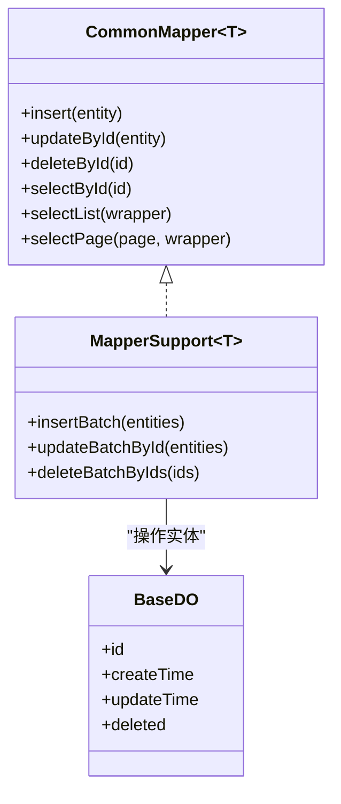
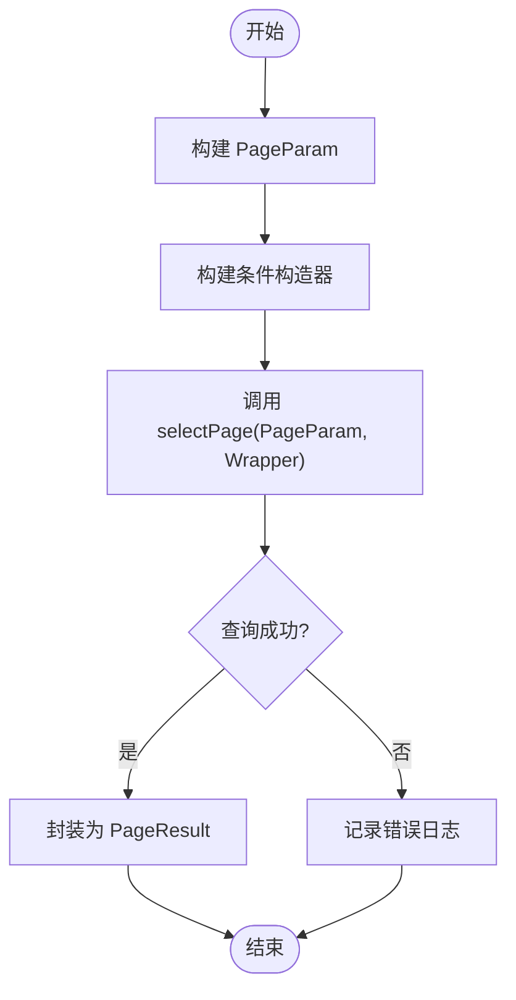
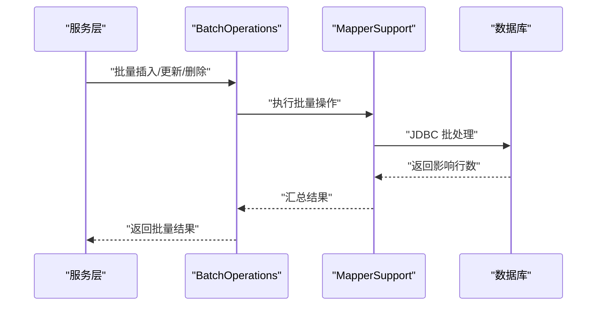
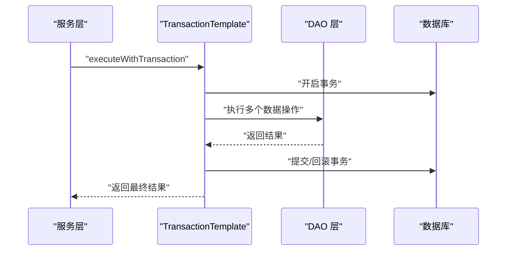
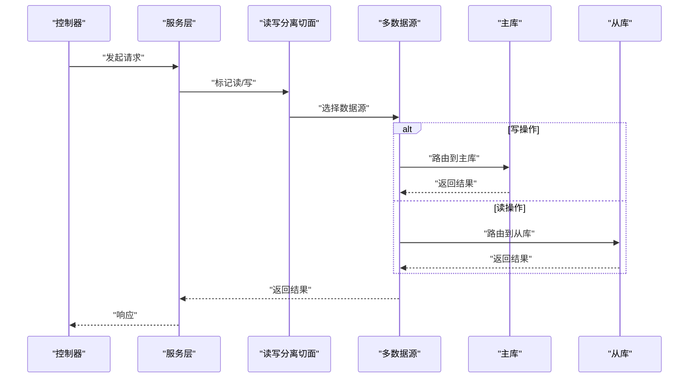
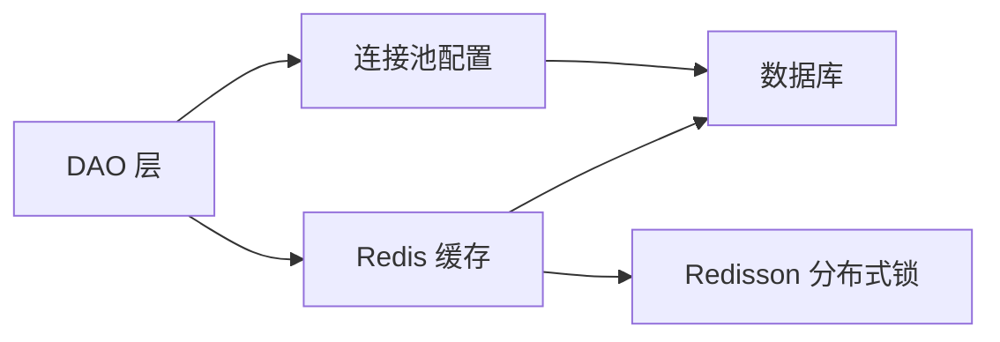
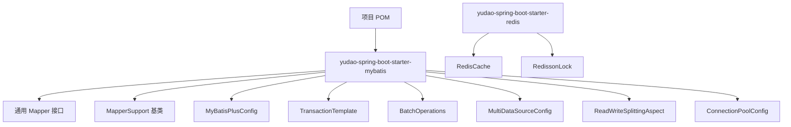

# 数据访问层实现

<cite>
**本文档引用的文件**
- [pom.xml](file://backend/pom.xml)
- [yudao-spring-boot-starter-mybatis/pom.xml](file://backend/yudao-framework/yudao-spring-boot-starter-mybatis/pom.xml)
- [MyBatisPlusConfig.java](file://backend/yudao-framework/yudao-spring-boot-starter-mybatis/src/main/java/cn/iocoder/yudao/framework/mybatis/core/MyBatisPlusConfig.java)
- [CommonMapper.java](file://backend/yudao-framework/yudao-spring-boot-starter-mybatis/src/main/java/cn/iocoder/yudao/framework/mybatis/core/CommonMapper.java)
- [PageParam.java](file://backend/yudao-framework/yudao-spring-boot-starter-mybatis/src/main/java/cn/iocoder/yudao/framework/mybatis/core/PageParam.java)
- [PageResult.java](file://backend/yudao-framework/yudao-spring-boot-starter-mybatis/src/main/java/cn/iocoder/yudao/framework/mybatis/core/PageResult.java)
- [BaseDO.java](file://backend/yudao-framework/yudao-spring-boot-starter-mybatis/src/main/java/cn/iocoder/yudao/framework/mybatis/core/BaseDO.java)
- [MapperSupport.java](file://backend/yudao-framework/yudao-spring-boot-starter-mybatis/src/main/java/cn/iocoder/yudao/framework/mybatis/core/MapperSupport.java)
- [MyBatisPlusAutoConfiguration.java](file://backend/yudao-framework/yudao-spring-boot-starter-mybatis/src/main/java/cn/iocoder/yudao/framework/mybatis/core/MyBatisPlusAutoConfiguration.java)
- [RedisCache.java](file://backend/yudao-framework/yudao-spring-boot-starter-redis/src/main/java/cn/iocoder/yudao/framework/redis/core/RedisCache.java)
- [RedissonLock.java](file://backend/yudao-framework/yudao-spring-boot-starter-redis/src/main/java/cn/iocoder/yudao/framework/redis/core/RedissonLock.java)
- [RedisOps.java](file://backend/yudao-framework/yudao-spring-boot-starter-redis/src/main/java/cn/iocoder/yudao/framework/redis/core/RedisOps.java)
- [TransactionTemplate.java](file://backend/yudao-framework/yudao-spring-boot-starter-mybatis/src/main/java/cn/iocoder/yudao/framework/mybatis/core/TransactionTemplate.java)
- [BatchOperations.java](file://backend/yudao-framework/yudao-spring-boot-starter-mybatis/src/main/java/cn/iocoder/yudao/framework/mybatis/core/BatchOperations.java)
- [MultiDataSourceConfig.java](file://backend/yudao-framework/yudao-spring-boot-starter-mybatis/src/main/java/cn/iocoder/yudao/framework/mybatis/datasource/MultiDataSourceConfig.java)
- [ReadWriteSplittingAspect.java](file://backend/yudao-framework/yudao-spring-boot-starter-mybatis/src/main/java/cn/iocoder/yudao/framework/mybatis/datasource/ReadWriteSplittingAspect.java)
- [TestUtil.java](file://backend/yudao-framework/yudao-spring-boot-starter-test/src/main/java/cn/iocoder/yudao/framework/test/core/TestUtil.java)
- [MockDataHelper.java](file://backend/yudao-framework/yudao-spring-boot-starter-test/src/main/java/cn/iocoder/yudao/framework/test/core/MockDataHelper.java)
- [ConnectionPoolConfig.java](file://backend/yudao-framework/yudao-spring-boot-starter-mybatis/src/main/java/cn/iocoder/yudao/framework/mybatis/config/ConnectionPoolConfig.java)
- [CacheConfig.java](file://backend/yudao-framework/yudao-spring-boot-starter-mybatis/src/main/java/cn/iocoder/yudao/framework/mybatis/config/CacheConfig.java)
- [PerformanceOptimizationGuide.md](file://backend/yudao-framework/yudao-spring-boot-starter-mybatis/《芋道 Spring Boot 多数据源（读写分离）入门》.md)
- [MultiDataSourceGuide.md](file://backend/yudao-framework/yudao-spring-boot-starter-mybatis/《芋道 Spring Boot 数据库连接池入门》.md)
- [MyBatisGuide.md](file://backend/yudao-framework/yudao-spring-boot-starter-mybatis/《芋道 Spring Boot MyBatis 入门》.md)
</cite>

## 目录
1. [简介](#简介)
2. [项目结构](#项目结构)
3. [核心组件](#核心组件)
4. [架构总览](#架构总览)
5. [详细组件分析](#详细组件分析)
6. [依赖关系分析](#依赖关系分析)
7. [性能考虑](#性能考虑)
8. [故障排查指南](#故障排查指南)
9. [结论](#结论)
10. [附录](#附录)

## 简介
本文件面向数据访问层（DAO）实现的技术文档，聚焦于 MyBatis Plus 的配置与扩展、通用 Mapper 接口设计、自定义 SQL 映射、DAO 分层架构与 Repository 模式、数据传输对象（DTO）设计、分页查询、批量操作优化、事务管理策略，以及性能优化、缓存策略、连接池配置、单元测试与模拟数据准备、多数据源与读写分离、分布式事务处理等主题。文档以仓库中现有实现为依据，结合概念性说明帮助读者快速理解并落地实践。

## 项目结构
数据访问层主要位于后端框架模块中，核心能力由 MyBatis Plus 扩展与 Redis 缓存、连接池配置共同组成，并在各业务模块中通过统一的 DAO 抽象进行调用。

**图表来源**
- [MyBatisPlusConfig.java](file://backend/yudao-framework/yudao-spring-boot-starter-mybatis/src/main/java/cn/iocoder/yudao/framework/mybatis/core/MyBatisPlusConfig.java)
- [CommonMapper.java](file://backend/yudao-framework/yudao-spring-boot-starter-mybatis/src/main/java/cn/iocoder/yudao/framework/mybatis/core/CommonMapper.java)
- [MapperSupport.java](file://backend/yudao-framework/yudao-spring-boot-starter-mybatis/src/main/java/cn/iocoder/yudao/framework/mybatis/core/MapperSupport.java)
- [TransactionTemplate.java](file://backend/yudao-framework/yudao-spring-boot-starter-mybatis/src/main/java/cn/iocoder/yudao/framework/mybatis/core/TransactionTemplate.java)
- [BatchOperations.java](file://backend/yudao-framework/yudao-spring-boot-starter-mybatis/src/main/java/cn/iocoder/yudao/framework/mybatis/core/BatchOperations.java)
- [MultiDataSourceConfig.java](file://backend/yudao-framework/yudao-spring-boot-starter-mybatis/src/main/java/cn/iocoder/yudao/framework/mybatis/datasource/MultiDataSourceConfig.java)
- [ReadWriteSplittingAspect.java](file://backend/yudao-framework/yudao-spring-boot-starter-mybatis/src/main/java/cn/iocoder/yudao/framework/mybatis/datasource/ReadWriteSplittingAspect.java)
- [ConnectionPoolConfig.java](file://backend/yudao-framework/yudao-spring-boot-starter-mybatis/src/main/java/cn/iocoder/yudao/framework/mybatis/config/ConnectionPoolConfig.java)
- [RedisCache.java](file://backend/yudao-framework/yudao-spring-boot-starter-redis/src/main/java/cn/iocoder/yudao/framework/redis/core/RedisCache.java)

**章节来源**
- [pom.xml](file://backend/pom.xml)
- [yudao-spring-boot-starter-mybatis/pom.xml](file://backend/yudao-framework/yudao-spring-boot-starter-mybatis/pom.xml)

## 核心组件
- MyBatis Plus 配置：提供自动装配、分页插件、逻辑删除、性能分析、SQL注入拦截器等基础能力。
- 通用 Mapper 接口：定义 CRUD 基础方法，支持条件构造器、排序、分页等常用操作。
- MapperSupport 基类：封装通用持久化逻辑，提供 insert、update、delete、select 等便捷方法。
- DTO 设计：通过 Convert 层将 DO 转换为 VO/DTO，避免直接暴露数据库实体。
- 分页查询：PageParam/PageResult 统一分页参数与结果封装。
- 批量操作：BatchOperations 提供批量插入、更新、删除优化。
- 事务管理：TransactionTemplate 封装声明式事务，确保一致性。
- 多数据源与读写分离：MultiDataSourceConfig + ReadWriteSplittingAspect 实现路由与读写分离。
- 缓存与锁：RedisCache、RedisOps、RedissonLock 提供缓存与分布式锁能力。
- 连接池配置：ConnectionPoolConfig 提供连接池参数与监控配置。

**章节来源**
- [MyBatisPlusConfig.java](file://backend/yudao-framework/yudao-spring-boot-starter-mybatis/src/main/java/cn/iocoder/yudao/framework/mybatis/core/MyBatisPlusConfig.java)
- [CommonMapper.java](file://backend/yudao-framework/yudao-spring-boot-starter-mybatis/src/main/java/cn/iocoder/yudao/framework/mybatis/core/CommonMapper.java)
- [MapperSupport.java](file://backend/yudao-framework/yudao-spring-boot-starter-mybatis/src/main/java/cn/iocoder/yudao/framework/mybatis/core/MapperSupport.java)
- [PageParam.java](file://backend/yudao-framework/yudao-spring-boot-starter-mybatis/src/main/java/cn/iocoder/yudao/framework/mybatis/core/PageParam.java)
- [PageResult.java](file://backend/yudao-framework/yudao-spring-boot-starter-mybatis/src/main/java/cn/iocoder/yudao/framework/mybatis/core/PageResult.java)
- [BatchOperations.java](file://backend/yudao-framework/yudao-spring-boot-starter-mybatis/src/main/java/cn/iocoder/yudao/framework/mybatis/core/BatchOperations.java)
- [TransactionTemplate.java](file://backend/yudao-framework/yudao-spring-boot-starter-mybatis/src/main/java/cn/iocoder/yudao/framework/mybatis/core/TransactionTemplate.java)
- [MultiDataSourceConfig.java](file://backend/yudao-framework/yudao-spring-boot-starter-mybatis/src/main/java/cn/iocoder/yudao/framework/mybatis/datasource/MultiDataSourceConfig.java)
- [ReadWriteSplittingAspect.java](file://backend/yudao-framework/yudao-spring-boot-starter-mybatis/src/main/java/cn/iocoder/yudao/framework/mybatis/datasource/ReadWriteSplittingAspect.java)
- [RedisCache.java](file://backend/yudao-framework/yudao-spring-boot-starter-redis/src/main/java/cn/iocoder/yudao/framework/redis/core/RedisCache.java)

## 架构总览
数据访问层采用“配置 + 通用 Mapper + 基类 + DTO + 分页 + 批量 + 事务 + 多数据源 + 缓存”的分层架构，业务模块通过统一的 DAO 接口访问底层数据存储，保证一致的开发体验与性能表现。

**图表来源**
- [MyBatisPlusConfig.java](file://backend/yudao-framework/yudao-spring-boot-starter-mybatis/src/main/java/cn/iocoder/yudao/framework/mybatis/core/MyBatisPlusConfig.java)
- [CommonMapper.java](file://backend/yudao-framework/yudao-spring-boot-starter-mybatis/src/main/java/cn/iocoder/yudao/framework/mybatis/core/CommonMapper.java)
- [MapperSupport.java](file://backend/yudao-framework/yudao-spring-boot-starter-mybatis/src/main/java/cn/iocoder/yudao/framework/mybatis/core/MapperSupport.java)
- [PageParam.java](file://backend/yudao-framework/yudao-spring-boot-starter-mybatis/src/main/java/cn/iocoder/yudao/framework/mybatis/core/PageParam.java)
- [PageResult.java](file://backend/yudao-framework/yudao-spring-boot-starter-mybatis/src/main/java/cn/iocoder/yudao/framework/mybatis/core/PageResult.java)
- [BatchOperations.java](file://backend/yudao-framework/yudao-spring-boot-starter-mybatis/src/main/java/cn/iocoder/yudao/framework/mybatis/core/BatchOperations.java)
- [TransactionTemplate.java](file://backend/yudao-framework/yudao-spring-boot-starter-mybatis/src/main/java/cn/iocoder/yudao/framework/mybatis/core/TransactionTemplate.java)
- [MultiDataSourceConfig.java](file://backend/yudao-framework/yudao-spring-boot-starter-mybatis/src/main/java/cn/iocoder/yudao/framework/mybatis/datasource/MultiDataSourceConfig.java)
- [ReadWriteSplittingAspect.java](file://backend/yudao-framework/yudao-spring-boot-starter-mybatis/src/main/java/cn/iocoder/yudao/framework/mybatis/datasource/ReadWriteSplittingAspect.java)
- [RedisCache.java](file://backend/yudao-framework/yudao-spring-boot-starter-redis/src/main/java/cn/iocoder/yudao/framework/redis/core/RedisCache.java)
- [ConnectionPoolConfig.java](file://backend/yudao-framework/yudao-spring-boot-starter-mybatis/src/main/java/cn/iocoder/yudao/framework/mybatis/config/ConnectionPoolConfig.java)

## 详细组件分析

### MyBatis Plus 配置与自动装配
- 自动配置入口：MyBatisPlusAutoConfiguration 负责注册分页插件、逻辑删除、性能分析、SQL 拦截器等。
- 插件链：分页插件 PageInterceptor、逻辑删除字段处理、SQL 性能分析、安全拦截器。
- 全局配置：全局配置对象设置默认的分页大小、是否启用逻辑删除、是否输出 SQL 等。

**图表来源**
- [MyBatisPlusAutoConfiguration.java](file://backend/yudao-framework/yudao-spring-boot-starter-mybatis/src/main/java/cn/iocoder/yudao/framework/mybatis/core/MyBatisPlusAutoConfiguration.java)
- [MyBatisPlusConfig.java](file://backend/yudao-framework/yudao-spring-boot-starter-mybatis/src/main/java/cn/iocoder/yudao/framework/mybatis/core/MyBatisPlusConfig.java)

**章节来源**
- [MyBatisPlusAutoConfiguration.java](file://backend/yudao-framework/yudao-spring-boot-starter-mybatis/src/main/java/cn/iocoder/yudao/framework/mybatis/core/MyBatisPlusAutoConfiguration.java)
- [MyBatisPlusConfig.java](file://backend/yudao-framework/yudao-spring-boot-starter-mybatis/src/main/java/cn/iocoder/yudao/framework/mybatis/core/MyBatisPlusConfig.java)

### 通用 Mapper 接口设计
- CommonMapper：定义标准 CRUD 方法，支持条件构造器、排序、分页、批量操作等。
- MapperSupport：继承 BaseMapper，提供 insertBatch、updateBatch、deleteBatch 等批量方法。
- BaseDO：实体基类，包含通用字段如主键、创建时间、更新时间、状态等。

**图表来源**
- [CommonMapper.java](file://backend/yudao-framework/yudao-spring-boot-starter-mybatis/src/main/java/cn/iocoder/yudao/framework/mybatis/core/CommonMapper.java)
- [MapperSupport.java](file://backend/yudao-framework/yudao-spring-boot-starter-mybatis/src/main/java/cn/iocoder/yudao/framework/mybatis/core/MapperSupport.java)
- [BaseDO.java](file://backend/yudao-framework/yudao-spring-boot-starter-mybatis/src/main/java/cn/iocoder/yudao/framework/mybatis/core/BaseDO.java)

**章节来源**
- [CommonMapper.java](file://backend/yudao-framework/yudao-spring-boot-starter-mybatis/src/main/java/cn/iocoder/yudao/framework/mybatis/core/CommonMapper.java)
- [MapperSupport.java](file://backend/yudao-framework/yudao-spring-boot-starter-mybatis/src/main/java/cn/iocoder/yudao/framework/mybatis/core/MapperSupport.java)
- [BaseDO.java](file://backend/yudao-framework/yudao-spring-boot-starter-mybatis/src/main/java/cn/iocoder/yudao/framework/mybatis/core/BaseDO.java)

### 分页查询实现
- PageParam：封装分页参数（当前页、每页条数、排序字段、排序方向）。
- PageResult：封装分页结果（列表、总数、当前页、每页条数）。
- 使用方式：在 MapperSupport 中调用 selectPage，传入 PageParam 和条件构造器。

**图表来源**
- [PageParam.java](file://backend/yudao-framework/yudao-spring-boot-starter-mybatis/src/main/java/cn/iocoder/yudao/framework/mybatis/core/PageParam.java)
- [PageResult.java](file://backend/yudao-framework/yudao-spring-boot-starter-mybatis/src/main/java/cn/iocoder/yudao/framework/mybatis/core/PageResult.java)
- [MapperSupport.java](file://backend/yudao-framework/yudao-spring-boot-starter-mybatis/src/main/java/cn/iocoder/yudao/framework/mybatis/core/MapperSupport.java)

**章节来源**
- [PageParam.java](file://backend/yudao-framework/yudao-spring-boot-starter-mybatis/src/main/java/cn/iocoder/yudao/framework/mybatis/core/PageParam.java)
- [PageResult.java](file://backend/yudao-framework/yudao-spring-boot-starter-mybatis/src/main/java/cn/iocoder/yudao/framework/mybatis/core/PageResult.java)
- [MapperSupport.java](file://backend/yudao-framework/yudao-spring-boot-starter-mybatis/src/main/java/cn/iocoder/yudao/framework/mybatis/core/MapperSupport.java)

### 批量操作优化
- BatchOperations：提供批量插入、批量更新、批量删除方法，减少往返次数与事务开销。
- 优化策略：合理设置批处理大小、使用 JDBC 批处理、避免 N+1 查询、合并相同操作。

**图表来源**
- [BatchOperations.java](file://backend/yudao-framework/yudao-spring-boot-starter-mybatis/src/main/java/cn/iocoder/yudao/framework/mybatis/core/BatchOperations.java)
- [MapperSupport.java](file://backend/yudao-framework/yudao-spring-boot-starter-mybatis/src/main/java/cn/iocoder/yudao/framework/mybatis/core/MapperSupport.java)

**章节来源**
- [BatchOperations.java](file://backend/yudao-framework/yudao-spring-boot-starter-mybatis/src/main/java/cn/iocoder/yudao/framework/mybatis/core/BatchOperations.java)
- [MapperSupport.java](file://backend/yudao-framework/yudao-spring-boot-starter-mybatis/src/main/java/cn/iocoder/yudao/framework/mybatis/core/MapperSupport.java)

### 事务管理策略
- TransactionTemplate：封装事务边界，支持传播行为、隔离级别、超时控制、异常回滚策略。
- 使用建议：长事务拆分、批量操作放在同一事务内、对只读操作使用只读事务。

**图表来源**
- [TransactionTemplate.java](file://backend/yudao-framework/yudao-spring-boot-starter-mybatis/src/main/java/cn/iocoder/yudao/framework/mybatis/core/TransactionTemplate.java)
- [MapperSupport.java](file://backend/yudao-framework/yudao-spring-boot-starter-mybatis/src/main/java/cn/iocoder/yudao/framework/mybatis/core/MapperSupport.java)

**章节来源**
- [TransactionTemplate.java](file://backend/yudao-framework/yudao-spring-boot-starter-mybatis/src/main/java/cn/iocoder/yudao/framework/mybatis/core/TransactionTemplate.java)
- [MapperSupport.java](file://backend/yudao-framework/yudao-spring-boot-starter-mybatis/src/main/java/cn/iocoder/yudao/framework/mybatis/core/MapperSupport.java)

### 多数据源与读写分离
- MultiDataSourceConfig：定义多个数据源（主库、从库），配置路由规则。
- ReadWriteSplittingAspect：基于注解或方法名约定切换读写数据源，实现读写分离。
- 适用场景：高并发读多写少、报表查询、历史数据分析等。

**图表来源**
- [MultiDataSourceConfig.java](file://backend/yudao-framework/yudao-spring-boot-starter-mybatis/src/main/java/cn/iocoder/yudao/framework/mybatis/datasource/MultiDataSourceConfig.java)
- [ReadWriteSplittingAspect.java](file://backend/yudao-framework/yudao-spring-boot-starter-mybatis/src/main/java/cn/iocoder/yudao/framework/mybatis/datasource/ReadWriteSplittingAspect.java)

**章节来源**
- [MultiDataSourceConfig.java](file://backend/yudao-framework/yudao-spring-boot-starter-mybatis/src/main/java/cn/iocoder/yudao/framework/mybatis/datasource/MultiDataSourceConfig.java)
- [ReadWriteSplittingAspect.java](file://backend/yudao-framework/yudao-spring-boot-starter-mybatis/src/main/java/cn/iocoder/yudao/framework/mybatis/datasource/ReadWriteSplittingAspect.java)

### 缓存策略与连接池配置
- RedisCache/RedisOps：提供缓存读写、过期策略、键空间管理；RedissonLock 提供分布式互斥锁。
- ConnectionPoolConfig：配置连接池大小、空闲连接、最大等待时间、连接健康检查等。
- 缓存策略：热点数据本地缓存 + Redis 双写、缓存穿透防护、缓存雪崩治理。

**图表来源**
- [RedisCache.java](file://backend/yudao-framework/yudao-spring-boot-starter-redis/src/main/java/cn/iocoder/yudao/framework/redis/core/RedisCache.java)
- [RedissonLock.java](file://backend/yudao-framework/yudao-spring-boot-starter-redis/src/main/java/cn/iocoder/yudao/framework/redis/core/RedissonLock.java)
- [ConnectionPoolConfig.java](file://backend/yudao-framework/yudao-spring-boot-starter-mybatis/src/main/java/cn/iocoder/yudao/framework/mybatis/config/ConnectionPoolConfig.java)

**章节来源**
- [RedisCache.java](file://backend/yudao-framework/yudao-spring-boot-starter-redis/src/main/java/cn/iocoder/yudao/framework/redis/core/RedisCache.java)
- [RedissonLock.java](file://backend/yudao-framework/yudao-spring-boot-starter-redis/src/main/java/cn/iocoder/yudao/framework/redis/core/RedissonLock.java)
- [ConnectionPoolConfig.java](file://backend/yudao-framework/yudao-spring-boot-starter-mybatis/src/main/java/cn/iocoder/yudao/framework/mybatis/config/ConnectionPoolConfig.java)

### DTO 设计与转换
- DTO/VO：用于对外接口的数据封装，避免直接暴露数据库实体字段。
- Convert 层：提供 DO → DTO/VO 的映射，支持复杂字段计算、关联信息拼装。
- 建议：DTO 字段与接口契约保持一致，避免过度映射导致性能问题。

**章节来源**
- [MapperSupport.java](file://backend/yudao-framework/yudao-spring-boot-starter-mybatis/src/main/java/cn/iocoder/yudao/framework/mybatis/core/MapperSupport.java)

### 自定义 SQL 映射
- XML 映射：在业务模块的 resources/mapper 下维护 XML 文件，定义复杂查询、联表查询、聚合统计等。
- 注解映射：对于简单查询可使用 @Select/@Update/@Insert 注解，复杂场景优先 XML。
- 命名规范：Mapper 接口与 XML 文件同名，遵循模块命名前缀与层级组织。

**章节来源**
- [CommonMapper.java](file://backend/yudao-framework/yudao-spring-boot-starter-mybatis/src/main/java/cn/iocoder/yudao/framework/mybatis/core/CommonMapper.java)

## 依赖关系分析
- MyBatis Plus 扩展模块依赖 Spring Boot Starter 与 MyBatis Plus 核心库。
- DAO 层依赖通用 Mapper 接口与 MapperSupport 基类。
- 事务、缓存、连接池分别作为独立配置存在，通过自动装配集成。
- 业务模块通过接口依赖 DAO，不直接依赖具体实现，降低耦合。

**图表来源**
- [pom.xml](file://backend/pom.xml)
- [yudao-spring-boot-starter-mybatis/pom.xml](file://backend/yudao-framework/yudao-spring-boot-starter-mybatis/pom.xml)

**章节来源**
- [pom.xml](file://backend/pom.xml)
- [yudao-spring-boot-starter-mybatis/pom.xml](file://backend/yudao-framework/yudao-spring-boot-starter-mybatis/pom.xml)

## 性能考虑
- SQL 优化：使用索引覆盖、避免 SELECT *、合理分页、限制返回字段数量。
- 批量操作：合理设置批处理大小，合并相同操作，避免小事务频繁提交。
- 连接池：根据 QPS 与并发度调整连接池大小，开启空闲回收与健康检查。
- 缓存：热点数据双写缓存，设置合理的过期时间与淘汰策略，防止缓存穿透与雪崩。
- 读写分离：将只读查询路由至从库，写操作强制主库，降低主库压力。
- 事务：短事务优先，批量操作合并，异常及时回滚，避免长时间占用资源。

## 故障排查指南
- SQL 性能问题：开启 SQL 分析插件，定位慢查询；检查索引使用情况与执行计划。
- 连接池耗尽：监控活跃连接数、等待队列长度，调整最大连接数与超时时间。
- 事务异常：确认异常类型与回滚策略，避免非受检异常被吞掉；检查嵌套事务传播行为。
- 缓存失效：核对缓存键生成规则、过期时间与更新策略；排查缓存穿透与击穿。
- 读写分离延迟：评估从库同步延迟，对强一致场景强制走主库。
- 多数据源路由：检查路由规则与注解使用，确保读写分离生效。

**章节来源**
- [MyBatisPlusConfig.java](file://backend/yudao-framework/yudao-spring-boot-starter-mybatis/src/main/java/cn/iocoder/yudao/framework/mybatis/core/MyBatisPlusConfig.java)
- [ConnectionPoolConfig.java](file://backend/yudao-framework/yudao-spring-boot-starter-mybatis/src/main/java/cn/iocoder/yudao/framework/mybatis/config/ConnectionPoolConfig.java)
- [TransactionTemplate.java](file://backend/yudao-framework/yudao-spring-boot-starter-mybatis/src/main/java/cn/iocoder/yudao/framework/mybatis/core/TransactionTemplate.java)
- [RedisCache.java](file://backend/yudao-framework/yudao-spring-boot-starter-redis/src/main/java/cn/iocoder/yudao/framework/redis/core/RedisCache.java)

## 结论
通过统一的 MyBatis Plus 配置、通用 Mapper 接口与 MapperSupport 基类，结合分页、批量、事务、多数据源与缓存等能力，数据访问层实现了高内聚、低耦合、易扩展的设计。配合完善的性能优化与故障排查策略，能够满足高并发与复杂业务场景下的数据访问需求。

## 附录
- 参考文档：
  - [MyBatis 入门](file://backend/yudao-framework/yudao-spring-boot-starter-mybatis/《芋道 Spring Boot MyBatis 入门》.md)
  - [多数据源与读写分离](file://backend/yudao-framework/yudao-spring-boot-starter-mybatis/《芋道 Spring Boot 多数据源（读写分离）入门》.md)
  - [数据库连接池](file://backend/yudao-framework/yudao-spring-boot-starter-mybatis/《芋道 Spring Boot 数据库连接池入门》.md)
- 单元测试与模拟数据：
  - [TestUtil.java](file://backend/yudao-framework/yudao-spring-boot-starter-test/src/main/java/cn/iocoder/yudao/framework/test/core/TestUtil.java)
  - [MockDataHelper.java](file://backend/yudao-framework/yudao-spring-boot-starter-test/src/main/java/cn/iocoder/yudao/framework/test/core/MockDataHelper.java)