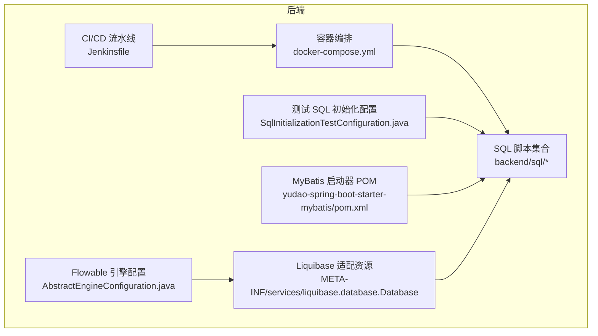
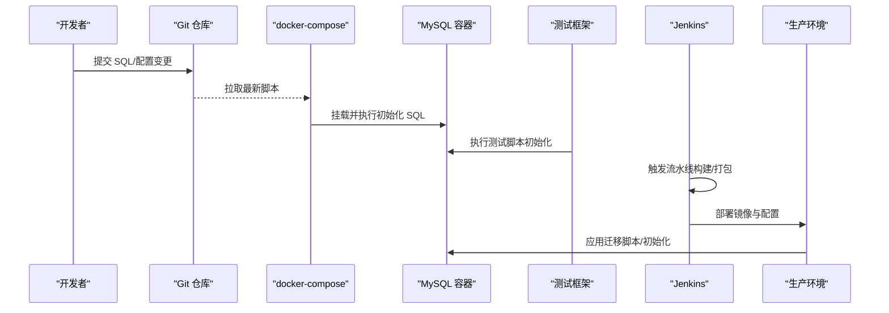
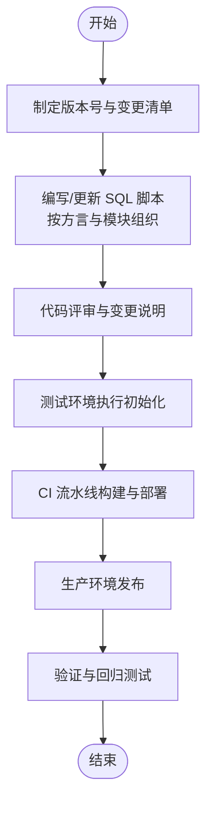
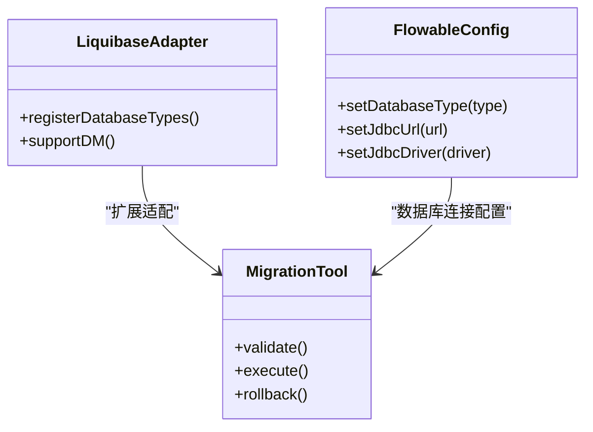
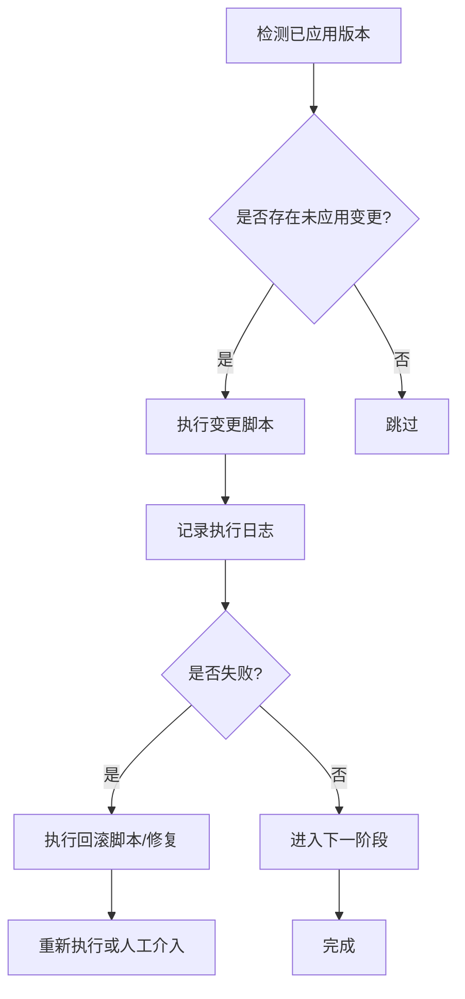
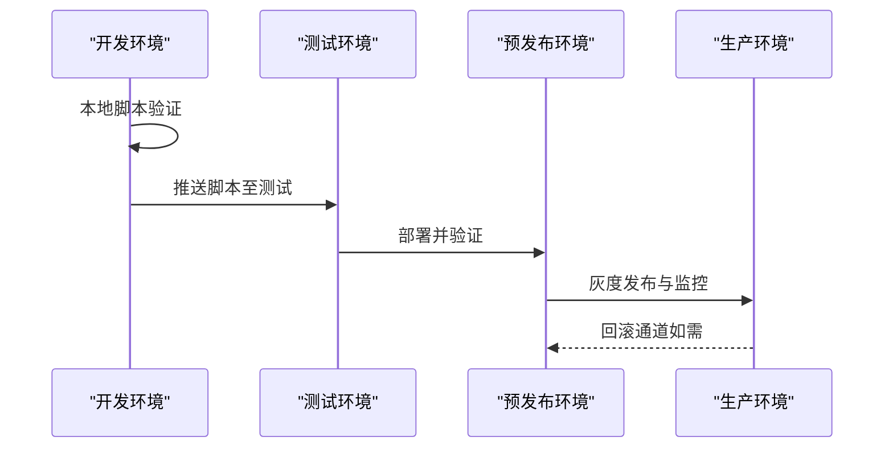
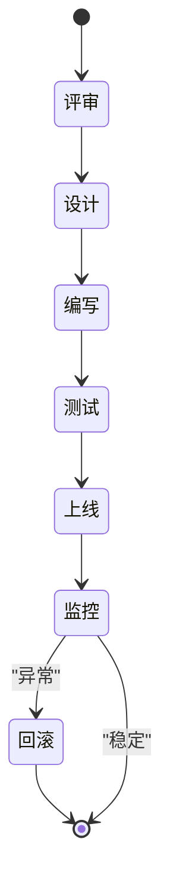
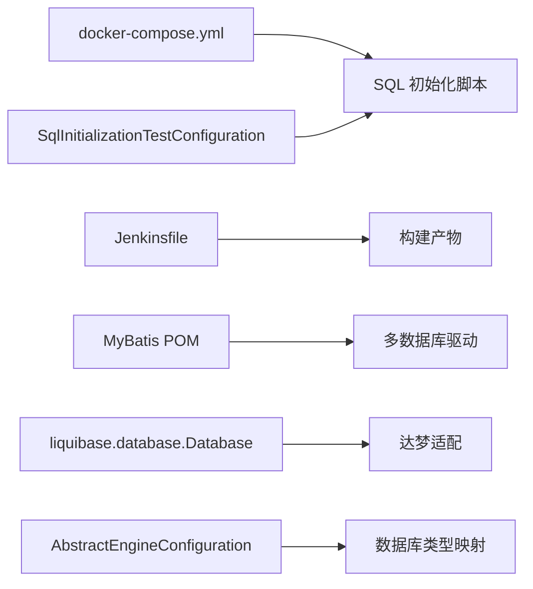

# 数据迁移管理

<cite>
**本文引用的文件**   
- [docker-compose.yml](file://backend/script/docker/docker-compose.yml)
- [Jenkinsfile](file://backend/script/jenkins/Jenkinsfile)
- [README.md](file://backend/sql/db2/README.md)
- [ruoyi-vue-pro.sql](file://backend/sql/mysql/ruoyi-vue-pro.sql)
- [cps-all-in-one.sql](file://backend/sql/module/cps-all-in-one.sql)
- [pom.xml](file://backend/yudao-framework/yudao-spring-boot-starter-mybatis/pom.xml)
- [SqlInitializationTestConfiguration.java](file://backend/yudao-framework/yudao-spring-boot-starter-test/src/main/java/cn/iocoder/yudao/framework/test/config/SqlInitializationTestConfiguration.java)
- [liquibase.database.Database](file://backend/sql/dm/flowable-patch/src/main/resources/META-INF/services/liquibase.database.Database)
- [AbstractEngineConfiguration.java](file://backend/sql/dm/flowable-patch/src/main/java/org/flowable/common/engine/impl/AbstractEngineConfiguration.java)
</cite>

## 目录
1. [引言](#引言)
2. [项目结构](#项目结构)
3. [核心组件](#核心组件)
4. [架构总览](#架构总览)
5. [详细组件分析](#详细组件分析)
6. [依赖分析](#依赖分析)
7. [性能考虑](#性能考虑)
8. [故障排查指南](#故障排查指南)
9. [结论](#结论)
10. [附录](#附录)

## 引言
本文件面向“数据迁移管理”的专业需求，结合仓库现有脚本与配置，系统化阐述数据库版本管理、迁移脚本组织与发布策略；解释 Liquibase 与 Flyway 等迁移工具在本项目的适配现状与最佳实践建议；覆盖增量迁移、回滚策略与数据一致性检查；给出多环境部署的数据同步方案、生产变更流程与风险控制；并提供数据备份策略、恢复测试与灾难恢复演练思路，以及数据库性能基准测试、容量规划与扩容策略，最后说明数据归档、清理与存储优化方案。

## 项目结构
本项目在后端提供了多数据库方言的初始化 SQL 脚本与容器化一键拉起能力，并在测试框架中内置了基于 Spring SQL 初始化的数据库脚本执行机制。同时，针对特定数据库（如达梦 DM）存在 Liquibase 适配的扩展资源。

**图表来源**
- [docker-compose.yml:1-85](file://backend/script/docker/docker-compose.yml#L1-L85)
- [Jenkinsfile:1-61](file://backend/script/jenkins/Jenkinsfile#L1-L61)
- [SqlInitializationTestConfiguration.java:1-52](file://backend/yudao-framework/yudao-spring-boot-starter-test/src/main/java/cn/iocoder/yudao/framework/test/config/SqlInitializationTestConfiguration.java#L1-L52)
- [pom.xml:1-111](file://backend/yudao-framework/yudao-spring-boot-starter-mybatis/pom.xml#L1-L111)
- [liquibase.database.Database:1-21](file://backend/sql/dm/flowable-patch/src/main/resources/META-INF/services/liquibase.database.Database#L1-L21)
- [AbstractEngineConfiguration.java:365-1726](file://backend/sql/dm/flowable-patch/src/main/java/org/flowable/common/engine/impl/AbstractEngineConfiguration.java#L365-L1726)

**章节来源**
- [docker-compose.yml:1-85](file://backend/script/docker/docker-compose.yml#L1-L85)
- [Jenkinsfile:1-61](file://backend/script/jenkins/Jenkinsfile#L1-L61)
- [SqlInitializationTestConfiguration.java:1-52](file://backend/yudao-framework/yudao-spring-boot-starter-test/src/main/java/cn/iocoder/yudao/framework/test/config/SqlInitializationTestConfiguration.java#L1-L52)
- [pom.xml:1-111](file://backend/yudao-framework/yudao-spring-boot-starter-mybatis/pom.xml#L1-L111)
- [liquibase.database.Database:1-21](file://backend/sql/dm/flowable-patch/src/main/resources/META-INF/services/liquibase.database.Database#L1-L21)
- [AbstractEngineConfiguration.java:365-1726](file://backend/sql/dm/flowable-patch/src/main/java/org/flowable/common/engine/impl/AbstractEngineConfiguration.java#L365-L1726)

## 核心组件
- 容器化一键部署：通过 docker-compose 将 MySQL、Redis 与后端服务组合运行，并在首次启动时自动执行初始化 SQL。
- CI/CD 发布：Jenkinsfile 定义了从检出、构建到部署的流水线，支持镜像打包与部署脚本分发。
- SQL 脚本组织：按数据库方言与模块划分，提供完整的建表与初始化脚本，便于多环境同步。
- 测试 SQL 初始化：Spring 测试框架通过 DataSourceScriptDatabaseInitializer 自动执行 SQL 初始化，提升测试一致性。
- 多数据库驱动：MyBatis 启动器 POM 中包含多种数据库驱动依赖，便于在不同数据库上运行。
- Liquibase 适配：达梦 DM 的 Liquibase 适配资源文件，表明项目具备对 Liquibase 的扩展能力。
- Flowable 引擎配置：引擎配置类中包含数据库类型映射与连接池配置，体现对多数据库的支持。

**章节来源**
- [docker-compose.yml:1-85](file://backend/script/docker/docker-compose.yml#L1-L85)
- [Jenkinsfile:1-61](file://backend/script/jenkins/Jenkinsfile#L1-L61)
- [ruoyi-vue-pro.sql:1-200](file://backend/sql/mysql/ruoyi-vue-pro.sql#L1-L200)
- [cps-all-in-one.sql:1-200](file://backend/sql/module/cps-all-in-one.sql#L1-L200)
- [SqlInitializationTestConfiguration.java:1-52](file://backend/yudao-framework/yudao-spring-boot-starter-test/src/main/java/cn/iocoder/yudao/framework/test/config/SqlInitializationTestConfiguration.java#L1-L52)
- [pom.xml:1-111](file://backend/yudao-framework/yudao-spring-boot-starter-mybatis/pom.xml#L1-L111)
- [liquibase.database.Database:1-21](file://backend/sql/dm/flowable-patch/src/main/resources/META-INF/services/liquibase.database.Database#L1-L21)
- [AbstractEngineConfiguration.java:365-1726](file://backend/sql/dm/flowable-patch/src/main/java/org/flowable/common/engine/impl/AbstractEngineConfiguration.java#L365-L1726)

## 架构总览
下图展示了从开发到生产的整体数据迁移与发布路径，包括脚本准备、容器化初始化、测试验证与 CI/CD 部署。

**图表来源**
- [docker-compose.yml:1-85](file://backend/script/docker/docker-compose.yml#L1-L85)
- [Jenkinsfile:1-61](file://backend/script/jenkins/Jenkinsfile#L1-L61)
- [SqlInitializationTestConfiguration.java:1-52](file://backend/yudao-framework/yudao-spring-boot-starter-test/src/main/java/cn/iocoder/yudao/framework/test/config/SqlInitializationTestConfiguration.java#L1-L52)

## 详细组件分析

### 组件一：数据库版本管理与脚本组织
- 版本标识：模块脚本中包含版本号与日期注释，便于追踪演进。
- 方言覆盖：提供 MySQL、PostgreSQL、Oracle、SQLServer、Kingbase、DM、openGauss 等方言脚本，确保多数据库一致性。
- 初始化入口：docker-compose 在首次启动时挂载并执行初始化 SQL，保证本地与测试环境一致。
- 模块化：按功能模块拆分脚本，降低耦合并便于增量演进。

**章节来源**
- [cps-all-in-one.sql:1-200](file://backend/sql/module/cps-all-in-one.sql#L1-L200)
- [ruoyi-vue-pro.sql:1-200](file://backend/sql/mysql/ruoyi-vue-pro.sql#L1-L200)
- [docker-compose.yml:1-85](file://backend/script/docker/docker-compose.yml#L1-L85)

### 组件二：Liquibase 与 Flyway 工具使用与最佳实践
- Liquibase 适配现状：项目包含达梦 DM 的 Liquibase 适配资源文件，表明具备对 Liquibase 的扩展能力。
- Flyway 使用建议：若采用 Flyway，推荐将迁移脚本命名为 V<版本>__<描述>.sql，并按顺序编号；在 CI 中增加校验步骤，确保脚本幂等与可回滚。
- 最佳实践：
  - 幂等性：所有变更必须可重复执行且不改变结果。
  - 可回滚：复杂变更需配套回滚脚本。
  - 分离结构与数据：结构变更与数据变更分层管理。
  - 版本锁定：发布前锁定版本，避免并发变更。
  - 日志与审计：记录执行历史与责任人。

**图表来源**
- [liquibase.database.Database:1-21](file://backend/sql/dm/flowable-patch/src/main/resources/META-INF/services/liquibase.database.Database#L1-L21)
- [AbstractEngineConfiguration.java:365-1726](file://backend/sql/dm/flowable-patch/src/main/java/org/flowable/common/engine/impl/AbstractEngineConfiguration.java#L365-L1726)

**章节来源**
- [liquibase.database.Database:1-21](file://backend/sql/dm/flowable-patch/src/main/resources/META-INF/services/liquibase.database.Database#L1-L21)
- [AbstractEngineConfiguration.java:365-1726](file://backend/sql/dm/flowable-patch/src/main/java/org/flowable/common/engine/impl/AbstractEngineConfiguration.java#L365-L1726)

### 组件三：增量迁移、回滚策略与一致性检查
- 增量迁移：基于版本号的有序脚本，仅执行未应用的变更。
- 回滚策略：Flyway 建议使用 down 脚本；Liquibase 建议使用 tag 与 dropNextChangeSet 实现可控回滚。
- 一致性检查：在测试阶段执行数据校验（如行数、关键字段非空、索引完整性），并在生产灰度发布后进行抽样核对。

**章节来源**
- [Jenkinsfile:1-61](file://backend/script/jenkins/Jenkinsfile#L1-L61)
- [SqlInitializationTestConfiguration.java:1-52](file://backend/yudao-framework/yudao-spring-boot-starter-test/src/main/java/cn/iocoder/yudao/framework/test/config/SqlInitializationTestConfiguration.java#L1-L52)

### 组件四：多环境部署与数据同步
- 开发/测试：通过 docker-compose 挂载初始化 SQL，确保环境一致。
- 预发布/生产：CI 构建后部署至目标集群，配合数据库初始化与迁移脚本。
- 同步策略：建议使用“结构先行、数据分批、双写过渡、最终一致性”策略，逐步切换流量。

**图表来源**
- [docker-compose.yml:1-85](file://backend/script/docker/docker-compose.yml#L1-L85)
- [Jenkinsfile:1-61](file://backend/script/jenkins/Jenkinsfile#L1-L61)

**章节来源**
- [docker-compose.yml:1-85](file://backend/script/docker/docker-compose.yml#L1-L85)
- [Jenkinsfile:1-61](file://backend/script/jenkins/Jenkinsfile#L1-L61)

### 组件五：生产环境变更流程与风险控制
- 变更流程：需求评审 → 设计与评审 → 编写脚本 → 测试验证 → CI 构建 → 灰度发布 → 全量上线 → 回滚预案。
- 风险控制：只读窗口、变更时间窗口、回滚演练、变更审批、自动化校验与告警。

**章节来源**
- [Jenkinsfile:1-61](file://backend/script/jenkins/Jenkinsfile#L1-L61)

### 组件六：数据备份、恢复测试与灾备演练
- 备份策略：全量+增量备份，保留至少 7 天全量与 30 天增量；关键业务表每日快照。
- 恢复测试：每季度进行一次 RTO/RPO 验证，模拟不同故障场景。
- 灾备演练：跨机房容灾演练，验证跨地域恢复能力与业务连续性。

### 组件七：性能基准测试、容量规划与扩容策略
- 基准测试：在测试环境对关键查询与写入路径进行压力测试，记录 QPS、P95 延迟与资源占用。
- 容量规划：基于增长趋势与峰值负载，预留 30%-50% 的冗余；关注索引与分区策略。
- 扩容策略：先横向扩展（读副本/分片），再纵向扩展（升级实例规格）；结合缓存与异步化降低数据库压力。

### 组件八：数据归档、清理与存储优化
- 归档策略：对历史数据按月/季度归档至冷存储，保留热数据在在线库。
- 清理策略：定期清理无效/过期数据，避免碎片化与膨胀。
- 存储优化：定期分析表统计信息、重建索引、压缩表空间；对大字段进行拆分或外部化存储。

## 依赖分析
- 容器编排依赖：docker-compose 依赖 SQL 初始化脚本与数据库镜像。
- CI 依赖：Jenkinsfile 依赖构建产物与部署脚本。
- 测试依赖：测试框架通过 DataSourceScriptDatabaseInitializer 执行 SQL 初始化。
- 数据库驱动：MyBatis 启动器 POM 提供多数据库驱动，便于在不同数据库上运行。
- Liquibase 适配：达梦 DM 的 Liquibase 适配资源文件，表明项目具备对 Liquibase 的扩展能力。

**图表来源**
- [docker-compose.yml:1-85](file://backend/script/docker/docker-compose.yml#L1-L85)
- [Jenkinsfile:1-61](file://backend/script/jenkins/Jenkinsfile#L1-L61)
- [SqlInitializationTestConfiguration.java:1-52](file://backend/yudao-framework/yudao-spring-boot-starter-test/src/main/java/cn/iocoder/yudao/framework/test/config/SqlInitializationTestConfiguration.java#L1-L52)
- [pom.xml:1-111](file://backend/yudao-framework/yudao-spring-boot-starter-mybatis/pom.xml#L1-L111)
- [liquibase.database.Database:1-21](file://backend/sql/dm/flowable-patch/src/main/resources/META-INF/services/liquibase.database.Database#L1-L21)
- [AbstractEngineConfiguration.java:365-1726](file://backend/sql/dm/flowable-patch/src/main/java/org/flowable/common/engine/impl/AbstractEngineConfiguration.java#L365-L1726)

**章节来源**
- [docker-compose.yml:1-85](file://backend/script/docker/docker-compose.yml#L1-L85)
- [Jenkinsfile:1-61](file://backend/script/jenkins/Jenkinsfile#L1-L61)
- [SqlInitializationTestConfiguration.java:1-52](file://backend/yudao-framework/yudao-spring-boot-starter-test/src/main/java/cn/iocoder/yudao/framework/test/config/SqlInitializationTestConfiguration.java#L1-L52)
- [pom.xml:1-111](file://backend/yudao-framework/yudao-spring-boot-starter-mybatis/pom.xml#L1-L111)
- [liquibase.database.Database:1-21](file://backend/sql/dm/flowable-patch/src/main/resources/META-INF/services/liquibase.database.Database#L1-L21)
- [AbstractEngineConfiguration.java:365-1726](file://backend/sql/dm/flowable-patch/src/main/java/org/flowable/common/engine/impl/AbstractEngineConfiguration.java#L365-L1726)

## 性能考虑
- 索引与分区：为高频查询字段建立合适索引，必要时采用分区表。
- 连接池与超时：合理设置连接池大小与超时时间，避免资源争用。
- 批处理与异步：批量写入与异步化处理可显著降低数据库压力。
- 监控与告警：建立数据库性能指标监控，及时发现瓶颈。

## 故障排查指南
- 初始化失败：检查 docker-compose 中挂载的 SQL 文件路径与权限；确认数据库端口与凭据正确。
- 测试初始化异常：确认测试配置中 SQL 初始化的模式与位置，确保脚本可重复执行。
- 数据库驱动问题：确认 MyBatis 启动器 POM 中包含所需数据库驱动。
- Liquibase 适配问题：检查达梦 DM 的适配资源文件是否生效，数据库类型映射是否正确。

**章节来源**
- [docker-compose.yml:1-85](file://backend/script/docker/docker-compose.yml#L1-L85)
- [SqlInitializationTestConfiguration.java:1-52](file://backend/yudao-framework/yudao-spring-boot-starter-test/src/main/java/cn/iocoder/yudao/framework/test/config/SqlInitializationTestConfiguration.java#L1-L52)
- [pom.xml:1-111](file://backend/yudao-framework/yudao-spring-boot-starter-mybatis/pom.xml#L1-L111)
- [liquibase.database.Database:1-21](file://backend/sql/dm/flowable-patch/src/main/resources/META-INF/services/liquibase.database.Database#L1-L21)
- [AbstractEngineConfiguration.java:365-1726](file://backend/sql/dm/flowable-patch/src/main/java/org/flowable/common/engine/impl/AbstractEngineConfiguration.java#L365-L1726)

## 结论
本项目已具备多数据库方言的脚本与容器化一键部署能力，并在测试框架中内置了 SQL 初始化机制。结合 Liquibase 适配与 Flowable 引擎配置，项目已形成较为完善的数据库演进基础。建议在此基础上引入标准化的版本管理与回滚策略，完善 CI/CD 中的校验与灰度发布流程，强化备份、恢复与灾备演练，持续优化性能与容量规划，确保数据迁移管理的安全、高效与可追溯。

## 附录
- 达梦 DM 适配说明：项目包含达梦 DM 的 Liquibase 适配资源文件，表明具备对 Liquibase 的扩展能力，可用于后续迁移工具选型与扩展。
- DB2 适配现状：DB2 适配说明文件表明当前未适配 IBM DB2，如有需要可参考 DM 适配方式推进。

**章节来源**
- [README.md:1-4](file://backend/sql/db2/README.md#L1-L4)
- [liquibase.database.Database:1-21](file://backend/sql/dm/flowable-patch/src/main/resources/META-INF/services/liquibase.database.Database#L1-L21)