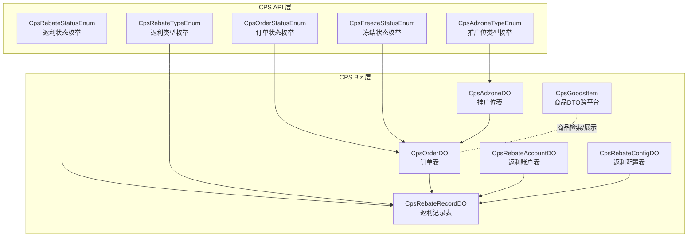
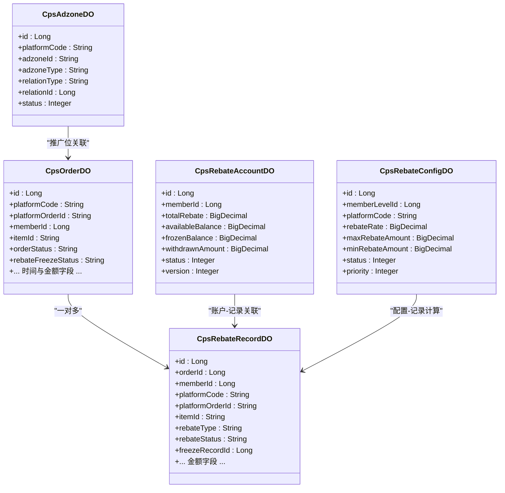
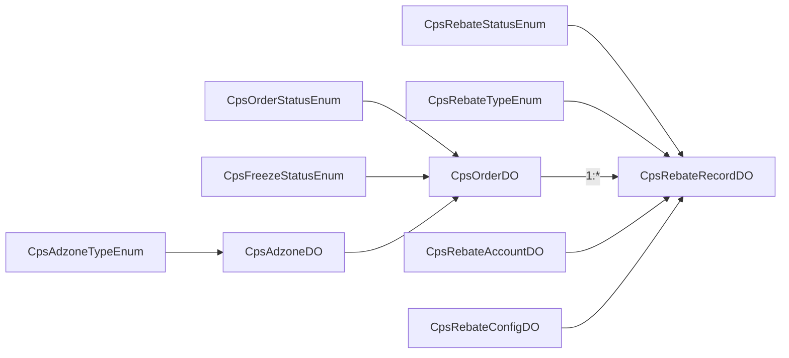

# CPS 业务表设计

<cite>
**本文引用的文件**
- [CpsOrderDO.java](file://backend/yudao-module-cps/yudao-module-cps-biz/src/main/java/cn/iocoder/yudao/module/cps/dal/dataobject/order/CpsOrderDO.java)
- [CpsAdzoneDO.java](file://backend/yudao-module-cps/yudao-module-cps-biz/src/main/java/cn/iocoder/yudao/module/cps/dal/dataobject/adzone/CpsAdzoneDO.java)
- [CpsRebateRecordDO.java](file://backend/yudao-module-cps/yudao-module-cps-biz/src/main/java/cn/iocoder/yudao/module/cps/dal/dataobject/rebate/CpsRebateRecordDO.java)
- [CpsRebateAccountDO.java](file://backend/yudao-module-cps/yudao-module-cps-biz/src/main/java/cn/iocoder/yudao/module/cps/dal/dataobject/rebate/CpsRebateAccountDO.java)
- [CpsRebateConfigDO.java](file://backend/yudao-module-cps/yudao-module-cps-biz/src/main/java/cn/iocoder/yudao/module/cps/dal/dataobject/rebate/CpsRebateConfigDO.java)
- [CpsOrderStatusEnum.java](file://backend/yudao-module-cps/yudao-module-cps-api/src/main/java/cn/iocoder/yudao/module/cps/enums/CpsOrderStatusEnum.java)
- [CpsRebateStatusEnum.java](file://backend/yudao-module-cps/yudao-module-cps-api/src/main/java/cn/iocoder/yudao/module/cps/enums/CpsRebateStatusEnum.java)
- [CpsFreezeStatusEnum.java](file://backend/yudao-module-cps/yudao-module-cps-api/src/main/java/cn/iocoder/yudao/module/cps/enums/CpsFreezeStatusEnum.java)
- [CpsAdzoneTypeEnum.java](file://backend/yudao-module-cps/yudao-module-cps-api/src/main/java/cn/iocoder/yudao/module/cps/enums/CpsAdzoneTypeEnum.java)
- [CpsRebateTypeEnum.java](file://backend/yudao-module-cps/yudao-module-cps-api/src/main/java/cn/iocoder/yudao/module/cps/enums/CpsRebateTypeEnum.java)
- [CpsGoodsItem.java](file://backend/yudao-module-cps/yudao-module-cps-biz/src/main/java/cn/iocoder/yudao/module/cps/client/dto/CpsGoodsItem.java)
- [AGENTS.md](file://AGENTS.md)
</cite>

## 目录
1. [简介](#简介)
2. [项目结构](#项目结构)
3. [核心组件](#核心组件)
4. [架构总览](#架构总览)
5. [详细组件分析](#详细组件分析)
6. [依赖分析](#依赖分析)
7. [性能考虑](#性能考虑)
8. [故障排查指南](#故障排查指南)
9. [结论](#结论)
10. [附录](#附录)

## 简介
本文件面向CPS（Commission Per Sales）业务的数据表设计，围绕订单表、推广位表、返利记录表及账户相关表进行系统性梳理。重点包括：
- 字段的业务含义、数据类型、长度与约束
- 表间关联关系与外键约束建议
- 状态字段设计理念（订单状态、返利状态、冻结状态）
- 索引策略与查询优化
- 业务规则在数据库层面的落地（时间戳、审计字段、多租户隔离）

## 项目结构
CPS模块采用“API + Biz”的分层组织方式，数据对象集中在biz模块的dal.dataobject包下，枚举常量集中在API模块的enums包下。

图表来源
- [CpsOrderDO.java:1-156](file://backend/yudao-module-cps/yudao-module-cps-biz/src/main/java/cn/iocoder/yudao/module/cps/dal/dataobject/order/CpsOrderDO.java#L1-L156)
- [CpsAdzoneDO.java:1-69](file://backend/yudao-module-cps/yudao-module-cps-biz/src/main/java/cn/iocoder/yudao/module/cps/dal/dataobject/adzone/CpsAdzoneDO.java#L1-L69)
- [CpsRebateRecordDO.java:1-99](file://backend/yudao-module-cps/yudao-module-cps-biz/src/main/java/cn/iocoder/yudao/module/cps/dal/dataobject/rebate/CpsRebateRecordDO.java#L1-L99)
- [CpsRebateAccountDO.java:1-62](file://backend/yudao-module-cps/yudao-module-cps-biz/src/main/java/cn/iocoder/yudao/module/cps/dal/dataobject/rebate/CpsRebateAccountDO.java#L1-L62)
- [CpsRebateConfigDO.java:1-63](file://backend/yudao-module-cps/yudao-module-cps-biz/src/main/java/cn/iocoder/yudao/module/cps/dal/dataobject/rebate/CpsRebateConfigDO.java#L1-L63)
- [CpsOrderStatusEnum.java:1-48](file://backend/yudao-module-cps/yudao-module-cps-api/src/main/java/cn/iocoder/yudao/module/cps/enums/CpsOrderStatusEnum.java#L1-L48)
- [CpsRebateStatusEnum.java:1-40](file://backend/yudao-module-cps/yudao-module-cps-api/src/main/java/cn/iocoder/yudao/module/cps/enums/CpsRebateStatusEnum.java#L1-L40)
- [CpsFreezeStatusEnum.java:1-41](file://backend/yudao-module-cps/yudao-module-cps-api/src/main/java/cn/iocoder/yudao/module/cps/enums/CpsFreezeStatusEnum.java#L1-L41)
- [CpsAdzoneTypeEnum.java:1-40](file://backend/yudao-module-cps/yudao-module-cps-api/src/main/java/cn/iocoder/yudao/module/cps/enums/CpsAdzoneTypeEnum.java#L1-L40)
- [CpsRebateTypeEnum.java:1-40](file://backend/yudao-module-cps/yudao-module-cps-api/src/main/java/cn/iocoder/yudao/module/cps/enums/CpsRebateTypeEnum.java#L1-L40)
- [CpsGoodsItem.java:1-93](file://backend/yudao-module-cps/yudao-module-cps-biz/src/main/java/cn/iocoder/yudao/module/cps/client/dto/CpsGoodsItem.java#L1-L93)

章节来源
- [CpsOrderDO.java:1-156](file://backend/yudao-module-cps/yudao-module-cps-biz/src/main/java/cn/iocoder/yudao/module/cps/dal/dataobject/order/CpsOrderDO.java#L1-L156)
- [CpsAdzoneDO.java:1-69](file://backend/yudao-module-cps/yudao-module-cps-biz/src/main/java/cn/iocoder/yudao/module/cps/dal/dataobject/adzone/CpsAdzoneDO.java#L1-L69)
- [CpsRebateRecordDO.java:1-99](file://backend/yudao-module-cps/yudao-module-cps-biz/src/main/java/cn/iocoder/yudao/module/cps/dal/dataobject/rebate/CpsRebateRecordDO.java#L1-L99)
- [CpsRebateAccountDO.java:1-62](file://backend/yudao-module-cps/yudao-module-cps-biz/src/main/java/cn/iocoder/yudao/module/cps/dal/dataobject/rebate/CpsRebateAccountDO.java#L1-L62)
- [CpsRebateConfigDO.java:1-63](file://backend/yudao-module-cps/yudao-module-cps-biz/src/main/java/cn/iocoder/yudao/module/cps/dal/dataobject/rebate/CpsRebateConfigDO.java#L1-L63)
- [CpsOrderStatusEnum.java:1-48](file://backend/yudao-module-cps/yudao-module-cps-api/src/main/java/cn/iocoder/yudao/module/cps/enums/CpsOrderStatusEnum.java#L1-L48)
- [CpsRebateStatusEnum.java:1-40](file://backend/yudao-module-cps/yudao-module-cps-api/src/main/java/cn/iocoder/yudao/module/cps/enums/CpsRebateStatusEnum.java#L1-L40)
- [CpsFreezeStatusEnum.java:1-41](file://backend/yudao-module-cps/yudao-module-cps-api/src/main/java/cn/iocoder/yudao/module/cps/enums/CpsFreezeStatusEnum.java#L1-L41)
- [CpsAdzoneTypeEnum.java:1-40](file://backend/yudao-module-cps/yudao-module-cps-api/src/main/java/cn/iocoder/yudao/module/cps/enums/CpsAdzoneTypeEnum.java#L1-L40)
- [CpsRebateTypeEnum.java:1-40](file://backend/yudao-module-cps/yudao-module-cps-api/src/main/java/cn/iocoder/yudao/module/cps/enums/CpsRebateTypeEnum.java#L1-L40)
- [CpsGoodsItem.java:1-93](file://backend/yudao-module-cps/yudao-module-cps-biz/src/main/java/cn/iocoder/yudao/module/cps/client/dto/CpsGoodsItem.java#L1-L93)

## 核心组件
- 订单表（CpsOrderDO）：记录从各平台同步而来的订单明细，包含订单状态、返利状态、时间轴字段、金额字段等。
- 推广位表（CpsAdzoneDO）：记录不同平台的推广位（PID），支持通用/渠道专属/用户专属三类。
- 返利记录表（CpsRebateRecordDO）：记录每笔订单对应的返利明细，含返利类型、状态、金额、关联冻结记录等。
- 返利账户表（CpsRebateAccountDO）：记录会员的累计返利、可用/冻结余额、状态与版本号。
- 返利配置表（CpsRebateConfigDO）：记录按会员等级/平台维度的返利配置与优先级。
- 商品DTO（CpsGoodsItem）：跨平台商品信息载体，用于商品检索与展示。

章节来源
- [CpsOrderDO.java:1-156](file://backend/yudao-module-cps/yudao-module-cps-biz/src/main/java/cn/iocoder/yudao/module/cps/dal/dataobject/order/CpsOrderDO.java#L1-L156)
- [CpsAdzoneDO.java:1-69](file://backend/yudao-module-cps/yudao-module-cps-biz/src/main/java/cn/iocoder/yudao/module/cps/dal/dataobject/adzone/CpsAdzoneDO.java#L1-L69)
- [CpsRebateRecordDO.java:1-99](file://backend/yudao-module-cps/yudao-module-cps-biz/src/main/java/cn/iocoder/yudao/module/cps/dal/dataobject/rebate/CpsRebateRecordDO.java#L1-L99)
- [CpsRebateAccountDO.java:1-62](file://backend/yudao-module-cps/yudao-module-cps-biz/src/main/java/cn/iocoder/yudao/module/cps/dal/dataobject/rebate/CpsRebateAccountDO.java#L1-L62)
- [CpsRebateConfigDO.java:1-63](file://backend/yudao-module-cps/yudao-module-cps-biz/src/main/java/cn/iocoder/yudao/module/cps/dal/dataobject/rebate/CpsRebateConfigDO.java#L1-L63)
- [CpsGoodsItem.java:1-93](file://backend/yudao-module-cps/yudao-module-cps-biz/src/main/java/cn/iocoder/yudao/module/cps/client/dto/CpsGoodsItem.java#L1-L93)

## 架构总览
CPS数据层通过MyBatis-Plus实体映射到数据库表，所有DO均继承自多租户基类，确保查询天然带租户隔离。状态字段统一使用枚举字符串存储，保证一致性与可读性。

图表来源
- [CpsOrderDO.java:1-156](file://backend/yudao-module-cps/yudao-module-cps-biz/src/main/java/cn/iocoder/yudao/module/cps/dal/dataobject/order/CpsOrderDO.java#L1-L156)
- [CpsAdzoneDO.java:1-69](file://backend/yudao-module-cps/yudao-module-cps-biz/src/main/java/cn/iocoder/yudao/module/cps/dal/dataobject/adzone/CpsAdzoneDO.java#L1-L69)
- [CpsRebateRecordDO.java:1-99](file://backend/yudao-module-cps/yudao-module-cps-biz/src/main/java/cn/iocoder/yudao/module/cps/dal/dataobject/rebate/CpsRebateRecordDO.java#L1-L99)
- [CpsRebateAccountDO.java:1-62](file://backend/yudao-module-cps/yudao-module-cps-biz/src/main/java/cn/iocoder/yudao/module/cps/dal/dataobject/rebate/CpsRebateAccountDO.java#L1-L62)
- [CpsRebateConfigDO.java:1-63](file://backend/yudao-module-cps/yudao-module-cps-biz/src/main/java/cn/iocoder/yudao/module/cps/dal/dataobject/rebate/CpsRebateConfigDO.java#L1-L63)

## 详细组件分析

### 订单表（CpsOrderDO）
- 业务含义：记录从各平台同步的订单信息，包含商品信息、金额、状态与时间轴。
- 关键字段与约束要点
  - 主键：Long 类型自增序列
  - 平台与订单标识：platformCode、platformOrderId（建议建立联合唯一索引以避免重复）
  - 会员与商品：memberId、itemId、itemTitle、itemPic
  - 价格与返利：itemPrice、finalPrice、couponAmount、commissionRate、commissionAmount、estimateRebate、realRebate
  - 状态与冻结：orderStatus（枚举）、rebateFreezeStatus（枚举）
  - 时间轴：syncTime、settleTime、rebateTime、refundTime、confirmReceiptTime、planUnfreezeTime、actualUnfreezeTime、platformConfirmTime
  - 审计与重试：retryCount、lastSyncError
  - 多租户：继承TenantBaseDO，查询自动带租户过滤
- 状态字段设计
  - 订单状态：created/paid/received/settled/rebate_received/refunded/invalid
  - 冻结状态：pending/frozen/unfreezing/unfreezed
- 索引建议
  - 订单号索引：platformCode + platformOrderId（唯一）
  - 会员索引：memberId + createTime（按时间倒序）
  - 商品索引：itemId + createTime
  - 状态索引：orderStatus + createTime
  - 冻结索引：rebateFreezeStatus + planUnfreezeTime
- 查询优化
  - 使用时间范围查询时，建议在createTime或对应业务时间字段上建立索引
  - 对高频筛选条件（memberId、itemId、orderStatus）建立复合索引

章节来源
- [CpsOrderDO.java:1-156](file://backend/yudao-module-cps/yudao-module-cps-biz/src/main/java/cn/iocoder/yudao/module/cps/dal/dataobject/order/CpsOrderDO.java#L1-L156)
- [CpsOrderStatusEnum.java:1-48](file://backend/yudao-module-cps/yudao-module-cps-api/src/main/java/cn/iocoder/yudao/module/cps/enums/CpsOrderStatusEnum.java#L1-L48)
- [CpsFreezeStatusEnum.java:1-41](file://backend/yudao-module-cps/yudao-module-cps-api/src/main/java/cn/iocoder/yudao/module/cps/enums/CpsFreezeStatusEnum.java#L1-L41)

### 推广位表（CpsAdzoneDO）
- 业务含义：记录不同平台的推广位（PID），支持通用/渠道专属/用户专属三类，并可设置默认推广位。
- 关键字段与约束要点
  - 主键：Long 类型自增序列
  - 平台与推广位：platformCode、adzoneId、adzoneName
  - 类型与关联：adzoneType（枚举）、relationType（channel/member）、relationId
  - 默认与状态：isDefault（0/1）、status（0禁用/1启用）
  - 多租户：继承TenantBaseDO
- 索引建议
  - 推广位唯一索引：platformCode + adzoneId
  - 关联索引：relationType + relationId
  - 状态索引：status + isDefault

章节来源
- [CpsAdzoneDO.java:1-69](file://backend/yudao-module-cps/yudao-module-cps-biz/src/main/java/cn/iocoder/yudao/module/cps/dal/dataobject/adzone/CpsAdzoneDO.java#L1-L69)
- [CpsAdzoneTypeEnum.java:1-40](file://backend/yudao-module-cps/yudao-module-cps-api/src/main/java/cn/iocoder/yudao/module/cps/enums/CpsAdzoneTypeEnum.java#L1-L40)

### 返利记录表（CpsRebateRecordDO）
- 业务含义：记录每笔订单产生的返利明细，支持返利入账、扣回与系统调整三类。
- 关键字段与约束要点
  - 主键：Long 类型自增序列
  - 关联：orderId、memberId、platformCode、platformOrderId、itemId
  - 金额：orderAmount、commissionAmount、rebateRate、rebateAmount
  - 类型与状态：rebateType（枚举）、rebateStatus（枚举）
  - 关联与备注：precedingRebateId（扣回时关联前序返利）、freezeRecordId、remark
  - 多租户：继承TenantBaseDO
- 状态字段设计
  - 返利状态：pending/received/refunded
  - 返利类型：rebate/refund/adjust
- 索引建议
  - 订单索引：orderId + rebateStatus
  - 会员索引：memberId + rebateStatus + createTime
  - 商品索引：itemId + rebateStatus
  - 冻结索引：freezeRecordId + rebateStatus

章节来源
- [CpsRebateRecordDO.java:1-99](file://backend/yudao-module-cps/yudao-module-cps-biz/src/main/java/cn/iocoder/yudao/module/cps/dal/dataobject/rebate/CpsRebateRecordDO.java#L1-L99)
- [CpsRebateStatusEnum.java:1-40](file://backend/yudao-module-cps/yudao-module-cps-api/src/main/java/cn/iocoder/yudao/module/cps/enums/CpsRebateStatusEnum.java#L1-L40)
- [CpsRebateTypeEnum.java:1-40](file://backend/yudao-module-cps/yudao-module-cps-api/src/main/java/cn/iocoder/yudao/module/cps/enums/CpsRebateTypeEnum.java#L1-L40)

### 返利账户表（CpsRebateAccountDO）
- 业务含义：记录会员的累计返利、可用/冻结余额、已提现金额与状态。
- 关键字段与约束要点
  - 主键：Long 类型自增序列
  - 会员：memberId
  - 余额：totalRebate、availableBalance、frozenBalance、withdrawnAmount
  - 状态与并发：status（0冻结/1正常）、version（乐观锁）
  - 多租户：继承TenantBaseDO
- 业务规则
  - 可用余额 = totalRebate - frozenBalance - withdrawnAmount
  - 冻结/解冻需配合冻结记录与计划解冻时间字段使用（建议在订单表中体现）

章节来源
- [CpsRebateAccountDO.java:1-62](file://backend/yudao-module-cps/yudao-module-cps-biz/src/main/java/cn/iocoder/yudao/module/cps/dal/dataobject/rebate/CpsRebateAccountDO.java#L1-L62)

### 返利配置表（CpsRebateConfigDO）
- 业务含义：按会员等级/平台维度配置返利比例、上下限与优先级。
- 关键字段与约束要点
  - 主键：Long 类型自增序列
  - 条件：memberLevelId（NULL表示无等级限制）、platformCode（NULL表示全平台）
  - 规则：rebateRate、maxRebateAmount、minRebateAmount
  - 状态与优先级：status（0禁用/1启用）、priority（数字越大优先级越高）
  - 多租户：继承TenantBaseDO
- 业务规则
  - 计算返利时按优先级取第一条匹配配置；若未命中，则按默认规则处理

章节来源
- [CpsRebateConfigDO.java:1-63](file://backend/yudao-module-cps/yudao-module-cps-biz/src/main/java/cn/iocoder/yudao/module/cps/dal/dataobject/rebate/CpsRebateConfigDO.java#L1-L63)

### 商品DTO（CpsGoodsItem）
- 业务含义：跨平台商品信息载体，用于商品检索与展示，便于前端统一渲染。
- 关键字段与约束要点
  - 平台标识：goodsId、platformCode
  - 基本信息：title、mainPic、shopName、brandName
  - 价格：originalPrice、actualPrice、couponPrice
  - 佣金：commissionRate、commissionAmount
  - 销量与链接：monthSales、itemLink、goodsSign（特定平台）
- 适用场景
  - 商品搜索、详情页、推荐位商品列表

章节来源
- [CpsGoodsItem.java:1-93](file://backend/yudao-module-cps/yudao-module-cps-biz/src/main/java/cn/iocoder/yudao/module/cps/client/dto/CpsGoodsItem.java#L1-L93)

## 依赖分析
- 枚举依赖：订单表依赖订单状态枚举；返利记录表依赖返利状态与类型枚举；订单表依赖冻结状态枚举；推广位表依赖推广位类型枚举。
- 业务依赖：订单表与返利记录表存在一对多关系；推广位表与订单表存在推广位关联；账户表与返利记录表存在账户-记录关联；配置表为返利计算提供依据。
- 多租户：所有DO继承TenantBaseDO，查询自动带租户过滤，避免跨租户数据泄露。

图表来源
- [CpsOrderDO.java:1-156](file://backend/yudao-module-cps/yudao-module-cps-biz/src/main/java/cn/iocoder/yudao/module/cps/dal/dataobject/order/CpsOrderDO.java#L1-L156)
- [CpsAdzoneDO.java:1-69](file://backend/yudao-module-cps/yudao-module-cps-biz/src/main/java/cn/iocoder/yudao/module/cps/dal/dataobject/adzone/CpsAdzoneDO.java#L1-L69)
- [CpsRebateRecordDO.java:1-99](file://backend/yudao-module-cps/yudao-module-cps-biz/src/main/java/cn/iocoder/yudao/module/cps/dal/dataobject/rebate/CpsRebateRecordDO.java#L1-L99)
- [CpsRebateAccountDO.java:1-62](file://backend/yudao-module-cps/yudao-module-cps-biz/src/main/java/cn/iocoder/yudao/module/cps/dal/dataobject/rebate/CpsRebateAccountDO.java#L1-L62)
- [CpsRebateConfigDO.java:1-63](file://backend/yudao-module-cps/yudao-module-cps-biz/src/main/java/cn/iocoder/yudao/module/cps/dal/dataobject/rebate/CpsRebateConfigDO.java#L1-L63)
- [CpsOrderStatusEnum.java:1-48](file://backend/yudao-module-cps/yudao-module-cps-api/src/main/java/cn/iocoder/yudao/module/cps/enums/CpsOrderStatusEnum.java#L1-L48)
- [CpsRebateStatusEnum.java:1-40](file://backend/yudao-module-cps/yudao-module-cps-api/src/main/java/cn/iocoder/yudao/module/cps/enums/CpsRebateStatusEnum.java#L1-L40)
- [CpsFreezeStatusEnum.java:1-41](file://backend/yudao-module-cps/yudao-module-cps-api/src/main/java/cn/iocoder/yudao/module/cps/enums/CpsFreezeStatusEnum.java#L1-L41)
- [CpsAdzoneTypeEnum.java:1-40](file://backend/yudao-module-cps/yudao-module-cps-api/src/main/java/cn/iocoder/yudao/module/cps/enums/CpsAdzoneTypeEnum.java#L1-L40)
- [CpsRebateTypeEnum.java:1-40](file://backend/yudao-module-cps/yudao-module-cps-api/src/main/java/cn/iocoder/yudao/module/cps/enums/CpsRebateTypeEnum.java#L1-L40)

## 性能考虑
- 时间字段设计
  - 使用LocalDateTime类型记录业务时间点，避免时区问题；遵循系统Asia/Shanghai配置。
- 金额字段设计
  - 使用BigDecimal存储金额，遵循“整数存储法”（以分为单位）避免浮点误差。
- 索引策略
  - 订单号：platformCode + platformOrderId（唯一）
  - 会员/商品：memberId、itemId + createTime（倒序）
  - 状态：orderStatus、rebateStatus + createTime
  - 冻结：rebateFreezeStatus、freezeRecordId + planUnfreezeTime
- 查询优化
  - 分页查询建议基于主键或唯一索引进行游标分页
  - 复合条件查询优先命中最左前缀索引
- 并发控制
  - 账户余额操作使用乐观锁version字段，防止超扣
- 多租户
  - 所有查询自动带租户过滤，避免跨租户数据访问

章节来源
- [AGENTS.md:227-234](file://AGENTS.md#L227-L234)
- [CpsOrderDO.java:1-156](file://backend/yudao-module-cps/yudao-module-cps-biz/src/main/java/cn/iocoder/yudao/module/cps/dal/dataobject/order/CpsOrderDO.java#L1-L156)
- [CpsRebateAccountDO.java:1-62](file://backend/yudao-module-cps/yudao-module-cps-biz/src/main/java/cn/iocoder/yudao/module/cps/dal/dataobject/rebate/CpsRebateAccountDO.java#L1-L62)

## 故障排查指南
- 订单重复入库
  - 现象：同一平台订单号出现重复
  - 排查：检查platformCode + platformOrderId是否建有唯一索引；确认幂等写入逻辑
- 返利状态异常
  - 现象：返利状态与预期不符
  - 排查：核对返利状态枚举值；检查扣回流程是否正确设置precedingRebateId
- 冻结/解冻延迟
  - 现象：计划解冻时间已到但未解冻
  - 排查：核对订单表planUnfreezeTime与actualUnfreezeTime字段更新逻辑；检查冻结状态流转
- 余额不一致
  - 现象：账户可用余额与计算值不符
  - 排查：核对totalRebate、frozenBalance、withdrawnAmount与实际流水；确认乐观锁version冲突处理

章节来源
- [CpsOrderDO.java:1-156](file://backend/yudao-module-cps/yudao-module-cps-biz/src/main/java/cn/iocoder/yudao/module/cps/dal/dataobject/order/CpsOrderDO.java#L1-L156)
- [CpsRebateRecordDO.java:1-99](file://backend/yudao-module-cps/yudao-module-cps-biz/src/main/java/cn/iocoder/yudao/module/cps/dal/dataobject/rebate/CpsRebateRecordDO.java#L1-L99)
- [CpsRebateAccountDO.java:1-62](file://backend/yudao-module-cps/yudao-module-cps-biz/src/main/java/cn/iocoder/yudao/module/cps/dal/dataobject/rebate/CpsRebateAccountDO.java#L1-L62)

## 结论
本设计以清晰的状态枚举、严谨的金额与时间字段、完善的索引策略与多租户隔离为基础，支撑CPS订单、推广位、返利与账户的完整业务闭环。通过规范的索引与查询优化，可在高并发场景下保持稳定与高效。

## 附录
- 术语
  - 平台编码：taobao/jd/pdd/douyin等
  - 推广位类型：general/channel/member
  - 返利类型：rebate/refund/adjust
  - 订单状态：created/paid/received/settled/rebate_received/refunded/invalid
  - 冻结状态：pending/frozen/unfreezing/unfreezed