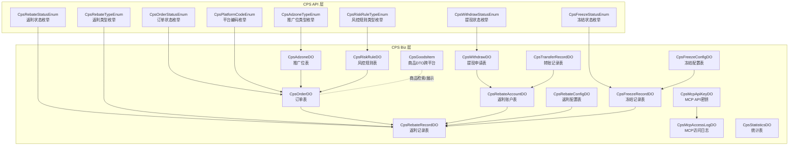
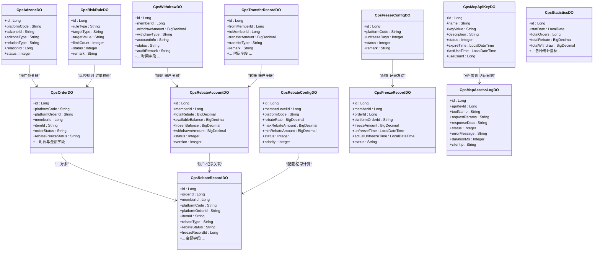
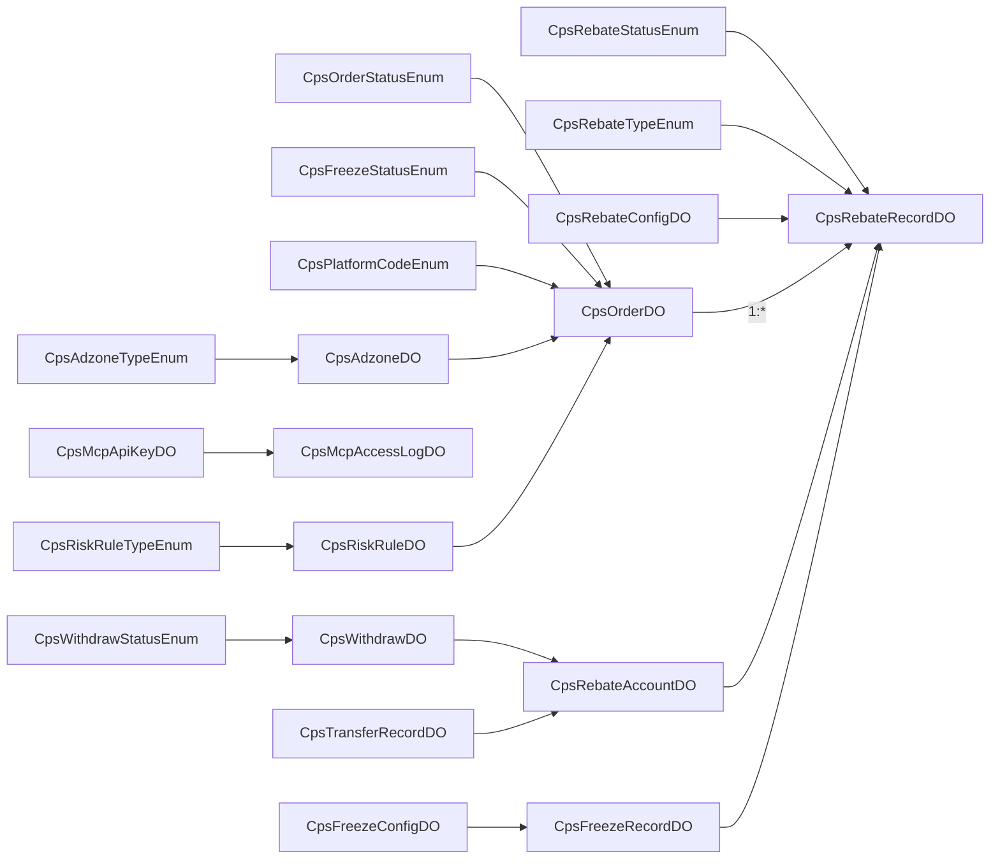

# CPS 业务表设计

<cite>
**本文引用的文件**
- [CpsOrderDO.java](file://backend/yudao-module-cps/yudao-module-cps-biz/src/main/java/cn/iocoder/yudao/module/cps/dal/dataobject/order/CpsOrderDO.java)
- [CpsAdzoneDO.java](file://backend/yudao-module-cps/yudao-module-cps-biz/src/main/java/cn/iocoder/yudao/module/cps/dal/dataobject/adzone/CpsAdzoneDO.java)
- [CpsRebateRecordDO.java](file://backend/yudao-module-cps/yudao-module-cps-biz/src/main/java/cn/iocoder/yudao/module/cps/dal/dataobject/rebate/CpsRebateRecordDO.java)
- [CpsRebateAccountDO.java](file://backend/yudao-module-cps/yudao-module-cps-biz/src/main/java/cn/iocoder/yudao/module/cps/dal/dataobject/rebate/CpsRebateAccountDO.java)
- [CpsRebateConfigDO.java](file://backend/yudao-module-cps/yudao-module-cps-biz/src/main/java/cn/iocoder/yudao/module/cps/dal/dataobject/rebate/CpsRebateConfigDO.java)
- [CpsFreezeConfigDO.java](file://backend/yudao-module-cps/yudao-module-cps-biz/src/main/java/cn/iocoder/yudao/module/cps/dal/dataobject/freezze/CpsFreezeConfigDO.java)
- [CpsFreezeRecordDO.java](file://backend/yudao-module-cps/yudao-module-cps-biz/src/main/java/cn/iocoder/yudao/module/cps/dal/dataobject/freezze/CpsFreezeRecordDO.java)
- [CpsMcpAccessLogDO.java](file://backend/yudao-module-cps/yudao-module-cps-biz/src/main/java/cn/iocoder/yudao/module/cps/dal/dataobject/mcp/CpsMcpAccessLogDO.java)
- [CpsMcpApiKeyDO.java](file://backend/yudao-module-cps/yudao-module-cps-biz/src/main/java/cn/iocoder/yudao/module/cps/dal/dataobject/mcp/CpsMcpApiKeyDO.java)
- [CpsRiskRuleDO.java](file://backend/yudao-module-cps/yudao-module-cps-biz/src/main/java/cn/iocoder/yudao/module/cps/dal/dataobject/risk/CpsRiskRuleDO.java)
- [CpsWithdrawDO.java](file://backend/yudao-module-cps/yudao-module-cps-biz/src/main/java/cn/iocoder/yudao/module/cps/dal/dataobject/withdraw/CpsWithdrawDO.java)
- [CpsTransferRecordDO.java](file://backend/yudao-module-cps/yudao-module-cps-biz/src/main/java/cn/iocoder/yudao/module/cps/dal/dataobject/transfer/CpsTransferRecordDO.java)
- [CpsStatisticsDO.java](file://backend/yudao-module-cps/yudao-module-cps-biz/src/main/java/cn/iocoder/yudao/module/cps/dal/dataobject/statistics/CpsStatisticsDO.java)
- [CpsOrderStatusEnum.java](file://backend/yudao-module-cps/yudao-module-cps-api/src/main/java/cn/iocoder/yudao/module/cps/enums/CpsOrderStatusEnum.java)
- [CpsRebateStatusEnum.java](file://backend/yudao-module-cps/yudao-module-cps-api/src/main/java/cn/iocoder/yudao/module/cps/enums/CpsRebateStatusEnum.java)
- [CpsFreezeStatusEnum.java](file://backend/yudao-module-cps/yudao-module-cps-api/src/main/java/cn/iocoder/yudao/module/cps/enums/CpsFreezeStatusEnum.java)
- [CpsAdzoneTypeEnum.java](file://backend/yudao-module-cps/yudao-module-cps-api/src/main/java/cn/iocoder/yudao/module/cps/enums/CpsAdzoneTypeEnum.java)
- [CpsRebateTypeEnum.java](file://backend/yudao-module-cps/yudao-module-cps-api/src/main/java/cn/iocoder/yudao/module/cps/enums/CpsRebateTypeEnum.java)
- [CpsRiskRuleTypeEnum.java](file://backend/yudao-module-cps/yudao-module-cps-api/src/main/java/cn/iocoder/yudao/module/cps/enums/CpsRiskRuleTypeEnum.java)
- [CpsWithdrawStatusEnum.java](file://backend/yudao-module-cps/yudao-module-cps-api/src/main/java/cn/iocoder/yudao/module/cps/enums/CpsWithdrawStatusEnum.java)
- [CpsPlatformCodeEnum.java](file://backend/yudao-module-cps/yudao-module-cps-api/src/main/java/cn/iocoder/yudao/module/cps/enums/CpsPlatformCodeEnum.java)
- [CpsGoodsItem.java](file://backend/yudao-module-cps/yudao-module-cps-biz/src/main/java/cn/iocoder/yudao/module/cps/client/dto/CpsGoodsItem.java)
- [AGENTS.md](file://AGENTS.md)
</cite>

## 更新摘要
**所做更改**
- 扩展了CPS数据库架构，新增了平台配置表、冻结配置表、冻结记录表、MCP访问日志表、MCP API密钥表、风险规则表、提现表、转账记录表、统计表等核心业务表
- 更新了表结构设计，增加了更多业务场景支持
- 完善了风控体系和资金管理功能
- 增强了系统监控和审计能力

## 目录
1. [简介](#简介)
2. [项目结构](#项目结构)
3. [核心组件](#核心组件)
4. [架构总览](#架构总览)
5. [详细组件分析](#详细组件分析)
6. [依赖分析](#依赖分析)
7. [性能考虑](#性能考虑)
8. [故障排查指南](#故障排查指南)
9. [结论](#结论)
10. [附录](#附录)

## 简介
本文件面向CPS（Commission Per Sales）业务的完整数据库架构设计，涵盖了从订单管理到资金结算、从推广管理到风控监控的全流程业务表设计。重点包括：
- 核心业务表：订单表、推广位表、返利记录表、账户表、配置表
- 辅助业务表：冻结配置表、冻结记录表、提现表、转账记录表
- 支撑业务表：MCP访问日志表、MCP API密钥表、风险规则表、统计表
- 字段的业务含义、数据类型、长度与约束
- 表间关联关系与外键约束建议
- 状态字段设计理念（订单状态、返利状态、冻结状态、提现状态）
- 索引策略与查询优化
- 业务规则在数据库层面的落地（时间戳、审计字段、多租户隔离）

## 项目结构
CPS模块采用"API + Biz"的分层组织方式，数据对象集中在biz模块的dal.dataobject包下，枚举常量集中在API模块的enums包下。新增的表结构涵盖了完整的CPS业务生命周期。

**图表来源**
- [CpsOrderDO.java:1-156](file://backend/yudao-module-cps/yudao-module-cps-biz/src/main/java/cn/iocoder/yudao/module/cps/dal/dataobject/order/CpsOrderDO.java#L1-L156)
- [CpsAdzoneDO.java:1-68](file://backend/yudao-module-cps/yudao-module-cps-biz/src/main/java/cn/iocoder/yudao/module/cps/dal/dataobject/adzone/CpsAdzoneDO.java#L1-L68)
- [CpsRebateRecordDO.java:1-99](file://backend/yudao-module-cps/yudao-module-cps-biz/src/main/java/cn/iocoder/yudao/module/cps/dal/dataobject/rebate/CpsRebateRecordDO.java#L1-L99)
- [CpsRebateAccountDO.java:1-62](file://backend/yudao-module-cps/yudao-module-cps-biz/src/main/java/cn/iocoder/yudao/module/cps/dal/dataobject/rebate/CpsRebateAccountDO.java#L1-L62)
- [CpsRebateConfigDO.java:1-63](file://backend/yudao-module-cps/yudao-module-cps-biz/src/main/java/cn/iocoder/yudao/module/cps/dal/dataobject/rebate/CpsRebateConfigDO.java#L1-L63)
- [CpsFreezeConfigDO.java:1-49](file://backend/yudao-module-cps/yudao-module-cps-biz/src/main/java/cn/iocoder/yudao/module/cps/dal/dataobject/freeze/CpsFreezeConfigDO.java#L1-L49)
- [CpsFreezeRecordDO.java:1-64](file://backend/yudao-module-cps/yudao-module-cps-biz/src/main/java/cn/iocoder/yudao/module/cps/dal/dataobject/freeze/CpsFreezeRecordDO.java#L1-L64)
- [CpsMcpAccessLogDO.java:1-62](file://backend/yudao-module-cps/yudao-module-cps-biz/src/main/java/cn/iocoder/yudao/module/cps/dal/dataobject/mcp/CpsMcpAccessLogDO.java#L1-L62)
- [CpsMcpApiKeyDO.java:1-60](file://backend/yudao-module-cps/yudao-module-cps-biz/src/main/java/cn/iocoder/yudao/module/cps/dal/dataobject/mcp/CpsMcpApiKeyDO.java#L1-L60)
- [CpsRiskRuleDO.java:1-73](file://backend/yudao-module-cps/yudao-module-cps-biz/src/main/java/cn/iocoder/yudao/module/cps/dal/dataobject/risk/CpsRiskRuleDO.java#L1-L73)
- [CpsWithdrawDO.java:1-80](file://backend/yudao-module-cps/yudao-module-cps-biz/src/main/java/cn/iocoder/yudao/module/cps/dal/dataobject/withdraw/CpsWithdrawDO.java#L1-L80)
- [CpsTransferRecordDO.java:1-70](file://backend/yudao-module-cps/yudao-module-cps-biz/src/main/java/cn/iocoder/yudao/module/cps/dal/dataobject/transfer/CpsTransferRecordDO.java#L1-L70)
- [CpsStatisticsDO.java:1-60](file://backend/yudao-module-cps/yudao-module-cps-biz/src/main/java/cn/iocoder/yudao/module/cps/dal/dataobject/statistics/CpsStatisticsDO.java#L1-L60)

**章节来源**
- [CpsOrderDO.java:1-156](file://backend/yudao-module-cps/yudao-module-cps-biz/src/main/java/cn/iocoder/yudao/module/cps/dal/dataobject/order/CpsOrderDO.java#L1-L156)
- [CpsAdzoneDO.java:1-68](file://backend/yudao-module-cps/yudao-module-cps-biz/src/main/java/cn/iocoder/yudao/module/cps/dal/dataobject/adzone/CpsAdzoneDO.java#L1-L68)
- [CpsRebateRecordDO.java:1-99](file://backend/yudao-module-cps/yudao-module-cps-biz/src/main/java/cn/iocoder/yudao/module/cps/dal/dataobject/rebate/CpsRebateRecordDO.java#L1-L99)
- [CpsRebateAccountDO.java:1-62](file://backend/yudao-module-cps/yudao-module-cps-biz/src/main/java/cn/iocoder/yudao/module/cps/dal/dataobject/rebate/CpsRebateAccountDO.java#L1-L62)
- [CpsRebateConfigDO.java:1-63](file://backend/yudao-module-cps/yudao-module-cps-biz/src/main/java/cn/iocoder/yudao/module/cps/dal/dataobject/rebate/CpsRebateConfigDO.java#L1-L63)
- [CpsFreezeConfigDO.java:1-49](file://backend/yudao-module-cps/yudao-module-cps-biz/src/main/java/cn/iocoder/yudao/module/cps/dal/dataobject/freeze/CpsFreezeConfigDO.java#L1-L49)
- [CpsFreezeRecordDO.java:1-64](file://backend/yudao-module-cps/yudao-module-cps-biz/src/main/java/cn/iocoder/yudao/module/cps/dal/dataobject/freeze/CpsFreezeRecordDO.java#L1-L64)
- [CpsMcpAccessLogDO.java:1-62](file://backend/yudao-module-cps/yudao-module-cps-biz/src/main/java/cn/iocoder/yudao/module/cps/dal/dataobject/mcp/CpsMcpAccessLogDO.java#L1-L62)
- [CpsMcpApiKeyDO.java:1-60](file://backend/yudao-module-cps/yudao-module-cps-biz/src/main/java/cn/iocoder/yudao/module/cps/dal/dataobject/mcp/CpsMcpApiKeyDO.java#L1-L60)
- [CpsRiskRuleDO.java:1-73](file://backend/yudao-module-cps/yudao-module-cps-biz/src/main/java/cn/iocoder/yudao/module/cps/dal/dataobject/risk/CpsRiskRuleDO.java#L1-L73)
- [CpsWithdrawDO.java:1-80](file://backend/yudao-module-cps/yudao-module-cps-biz/src/main/java/cn/iocoder/yudao/module/cps/dal/dataobject/withdraw/CpsWithdrawDO.java#L1-L80)
- [CpsTransferRecordDO.java:1-70](file://backend/yudao-module-cps/yudao-module-cps-biz/src/main/java/cn/iocoder/yudao/module/cps/dal/dataobject/transfer/CpsTransferRecordDO.java#L1-L70)
- [CpsStatisticsDO.java:1-60](file://backend/yudao-module-cps/yudao-module-cps-biz/src/main/java/cn/iocoder/yudao/module/cps/dal/dataobject/statistics/CpsStatisticsDO.java#L1-L60)

## 核心组件
- **订单表（CpsOrderDO）**：记录从各平台同步而来的订单明细，包含订单状态、返利状态、时间轴字段、金额字段等。
- **推广位表（CpsAdzoneDO）**：记录不同平台的推广位（PID），支持通用/渠道专属/用户专属三类。
- **返利记录表（CpsRebateRecordDO）**：记录每笔订单对应的返利明细，含返利类型、状态、金额、关联冻结记录等。
- **返利账户表（CpsRebateAccountDO）**：记录会员的累计返利、可用/冻结余额、状态与版本号。
- **返利配置表（CpsRebateConfigDO）**：记录按会员等级/平台维度的返利配置与优先级。
- **冻结配置表（CpsFreezeConfigDO）**：记录按平台维度的冻结解冻配置规则。
- **冻结记录表（CpsFreezeRecordDO）**：记录会员的冻结解冻明细，支持自动解冻和手动解冻。
- **MCP访问日志表（CpsMcpAccessLogDO）**：记录MCP接口访问情况，支持API密钥鉴权和访问统计。
- **MCP API密钥表（CpsMcpApiKeyDO）**：管理MCP接口访问的API密钥，支持过期时间和使用统计。
- **风险规则表（CpsRiskRuleDO）**：记录风控规则，支持频率限制和黑名单两种模式。
- **提现申请表（CpsWithdrawDO）**：记录会员的提现申请，支持多种提现类型和状态管理。
- **转账记录表（CpsTransferRecordDO）**：记录账户间的转账明细，支持资金流转跟踪。
- **统计表（CpsStatisticsDO）**：记录系统的统计数据，支持运营分析和报表生成。
- **商品DTO（CpsGoodsItem）**：跨平台商品信息载体，用于商品检索与展示。

**章节来源**
- [CpsOrderDO.java:1-156](file://backend/yudao-module-cps/yudao-module-cps-biz/src/main/java/cn/iocoder/yudao/module/cps/dal/dataobject/order/CpsOrderDO.java#L1-L156)
- [CpsAdzoneDO.java:1-68](file://backend/yudao-module-cps/yudao-module-cps-biz/src/main/java/cn/iocoder/yudao/module/cps/dal/dataobject/adzone/CpsAdzoneDO.java#L1-L68)
- [CpsRebateRecordDO.java:1-99](file://backend/yudao-module-cps/yudao-module-cps-biz/src/main/java/cn/iocoder/yudao/module/cps/dal/dataobject/rebate/CpsRebateRecordDO.java#L1-L99)
- [CpsRebateAccountDO.java:1-62](file://backend/yudao-module-cps/yudao-module-cps-biz/src/main/java/cn/iocoder/yudao/module/cps/dal/dataobject/rebate/CpsRebateAccountDO.java#L1-L62)
- [CpsRebateConfigDO.java:1-63](file://backend/yudao-module-cps/yudao-module-cps-biz/src/main/java/cn/iocoder/yudao/module/cps/dal/dataobject/rebate/CpsRebateConfigDO.java#L1-L63)
- [CpsFreezeConfigDO.java:1-49](file://backend/yudao-module-cps/yudao-module-cps-biz/src/main/java/cn/iocoder/yudao/module/cps/dal/dataobject/freeze/CpsFreezeConfigDO.java#L1-L49)
- [CpsFreezeRecordDO.java:1-64](file://backend/yudao-module-cps/yudao-module-cps-biz/src/main/java/cn/iocoder/yudao/module/cps/dal/dataobject/freeze/CpsFreezeRecordDO.java#L1-L64)
- [CpsMcpAccessLogDO.java:1-62](file://backend/yudao-module-cps/yudao-module-cps-biz/src/main/java/cn/iocoder/yudao/module/cps/dal/dataobject/mcp/CpsMcpAccessLogDO.java#L1-L62)
- [CpsMcpApiKeyDO.java:1-60](file://backend/yudao-module-cps/yudao-module-cps-biz/src/main/java/cn/iocoder/yudao/module/cps/dal/dataobject/mcp/CpsMcpApiKeyDO.java#L1-L60)
- [CpsRiskRuleDO.java:1-73](file://backend/yudao-module-cps/yudao-module-cps-biz/src/main/java/cn/iocoder/yudao/module/cps/dal/dataobject/risk/CpsRiskRuleDO.java#L1-L73)
- [CpsWithdrawDO.java:1-80](file://backend/yudao-module-cps/yudao-module-cps-biz/src/main/java/cn/iocoder/yudao/module/cps/dal/dataobject/withdraw/CpsWithdrawDO.java#L1-L80)
- [CpsTransferRecordDO.java:1-70](file://backend/yudao-module-cps/yudao-module-cps-biz/src/main/java/cn/iocoder/yudao/module/cps/dal/dataobject/transfer/CpsTransferRecordDO.java#L1-L70)
- [CpsStatisticsDO.java:1-60](file://backend/yudao-module-cps/yudao-module-cps-biz/src/main/java/cn/iocoder/yudao/module/cps/dal/dataobject/statistics/CpsStatisticsDO.java#L1-L60)
- [CpsGoodsItem.java:1-93](file://backend/yudao-module-cps/yudao-module-cps-biz/src/main/java/cn/iocoder/yudao/module/cps/client/dto/CpsGoodsItem.java#L1-L93)

## 架构总览
CPS数据层通过MyBatis-Plus实体映射到数据库表，所有DO均继承自多租户基类，确保查询天然带租户隔离。状态字段统一使用枚举字符串存储，保证一致性与可读性。新增的表结构形成了完整的CPS业务生态系统。

**图表来源**
- [CpsOrderDO.java:1-156](file://backend/yudao-module-cps/yudao-module-cps-biz/src/main/java/cn/iocoder/yudao/module/cps/dal/dataobject/order/CpsOrderDO.java#L1-L156)
- [CpsAdzoneDO.java:1-68](file://backend/yudao-module-cps/yudao-module-cps-biz/src/main/java/cn/iocoder/yudao/module/cps/dal/dataobject/adzone/CpsAdzoneDO.java#L1-L68)
- [CpsRebateRecordDO.java:1-99](file://backend/yudao-module-cps/yudao-module-cps-biz/src/main/java/cn/iocoder/yudao/module/cps/dal/dataobject/rebate/CpsRebateRecordDO.java#L1-L99)
- [CpsRebateAccountDO.java:1-62](file://backend/yudao-module-cps/yudao-module-cps-biz/src/main/java/cn/iocoder/yudao/module/cps/dal/dataobject/rebate/CpsRebateAccountDO.java#L1-L62)
- [CpsRebateConfigDO.java:1-63](file://backend/yudao-module-cps/yudao-module-cps-biz/src/main/java/cn/iocoder/yudao/module/cps/dal/dataobject/rebate/CpsRebateConfigDO.java#L1-L63)
- [CpsFreezeConfigDO.java:1-49](file://backend/yudao-module-cps/yudao-module-cps-biz/src/main/java/cn/iocoder/yudao/module/cps/dal/dataobject/freeze/CpsFreezeConfigDO.java#L1-L49)
- [CpsFreezeRecordDO.java:1-64](file://backend/yudao-module-cps/yudao-module-cps-biz/src/main/java/cn/iocoder/yudao/module/cps/dal/dataobject/freeze/CpsFreezeRecordDO.java#L1-L64)
- [CpsMcpAccessLogDO.java:1-62](file://backend/yudao-module-cps/yudao-module-cps-biz/src/main/java/cn/iocoder/yudao/module/cps/dal/dataobject/mcp/CpsMcpAccessLogDO.java#L1-L62)
- [CpsMcpApiKeyDO.java:1-60](file://backend/yudao-module-cps/yudao-module-cps-biz/src/main/java/cn/iocoder/yudao/module/cps/dal/dataobject/mcp/CpsMcpApiKeyDO.java#L1-L60)
- [CpsRiskRuleDO.java:1-73](file://backend/yudao-module-cps/yudao-module-cps-biz/src/main/java/cn/iocoder/yudao/module/cps/dal/dataobject/risk/CpsRiskRuleDO.java#L1-L73)
- [CpsWithdrawDO.java:1-80](file://backend/yudao-module-cps/yudao-module-cps-biz/src/main/java/cn/iocoder/yudao/module/cps/dal/dataobject/withdraw/CpsWithdrawDO.java#L1-L80)
- [CpsTransferRecordDO.java:1-70](file://backend/yudao-module-cps/yudao-module-cps-biz/src/main/java/cn/iocoder/yudao/module/cps/dal/dataobject/transfer/CpsTransferRecordDO.java#L1-L70)
- [CpsStatisticsDO.java:1-60](file://backend/yudao-module-cps/yudao-module-cps-biz/src/main/java/cn/iocoder/yudao/module/cps/dal/dataobject/statistics/CpsStatisticsDO.java#L1-L60)

## 详细组件分析

### 订单表（CpsOrderDO）
- **业务含义**：记录从各平台同步的订单信息，包含商品信息、金额、状态与时间轴。
- **关键字段与约束要点**
  - 主键：Long 类型自增序列
  - 平台与订单标识：platformCode、platformOrderId（建议建立联合唯一索引以避免重复）
  - 会员与商品：memberId、itemId、itemTitle、itemPic
  - 价格与返利：itemPrice、finalPrice、couponAmount、commissionRate、commissionAmount、estimateRebate、realRebate
  - 状态与冻结：orderStatus（枚举）、rebateFreezeStatus（枚举）
  - 时间轴：syncTime、settleTime、rebateTime、refundTime、confirmReceiptTime、planUnfreezeTime、actualUnfreezeTime、platformConfirmTime
  - 审计与重试：retryCount、lastSyncError
  - 多租户：继承TenantBaseDO，查询自动带租户过滤
- **状态字段设计**
  - 订单状态：created/paid/received/settled/rebate_received/refunded/invalid
  - 冻结状态：pending/frozen/unfreezing/unfreezed
- **索引建议**
  - 订单号索引：platformCode + platformOrderId（唯一）
  - 会员索引：memberId + createTime（按时间倒序）
  - 商品索引：itemId + createTime
  - 状态索引：orderStatus + createTime
  - 冻结索引：rebateFreezeStatus + planUnfreezeTime
- **查询优化**
  - 使用时间范围查询时，建议在createTime或对应业务时间字段上建立索引
  - 对高频筛选条件（memberId、itemId、orderStatus）建立复合索引

**章节来源**
- [CpsOrderDO.java:1-156](file://backend/yudao-module-cps/yudao-module-cps-biz/src/main/java/cn/iocoder/yudao/module/cps/dal/dataobject/order/CpsOrderDO.java#L1-L156)
- [CpsOrderStatusEnum.java:1-48](file://backend/yudao-module-cps/yudao-module-cps-api/src/main/java/cn/iocoder/yudao/module/cps/enums/CpsOrderStatusEnum.java#L1-L48)
- [CpsFreezeStatusEnum.java:1-41](file://backend/yudao-module-cps/yudao-module-cps-api/src/main/java/cn/iocoder/yudao/module/cps/enums/CpsFreezeStatusEnum.java#L1-L41)

### 推广位表（CpsAdzoneDO）
- **业务含义**：记录不同平台的推广位（PID），支持通用/渠道专属/用户专属三类，并可设置默认推广位。
- **关键字段与约束要点**
  - 主键：Long 类型自增序列
  - 平台与推广位：platformCode、adzoneId、adzoneName
  - 类型与关联：adzoneType（枚举）、relationType（channel/member）、relationId
  - 默认与状态：isDefault（0/1）、status（0禁用/1启用）
  - 多租户：继承TenantBaseDO
- **索引建议**
  - 推广位唯一索引：platformCode + adzoneId
  - 关联索引：relationType + relationId
  - 状态索引：status + isDefault

**章节来源**
- [CpsAdzoneDO.java:1-68](file://backend/yudao-module-cps/yudao-module-cps-biz/src/main/java/cn/iocoder/yudao/module/cps/dal/dataobject/adzone/CpsAdzoneDO.java#L1-L68)
- [CpsAdzoneTypeEnum.java:1-40](file://backend/yudao-module-cps/yudao-module-cps-api/src/main/java/cn/iocoder/yudao/module/cps/enums/CpsAdzoneTypeEnum.java#L1-L40)

### 返利记录表（CpsRebateRecordDO）
- **业务含义**：记录每笔订单产生的返利明细，支持返利入账、扣回与系统调整三类。
- **关键字段与约束要点**
  - 主键：Long 类型自增序列
  - 关联：orderId、memberId、platformCode、platformOrderId、itemId
  - 金额：orderAmount、commissionAmount、rebateRate、rebateAmount
  - 类型与状态：rebateType（枚举）、rebateStatus（枚举）
  - 关联与备注：precedingRebateId（扣回时关联前序返利）、freezeRecordId、remark
  - 多租户：继承TenantBaseDO
- **状态字段设计**
  - 返利状态：pending/received/refunded
  - 返利类型：rebate/refund/adjust
- **索引建议**
  - 订单索引：orderId + rebateStatus
  - 会员索引：memberId + rebateStatus + createTime
  - 商品索引：itemId + rebateStatus
  - 冻结索引：freezeRecordId + rebateStatus

**章节来源**
- [CpsRebateRecordDO.java:1-99](file://backend/yudao-module-cps/yudao-module-cps-biz/src/main/java/cn/iocoder/yudao/module/cps/dal/dataobject/rebate/CpsRebateRecordDO.java#L1-L99)
- [CpsRebateStatusEnum.java:1-40](file://backend/yudao-module-cps/yudao-module-cps-api/src/main/java/cn/iocoder/yudao/module/cps/enums/CpsRebateStatusEnum.java#L1-L40)
- [CpsRebateTypeEnum.java:1-40](file://backend/yudao-module-cps/yudao-module-cps-api/src/main/java/cn/iocoder/yudao/module/cps/enums/CpsRebateTypeEnum.java#L1-L40)

### 返利账户表（CpsRebateAccountDO）
- **业务含义**：记录会员的累计返利、可用/冻结余额、已提现金额与状态。
- **关键字段与约束要点**
  - 主键：Long 类型自增序列
  - 会员：memberId
  - 余额：totalRebate、availableBalance、frozenBalance、withdrawnAmount
  - 状态与并发：status（0冻结/1正常）、version（乐观锁）
  - 多租户：继承TenantBaseDO
- **业务规则**
  - 可用余额 = totalRebate - frozenBalance - withdrawnAmount
  - 冻结/解冻需配合冻结记录与计划解冻时间字段使用（建议在订单表中体现）

**章节来源**
- [CpsRebateAccountDO.java:1-62](file://backend/yudao-module-cps/yudao-module-cps-biz/src/main/java/cn/iocoder/yudao/module/cps/dal/dataobject/rebate/CpsRebateAccountDO.java#L1-L62)

### 返利配置表（CpsRebateConfigDO）
- **业务含义**：按会员等级/平台维度配置返利比例、上下限与优先级。
- **关键字段与约束要点**
  - 主键：Long 类型自增序列
  - 条件：memberLevelId（NULL表示无等级限制）、platformCode（NULL表示全平台）
  - 规则：rebateRate、maxRebateAmount、minRebateAmount
  - 状态与优先级：status（0禁用/1启用）、priority（数字越大优先级越高）
  - 多租户：继承TenantBaseDO
- **业务规则**
  - 计算返利时按优先级取第一条匹配配置；若未命中，则按默认规则处理

**章节来源**
- [CpsRebateConfigDO.java:1-63](file://backend/yudao-module-cps/yudao-module-cps-biz/src/main/java/cn/iocoder/yudao/module/cps/dal/dataobject/rebate/CpsRebateConfigDO.java#L1-L63)

### 冻结配置表（CpsFreezeConfigDO）
- **业务含义**：记录按平台维度的冻结解冻配置规则，支持不同平台的差异化冻结策略。
- **关键字段与约束要点**
  - 主键：Long 类型自增序列
  - 平台条件：platformCode（NULL表示全平台）
  - 冻结规则：unfreezeDays（确认收货后解冻天数）
  - 状态与备注：status（0禁用/1启用）、remark
  - 多租户：继承TenantBaseDO

**章节来源**
- [CpsFreezeConfigDO.java:1-49](file://backend/yudao-module-cps/yudao-module-cps-biz/src/main/java/cn/iocoder/yudao/module/cps/dal/dataobject/freeze/CpsFreezeConfigDO.java#L1-L49)

### 冻结记录表（CpsFreezeRecordDO）
- **业务含义**：记录会员的冻结解冻明细，支持自动解冻和手动解冻两种模式。
- **关键字段与约束要点**
  - 主键：Long 类型自增序列
  - 会员与订单：memberId、orderId、platformOrderId
  - 冻结金额与时间：freezeAmount、unfreezeTime、actualUnfreezeTime
  - 状态：status（枚举：pending/frozen/unfreezing/unfreezed）
  - 多租户：继承TenantBaseDO
- **状态字段设计**
  - 冻结状态：pending/frozen/unfreezing/unfreezed
- **业务规则**
  - 到达unfreezeTime且状态为frozen的记录将自动解冻
  - 支持管理员手动触发解冻操作

**章节来源**
- [CpsFreezeRecordDO.java:1-64](file://backend/yudao-module-cps/yudao-module-cps-biz/src/main/java/cn/iocoder/yudao/module/cps/dal/dataobject/freeze/CpsFreezeRecordDO.java#L1-L64)
- [CpsFreezeStatusEnum.java:1-41](file://backend/yudao-module-cps/yudao-module-cps-api/src/main/java/cn/iocoder/yudao/module/cps/enums/CpsFreezeStatusEnum.java#L1-L41)

### MCP访问日志表（CpsMcpAccessLogDO）
- **业务含义**：记录MCP接口访问情况，支持API密钥鉴权和访问统计。
- **关键字段与约束要点**
  - 主键：Long 类型自增序列
  - API密钥关联：apiKeyId（NULL=匿名访问）
  - 接口信息：toolName、requestParams、responseData
  - 状态与错误：status（0失败/1成功）、errorMessage
  - 性能指标：durationMs（耗时毫秒）、clientIp
  - 多租户：继承TenantBaseDO
- **业务规则**
  - 成功调用记录status=1，失败调用记录status=0并保存errorMessage
  - 支持按API密钥和时间范围查询访问日志

**章节来源**
- [CpsMcpAccessLogDO.java:1-62](file://backend/yudao-module-cps/yudao-module-cps-biz/src/main/java/cn/iocoder/yudao/module/cps/dal/dataobject/mcp/CpsMcpAccessLogDO.java#L1-L62)

### MCP API密钥表（CpsMcpApiKeyDO）
- **业务含义**：管理MCP接口访问的API密钥，支持过期时间和使用统计。
- **关键字段与约束要点**
  - 主键：Long 类型自增序列
  - 密钥信息：name、keyValue、description
  - 状态与有效期：status（0禁用/1启用）、expireTime（NULL=永不过期）
  - 使用统计：lastUseTime、useCount
  - 多租户：继承TenantBaseDO
- **业务规则**
  - 通过keyValue进行身份验证
  - 过期密钥无法通过验证
  - 每次成功调用更新lastUseTime和useCount

**章节来源**
- [CpsMcpApiKeyDO.java:1-60](file://backend/yudao-module-cps/yudao-module-cps-biz/src/main/java/cn/iocoder/yudao/module/cps/dal/dataobject/mcp/CpsMcpApiKeyDO.java#L1-L60)

### 风控规则表（CpsRiskRuleDO）
- **业务含义**：记录风控规则，支持频率限制和黑名单两种模式，保障系统安全。
- **关键字段与约束要点**
  - 主键：Long 类型自增序列
  - 规则类型：ruleType（枚举：rate_limit/blacklist）
  - 目标类型：targetType（member/ip）
  - 目标值：targetValue（黑名单使用，频率限制为null）
  - 限制参数：limitCount（每日最大转链次数）
  - 状态与备注：status（0禁用/1启用）、remark
  - 多租户：继承TenantBaseDO
- **状态字段设计**
  - 规则类型：rate_limit（频率限制）/ blacklist（黑名单）
  - 目标类型：member（会员）/ ip（IP地址）
- **业务规则**
  - rate_limit：对指定会员或全量会员设置每日最大转链次数
  - blacklist：对指定会员ID或IP地址实施访问拦截
  - 支持全局频率限制（targetValue为null）

**章节来源**
- [CpsRiskRuleDO.java:1-73](file://backend/yudao-module-cps/yudao-module-cps-biz/src/main/java/cn/iocoder/yudao/module/cps/dal/dataobject/risk/CpsRiskRuleDO.java#L1-L73)
- [CpsRiskRuleTypeEnum.java:1-40](file://backend/yudao-module-cps/yudao-module-cps-api/src/main/java/cn/iocoder/yudao/module/cps/enums/CpsRiskRuleTypeEnum.java#L1-L40)

### 提现申请表（CpsWithdrawDO）
- **业务含义**：记录会员的提现申请，支持多种提现类型和状态管理。
- **关键字段与约束要点**
  - 主键：Long 类型自增序列
  - 会员与金额：memberId、withdrawAmount
  - 提现类型：withdrawType（如alipay、wechat等）
  - 账户信息：accountInfo（收款账号信息JSON）
  - 状态与审核：status（枚举）、auditRemark（审核备注）
  - 时间字段：applyTime、auditTime、processTime、finishTime
  - 多租户：继承TenantBaseDO
- **状态字段设计**
  - 提现状态：created/auditing/accepted/rejected/processing/completed/failed
- **业务规则**
  - 提现申请需要审核流程
  - 审核通过后进入处理状态
  - 支付完成后标记完成状态

**章节来源**
- [CpsWithdrawDO.java:1-80](file://backend/yudao-module-cps/yudao-module-cps-biz/src/main/java/cn/iocoder/yudao/module/cps/dal/dataobject/withdraw/CpsWithdrawDO.java#L1-L80)
- [CpsWithdrawStatusEnum.java:1-40](file://backend/yudao-module-cps/yudao-module-cps-api/src/main/java/cn/iocoder/yudao/module/cps/enums/CpsWithdrawStatusEnum.java#L1-L40)

### 转账记录表（CpsTransferRecordDO）
- **业务含义**：记录账户间的转账明细，支持会员间资金流转和内部转账。
- **关键字段与约束要点**
  - 主键：Long 类型自增序列
  - 转账双方：fromMemberId、toMemberId
  - 金额与类型：transferAmount、transferType（如recharge、withdraw等）
  - 备注信息：remark
  - 时间字段：createTime、finishTime
  - 多租户：继承TenantBaseDO
- **业务规则**
  - 转账需要验证转出方余额充足
  - 支持多种转账类型
  - 转账完成后更新双方账户余额

**章节来源**
- [CpsTransferRecordDO.java:1-70](file://backend/yudao-module-cps/yudao-module-cps-biz/src/main/java/cn/iocoder/yudao/module/cps/dal/dataobject/transfer/CpsTransferRecordDO.java#L1-L70)

### 统计表（CpsStatisticsDO）
- **业务含义**：记录系统的统计数据，支持运营分析和报表生成。
- **关键字段与约束要点**
  - 主键：Long 类型自增序列
  - 统计日期：statDate（按日统计）
  - 业务指标：totalOrders、totalRebate、totalWithdraw、totalMembers
  - 用户指标：newMembers、activeMembers、retentionRate
  - 交易指标：totalTransactionAmount、avgOrderAmount、conversionRate
  - 收益指标：totalCommission、avgCommissionRate、commissionCost
  - 多租户：继承TenantBaseDO
- **业务规则**
  - 每日定时任务生成统计数据
  - 支持按日期范围查询历史数据
  - 支持多维度数据分析

**章节来源**
- [CpsStatisticsDO.java:1-60](file://backend/yudao-module-cps/yudao-module-cps-biz/src/main/java/cn/iocoder/yudao/module/cps/dal/dataobject/statistics/CpsStatisticsDO.java#L1-L60)

### 商品DTO（CpsGoodsItem）
- **业务含义**：跨平台商品信息载体，用于商品检索与展示，便于前端统一渲染。
- **关键字段与约束要点**
  - 平台标识：goodsId、platformCode
  - 基本信息：title、mainPic、shopName、brandName
  - 价格：originalPrice、actualPrice、couponPrice
  - 佣金：commissionRate、commissionAmount
  - 销量与链接：monthSales、itemLink、goodsSign（特定平台）
- **适用场景**
  - 商品搜索、详情页、推荐位商品列表

**章节来源**
- [CpsGoodsItem.java:1-93](file://backend/yudao-module-cps/yudao-module-cps-biz/src/main/java/cn/iocoder/yudao/module/cps/client/dto/CpsGoodsItem.java#L1-L93)

## 依赖分析
- **枚举依赖**：订单表依赖订单状态枚举；返利记录表依赖返利状态与类型枚举；订单表依赖冻结状态枚举；推广位表依赖推广位类型枚举；风险规则表依赖风控规则类型枚举；提现表依赖提现状态枚举；平台表依赖平台编码枚举。
- **业务依赖**：订单表与返利记录表存在一对多关系；推广位表与订单表存在推广位关联；账户表与返利记录表存在账户-记录关联；配置表为返利计算提供依据；冻结配置与冻结记录形成完整的冻结管理体系；MCP API密钥与访问日志形成完整的接口监控体系；风险规则与订单形成风控校验关系；提现与账户形成资金管理关系；转账记录与账户形成内部资金流转关系。
- **多租户**：所有DO继承TenantBaseDO，查询自动带租户过滤，避免跨租户数据泄露。

**图表来源**
- [CpsOrderDO.java:1-156](file://backend/yudao-module-cps/yudao-module-cps-biz/src/main/java/cn/iocoder/yudao/module/cps/dal/dataobject/order/CpsOrderDO.java#L1-L156)
- [CpsAdzoneDO.java:1-68](file://backend/yudao-module-cps/yudao-module-cps-biz/src/main/java/cn/iocoder/yudao/module/cps/dal/dataobject/adzone/CpsAdzoneDO.java#L1-L68)
- [CpsRebateRecordDO.java:1-99](file://backend/yudao-module-cps/yudao-module-cps-biz/src/main/java/cn/iocoder/yudao/module/cps/dal/dataobject/rebate/CpsRebateRecordDO.java#L1-L99)
- [CpsRebateAccountDO.java:1-62](file://backend/yudao-module-cps/yudao-module-cps-biz/src/main/java/cn/iocoder/yudao/module/cps/dal/dataobject/rebate/CpsRebateAccountDO.java#L1-L62)
- [CpsRebateConfigDO.java:1-63](file://backend/yudao-module-cps/yudao-module-cps-biz/src/main/java/cn/iocoder/yudao/module/cps/dal/dataobject/rebate/CpsRebateConfigDO.java#L1-L63)
- [CpsFreezeConfigDO.java:1-49](file://backend/yudao-module-cps/yudao-module-cps-biz/src/main/java/cn/iocoder/yudao/module/cps/dal/dataobject/freeze/CpsFreezeConfigDO.java#L1-L49)
- [CpsFreezeRecordDO.java:1-64](file://backend/yudao-module-cps/yudao-module-cps-biz/src/main/java/cn/iocoder/yudao/module/cps/dal/dataobject/freeze/CpsFreezeRecordDO.java#L1-L64)
- [CpsMcpAccessLogDO.java:1-62](file://backend/yudao-module-cps/yudao-module-cps-biz/src/main/java/cn/iocoder/yudao/module/cps/dal/dataobject/mcp/CpsMcpAccessLogDO.java#L1-L62)
- [CpsMcpApiKeyDO.java:1-60](file://backend/yudao-module-cps/yudao-module-cps-biz/src/main/java/cn/iocoder/yudao/module/cps/dal/dataobject/mcp/CpsMcpApiKeyDO.java#L1-L60)
- [CpsRiskRuleDO.java:1-73](file://backend/yudao-module-cps/yudao-module-cps-biz/src/main/java/cn/iocoder/yudao/module/cps/dal/dataobject/risk/CpsRiskRuleDO.java#L1-L73)
- [CpsWithdrawDO.java:1-80](file://backend/yudao-module-cps/yudao-module-cps-biz/src/main/java/cn/iocoder/yudao/module/cps/dal/dataobject/withdraw/CpsWithdrawDO.java#L1-L80)
- [CpsTransferRecordDO.java:1-70](file://backend/yudao-module-cps/yudao-module-cps-biz/src/main/java/cn/iocoder/yudao/module/cps/dal/dataobject/transfer/CpsTransferRecordDO.java#L1-L70)
- [CpsOrderStatusEnum.java:1-48](file://backend/yudao-module-cps/yudao-module-cps-api/src/main/java/cn/iocoder/yudao/module/cps/enums/CpsOrderStatusEnum.java#L1-L48)
- [CpsRebateStatusEnum.java:1-40](file://backend/yudao-module-cps/yudao-module-cps-api/src/main/java/cn/iocoder/yudao/module/cps/enums/CpsRebateStatusEnum.java#L1-L40)
- [CpsFreezeStatusEnum.java:1-41](file://backend/yudao-module-cps/yudao-module-cps-api/src/main/java/cn/iocoder/yudao/module/cps/enums/CpsFreezeStatusEnum.java#L1-L41)
- [CpsAdzoneTypeEnum.java:1-40](file://backend/yudao-module-cps/yudao-module-cps-api/src/main/java/cn/iocoder/yudao/module/cps/enums/CpsAdzoneTypeEnum.java#L1-L40)
- [CpsRebateTypeEnum.java:1-40](file://backend/yudao-module-cps/yudao-module-cps-api/src/main/java/cn/iocoder/yudao/module/cps/enums/CpsRebateTypeEnum.java#L1-L40)
- [CpsRiskRuleTypeEnum.java:1-40](file://backend/yudao-module-cps/yudao-module-cps-api/src/main/java/cn/iocoder/yudao/module/cps/enums/CpsRiskRuleTypeEnum.java#L1-L40)
- [CpsWithdrawStatusEnum.java:1-40](file://backend/yudao-module-cps/yudao-module-cps-api/src/main/java/cn/iocoder/yudao/module/cps/enums/CpsWithdrawStatusEnum.java#L1-L40)
- [CpsPlatformCodeEnum.java:1-40](file://backend/yudao-module-cps/yudao-module-cps-api/src/main/java/cn/iocoder/yudao/module/cps/enums/CpsPlatformCodeEnum.java#L1-L40)

## 性能考虑
- **时间字段设计**
  - 使用LocalDateTime类型记录业务时间点，避免时区问题；遵循系统Asia/Shanghai配置。
- **金额字段设计**
  - 使用BigDecimal存储金额，遵循"整数存储法"（以分为单位）避免浮点误差。
- **索引策略**
  - 订单号：platformCode + platformOrderId（唯一）
  - 会员/商品：memberId、itemId + createTime（倒序）
  - 状态：orderStatus、rebateStatus + createTime
  - 冻结：rebateFreezeStatus、freezeRecordId + planUnfreezeTime
  - 风控：ruleType + targetType + targetValue（组合索引）
  - 提现：memberId + status + createTime（组合索引）
- **查询优化**
  - 分页查询建议基于主键或唯一索引进行游标分页
  - 复合条件查询优先命中最左前缀索引
  - 统计查询使用专用的统计表，避免实时计算
- **并发控制**
  - 账户余额操作使用乐观锁version字段，防止超扣
  - 冻结解冻操作使用状态机控制，确保状态一致性
- **多租户**
  - 所有查询自动带租户过滤，避免跨租户数据访问
- **缓存策略**
  - 配置表和风控规则表使用缓存，减少数据库访问
  - 商品信息使用Redis缓存，提高查询性能

**章节来源**
- [AGENTS.md:227-234](file://AGENTS.md#L227-L234)
- [CpsOrderDO.java:1-156](file://backend/yudao-module-cps/yudao-module-cps-biz/src/main/java/cn/iocoder/yudao/module/cps/dal/dataobject/order/CpsOrderDO.java#L1-L156)
- [CpsRebateAccountDO.java:1-62](file://backend/yudao-module-cps/yudao-module-cps-biz/src/main/java/cn/iocoder/yudao/module/cps/dal/dataobject/rebate/CpsRebateAccountDO.java#L1-L62)
- [CpsFreezeRecordDO.java:1-64](file://backend/yudao-module-cps/yudao-module-cps-biz/src/main/java/cn/iocoder/yudao/module/cps/dal/dataobject/freeze/CpsFreezeRecordDO.java#L1-L64)

## 故障排查指南
- **订单重复入库**
  - 现象：同一平台订单号出现重复
  - 排查：检查platformCode + platformOrderId是否建有唯一索引；确认幂等写入逻辑
- **返利状态异常**
  - 现象：返利状态与预期不符
  - 排查：核对返利状态枚举值；检查扣回流程是否正确设置precedingRebateId
- **冻结/解冻延迟**
  - 现象：计划解冻时间已到但未解冻
  - 排查：核对冻结记录表planUnfreezeTime与actualUnfreezeTime字段更新逻辑；检查冻结状态流转；确认定时任务执行情况
- **余额不一致**
  - 现象：账户可用余额与计算值不符
  - 排查：核对totalRebate、frozenBalance、withdrawnAmount与实际流水；确认乐观锁version冲突处理
- **MCP接口访问异常**
  - 现象：API密钥验证失败或访问日志缺失
  - 排查：核对API密钥状态和有效期；检查访问日志记录逻辑；确认接口权限配置
- **风控规则失效**
  - 现象：频率限制或黑名单规则未生效
  - 排查：核对规则类型和目标值配置；检查规则状态；确认规则优先级
- **提现处理异常**
  - 现象：提现申请状态卡死或支付失败
  - 排查：核对提现状态机流转；检查账户余额和限额；确认支付接口调用情况

**章节来源**
- [CpsOrderDO.java:1-156](file://backend/yudao-module-cps/yudao-module-cps-biz/src/main/java/cn/iocoder/yudao/module/cps/dal/dataobject/order/CpsOrderDO.java#L1-L156)
- [CpsRebateRecordDO.java:1-99](file://backend/yudao-module-cps/yudao-module-cps-biz/src/main/java/cn/iocoder/yudao/module/cps/dal/dataobject/rebate/CpsRebateRecordDO.java#L1-L99)
- [CpsRebateAccountDO.java:1-62](file://backend/yudao-module-cps/yudao-module-cps-biz/src/main/java/cn/iocoder/yudao/module/cps/dal/dataobject/rebate/CpsRebateAccountDO.java#L1-L62)
- [CpsFreezeRecordDO.java:1-64](file://backend/yudao-module-cps/yudao-module-cps-biz/src/main/java/cn/iocoder/yudao/module/cps/dal/dataobject/freeze/CpsFreezeRecordDO.java#L1-L64)
- [CpsMcpAccessLogDO.java:1-62](file://backend/yudao-module-cps/yudao-module-cps-biz/src/main/java/cn/iocoder/yudao/module/cps/dal/dataobject/mcp/CpsMcpAccessLogDO.java#L1-L62)
- [CpsMcpApiKeyDO.java:1-60](file://backend/yudao-module-cps/yudao-module-cps-biz/src/main/java/cn/iocoder/yudao/module/cps/dal/dataobject/mcp/CpsMcpApiKeyDO.java#L1-L60)
- [CpsRiskRuleDO.java:1-73](file://backend/yudao-module-cps/yudao-module-cps-biz/src/main/java/cn/iocoder/yudao/module/cps/dal/dataobject/risk/CpsRiskRuleDO.java#L1-L73)
- [CpsWithdrawDO.java:1-80](file://backend/yudao-module-cps/yudao-module-cps-biz/src/main/java/cn/iocoder/yudao/module/cps/dal/dataobject/withdraw/CpsWithdrawDO.java#L1-L80)

## 结论
本设计以清晰的状态枚举、严谨的金额与时间字段、完善的索引策略与多租户隔离为基础，支撑CPS订单、推广位、返利、账户、风控、资金管理等完整业务闭环。通过新增的冻结管理体系、MCP接口监控、风险控制、提现转账等功能，形成了更加完善和健壮的CPS业务生态系统。通过规范的索引与查询优化，可在高并发场景下保持稳定与高效。

## 附录
- **术语**
  - 平台编码：taobao/jd/pdd/douyin等
  - 推广位类型：general/channel/member
  - 返利类型：rebate/refund/adjust
  - 订单状态：created/paid/received/settled/rebate_received/refunded/invalid
  - 冻结状态：pending/frozen/unfreezing/unfreezed
  - 风控规则类型：rate_limit（频率限制）/ blacklist（黑名单）
  - 提现状态：created/auditing/accepted/rejected/processing/completed/failed
  - 平台编码枚举：支持多个主流电商平台
- **业务流程**
  - 订单同步 → 返利计算 → 冻结处理 → 资金结算 → 提现申请 → 资金到账
  - MCP接口访问 → API密钥验证 → 访问日志记录 → 统计分析
  - 风控规则检查 → 频率限制校验 → 黑名单拦截 → 正常处理
- **技术特性**
  - 多租户隔离：所有表继承TenantBaseDO，自动带租户过滤
  - 状态机控制：通过枚举和状态字段确保业务状态一致性
  - 乐观锁：账户余额操作使用version字段防止并发冲突
  - 缓存策略：配置表和风控规则使用Redis缓存提升性能
  - 审计追踪：MCP访问日志和操作日志完整记录业务活动