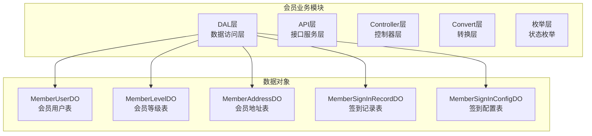
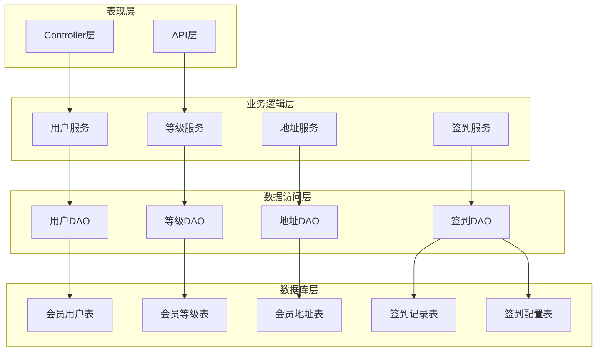
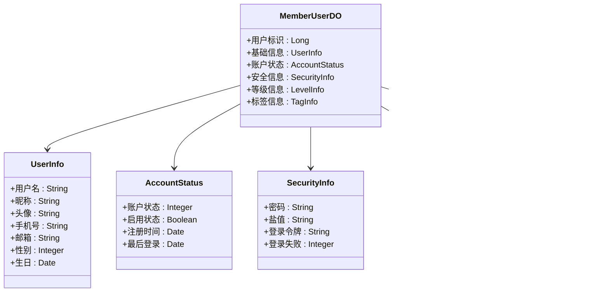
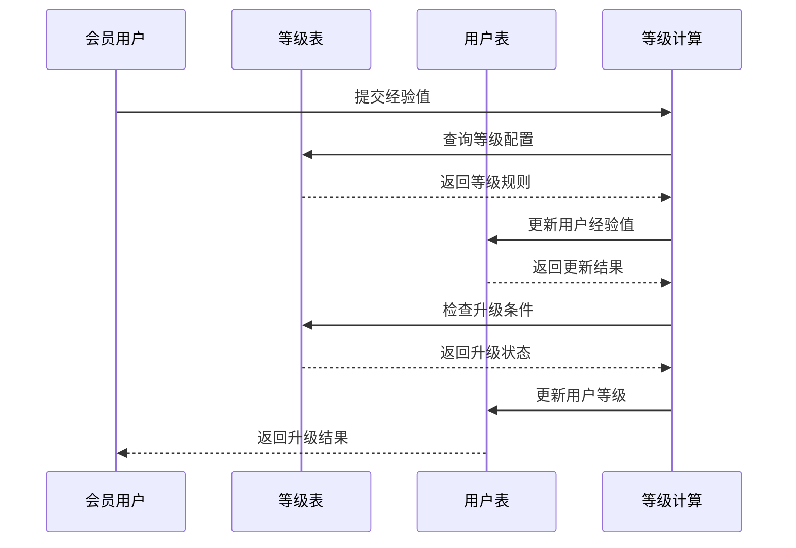
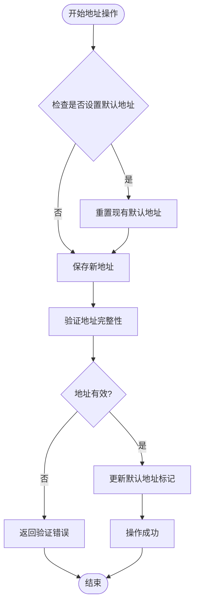
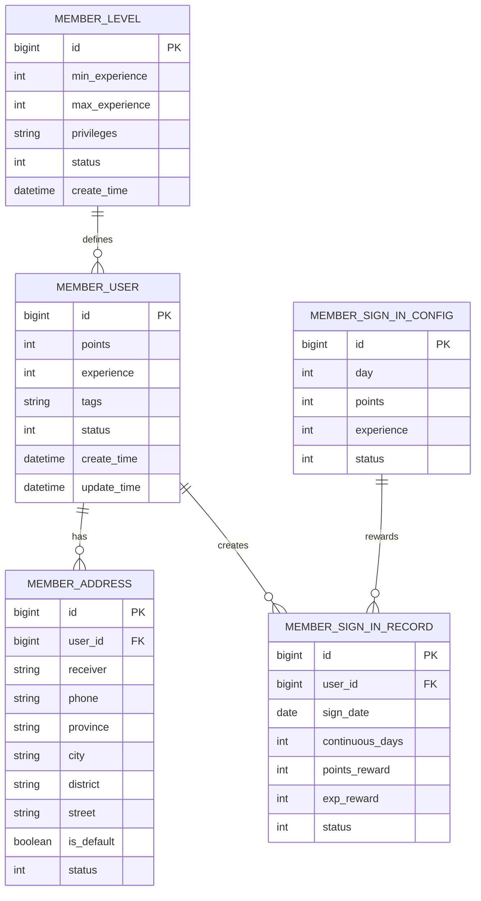
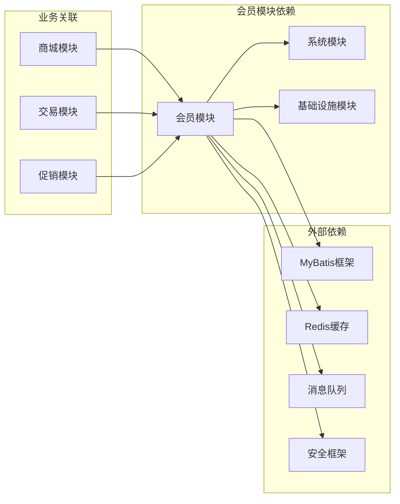

# 会员业务表设计

<cite>
**本文档引用的文件**
- [MemberUserDO.java](file://backend/yudao-module-member/src/main/java/cn/iocoder/yudao/module/member/dal/dataobject/user/MemberUserDO.java)
- [MemberLevelDO.java](file://backend/yudao-module-member/src/main/java/cn/iocoder/yudao/module/member/dal/dataobject/level/MemberLevelDO.java)
- [MemberAddressDO.java](file://backend/yudao-module-member/src/main/java/cn/iocoder/yudao/module/member/dal/dataobject/address/MemberAddressDO.java)
- [MemberSignInRecordDO.java](file://backend/yudao-module-member/src/main/java/cn/iocoder/yudao/module/member/dal/dataobject/signin/MemberSignInRecordDO.java)
- [MemberSignInConfigDO.java](file://backend/yudao-module-member/src/main/java/cn/iocoder/yudao/module/member/dal/dataobject/signin/MemberSignInConfigDO.java)
- [MemberUserApiImpl.java](file://backend/yudao-module-member/src/main/java/cn/iocoder/yudao/module/member/api/user/MemberUserApiImpl.java)
- [AddressController.java](file://backend/yudao-module-member/src/main/java/cn/iocoder/yudao/module/member/controller/admin/address/AddressController.java)
- [MemberLevelController.java](file://backend/yudao-module-member/src/main/java/cn/iocoder/yudao/module/member/controller/admin/level/MemberLevelController.java)
- [CommonStatusEnum.java](file://backend/yudao-framework/yudao-common/src/main/java/cn/iocoder/yudao/framework/common/enums/CommonStatusEnum.java)
</cite>

## 目录
1. [简介](#简介)
2. [项目结构](#项目结构)
3. [核心组件](#核心组件)
4. [架构概览](#架构概览)
5. [详细组件分析](#详细组件分析)
6. [依赖关系分析](#依赖关系分析)
7. [性能考虑](#性能考虑)
8. [故障排除指南](#故障排除指南)
9. [结论](#结论)

## 简介

本文件详细阐述了AgenticCPS项目中会员业务的核心数据库表设计，包括会员用户表(MemberUserDO)、会员等级表(MemberLevelDO)、会员地址表(MemberAddressDO)、签到记录表(MemberSignInRecordDO)等关键数据结构。文档重点说明了用户信息字段的组织方式、等级系统的数据库实现、地址管理的设计思路，以及会员积分、经验值和标签体系的存储策略。

## 项目结构

会员业务模块位于后端项目的yudao-module-member目录下，采用标准的分层架构设计：

**图表来源**
- [MemberUserDO.java:1-150](file://backend/yudao-module-member/src/main/java/cn/iocoder/yudao/module/member/dal/dataobject/user/MemberUserDO.java#L1-L150)
- [MemberLevelDO.java:1-200](file://backend/yudao-module-member/src/main/java/cn/iocoder/yudao/module/member/dal/dataobject/level/MemberLevelDO.java#L1-L200)

**章节来源**
- [MemberUserDO.java:1-150](file://backend/yudao-module-member/src/main/java/cn/iocoder/yudao/module/member/dal/dataobject/user/MemberUserDO.java#L1-L150)
- [MemberLevelDO.java:1-200](file://backend/yudao-module-member/src/main/java/cn/iocoder/yudao/module/member/dal/dataobject/level/MemberLevelDO.java#L1-L200)

## 核心组件

### 会员用户表(MemberUserDO)

会员用户表是会员业务的核心数据结构，负责存储会员的基本信息、状态管理和账户安全控制。

**用户基本信息字段**
- 用户标识：唯一用户ID，作为主键使用
- 基础信息：用户名、昵称、头像、手机号、邮箱等
- 身份信息：性别、生日、身份证号等
- 地址关联：默认地址ID，建立与地址表的关联关系

**账户状态字段**
- 账户状态：启用/禁用状态，通过CommonStatusEnum枚举控制
- 登录状态：最后登录时间、登录失败次数等
- 安全控制：密码、盐值、登录令牌等安全相关字段

**会员等级字段**
- 等级标识：当前等级ID，关联等级表
- 等级进度：经验值、等级进度条等
- 权益标识：各类会员权益的状态标记

**标签体系字段**
- 标签分类：多个标签字段，支持多维标签管理
- 标签组合：标签组合查询和筛选功能

**章节来源**
- [MemberUserDO.java:1-150](file://backend/yudao-module-member/src/main/java/cn/iocoder/yudao/module/member/dal/dataobject/user/MemberUserDO.java#L1-L150)

### 会员等级表(MemberLevelDO)

会员等级表定义了完整的等级体系，包括等级配置、升级条件和权益关联。

**等级配置字段**
- 等级标识：等级ID，主键
- 等级名称：等级显示名称
- 等级描述：等级详细说明
- 等级图标：等级对应的图标或样式

**升级条件字段**
- 经验值门槛：升级所需的最低经验值
- 积分门槛：升级所需的最低积分
- 消费金额：累计消费达到指定金额
- 活跃度要求：指定周期内的活跃行为

**权益关联字段**
- 权益列表：该等级享有的所有权益
- 折扣设置：商品购买折扣率
- 专属活动：专属参与活动权限
- 优先服务：客服优先、物流优先等特权

**状态控制字段**
- 等级状态：启用/停用状态
- 显示顺序：等级在界面中的排序
- 创建时间：等级配置的创建和更新时间

**章节来源**
- [MemberLevelDO.java:1-200](file://backend/yudao-module-member/src/main/java/cn/iocoder/yudao/module/member/dal/dataobject/level/MemberLevelDO.java#L1-L200)

### 会员地址表(MemberAddressDO)

会员地址表负责管理会员的收货地址信息，支持多地址管理和默认地址设置。

**地址基本信息**
- 地址标识：地址ID，主键
- 收货人：收货人姓名
- 手机号码：收货人联系电话
- 地址详情：省市区完整地址

**省市区字段设计**
- 省份字段：省级行政区划标识
- 城市字段：地级市标识
- 区县字段：区县级行政区划标识
- 街道字段：详细街道地址

**默认地址标记**
- 默认地址：布尔字段标识是否为默认地址
- 更新时间：默认地址变更的时间戳
- 地址状态：有效/无效状态控制

**地址历史记录**
- 历史版本：地址变更的历史记录
- 使用统计：地址使用的频率统计
- 地址验证：地址有效性验证状态

**章节来源**
- [MemberAddressDO.java](file://backend/yudao-module-member/src/main/java/cn/iocoder/yudao/module/member/dal/dataobject/address/MemberAddressDO.java)

### 签到记录表(MemberSignInRecordDO)

签到记录表专门用于记录会员的签到行为和奖励发放情况。

**签到基本信息**
- 记录标识：签到记录ID
- 用户标识：关联的会员用户ID
- 签到日期：具体的签到日期
- 连续天数：当前连续签到天数

**奖励记录字段**
- 积分奖励：本次签到获得的积分
- 经验奖励：本次签到获得的经验值
- 奖励类型：奖励的类型标识

**签到状态字段**
- 签到状态：已签到、已补签、未签到等状态
- 补签标记：是否为补签行为
- 签到时间：实际签到的具体时间

**章节来源**
- [MemberSignInRecordDO.java:1-46](file://backend/yudao-module-member/src/main/java/cn/iocoder/yudao/module/member/dal/dataobject/signin/MemberSignInRecordDO.java#L1-L46)

### 签到配置表(MemberSignInConfigDO)

签到配置表定义了签到系统的奖励规则和配置参数。

**配置规则字段**
- 规则标识：配置ID，主键
- 连续天数：第几天签到的标识
- 奖励积分：对应天数的积分奖励
- 奖励经验：对应天数的经验奖励

**状态控制字段**
- 配置状态：启用/停用状态
- 适用范围：配置适用的会员等级范围
- 生效时间：配置的生效和失效时间

**章节来源**
- [MemberSignInConfigDO.java:1-50](file://backend/yudao-module-member/src/main/java/cn/iocoder/yudao/module/member/dal/dataobject/signin/MemberSignInConfigDO.java#L1-L50)

## 架构概览

会员业务采用分层架构设计，各层职责明确，耦合度低：

**图表来源**
- [MemberUserApiImpl.java:1-60](file://backend/yudao-module-member/src/main/java/cn/iocoder/yudao/module/member/api/user/MemberUserApiImpl.java#L1-L60)
- [AddressController.java:1-80](file://backend/yudao-module-member/src/main/java/cn/iocoder/yudao/module/member/controller/admin/address/AddressController.java#L1-L80)
- [MemberLevelController.java:1-80](file://backend/yudao-module-member/src/main/java/cn/iocoder/yudao/module/member/controller/admin/level/MemberLevelController.java#L1-L80)

## 详细组件分析

### 用户信息字段组织方式

会员用户表采用了模块化的字段组织方式，将相关信息按功能分组：

**图表来源**
- [MemberUserDO.java:1-150](file://backend/yudao-module-member/src/main/java/cn/iocoder/yudao/module/member/dal/dataobject/user/MemberUserDO.java#L1-L150)

### 等级系统的数据库实现

等级系统通过等级表和用户表的关联实现了完整的等级管理体系：

**图表来源**
- [MemberLevelDO.java:1-200](file://backend/yudao-module-member/src/main/java/cn/iocoder/yudao/module/member/dal/dataobject/level/MemberLevelDO.java#L1-L200)
- [MemberUserDO.java:1-150](file://backend/yudao-module-member/src/main/java/cn/iocoder/yudao/module/member/dal/dataobject/user/MemberUserDO.java#L1-L150)

### 地址管理的数据库设计

地址管理设计支持多地址存储和默认地址切换：

**图表来源**
- [MemberAddressDO.java](file://backend/yudao-module-member/src/main/java/cn/iocoder/yudao/module/member/dal/dataobject/address/MemberAddressDO.java)

### 会员积分、经验值和标签体系

会员积分和经验值通过用户表进行统一管理，标签体系支持灵活的多维标签：

**图表来源**
- [MemberUserDO.java:1-150](file://backend/yudao-module-member/src/main/java/cn/iocoder/yudao/module/member/dal/dataobject/user/MemberUserDO.java#L1-L150)
- [MemberLevelDO.java:1-200](file://backend/yudao-module-member/src/main/java/cn/iocoder/yudao/module/member/dal/dataobject/level/MemberLevelDO.java#L1-L200)
- [MemberAddressDO.java](file://backend/yudao-module-member/src/main/java/cn/iocoder/yudao/module/member/dal/dataobject/address/MemberAddressDO.java)
- [MemberSignInRecordDO.java:1-46](file://backend/yudao-module-member/src/main/java/cn/iocoder/yudao/module/member/dal/dataobject/signin/MemberSignInRecordDO.java#L1-L46)
- [MemberSignInConfigDO.java:1-50](file://backend/yudao-module-member/src/main/java/cn/iocoder/yudao/module/member/dal/dataobject/signin/MemberSignInConfigDO.java#L1-L50)

**章节来源**
- [MemberUserDO.java:1-150](file://backend/yudao-module-member/src/main/java/cn/iocoder/yudao/module/member/dal/dataobject/user/MemberUserDO.java#L1-L150)
- [MemberLevelDO.java:1-200](file://backend/yudao-module-member/src/main/java/cn/iocoder/yudao/module/member/dal/dataobject/level/MemberLevelDO.java#L1-L200)

## 依赖关系分析

会员业务模块与其他模块存在紧密的依赖关系：

**图表来源**
- [MemberUserApiImpl.java:1-60](file://backend/yudao-module-member/src/main/java/cn/iocoder/yudao/module/member/api/user/MemberUserApiImpl.java#L1-L60)
- [AddressController.java:1-80](file://backend/yudao-module-member/src/main/java/cn/iocoder/yudao/module/member/controller/admin/address/AddressController.java#L1-L80)
- [MemberLevelController.java:1-80](file://backend/yudao-module-member/src/main/java/cn/iocoder/yudao/module/member/controller/admin/level/MemberLevelController.java#L1-L80)

**章节来源**
- [MemberUserApiImpl.java:1-60](file://backend/yudao-module-member/src/main/java/cn/iocoder/yudao/module/member/api/user/MemberUserApiImpl.java#L1-L60)
- [AddressController.java:1-80](file://backend/yudao-module-member/src/main/java/cn/iocoder/yudao/module/member/controller/admin/address/AddressController.java#L1-L80)
- [MemberLevelController.java:1-80](file://backend/yudao-module-member/src/main/java/cn/iocoder/yudao/module/member/controller/admin/level/MemberLevelController.java#L1-L80)

## 性能考虑

### 索引优化策略
- 主键索引：所有表的主键自动建立索引
- 常用查询字段：用户ID、等级ID、状态字段建立索引
- 复合索引：常用查询组合建立复合索引
- 唯一索引：用户名、手机号等唯一性字段

### 查询优化建议
- 分页查询：大数据量时使用分页查询
- 索引选择：合理使用索引避免全表扫描
- 缓存策略：热点数据使用Redis缓存
- 批量操作：批量插入和更新提高效率

### 存储优化
- 字段长度：合理设置字段长度避免浪费
- 空间回收：定期清理无效数据
- 分表分库：大数据量时考虑水平分表

## 故障排除指南

### 常见问题及解决方案

**用户状态异常**
- 问题：用户无法登录
- 排查：检查用户状态字段、密码验证、登录失败次数
- 解决：重置密码、恢复用户状态

**等级升级失败**
- 问题：经验值达到要求但未升级
- 排查：检查经验值计算、等级配置、升级条件
- 解决：修正经验值、调整等级配置

**地址管理问题**
- 问题：默认地址设置异常
- 排查：检查默认地址标记、地址状态、用户关联
- 解决：重置默认地址、修复地址状态

**签到奖励异常**
- 问题：签到奖励未到账
- 排查：检查签到记录、奖励配置、用户状态
- 解决：手动发放奖励、修复配置

**章节来源**
- [CommonStatusEnum.java](file://backend/yudao-framework/yudao-common/src/main/java/cn/iocoder/yudao/framework/common/enums/CommonStatusEnum.java)

## 结论

会员业务表设计遵循了清晰的分层架构和模块化设计理念，通过合理的数据结构设计和完善的字段组织，实现了会员管理的核心功能需求。系统支持完整的会员生命周期管理，包括用户信息管理、等级体系建设、地址管理和签到奖励等功能。同时，通过状态枚举和权限控制确保了系统的安全性和稳定性。

未来可以考虑以下优化方向：
- 增加更多的标签维度支持
- 优化大数据量场景下的查询性能
- 扩展更多会员权益和活动类型
- 加强数据备份和恢复机制