# 商品订单表设计

<cite>
**本文档引用的文件**
- [create_tables.sql](file://backend/yudao-module-mall/yudao-module-trade/src/test/resources/sql/create_tables.sql)
- [product_spu_sku.sql](file://backend/yudao-module-mall/yudao-module-product/src/test/resources/sql/create_tables.sql)
- [promotion_coupon.sql](file://backend/yudao-module-mall/yudao-module-promotion/src/test/resources/sql/create_tables.sql)
- [CartDO.java](file://backend/yudao-module-mall/yudao-module-trade/src/main/java/cn/iocoder/yudao/module/trade/dal/dataobject/cart/CartDO.java)
- [CartService.java](file://backend/yudao-module-mall/yudao-module-trade/src/main/java/cn/iocoder/yudao/module/trade/service/cart/CartService.java)
- [AppCartController.java](file://backend/yudao-module-mall/yudao-module-trade/src/main/java/cn/iocoder/yudao/module/trade/controller/app/cart/AppCartController.java)
- [cart.js](file://frontend/mall-uniapp/sheep/store/cart.js)
- [confirm.vue](file://frontend/mall-uniapp/pages/order/confirm.vue)
- [s-discount-list.vue](file://frontend/mall-uniapp/sheep/components/s-discount-list/s-discount-list.vue)
</cite>

## 目录
1. [项目概述](#项目概述)
2. [项目结构](#项目结构)
3. [核心业务表设计](#核心业务表设计)
4. [架构概览](#架构概览)
5. [详细组件分析](#详细组件分析)
6. [依赖关系分析](#依赖关系分析)
7. [性能考虑](#性能考虑)
8. [故障排除指南](#故障排除指南)
9. [结论](#结论)

## 项目概述

AgenticCPS是一个基于芋道商城系统的电商订单管理平台，专注于商品订单表的设计与实现。该系统采用前后端分离架构，后端使用Java Spring Boot框架，前端使用UniApp开发，实现了完整的商品管理、订单处理、购物车管理和促销活动等功能。

本项目的核心目标是设计一套高效、可靠的订单管理系统，支持商品信息管理、订单状态流转、库存扣减策略、价格计算规则和优惠券使用逻辑等核心业务功能。

## 项目结构

系统采用模块化架构设计，主要包含以下核心模块：

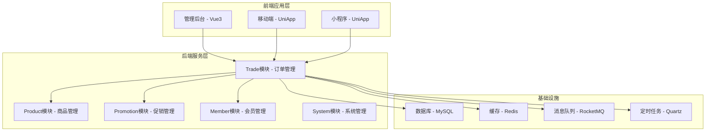

**图表来源**
- [AppCartController.java:21-27](file://backend/yudao-module-mall/yudao-module-trade/src/main/java/cn/iocoder/yudao/module/trade/controller/app/cart/AppCartController.java#L21-L27)
- [CartDO.java:8-18](file://backend/yudao-module-mall/yudao-module-trade/src/main/java/cn/iocoder/yudao/module/trade/dal/dataobject/cart/CartDO.java#L8-L18)

**章节来源**
- [AppCartController.java:1-80](file://backend/yudao-module-mall/yudao-module-trade/src/main/java/cn/iocoder/yudao/module/trade/controller/app/cart/AppCartController.java#L1-L80)
- [CartService.java:1-87](file://backend/yudao-module-mall/yudao-module-trade/src/main/java/cn/iocoder/yudao/module/trade/service/cart/CartService.java#L1-L87)

## 核心业务表设计

### 商品表结构设计

系统采用SPU+SKU的两级商品模型设计，实现了商品信息的灵活管理：

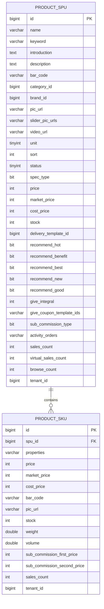

**图表来源**
- [product_spu_sku.sql:25-65](file://backend/yudao-module-mall/yudao-module-product/src/test/resources/sql/create_tables.sql#L25-L65)
- [product_spu_sku.sql:1-23](file://backend/yudao-module-mall/yudao-module-product/src/test/resources/sql/create_tables.sql#L1-L23)

### 订单表结构设计

订单系统采用标准化的订单表设计，支持完整的订单生命周期管理：

```mermaid
erDiagram
TRADE_ORDER {
bigint id PK
varchar no
int type
int terminal
bigint user_id
varchar user_ip
varchar user_remark
int status
int product_count
int cancel_type
varchar remark
boolean comment_status
bigint brokerage_user_id
bit pay_status
datetime pay_time
datetime finish_time
datetime cancel_time
int total_price
int order_price
int discount_price
int delivery_price
int adjust_price
int pay_price
int delivery_type
bigint pay_order_id
varchar pay_channel_code
bigint delivery_template_id
bigint logistics_id
varchar logistics_no
datetime delivery_time
datetime receive_time
varchar receiver_name
varchar receiver_mobile
int receiver_area_id
int receiver_post_code
varchar receiver_detail_address
long pick_up_store_id
varchar pick_up_verify_code
int refund_status
int refund_price
int after_sale_status
bigint coupon_id
int coupon_price
int use_point
int point_price
int give_point
int refund_point
int vip_price
varchar give_coupons_map
long seckill_activity_id
long bargain_activity_id
long bargain_record_id
long combination_activity_id
long combination_head_id
long combination_record_id
}
TRADE_ORDER_ITEM {
bigint id PK
bigint user_id
bigint order_id FK
int cart_id
bigint spu_id
varchar spu_name
bigint sku_id
varchar properties
varchar pic_url
int count
boolean comment_status
int price
int discount_price
int delivery_price
int adjust_price
int pay_price
int coupon_price
int point_price
int use_point
int give_point
int vip_price
long after_sale_id
int after_sale_status
}
TRADE_ORDER ||--o{ TRADE_ORDER_ITEM : contains
```

**图表来源**
- [create_tables.sql:1-64](file://backend/yudao-module-mall/yudao-module-trade/src/test/resources/sql/create_tables.sql#L1-L64)
- [create_tables.sql:66-97](file://backend/yudao-module-mall/yudao-module-trade/src/test/resources/sql/create_tables.sql#L66-L97)

### 购物车表结构设计

购物车系统采用简化的数据结构设计，专注于核心购物车功能：

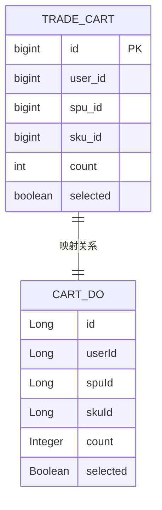

**图表来源**
- [CartDO.java:15-57](file://backend/yudao-module-mall/yudao-module-trade/src/main/java/cn/iocoder/yudao/module/trade/dal/dataobject/cart/CartDO.java#L15-L57)

**章节来源**
- [product_spu_sku.sql:1-157](file://backend/yudao-module-mall/yudao-module-product/src/test/resources/sql/create_tables.sql#L1-L157)
- [create_tables.sql:1-235](file://backend/yudao-module-mall/yudao-module-trade/src/test/resources/sql/create_tables.sql#L1-L235)
- [CartDO.java:1-58](file://backend/yudao-module-mall/yudao-module-trade/src/main/java/cn/iocoder/yudao/module/trade/dal/dataobject/cart/CartDO.java#L1-L58)

## 架构概览

系统采用分层架构设计，实现了清晰的职责分离和良好的扩展性：

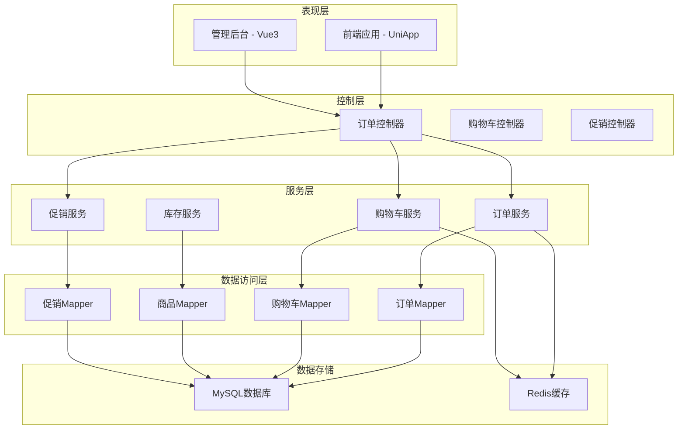

**图表来源**
- [AppCartController.java:21-36](file://backend/yudao-module-mall/yudao-module-trade/src/main/java/cn/iocoder/yudao/module/trade/controller/app/cart/AppCartController.java#L21-L36)
- [CartService.java:16-86](file://backend/yudao-module-mall/yudao-module-trade/src/main/java/cn/iocoder/yudao/module/trade/service/cart/CartService.java#L16-L86)

**章节来源**
- [AppCartController.java:1-80](file://backend/yudao-module-mall/yudao-module-trade/src/main/java/cn/iocoder/yudao/module/trade/controller/app/cart/AppCartController.java#L1-L80)
- [CartService.java:1-87](file://backend/yudao-module-mall/yudao-module-trade/src/main/java/cn/iocoder/yudao/module/trade/service/cart/CartService.java#L1-L87)

## 详细组件分析

### 订单状态机设计

订单状态机实现了完整的订单生命周期管理，支持多种状态转换：

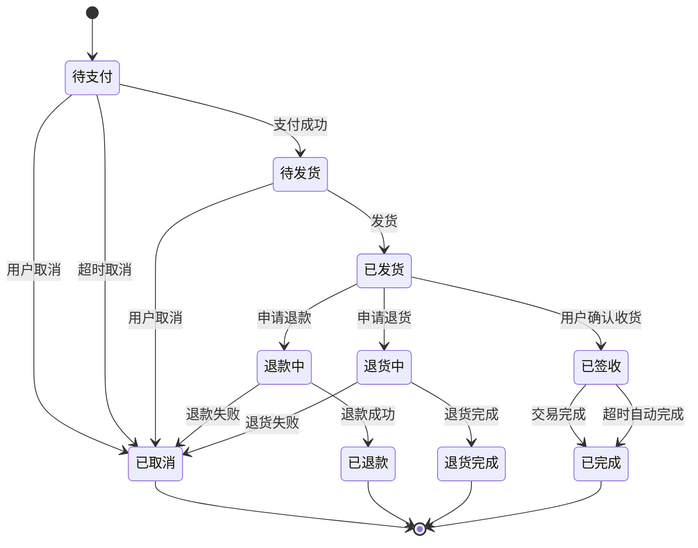

**图表来源**
- [create_tables.sql:10-11](file://backend/yudao-module-mall/yudao-module-trade/src/test/resources/sql/create_tables.sql#L10-L11)

### 库存扣减策略

系统实现了多种库存扣减策略，确保库存数据的一致性和准确性：

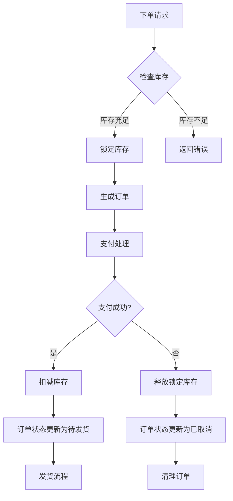

**图表来源**
- [create_tables.sql:20-25](file://backend/yudao-module-mall/yudao-module-trade/src/test/resources/sql/create_tables.sql#L20-L25)

### 价格计算规则

价格计算系统支持多种优惠策略的组合计算：

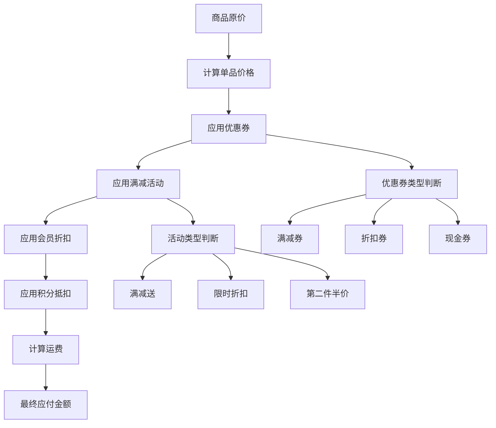

**图表来源**
- [create_tables.sql:22-25](file://backend/yudao-module-mall/yudao-module-trade/src/test/resources/sql/create_tables.sql#L22-L25)

### 优惠券使用逻辑

优惠券系统实现了灵活的优惠券管理和使用机制：

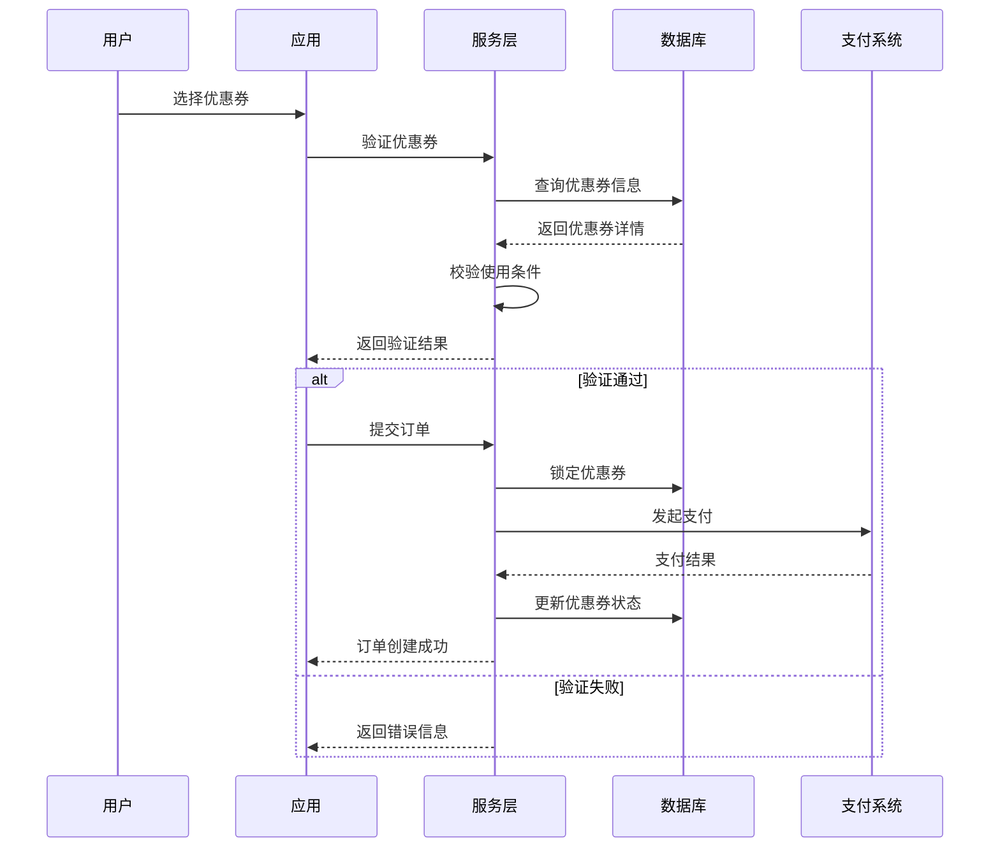

**图表来源**
- [promotion_coupon.sql:22-77](file://backend/yudao-module-mall/yudao-module-promotion/src/test/resources/sql/create_tables.sql#L22-L77)

**章节来源**
- [promotion_coupon.sql:1-256](file://backend/yudao-module-mall/yudao-module-promotion/src/test/resources/sql/create_tables.sql#L1-L256)

## 依赖关系分析

系统各模块之间的依赖关系清晰明确，遵循了依赖倒置原则：

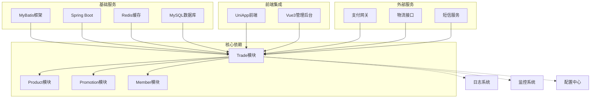

**图表来源**
- [CartService.java:1-10](file://backend/yudao-module-mall/yudao-module-trade/src/main/java/cn/iocoder/yudao/module/trade/service/cart/CartService.java#L1-L10)

**章节来源**
- [CartService.java:1-87](file://backend/yudao-module-mall/yudao-module-trade/src/main/java/cn/iocoder/yudao/module/trade/service/cart/CartService.java#L1-L87)

## 性能考虑

### 数据库性能优化

系统采用了多项数据库性能优化策略：

1. **索引优化**：为常用查询字段建立合适的索引
2. **分表分库**：按时间维度进行数据分片
3. **缓存策略**：使用Redis缓存热点数据
4. **批量操作**：减少数据库交互次数

### 前端性能优化

前端应用采用了多种性能优化技术：

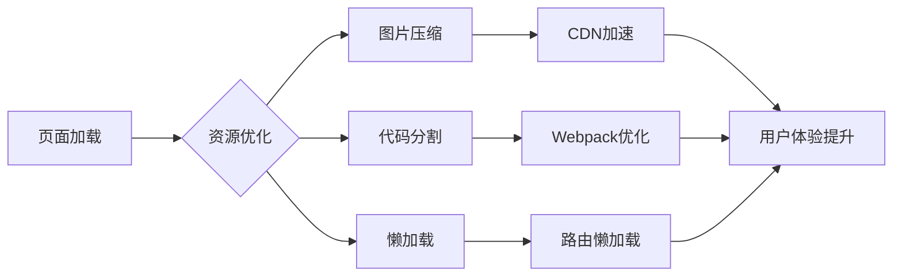

### 缓存策略

系统实现了多层次的缓存策略：

1. **Redis缓存**：缓存商品信息、用户信息、订单状态
2. **本地缓存**：浏览器本地存储常用数据
3. **数据库缓存**：MySQL查询缓存优化

**章节来源**
- [cart.js:1-45](file://frontend/mall-uniapp/sheep/store/cart.js#L1-L45)

## 故障排除指南

### 常见问题诊断

1. **订单状态异常**
   - 检查订单状态转换逻辑
   - 验证异步任务执行情况
   - 查看订单状态变更日志

2. **库存扣减失败**
   - 检查库存锁定机制
   - 验证并发控制策略
   - 查看库存扣减日志

3. **支付回调异常**
   - 检查支付网关配置
   - 验证回调签名验证
   - 查看支付流水记录

### 性能问题排查

1. **数据库慢查询**
   - 分析SQL执行计划
   - 检查索引使用情况
   - 优化查询语句

2. **接口响应缓慢**
   - 监控接口耗时
   - 检查缓存命中率
   - 分析线程池使用情况

**章节来源**
- [confirm.vue:129-162](file://frontend/mall-uniapp/pages/order/confirm.vue#L129-L162)
- [s-discount-list.vue:1-50](file://frontend/mall-uniapp/sheep/components/s-discount-list/s-discount-list.vue#L1-L50)

## 结论

AgenticCPS商品订单表设计实现了以下核心目标：

1. **完整的业务覆盖**：涵盖了商品管理、订单处理、购物车、促销活动等核心业务
2. **高可用性设计**：采用分布式架构，支持水平扩展和高并发处理
3. **灵活的扩展性**：模块化设计便于功能扩展和维护
4. **优秀的性能表现**：通过缓存、索引、分库分表等技术保证系统性能
5. **完善的监控体系**：提供了全面的日志记录和监控能力

该设计方案为电商系统的稳定运行提供了坚实的技术基础，能够满足大规模业务场景的需求。通过持续的优化和改进，系统将继续提升用户体验和业务效率。