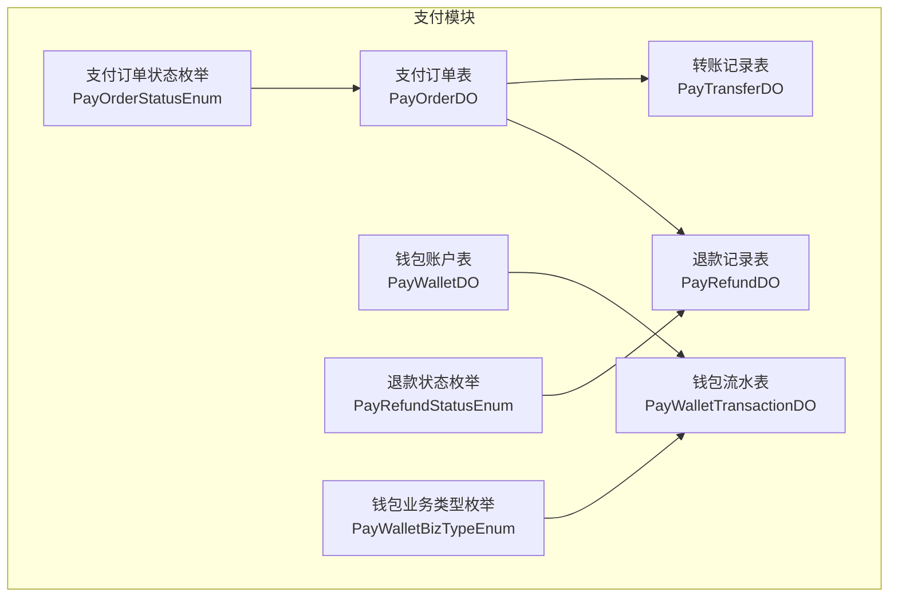
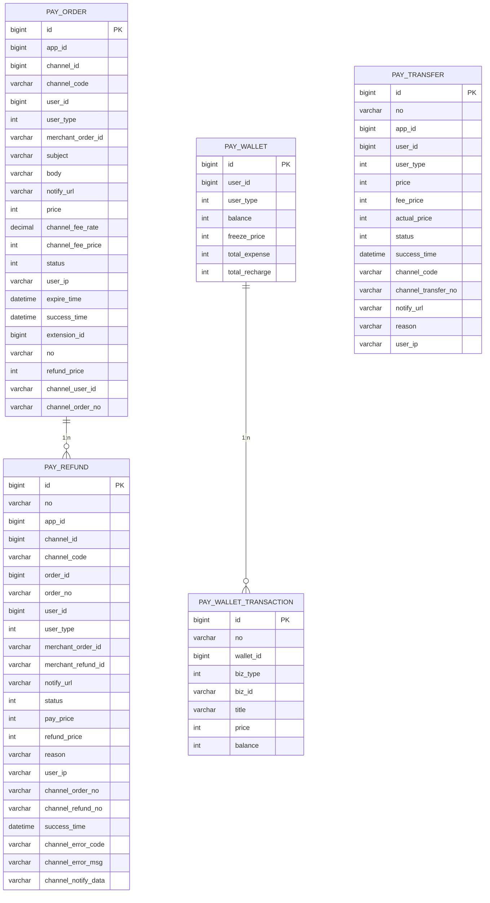
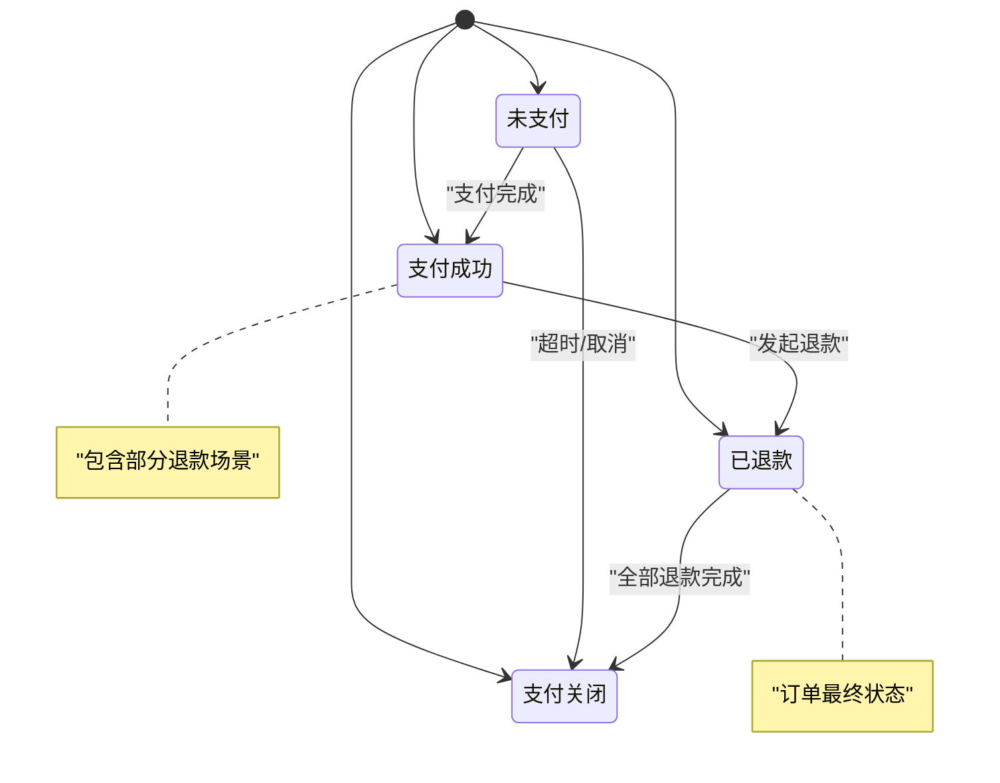
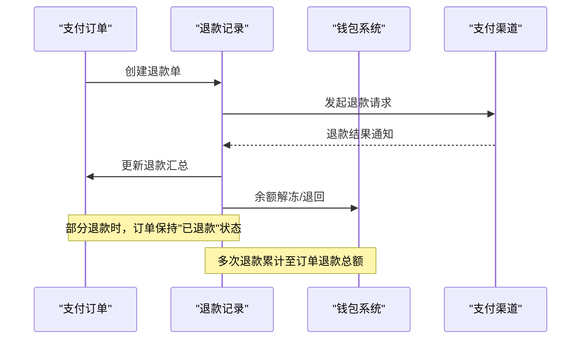
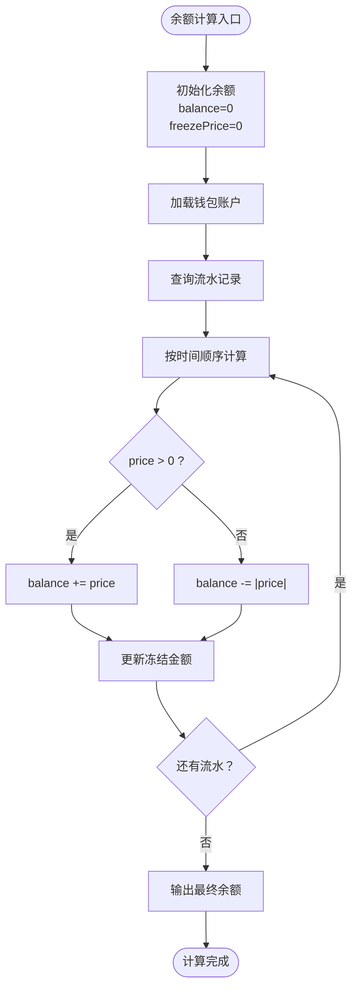
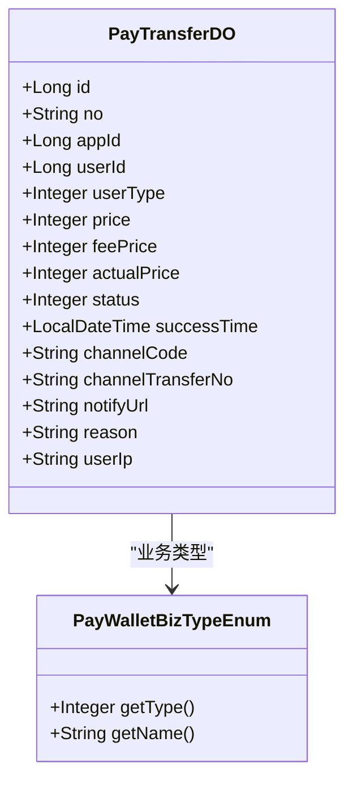
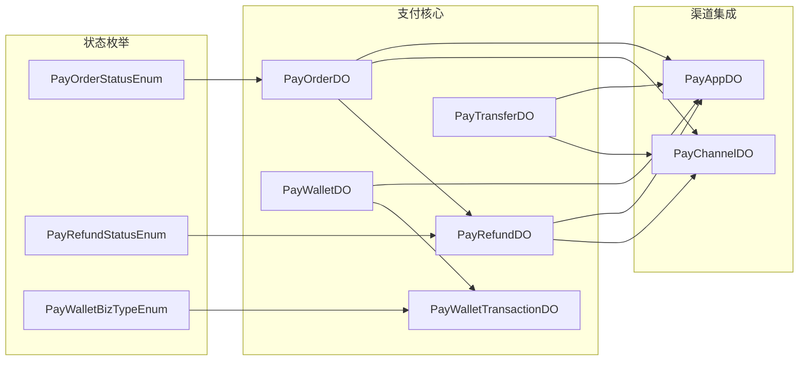
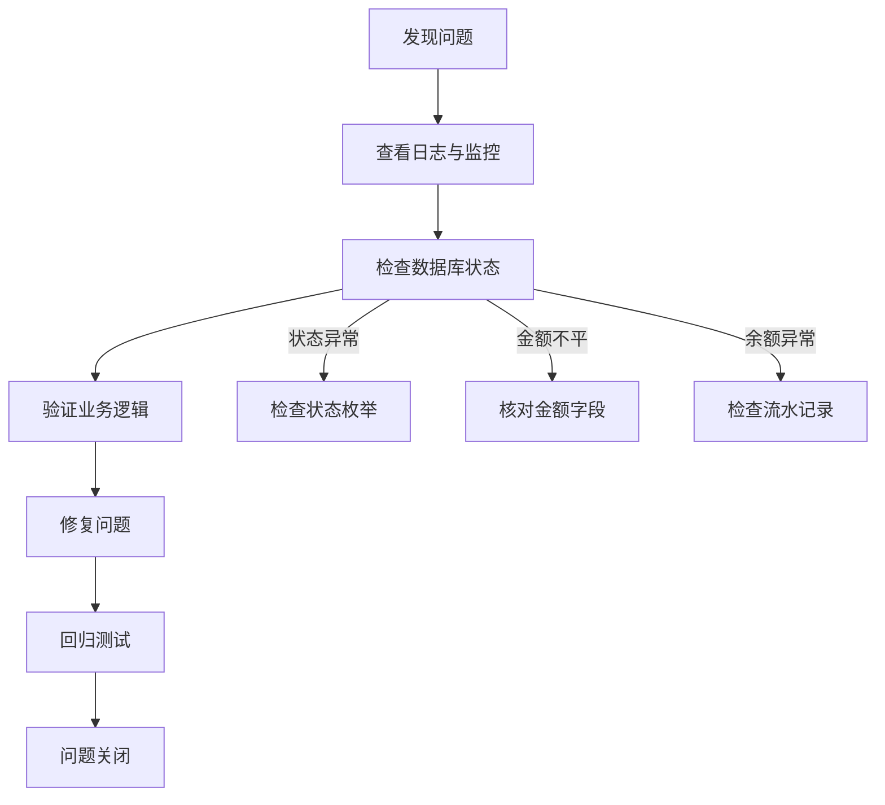

# 支付业务表设计

<cite>
**本文档引用的文件**
- [PayOrderDO.java](file://backend/yudao-module-pay/src/main/java/cn/iocoder/yudao/module/pay/dal/dataobject/order/PayOrderDO.java)
- [PayRefundDO.java](file://backend/yudao-module-pay/src/main/java/cn/iocoder/yudao/module/pay/dal/dataobject/refund/PayRefundDO.java)
- [PayWalletDO.java](file://backend/yudao-module-pay/src/main/java/cn/iocoder/yudao/module/pay/dal/dataobject/wallet/PayWalletDO.java)
- [PayWalletTransactionDO.java](file://backend/yudao-module-pay/src/main/java/cn/iocoder/yudao/module/pay/dal/dataobject/wallet/PayWalletTransactionDO.java)
- [PayOrderStatusEnum.java](file://backend/yudao-module-pay/src/main/java/cn/iocoder/yudao/module/pay/enums/order/PayOrderStatusEnum.java)
- [PayRefundStatusEnum.java](file://backend/yudao-module-pay/src/main/java/cn/iocoder/yudao/module/pay/enums/refund/PayRefundStatusEnum.java)
- [PayWalletBizTypeEnum.java](file://backend/yudao-module-pay/src/main/java/cn/iocoder/yudao/module/pay/enums/wallet/PayWalletBizTypeEnum.java)
- [PayTransferDO.java](file://backend/yudao-module-pay/src/main/java/cn/iocoder/yudao/module/pay/dal/dataobject/transfer/PayTransferDO.java)
</cite>

## 目录
1. [引言](#引言)
2. [项目结构](#项目结构)
3. [核心组件](#核心组件)
4. [架构概览](#架构概览)
5. [详细组件分析](#详细组件分析)
6. [依赖关系分析](#依赖关系分析)
7. [性能考虑](#性能考虑)
8. [故障排除指南](#故障排除指南)
9. [结论](#结论)

## 引言

本文件专注于支付业务的核心数据表设计，涵盖支付订单、退款记录、钱包账户及钱包流水等关键实体。通过对各表字段设计、状态管理机制、业务流程映射进行深入解析，帮助开发者和产品人员全面理解支付系统的数据模型与实现细节。

## 项目结构

支付模块采用清晰的分层结构，围绕支付订单、退款、钱包、转账四大核心领域构建：

**图表来源**
- [PayOrderDO.java:19-147](file://backend/yudao-module-pay/src/main/java/cn/iocoder/yudao/module/pay/dal/dataobject/order/PayOrderDO.java#L19-L147)
- [PayRefundDO.java:25-169](file://backend/yudao-module-pay/src/main/java/cn/iocoder/yudao/module/pay/dal/dataobject/refund/PayRefundDO.java#L25-L169)
- [PayWalletDO.java:15-59](file://backend/yudao-module-pay/src/main/java/cn/iocoder/yudao/module/pay/dal/dataobject/wallet/PayWalletDO.java#L15-L59)
- [PayWalletTransactionDO.java:15-66](file://backend/yudao-module-pay/src/main/java/cn/iocoder/yudao/module/pay/dal/dataobject/wallet/PayWalletTransactionDO.java#L15-L66)
- [PayTransferDO.java](file://backend/yudao-module-pay/src/main/java/cn/iocoder/yudao/module/pay/dal/dataobject/transfer/PayTransferDO.java)

**章节来源**
- [PayOrderDO.java:1-148](file://backend/yudao-module-pay/src/main/java/cn/iocoder/yudao/module/pay/dal/dataobject/order/PayOrderDO.java#L1-L148)
- [PayRefundDO.java:1-170](file://backend/yudao-module-pay/src/main/java/cn/iocoder/yudao/module/pay/dal/dataobject/refund/PayRefundDO.java#L1-L170)
- [PayWalletDO.java:1-60](file://backend/yudao-module-pay/src/main/java/cn/iocoder/yudao/module/pay/dal/dataobject/wallet/PayWalletDO.java#L1-L60)
- [PayWalletTransactionDO.java:1-67](file://backend/yudao-module-pay/src/main/java/cn/iocoder/yudao/module/pay/dal/dataobject/wallet/PayWalletTransactionDO.java#L1-L67)

## 核心组件

### 支付订单表 PayOrderDO

支付订单表是支付流程的核心载体，记录从下单到支付完成的完整生命周期信息。其关键字段设计如下：

- **基础标识字段**
  - `id`: 数据库自增主键
  - `merchantOrderId`: 商户订单号，确保在应用维度唯一
  - `appId`: 应用编号，关联应用配置
  - `userId/userType`: 用户标识与类型

- **商品与通知字段**
  - `subject/body`: 商品标题与描述
  - `notifyUrl`: 异步通知地址

- **金额与费用字段**
  - `price`: 支付金额（分）
  - `channelFeeRate`: 渠道手续费率（百分比）
  - `channelFeePrice`: 渠道手续费金额（分）

- **状态与时间字段**
  - `status`: 支付状态（枚举）
  - `expireTime`: 订单失效时间
  - `successTime`: 支付成功时间
  - `extensionId/no`: 成功扩展记录与外部订单号

- **退款聚合字段**
  - `refundPrice`: 退款总金额（分）

- **渠道交互字段**
  - `channelId/channelCode`: 渠道编号与编码
  - `channelUserId`: 渠道用户标识（如微信openId、支付宝账号）
  - `channelOrderNo`: 渠道订单号

**章节来源**
- [PayOrderDO.java:27-147](file://backend/yudao-module-pay/src/main/java/cn/iocoder/yudao/module/pay/dal/dataobject/order/PayOrderDO.java#L27-L147)

### 退款记录表 PayRefundDO

退款记录表用于追踪每笔支付订单的退款明细，支持部分退款与多次退款场景：

- **退款标识字段**
  - `id`: 数据库自增主键
  - `no`: 外部退款号（规则生成，对接支付渠道）

- **关联关系字段**
  - `orderId/orderNo`: 关联的支付订单编号与外部订单号
  - `appId/channelId/channelCode`: 应用与渠道信息
  - `userId/userType`: 用户标识

- **商户与通知字段**
  - `merchantOrderId/merchantRefundId`: 商户订单与退款单号
  - `notifyUrl`: 异步通知地址

- **金额与状态字段**
  - `payPrice`: 支付金额（分）
  - `refundPrice`: 退款金额（分）
  - `status`: 退款状态（枚举）

- **业务信息字段**
  - `reason`: 退款原因
  - `userIp`: 用户IP

- **渠道交互字段**
  - `channelOrderNo`: 渠道订单号（冗余）
  - `channelRefundNo`: 渠道退款单号（如微信refund_id）
  - `successTime`: 退款成功时间

- **错误与通知字段**
  - `channelErrorCode/channelErrorMsg`: 渠道错误信息
  - `channelNotifyData`: 渠道通知原始数据

**章节来源**
- [PayRefundDO.java:33-169](file://backend/yudao-module-pay/src/main/java/cn/iocoder/yudao/module/pay/dal/dataobject/refund/PayRefundDO.java#L33-L169)

### 钱包账户表 PayWalletDO

钱包账户表记录用户的虚拟账户余额与相关统计信息：

- **账户标识字段**
  - `id`: 主键
  - `userId/userType`: 用户标识与类型

- **余额字段**
  - `balance`: 当前余额（分）
  - `freezePrice`: 冻结金额（分）
  - `totalExpense`: 累计支出（分）
  - `totalRecharge`: 累计充值（分）

**章节来源**
- [PayWalletDO.java:18-59](file://backend/yudao-module-pay/src/main/java/cn/iocoder/yudao/module/pay/dal/dataobject/wallet/PayWalletDO.java#L18-L59)

### 钱包流水表 PayWalletTransactionDO

钱包流水表记录余额变动的完整轨迹，支持对账与审计：

- **流水标识字段**
  - `id`: 主键
  - `no`: 流水号

- **关联关系字段**
  - `walletId`: 关联的钱包账户
  - `bizType`: 业务类型（枚举）
  - `bizId`: 关联业务编号

- **交易信息字段**
  - `title`: 流水说明
  - `price`: 交易金额（分，正值增加，负值减少）
  - `balance`: 交易后余额（分）

**章节来源**
- [PayWalletTransactionDO.java:18-66](file://backend/yudao-module-pay/src/main/java/cn/iocoder/yudao/module/pay/dal/dataobject/wallet/PayWalletTransactionDO.java#L18-L66)

### 转账记录表 PayTransferDO

转账记录表用于记录跨账户转账的完整信息，支持转账状态跟踪与手续费处理：

- **转账标识字段**
  - `id`: 主键
  - `no`: 外部转账单号

- **关联关系字段**
  - `appId`: 应用编号
  - `userId/userType`: 用户标识与类型

- **金额与费用字段**
  - `price`: 转账金额（分）
  - `feePrice`: 手续费（分）
  - `actualPrice`: 实际到账金额（分）

- **状态与时间字段**
  - `status`: 转账状态（枚举）
  - `successTime`: 到账确认时间

- **渠道与通知字段**
  - `channelCode`: 渠道编码
  - `channelTransferNo`: 渠道转账单号
  - `notifyUrl`: 异步通知地址

- **业务信息字段**
  - `reason`: 转账原因
  - `userIp`: 用户IP

**章节来源**
- [PayTransferDO.java](file://backend/yudao-module-pay/src/main/java/cn/iocoder/yudao/module/pay/dal/dataobject/transfer/PayTransferDO.java)

## 架构概览

支付系统采用"订单-退款-钱包-转账"四核一体的数据架构，通过状态枚举与外键约束确保数据一致性：

**图表来源**
- [PayOrderDO.java:27-147](file://backend/yudao-module-pay/src/main/java/cn/iocoder/yudao/module/pay/dal/dataobject/order/PayOrderDO.java#L27-L147)
- [PayRefundDO.java:33-169](file://backend/yudao-module-pay/src/main/java/cn/iocoder/yudao/module/pay/dal/dataobject/refund/PayRefundDO.java#L33-L169)
- [PayWalletDO.java:18-59](file://backend/yudao-module-pay/src/main/java/cn/iocoder/yudao/module/pay/dal/dataobject/wallet/PayWalletDO.java#L18-L59)
- [PayWalletTransactionDO.java:18-66](file://backend/yudao-module-pay/src/main/java/cn/iocoder/yudao/module/pay/dal/dataobject/wallet/PayWalletTransactionDO.java#L18-L66)
- [PayTransferDO.java](file://backend/yudao-module-pay/src/main/java/cn/iocoder/yudao/module/pay/dal/dataobject/transfer/PayTransferDO.java)

## 详细组件分析

### 支付状态设计与转换规则

支付状态采用离散枚举值设计，确保状态转换的确定性与可追溯性：

**图表来源**
- [PayOrderStatusEnum.java:17-23](file://backend/yudao-module-pay/src/main/java/cn/iocoder/yudao/module/pay/enums/order/PayOrderStatusEnum.java#L17-L23)

状态枚举定义与判断方法：
- `WAITING(0)`: 未支付
- `SUCCESS(10)`: 支付成功
- `REFUND(20)`: 已退款
- `CLOSED(30)`: 支付关闭

提供状态判断工具方法，便于业务逻辑分支控制。

**章节来源**
- [PayOrderStatusEnum.java:15-84](file://backend/yudao-module-pay/src/main/java/cn/iocoder/yudao/module/pay/enums/order/PayOrderStatusEnum.java#L15-L84)

### 退款流程数据库实现

退款流程通过"订单-退款"一对多关系实现，支持部分退款与多次退款：

**图表来源**
- [PayOrderDO.java:129-133](file://backend/yudao-module-pay/src/main/java/cn/iocoder/yudao/module/pay/dal/dataobject/order/PayOrderDO.java#L129-L133)
- [PayRefundDO.java:107-122](file://backend/yudao-module-pay/src/main/java/cn/iocoder/yudao/module/pay/dal/dataobject/refund/PayRefundDO.java#L107-L122)

退款状态管理要点：
- 订单级`refundPrice`累计所有退款金额
- 退款单独立记录每次退款详情
- 支持"部分退款→已退款→支付关闭"的完整状态链

**章节来源**
- [PayRefundDO.java:107-169](file://backend/yudao-module-pay/src/main/java/cn/iocoder/yudao/module/pay/dal/dataobject/refund/PayRefundDO.java#L107-L169)

### 钱包系统数据模型

钱包系统采用"账户+流水"双表设计，确保余额准确性与可追溯性：

**图表来源**
- [PayWalletDO.java:40-48](file://backend/yudao-module-pay/src/main/java/cn/iocoder/yudao/module/pay/dal/dataobject/wallet/PayWalletDO.java#L40-L48)
- [PayWalletTransactionDO.java:55-65](file://backend/yudao-module-pay/src/main/java/cn/iocoder/yudao/module/pay/dal/dataobject/wallet/PayWalletTransactionDO.java#L55-L65)

余额计算逻辑：
- 可用余额 = 余额 - 冻结金额
- 余额字段为累计值，需通过流水逐条校验
- 冻结金额用于暂存待确认或被占用的资金

**章节来源**
- [PayWalletDO.java:40-57](file://backend/yudao-module-pay/src/main/java/cn/iocoder/yudao/module/pay/dal/dataobject/wallet/PayWalletDO.java#L40-L57)
- [PayWalletTransactionDO.java:55-66](file://backend/yudao-module-pay/src/main/java/cn/iocoder/yudao/module/pay/dal/dataobject/wallet/PayWalletTransactionDO.java#L55-L66)

### 转账打款数据库设计

转账功能通过独立记录表实现，支持手续费扣除与到账确认：

**图表来源**
- [PayTransferDO.java](file://backend/yudao-module-pay/src/main/java/cn/iocoder/yudao/module/pay/dal/dataobject/transfer/PayTransferDO.java)
- [PayWalletBizTypeEnum.java](file://backend/yudao-module-pay/src/main/java/cn/iocoder/yudao/module/pay/enums/wallet/PayWalletBizTypeEnum.java)

转账金额关系：
- 实际到账 = 转账金额 - 手续费
- 支持手续费独立记录与流水化处理

**章节来源**
- [PayTransferDO.java](file://backend/yudao-module-pay/src/main/java/cn/iocoder/yudao/module/pay/dal/dataobject/transfer/PayTransferDO.java)

### 支付安全字段设计

支付安全涉及多个层面的字段设计：

- **签名验证字段**
  - `channelNotifyData`: 渠道通知原始数据，用于验签
  - `channelErrorCode/channelErrorMsg`: 错误信息字段，便于安全审计

- **风控标记字段**
  - `userIp`: 用户IP地址，支持风控策略
  - `merchantOrderId`: 商户订单号，便于异常追踪

- **加密信息字段**
  - `channelUserId`: 渠道用户标识（如微信openId），避免直接存储敏感明文
  - `channelOrderNo/channelRefundNo`: 渠道侧流水号，用于对账与追踪

**章节来源**
- [PayRefundDO.java:154-167](file://backend/yudao-module-pay/src/main/java/cn/iocoder/yudao/module/pay/dal/dataobject/refund/PayRefundDO.java#L154-L167)
- [PayOrderDO.java:105-107](file://backend/yudao-module-pay/src/main/java/cn/iocoder/yudao/module/pay/dal/dataobject/order/PayOrderDO.java#L105-L107)

## 依赖关系分析

支付模块内部依赖关系清晰，遵循单一职责原则：

**图表来源**
- [PayOrderDO.java:4-8](file://backend/yudao-module-pay/src/main/java/cn/iocoder/yudao/module/pay/dal/dataobject/order/PayOrderDO.java#L4-L8)
- [PayRefundDO.java:3-8](file://backend/yudao-module-pay/src/main/java/cn/iocoder/yudao/module/pay/dal/dataobject/refund/PayRefundDO.java#L3-L8)
- [PayWalletDO.java](file://backend/yudao-module-pay/src/main/java/cn/iocoder/yudao/module/pay/dal/dataobject/wallet/PayWalletDO.java)
- [PayWalletTransactionDO.java](file://backend/yudao-module-pay/src/main/java/cn/iocoder/yudao/module/pay/dal/dataobject/wallet/PayWalletTransactionDO.java)
- [PayTransferDO.java](file://backend/yudao-module-pay/src/main/java/cn/iocoder/yudao/module/pay/dal/dataobject/transfer/PayTransferDO.java)

**章节来源**
- [PayOrderDO.java:4-8](file://backend/yudao-module-pay/src/main/java/cn/iocoder/yudao/module/pay/dal/dataobject/order/PayOrderDO.java#L4-L8)
- [PayRefundDO.java:3-8](file://backend/yudao-module-pay/src/main/java/cn/iocoder/yudao/module/pay/dal/dataobject/refund/PayRefundDO.java#L3-L8)

## 性能考虑

- **索引优化建议**
  - 支付订单：`merchantOrderId`、`userId`、`status`、`expireTime`
  - 退款记录：`orderId`、`merchantRefundId`、`status`
  - 钱包流水：`walletId`、`bizType`、`createTime`

- **分表分库策略**
  - 按时间维度对订单与流水表进行水平拆分
  - 按用户维度对钱包表进行垂直拆分

- **缓存策略**
  - 钱包余额使用Redis缓存，配合本地缓存提升查询性能
  - 订单状态变更使用消息队列异步更新缓存

## 故障排除指南

### 常见问题定位

1. **支付状态异常**
   - 检查`PayOrderStatusEnum`状态值是否正确映射
   - 验证订单超时逻辑与定时任务执行情况

2. **退款对账不平**
   - 核对`PayRefundDO.refundPrice`与`PayOrderDO.refundPrice`一致性
   - 检查渠道返回的`channelRefundNo`是否正确记录

3. **钱包余额异常**
   - 通过`PayWalletTransactionDO`流水逐条核对余额变化
   - 检查冻结金额的解冻时机与条件

### 排查步骤

**章节来源**
- [PayOrderStatusEnum.java:39-82](file://backend/yudao-module-pay/src/main/java/cn/iocoder/yudao/module/pay/enums/order/PayOrderStatusEnum.java#L39-L82)
- [PayRefundDO.java:118-122](file://backend/yudao-module-pay/src/main/java/cn/iocoder/yudao/module/pay/dal/dataobject/refund/PayRefundDO.java#L118-L122)
- [PayWalletTransactionDO.java:55-66](file://backend/yudao-module-pay/src/main/java/cn/iocoder/yudao/module/pay/dal/dataobject/wallet/PayWalletTransactionDO.java#L55-L66)

## 结论

本支付业务表设计通过清晰的实体划分、严谨的状态管理与完善的审计字段，构建了高可靠性的支付数据基础设施。核心特点包括：

- **状态驱动**：通过枚举值精确控制业务流转
- **可追溯性**：完整的流水记录支持对账与审计
- **扩展性**：模块化设计便于新增支付渠道与业务场景
- **安全性**：多重安全字段与风控机制保障交易安全

建议在生产环境中结合具体的业务场景，进一步完善索引策略、缓存方案与监控告警体系，确保支付系统的稳定性与高性能。