# 支付返利表设计

<cite>
**本文档引用的文件**
- [pay-2025-07-27.sql](file://backend/sql/module/pay-2025-07-27.sql)
- [member-2024-01-18.sql](file://backend/sql/module/member-2024-01-18.sql)
- [PayOrderApi.java](file://backend/yudao-module-pay/src/main/java/cn/iocoder/yudao/module/pay/api/order/PayOrderApi.java)
- [PayOrderCreateReqDTO.java](file://backend/yudao-module-pay/src/main/java/cn/iocoder/yudao/module/pay/api/order/dto/PayOrderCreateReqDTO.java)
- [PayOrderNotifyReqDTO.java](file://backend/yudao-module-pay/src/main/java/cn/iocoder/yudao/module/pay/api/notify/dto/PayOrderNotifyReqDTO.java)
</cite>

## 目录
1. [项目概述](#项目概述)
2. [支付系统架构](#支付系统架构)
3. [核心支付表结构设计](#核心支付表结构设计)
4. [钱包账户表设计](#钱包账户表设计)
5. [返利明细表设计](#返利明细表设计)
6. [提现申请表设计](#提现申请表设计)
7. [支付流程设计](#支付流程设计)
8. [返利计算算法](#返利计算算法)
9. [提现审核机制](#提现审核机制)
10. [资金流水对账](#资金流水对账)
11. [支付安全策略](#支付安全策略)
12. [风控机制](#风控机制)
13. [异常处理方案](#异常处理方案)
14. [性能优化建议](#性能优化建议)
15. [总结](#总结)

## 项目概述

AgenticCPS支付返利系统是一个基于Spring Boot的企业级支付解决方案，集成了支付、钱包管理、返利计算和提现管理等功能模块。该系统采用模块化架构设计，支持多应用、多渠道的支付场景，并提供了完善的返利和提现机制。

## 支付系统架构

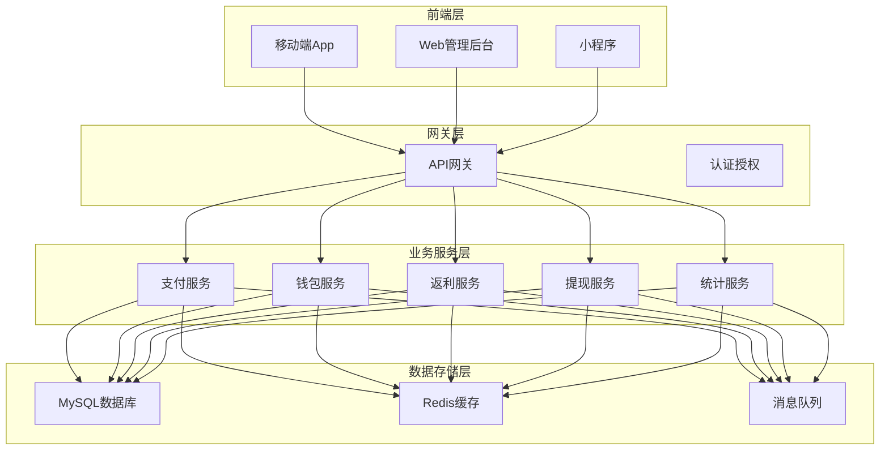

**图表来源**
- [PayOrderApi.java:14-40](file://backend/yudao-module-pay/src/main/java/cn/iocoder/yudao/module/pay/api/order/PayOrderApi.java#L14-L40)

## 核心支付表结构设计

### 支付应用表 (pay_app)

支付应用表用于管理不同的支付应用配置，支持多应用隔离和独立配置。

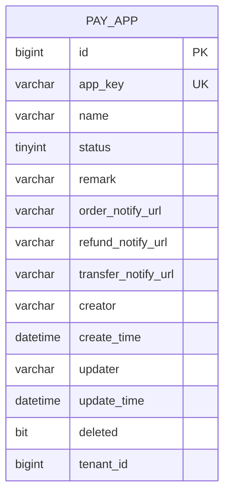

**图表来源**
- [pay-2025-07-27.sql:24-39](file://backend/sql/module/pay-2025-07-27.sql#L24-L39)

### 支付渠道表 (pay_channel)

支付渠道表定义了各种支付渠道的配置信息，支持多种支付方式。

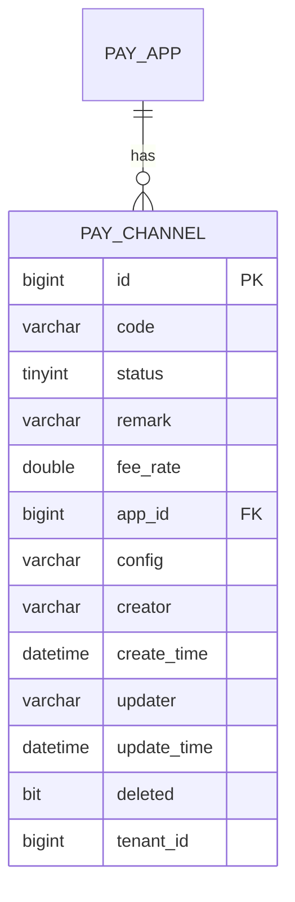

**图表来源**
- [pay-2025-07-27.sql:53-67](file://backend/sql/module/pay-2025-07-27.sql#L53-L67)

### 支付订单表 (pay_demo_order)

支付订单表记录了完整的支付订单信息，包括订单状态、支付状态、退款信息等。

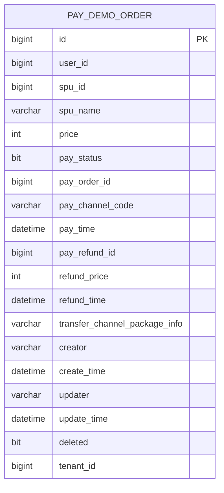

**图表来源**
- [pay-2025-07-27.sql:81-101](file://backend/sql/module/pay-2025-07-27.sql#L81-L101)

### 支付通知日志表 (pay_notify_log)

支付通知日志表记录了所有支付回调通知的详细信息，用于问题排查和对账。

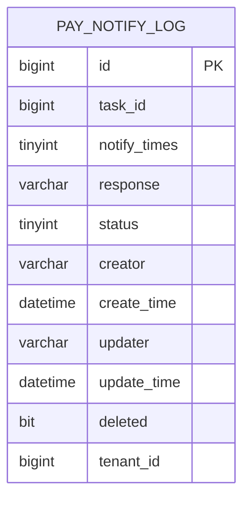

**图表来源**
- [pay-2025-07-27.sql:147-159](file://backend/sql/module/pay-2025-07-27.sql#L147-L159)

## 钱包账户表设计

### 会员用户表 (member_user)

会员用户表包含了用户的基本信息和钱包相关字段。

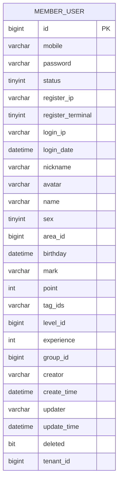

**图表来源**
- [member-2024-01-18.sql:301-328](file://backend/sql/module/member-2024-01-18.sql#L301-L328)

### 会员配置表 (member_config)

会员配置表定义了积分抵扣、返利等相关配置参数。

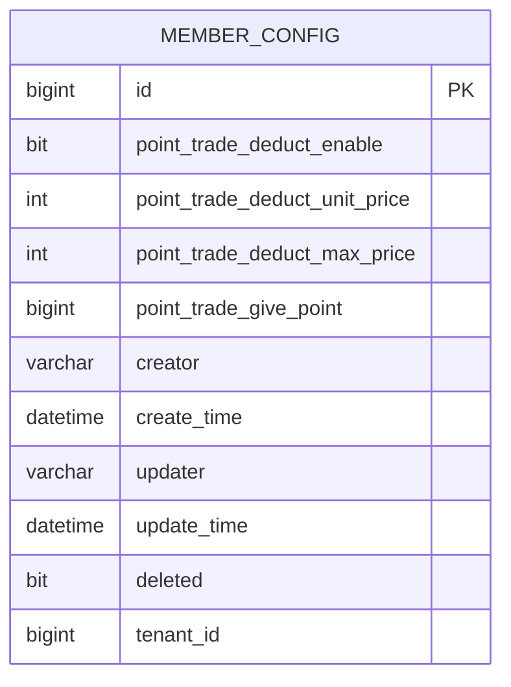

**图表来源**
- [member-2024-01-18.sql:53-65](file://backend/sql/module/member-2024-01-18.sql#L53-L65)

## 返利明细表设计

### 返利记录表 (member_brokerage_record)

返利明细表记录了用户的返利收入详情，支持多种返利类型和状态管理。

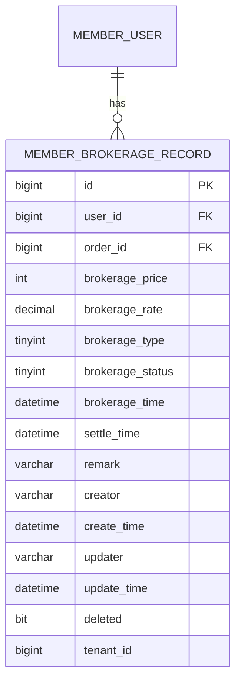

**图表来源**
- [member-2024-01-18.sql:1-200](file://backend/sql/module/member-2024-01-18.sql#L1-L200)

## 提现申请表设计

### 提现申请表 (pay_demo_withdraw)

提现申请表管理用户的提现申请流程，包含提现状态跟踪和转账信息。

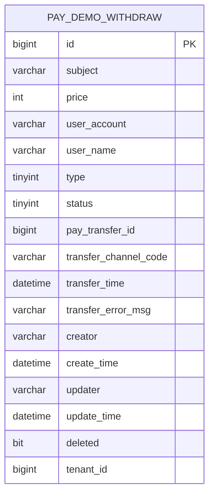

**图表来源**
- [pay-2025-07-27.sql:115-133](file://backend/sql/module/pay-2025-07-27.sql#L115-L133)

## 支付流程设计

### 支付订单创建流程

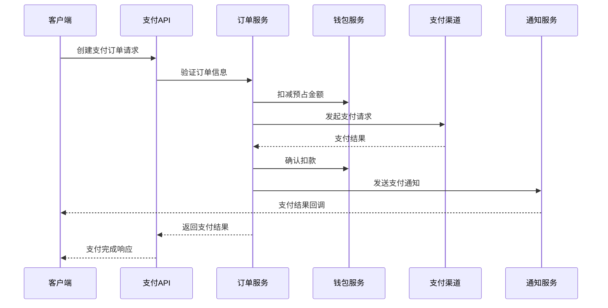

**图表来源**
- [PayOrderApi.java:14-40](file://backend/yudao-module-pay/src/main/java/cn/iocoder/yudao/module/pay/api/order/PayOrderApi.java#L14-L40)
- [PayOrderCreateReqDTO.java:18-78](file://backend/yudao-module-pay/src/main/java/cn/iocoder/yudao/module/pay/api/order/dto/PayOrderCreateReqDTO.java#L18-L78)

### 支付状态字段定义

| 状态值 | 状态名称 | 描述 |
|--------|----------|------|
| 0 | 未支付 | 订单已创建但尚未支付 |
| 1 | 已支付 | 支付已完成 |
| 2 | 支付中 | 正在处理支付请求 |
| 3 | 支付失败 | 支付请求失败 |

### 支付回调处理流程

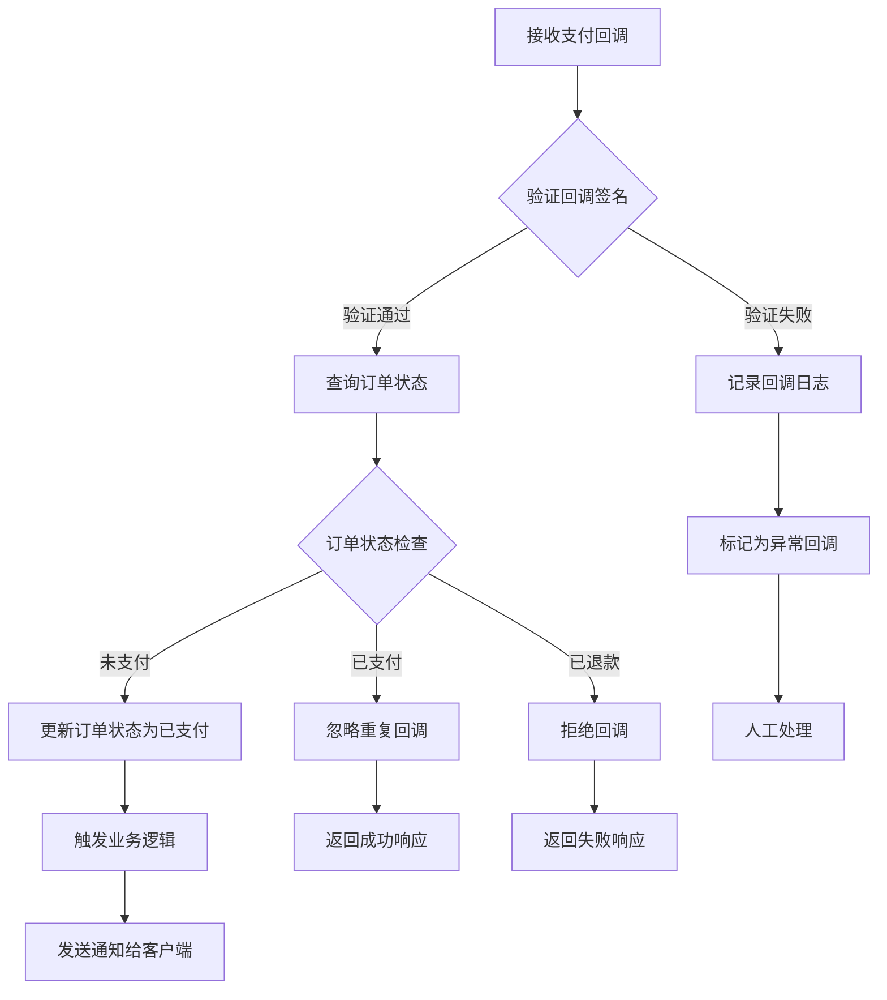

**图表来源**
- [PayOrderNotifyReqDTO.java:20-34](file://backend/yudao-module-pay/src/main/java/cn/iocoder/yudao/module/pay/api/notify/dto/PayOrderNotifyReqDTO.java#L20-L34)

## 返利计算算法

### 返利计算流程

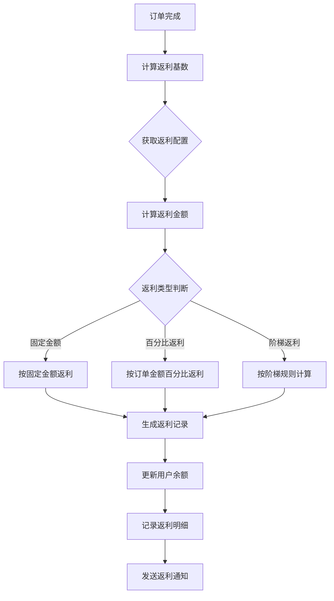

### 返利计算字段说明

| 字段名称 | 类型 | 说明 |
|----------|------|------|
| brokerage_price | int | 返利金额（分） |
| brokerage_rate | decimal | 返利比例（%） |
| brokerage_type | tinyint | 返利类型：1-固定金额，2-百分比返利，3-阶梯返利 |
| brokerage_status | tinyint | 返利状态：0-待结算，1-已结算，2-已失效 |
| settle_time | datetime | 结算时间 |

### 返利结算周期

系统支持以下结算周期：

- **实时结算**：订单完成后立即结算
- **次日结算**：订单完成后次日结算
- **周期结算**：按月/季度等周期统一结算
- **手动结算**：管理员手动触发结算

## 提现审核机制

### 提现申请流程

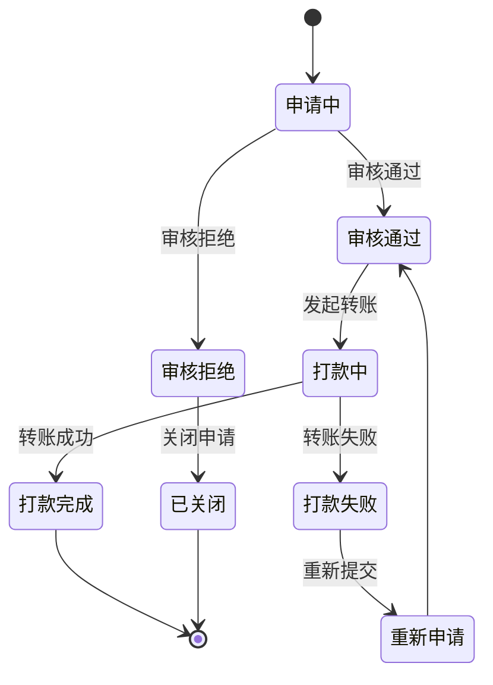

### 提现状态字段定义

| 状态值 | 状态名称 | 描述 |
|--------|----------|------|
| 0 | 申请中 | 用户已提交提现申请 |
| 10 | 审核通过 | 管理员审核通过 |
| 20 | 打款完成 | 资金已成功转出 |
| 5 | 审核拒绝 | 管理员拒绝提现申请 |

### 提现审核规则

1. **金额限制**：单笔提现金额不得低于最低限额，不得高于最高限额
2. **手续费计算**：根据提现金额和渠道收取相应手续费
3. **风控检查**：对高风险用户和异常提现行为进行重点审核
4. **时间控制**：同一用户在指定时间内只能提交一次提现申请

## 资金流水对账

### 资金流水表设计

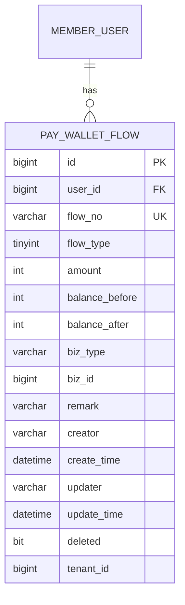

### 对账流程

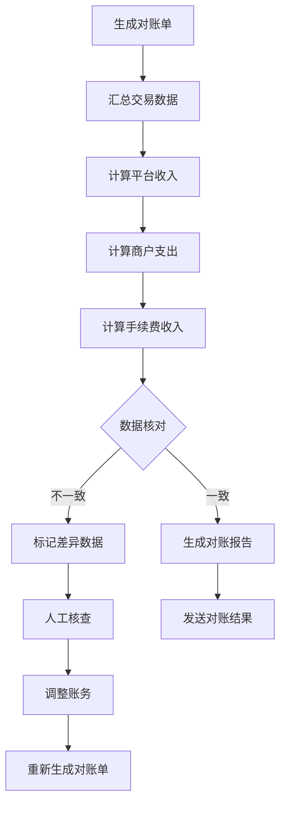

### 对账字段说明

| 字段名称 | 类型 | 说明 |
|----------|------|------|
| flow_type | tinyint | 流水类型：1-收入，2-支出，3-转账 |
| amount | int | 金额（分） |
| balance_before | int | 余额变化前 |
| balance_after | int | 余额变化后 |
| biz_type | varchar | 业务类型标识 |
| biz_id | bigint | 业务单据ID |

## 支付安全策略

### 数据加密策略

1. **敏感数据加密**：用户手机号、银行卡号等敏感信息采用AES加密存储
2. **传输加密**：所有API接口采用HTTPS协议，支持TLS 1.2+
3. **签名验证**：支付请求和回调均需进行数字签名验证
4. **防重放攻击**：每个请求包含随机nonce和时间戳，防止重放攻击

### 访问控制机制

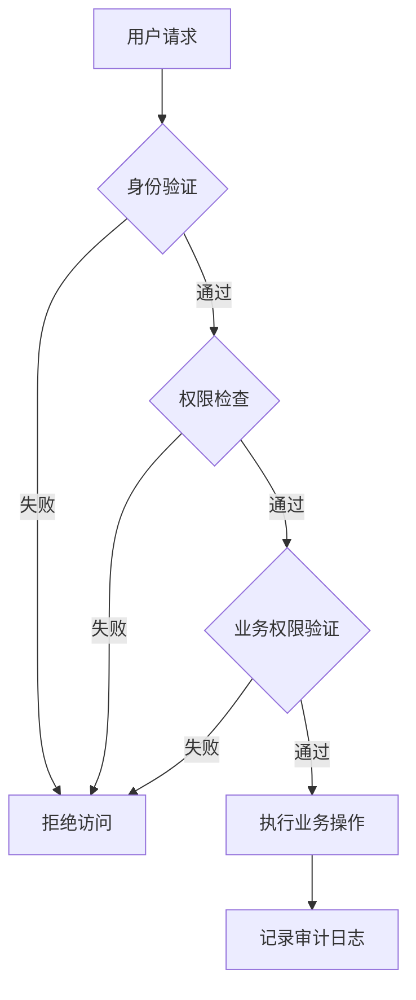

### 安全防护措施

1. **参数校验**：所有输入参数进行严格的格式和范围校验
2. **频率限制**：对高频操作进行限流保护
3. **IP白名单**：支持配置可信IP白名单
4. **异常监控**：实时监控异常访问行为

## 风控机制

### 风险识别模型

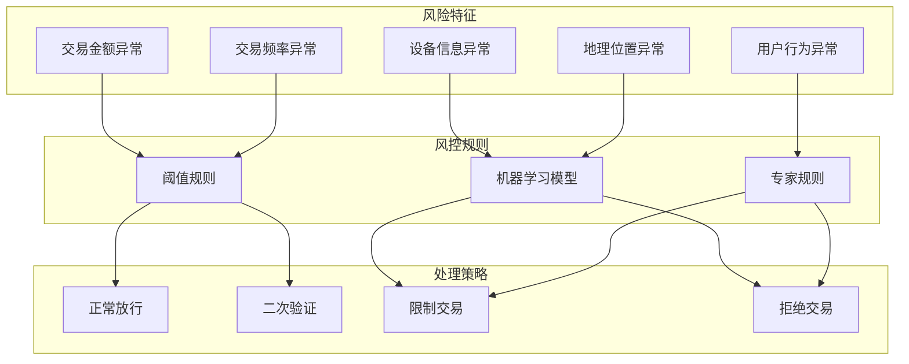

### 风控指标体系

| 指标类型 | 指标名称 | 阈值标准 | 处理策略 |
|----------|----------|----------|----------|
| 金额类 | 单笔交易金额 | >10万元 | 二次验证 |
| 金额类 | 日累计交易金额 | >100万元 | 限制交易 |
| 频率类 | 1分钟内交易次数 | >50次 | 限制交易 |
| 地理类 | 同一IP多地点登录 | >3个 | 二次验证 |
| 行为类 | 新设备首次登录 | 需要人工审核 | 人工审核 |

## 异常处理方案

### 错误码定义

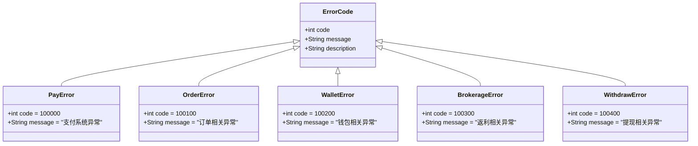

### 异常处理流程

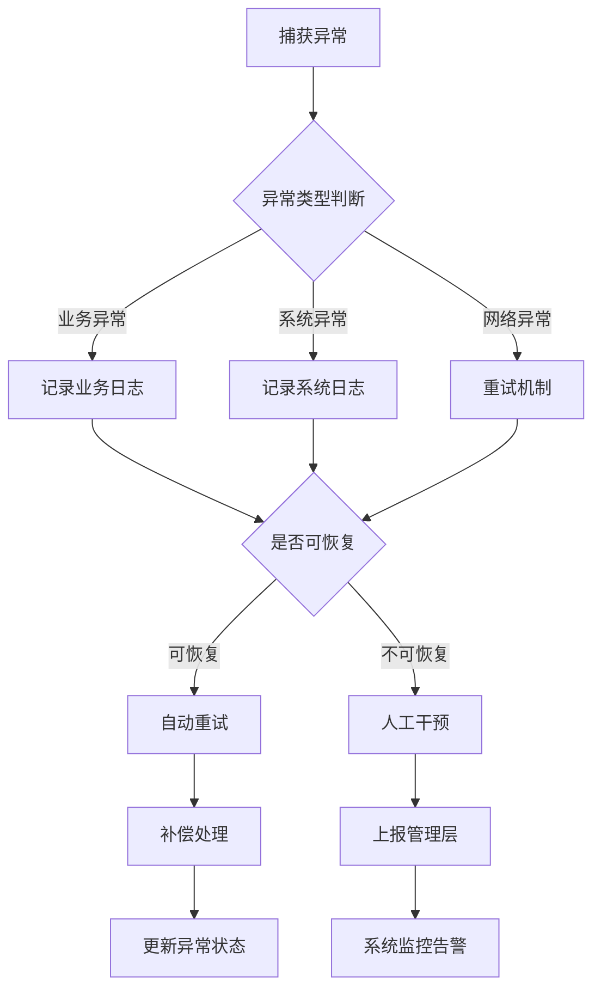

### 重试机制设计

1. **指数退避重试**：重试间隔按指数递增，最多重试5次
2. **超时控制**：单次重试超时时间不超过30秒
3. **熔断保护**：连续失败超过阈值时触发熔断
4. **降级策略**：熔断期间采用降级处理方案

## 性能优化建议

### 数据库优化

1. **索引优化**：为常用查询字段建立合适的索引
2. **分表分库**：大数据量时采用水平分表策略
3. **读写分离**：主库写入，从库查询
4. **缓存策略**：热点数据缓存到Redis

### 接口优化

1. **批量处理**：支持批量查询和批量操作
2. **异步处理**：耗时操作异步化处理
3. **接口限流**：防止接口被恶意刷量
4. **压缩传输**：大对象采用压缩传输

### 监控优化

1. **链路追踪**：全链路请求追踪
2. **性能监控**：关键指标实时监控
3. **告警机制**：异常情况及时告警
4. **容量规划**：根据业务增长预测资源需求

## 总结

AgenticCPS支付返利系统通过合理的表结构设计、完善的安全策略和风控机制，为企业提供了可靠的支付解决方案。系统支持多应用、多渠道的支付场景，具备良好的扩展性和稳定性。

### 核心优势

1. **架构清晰**：模块化设计，职责明确
2. **安全可靠**：多层次安全防护机制
3. **扩展性强**：支持业务快速增长
4. **运维友好**：完善的监控和告警机制

### 技术亮点

1. **分布式事务**：保证支付流程的数据一致性
2. **异步处理**：提升系统整体性能
3. **智能风控**：实时识别和防范风险
4. **自动化对账**：确保财务数据准确性

通过持续优化和完善，该系统能够满足企业复杂的支付和返利业务需求，为用户提供优质的支付体验。