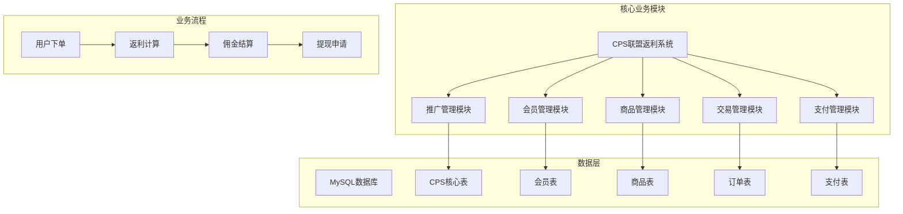
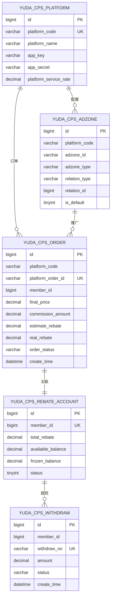
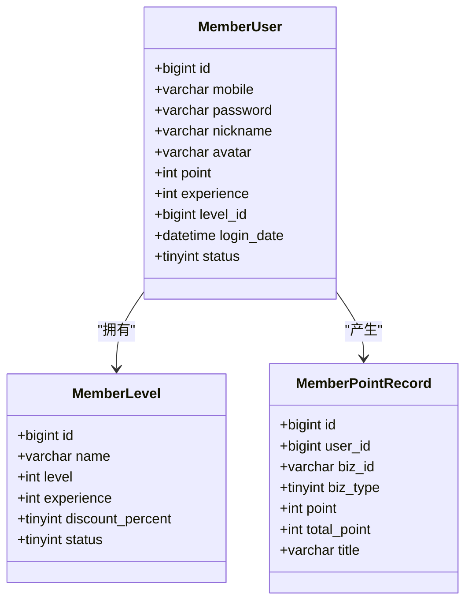
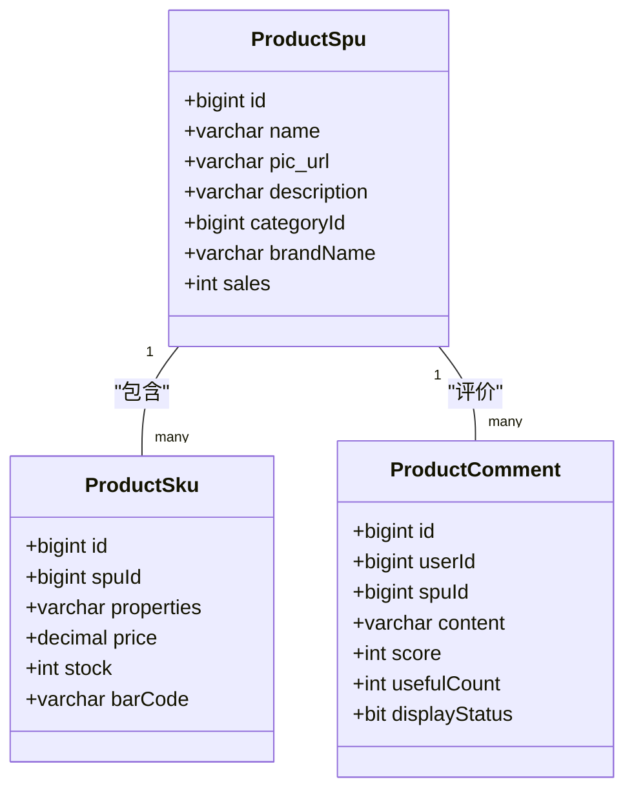
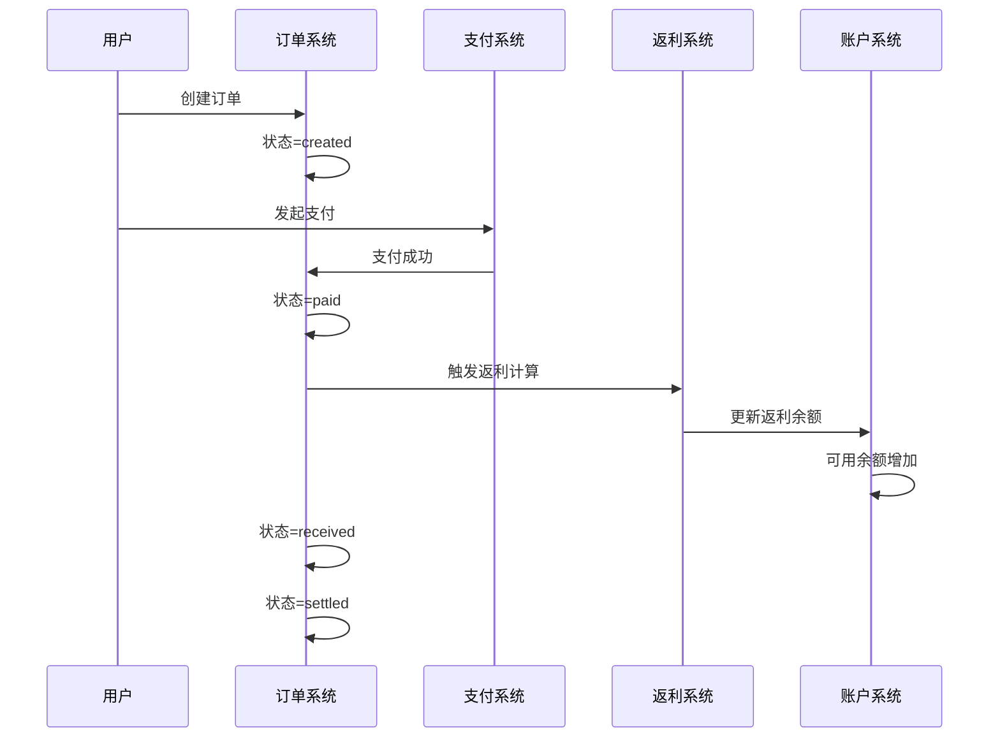
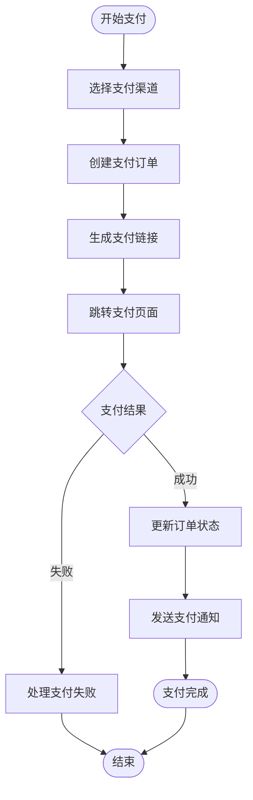
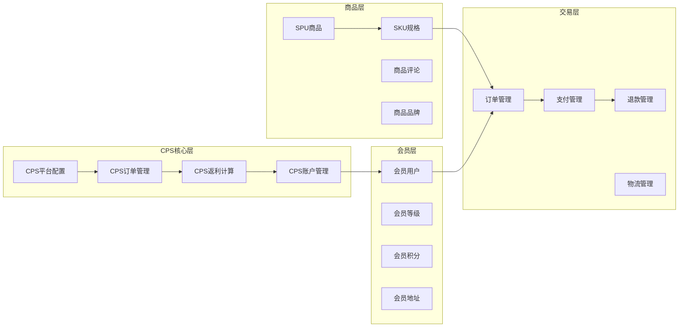

# 核心业务表设计

<cite>
**本文档引用的文件**
- [cps-all-in-one.sql](file://backend/sql/module/cps-all-in-one.sql)
- [member-2024-01-18.sql](file://backend/sql/module/member-2024-01-18.sql)
- [pay-2025-07-27.sql](file://backend/sql/module/pay-2025-07-27.sql)
- [TradeOrderController.java](file://backend/yudao-module-mall/yudao-module-trade/src/main/java/cn/iocoder/yudao/module/trade/controller/admin/order/TradeOrderController.java)
- [AppTradeOrderController.java](file://backend/yudao-module-mall/yudao-module-trade/src/main/java/cn/iocoder/yudao/module/trade/controller/app/order/AppTradeOrderController.java)
- [ProductSpuApiImpl.java](file://backend/yudao-module-mall/yudao-module-product/src/main/java/cn/iocoder/yudao/module/product/api/spu/ProductSpuApiImpl.java)
- [ProductSkuApiImpl.java](file://backend/yudao-module-mall/yudao-module-product/src/main/java/cn/iocoder/yudao/module/product/api/sku/ProductSkuApiImpl.java)
- [ProductCommentApiImpl.java](file://backend/yudao-module-mall/yudao-module-product/src/main/java/cn/iocoder/yudao/module/product/api/comment/ProductCommentApiImpl.java)
</cite>

## 目录
1. [项目概述](#项目概述)
2. [项目结构](#项目结构)
3. [核心组件](#核心组件)
4. [架构概览](#架构概览)
5. [详细组件分析](#详细组件分析)
6. [依赖分析](#依赖分析)
7. [性能考虑](#性能考虑)
8. [故障排除指南](#故障排除指南)
9. [结论](#结论)

## 项目概述

AgenticCPS是一个基于芋道管理系统的企业级CPS（Commission Per Sales）联盟营销返利系统。该系统集成了会员管理、商品管理、订单处理、支付结算和返利计算等核心业务功能，为企业提供完整的电商分销返利解决方案。

系统采用模块化架构设计，包含多个核心业务模块：会员模块、商品模块、交易模块、支付模块、推广模块等。每个模块都有独立的数据表结构和业务逻辑，通过统一的接口进行交互。

## 项目结构

**图表来源**
- [cps-all-in-one.sql:1-393](file://backend/sql/module/cps-all-in-one.sql#L1-L393)
- [member-2024-01-18.sql:1-339](file://backend/sql/module/member-2024-01-18.sql#L1-L339)

## 核心组件

### CPS平台配置表 (yudao_cps_platform)
CPS平台配置表用于管理各个电商平台的接入配置，包括平台基本信息、认证信息和业务参数。

**核心字段说明：**
- `platform_code`: 平台唯一编码，作为外键关联其他表
- `platform_name`: 平台名称
- `app_key/app_secret`: 平台认证密钥
- `api_base_url`: 平台API基础地址
- `platform_service_rate`: 平台服务费率
- `default_adzone_id`: 默认推广位ID

### 推广位管理表 (yudao_cps_adzone)
推广位管理表负责管理不同类型的推广位，支持通用推广位、渠道专属推广位和用户专属推广位。

**核心字段说明：**
- `adzone_id`: 推广位唯一标识
- `adzone_type`: 推广位类型（general/channel/member）
- `relation_type/relation_id`: 关联类型和ID（渠道或用户）
- `is_default`: 是否为默认推广位

### CPS订单表 (yudao_cps_order)
CPS订单表记录所有通过联盟推广产生的订单信息，包含订单状态跟踪和返利计算字段。

**核心字段说明：**
- `platform_order_id`: 平台订单号（唯一标识）
- `member_id`: 归因后的会员ID
- `item_id/item_title`: 商品信息
- `final_price/coupon_amount`: 价格和优惠信息
- `commission_rate/commission_amount`: 佣金比例和金额
- `estimate_rebate/real_rebate`: 预估和实际返利金额
- `order_status`: 订单状态（created/paid/received/settled）

### 会员返利账户表 (yudao_cps_rebate_account)
会员返利账户表管理每个会员的返利余额和状态。

**核心字段说明：**
- `member_id`: 会员唯一标识（唯一约束）
- `total_rebate`: 累计返利总额
- `available_balance`: 可用余额
- `frozen_balance`: 冻结余额
- `withdrawn_amount`: 已提现金额
- `status`: 账户状态（正常/冻结）

### 提现申请表 (yudao_cps_withdraw)
提现申请表记录会员的提现申请和处理状态。

**核心字段说明：**
- `withdraw_no`: 提现单号（唯一标识）
- `withdraw_type`: 提现类型（支付宝/微信/银行卡）
- `amount/actual_amount`: 提现金额和实际到账金额
- `status`: 提现状态（created/reviewing/passed）
- `audit_user_id`: 审核人ID

**章节来源**
- [cps-all-in-one.sql:25-204](file://backend/sql/module/cps-all-in-one.sql#L25-L204)

## 架构概览

**图表来源**
- [cps-all-in-one.sql:25-240](file://backend/sql/module/cps-all-in-one.sql#L25-L240)

## 详细组件分析

### 用户表结构设计

用户表设计遵循会员管理的最佳实践，包含完整的用户信息和等级体系。

**图表来源**
- [member-2024-01-18.sql:298-339](file://backend/sql/module/member-2024-01-18.sql#L298-L339)

**核心字段设计：**
- 用户基本信息：手机号、密码、昵称、头像、真实姓名、性别、生日
- 等级体系：level_id关联会员等级表，支持多级等级管理
- 积分系统：point字段存储当前积分，支持积分增减记录
- 经验系统：experience字段存储累计经验，支持等级提升

### 商品表结构设计

商品表采用SPU+SKU的两级商品模型，支持复杂的商品属性组合。

**图表来源**
- [member-2024-01-18.sql:132-151](file://backend/sql/module/member-2024-01-18.sql#L132-L151)

**设计特点：**
- SPU表存储商品基本信息，SKU表存储具体规格和价格
- 支持商品属性组合，通过properties字段存储规格属性
- 评论系统支持评分和有用性统计
- 库存管理支持实时更新和超卖控制

### 订单表结构设计

订单表采用完整的订单生命周期管理，支持多种订单状态和业务场景。

**图表来源**
- [cps-all-in-one.sql:77-123](file://backend/sql/module/cps-all-in-one.sql#L77-L123)

**订单状态流转：**
- created: 已下单
- paid: 已付款  
- received: 已收货
- settled: 已结算
- rebate_received: 返利已到账
- refunded: 已退款
- invalid: 已失效

### 支付表结构设计

支付表支持多种支付方式和支付渠道，提供完整的支付流程管理。

**图表来源**
- [pay-2025-07-27.sql:20-166](file://backend/sql/module/pay-2025-07-27.sql#L20-L166)

**支付流程：**
- 支持多种支付渠道（微信、支付宝、银行卡等）
- 支付结果异步通知
- 退款流程完整支持
- 支付安全验证

## 依赖分析

**图表来源**
- [cps-all-in-one.sql:1-20](file://backend/sql/module/cps-all-in-one.sql#L1-L20)
- [member-2024-01-18.sql:1-20](file://backend/sql/module/member-2024-01-18.sql#L1-L20)

**依赖关系：**
- CPS订单依赖平台配置和推广位信息
- 会员等级影响返利比例和权限
- 商品SKU决定订单价格和库存
- 支付状态影响订单流转和返利结算

## 性能考虑

### 索引优化策略

**CPS订单表索引设计：**
- 主键索引：id（唯一标识）
- 唯一索引：platform_order_id（订单号唯一性）
- 复合索引：member_id + create_time（会员订单查询）
- 条件索引：order_status + create_time（状态查询优化）

**会员表索引设计：**
- 主键索引：id（用户唯一标识）
- 唯一索引：mobile（手机号唯一性）
- 普通索引：level_id（等级查询）
- 模糊索引：nickname（搜索优化）

### 查询优化建议

1. **分页查询优化**：对大表查询添加LIMIT和适当的排序字段
2. **批量操作**：对于大量数据更新使用批量操作减少事务开销
3. **缓存策略**：热点数据如商品信息、用户等级使用Redis缓存
4. **读写分离**：高并发场景下实现读写分离

## 故障排除指南

### 常见问题及解决方案

**订单状态异常：**
- 现象：订单状态不更新或重复更新
- 原因：支付回调延迟或重复调用
- 解决：实现幂等性处理，使用分布式锁

**返利计算错误：**
- 现象：返利金额与预期不符
- 原因：佣金比例计算错误或重复返利
- 解决：添加计算校验逻辑，实施防重机制

**提现失败：**
- 现象：提现申请状态卡住
- 原因：银行接口异常或账户信息错误
- 解决：完善异常处理和重试机制

### 监控指标

- 订单处理延迟：订单从创建到支付完成的时间
- 返利计算准确率：返利金额计算正确率
- 支付成功率：支付请求成功比例
- 提现处理时效：提现从申请到到账时间

## 结论

AgenticCPS系统通过精心设计的核心业务表结构，实现了完整的CPS联盟营销返利业务闭环。系统采用模块化设计，各模块间职责清晰，数据一致性得到良好保障。

**主要优势：**
1. **完整的业务覆盖**：从用户管理到订单处理，从支付结算到返利计算
2. **灵活的配置管理**：支持多平台接入和灵活的返利规则配置
3. **完善的风控体系**：通过冻结解冻机制和异常监控保障资金安全
4. **良好的扩展性**：模块化设计便于功能扩展和业务迭代

**未来发展方向：**
1. **智能化推荐**：基于用户行为数据的智能商品推荐
2. **多维度分析**：提供更丰富的数据分析和报表功能
3. **移动端优化**：增强移动端用户体验和功能支持
4. **国际化支持**：支持多语言和多币种业务场景

通过持续优化和迭代，AgenticCPS系统将成为企业级CPS联盟营销的优秀解决方案。