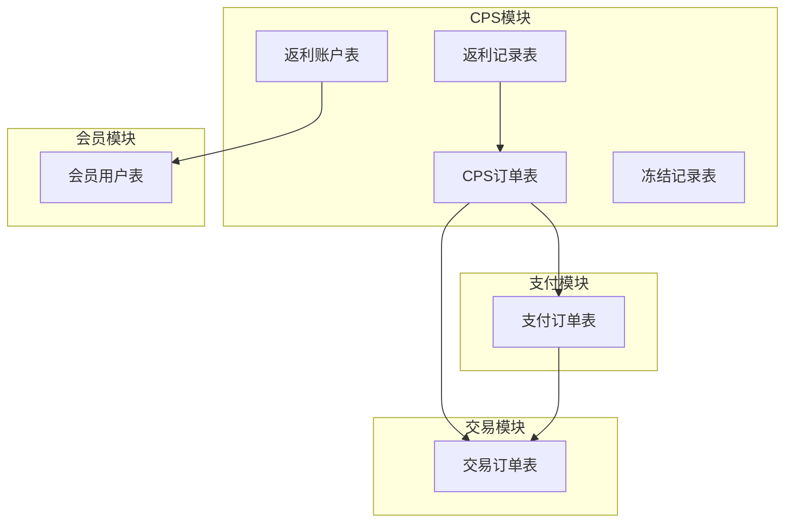
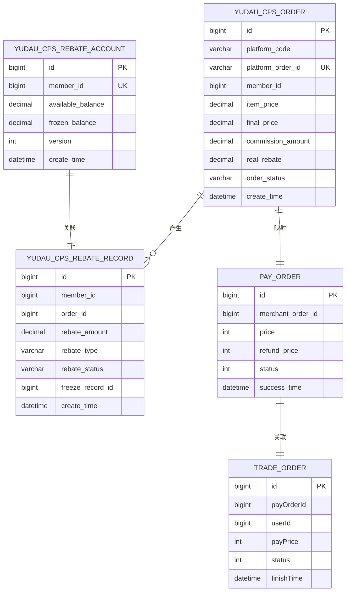
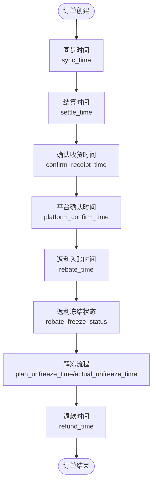
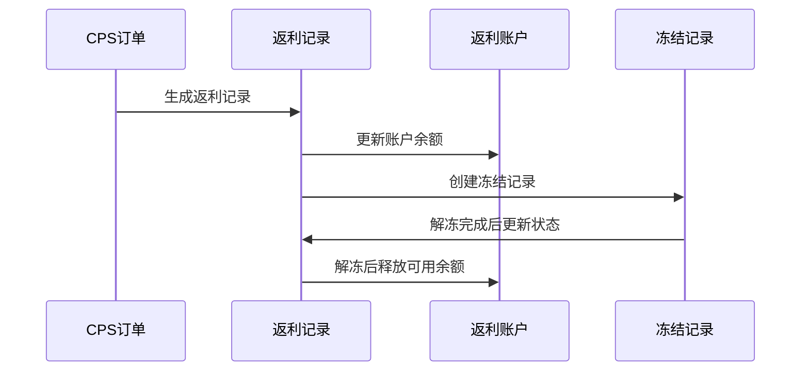
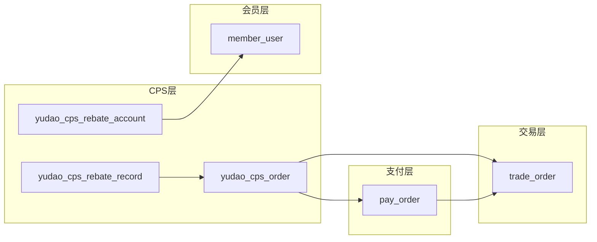
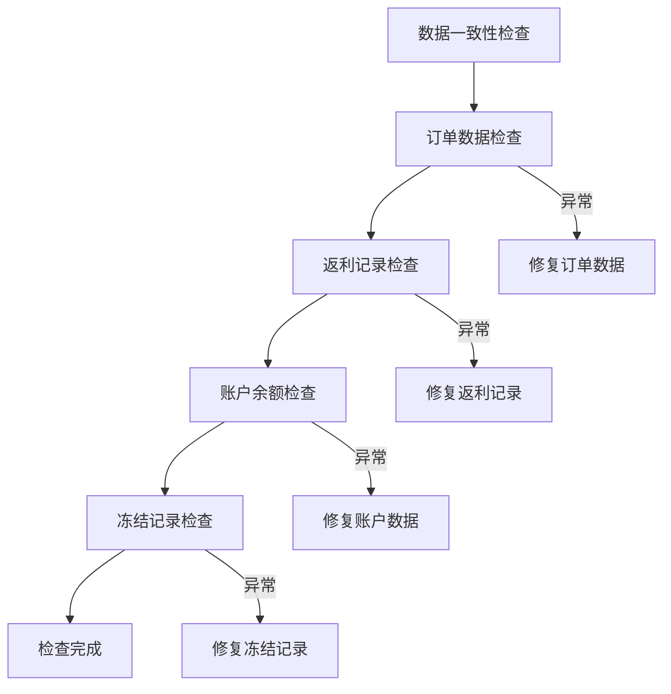

# 核心业务表设计

<cite>
**本文档引用的文件**
- [CpsOrderDO.java](file://backend/yudao-module-cps/yudao-module-cps-biz/src/main/java/cn/iocoder/yudao/module/cps/dal/dataobject/order/CpsOrderDO.java)
- [CpsRebateRecordDO.java](file://backend/yudao-module-cps/yudao-module-cps-biz/src/main/java/cn/iocoder/yudao/module/cps/dal/dataobject/rebate/CpsRebateRecordDO.java)
- [CpsRebateAccountDO.java](file://backend/yudao-module-cps/yudao-module-cps-biz/src/main/java/cn/iocoder/yudao/module/cps/dal/dataobject/rebate/CpsRebateAccountDO.java)
- [TradeOrderDO.java](file://backend/yudao-module-mall/yudao-module-trade/src/main/java/cn/iocoder/yudao/module/trade/dal/dataobject/order/TradeOrderDO.java)
- [PayOrderDO.java](file://backend/yudao-module-pay/src/main/java/cn/iocoder/yudao/module/pay/dal/dataobject/order/PayOrderDO.java)
- [cps-all-in-one.sql](file://backend/sql/module/cps-all-in-one.sql)
</cite>

## 目录
1. [简介](#简介)
2. [项目结构](#项目结构)
3. [核心组件](#核心组件)
4. [架构概览](#架构概览)
5. [详细组件分析](#详细组件分析)
6. [依赖分析](#依赖分析)
7. [性能考虑](#性能考虑)
8. [故障排除指南](#故障排除指南)
9. [结论](#结论)

## 简介

本文档详细说明了AgenticCPS项目的核心业务表设计，包括CPS订单表、商品表、返利记录表、会员用户表、支付订单表等关键业务表的结构设计。文档涵盖了每个表的字段定义、数据类型、约束条件和索引策略，解释了表之间的外键关系和引用完整性，并提供了业务规则在数据库层面的实现方式。

## 项目结构

基于代码库分析，核心业务表主要分布在以下模块中：

**图表来源**
- [CpsOrderDO.java:19-156](file://backend/yudao-module-cps/yudao-module-cps-biz/src/main/java/cn/iocoder/yudao/module/cps/dal/dataobject/order/CpsOrderDO.java#L19-L156)
- [CpsRebateRecordDO.java:18-99](file://backend/yudao-module-cps/yudao-module-cps-biz/src/main/java/cn/iocoder/yudao/module/cps/dal/dataobject/rebate/CpsRebateRecordDO.java#L18-L99)
- [CpsRebateAccountDO.java:17-63](file://backend/yudao-module-cps/yudao-module-cps-biz/src/main/java/cn/iocoder/yudao/module/cps/dal/dataobject/rebate/CpsRebateAccountDO.java#L17-L63)

## 核心组件

### CPS订单表 (yudao_cps_order)

CPS订单表是整个CPS系统的中心表，记录从各电商平台获取的订单信息。

**表结构设计要点：**
- 主键采用自增ID，支持多数据库序列
- 平台编码和平台订单号组合确保订单唯一性
- 完整的时间戳字段体系，涵盖订单生命周期各阶段
- 冻结状态字段支持返利的分期解冻机制

**核心字段定义：**
- `platform_code`: 平台编码，支持淘宝、京东等多个平台
- `platform_order_id`: 平台订单号，唯一标识
- `member_id`: 归因后的会员ID
- `item_price/final_price`: 商品原价和券后价
- `commission_rate/commission_amount`: 佣金比例和金额
- `estimate_rebate/real_rebate`: 预估和实际返利金额
- `order_status`: 订单状态，包含多个业务状态
- 时间戳字段：`sync_time`、`settle_time`、`rebate_time`、`refund_time`等

**索引策略：**
- 唯一索引：`uk_platform_order_id`确保订单唯一性
- 普通索引：`idx_member_id`、`idx_order_status`、`idx_create_time`支持常用查询
- 复合索引：`idx_member_status`、`idx_platform_create`优化复杂查询

### 返利记录表 (yudao_cps_rebate_record)

返利记录表详细记录每次返利的产生、状态变化和相关业务信息。

**表结构设计要点：**
- 关联CPS订单表，支持一对一和一对多关系
- 返利类型枚举支持正常返利、返利扣回、系统调整
- 返利状态跟踪完整的结算流程
- 支持冻结记录关联，实现返利的分期解冻

**核心字段定义：**
- `member_id/order_id`: 关联到会员和订单
- `platform_code/platform_order_id`: 平台相关信息
- `order_amount/commission_amount`: 订单金额和可分配佣金
- `rebate_rate/rebate_amount`: 返利比例和金额
- `rebate_type/rebate_status`: 返利类型和状态
- `freeze_record_id`: 关联冻结记录ID

**索引策略：**
- 复合索引：`idx_member_status`优化会员返利查询
- 单列索引：支持按会员ID、订单ID、状态等条件查询

### 会员返利账户表 (yudao_cps_rebate_account)

会员返利账户表管理每个会员的返利余额和历史累计信息。

**表结构设计要点：**
- 采用乐观锁机制防止并发更新问题
- 状态字段支持账户冻结和正常状态
- 余额字段采用精确小数类型，避免浮点数精度问题

**核心字段定义：**
- `member_id`: 唯一关联到会员系统
- `total_rebate`: 累计返利总额
- `available_balance/frozen_balance`: 可用余额和冻结余额
- `withdrawn_amount`: 已提现金额
- `status/version`: 账户状态和乐观锁版本

**索引策略：**
- 唯一索引：`uk_member_id`确保会员唯一性
- 普通索引：`idx_status`支持按状态查询

### 支付订单表 (pay_order)

支付订单表记录支付系统的完整支付信息。

**表结构设计要点：**
- 与应用和支付渠道建立关联关系
- 支持多种支付状态和处理流程
- 退款金额独立字段，便于财务对账

**核心字段定义：**
- `merchant_order_id`: 商户订单编号
- `subject/body`: 商品标题和描述
- `price/channel_fee_rate`: 支付金额和手续费率
- `status/success_time`: 支付状态和成功时间
- `refund_price`: 退款总金额

**索引策略：**
- 支持按商户订单号、状态、时间等条件查询

### 交易订单表 (trade_order)

交易订单表记录电商交易的完整订单信息。

**表结构设计要点：**
- 与会员系统和支付系统深度集成
- 支持多种订单类型和营销活动
- 价格字段采用分作为最小单位，避免精度问题

**核心字段定义：**
- `no`: 订单流水号
- `type/terminal`: 订单类型和来源终端
- `userId`: 用户编号
- `payOrderId`: 关联支付订单ID
- `totalPrice/discountPrice`: 商品原价和优惠金额
- `payPrice`: 应付金额

**索引策略：**
- 支持按用户ID、订单状态、支付状态等条件查询

## 架构概览

**图表来源**
- [cps-all-in-one.sql:84-127](file://backend/sql/module/cps-all-in-one.sql#L84-L127)
- [cps-all-in-one.sql:156-187](file://backend/sql/module/cps-all-in-one.sql#L156-L187)
- [cps-all-in-one.sql:192-211](file://backend/sql/module/cps-all-in-one.sql#L192-L211)
- [PayOrderDO.java:19-148](file://backend/yudao-module-pay/src/main/java/cn/iocoder/yudao/module/pay/dal/dataobject/order/PayOrderDO.java#L19-L148)
- [TradeOrderDO.java:30-364](file://backend/yudao-module-mall/yudao-module-trade/src/main/java/cn/iocoder/yudao/module/trade/dal/dataobject/order/TradeOrderDO.java#L30-L364)

## 详细组件分析

### CPS订单表详细分析

#### 字段定义与数据类型

| 字段名 | 数据类型 | 约束条件 | 描述 |
|--------|----------|----------|------|
| id | bigint | PRIMARY KEY, AUTO_INCREMENT | 主键ID |
| platform_code | varchar(32) | NOT NULL | 平台编码 |
| platform_order_id | varchar(128) | NOT NULL, UNIQUE | 平台订单号 |
| member_id | bigint | NULL | 会员ID |
| item_price | decimal(10,2) | DEFAULT '0.00' | 商品原价 |
| final_price | decimal(10,2) | DEFAULT '0.00' | 券后价 |
| commission_amount | decimal(10,2) | DEFAULT '0.00' | 预估佣金金额 |
| real_rebate | decimal(10,2) | DEFAULT '0.00' | 实际返利金额 |
| order_status | varchar(32) | NOT NULL, DEFAULT 'created' | 订单状态 |

#### 状态字段设计

订单状态采用枚举设计，涵盖完整的业务生命周期：
- `created`: 已下单
- `paid`: 已付款  
- `received`: 已收货
- `settled`: 已结算
- `rebate_received`: 已到账
- `refunded`: 已退款
- `invalid`: 已失效

#### 时间戳字段体系

**图表来源**
- [CpsOrderDO.java:103-153](file://backend/yudao-module-cps/yudao-module-cps-biz/src/main/java/cn/iocoder/yudao/module/cps/dal/dataobject/order/CpsOrderDO.java#L103-L153)

### 返利记录表详细分析

#### 返利类型与状态

返利类型枚举设计：
- `rebate`: 返利入账
- `refund`: 返利扣回  
- `adjust`: 系统调整

返利状态枚举：
- `pending`: 待结算
- `Rcptd`: 已到账
- `refunded`: 已扣回

#### 业务规则实现

**图表来源**
- [CpsRebateRecordDO.java:74-96](file://backend/yudao-module-cps/yudao-module-cps-biz/src/main/java/cn/iocoder/yudao/module/cps/dal/dataobject/rebate/CpsRebateRecordDO.java#L74-L96)
- [CpsRebateAccountDO.java:38-60](file://backend/yudao-module-cps/yudao-module-cps-biz/src/main/java/cn/iocoder/yudao/module/cps/dal/dataobject/rebate/CpsRebateAccountDO.java#L38-L60)

### 会员用户表设计

会员用户表通过`member_id`字段与返利系统建立关联，支持以下核心功能：

- **余额管理**: 可用余额、冻结余额、累计返利总额
- **状态控制**: 账户冻结和正常状态切换
- **并发安全**: 乐观锁机制防止余额并发更新问题

**索引策略**:
- 唯一索引: `uk_member_id`确保会员唯一性
- 普通索引: `idx_status`支持按状态查询

## 依赖分析

### 外键关系与引用完整性

**图表来源**
- [cps-all-in-one.sql:84-127](file://backend/sql/module/cps-all-in-one.sql#L84-L127)
- [cps-all-in-one.sql:156-187](file://backend/sql/module/cps-all-in-one.sql#L156-L187)
- [cps-all-in-one.sql:192-211](file://backend/sql/module/cps-all-in-one.sql#L192-L211)

### 数据验证规则

系统通过以下机制确保数据完整性：

1. **字段约束**: 所有必填字段设置NOT NULL约束
2. **唯一性约束**: 订单号、会员ID等关键字段设置唯一索引
3. **默认值设置**: 数值字段设置合理的默认值
4. **枚举约束**: 状态字段使用枚举类型限制取值范围
5. **精度控制**: 金额字段使用decimal类型确保精度

## 性能考虑

### 索引优化策略

1. **复合索引设计**:
   - `idx_member_status`: 优化会员相关查询
   - `idx_platform_create`: 优化跨平台统计查询
   - `idx_platform_order_id`: 优化订单号查询

2. **查询性能优化**:
   - 常用过滤条件建立单独索引
   - 复杂查询使用覆盖索引
   - 定期分析查询执行计划

3. **分区策略**:
   - 按时间字段进行表分区
   - 支持历史数据归档和清理

### 触发器使用

系统采用以下触发器机制：

1. **自动时间戳**: 创建和更新时自动设置时间戳
2. **状态同步**: 状态变更时自动更新相关字段
3. **余额计算**: 余额变动时自动计算可用和冻结余额

## 故障排除指南

### 常见问题诊断

1. **订单重复问题**:
   - 检查`platform_order_id`唯一性约束
   - 验证平台订单号生成逻辑
   - 查看同步日志表记录

2. **返利计算错误**:
   - 验证返利配置表设置
   - 检查佣金比例和返利比例
   - 确认冻结解冻配置

3. **账户余额异常**:
   - 检查乐观锁版本号
   - 验证并发更新处理
   - 查看余额变更历史

### 数据一致性检查

## 结论

AgenticCPS项目的核心业务表设计体现了以下特点：

1. **完整的业务覆盖**: 涵盖CPS业务的完整生命周期
2. **严谨的数据设计**: 通过约束和索引确保数据完整性
3. **灵活的扩展性**: 支持多平台、多会员等级的扩展需求
4. **完善的审计机制**: 全面的时间戳和状态跟踪
5. **高效的性能设计**: 合理的索引策略和查询优化

该设计为CPS业务的稳定运行提供了坚实的数据基础，支持业务的持续发展和扩展。