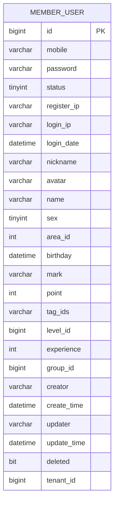
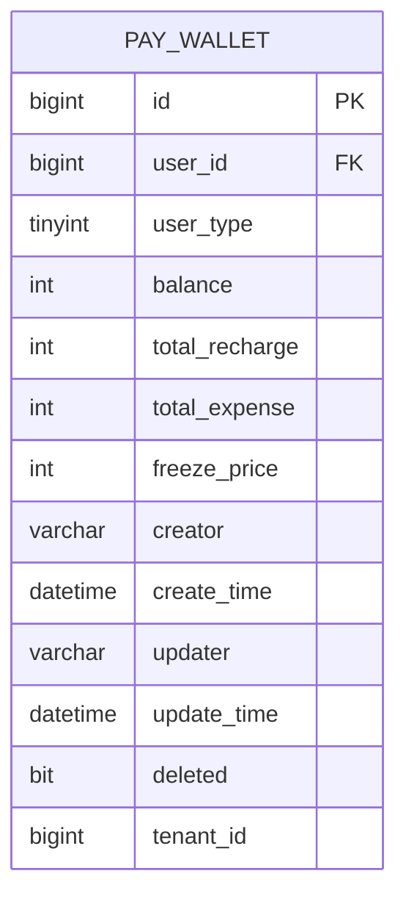
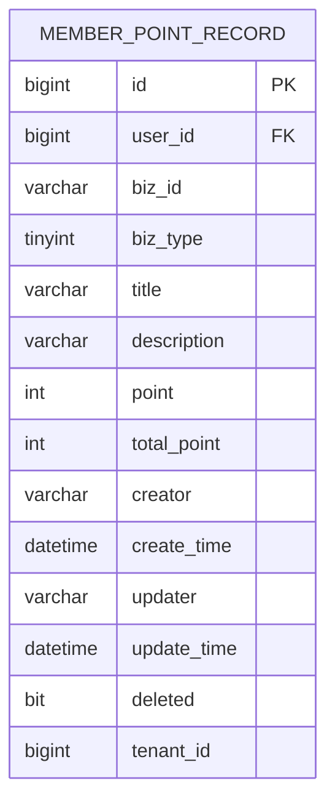
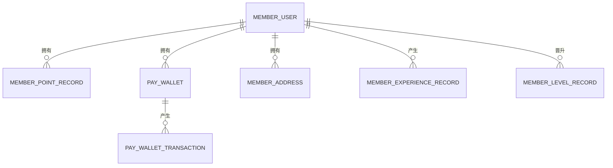
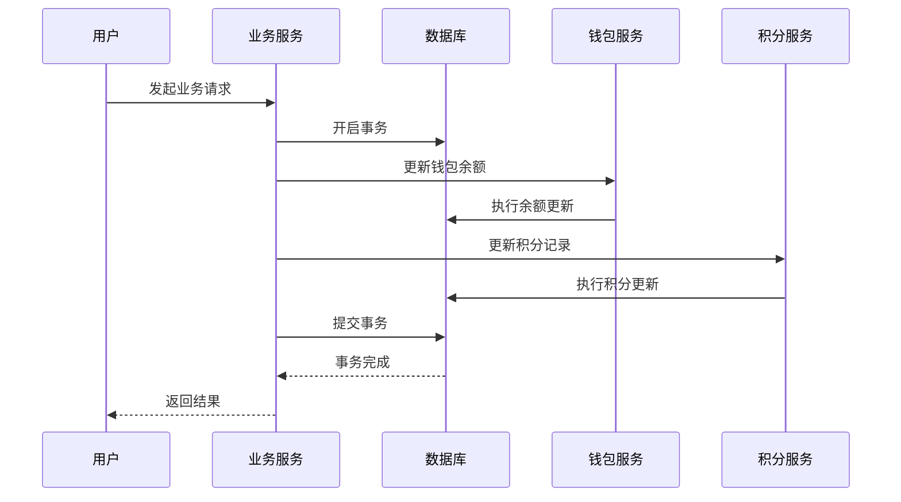
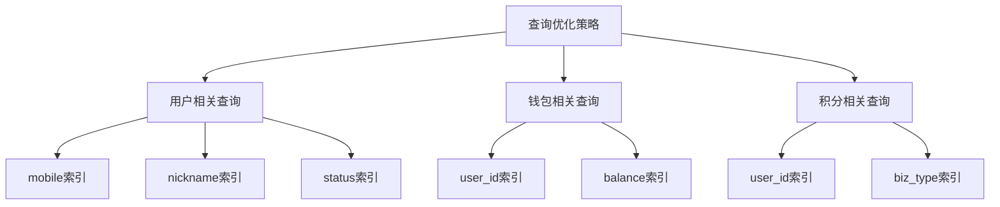
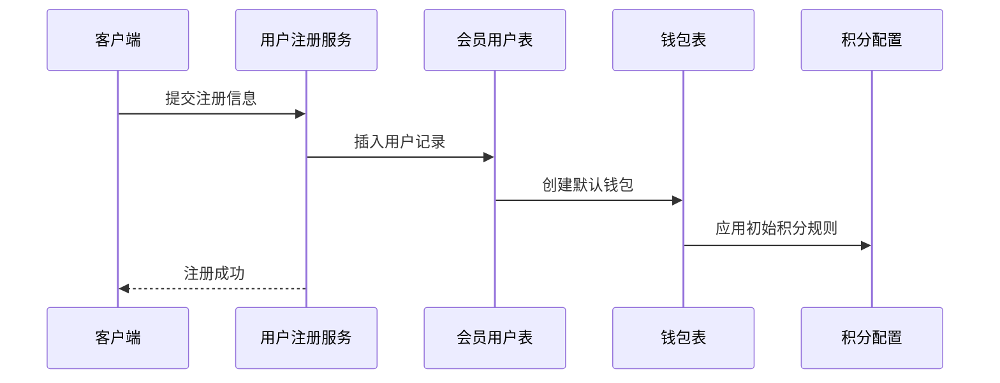
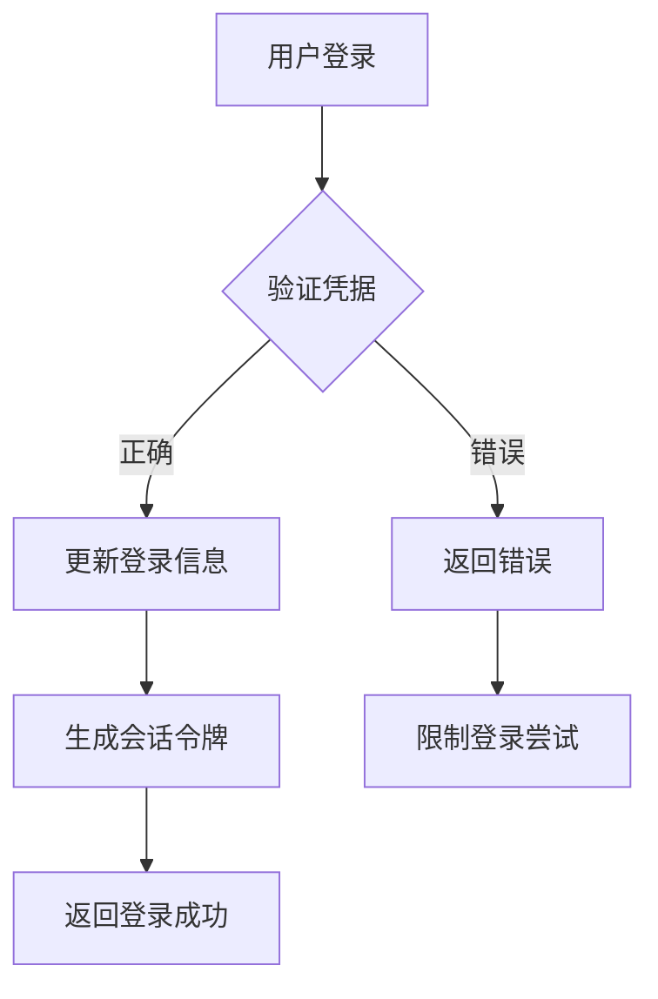
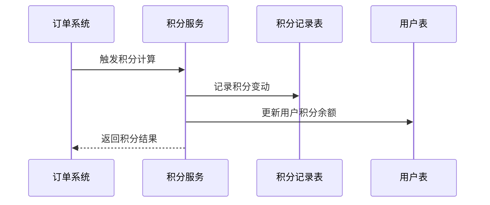
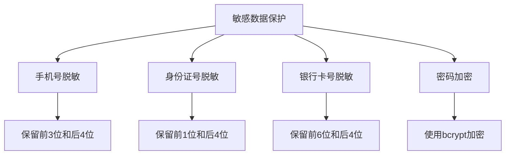

# 用户账户表设计

<cite>
**本文档引用的文件**
- [member-2024-01-18.sql](file://backend/sql/module/member-2024-01-18.sql)
- [pay-2025-07-27.sql](file://backend/sql/module/pay-2025-07-27.sql)
- [UserAccountInfo.vue](file://frontend/admin-vue3/src/views/member/user/detail/UserAccountInfo.vue)
- [UserBalanceList.vue](file://frontend/admin-vue3/src/views/member/user/detail/UserBalanceList.vue)
- [UserBalanceUpdateForm.vue](file://frontend/admin-vue3/src/views/member/user/components/UserBalanceUpdateForm.vue)
- [WalletTransactionList.vue](file://frontend/admin-vue3/src/views/pay/wallet/transaction/WalletTransactionList.vue)
- [index.ts (钱包API)](file://frontend/admin-vue3/src/api/pay/wallet/balance/index.ts)
- [index.ts (积分记录API)](file://frontend/admin-vue3/src/api/member/point/record/index.ts)
- [index.ts (钱包流水API)](file://frontend/admin-vue3/src/api/pay/wallet/transaction/index.ts)
</cite>

## 目录
1. [项目概述](#项目概述)
2. [核心表结构设计](#核心表结构设计)
3. [用户基本信息字段](#用户基本信息字段)
4. [账户余额字段](#账户余额字段)
5. [积分体系字段](#积分体系字段)
6. [表间关联关系](#表间关联关系)
7. [数据一致性保证机制](#数据一致性保证机制)
8. [索引优化策略](#索引优化策略)
9. [业务场景数据流](#业务场景数据流)
10. [数据隐私保护与安全](#数据隐私保护与安全)
11. [性能考虑与优化建议](#性能考虑与优化建议)
12. [故障排除指南](#故障排除指南)
13. [结论](#结论)

## 项目概述

AgenticCPS系统采用会员中心与支付中心分离的设计架构，通过清晰的表结构设计实现了用户账户管理、积分体系和钱包功能的完整闭环。系统基于MySQL数据库，采用多租户架构支持不同业务场景的隔离需求。

## 核心表结构设计

系统主要包含三个核心模块的表结构：

### 会员用户表 (member_user)
这是用户账户的核心表，存储用户的基本信息和账户状态。

**图表来源**
- [member-2024-01-18.sql:298-329](file://backend/sql/module/member-2024-01-18.sql#L298-L329)

### 钱包表 (pay_wallet)
独立的钱包管理系统，提供完整的余额管理功能。

**图表来源**
- [pay-2025-07-27.sql:1-166](file://backend/sql/module/pay-2025-07-27.sql#L1-L166)

### 积分记录表 (member_point_record)
完整的积分变动记录系统，支持多种积分业务场景。

**图表来源**
- [member-2024-01-18.sql:192-213](file://backend/sql/module/member-2024-01-18.sql#L192-L213)

## 用户基本信息字段

用户基本信息字段设计体现了系统的完整性和扩展性：

### 基础身份信息
- **用户名 (nickname)**: 用户昵称，支持中文显示
- **真实姓名 (name)**: 实名认证需要的真实姓名
- **手机号 (mobile)**: 用户登录和联系的主要方式
- **密码 (password)**: 加密存储的用户凭证
- **性别 (sex)**: 性别标识，支持二进制存储
- **出生日期 (birthday)**: 生日信息，用于个性化服务

### 账户状态管理
- **状态 (status)**: 账户启用/禁用状态
- **注册IP (register_ip)**: 注册时的网络位置
- **最后登录IP (login_ip)**: 最近一次登录的IP地址
- **最后登录时间 (login_date)**: 登录时间戳

### 社交与配置信息
- **头像 (avatar)**: 用户头像URL
- **备注 (mark)**: 管理员添加的用户备注
- **标签 (tag_ids)**: 用户标签组合，支持多标签管理
- **等级 (level_id)**: 会员等级关联
- **经验 (experience)**: 成长值，用于等级晋升
- **分组 (group_id)**: 用户分组，支持用户分类管理

**章节来源**
- [member-2024-01-18.sql:298-329](file://backend/sql/module/member-2024-01-18.sql#L298-L329)

## 账户余额字段

钱包系统提供了完整的余额管理能力：

### 余额管理字段
- **可用余额 (balance)**: 用户可直接使用的资金余额，以分为单位存储
- **累计充值 (total_recharge)**: 用户累计充值总额
- **累计支出 (total_expense)**: 用户累计消费总额
- **冻结金额 (freeze_price)**: 被冻结的金额，如退款处理中的资金

### 用户类型区分
- **用户类型 (user_type)**: 区分普通用户、分销商等不同类型的用户

### 数据精度设计
所有金额字段均以"分"为最小单位，避免浮点数精度问题，确保财务数据的准确性。

**章节来源**
- [pay-2025-07-27.sql:1-166](file://backend/sql/module/pay-2025-07-27.sql#L1-L166)

## 积分体系字段

积分系统设计了完整的积分生命周期管理：

### 积分基础信息
- **积分余额 (point)**: 用户当前可用积分余额
- **总积分 (total_point)**: 积分变动后的累计积分

### 积分业务记录
- **业务编号 (biz_id)**: 关联的具体业务标识
- **业务类型 (biz_type)**: 积分变动的业务场景类型
- **积分标题 (title)**: 积分变动的简要说明
- **积分描述 (description)**: 详细的积分变动原因

### 积分规则配置
系统还包含积分配置表，支持积分抵扣比例、赠送规则等业务配置。

**章节来源**
- [member-2024-01-18.sql:192-213](file://backend/sql/module/member-2024-01-18.sql#L192-L213)

## 表间关联关系

系统通过外键约束建立了清晰的表间关系：

**图表来源**
- [member-2024-01-18.sql:298-329](file://backend/sql/module/member-2024-01-18.sql#L298-L329)
- [pay-2025-07-27.sql:1-166](file://backend/sql/module/pay-2025-07-27.sql#L1-L166)

### 关联特点
- **一对一关联**: 用户与钱包是一对一关系，确保每个用户只有一个钱包
- **一对多关联**: 用户可以有多条积分记录、地址记录等
- **级联约束**: 删除用户时，相关的钱包、积分记录等会自动清理

**章节来源**
- [member-2024-01-18.sql:298-329](file://backend/sql/module/member-2024-01-18.sql#L298-L329)

## 数据一致性保证机制

### 事务处理
系统在关键业务场景采用数据库事务保证数据一致性：

**图表来源**
- [pay-2025-07-27.sql:1-166](file://backend/sql/module/pay-2025-07-27.sql#L1-L166)

### 并发控制
- **乐观锁**: 使用版本号或时间戳防止并发更新冲突
- **行级锁**: 在高并发场景下使用SELECT FOR UPDATE锁定相关记录
- **分布式锁**: 对于跨服务的操作使用Redis分布式锁

### 数据验证
- **前端验证**: Vue组件层面的基础数据验证
- **后端验证**: Java服务层的业务逻辑验证
- **数据库约束**: 外键约束、唯一约束、非空约束

## 索引优化策略

### 主键索引
- **member_user.id**: 主键索引，支持快速用户查询
- **pay_wallet.id**: 钱包主键，确保钱包查询效率
- **member_point_record.id**: 积分记录主键

### 常用查询索引

**图表来源**
- [member-2024-01-18.sql:192-213](file://backend/sql/module/member-2024-01-18.sql#L192-L213)

### 索引设计原则
- **复合索引**: 对经常一起查询的字段建立复合索引
- **前缀索引**: 对较长字符串字段使用前缀索引
- **唯一索引**: 对需要唯一性的字段建立唯一索引

**章节来源**
- [member-2024-01-18.sql:192-213](file://backend/sql/module/member-2024-01-18.sql#L192-L213)

## 业务场景数据流

### 用户注册流程

### 用户登录流程

### 积分获取流程

**章节来源**
- [UserAccountInfo.vue:1-38](file://frontend/admin-vue3/src/views/member/user/detail/UserAccountInfo.vue#L1-L38)

## 数据隐私保护与安全

### 数据脱敏策略
系统实现了多层次的数据脱敏保护：

### 权限控制机制
- **RBAC权限模型**: 基于角色的访问控制
- **数据权限**: 支持按租户、部门等维度的数据隔离
- **操作审计**: 记录所有敏感操作的日志

### 安全措施
- **传输加密**: HTTPS协议确保数据传输安全
- **存储加密**: 敏感数据在数据库中加密存储
- **访问控制**: 多层防火墙和访问限制

**章节来源**
- [UserBalanceUpdateForm.vue:73-116](file://frontend/admin-vue3/src/views/member/user/components/UserBalanceUpdateForm.vue#L73-L116)

## 性能考虑与优化建议

### 查询优化
- **批量查询**: 对于大量用户数据的查询使用分页机制
- **预加载**: 对关联数据使用JOIN查询减少N+1查询
- **缓存策略**: 对热点数据使用Redis缓存

### 存储优化
- **数据归档**: 历史数据定期归档到冷存储
- **压缩存储**: 对文本数据使用压缩算法
- **分区表**: 对大表按时间进行分区

### 系统监控
- **慢查询监控**: 监控执行时间超过阈值的SQL语句
- **连接池监控**: 监控数据库连接使用情况
- **内存使用监控**: 监控应用内存使用情况

## 故障排除指南

### 常见问题诊断
1. **用户无法登录**
   - 检查用户状态是否正常
   - 验证密码加密是否正确
   - 查看登录IP白名单设置

2. **余额异常**
   - 检查钱包表数据完整性
   - 验证交易流水记录
   - 确认是否有未完成的事务

3. **积分统计错误**
   - 核对积分记录表数据
   - 检查积分规则配置
   - 验证业务触发时机

### 性能问题排查
- **慢查询分析**: 使用EXPLAIN分析SQL执行计划
- **索引使用检查**: 确认查询是否有效使用索引
- **锁等待检测**: 检查是否存在锁竞争问题

**章节来源**
- [WalletTransactionList.vue:34-79](file://frontend/admin-vue3/src/views/pay/wallet/transaction/WalletTransactionList.vue#L34-L79)

## 结论

AgenticCPS系统的用户账户表设计体现了现代电商系统的核心需求：完整的用户管理、灵活的积分体系、可靠的钱包系统和严格的安全保障。通过合理的表结构设计、完善的索引策略和严格的数据一致性保证，系统能够支持高并发的业务场景，同时确保数据的完整性和安全性。

系统的设计充分考虑了扩展性，为未来的业务发展预留了充足的空间。无论是用户规模的增长还是业务复杂度的提升，这套表结构设计都能够提供稳定可靠的支持。