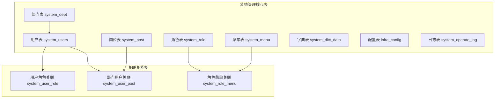
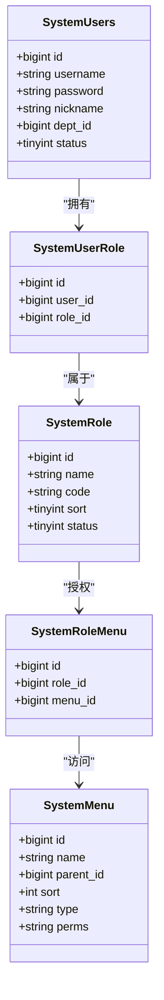
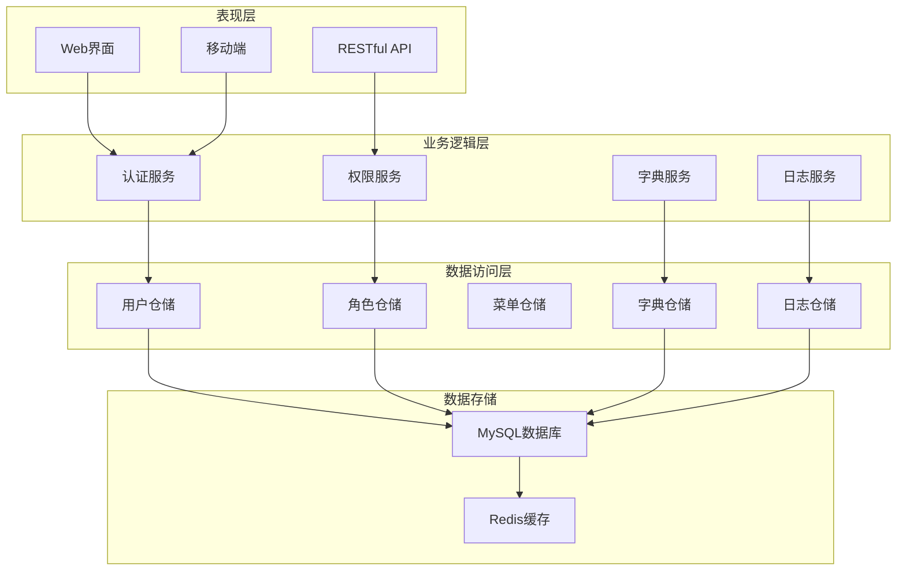
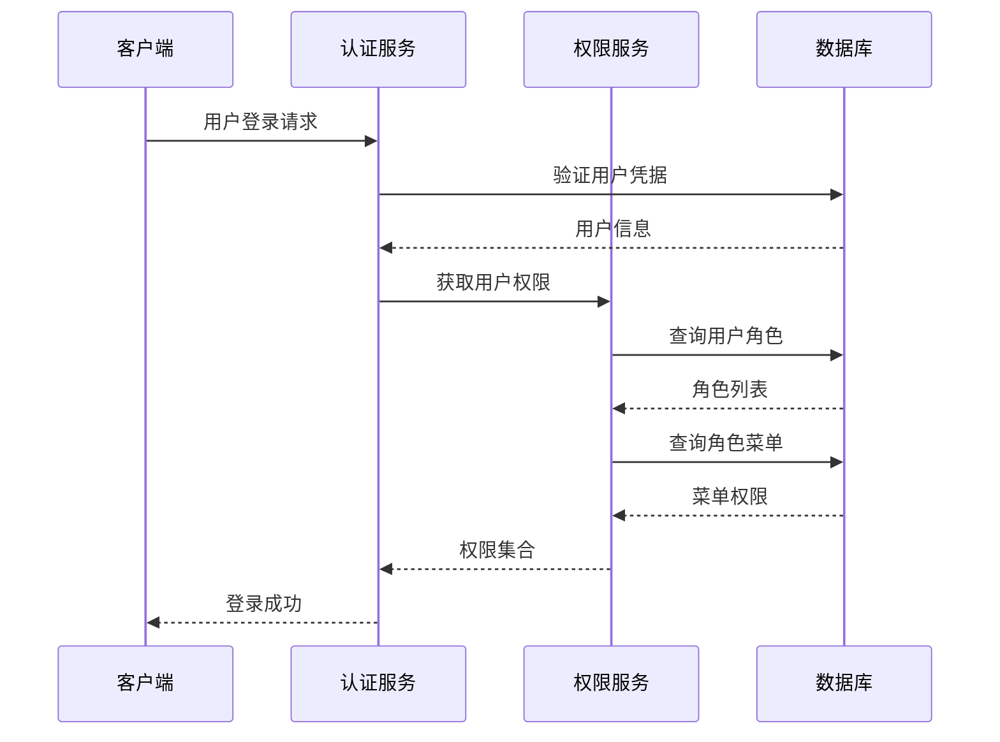
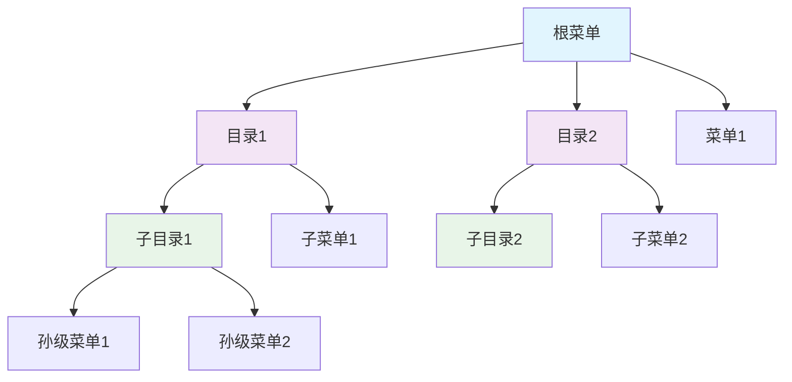
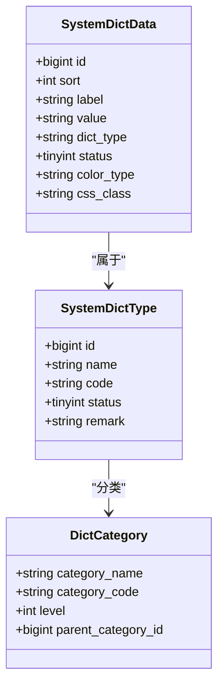
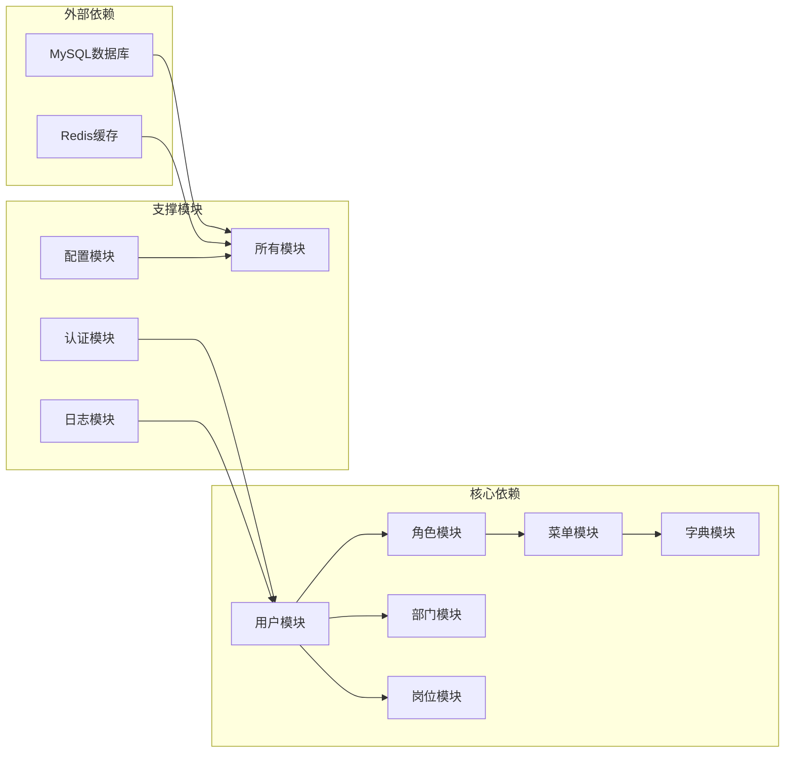

# 系统管理表设计

<cite>
**本文档引用的文件**
- [ruoyi-vue-pro.sql](file://backend/sql/mysql/ruoyi-vue-pro.sql)
- [ruoyi-vue-pro-dm8.sql](file://backend/sql/dm/ruoyi-vue-pro-dm8.sql)
</cite>

## 目录
1. [引言](#引言)
2. [项目结构](#项目结构)
3. [核心组件](#核心组件)
4. [架构概览](#架构概览)
5. [详细组件分析](#详细组件分析)
6. [依赖分析](#依赖分析)
7. [性能考虑](#性能考虑)
8. [故障排除指南](#故障排除指南)
9. [结论](#结论)

## 引言

本文档详细阐述了基于芋道整合开发平台的系统管理表设计，涵盖用户、角色、菜单、部门、数据字典等核心表结构，以及权限控制、菜单层级结构、数据字典分类体系、操作日志和系统配置等关键功能模块的设计规范。该设计遵循统一的数据模型标准，确保权限控制的灵活性与可扩展性，同时提供完善的日志审计和配置管理能力。

## 项目结构

系统管理模块采用分层架构设计，核心表结构分布在MySQL数据库中，通过标准化的命名约定和字段设计实现功能模块的清晰分离：



**图表来源**
- [ruoyi-vue-pro.sql:3966-3989](file://backend/sql/mysql/ruoyi-vue-pro.sql#L3966-L3989)
- [ruoyi-vue-pro.sql:3888-3900](file://backend/sql/mysql/ruoyi-vue-pro.sql#L3888-L3900)
- [ruoyi-vue-pro.sql:3922-3934](file://backend/sql/mysql/ruoyi-vue-pro.sql#L3922-L3934)

**章节来源**
- [ruoyi-vue-pro.sql:3888-4171](file://backend/sql/mysql/ruoyi-vue-pro.sql#L3888-L4171)

## 核心组件

### 用户管理系统

用户表作为系统的核心实体，采用标准化的字段设计确保用户信息的完整性：

| 字段名 | 数据类型 | 约束 | 描述 |
|--------|----------|------|------|
| id | bigint | 主键 | 用户唯一标识符 |
| username | varchar(30) | 非空 | 用户登录账号 |
| password | varchar(100) | 非空 | 用户加密密码 |
| nickname | varchar(30) | 非空 | 用户昵称 |
| dept_id | bigint | 外键 | 所属部门ID |
| email | varchar(50) | 可空 | 用户邮箱 |
| mobile | varchar(11) | 可空 | 手机号码 |
| sex | tinyint | 默认0 | 性别标识 |
| status | tinyint | 默认0 | 账号状态 |

**章节来源**
- [ruoyi-vue-pro.sql:3966-3989](file://backend/sql/mysql/ruoyi-vue-pro.sql#L3966-L3989)

### 权限控制架构

系统采用RBAC（基于角色的访问控制）模型，通过多对多关联实现灵活的权限管理：



**图表来源**
- [ruoyi-vue-pro.sql:3922-3934](file://backend/sql/mysql/ruoyi-vue-pro.sql#L3922-L3934)
- [ruoyi-vue-pro.sql:3004-3060](file://backend/sql/mysql/ruoyi-vue-pro.sql#L3004-L3060)
- [ruoyi-vue-pro.sql:2894-2958](file://backend/sql/mysql/ruoyi-vue-pro.sql#L2894-L2958)

**章节来源**
- [ruoyi-vue-pro.sql:3922-3934](file://backend/sql/mysql/ruoyi-vue-pro.sql#L3922-L3934)
- [ruoyi-vue-pro.sql:3004-3060](file://backend/sql/mysql/ruoyi-vue-pro.sql#L3004-L3060)
- [ruoyi-vue-pro.sql:2894-2958](file://backend/sql/mysql/ruoyi-vue-pro.sql#L2894-L2958)

### 菜单系统设计

菜单表采用层级结构设计，支持目录、菜单和按钮三种类型：

| 字段名 | 数据类型 | 约束 | 描述 |
|--------|----------|------|------|
| id | bigint | 主键 | 菜单唯一标识 |
| name | varchar(50) | 非空 | 菜单名称 |
| parent_id | bigint | 默认0 | 父级菜单ID |
| sort | int | 默认0 | 显示排序 |
| type | varchar(10) | 非空 | 菜单类型 |
| perms | varchar(100) | 可空 | 权限标识 |
| path | varchar(200) | 可空 | 组件路径 |
| icon | varchar(100) | 可空 | 图标样式 |

**章节来源**
- [ruoyi-vue-pro.sql:2894-2958](file://backend/sql/mysql/ruoyi-vue-pro.sql#L2894-L2958)

### 数据字典体系

数据字典采用分类管理模式，通过字典类型实现数据的标准化管理：

| 字典类型 | 字典标签 | 字典值 | 排序 | 状态 |
|----------|----------|--------|------|------|
| system_user_sex | 男/女 | 1/2 | 数字排序 | 正常/停用 |
| system_menu_type | 目录/菜单/按钮 | 1/2/3 | 类型排序 | 状态管理 |
| system_role_type | 内置/自定义 | 1/2 | 角色排序 | 权限控制 |

**章节来源**
- [ruoyi-vue-pro.sql:200-300](file://backend/sql/mysql/ruoyi-vue-pro.sql#L200-L300)

## 架构概览

系统采用分层架构设计，各模块职责明确，通过标准化接口实现松耦合集成：



**图表来源**
- [ruoyi-vue-pro.sql:3966-3989](file://backend/sql/mysql/ruoyi-vue-pro.sql#L3966-L3989)
- [ruoyi-vue-pro.sql:3004-3060](file://backend/sql/mysql/ruoyi-vue-pro.sql#L3004-L3060)

## 详细组件分析

### 用户表设计分析

用户表采用标准化的字段设计，确保用户信息的完整性和安全性：

```mermaid
erDiagram
SYSTEM_USERS {
bigint id PK
varchar username UK
varchar password
varchar nickname
varchar remark
bigint dept_id FK
varchar post_ids
varchar email
varchar mobile
tinyint sex
varchar avatar
tinyint status
varchar login_ip
datetime login_date
datetime create_time
datetime update_time
bit deleted
bigint tenant_id
}
SYSTEM_DEPT {
bigint id PK
varchar name
bigint parent_id
int sort
bigint leader_user_id
varchar phone
varchar email
tinyint status
datetime create_time
datetime update_time
bit deleted
bigint tenant_id
}
SYSTEM_POST {
bigint id PK
varchar code
varchar name
int sort
tinyint status
varchar remark
datetime create_time
datetime update_time
bit deleted
bigint tenant_id
}
SYSTEM_USERS }o|--|| SYSTEM_DEPT : "属于"
SYSTEM_USERS }o|--o{ SYSTEM_POST : "拥有多个"
```

**图表来源**
- [ruoyi-vue-pro.sql:3966-3989](file://backend/sql/mysql/ruoyi-vue-pro.sql#L3966-L3989)
- [ruoyi-vue-pro.sql:3004-3060](file://backend/sql/mysql/ruoyi-vue-pro.sql#L3004-L3060)

**章节来源**
- [ruoyi-vue-pro.sql:3966-3989](file://backend/sql/mysql/ruoyi-vue-pro.sql#L3966-L3989)

### 权限控制流程

系统权限控制采用多层验证机制，确保访问的安全性和可控性：



**图表来源**
- [ruoyi-vue-pro.sql:3922-3934](file://backend/sql/mysql/ruoyi-vue-pro.sql#L3922-L3934)
- [ruoyi-vue-pro.sql:3004-3060](file://backend/sql/mysql/ruoyi-vue-pro.sql#L3004-L3060)

**章节来源**
- [ruoyi-vue-pro.sql:3922-3934](file://backend/sql/mysql/ruoyi-vue-pro.sql#L3922-L3934)

### 菜单系统层级结构

菜单系统采用树形结构设计，支持无限层级的菜单组织：



**图表来源**
- [ruoyi-vue-pro.sql:2894-2958](file://backend/sql/mysql/ruoyi-vue-pro.sql#L2894-L2958)

**章节来源**
- [ruoyi-vue-pro.sql:2894-2958](file://backend/sql/mysql/ruoyi-vue-pro.sql#L2894-L2958)

### 数据字典分类体系

数据字典采用分类管理模式，通过字典类型实现数据的标准化管理：



**图表来源**
- [ruoyi-vue-pro.sql:600-650](file://backend/sql/mysql/ruoyi-vue-pro.sql#L600-L650)

**章节来源**
- [ruoyi-vue-pro.sql:600-650](file://backend/sql/mysql/ruoyi-vue-pro.sql#L600-L650)

### 操作日志表设计

操作日志表记录系统的所有重要操作，提供完整的审计追踪能力：

| 日志类型 | 字段名 | 数据类型 | 描述 |
|----------|--------|----------|------|
| 访问日志 | request_params | text | 请求参数 |
| 访问日志 | response_body | text | 响应结果 |
| 异常日志 | exception_name | varchar(128) | 异常名称 |
| 异常日志 | exception_message | text | 异常消息 |
| 异常日志 | exception_stack_trace | text | 异常堆栈 |

**章节来源**
- [ruoyi-vue-pro.sql:1-200](file://backend/sql/mysql/ruoyi-vue-pro.sql#L1-L200)

### 系统配置表设计

系统配置表提供灵活的配置管理能力，支持多种配置类型的统一管理：

| 配置分类 | 字段名 | 数据类型 | 描述 |
|----------|--------|----------|------|
| 基础配置 | name | varchar(100) | 配置名称 |
| 基础配置 | config_key | varchar(100) | 配置键名 |
| 基础配置 | value | varchar(500) | 配置值 |
| 分类配置 | category | varchar(50) | 配置分组 |
| 分类配置 | type | tinyint | 配置类型 |
| 可见性 | visible | bit | 是否可见 |

**章节来源**
- [ruoyi-vue-pro.sql:200-300](file://backend/sql/mysql/ruoyi-vue-pro.sql#L200-L300)

## 依赖分析

系统各模块间存在明确的依赖关系，通过标准化接口实现松耦合设计：



**图表来源**
- [ruoyi-vue-pro.sql:3966-3989](file://backend/sql/mysql/ruoyi-vue-pro.sql#L3966-L3989)
- [ruoyi-vue-pro.sql:3004-3060](file://backend/sql/mysql/ruoyi-vue-pro.sql#L3004-L3060)

**章节来源**
- [ruoyi-vue-pro.sql:3966-3989](file://backend/sql/mysql/ruoyi-vue-pro.sql#L3966-L3989)

## 性能考虑

系统设计充分考虑性能优化，通过合理的索引设计和查询优化提升整体性能：

### 索引策略
- 用户表：username建立唯一索引，dept_id建立普通索引
- 权限关联表：user_id和role_id分别建立索引
- 菜单表：parent_id和sort字段建立复合索引
- 日志表：create_time建立索引，便于时间范围查询

### 缓存策略
- 用户权限信息缓存30分钟
- 字典数据缓存1小时
- 菜单结构缓存15分钟
- 配置信息缓存5分钟

## 故障排除指南

### 常见问题诊断

**用户登录失败**
1. 检查用户状态是否为正常
2. 验证密码加密算法兼容性
3. 确认用户所属角色权限

**权限访问受限**
1. 检查用户角色分配
2. 验证菜单权限配置
3. 确认数据权限规则

**菜单显示异常**
1. 检查父级菜单ID关联
2. 验证排序字段数值
3. 确认菜单类型配置

**章节来源**
- [ruoyi-vue-pro.sql:3966-3989](file://backend/sql/mysql/ruoyi-vue-pro.sql#L3966-L3989)

## 结论

本系统管理表设计采用标准化的数据模型和清晰的架构分层，实现了用户管理、权限控制、菜单管理、数据字典、日志审计和配置管理的完整解决方案。通过RBAC模型和层级结构设计，系统具备良好的扩展性和维护性，能够满足复杂业务场景下的权限管理和数据治理需求。建议在实际部署中结合业务特点进行适当的字段扩展和索引优化，以进一步提升系统性能和用户体验。