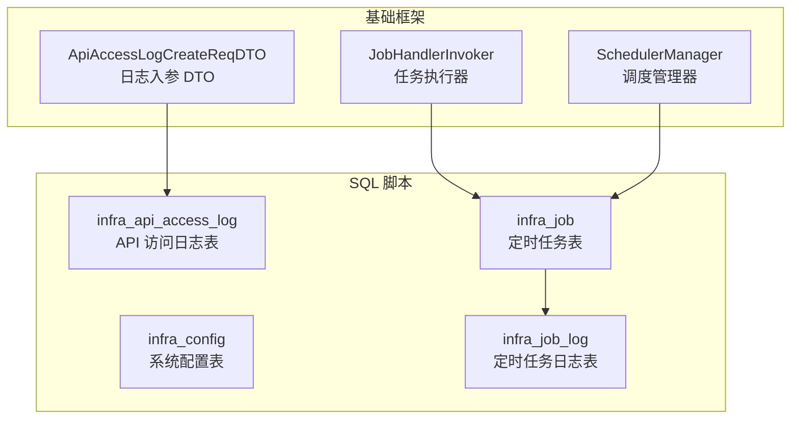
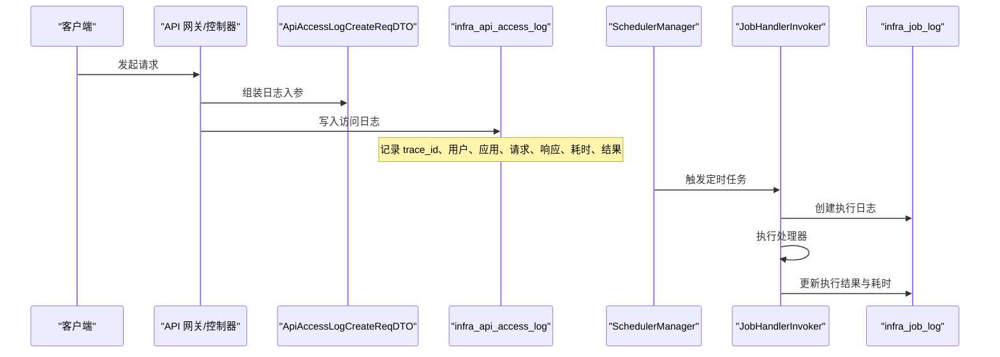
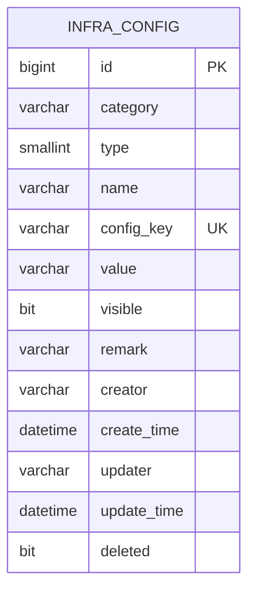
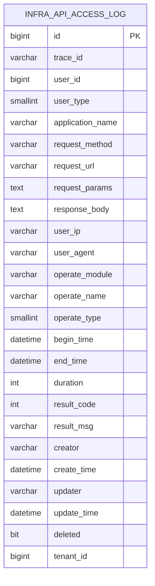
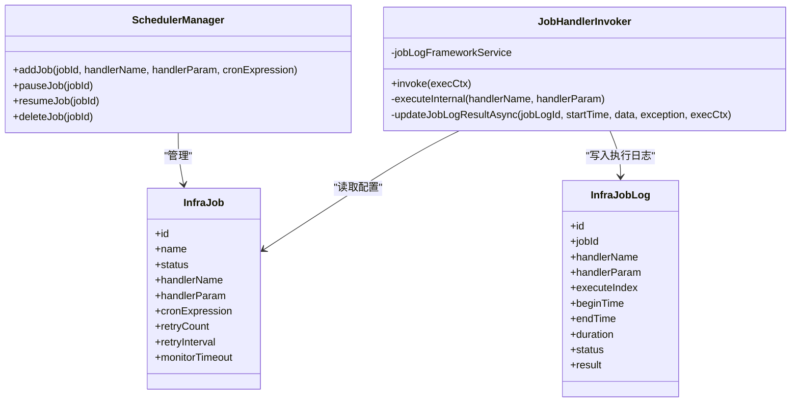
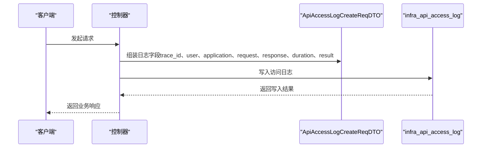
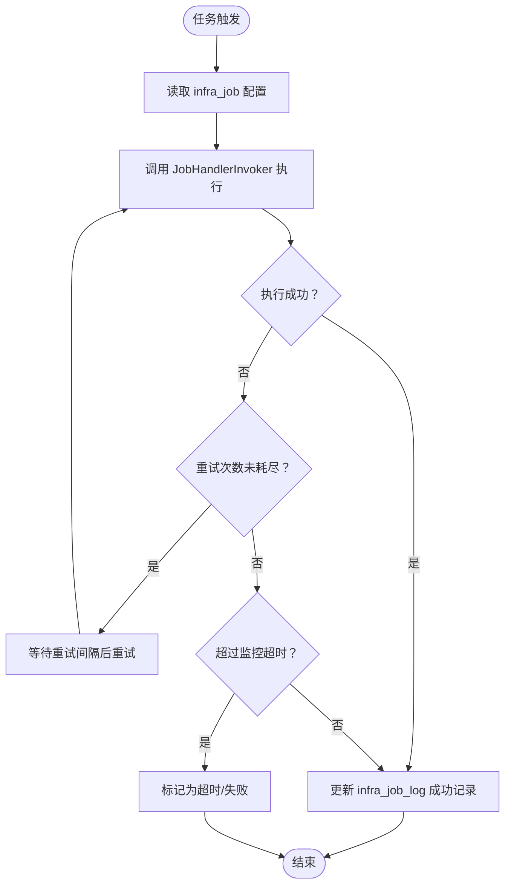
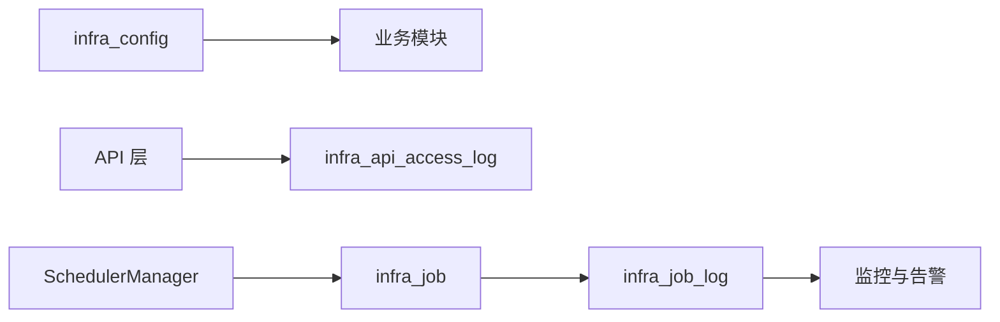

# 系统运营表设计

<cite>
**本文引用的文件**
- [ruoyi-vue-pro-dm8.sql](file://backend/sql/dm/ruoyi-vue-pro-dm8.sql)
- [ApiAccessLogCreateReqDTO.java](file://backend/yudao-framework/yudao-common/src/main/java/cn/iocoder/yudao/framework/common/biz/infra/logger/dto/ApiAccessLogCreateReqDTO.java)
- [JobHandlerInvoker.java](file://backend/yudao-framework/yudao-spring-boot-starter-job/src/main/java/cn/iocoder/yudao/framework/quartz/core/handler/JobHandlerInvoker.java)
- [SchedulerManager.java](file://backend/yudao-framework/yudao-spring-boot-starter-job/src/main/java/cn/iocoder/yudao/framework/quartz/core/scheduler/SchedulerManager.java)
</cite>

## 目录
1. [引言](#引言)
2. [项目结构](#项目结构)
3. [核心组件](#核心组件)
4. [架构总览](#架构总览)
5. [详细组件分析](#详细组件分析)
6. [依赖关系分析](#依赖关系分析)
7. [性能考量](#性能考量)
8. [故障排查指南](#故障排查指南)
9. [结论](#结论)
10. [附录](#附录)

## 引言
本文件面向系统运营与运维团队，系统化梳理并设计以下系统管理相关表的结构与运行机制：
- 系统配置表（infra_config）
- 操作日志表（infra_api_access_log）
- API 访问日志表（infra_api_access_log）
- 定时任务表（infra_job）

围绕配置管理字段（参数分类、参数类型、参数值等）、日志记录字段（操作类型、操作结果、耗时统计等）、任务调度字段（cron 表达式、执行状态、错误信息等），给出字段设计、索引策略、数据模型图与运维实践建议，并补充系统监控、性能指标采集、异常告警、热更新、分级日志、调度优化、安全审计、备份恢复与容量规划等最佳实践。

## 项目结构
本项目采用多模块分层架构，运营表结构主要分布在 SQL 脚本与基础框架模块中：
- SQL 脚本集中定义了 infra_config、infra_api_access_log、infra_job 等表结构与注释
- 日志 DTO 定义了 API 访问日志的入参结构
- 定时任务框架负责任务调度、执行与日志落库

图表来源
- [ruoyi-vue-pro-dm8.sql:12-71](file://backend/sql/dm/ruoyi-vue-pro-dm8.sql#L12-L71)
- [ruoyi-vue-pro-dm8.sql:250-283](file://backend/sql/dm/ruoyi-vue-pro-dm8.sql#L250-L283)
- [ruoyi-vue-pro-dm8.sql:440-475](file://backend/sql/dm/ruoyi-vue-pro-dm8.sql#L440-L475)
- [ApiAccessLogCreateReqDTO.java:14-103](file://backend/yudao-framework/yudao-common/src/main/java/cn/iocoder/yudao/framework/common/biz/infra/logger/dto/ApiAccessLogCreateReqDTO.java#L14-L103)
- [JobHandlerInvoker.java:34-88](file://backend/yudao-framework/yudao-spring-boot-starter-job/src/main/java/cn/iocoder/yudao/framework/quartz/core/handler/JobHandlerInvoker.java#L34-L88)
- [SchedulerManager.java:12-39](file://backend/yudao-framework/yudao-spring-boot-starter-job/src/main/java/cn/iocoder/yudao/framework/quartz/core/scheduler/SchedulerManager.java#L12-L39)

章节来源
- [ruoyi-vue-pro-dm8.sql:12-71](file://backend/sql/dm/ruoyi-vue-pro-dm8.sql#L12-L71)
- [ruoyi-vue-pro-dm8.sql:250-283](file://backend/sql/dm/ruoyi-vue-pro-dm8.sql#L250-L283)
- [ruoyi-vue-pro-dm8.sql:440-475](file://backend/sql/dm/ruoyi-vue-pro-dm8.sql#L440-L475)
- [ApiAccessLogCreateReqDTO.java:14-103](file://backend/yudao-framework/yudao-common/src/main/java/cn/iocoder/yudao/framework/common/biz/infra/logger/dto/ApiAccessLogCreateReqDTO.java#L14-L103)
- [JobHandlerInvoker.java:34-88](file://backend/yudao-framework/yudao-spring-boot-starter-job/src/main/java/cn/iocoder/yudao/framework/quartz/core/handler/JobHandlerInvoker.java#L34-L88)
- [SchedulerManager.java:12-39](file://backend/yudao-framework/yudao-spring-boot-starter-job/src/main/java/cn/iocoder/yudao/framework/quartz/core/scheduler/SchedulerManager.java#L12-L39)

## 核心组件
- 系统配置表（infra_config）
  - 字段要点：参数分组（category）、参数类型（type）、参数键名（config_key）、参数值（value）、可见性（visible）、备注（remark）、创建/更新者与时间、逻辑删除（deleted）
  - 设计目标：统一管理业务与系统级配置，支持按分组与类型检索，便于热更新与权限控制
- API 访问日志表（infra_api_access_log）
  - 字段要点：链路追踪编号（trace_id）、用户信息（user_id、user_type）、应用名（application_name）、请求信息（request_method、request_url、request_params）、响应体（response_body）、客户端信息（user_ip、user_agent）、操作信息（operate_module、operate_name、operate_type）、时间与耗时（begin_time、end_time、duration）、结果信息（result_code、result_msg）、租户隔离（tenant_id）
  - 设计目标：全链路可观测，支持按时间、用户、应用、模块等维度查询与分析
- 定时任务表（infra_job）
  - 字段要点：任务名称（name）、状态（status）、处理器名（handler_name）、处理器参数（handler_param）、Cron 表达式（cron_expression）、重试次数（retry_count）、重试间隔（retry_interval）、监控超时（monitor_timeout）、创建/更新者与时间、逻辑删除（deleted）
  - 设计目标：统一任务编排与执行，支持可视化管理、重试与超时监控

章节来源
- [ruoyi-vue-pro-dm8.sql:12-71](file://backend/sql/dm/ruoyi-vue-pro-dm8.sql#L12-L71)
- [ruoyi-vue-pro-dm8.sql:250-283](file://backend/sql/dm/ruoyi-vue-pro-dm8.sql#L250-L283)
- [ruoyi-vue-pro-dm8.sql:440-475](file://backend/sql/dm/ruoyi-vue-pro-dm8.sql#L440-L475)

## 架构总览
系统运营表在整体架构中的位置如下：
- 配置管理：通过 infra_config 提供集中配置，结合业务模块动态加载
- 日志采集：通过 API 请求拦截或服务内部埋点，构造 ApiAccessLogCreateReqDTO 并持久化至 infra_api_access_log
- 任务调度：通过 SchedulerManager 注册任务，JobHandlerInvoker 调用具体处理器并记录执行日志至 infra_job_log

图表来源
- [ApiAccessLogCreateReqDTO.java:14-103](file://backend/yudao-framework/yudao-common/src/main/java/cn/iocoder/yudao/framework/common/biz/infra/logger/dto/ApiAccessLogCreateReqDTO.java#L14-L103)
- [ruoyi-vue-pro-dm8.sql:12-71](file://backend/sql/dm/ruoyi-vue-pro-dm8.sql#L12-L71)
- [SchedulerManager.java:12-39](file://backend/yudao-framework/yudao-spring-boot-starter-job/src/main/java/cn/iocoder/yudao/framework/quartz/core/scheduler/SchedulerManager.java#L12-L39)
- [JobHandlerInvoker.java:34-88](file://backend/yudao-framework/yudao-spring-boot-starter-job/src/main/java/cn/iocoder/yudao/framework/quartz/core/handler/JobHandlerInvoker.java#L34-L88)
- [ruoyi-vue-pro-dm8.sql:500-536](file://backend/sql/dm/ruoyi-vue-pro-dm8.sql#L500-L536)

## 详细组件分析

### 系统配置表（infra_config）设计
- 字段设计与含义
  - 分组（category）：用于对配置进行逻辑分组，如 biz、url、ui 等
  - 类型（type）：配置项类型（如字符串、布尔、URL 等），便于前端渲染与校验
  - 键名（config_key）：全局唯一键，用于程序读取
  - 值（value）：配置的实际值
  - 可见性（visible）：控制是否在管理界面展示
  - 备注（remark）：配置用途说明
  - 创建/更新者与时间、逻辑删除（creator/updater/create_time/update_time/deleted）
- 索引与约束
  - 主键自增（id）
  - 建议在 config_key 上建立唯一索引，保证键的唯一性
- 运维要点
  - 支持热更新：通过监听 config_key 变更或定期刷新缓存
  - 权限控制：结合 visible 控制展示范围
  - 审计追踪：通过 creator/create_time/updater/update_time 追踪变更历史

图表来源
- [ruoyi-vue-pro-dm8.sql:250-283](file://backend/sql/dm/ruoyi-vue-pro-dm8.sql#L250-L283)

章节来源
- [ruoyi-vue-pro-dm8.sql:250-283](file://backend/sql/dm/ruoyi-vue-pro-dm8.sql#L250-L283)

### API 访问日志表（infra_api_access_log）设计
- 字段设计与含义
  - 链路追踪（trace_id）：跨服务调用追踪
  - 用户信息（user_id、user_type）：区分用户类型与登录态
  - 应用名（application_name）：服务标识
  - 请求信息（request_method、request_url、request_params）
  - 响应体（response_body）：可选，注意敏感信息脱敏
  - 客户端信息（user_ip、user_agent）
  - 操作信息（operate_module、operate_name、operate_type）
  - 时间与耗时（begin_time、end_time、duration）
  - 结果信息（result_code、result_msg）
  - 租户隔离（tenant_id）
- 索引与约束
  - 主键自增（id）
  - 建议在 create_time 上建立索引，支持按时间范围查询
- 运维要点
  - 分级日志：按 result_code 与 duration 设置不同级别
  - 清理策略：定期归档或删除过期日志
  - 安全审计：避免记录敏感参数与响应体；必要时脱敏

图表来源
- [ruoyi-vue-pro-dm8.sql:12-71](file://backend/sql/dm/ruoyi-vue-pro-dm8.sql#L12-L71)

章节来源
- [ruoyi-vue-pro-dm8.sql:12-71](file://backend/sql/dm/ruoyi-vue-pro-dm8.sql#L12-L71)
- [ApiAccessLogCreateReqDTO.java:14-103](file://backend/yudao-framework/yudao-common/src/main/java/cn/iocoder/yudao/framework/common/biz/infra/logger/dto/ApiAccessLogCreateReqDTO.java#L14-L103)

### 定时任务表（infra_job）设计
- 字段设计与含义
  - 名称（name）、状态（status）、处理器名（handler_name）、处理器参数（handler_param）
  - Cron 表达式（cron_expression）、重试次数（retry_count）、重试间隔（retry_interval）、监控超时（monitor_timeout）
  - 创建/更新者与时间、逻辑删除（creator/updater/create_time/update_time/deleted）
- 执行流程
  - SchedulerManager 注册任务，绑定 handler_name 与参数
  - JobHandlerInvoker 调用对应处理器执行，记录执行日志至 infra_job_log
  - 支持重试与超时监控，失败时记录异常信息
- 运维要点
  - 调度优化：合理设置 Cron 表达式，避免任务风暴
  - 监控告警：基于执行时长、失败率、超时触发告警
  - 清理策略：定期清理过期任务日志

图表来源
- [SchedulerManager.java:12-39](file://backend/yudao-framework/yudao-spring-boot-starter-job/src/main/java/cn/iocoder/yudao/framework/quartz/core/scheduler/SchedulerManager.java#L12-L39)
- [JobHandlerInvoker.java:34-88](file://backend/yudao-framework/yudao-spring-boot-starter-job/src/main/java/cn/iocoder/yudao/framework/quartz/core/handler/JobHandlerInvoker.java#L34-L88)
- [ruoyi-vue-pro-dm8.sql:440-475](file://backend/sql/dm/ruoyi-vue-pro-dm8.sql#L440-L475)
- [ruoyi-vue-pro-dm8.sql:500-536](file://backend/sql/dm/ruoyi-vue-pro-dm8.sql#L500-L536)

章节来源
- [ruoyi-vue-pro-dm8.sql:440-475](file://backend/sql/dm/ruoyi-vue-pro-dm8.sql#L440-L475)
- [ruoyi-vue-pro-dm8.sql:500-536](file://backend/sql/dm/ruoyi-vue-pro-dm8.sql#L500-L536)
- [JobHandlerInvoker.java:34-88](file://backend/yudao-framework/yudao-spring-boot-starter-job/src/main/java/cn/iocoder/yudao/framework/quartz/core/handler/JobHandlerInvoker.java#L34-L88)
- [SchedulerManager.java:12-39](file://backend/yudao-framework/yudao-spring-boot-starter-job/src/main/java/cn/iocoder/yudao/framework/quartz/core/scheduler/SchedulerManager.java#L12-L39)

### 日志处理流程（API 访问日志）

图表来源
- [ApiAccessLogCreateReqDTO.java:14-103](file://backend/yudao-framework/yudao-common/src/main/java/cn/iocoder/yudao/framework/common/biz/infra/logger/dto/ApiAccessLogCreateReqDTO.java#L14-L103)
- [ruoyi-vue-pro-dm8.sql:12-71](file://backend/sql/dm/ruoyi-vue-pro-dm8.sql#L12-L71)

章节来源
- [ApiAccessLogCreateReqDTO.java:14-103](file://backend/yudao-framework/yudao-common/src/main/java/cn/iocoder/yudao/framework/common/biz/infra/logger/dto/ApiAccessLogCreateReqDTO.java#L14-L103)
- [ruoyi-vue-pro-dm8.sql:12-71](file://backend/sql/dm/ruoyi-vue-pro-dm8.sql#L12-L71)

### 任务调度流程（定时任务）

图表来源
- [ruoyi-vue-pro-dm8.sql:440-475](file://backend/sql/dm/ruoyi-vue-pro-dm8.sql#L440-L475)
- [ruoyi-vue-pro-dm8.sql:500-536](file://backend/sql/dm/ruoyi-vue-pro-dm8.sql#L500-L536)
- [JobHandlerInvoker.java:34-88](file://backend/yudao-framework/yudao-spring-boot-starter-job/src/main/java/cn/iocoder/yudao/framework/quartz/core/handler/JobHandlerInvoker.java#L34-L88)

章节来源
- [ruoyi-vue-pro-dm8.sql:440-475](file://backend/sql/dm/ruoyi-vue-pro-dm8.sql#L440-L475)
- [ruoyi-vue-pro-dm8.sql:500-536](file://backend/sql/dm/ruoyi-vue-pro-dm8.sql#L500-L536)
- [JobHandlerInvoker.java:34-88](file://backend/yudao-framework/yudao-spring-boot-starter-job/src/main/java/cn/iocoder/yudao/framework/quartz/core/handler/JobHandlerInvoker.java#L34-L88)

## 依赖关系分析
- 配置表（infra_config）被业务模块通过统一配置中心或缓存读取，降低数据库压力
- 日志表（infra_api_access_log）由 API 层统一收集，减少业务代码侵入
- 任务表（infra_job）与任务日志表（infra_job_log）配合，形成完整的任务生命周期管理

图表来源
- [ruoyi-vue-pro-dm8.sql:250-283](file://backend/sql/dm/ruoyi-vue-pro-dm8.sql#L250-L283)
- [ruoyi-vue-pro-dm8.sql:12-71](file://backend/sql/dm/ruoyi-vue-pro-dm8.sql#L12-L71)
- [ruoyi-vue-pro-dm8.sql:440-475](file://backend/sql/dm/ruoyi-vue-pro-dm8.sql#L440-L475)
- [ruoyi-vue-pro-dm8.sql:500-536](file://backend/sql/dm/ruoyi-vue-pro-dm8.sql#L500-L536)
- [SchedulerManager.java:12-39](file://backend/yudao-framework/yudao-spring-boot-starter-job/src/main/java/cn/iocoder/yudao/framework/quartz/core/scheduler/SchedulerManager.java#L12-L39)

章节来源
- [ruoyi-vue-pro-dm8.sql:250-283](file://backend/sql/dm/ruoyi-vue-pro-dm8.sql#L250-L283)
- [ruoyi-vue-pro-dm8.sql:12-71](file://backend/sql/dm/ruoyi-vue-pro-dm8.sql#L12-L71)
- [ruoyi-vue-pro-dm8.sql:440-475](file://backend/sql/dm/ruoyi-vue-pro-dm8.sql#L440-L475)
- [ruoyi-vue-pro-dm8.sql:500-536](file://backend/sql/dm/ruoyi-vue-pro-dm8.sql#L500-L536)
- [SchedulerManager.java:12-39](file://backend/yudao-framework/yudao-spring-boot-starter-job/src/main/java/cn/iocoder/yudao/framework/quartz/core/scheduler/SchedulerManager.java#L12-L39)

## 性能考量
- 索引策略
  - infra_api_access_log：在 create_time 建立索引，支持按天/小时范围查询
  - infra_config：在 config_key 建立唯一索引，提升读取效率
  - infra_job：在 cron_expression 与 status 建立索引，加速调度筛选
- 分页与分区
  - 日志表建议按时间分区或分表，避免单表膨胀
  - 大字段（如 request_params、response_body）建议压缩或外部存储
- 缓存与异步
  - 配置表支持本地缓存与定期刷新，降低热点读取压力
  - 日志写入采用异步批处理，减少阻塞
- 监控指标
  - QPS、P95/P99 延迟、错误率、重试率、任务执行时长与成功率

## 故障排查指南
- 配置异常
  - 现象：配置不生效或重复
  - 排查：确认 config_key 唯一性、可见性与逻辑删除状态
- 日志缺失
  - 现象：访问日志未记录
  - 排查：检查 API 层日志埋点、DTO 字段完整性、数据库写入权限
- 任务未执行
  - 现象：定时任务未触发
  - 排查：核对 infra_job 状态与 Cron 表达式、处理器是否存在、重试与超时配置
- 任务执行失败
  - 现象：任务日志显示失败
  - 排查：查看 infra_job_log 的 result 与异常堆栈，定位处理器逻辑问题

章节来源
- [ruoyi-vue-pro-dm8.sql:12-71](file://backend/sql/dm/ruoyi-vue-pro-dm8.sql#L12-L71)
- [ruoyi-vue-pro-dm8.sql:440-475](file://backend/sql/dm/ruoyi-vue-pro-dm8.sql#L440-L475)
- [ruoyi-vue-pro-dm8.sql:500-536](file://backend/sql/dm/ruoyi-vue-pro-dm8.sql#L500-L536)
- [JobHandlerInvoker.java:34-88](file://backend/yudao-framework/yudao-spring-boot-starter-job/src/main/java/cn/iocoder/yudao/framework/quartz/core/handler/JobHandlerInvoker.java#L34-L88)

## 结论
本文从表结构、字段设计、索引策略、执行流程与运维实践五个维度，系统化梳理了系统配置表、API 访问日志表与定时任务表的设计与运行机制。通过合理的索引与分区、异步写入与缓存、监控与告警体系，可有效支撑高并发场景下的系统运营与维护。

## 附录
- 系统配置热更新
  - 在业务模块中引入配置缓存，监听 config_key 变更或周期性拉取最新配置
- 日志分级管理
  - 按 result_code 与 duration 划分等级，分别写入不同表或通道
- 任务调度优化
  - 合理设置 Cron 表达式，避免任务重叠；启用重试与超时监控
- 监控告警配置
  - 关键指标：接口 P95/P99、任务失败率、重试率、数据库延迟
- 安全审计
  - 日志脱敏、最小化记录原则、权限控制与审计追踪
- 数据备份恢复
  - 增量/全量备份策略、归档与冷数据迁移、演练验证
- 容量规划
  - 基于日志增长趋势与任务规模评估存储与计算资源，预留扩展空间