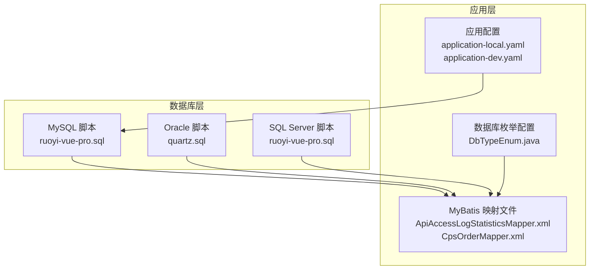
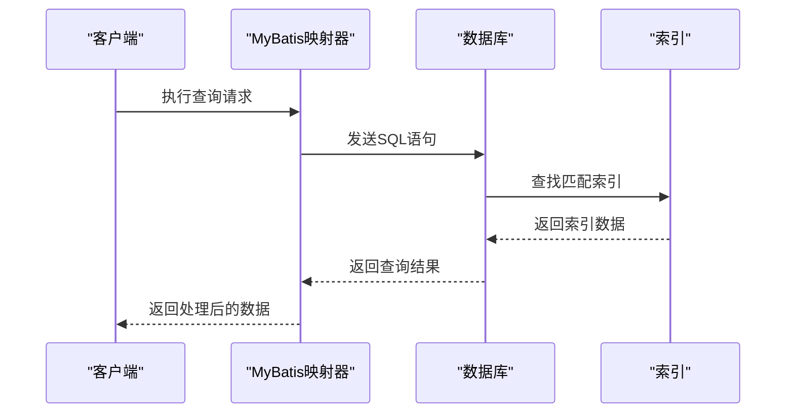
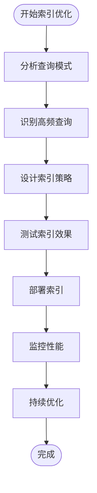
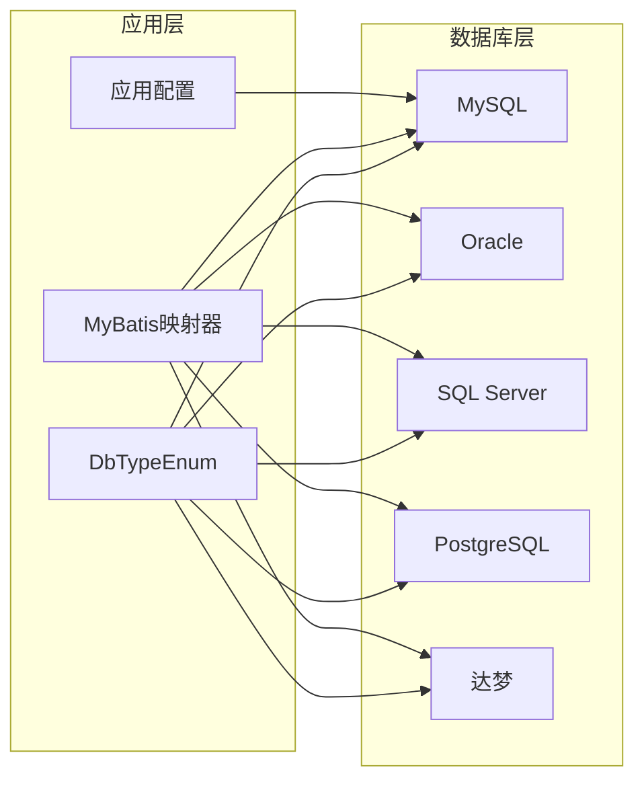

# 索引优化策略

<cite>
**本文档引用的文件**
- [ruoyi-vue-pro.sql](file://backend/sql/mysql/ruoyi-vue-pro.sql)
- [quartz.sql](file://backend/sql/oracle/quartz.sql)
- [ApiAccessLogStatisticsMapper.xml](file://backend/yudao-module-mall/yudao-module-statistics/src/main/resources/mapper/infra/ApiAccessLogStatisticsMapper.xml)
- [CpsOrderMapper.xml](file://backend/yudao-module-cps/yudao-module-cps-biz/src/main/resources/mapper/order/CpsOrderMapper.xml)
- [DbTypeEnum.java](file://backend/yudao-framework/yudao-spring-boot-starter-mybatis/src/main/java/cn/iocoder/yudao/framework/mybatis/core/enums/DbTypeEnum.java)
- [application-local.yaml](file://backend/yudao-server/src/main/resources/application-local.yaml)
- [application-dev.yaml](file://backend/yudao-server/src/main/resources/application-dev.yaml)
</cite>

## 目录
1. [简介](#简介)
2. [项目结构](#项目结构)
3. [核心组件](#核心组件)
4. [架构概览](#架构概览)
5. [详细组件分析](#详细组件分析)
6. [依赖关系分析](#依赖关系分析)
7. [性能考虑](#性能考虑)
8. [故障排除指南](#故障排除指南)
9. [结论](#结论)
10. [附录](#附录)

## 简介

本文件针对AgenticCPS项目的数据库索引优化策略进行全面的专业文档化。通过对项目中的数据库脚本、MyBatis映射文件、数据库枚举配置以及连接池配置的深入分析，总结了适用于多数据库环境（MySQL、Oracle、SQL Server等）的索引设计原则、类型选择策略、复合索引设计方法，以及查询性能分析和优化实践。

该文档旨在帮助开发者和DBA在实际生产环境中制定科学的索引策略，提升查询性能，降低维护成本，并确保在不同数据库厂商和版本下的兼容性与稳定性。

## 项目结构

AgenticCPS项目采用模块化架构，数据库相关的关键位置包括：

- SQL脚本目录：包含各数据库类型的初始化脚本和定时任务索引脚本
- MyBatis映射文件：定义了高频查询的SQL语句，是索引优化的重要依据
- 数据库枚举配置：统一管理不同数据库的产品名和方言特性
- 应用配置：连接池和数据源配置，影响索引使用的整体性能

**图表来源**
- [ruoyi-vue-pro.sql:20-52](file://backend/sql/mysql/ruoyi-vue-pro.sql#L20-L52)
- [quartz.sql:724-792](file://backend/sql/oracle/quartz.sql#L724-L792)
- [ApiAccessLogStatisticsMapper.xml:1-23](file://backend/yudao-module-mall/yudao-module-statistics/src/main/resources/mapper/infra/ApiAccessLogStatisticsMapper.xml#L1-L23)
- [CpsOrderMapper.xml:1-41](file://backend/yudao-module-cps/yudao-module-cps-biz/src/main/resources/mapper/order/CpsOrderMapper.xml#L1-L41)
- [DbTypeEnum.java:1-102](file://backend/yudao-framework/yudao-spring-boot-starter-mybatis/src/main/java/cn/iocoder/yudao/framework/mybatis/core/enums/DbTypeEnum.java#L1-L102)
- [application-local.yaml:33-50](file://backend/yudao-server/src/main/resources/application-local.yaml#L33-L50)
- [application-dev.yaml:36-54](file://backend/yudao-server/src/main/resources/application-dev.yaml#L36-L54)

**章节来源**
- [ruoyi-vue-pro.sql:20-52](file://backend/sql/mysql/ruoyi-vue-pro.sql#L20-L52)
- [quartz.sql:724-792](file://backend/sql/oracle/quartz.sql#L724-L792)
- [ApiAccessLogStatisticsMapper.xml:1-23](file://backend/yudao-module-mall/yudao-module-statistics/src/main/resources/mapper/infra/ApiAccessLogStatisticsMapper.xml#L1-L23)
- [CpsOrderMapper.xml:1-41](file://backend/yudao-module-cps/yudao-module-cps-biz/src/main/resources/mapper/order/CpsOrderMapper.xml#L1-L41)
- [DbTypeEnum.java:1-102](file://backend/yudao-framework/yudao-spring-boot-starter-mybatis/src/main/java/cn/iocoder/yudao/framework/mybatis/core/enums/DbTypeEnum.java#L1-L102)
- [application-local.yaml:33-50](file://backend/yudao-server/src/main/resources/application-local.yaml#L33-L50)
- [application-dev.yaml:36-54](file://backend/yudao-server/src/main/resources/application-dev.yaml#L36-L54)

## 核心组件

### 数据库索引现状分析

项目中已存在的索引包括：

1. **MySQL API访问日志索引**
   - 主键索引：`PRIMARY KEY (id)`
   - 时间索引：`INDEX idx_create_time (create_time ASC)`

2. **Oracle Quartz定时任务索引**
   - 作业索引：`IDX_QRTZ_T_J (SCHED_NAME, JOB_NAME, JOB_GROUP)`
   - 作业组索引：`IDX_QRTZ_T_JG (SCHED_NAME, JOB_GROUP)`
   - 下次触发时间索引：`IDX_QRTZ_T_NEXT_FIRE_TIME (SCHED_NAME, NEXT_FIRE_TIME)`
   - 触发器状态索引：`IDX_QRTZ_T_NFT_ST (SCHED_NAME, TRIGGER_STATE, NEXT_FIRE_TIME)`

3. **SQL Server API访问日志索引**
   - 时间索引：`CREATE INDEX idx_infra_api_access_log_01 ON infra_api_access_log (create_time)`

这些索引反映了项目对时间维度查询和定时任务管理的关注。

**章节来源**
- [ruoyi-vue-pro.sql:20-52](file://backend/sql/mysql/ruoyi-vue-pro.sql#L20-L52)
- [quartz.sql:724-792](file://backend/sql/oracle/quartz.sql#L724-L792)
- [ruoyi-vue-pro.sql:72-7467](file://backend/sql/sqlserver/ruoyi-vue-pro.sql#L72-L7467)

### MyBatis查询模式分析

通过分析映射文件，可以识别出高频查询模式：

1. **API访问日志统计查询**
   - 按用户类型和时间范围统计IP数量
   - 按用户类型和时间范围统计用户数量

2. **CPS订单统计查询**
   - 按日期统计平台订单数据
   - 实时看板数据统计

这些查询模式为索引设计提供了明确的方向。

**章节来源**
- [ApiAccessLogStatisticsMapper.xml:1-23](file://backend/yudao-module-mall/yudao-module-statistics/src/main/resources/mapper/infra/ApiAccessLogStatisticsMapper.xml#L1-L23)
- [CpsOrderMapper.xml:1-41](file://backend/yudao-module-cps/yudao-module-cps-biz/src/main/resources/mapper/order/CpsOrderMapper.xml#L1-L41)

### 数据库兼容性配置

DbTypeEnum统一管理了多种数据库的方言特性，包括：
- MySQL的FIND_IN_SET函数支持
- PostgreSQL的POSITION函数支持  
- SQL Server的CHARINDEX函数支持
- 达梦、人大金仓等国产数据库的支持

**章节来源**
- [DbTypeEnum.java:1-102](file://backend/yudao-framework/yudao-spring-boot-starter-mybatis/src/main/java/cn/iocoder/yudao/framework/mybatis/core/enums/DbTypeEnum.java#L1-L102)

## 架构概览

**图表来源**
- [ApiAccessLogStatisticsMapper.xml:5-20](file://backend/yudao-module-mall/yudao-module-statistics/src/main/resources/mapper/infra/ApiAccessLogStatisticsMapper.xml#L5-L20)
- [CpsOrderMapper.xml:7-38](file://backend/yudao-module-cps/yudao-module-cps-biz/src/main/resources/mapper/order/CpsOrderMapper.xml#L7-L38)

## 详细组件分析

### MySQL索引优化策略

#### 当前索引分析
MySQL项目中存在以下索引：
- 主键索引：自动为所有表的主键创建
- 时间索引：`idx_create_time`用于按时间范围查询

#### 优化建议

**图表来源**
- [ruoyi-vue-pro.sql:20-52](file://backend/sql/mysql/ruoyi-vue-pro.sql#L20-L52)

**章节来源**
- [ruoyi-vue-pro.sql:20-52](file://backend/sql/mysql/ruoyi-vue-pro.sql#L20-L52)

### Oracle索引优化策略

#### Quartz定时任务索引分析
Oracle Quartz脚本展示了专业的索引设计模式：

1. **复合索引设计**
   - `IDX_QRTZ_T_J`: (SCHED_NAME, JOB_NAME, JOB_GROUP)
   - `IDX_QRTZ_T_NFT_ST`: (SCHED_NAME, TRIGGER_STATE, NEXT_FIRE_TIME)

2. **索引属性优化**
   - LOGGING: 启用日志记录
   - VISIBLE: 索引可见
   - STORAGE参数优化: INITIAL、NEXT、MINEXTENTS等

3. **分区索引**
   - 使用LOCAL关键字创建本地分区索引

**章节来源**
- [quartz.sql:724-792](file://backend/sql/oracle/quartz.sql#L724-L792)

### SQL Server索引优化策略

#### 索引创建模式
SQL Server脚本展示了标准的索引创建语法：
- 使用CREATE INDEX语句
- 指定表名和列名
- 支持时间戳列的索引创建

**章节来源**
- [ruoyi-vue-pro.sql:72-7467](file://backend/sql/sqlserver/ruoyi-vue-pro.sql#L72-L7467)

### 复合索引设计原则

基于项目中的查询模式，提出以下复合索引设计原则：

#### 1. 前缀匹配原则
对于同时包含时间范围和状态过滤的查询，应优先考虑：
- `(create_time, deleted)` 或 `(deleted, create_time)`
- `(user_type, create_time)` 等组合

#### 2. 选择性原则
选择性高的列应该放在复合索引的前面：
- 平台代码、用户类型等离散度高的字段
- 避免在低选择性的字段上建立复合索引

#### 3. 查询覆盖原则
尽量让索引覆盖查询所需的全部字段，减少回表操作。

**章节来源**
- [ApiAccessLogStatisticsMapper.xml:5-20](file://backend/yudao-module-mall/yudao-module-statistics/src/main/resources/mapper/infra/ApiAccessLogStatisticsMapper.xml#L5-L20)
- [CpsOrderMapper.xml:7-38](file://backend/yudao-module-cps/yudao-module-cps-biz/src/main/resources/mapper/order/CpsOrderMapper.xml#L7-L38)

## 依赖关系分析

**图表来源**
- [DbTypeEnum.java:29-67](file://backend/yudao-framework/yudao-spring-boot-starter-mybatis/src/main/java/cn/iocoder/yudao/framework/mybatis/core/enums/DbTypeEnum.java#L29-L67)
- [ApiAccessLogStatisticsMapper.xml:1-23](file://backend/yudao-module-mall/yudao-module-statistics/src/main/resources/mapper/infra/ApiAccessLogStatisticsMapper.xml#L1-L23)
- [CpsOrderMapper.xml:1-41](file://backend/yudao-module-cps/yudao-module-cps-biz/src/main/resources/mapper/order/CpsOrderMapper.xml#L1-L41)

**章节来源**
- [DbTypeEnum.java:1-102](file://backend/yudao-framework/yudao-spring-boot-starter-mybatis/src/main/java/cn/iocoder/yudao/framework/mybatis/core/enums/DbTypeEnum.java#L1-L102)

## 性能考虑

### 连接池配置对索引性能的影响

应用配置展示了连接池的关键参数：

- **初始连接数**: 1
- **最大活跃连接**: 20  
- **最大等待时间**: 60000ms
- **空闲连接检测**: 60000ms
- **PreparedStatement缓存**: 启用

这些配置直接影响数据库连接的可用性和查询执行效率。

### 索引维护策略

#### 定期重建策略
1. **统计信息更新**
   - 定期更新表和索引统计信息
   - 监控索引选择性变化

2. **索引碎片整理**
   - 对高频率更新的表定期重建索引
   - 监控索引碎片率

3. **索引失效检测**
   - 监控未使用索引
   - 定期评估索引有效性

**章节来源**
- [application-local.yaml:33-50](file://backend/yudao-server/src/main/resources/application-local.yaml#L33-L50)
- [application-dev.yaml:36-54](file://backend/yudao-server/src/main/resources/application-dev.yaml#L36-L54)

## 故障排除指南

### 常见索引问题诊断

#### 1. 查询性能下降
- 检查执行计划变化
- 分析索引使用情况
- 评估索引选择性

#### 2. 索引失效
- 检查WHERE条件中的函数使用
- 分析数据类型不匹配
- 验证索引列的统计信息

#### 3. 索引维护成本过高
- 评估索引数量和维护开销
- 分析写入密集型表的索引策略
- 考虑分区表的索引设计

### 监控指标建议

#### 关键性能指标
1. **索引命中率**: 监控索引被使用的频率
2. **查询执行时间**: 分析慢查询的索引使用情况
3. **索引碎片率**: 评估索引维护需求
4. **统计信息准确性**: 确保查询优化器使用正确的统计信息

#### 监控工具
- 数据库自带的性能监控工具
- 慢查询日志分析
- 执行计划对比分析

## 结论

通过对AgenticCPS项目的数据库索引现状分析，可以得出以下结论：

1. **索引设计需要基于实际查询模式**：项目中的API访问日志和CPS订单统计查询为索引设计提供了明确的方向。

2. **多数据库兼容性重要**：DbTypeEnum的设计体现了对不同数据库方言的适配需求。

3. **索引优化是一个持续过程**：需要结合查询模式变化、数据分布变化和业务发展进行动态调整。

4. **性能监控不可或缺**：建立完善的监控体系是确保索引策略有效的基础。

建议在实际实施中，结合具体的业务场景和数据特点，制定个性化的索引优化方案，并建立相应的监控和维护机制。

## 附录

### 常用查询场景的索引设计方案

#### 1. 分页查询
- 建议索引：`(create_time DESC, id DESC)`
- 设计原理：覆盖ORDER BY和LIMIT条件

#### 2. 模糊搜索  
- 建议索引：根据具体字段设计，避免在搜索字段上使用函数
- 替代方案：使用全文索引或特定数据库的模糊匹配功能

#### 3. 范围查询
- 建议索引：`(date_column, other_columns)`
- 设计原则：将选择性高的列放在前面

#### 4. 多表关联查询
- 建议索引：在关联字段上建立索引
- 设计原则：遵循外键约束的最佳实践

### 索引维护最佳实践

1. **定期评估**：每季度评估索引使用情况
2. **自动化监控**：建立索引性能监控告警
3. **文档化管理**：维护索引设计文档和变更记录
4. **测试验证**：在测试环境验证索引变更效果