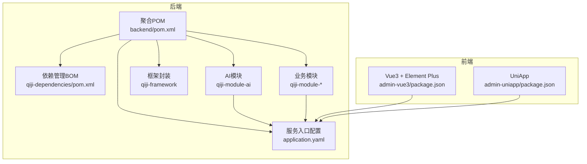
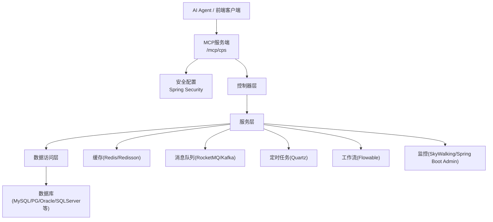
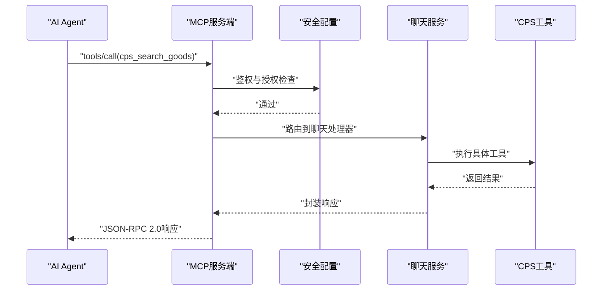
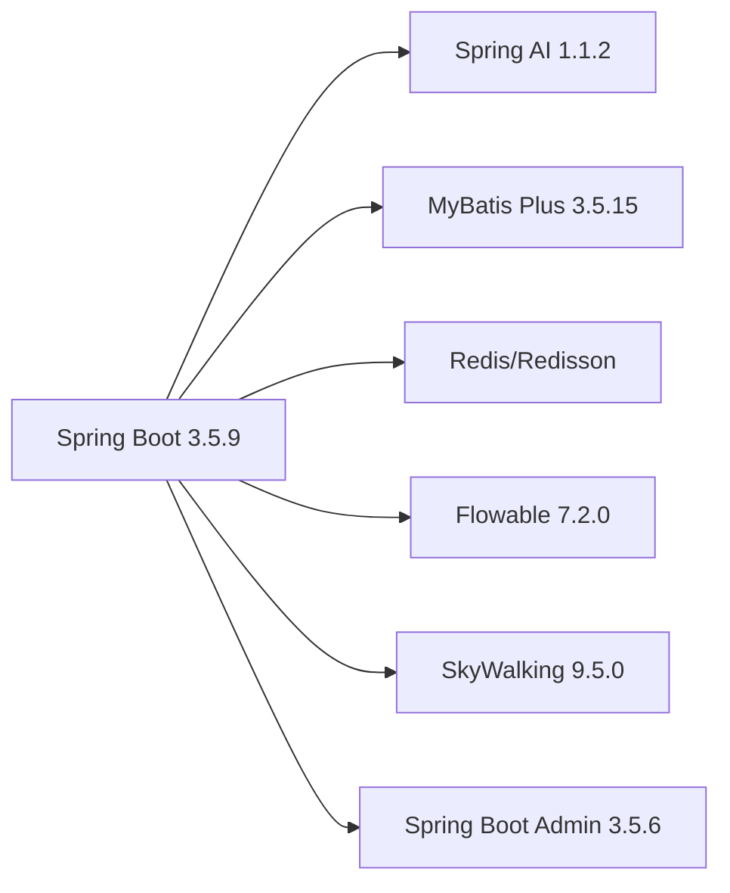

# 技术栈

<cite>
**本文引用的文件**
- [后端聚合POM](file://backend/pom.xml)
- [依赖管理BOM](file://backend/qiji-dependencies/pom.xml)
- [后端服务入口配置](file://backend/qiji-server/src/main/resources/application.yaml)
- [AI模块安全配置](file://backend/qiji-module-ai/src/main/java/com/qiji/cps/module/ai/framework/security/config/SecurityConfiguration.java)
- [AI聊天消息服务实现](file://backend/qiji-module-ai/src/main/java/com/qiji/cps/module/ai/service/chat/AiChatMessageServiceImpl.java)
- [AI模型工厂接口](file://backend/qiji-module-ai/src/main/java/com/qiji/cps/module/ai/framework/ai/core/model/AiModelFactory.java)
- [AI配置属性类](file://backend/qiji-module-ai/src/main/java/com/qiji/cps/module/ai/framework/ai/config/QijiAiProperties.java)
- [后端工程说明](file://backend/README.md)
- [项目总览说明](file://README.md)
- [AI代理指南](file://AGENTS.md)
- [前端Vue3项目配置](file://frontend/admin-vue3/package.json)
- [前端UniApp项目配置](file://frontend/admin-uniapp/package.json)
- [数据库查询测试示例](file://backend/qiji-module-infra/src/test/java/com/qiji/cps/module/infra/service/DefaultDatabaseQueryTest.java)
- [监控模块依赖](file://backend/qiji-framework/qiji-spring-boot-starter-monitor/pom.xml)
- [Spring Boot Admin服务端示例](file://frontend/admin-vue3/src/views/infra/server/index.vue)
- [OpenSpec配置](file://openspec/config.yaml)
</cite>

## 目录
1. [简介](#简介)
2. [项目结构](#项目结构)
3. [核心组件](#核心组件)
4. [架构总览](#架构总览)
5. [详细组件分析](#详细组件分析)
6. [依赖关系分析](#依赖关系分析)
7. [性能考虑](#性能考虑)
8. [故障排查指南](#故障排查指南)
9. [结论](#结论)
10. [附录](#附录)

## 简介
AgenticCPS是一个基于Vibe Coding理念的CPS（按销售付费）联盟返利系统，采用AI自主编程范式，后端基于Spring Boot 3.5.9与Spring AI 1.1.2构建，前端提供Vue 3 + Element Plus与UniApp双套方案，并通过MCP（Model Context Protocol）协议实现AI Agent零代码接入。项目强调高扩展性与低维护成本，支持多数据库与多中间件组合。

## 项目结构
项目采用前后端分离与模块化架构：
- 后端：多模块Maven聚合工程，包含依赖管理BOM、框架封装、业务模块与服务入口
- 前端：两套UI方案，分别面向Web与移动端
- AI集成：内置MCP服务端与多模型适配层
- 基础设施：监控、链路追踪、工作流与定时任务

**图表来源**
- [后端聚合POM:1-176](file://backend/pom.xml#L1-L176)
- [依赖管理BOM:1-721](file://backend/qiji-dependencies/pom.xml#L1-L721)
- [后端服务入口配置:1-362](file://backend/qiji-server/src/main/resources/application.yaml#L1-L362)

**章节来源**
- [后端聚合POM:1-176](file://backend/pom.xml#L1-L176)
- [依赖管理BOM:1-721](file://backend/qiji-dependencies/pom.xml#L1-L721)

## 核心组件
- 后端技术栈
  - Spring Boot 3.5.9：统一依赖与运行时
  - Spring AI 1.1.2：多模型接入与向量存储
  - MyBatis Plus 3.5.15：ORM与多数据源支持
  - Redis/Redisson：缓存与分布式锁
  - Quartz：定时任务调度
  - Flowable 7.2.0：工作流引擎
  - SkyWalking 9.5.0：链路追踪
  - Spring Boot Admin 3.5.6：服务监控
- 前端技术栈
  - Vue 3 + Element Plus：桌面端管理后台
  - UniApp：移动端与多端应用
- AI集成
  - MCP协议：AI Agent零代码接入
  - Vibe Coding：自然语言驱动的AI自主编程

**章节来源**
- [后端聚合POM:42-42](file://backend/pom.xml#L42-L42)
- [依赖管理BOM:20-27](file://backend/qiji-dependencies/pom.xml#L20-L27)
- [后端服务入口配置:146-266](file://backend/qiji-server/src/main/resources/application.yaml#L146-L266)
- [后端工程说明:46-105](file://backend/README.md#L46-L105)
- [项目总览说明:84-98](file://README.md#L84-L98)

## 架构总览
系统采用分层架构，后端通过模块化组织业务能力，前端通过两套UI覆盖不同终端，AI通过MCP协议桥接Agent与业务工具。

**图表来源**
- [AI模块安全配置:1-30](file://backend/qiji-module-ai/src/main/java/com/qiji/cps/module/ai/framework/security/config/SecurityConfiguration.java#L1-L30)
- [后端服务入口配置:146-266](file://backend/qiji-server/src/main/resources/application.yaml#L146-L266)
- [监控模块依赖:37-78](file://backend/qiji-framework/qiji-spring-boot-starter-monitor/pom.xml#L37-L78)

## 详细组件分析

### 后端核心模块
- 依赖管理BOM：集中管理Spring Boot、MyBatis Plus、Redisson、SkyWalking、Flowable等版本，确保模块间兼容
- 框架封装：提供Web、安全、Redis、定时任务、消息队列、监控等starter
- 业务模块：涵盖系统、会员、支付、商品、营销、报表、CPS等
- 服务入口：application.yaml集中配置数据库、缓存、AI、工作流、监控等

**章节来源**
- [依赖管理BOM:16-82](file://backend/qiji-dependencies/pom.xml#L16-L82)
- [后端服务入口配置:55-362](file://backend/qiji-server/src/main/resources/application.yaml#L55-L362)

### AI集成与MCP协议
- MCP服务端：在application.yaml中启用，提供SYNC模式的SSE与Streamable HTTP端点
- 安全配置：通过Spring Security放行MCP SSE与HTTP端点，结合API Key鉴权
- 工具注册：AI模块内置多个CPS工具（商品搜索、比价、推广链接生成、订单查询、返利汇总）
- 向量存储：同时支持Redis、Qdrant、Milvus三种向量存储后端

**图表来源**
- [后端服务入口配置:199-225](file://backend/qiji-server/src/main/resources/application.yaml#L199-L225)
- [AI模块安全配置:25-30](file://backend/qiji-module-ai/src/main/java/com/qiji/cps/module/ai/framework/security/config/SecurityConfiguration.java#L25-L30)
- [AI聊天消息服务实现:140-150](file://backend/qiji-module-ai/src/main/java/com/qiji/cps/module/ai/service/chat/AiChatMessageServiceImpl.java#L140-L150)

**章节来源**
- [后端服务入口配置:199-225](file://backend/qiji-server/src/main/resources/application.yaml#L199-L225)
- [AI模块安全配置:1-30](file://backend/qiji-module-ai/src/main/java/com/qiji/cps/module/ai/framework/security/config/SecurityConfiguration.java#L1-L30)
- [AI聊天消息服务实现:127-150](file://backend/qiji-module-ai/src/main/java/com/qiji/cps/module/ai/service/chat/AiChatMessageServiceImpl.java#L127-L150)
- [AI代理指南:182-188](file://AGENTS.md#L182-L188)

### 前端技术栈
- Vue 3 + Element Plus：桌面端管理后台，提供完善的UI组件与路由体系
- UniApp：移动端与多端应用，支持H5、小程序、App等多端统一开发

**章节来源**
- [前端Vue3项目配置:27-84](file://frontend/admin-vue3/package.json#L27-L84)
- [前端UniApp项目配置:99-127](file://frontend/admin-uniapp/package.json#L99-L127)

### 数据库与中间件支持
- 数据库：支持MySQL、PostgreSQL、Oracle、SQLServer等主流数据库
- 中间件：Redis/Redisson、RocketMQ、Kafka、RabbitMQ等
- 工作流：Flowable 7.2.0
- 定时任务：Quartz
- 监控：SkyWalking、Spring Boot Admin

**章节来源**
- [依赖管理BOM:24-31](file://backend/qiji-dependencies/pom.xml#L24-L31)
- [数据库查询测试示例:14-29](file://backend/qiji-module-infra/src/test/java/com/qiji/cps/module/infra/service/DefaultDatabaseQueryTest.java#L14-L29)
- [后端服务入口配置:55-65](file://backend/qiji-server/src/main/resources/application.yaml#L55-L65)

## 依赖关系分析
后端通过依赖管理BOM统一版本，模块间通过starter解耦，形成清晰的依赖层次。

**图表来源**
- [后端聚合POM:42-42](file://backend/pom.xml#L42-L42)
- [依赖管理BOM:20-49](file://backend/qiji-dependencies/pom.xml#L20-L49)

**章节来源**
- [后端聚合POM:42-42](file://backend/pom.xml#L42-L42)
- [依赖管理BOM:20-49](file://backend/qiji-dependencies/pom.xml#L20-L49)

## 性能考虑
- 缓存策略：Spring Cache使用Redis，合理设置TTL与序列化策略
- 数据库优化：MyBatis Plus逻辑删除、联表查询优化、多数据源读写分离
- 并发控制：Redisson分布式锁、Lock4j简化分布式锁使用
- 监控可观测性：SkyWalking链路追踪、Spring Boot Admin健康检查
- 定时任务：Quartz集群化与幂等设计，避免重复执行

## 故障排查指南
- MCP访问异常
  - 检查API Key配置与权限级别
  - 确认Spring Security放行MCP端点
  - 查看MCP访问日志表记录
- AI模型调用失败
  - 核对spring.ai配置与平台凭据
  - 检查向量存储后端连通性
- 监控不可用
  - 确认SkyWalking探针与Collector连通
  - 检查Spring Boot Admin客户端注册

**章节来源**
- [后端服务入口配置:146-266](file://backend/qiji-server/src/main/resources/application.yaml#L146-L266)
- [AI模块安全配置:25-30](file://backend/qiji-module-ai/src/main/java/com/qiji/cps/module/ai/framework/security/config/SecurityConfiguration.java#L25-L30)
- [监控模块依赖:37-78](file://backend/qiji-framework/qiji-spring-boot-starter-monitor/pom.xml#L37-L78)

## 结论
AgenticCPS通过Spring Boot 3.5.9与Spring AI 1.1.2构建现代化后端，配合Vue 3 + Element Plus与UniApp实现跨端体验，借助MCP协议与Vibe Coding理念实现AI Agent零代码接入与业务自动化。项目在数据库与中间件层面具备良好的兼容性与扩展性，结合SkyWalking与Spring Boot Admin提供完善的监控能力。

## 附录

### 版本与兼容性说明
- Java：17+
- Spring Boot：3.5.9
- Spring AI：1.1.2
- MyBatis Plus：3.5.15
- Flowable：7.2.0
- Redis/Redisson：按BOM版本
- SkyWalking：9.5.0
- Spring Boot Admin：3.5.6
- 前端：Vue 3.5.12、Element Plus 2.11.1、UniApp 3.0.0

**章节来源**
- [后端聚合POM:34-42](file://backend/pom.xml#L34-L42)
- [依赖管理BOM:16-82](file://backend/qiji-dependencies/pom.xml#L16-L82)
- [前端Vue3项目配置:74-74](file://frontend/admin-vue3/package.json#L74-L74)
- [前端UniApp项目配置:100-100](file://frontend/admin-uniapp/package.json#L100-L100)