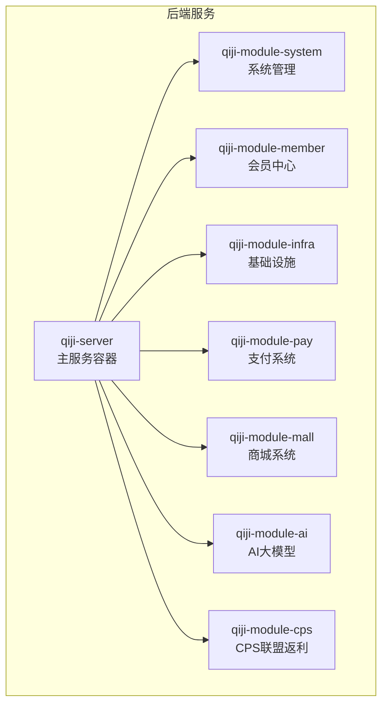
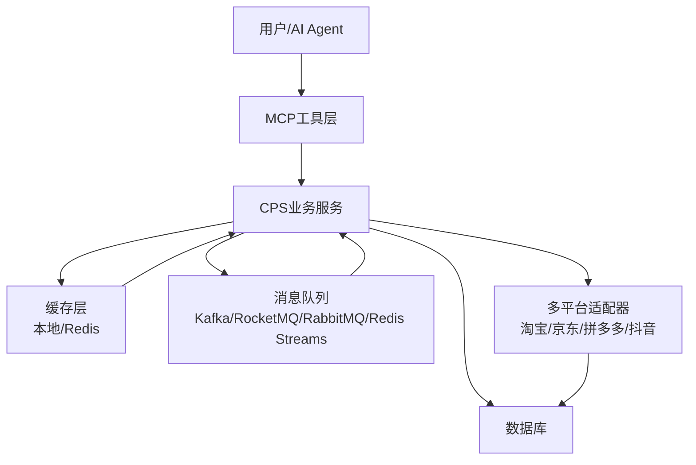
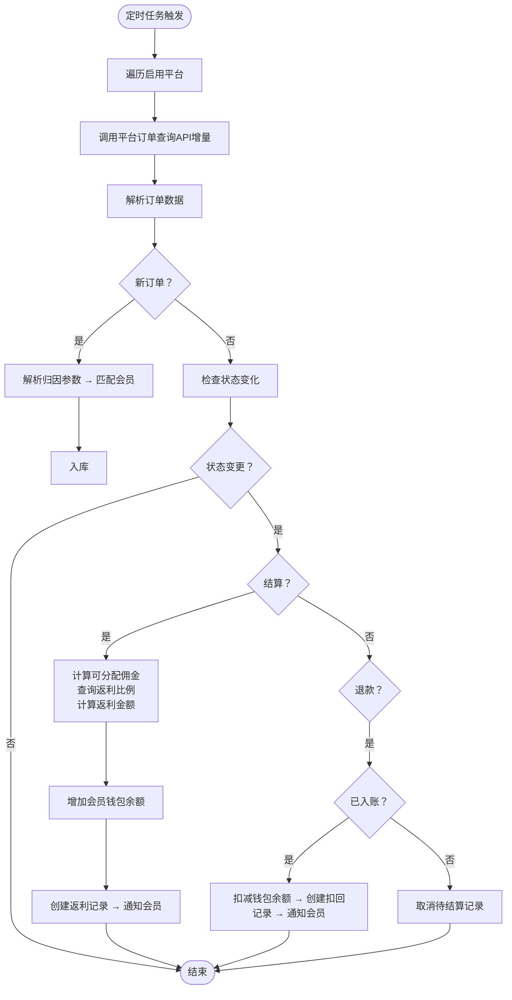
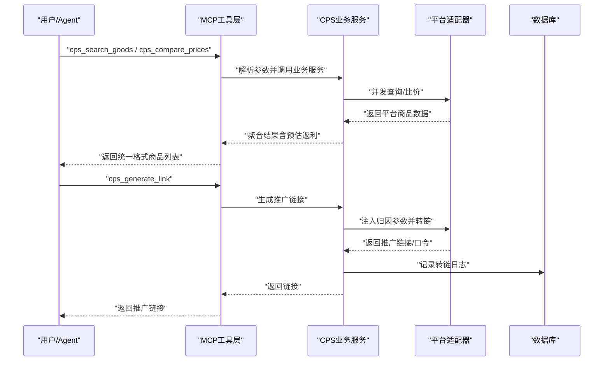
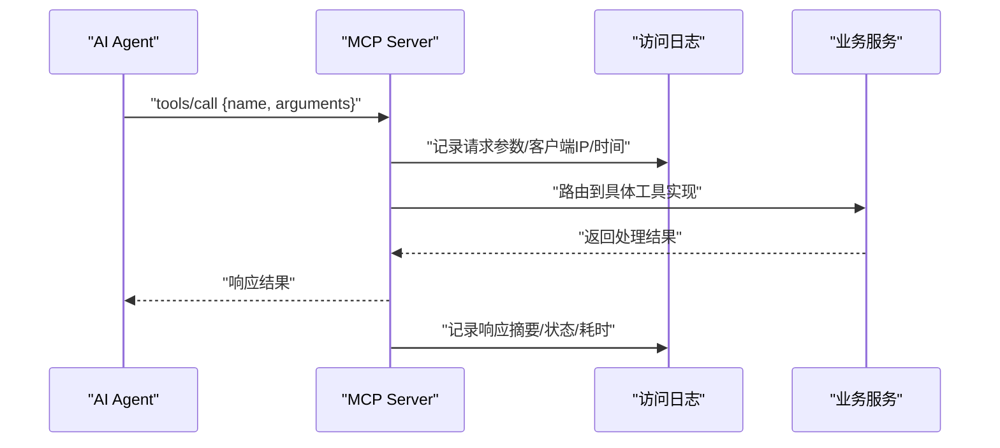
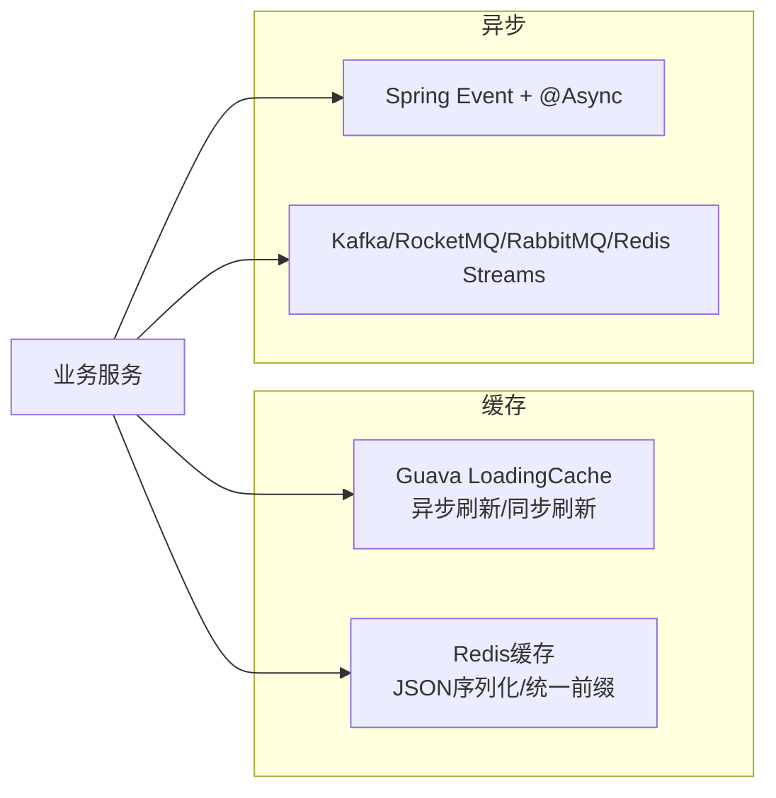
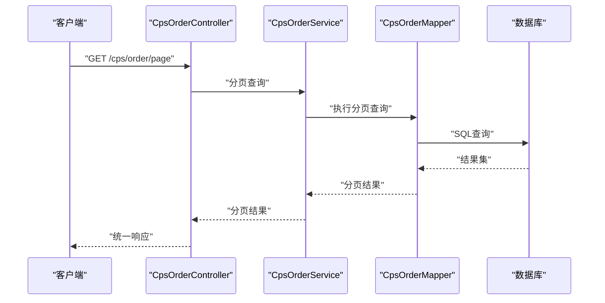
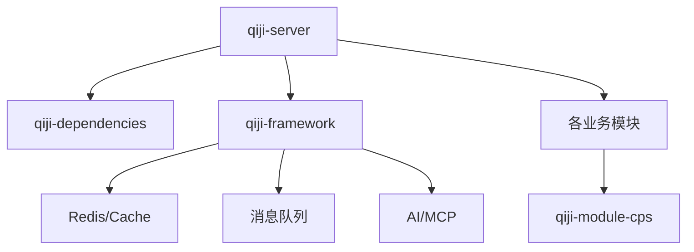

# 数据流设计

<cite>
**本文引用的文件**
- [README.md](file://README.md)
- [pom.xml](file://backend/pom.xml)
- [application.yaml](file://backend/qiji-server/src/main/resources/application.yaml)
- [CPS系统PRD文档.md](file://docs/CPS系统PRD文档.md)
- [CpsOrderController.java](file://backend/qiji-module-cps/qiji-module-cps-biz/src/main/java/com/qiji/cps/module/cps/controller/admin/order/CpsOrderController.java)
- [CpsOrderService.java](file://backend/qiji-module-cps/qiji-module-cps-biz/src/main/java/com/qiji/cps/module/cps/service/order/CpsOrderService.java)
- [CpsOrderServiceImpl.java](file://backend/qiji-module-cps/qiji-module-cps-biz/src/main/java/com/qiji/cps/module/cps/service/order/CpsOrderServiceImpl.java)
- [CpsOrderQueryRequest.java](file://backend/qiji-module-cps/qiji-module-cps-biz/src/main/java/com/qiji/cps/module/cps/client/dto/CpsOrderQueryRequest.java)
- [CpsMcpAccessLogDO.java](file://backend/qiji-module-cps/qiji-module-cps-biz/src/main/java/com/qiji/cps/module/cps/dal/dataobject/mcp/CpsMcpAccessLogDO.java)
- [CacheUtils.java](file://backend/qiji-framework/qiji-common/src/main/java/com/qiji/cps/framework/common/util/cache/CacheUtils.java)
- [QijiCacheAutoConfiguration.java](file://backend/qiji-framework/qiji-spring-boot-starter-redis/src/main/java/com/qiji/cps/framework/redis/config/QijiCacheAutoConfiguration.java)
- [RabbitMQWebSocketMessageConsumer.java](file://backend/qiji-framework/qiji-spring-boot-starter-websocket/src/main/java/com/qiji/cps/framework/websocket/core/sender/rabbitmq/RabbitMQWebSocketMessageConsumer.java)
- [RedisMQTemplate.java](file://backend/qiji-framework/qiji-spring-boot-starter-mq/src/main/java/com/qiji/cps/framework/mq/redis/core/RedisMQTemplate.java)
- [AbstractRedisChannelMessageListener.java](file://backend/qiji-framework/qiji-spring-boot-starter-mq/src/main/java/com/qiji/cps/framework/mq/redis/core/pubsub/AbstractRedisChannelMessageListener.java)
- [RedisPendingMessageResendJob.java](file://backend/qiji-framework/qiji-spring-boot-starter-mq/src/main/java/com/qiji/cps/framework/mq/redis/core/job/RedisPendingMessageResendJob.java)
- [SmsSendConsumer.java](file://backend/qiji-module-system/src/main/java/com/qiji/cps/module/system/mq/consumer/sms/SmsSendConsumer.java)
</cite>

## 目录
1. [简介](#简介)
2. [项目结构](#项目结构)
3. [核心组件](#核心组件)
4. [架构总览](#架构总览)
5. [详细组件分析](#详细组件分析)
6. [依赖分析](#依赖分析)
7. [性能考虑](#性能考虑)
8. [故障排查指南](#故障排查指南)
9. [结论](#结论)
10. [附录](#附录)

## 简介
本文件面向AgenticCPS项目，聚焦数据流设计与处理机制，覆盖CPS订单从平台获取到最终结算的完整数据流，以及AI工具（MCP）调用的数据流。文档还涵盖缓存策略、异步处理与消息队列等异步数据处理机制，并说明数据一致性、事务处理与错误恢复机制。

## 项目结构
AgenticCPS采用多模块Maven工程组织，后端主服务为qiji-server，核心业务模块包括系统管理、基础设施、会员中心、支付、商城、AI、CPS等。CPS模块进一步细分为API定义层与业务实现层，支撑多平台CPS接入、订单同步、返利结算与MCP工具接口。

**图表来源**
- [pom.xml:10-25](file://backend/pom.xml#L10-L25)

**章节来源**
- [pom.xml:10-25](file://backend/pom.xml#L10-L25)
- [README.md:267-284](file://README.md#L267-L284)

## 核心组件
- 订单管理组件：负责订单的保存/更新、分页查询、平台订单同步与状态变更处理。
- MCP工具层：提供商品搜索、跨平台比价、推广链接生成、订单查询、返利汇总等工具，支持AI Agent直接调用。
- 缓存与消息队列：基于Redis的本地缓存与分布式缓存，以及多种消息队列（Kafka、RocketMQ、RabbitMQ、Redis Streams）实现异步处理与广播。
- 配置与运行：application.yaml集中配置缓存、消息队列、AI与MCP等能力开关与参数。

**章节来源**
- [CpsOrderService.java:15-47](file://backend/qiji-module-cps/qiji-module-cps-biz/src/main/java/com/qiji/cps/module/cps/service/order/CpsOrderService.java#L15-L47)
- [application.yaml:120-225](file://backend/qiji-server/src/main/resources/application.yaml#L120-L225)

## 架构总览
系统围绕CPS业务域构建，前端通过MCP工具与后端交互，后端通过平台适配器对接多平台API，订单数据经由定时任务增量同步，结合缓存与消息队列实现高并发下的稳定处理。

**图表来源**
- [application.yaml:120-225](file://backend/qiji-server/src/main/resources/application.yaml#L120-L225)
- [README.md:185-209](file://README.md#L185-L209)

## 详细组件分析

### 1) CPS订单从平台获取到结算的数据流
- 订单同步：定时任务每5分钟遍历启用平台，调用平台订单查询API进行增量拉取，解析后入库或更新。
- 状态追踪：新订单解析归因参数匹配会员，已有订单检查状态变化，触发结算或扣回流程。
- 结算与入账：平台确认佣金后，计算可分配佣金与返利比例，增加会员钱包余额并创建返利记录，通知会员。
- 退款处理：若订单变为已退款，根据是否已入账分别执行扣减余额或取消待结算记录。

**图表来源**
- [CPS系统PRD文档.md:183-223](file://docs/CPS系统PRD文档.md#L183-L223)

**章节来源**
- [CPS系统PRD文档.md:183-223](file://docs/CPS系统PRD文档.md#L183-L223)

### 2) 商品搜索、价格比较、推广链接生成与订单追踪的数据流
- 商品搜索：识别URL/口令/关键词，按平台并发查询，聚合结果并按会员等级计算预估返利，排序返回。
- 跨平台比价：在统一入口调用各平台商品查询，比较价格与返利，输出最优方案。
- 推广链接生成：确定平台与商品ID，获取会员推广位，注入归因参数，调用平台转链API，记录转链日志。
- 订单追踪：会员复制链接下单，系统定时同步订单状态，追踪付款→收货→结算→入账。

**图表来源**
- [README.md:185-209](file://README.md#L185-L209)
- [application.yaml:199-225](file://backend/qiji-server/src/main/resources/application.yaml#L199-L225)

**章节来源**
- [README.md:185-209](file://README.md#L185-L209)
- [application.yaml:199-225](file://backend/qiji-server/src/main/resources/application.yaml#L199-L225)

### 3) MCP工具调用的数据流（从用户请求到业务服务）
- 请求入口：MCP Server接收AI Agent的tools/call请求，根据工具名路由到对应业务服务。
- 访问控制与日志：记录API Key、工具名、请求参数、耗时、状态与错误信息，支持权限与限流配置。
- 业务处理：调用具体业务服务（搜索、比价、链接生成、订单查询、返利汇总），返回结果。

**图表来源**
- [application.yaml:199-225](file://backend/qiji-server/src/main/resources/application.yaml#L199-L225)
- [CpsMcpAccessLogDO.java:22-62](file://backend/qiji-module-cps/qiji-module-cps-biz/src/main/java/com/qiji/cps/module/cps/dal/dataobject/mcp/CpsMcpAccessLogDO.java#L22-L62)

**章节来源**
- [application.yaml:199-225](file://backend/qiji-server/src/main/resources/application.yaml#L199-L225)
- [CpsMcpAccessLogDO.java:22-62](file://backend/qiji-module-cps/qiji-module-cps-biz/src/main/java/com/qiji/cps/module/cps/dal/dataobject/mcp/CpsMcpAccessLogDO.java#L22-L62)

### 4) 缓存策略与异步处理
- 本地缓存：基于Guava Cache构建LoadingCache，支持异步刷新与同步刷新，最大容量10000，过期时间可配置，适用于系统级与全局性数据。
- 分布式缓存：Redis缓存配置，JSON序列化，统一Key前缀，结合Spring Cache注解使用。
- 异步处理：Spring Event + @Async实现异步事件消费（如短信发送），降低请求链路阻塞。
- 消息队列：Kafka/RocketMQ/RabbitMQ/Redis Streams提供异步解耦与可靠投递，支持广播与集群消费，具备Pending消息重投机制。

**图表来源**
- [CacheUtils.java:15-61](file://backend/qiji-framework/qiji-common/src/main/java/com/qiji/cps/framework/common/util/cache/CacheUtils.java#L15-L61)
- [QijiCacheAutoConfiguration.java:29-55](file://backend/qiji-framework/qiji-spring-boot-starter-redis/src/main/java/com/qiji/cps/framework/redis/config/QijiCacheAutoConfiguration.java#L29-L55)
- [SmsSendConsumer.java:17-31](file://backend/qiji-module-system/src/main/java/com/qiji/cps/module/system/mq/consumer/sms/SmsSendConsumer.java#L17-L31)
- [RedisMQTemplate.java:17-41](file://backend/qiji-framework/qiji-spring-boot-starter-mq/src/main/java/com/qiji/cps/framework/mq/redis/core/RedisMQTemplate.java#L17-L41)

**章节来源**
- [CacheUtils.java:15-61](file://backend/qiji-framework/qiji-common/src/main/java/com/qiji/cps/framework/common/util/cache/CacheUtils.java#L15-L61)
- [QijiCacheAutoConfiguration.java:29-55](file://backend/qiji-framework/qiji-spring-boot-starter-redis/src/main/java/com/qiji/cps/framework/redis/config/QijiCacheAutoConfiguration.java#L29-L55)
- [SmsSendConsumer.java:17-31](file://backend/qiji-module-system/src/main/java/com/qiji/cps/module/system/mq/consumer/sms/SmsSendConsumer.java#L17-L31)
- [RedisMQTemplate.java:17-41](file://backend/qiji-framework/qiji-spring-boot-starter-mq/src/main/java/com/qiji/cps/framework/mq/redis/core/RedisMQTemplate.java#L17-L41)

### 5) 订单查询与分页接口的数据流
- 控制器接收分页请求，调用订单服务获取订单分页结果，返回统一响应结构。
- 订单服务封装平台无关的查询请求参数（时间范围、页码、每页大小、状态过滤等），驱动平台适配器与数据库访问。

**图表来源**
- [CpsOrderController.java:30-37](file://backend/qiji-module-cps/qiji-module-cps-biz/src/main/java/com/qiji/cps/module/cps/controller/admin/order/CpsOrderController.java#L30-L37)
- [CpsOrderService.java:35-47](file://backend/qiji-module-cps/qiji-module-cps-biz/src/main/java/com/qiji/cps/module/cps/service/order/CpsOrderService.java#L35-L47)
- [CpsOrderQueryRequest.java:10-48](file://backend/qiji-module-cps/qiji-module-cps-biz/src/main/java/com/qiji/cps/module/cps/client/dto/CpsOrderQueryRequest.java#L10-L48)

**章节来源**
- [CpsOrderController.java:30-37](file://backend/qiji-module-cps/qiji-module-cps-biz/src/main/java/com/qiji/cps/module/cps/controller/admin/order/CpsOrderController.java#L30-L37)
- [CpsOrderService.java:35-47](file://backend/qiji-module-cps/qiji-module-cps-biz/src/main/java/com/qiji/cps/module/cps/service/order/CpsOrderService.java#L35-L47)
- [CpsOrderQueryRequest.java:10-48](file://backend/qiji-module-cps/qiji-module-cps-biz/src/main/java/com/qiji/cps/module/cps/client/dto/CpsOrderQueryRequest.java#L10-L48)

### 6) 数据一致性、事务与错误恢复
- 事务处理：订单保存/更新采用幂等策略，基于平台订单号判断新增/更新，必要时使用事务确保状态一致性。
- 错误恢复：消息队列具备Pending消息重投机制，异常情况下重新投递并ACK确认，避免消息丢失。
- 缓存一致性：异步刷新与同步刷新并存，避免脏读；分布式缓存配合失效策略，保证最终一致。
- 平台适配：通过平台适配器抽象，统一订单查询与转链接口，减少平台差异带来的数据不一致风险。

**章节来源**
- [CpsOrderService.java:17-33](file://backend/qiji-module-cps/qiji-module-cps-biz/src/main/java/com/qiji/cps/module/cps/service/order/CpsOrderService.java#L17-L33)
- [RedisPendingMessageResendJob.java:85-99](file://backend/qiji-framework/qiji-spring-boot-starter-mq/src/main/java/com/qiji/cps/framework/mq/redis/core/job/RedisPendingMessageResendJob.java#L85-L99)

## 依赖分析
- 模块依赖：qiji-server聚合各业务模块，模块间通过API层与服务层解耦，避免循环依赖。
- 外部依赖：Spring Boot、MyBatis Plus、Redis、Kafka/RocketMQ/RabbitMQ、Quartz、SkyWalking等。
- 配置依赖：application.yaml集中管理缓存、消息队列、AI与MCP等外部系统配置。

**图表来源**
- [pom.xml:10-25](file://backend/pom.xml#L10-L25)
- [application.yaml:120-225](file://backend/qiji-server/src/main/resources/application.yaml#L120-L225)

**章节来源**
- [pom.xml:10-25](file://backend/pom.xml#L10-L25)
- [application.yaml:120-225](file://backend/qiji-server/src/main/resources/application.yaml#L120-L225)

## 性能考虑
- 搜索与比价：单平台搜索P99<2秒，多平台比价P99<5秒，转链生成<1秒，满足MCP工具调用性能指标。
- 订单同步：同步延迟<30分钟，平台结算后24小时内返利入账。
- 缓存命中：本地与Redis缓存结合，热点数据异步刷新，降低数据库压力。
- 异步解耦：消息队列与事件异步处理，提升吞吐与稳定性。

**章节来源**
- [README.md:369-379](file://README.md#L369-L379)

## 故障排查指南
- MCP访问日志：通过CpsMcpAccessLogDO记录工具调用详情，定位失败原因与耗时瓶颈。
- 消息队列重投：Redis Streams Pending消息重投作业定期扫描并重新投递，避免消息堆积与丢失。
- 事件异步：短信发送等异步事件消费失败不影响主流程，可在日志中定位异常。
- 平台适配：检查平台API返回与解析逻辑，确保订单状态与归因参数正确。

**章节来源**
- [CpsMcpAccessLogDO.java:22-62](file://backend/qiji-module-cps/qiji-module-cps-biz/src/main/java/com/qiji/cps/module/cps/dal/dataobject/mcp/CpsMcpAccessLogDO.java#L22-L62)
- [RedisPendingMessageResendJob.java:85-99](file://backend/qiji-framework/qiji-spring-boot-starter-mq/src/main/java/com/qiji/cps/framework/mq/redis/core/job/RedisPendingMessageResendJob.java#L85-L99)
- [SmsSendConsumer.java:17-31](file://backend/qiji-module-system/src/main/java/com/qiji/cps/module/system/mq/consumer/sms/SmsSendConsumer.java#L17-L31)

## 结论
AgenticCPS通过清晰的数据流设计与完善的异步处理机制，实现了从平台订单获取到返利结算的高效闭环，同时以MCP工具层为AI Agent提供即插即用的能力。缓存与消息队列的组合提升了系统性能与可靠性，事务与错误恢复机制保障了数据一致性与稳定性。

## 附录
- MCP工具清单：cps_search_goods、cps_compare_prices、cps_generate_link、cps_query_orders、cps_get_rebate_summary。
- 订单查询参数：支持按创建/付款/结算/更新时间查询，支持状态过滤与分页游标。

**章节来源**
- [README.md:185-209](file://README.md#L185-L209)
- [CpsOrderQueryRequest.java:10-48](file://backend/qiji-module-cps/qiji-module-cps-biz/src/main/java/com/qiji/cps/module/cps/client/dto/CpsOrderQueryRequest.java#L10-L48)