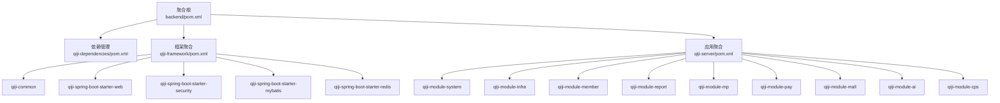
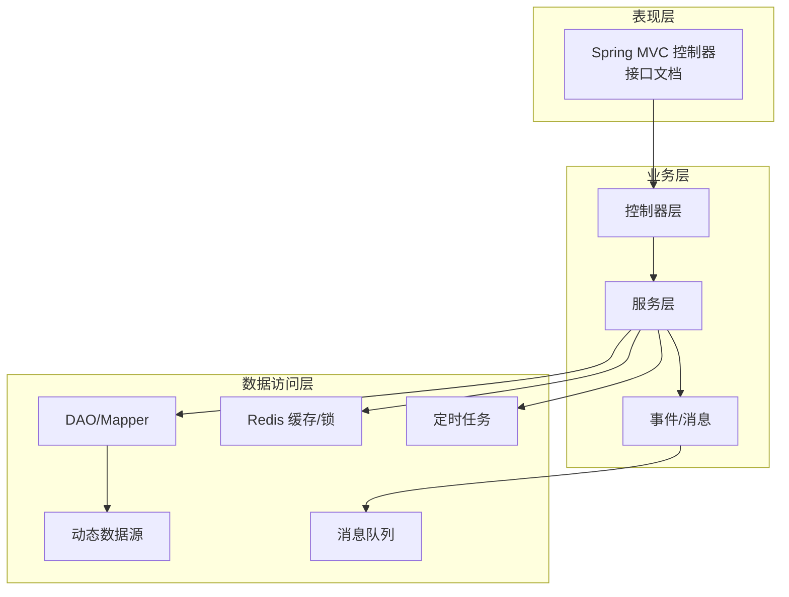
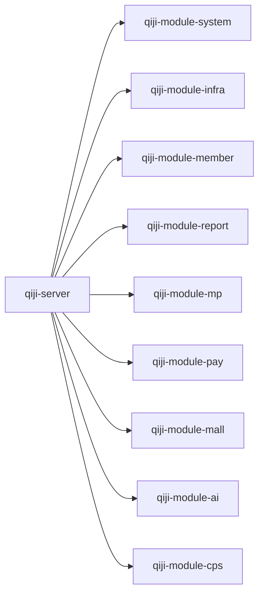
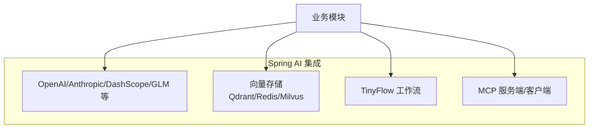
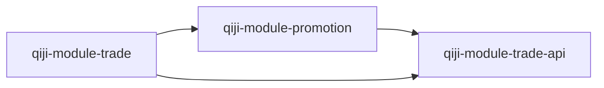
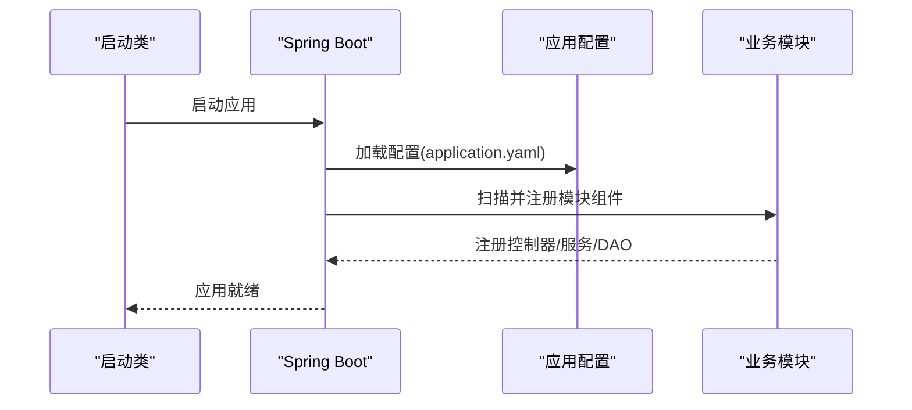
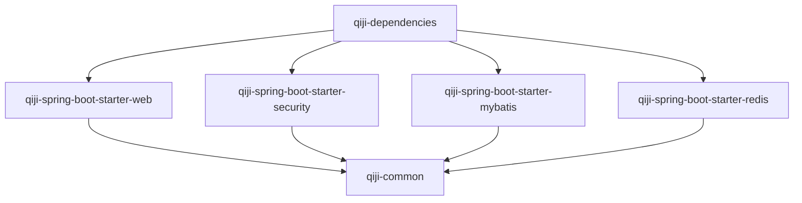

# 整体架构

<cite>
**本文引用的文件**
- [后端聚合根 POM](file://backend/pom.xml)
- [qiji-dependencies 依赖管理](file://backend/qiji-dependencies/pom.xml)
- [qiji-framework 聚合根 POM](file://backend/qiji-framework/pom.xml)
- [qiji-common 公共模块 POM](file://backend/qiji-framework/qiji-common/pom.xml)
- [qiji-spring-boot-starter-web POM](file://backend/qiji-framework/qiji-spring-boot-starter-web/pom.xml)
- [qiji-spring-boot-starter-mybatis POM](file://backend/qiji-framework/qiji-spring-boot-starter-mybatis/pom.xml)
- [qiji-spring-boot-starter-security POM](file://backend/qiji-framework/qiji-spring-boot-starter-security/pom.xml)
- [qiji-spring-boot-starter-redis POM](file://backend/qiji-framework/qiji-spring-boot-starter-redis/pom.xml)
- [qiji-server 应用聚合 POM](file://backend/qiji-server/pom.xml)
- [qiji-server 启动类](file://backend/qiji-server/src/main/java/com/qiji/cps/server/QijiServerApplication.java)
- [qiji-module-ai POM](file://backend/qiji-module-ai/pom.xml)
- [qiji-module-member POM](file://backend/qiji-module-member/pom.xml)
- [qiji-module-mall 聚合根 POM](file://backend/qiji-module-mall/pom.xml)
- [qiji-module-pay POM](file://backend/qiji-module-pay/pom.xml)
- [qiji-module-cps 聚合根 POM](file://backend/qiji-module-cps/pom.xml)
</cite>

## 目录
1. [引言](#引言)
2. [项目结构](#项目结构)
3. [核心组件](#核心组件)
4. [架构总览](#架构总览)
5. [详细组件分析](#详细组件分析)
6. [依赖分析](#依赖分析)
7. [性能考虑](#性能考虑)
8. [故障排查指南](#故障排查指南)
9. [结论](#结论)
10. [附录](#附录)

## 引言
AgenticCPS 是一个基于 Spring Boot 的多模块工程，采用 Maven 聚合管理，结合 Spring AI 能力与低代码思想，构建“表现层-业务层-数据访问层”清晰分层的混合架构。系统通过 qiji-framework 提供统一的基础设施与业务组件封装，qiji-server 作为应用聚合容器按需装配各业务模块，形成可插拔、可扩展、可维护的模块化体系。

## 项目结构
- 聚合根：backend/pom.xml 定义了多模块聚合，包含依赖管理、插件管理与仓库配置。
- 依赖管理：qiji-dependencies/pom.xml 统一管理第三方依赖版本，确保模块间一致性。
- 框架层：qiji-framework 聚合多个技术组件与业务组件，提供 Web、安全、缓存、定时任务、消息队列、Excel、监控、保护等开箱即用能力。
- 应用层：qiji-server 作为 Spring Boot 应用聚合，按需引入各业务模块，打包为可执行应用。
- 业务模块：涵盖系统管理、基础设施、会员、报表、微信公众号、支付、商城（商品/营销/交易/统计）、AI、CPS 等领域模块。

图表来源
- [后端聚合根 POM:10-25](file://backend/pom.xml#L10-L25)
- [qiji-dependencies 依赖管理:84-687](file://backend/qiji-dependencies/pom.xml#L84-L687)
- [qiji-framework 聚合根 POM:12-31](file://backend/qiji-framework/pom.xml#L12-L31)
- [qiji-server 应用聚合 POM:23-114](file://backend/qiji-server/pom.xml#L23-L114)

章节来源
- [后端聚合根 POM:1-176](file://backend/pom.xml#L1-L176)
- [qiji-dependencies 依赖管理:1-721](file://backend/qiji-dependencies/pom.xml#L1-L721)
- [qiji-framework 聚合根 POM:1-47](file://backend/qiji-framework/pom.xml#L1-L47)
- [qiji-server 应用聚合 POM:1-137](file://backend/qiji-server/pom.xml#L1-L137)

## 核心组件
- 框架组件（技术组件）
  - Web：统一异常、日志、脱敏、错误码、接口文档集成。
  - 安全：认证授权、操作日志、AOP 切面。
  - MyBatis：多数据源、动态数据源、联表查询、VO 翻译。
  - Redis：Redisson 封装、缓存配置。
  - 定时任务/消息队列/监控/保护/Excel/测试等。
- 业务组件（biz-*）
  - 租户、数据权限、IP 组件等业务域能力。
- 业务模块
  - 系统/基础设施/会员/报表/微信公众号/支付/商城/AI/CPS 等。

章节来源
- [qiji-common 公共模块 POM:18-147](file://backend/qiji-framework/qiji-common/pom.xml#L18-L147)
- [qiji-spring-boot-starter-web POM:18-82](file://backend/qiji-framework/qiji-spring-boot-starter-web/pom.xml#L18-L82)
- [qiji-spring-boot-starter-security POM:21-65](file://backend/qiji-framework/qiji-spring-boot-starter-security/pom.xml#L21-L65)
- [qiji-spring-boot-starter-mybatis POM:18-111](file://backend/qiji-framework/qiji-spring-boot-starter-mybatis/pom.xml#L18-L111)
- [qiji-spring-boot-starter-redis POM:18-42](file://backend/qiji-framework/qiji-spring-boot-starter-redis/pom.xml#L18-L42)

## 架构总览
系统采用“表现层-业务层-数据访问层”的分层架构：
- 表现层：基于 Spring MVC 的 RESTful API，集成 Knife4j/SpringDoc 提供接口文档与调试能力。
- 业务层：以模块化业务域为核心，模块内部遵循 controller -> service -> dal 分层；跨模块通过 API/DTO 与事件/消息解耦。
- 数据访问层：MyBatis Plus + 动态数据源 + 多数据库驱动 + 联表查询扩展；Redis 缓存与分布式锁；定时任务与消息队列支撑异步与解耦。

图表来源
- [qiji-spring-boot-starter-web POM:24-48](file://backend/qiji-framework/qiji-spring-boot-starter-web/pom.xml#L24-L48)
- [qiji-spring-boot-starter-mybatis POM:31-98](file://backend/qiji-framework/qiji-spring-boot-starter-mybatis/pom.xml#L31-L98)
- [qiji-spring-boot-starter-redis POM:24-38](file://backend/qiji-framework/qiji-spring-boot-starter-redis/pom.xml#L24-L38)

## 详细组件分析

### 模块化与职责划分
- qiji-framework：提供统一技术与业务组件，模块内聚、跨模块复用。
- qiji-server：应用聚合容器，按需装配业务模块，屏蔽模块间复杂依赖。
- 业务模块：
  - qiji-module-system / qiji-module-infra：系统与基础设施能力。
  - qiji-module-member / qiji-module-pay / qiji-module-mp：会员、支付、微信公众号。
  - qiji-module-mall：商品/营销/交易/统计，拆分 trade-api 避免循环依赖。
  - qiji-module-ai：集成 Spring AI 与多种大模型、向量存储、TinyFlow 工作流。
  - qiji-module-cps：CPS 联盟返利系统。

图表来源
- [qiji-server 应用聚合 POM:23-114](file://backend/qiji-server/pom.xml#L23-L114)
- [qiji-module-mall 聚合根 POM:20-33](file://backend/qiji-module-mall/pom.xml#L20-L33)
- [qiji-module-ai POM:28-76](file://backend/qiji-module-ai/pom.xml#L28-L76)
- [qiji-module-member POM:20-84](file://backend/qiji-module-member/pom.xml#L20-L84)
- [qiji-module-pay POM:21-81](file://backend/qiji-module-pay/pom.xml#L21-L81)
- [qiji-module-cps 聚合根 POM:21-24](file://backend/qiji-module-cps/pom.xml#L21-L24)

章节来源
- [qiji-server 应用聚合 POM:23-114](file://backend/qiji-server/pom.xml#L23-L114)
- [qiji-module-mall 聚合根 POM:20-33](file://backend/qiji-module-mall/pom.xml#L20-L33)
- [qiji-module-ai POM:28-76](file://backend/qiji-module-ai/pom.xml#L28-L76)
- [qiji-module-member POM:20-84](file://backend/qiji-module-member/pom.xml#L20-L84)
- [qiji-module-pay POM:21-81](file://backend/qiji-module-pay/pom.xml#L21-L81)
- [qiji-module-cps 聚合根 POM:21-24](file://backend/qiji-module-cps/pom.xml#L21-L24)

### Spring Boot + Spring AI + 低代码的混合架构
- Spring Boot：统一配置、自动装配、Actuator/监控、Admin 客户端。
- Spring AI：OpenAI/Azure/Ollama/通义/文心/Moonshot 等模型接入；向量存储（Qdrant/Redis/Milvus）；TinyFlow 工作流；MCP 服务端/客户端。
- 低代码：通过框架组件与模块化快速拼装业务功能，减少重复开发；接口文档与测试组件提升交付效率。

图表来源
- [qiji-module-ai POM:77-261](file://backend/qiji-module-ai/pom.xml#L77-L261)

章节来源
- [qiji-module-ai POM:21-26](file://backend/qiji-module-ai/pom.xml#L21-L26)

### 模块间依赖与循环依赖规避
- qiji-module-mall 中 trade 与 promotion 存在相互依赖风险，通过抽取 qiji-module-trade-api 作为共享 API 层，形成 trade -> promotion -> trade-api 的单向依赖链，消除循环依赖。

图表来源
- [qiji-module-mall 聚合根 POM:25-31](file://backend/qiji-module-mall/pom.xml#L25-L31)

章节来源
- [qiji-module-mall 聚合根 POM:25-31](file://backend/qiji-module-mall/pom.xml#L25-L31)

### 启动流程与装配
- qiji-server 作为 Spring Boot 应用，通过扫描属性装配模块与服务，按需启用各业务模块。

图表来源
- [qiji-server 启动类:16-24](file://backend/qiji-server/src/main/java/com/qiji/cps/server/QijiServerApplication.java#L16-L24)

章节来源
- [qiji-server 启动类:1-35](file://backend/qiji-server/src/main/java/com/qiji/cps/server/QijiServerApplication.java#L1-L35)

## 依赖分析
- 版本治理：qiji-dependencies 统一管理 Spring Boot、MyBatis、Redisson、RocketMQ、SkyWalking、JustAuth、Alipay SDK、Weixin Java SDK 等依赖版本，避免冲突。
- 模块依赖：qiji-server 通过选择性引入业务模块依赖实现“按需装配”，降低启动体积与编译时间。
- 框架组件依赖：各 starter 依赖 qiji-common 提供公共能力，避免重复引入。

图表来源
- [qiji-dependencies 依赖管理:84-687](file://backend/qiji-dependencies/pom.xml#L84-L687)
- [qiji-common 公共模块 POM:18-46](file://backend/qiji-framework/qiji-common/pom.xml#L18-L46)
- [qiji-spring-boot-starter-web POM:18-34](file://backend/qiji-framework/qiji-spring-boot-starter-web/pom.xml#L18-L34)
- [qiji-spring-boot-starter-security POM:21-43](file://backend/qiji-framework/qiji-spring-boot-starter-security/pom.xml#L21-L43)
- [qiji-spring-boot-starter-mybatis POM:18-30](file://backend/qiji-framework/qiji-spring-boot-starter-mybatis/pom.xml#L18-L30)
- [qiji-spring-boot-starter-redis POM:18-29](file://backend/qiji-framework/qiji-spring-boot-starter-redis/pom.xml#L18-L29)

章节来源
- [qiji-dependencies 依赖管理:84-687](file://backend/qiji-dependencies/pom.xml#L84-L687)
- [qiji-common 公共模块 POM:18-147](file://backend/qiji-framework/qiji-common/pom.xml#L18-L147)
- [qiji-spring-boot-starter-web POM:18-82](file://backend/qiji-framework/qiji-spring-boot-starter-web/pom.xml#L18-L82)
- [qiji-spring-boot-starter-security POM:21-65](file://backend/qiji-framework/qiji-spring-boot-starter-security/pom.xml#L21-L65)
- [qiji-spring-boot-starter-mybatis POM:18-111](file://backend/qiji-framework/qiji-spring-boot-starter-mybatis/pom.xml#L18-L111)
- [qiji-spring-boot-starter-redis POM:18-42](file://backend/qiji-framework/qiji-spring-boot-starter-redis/pom.xml#L18-L42)

## 性能考虑
- 启动优化：qiji-server 默认注释非必要模块依赖，仅在需要时开启，缩短启动时间。
- 编译优化：通过依赖管理与模块化拆分，减少全量编译范围。
- 数据访问：MyBatis Plus + 动态数据源 + 联表查询扩展，配合 Redis 缓存热点数据，降低数据库压力。
- 并发与限流：结合 Spring AI 与 TinyFlow 工作流，合理拆分长耗时任务，避免阻塞主线程。
- 监控与追踪：SkyWalking、Spring Boot Admin、Actuator 提供可观测性，便于定位性能瓶颈。

## 故障排查指南
- 启动失败
  - 检查 qiji-server 启动类扫描路径与模块依赖是否正确装配。
  - 确认 application.yaml 配置项与环境变量一致。
- 依赖冲突
  - 使用 qiji-dependencies 统一版本，避免第三方库版本不一致导致的类冲突。
- 模块循环依赖
  - 遵循 trade -> promotion -> trade-api 的依赖链，避免直接互相依赖。
- AI 模块问题
  - 确认 Spring AI Starter 与向量存储、TinyFlow 依赖未与 WebFlux 冲突（项目使用 Spring MVC）。

章节来源
- [qiji-server 启动类:16-24](file://backend/qiji-server/src/main/java/com/qiji/cps/server/QijiServerApplication.java#L16-L24)
- [qiji-module-mall 聚合根 POM:25-31](file://backend/qiji-module-mall/pom.xml#L25-L31)
- [qiji-module-ai POM:199-221](file://backend/qiji-module-ai/pom.xml#L199-L221)

## 结论
AgenticCPS 通过 Maven 多模块与 qiji-framework 的组件化设计，实现了表现层-业务层-数据访问层的清晰分离，并以 Spring Boot + Spring AI + 低代码理念提升了研发效率与系统弹性。模块化与依赖管理确保了可维护性与可扩展性，适合在中大型业务场景中持续演进。

## 附录
- 架构决策与权衡
  - 模块化 vs 单体：通过模块化降低耦合，但需注意模块间依赖与循环依赖的规避。
  - Spring AI 集成：以 Starter 形式接入多模型与向量存储，兼顾灵活性与一致性。
  - 低代码：通过框架组件与 API/DTO 规范，加速业务拼装，减少重复造轮子。
- 微服务化特点与模块化优势
  - 模块化为未来拆分奠定基础；通过清晰的 API 边界与事件/消息解耦，逐步过渡到微服务。