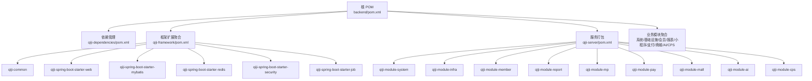
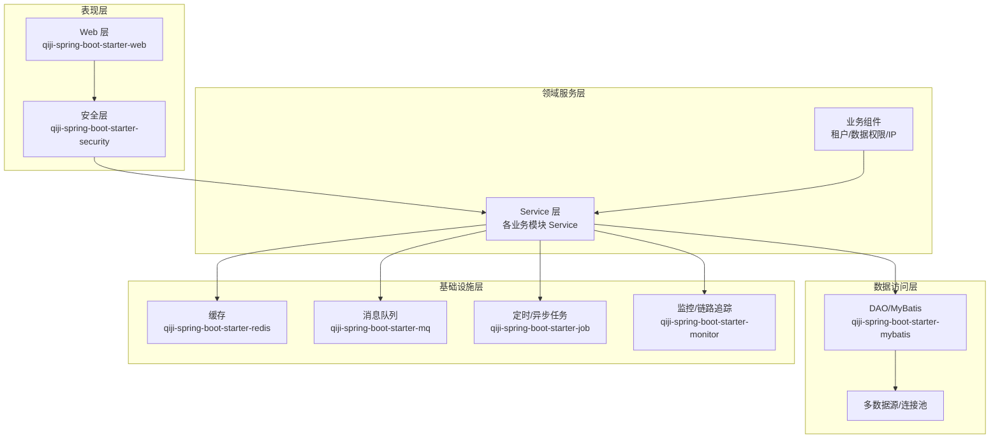
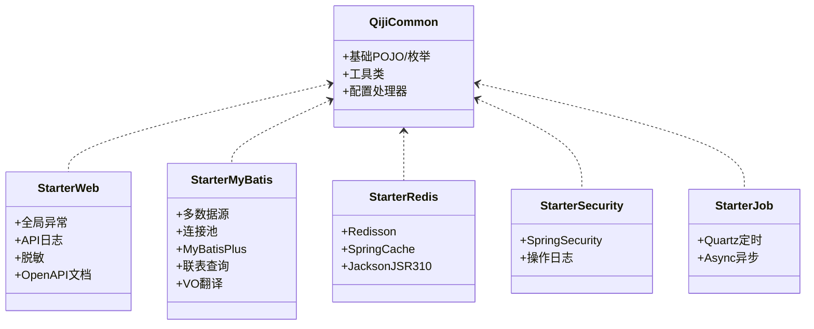
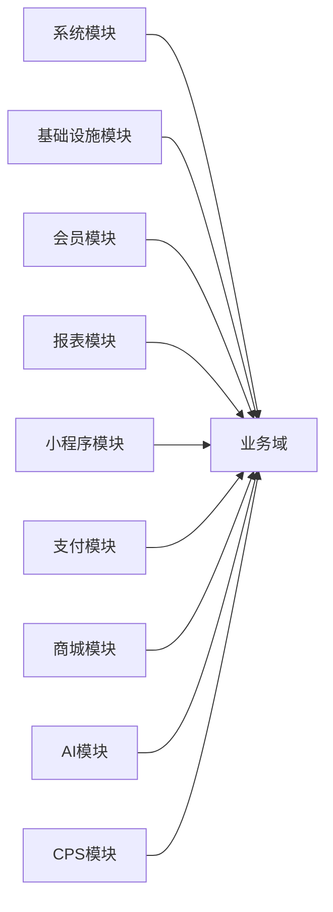
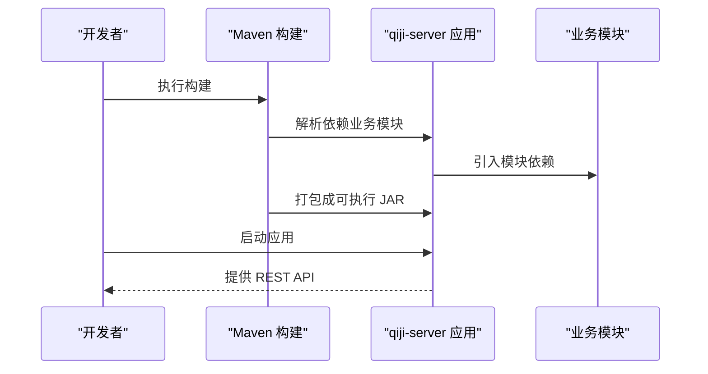
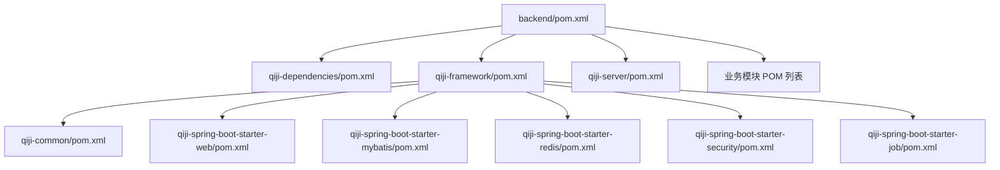
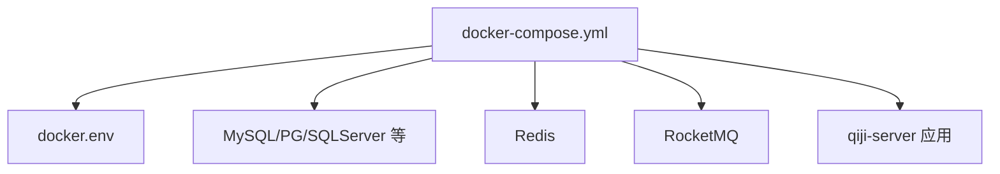

# 架构设计

<cite>
**本文引用的文件**
- [backend/pom.xml](file://backend/pom.xml)
- [backend/qiji-dependencies/pom.xml](file://backend/qiji-dependencies/pom.xml)
- [backend/qiji-framework/pom.xml](file://backend/qiji-framework/pom.xml)
- [backend/qiji-framework/qiji-common/pom.xml](file://backend/qiji-framework/qiji-common/pom.xml)
- [backend/qiji-framework/qiji-spring-boot-starter-web/pom.xml](file://backend/qiji-framework/qiji-spring-boot-starter-web/pom.xml)
- [backend/qiji-framework/qiji-spring-boot-starter-mybatis/pom.xml](file://backend/qiji-framework/qiji-spring-boot-starter-mybatis/pom.xml)
- [backend/qiji-framework/qiji-spring-boot-starter-redis/pom.xml](file://backend/qiji-framework/qiji-spring-boot-starter-redis/pom.xml)
- [backend/qiji-framework/qiji-spring-boot-starter-security/pom.xml](file://backend/qiji-framework/qiji-spring-boot-starter-security/pom.xml)
- [backend/qiji-framework/qiji-spring-boot-starter-job/pom.xml](file://backend/qiji-framework/qiji-spring-boot-starter-job/pom.xml)
- [backend/qiji-server/pom.xml](file://backend/qiji-server/pom.xml)
- [backend/qiji-module-ai/pom.xml](file://backend/qiji-module-ai/pom.xml)
- [backend/qiji-module-cps/pom.xml](file://backend/qiji-module-cps/pom.xml)
- [backend/qiji-module-member/pom.xml](file://backend/qiji-module-member/pom.xml)
- [backend/qiji-module-mall/pom.xml](file://backend/qiji-module-mall/pom.xml)
- [backend/qiji-module-pay/pom.xml](file://backend/qiji-module-pay/pom.xml)
- [backend/qiji-module-system/pom.xml](file://backend/qiji-module-system/pom.xml)
- [backend/qiji-module-infra/pom.xml](file://backend/qiji-module-infra/pom.xml)
- [backend/qiji-module-report/pom.xml](file://backend/qiji-module-report/pom.xml)
- [backend/qiji-module-mp/pom.xml](file://backend/qiji-module-mp/pom.xml)
- [backend/script/docker/docker-compose.yml](file://backend/script/docker/docker-compose.yml)
- [backend/script/docker/docker.env](file://backend/script/docker/docker.env)
- [backend/sql/mysql/ruoyi-vue-pro.sql](file://backend/sql/mysql/ruoyi-vue-pro.sql)
- [backend/sql/mysql/quartz.sql](file://backend/sql/mysql/quartz.sql)
</cite>

## 目录
1. [引言](#引言)
2. [项目结构](#项目结构)
3. [核心组件](#核心组件)
4. [架构总览](#架构总览)
5. [详细组件分析](#详细组件分析)
6. [依赖分析](#依赖分析)
7. [性能考量](#性能考量)
8. [故障排查指南](#故障排查指南)
9. [结论](#结论)
10. [附录](#附录)

## 引言
本架构设计文档面向 AgenticCPS 项目，系统性阐述其整体架构模式与设计思想，重点包括：
- 模块化设计与分层架构
- Maven 多模块组织与依赖关系
- Spring Boot + Spring AI + 低代码的混合架构理念
- 各模块职责划分：qiji-framework 框架扩展、业务模块、基础设施模块
- 系统边界、组件交互与数据流
- 架构决策的技术考量与权衡
- 设计模式的应用（策略、工厂等）
- 基础设施要求、可扩展性与部署拓扑

## 项目结构
AgenticCPS 后端采用 Maven 多模块聚合工程，顶层 POM 负责统一版本与插件管理；核心模块分为：
- 依赖管理模块：qiji-dependencies，集中管理第三方依赖版本
- 框架扩展模块：qiji-framework，按能力拆分为多个 starter 子模块
- 业务模块：按领域划分（系统、基础设施、会员、报表、小程序、支付、商城、AI、CPS 等）
- 服务打包模块：qiji-server，作为可执行应用容器，按需装配业务模块

**图表来源**
- [backend/pom.xml:10-25](file://backend/pom.xml#L10-L25)
- [backend/qiji-framework/pom.xml:12-31](file://backend/qiji-framework/pom.xml#L12-L31)
- [backend/qiji-server/pom.xml:23-114](file://backend/qiji-server/pom.xml#L23-L114)

**章节来源**
- [backend/pom.xml:1-176](file://backend/pom.xml#L1-L176)
- [backend/qiji-framework/pom.xml:1-47](file://backend/qiji-framework/pom.xml#L1-L47)
- [backend/qiji-server/pom.xml:1-137](file://backend/qiji-server/pom.xml#L1-L137)

## 核心组件
- 依赖管理（qiji-dependencies）
  - 作用：集中管理 Spring Boot、MyBatis、Redisson、RocketMQ、SkyWalking、JustAuth、微信/支付宝 SDK 等版本，确保子模块一致性
  - 关键特性：BOM 导入、版本属性统一、插件统一处理
- 框架扩展（qiji-framework）
  - 作用：提供横切能力封装，按功能拆分为多个 starter，覆盖 Web、安全、缓存、定时任务、消息队列、监控、Excel、测试、业务组件等
  - 设计原则：低耦合、高内聚、可插拔
- 业务模块（qiji-module-*）
  - 作用：按领域划分，包含 API、DAL、Service、Controller、枚举、工具等层次，支撑系统各业务域
- 服务打包（qiji-server）
  - 作用：作为可执行应用容器，按需引入业务模块，提供统一的启动入口与打包方式

**章节来源**
- [backend/qiji-dependencies/pom.xml:16-82](file://backend/qiji-dependencies/pom.xml#L16-L82)
- [backend/qiji-framework/pom.xml:33-44](file://backend/qiji-framework/pom.xml#L33-L44)
- [backend/qiji-server/pom.xml:16-21](file://backend/qiji-server/pom.xml#L16-L21)

## 架构总览
AgenticCPS 采用“Maven 多模块 + 分层架构 + 微服务化理念”的混合设计：
- 分层架构：表现层（Web）、领域服务层（Service）、数据访问层（MyBatis/DAO）、基础设施层（Redis、MQ、Job、Monitor）
- 模块化：以领域为单位拆分业务模块，以能力为单位拆分框架模块，便于独立演进与复用
- 微服务化理念：模块间通过依赖装配而非强耦合，支持按需启用/禁用模块，具备良好的可扩展性
- 混合架构：Spring Boot 提供快速开发与自动配置，结合 Spring AI（通过模块引入）与低代码能力（通过工具链与模板），加速业务迭代

**图表来源**
- [backend/qiji-framework/qiji-spring-boot-starter-web/pom.xml:18-49](file://backend/qiji-framework/qiji-spring-boot-starter-web/pom.xml#L18-L49)
- [backend/qiji-framework/qiji-spring-boot-starter-security/pom.xml:21-62](file://backend/qiji-framework/qiji-spring-boot-starter-security/pom.xml#L21-L62)
- [backend/qiji-framework/qiji-spring-boot-starter-mybatis/pom.xml:18-108](file://backend/qiji-framework/qiji-spring-boot-starter-mybatis/pom.xml#L18-L108)
- [backend/qiji-framework/qiji-spring-boot-starter-redis/pom.xml:18-39](file://backend/qiji-framework/qiji-spring-boot-starter-redis/pom.xml#L18-L39)
- [backend/qiji-framework/qiji-spring-boot-starter-job/pom.xml:21-39](file://backend/qiji-framework/qiji-spring-boot-starter-job/pom.xml#L21-L39)

## 详细组件分析

### 框架扩展模块（qiji-framework）
- qiji-common：基础 POJO、枚举、工具类、配置处理器等，为其他模块提供通用能力
- qiji-spring-boot-starter-web：全局异常、API 日志、脱敏、错误码、Knife4j/SpringDoc 文档
- qiji-spring-boot-starter-mybatis：MySQL/Oracle/PG/SQLServer/达梦/人大金仓/华为 GaussDB/TDengine 等多数据库驱动接入，Druid 连接池、MyBatis Plus、动态多数据源、联表查询、VO 翻译
- qiji-spring-boot-starter-redis：Redisson、Spring Cache、Jackson 时间序列化
- qiji-spring-boot-starter-security：Spring Security + 注解式操作日志（bizlog-sdk）
- qiji-spring-boot-starter-job：Quartz 定时任务 + Spring Async 异步任务
- 其他：监控（SkyWalking、Spring Boot Admin）、保护（Lock4j）、消息队列（RocketMQ）、Excel、测试等

**图表来源**
- [backend/qiji-framework/qiji-common/pom.xml:18-147](file://backend/qiji-framework/qiji-common/pom.xml#L18-L147)
- [backend/qiji-framework/qiji-spring-boot-starter-web/pom.xml:18-79](file://backend/qiji-framework/qiji-spring-boot-starter-web/pom.xml#L18-L79)
- [backend/qiji-framework/qiji-spring-boot-starter-mybatis/pom.xml:18-108](file://backend/qiji-framework/qiji-spring-boot-starter-mybatis/pom.xml#L18-L108)
- [backend/qiji-framework/qiji-spring-boot-starter-redis/pom.xml:18-39](file://backend/qiji-framework/qiji-spring-boot-starter-redis/pom.xml#L18-L39)
- [backend/qiji-framework/qiji-spring-boot-starter-security/pom.xml:21-62](file://backend/qiji-framework/qiji-spring-boot-starter-security/pom.xml#L21-L62)
- [backend/qiji-framework/qiji-spring-boot-starter-job/pom.xml:21-39](file://backend/qiji-framework/qiji-spring-boot-starter-job/pom.xml#L21-L39)

**章节来源**
- [backend/qiji-framework/pom.xml:12-31](file://backend/qiji-framework/pom.xml#L12-L31)
- [backend/qiji-framework/qiji-common/pom.xml:14-16](file://backend/qiji-framework/qiji-common/pom.xml#L14-L16)
- [backend/qiji-framework/qiji-spring-boot-starter-web/pom.xml:14-16](file://backend/qiji-framework/qiji-spring-boot-starter-web/pom.xml#L14-L16)
- [backend/qiji-framework/qiji-spring-boot-starter-mybatis/pom.xml:14-16](file://backend/qiji-framework/qiji-spring-boot-starter-mybatis/pom.xml#L14-L16)
- [backend/qiji-framework/qiji-spring-boot-starter-redis/pom.xml:14-16](file://backend/qiji-framework/qiji-spring-boot-starter-redis/pom.xml#L14-L16)
- [backend/qiji-framework/qiji-spring-boot-starter-security/pom.xml:14-19](file://backend/qiji-framework/qiji-spring-boot-starter-security/pom.xml#L14-L19)
- [backend/qiji-framework/qiji-spring-boot-starter-job/pom.xml:14-19](file://backend/qiji-framework/qiji-spring-boot-starter-job/pom.xml#L14-L19)

### 业务模块职责划分
- 系统模块（qiji-module-system）：用户、角色、菜单、部门、字典、区域、通知、OAuth2、短信、租户等
- 基础设施模块（qiji-module-infra）：文件、API 访问日志、API 错误日志、数据源配置、定时任务、WebSocket
- 会员模块（qiji-module-member）：会员账户、等级、标签、积分、成长值、权益等
- 报表模块（qiji-module-report）：可视化报表、积木报表集成
- 小程序模块（qiji-module-mp）：微信公众号/小程序相关账号、素材、菜单、消息、统计、标签
- 支付模块（qiji-module-pay）：支付渠道、退款、账单、对账
- 商城模块（qiji-module-mall）：商品、促销、交易、统计
- AI 模块（qiji-module-ai）：大模型工具、Agent、搜索、任务编排
- CPS 模块（qiji-module-cps）：联盟推广、广告位、订单、返佣、风控、提现

**图表来源**
- [backend/qiji-module-system/pom.xml](file://backend/qiji-module-system/pom.xml)
- [backend/qiji-module-infra/pom.xml](file://backend/qiji-module-infra/pom.xml)
- [backend/qiji-module-member/pom.xml](file://backend/qiji-module-member/pom.xml)
- [backend/qiji-module-report/pom.xml](file://backend/qiji-module-report/pom.xml)
- [backend/qiji-module-mp/pom.xml](file://backend/qiji-module-mp/pom.xml)
- [backend/qiji-module-pay/pom.xml](file://backend/qiji-module-pay/pom.xml)
- [backend/qiji-module-mall/pom.xml](file://backend/qiji-module-mall/pom.xml)
- [backend/qiji-module-ai/pom.xml](file://backend/qiji-module-ai/pom.xml)
- [backend/qiji-module-cps/pom.xml](file://backend/qiji-module-cps/pom.xml)

**章节来源**
- [backend/qiji-module-system/pom.xml](file://backend/qiji-module-system/pom.xml)
- [backend/qiji-module-infra/pom.xml](file://backend/qiji-module-infra/pom.xml)
- [backend/qiji-module-member/pom.xml](file://backend/qiji-module-member/pom.xml)
- [backend/qiji-module-report/pom.xml](file://backend/qiji-module-report/pom.xml)
- [backend/qiji-module-mp/pom.xml](file://backend/qiji-module-mp/pom.xml)
- [backend/qiji-module-pay/pom.xml](file://backend/qiji-module-pay/pom.xml)
- [backend/qiji-module-mall/pom.xml](file://backend/qiji-module-mall/pom.xml)
- [backend/qiji-module-ai/pom.xml](file://backend/qiji-module-ai/pom.xml)
- [backend/qiji-module-cps/pom.xml](file://backend/qiji-module-cps/pom.xml)

### 服务打包与启动流程
qiji-server 作为可执行应用容器，通过引入业务模块依赖实现功能装配，并使用 Spring Boot Maven 插件进行打包。

**图表来源**
- [backend/qiji-server/pom.xml:23-114](file://backend/qiji-server/pom.xml#L23-L114)
- [backend/qiji-server/pom.xml:120-132](file://backend/qiji-server/pom.xml#L120-L132)

**章节来源**
- [backend/qiji-server/pom.xml:16-21](file://backend/qiji-server/pom.xml#L16-L21)

## 依赖分析
- 顶层聚合：backend/pom.xml 声明所有子模块，统一版本与插件
- 依赖管理：qiji-dependencies/pom.xml 作为 BOM 导入，集中管理版本与依赖范围
- 框架依赖：各 starter 依赖 qiji-common 提供的基础能力
- 业务依赖：qiji-server 通过模块依赖装配业务功能，支持按需启用

**图表来源**
- [backend/pom.xml:10-25](file://backend/pom.xml#L10-L25)
- [backend/qiji-dependencies/pom.xml:84-687](file://backend/qiji-dependencies/pom.xml#L84-L687)
- [backend/qiji-framework/pom.xml:12-31](file://backend/qiji-framework/pom.xml#L12-L31)
- [backend/qiji-server/pom.xml:23-114](file://backend/qiji-server/pom.xml#L23-L114)

**章节来源**
- [backend/pom.xml:47-57](file://backend/pom.xml#L47-L57)
- [backend/qiji-dependencies/pom.xml:84-100](file://backend/qiji-dependencies/pom.xml#L84-L100)

## 性能考量
- 数据库层
  - 多数据源与连接池：通过 Druid 与动态数据源实现读写分离与资源隔离
  - MyBatis Plus 与联表查询：减少 SQL 编写成本，提升查询效率
- 缓存层
  - Redisson + Spring Cache：提供分布式锁、限流、缓存一致性策略
- 定时与异步
  - Quartz 定时任务：支持复杂调度场景；结合 Spring Async 处理异步任务
- 监控与可观测性
  - SkyWalking 链路追踪 + Spring Boot Admin 监控面板，便于定位性能瓶颈
- 并发与扩展
  - 模块化拆分与按需装配，降低冷启动体积，支持水平扩展

[本节为通用性能建议，无需特定文件引用]

## 故障排查指南
- 依赖冲突
  - 使用 qiji-dependencies 作为 BOM，避免版本漂移导致的冲突
- 启动失败
  - 检查 qiji-server 中业务模块依赖是否正确引入
- 数据库连接
  - 确认多数据源配置与驱动版本匹配（MySQL/Oracle/PG/SQLServer/达梦/人大金仓/华为 GaussDB/TDengine）
- 缓存与分布式锁
  - 校验 Redis 连接与 Redisson 配置
- 定时任务
  - 校验 Quartz 表结构与数据库方言配置
- 监控链路
  - 校验 SkyWalking Agent 与探针配置

**章节来源**
- [backend/qiji-dependencies/pom.xml:84-687](file://backend/qiji-dependencies/pom.xml#L84-L687)
- [backend/qiji-server/pom.xml:23-114](file://backend/qiji-server/pom.xml#L23-L114)
- [backend/sql/mysql/ruoyi-vue-pro.sql](file://backend/sql/mysql/ruoyi-vue-pro.sql)
- [backend/sql/mysql/quartz.sql](file://backend/sql/mysql/quartz.sql)

## 结论
AgenticCPS 通过“Maven 多模块 + 分层架构 + 微服务化理念”，实现了高内聚、低耦合、可扩展的系统设计。qiji-framework 提供横切能力，业务模块聚焦领域职责，qiji-server 作为容器按需装配。配合 Spring Boot、Spring AI 与低代码工具链，项目在保证工程化规范的同时，提升了业务迭代效率与运维稳定性。

[本节为总结，无需特定文件引用]

## 附录

### 部署拓扑与环境准备
- 容器编排：使用 docker-compose 与环境变量进行服务编排与配置注入
- 数据库初始化：导入标准 SQL 脚本完成基础表与 Quartz 调度表初始化
- 环境变量：通过 docker.env 配置数据库、缓存、消息队列等外部依赖地址

**图表来源**
- [backend/script/docker/docker-compose.yml](file://backend/script/docker/docker-compose.yml)
- [backend/script/docker/docker.env](file://backend/script/docker/docker.env)

**章节来源**
- [backend/script/docker/docker-compose.yml](file://backend/script/docker/docker-compose.yml)
- [backend/script/docker/docker.env](file://backend/script/docker/docker.env)
- [backend/sql/mysql/ruoyi-vue-pro.sql](file://backend/sql/mysql/ruoyi-vue-pro.sql)
- [backend/sql/mysql/quartz.sql](file://backend/sql/mysql/quartz.sql)