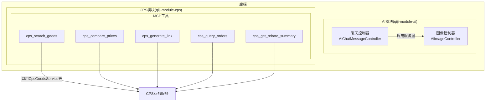
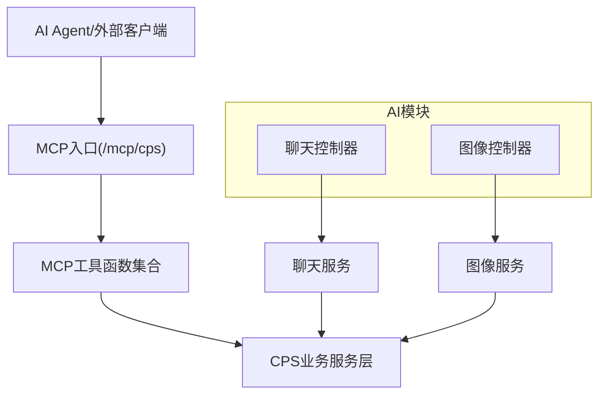
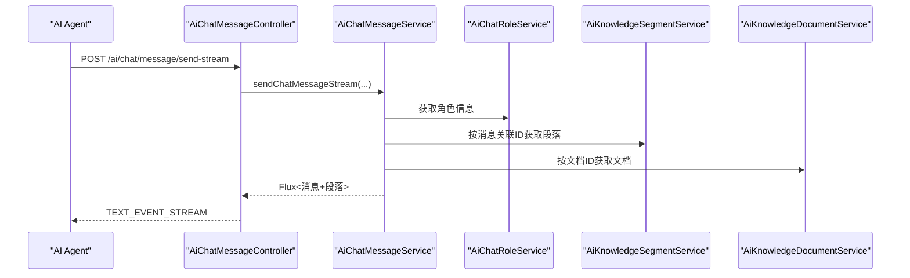
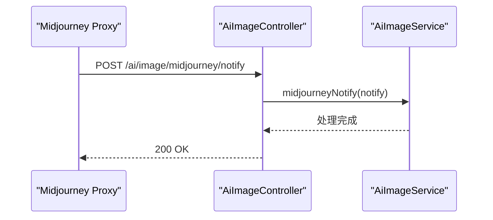
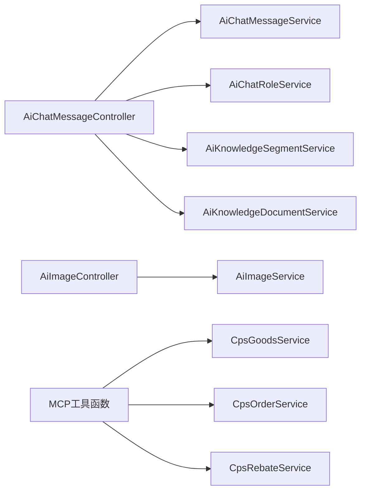

# AI智能模块

<cite>
**本文引用的文件**
- [README.md](file://README.md)
- [AGENTS.md](file://AGENTS.md)
- [backend/README.md](file://backend/README.md)
- [CPS系统PRD文档.md](file://docs/CPS系统PRD文档.md)
- [AiChatMessageController.java](file://backend/qiji-module-ai/src/main/java/com/qiji/cps/module/ai/controller/admin/chat/AiChatMessageController.java)
- [AiImageController.java](file://backend/qiji-module-ai/src/main/java/com/qiji/cps/module/ai/controller/admin/image/AiImageController.java)
- [CpsSearchGoodsToolFunction.java](file://backend/qiji-module-cps/qiji-module-cps-biz/src/main/java/com/qiji/cps/module/cps/mcp/tool/CpsSearchGoodsToolFunction.java)
- [CpsComparePricesToolFunction.java](file://backend/qiji-module-cps/qiji-module-cps-biz/src/main/java/com/qiji/cps/module/cps/mcp/tool/CpsComparePricesToolFunction.java)
- [CpsGenerateLinkToolFunction.java](file://backend/qiji-module-cps/qiji-module-cps-biz/src/main/java/com/qiji/cps/module/cps/mcp/tool/CpsGenerateLinkToolFunction.java)
- [CpsQueryOrdersToolFunction.java](file://backend/qiji-module-cps/qiji-module-cps-biz/src/main/java/com/qiji/cps/module/cps/mcp/tool/CpsQueryOrdersToolFunction.java)
- [CpsGetRebateSummaryToolFunction.java](file://backend/qiji-module-cps/qiji-module-cps-biz/src/main/java/com/qiji/cps/module/cps/mcp/tool/CpsGetRebateSummaryToolFunction.java)
- [codegen-rules.md](file://agent_improvement/memory/codegen-rules.md)
- [MEMORY.md](file://agent_improvement/memory/MEMORY.md)
</cite>

## 目录
1. [简介](#简介)
2. [项目结构](#项目结构)
3. [核心组件](#核心组件)
4. [架构总览](#架构总览)
5. [详细组件分析](#详细组件分析)
6. [依赖关系分析](#依赖关系分析)
7. [性能考量](#性能考量)
8. [故障排查指南](#故障排查指南)
9. [结论](#结论)
10. [附录](#附录)

## 简介
本文件面向AgenticCPS的AI智能模块，围绕“Vibe Coding工作流”“MCP协议集成”“AI代理管理”“代码生成规则”等主题，系统化梳理AI模块的架构设计与实现要点。重点包括：
- 基于Spring AI与MCP协议的AI工具函数注册与调用
- AI聊天与图像生成能力的后端控制器与服务层
- 代码生成规则与AI记忆体系，支撑AI自主编程
- MCP工具函数（商品搜索、比价、链接生成、订单查询、返利汇总）的实现与使用

## 项目结构
AI智能模块位于后端工程的qiji-module-ai子模块，主要包含聊天、图像生成、工具函数（Tool Functions）等能力；同时，CPS模块中的mcp/tool目录提供面向AI Agent的MCP工具函数。

**图表来源**
- [AiChatMessageController.java:46-158](file://backend/qiji-module-ai/src/main/java/com/qiji/cps/module/ai/controller/admin/chat/AiChatMessageController.java#L46-L158)
- [AiImageController.java:34-139](file://backend/qiji-module-ai/src/main/java/com/qiji/cps/module/ai/controller/admin/image/AiImageController.java#L34-L139)
- [CpsSearchGoodsToolFunction.java:1-200](file://backend/qiji-module-cps/qiji-module-cps-biz/src/main/java/com/qiji/cps/module/cps/mcp/tool/CpsSearchGoodsToolFunction.java#L1-L200)
- [CpsComparePricesToolFunction.java:1-37](file://backend/qiji-module-cps/qiji-module-cps-biz/src/main/java/com/qiji/cps/module/cps/mcp/tool/CpsComparePricesToolFunction.java#L1-L37)
- [CpsGenerateLinkToolFunction.java:1-200](file://backend/qiji-module-cps/qiji-module-cps-biz/src/main/java/com/qiji/cps/module/cps/mcp/tool/CpsGenerateLinkToolFunction.java#L1-L200)
- [CpsQueryOrdersToolFunction.java:1-200](file://backend/qiji-module-cps/qiji-module-cps-biz/src/main/java/com/qiji/cps/module/cps/mcp/tool/CpsQueryOrdersToolFunction.java#L1-L200)
- [CpsGetRebateSummaryToolFunction.java:1-200](file://backend/qiji-module-cps/qiji-module-cps-biz/src/main/java/com/qiji/cps/module/cps/mcp/tool/CpsGetRebateSummaryToolFunction.java#L1-L200)

**章节来源**
- [README.md:185-211](file://README.md#L185-L211)
- [AGENTS.md:170-189](file://AGENTS.md#L170-L189)

## 核心组件
- AI聊天与知识库增强：提供消息发送（同步/流式）、对话管理、知识库段落关联等能力，支撑AI Agent与系统内的对话与检索增强。
- AI图像生成：提供绘图生成、公共/私有资源分页、Midjourney回调与动作操作等接口，满足视觉内容创作与管理。
- MCP工具函数：面向AI Agent的5个开箱即用工具，覆盖商品搜索、跨平台比价、推广链接生成、订单查询、返利汇总。

**章节来源**
- [AiChatMessageController.java:46-158](file://backend/qiji-module-ai/src/main/java/com/qiji/cps/module/ai/controller/admin/chat/AiChatMessageController.java#L46-L158)
- [AiImageController.java:34-139](file://backend/qiji-module-ai/src/main/java/com/qiji/cps/module/ai/controller/admin/image/AiImageController.java#L34-L139)
- [README.md:200-211](file://README.md#L200-L211)
- [AGENTS.md:170-189](file://AGENTS.md#L170-L189)

## 架构总览
AI智能模块以“控制器-服务层-业务服务”的分层架构组织，结合MCP协议实现AI Agent与系统的零代码对接。AI聊天与图像生成通过REST接口提供能力；MCP工具函数通过Spring AI注册为可被外部AI Agent直接调用的工具。

**图表来源**
- [AGENTS.md:182-189](file://AGENTS.md#L182-L189)
- [AiChatMessageController.java:46-158](file://backend/qiji-module-ai/src/main/java/com/qiji/cps/module/ai/controller/admin/chat/AiChatMessageController.java#L46-L158)
- [AiImageController.java:34-139](file://backend/qiji-module-ai/src/main/java/com/qiji/cps/module/ai/controller/admin/image/AiImageController.java#L34-L139)

## 详细组件分析

### AI聊天与知识库增强
- 能力概览
  - 发送消息（同步/流式）：支持一次性返回与SSE流式返回，提升交互体验。
  - 对话管理：按对话ID查询消息列表，支持删除单条/整对话消息。
  - 知识库增强：将消息与知识库段落关联，返回消息时附带相关文档片段信息。
- 关键流程（流式发送）

**图表来源**
- [AiChatMessageController.java:65-112](file://backend/qiji-module-ai/src/main/java/com/qiji/cps/module/ai/controller/admin/chat/AiChatMessageController.java#L65-L112)

**章节来源**
- [AiChatMessageController.java:46-158](file://backend/qiji-module-ai/src/main/java/com/qiji/cps/module/ai/controller/admin/chat/AiChatMessageController.java#L46-L158)

### AI图像生成与Midjourney集成
- 能力概览
  - 绘图生成：支持用户生成图像并持久化。
  - 资源管理：提供“我的/公开”分页查询、按ID查询、批量查询与删除。
  - Midjourney集成：提供Imagine、Notify、Action等专用接口，支持回调与二次操作。
- 关键流程（Midjourney通知）

**图表来源**
- [AiImageController.java:96-110](file://backend/qiji-module-ai/src/main/java/com/qiji/cps/module/ai/controller/admin/image/AiImageController.java#L96-L110)

**章节来源**
- [AiImageController.java:34-139](file://backend/qiji-module-ai/src/main/java/com/qiji/cps/module/ai/controller/admin/image/AiImageController.java#L34-L139)

### MCP工具函数：商品搜索
- 工具名称：cps_search_goods
- 能力说明：在已启用平台中按关键词搜索商品，支持平台过滤、价格区间、分页等参数。
- 关键点：通过CpsGoodsService执行跨平台搜索，返回标准化的商品结果集。
- 典型调用：AI Agent直接通过MCP工具调用，无需额外开发。

**章节来源**
- [README.md:200-211](file://README.md#L200-L211)
- [AGENTS.md:170-189](file://AGENTS.md#L170-L189)
- [CpsSearchGoodsToolFunction.java:1-200](file://backend/qiji-module-cps/qiji-module-cps-biz/src/main/java/com/qiji/cps/module/cps/mcp/tool/CpsSearchGoodsToolFunction.java#L1-L200)

### MCP工具函数：跨平台比价
- 工具名称：cps_compare_prices
- 能力说明：并发查询所有启用平台的对应商品，按券后价排序，输出“最便宜/返利最高/综合最优”方案。
- 关键点：内部对商品进行价格计算与排序，输出结构化推荐结果。

**章节来源**
- [README.md:200-211](file://README.md#L200-L211)
- [AGENTS.md:170-189](file://AGENTS.md#L170-L189)
- [CpsComparePricesToolFunction.java:1-37](file://backend/qiji-module-cps/qiji-module-cps-biz/src/main/java/com/qiji/cps/module/cps/mcp/tool/CpsComparePricesToolFunction.java#L1-L37)

### MCP工具函数：推广链接生成
- 工具名称：cps_generate_link
- 能力说明：生成带返利追踪的推广链接，支持短链/长链/口令/移动端等多种形式。
- 关键点：调用CPS平台适配器生成推广链接，并确保追踪参数正确注入。

**章节来源**
- [README.md:200-211](file://README.md#L200-L211)
- [AGENTS.md:170-189](file://AGENTS.md#L170-L189)
- [CpsGenerateLinkToolFunction.java:1-200](file://backend/qiji-module-cps/qiji-module-cps-biz/src/main/java/com/qiji/cps/module/cps/mcp/tool/CpsGenerateLinkToolFunction.java#L1-L200)

### MCP工具函数：订单查询
- 工具名称：cps_query_orders
- 能力说明：查询用户的返利订单列表与全链路状态，便于AI Agent进行状态跟踪与分析。
- 关键点：结合当前登录用户上下文，返回其可见的订单与返利状态。

**章节来源**
- [README.md:200-211](file://README.md#L200-L211)
- [AGENTS.md:170-189](file://AGENTS.md#L170-L189)
- [CpsQueryOrdersToolFunction.java:1-200](file://backend/qiji-module-cps/qiji-module-cps-biz/src/main/java/com/qiji/cps/module/cps/mcp/tool/CpsQueryOrdersToolFunction.java#L1-L200)

### MCP工具函数：返利汇总
- 工具名称：cps_get_rebate_summary
- 能力说明：查询返利账户的余额、待结算、累计返利与最近记录。
- 关键点：返回结构化汇总信息，便于AI Agent进行财务与运营分析。

**章节来源**
- [README.md:200-211](file://README.md#L200-L211)
- [AGENTS.md:170-189](file://AGENTS.md#L170-L189)
- [CpsGetRebateSummaryToolFunction.java:1-200](file://backend/qiji-module-cps/qiji-module-cps-biz/src/main/java/com/qiji/cps/module/cps/mcp/tool/CpsGetRebateSummaryToolFunction.java#L1-L200)

### 代码生成规则与AI记忆
- 代码生成规则：定义了后端（DO/Service/Controller等）与前端（Vue3/Vben/UniApp）模板的生成规范，涵盖命名约定、模板类型、VO规范、权限与导出等。
- AI记忆索引：记录了AI Agent在项目中的规则与记忆文件位置，便于后续扩展与优化。

**章节来源**
- [codegen-rules.md:1-788](file://agent_improvement/memory/codegen-rules.md#L1-L788)
- [MEMORY.md:1-21](file://agent_improvement/memory/MEMORY.md#L1-L21)

## 依赖关系分析
- 控制器到服务层：聊天与图像控制器分别依赖对应的Service，实现业务编排与数据装配。
- MCP工具到业务服务：MCP工具函数通过CpsGoodsService等业务服务完成跨平台搜索、比价、链接生成、订单与返利查询。
- 知识库增强：聊天消息返回时，通过知识库段落与文档服务进行关联，提升回答的相关性。

**图表来源**
- [AiChatMessageController.java:46-158](file://backend/qiji-module-ai/src/main/java/com/qiji/cps/module/ai/controller/admin/chat/AiChatMessageController.java#L46-L158)
- [AiImageController.java:34-139](file://backend/qiji-module-ai/src/main/java/com/qiji/cps/module/ai/controller/admin/image/AiImageController.java#L34-L139)
- [CpsSearchGoodsToolFunction.java:1-200](file://backend/qiji-module-cps/qiji-module-cps-biz/src/main/java/com/qiji/cps/module/cps/mcp/tool/CpsSearchGoodsToolFunction.java#L1-L200)
- [CpsComparePricesToolFunction.java:1-37](file://backend/qiji-module-cps/qiji-module-cps-biz/src/main/java/com/qiji/cps/module/cps/mcp/tool/CpsComparePricesToolFunction.java#L1-L37)
- [CpsGenerateLinkToolFunction.java:1-200](file://backend/qiji-module-cps/qiji-module-cps-biz/src/main/java/com/qiji/cps/module/cps/mcp/tool/CpsGenerateLinkToolFunction.java#L1-L200)
- [CpsQueryOrdersToolFunction.java:1-200](file://backend/qiji-module-cps/qiji-module-cps-biz/src/main/java/com/qiji/cps/module/cps/mcp/tool/CpsQueryOrdersToolFunction.java#L1-L200)
- [CpsGetRebateSummaryToolFunction.java:1-200](file://backend/qiji-module-cps/qiji-module-cps-biz/src/main/java/com/qiji/cps/module/cps/mcp/tool/CpsGetRebateSummaryToolFunction.java#L1-L200)

## 性能考量
- 搜索与比价：单平台搜索P99<2秒，多平台比价P99<5秒，确保AI Agent调用体验。
- 链接生成：转链生成P99<1秒，降低用户等待时间。
- 订单同步：延迟<30分钟，返利入账在平台结算后24小时内完成。
- MCP工具调用：搜索类<3秒，查询类<1秒，保障实时性。

**章节来源**
- [README.md:369-379](file://README.md#L369-L379)

## 故障排查指南
- API Key与权限
  - MCP工具通过API Key鉴权，需在管理后台配置权限级别（public/member/admin）与限流规则。
  - 若调用失败，检查API Key状态、权限级别与限流阈值。
- 访问日志
  - 通过管理后台查看MCP访问日志，定位工具调用耗时、参数与异常。
- 聊天消息缺失或为空
  - 确认对话归属当前登录用户，避免跨用户查询导致空结果。
  - 检查知识库段落与文档映射是否正确加载。
- Midjourney回调
  - 确认回调地址可达且方法为POST；检查通知体格式与租户隔离配置。

**章节来源**
- [AGENTS.md:182-189](file://AGENTS.md#L182-L189)
- [AiChatMessageController.java:74-112](file://backend/qiji-module-ai/src/main/java/com/qiji/cps/module/ai/controller/admin/chat/AiChatMessageController.java#L74-L112)
- [AiImageController.java:96-110](file://backend/qiji-module-ai/src/main/java/com/qiji/cps/module/ai/controller/admin/image/AiImageController.java#L96-L110)

## 结论
AgenticCPS的AI智能模块以“Vibe Coding + MCP协议 + AI工具函数”为核心，实现了从聊天增强到图像生成再到CPS业务工具的全栈AI能力。通过清晰的分层架构与完善的代码生成规则，系统既保证了AI Agent的零代码接入，也确保了业务扩展的可维护性与可演进性。

## 附录
- 最佳实践
  - 使用MCP工具前先明确权限级别与限流策略，避免超限。
  - 在聊天场景中结合知识库段落，提升回答准确性。
  - 对图像生成与Midjourney集成做好回调与状态轮询的容错处理。
- 调试技巧
  - 使用流式接口进行实时调试，观察消息增量输出。
  - 通过管理后台查看API Key与访问日志，快速定位问题。
- 扩展开发指南
  - 新增MCP工具：参考现有工具函数的注解与参数定义，实现Function接口并注册为Spring Bean。
  - 新增平台适配：实现CpsPlatformClient接口并通过工厂注册，保持核心逻辑不变。
  - 代码生成：遵循codegen-rules规范，确保前后端一致性与可维护性。

**章节来源**
- [AGENTS.md:150-189](file://AGENTS.md#L150-L189)
- [codegen-rules.md:1-788](file://agent_improvement/memory/codegen-rules.md#L1-L788)