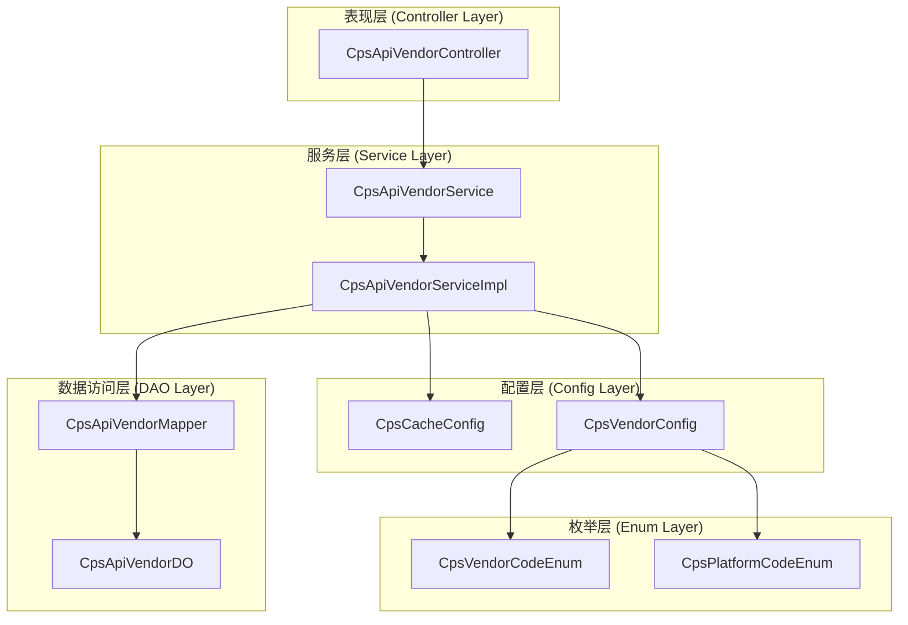
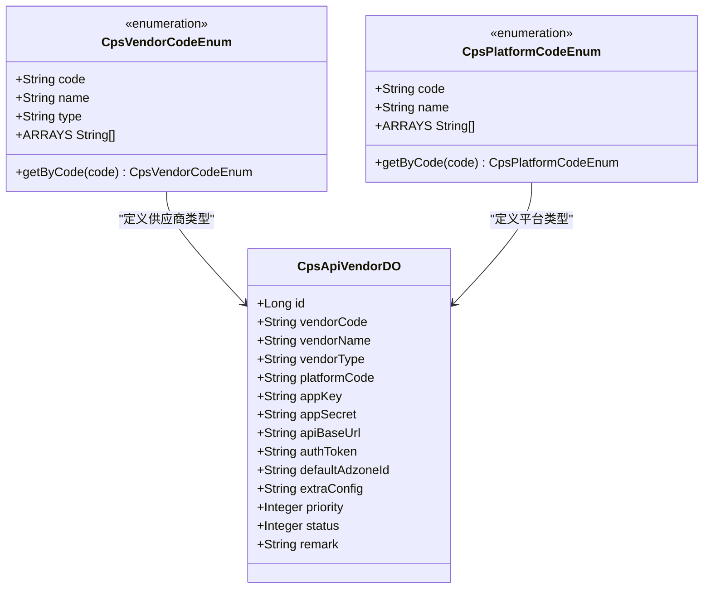
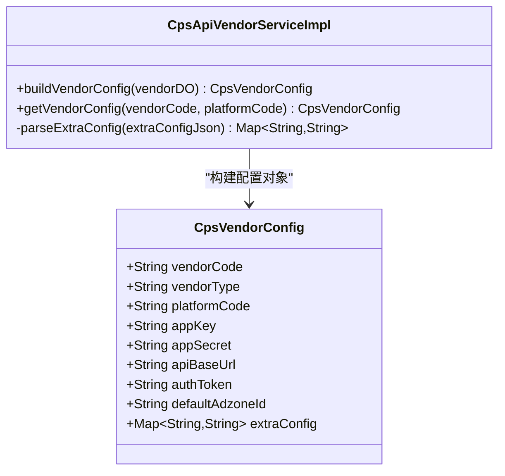
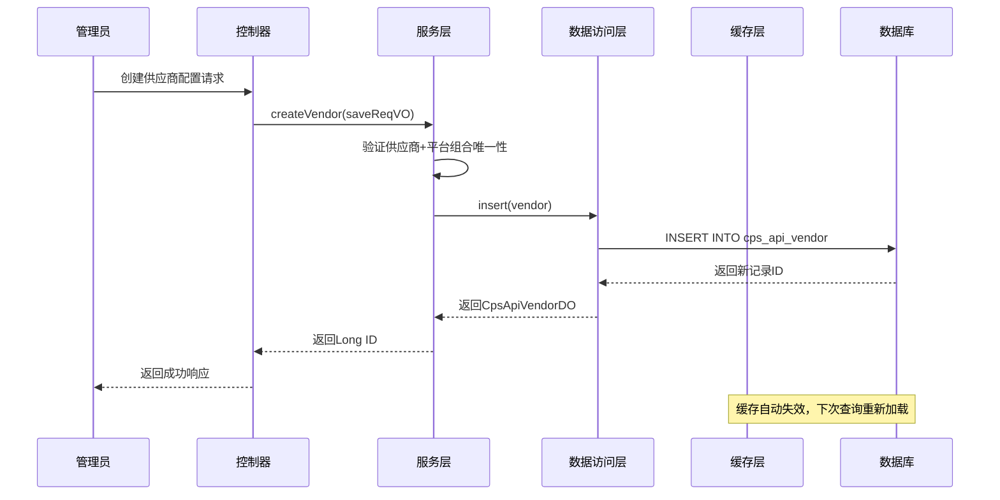
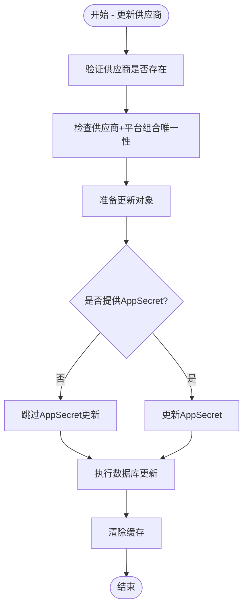
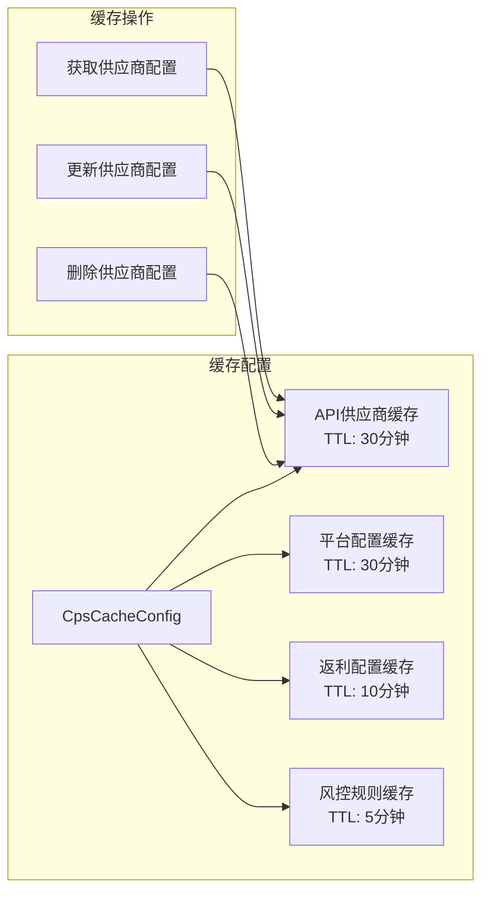
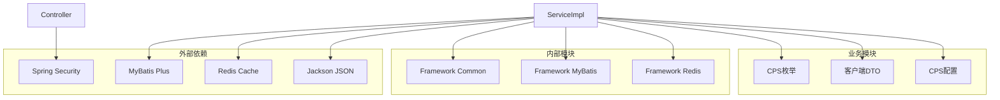

# API供应商管理功能增强

<cite>
**本文档引用的文件**
- [CpsVendorCodeEnum.java](file://backend/qiji-module-cps/qiji-module-cps-api/src/main/java/com/qiji/cps/module/cps/enums/CpsVendorCodeEnum.java)
- [CpsPlatformCodeEnum.java](file://backend/qiji-module-cps/qiji-module-cps-api/src/main/java/com/qiji/cps/module/cps/enums/CpsPlatformCodeEnum.java)
- [CpsApiVendorController.java](file://backend/qiji-module-cps/qiji-module-cps-biz/src/main/java/com/qiji/cps/module/cps/controller/admin/vendor/CpsApiVendorController.java)
- [CpsApiVendorDO.java](file://backend/qiji-module-cps/qiji-module-cps-biz/src/main/java/com/qiji/cps/module/cps/dal/dataobject/vendor/CpsApiVendorDO.java)
- [CpsApiVendorService.java](file://backend/qiji-module-cps/qiji-module-cps-biz/src/main/java/com/qiji/cps/module/cps/service/vendor/CpsApiVendorService.java)
- [CpsApiVendorServiceImpl.java](file://backend/qiji-module-cps/qiji-module-cps-biz/src/main/java/com/qiji/cps/module/cps/service/vendor/CpsApiVendorServiceImpl.java)
- [CpsApiVendorMapper.java](file://backend/qiji-module-cps/qiji-module-cps-biz/src/main/java/com/qiji/cps/module/cps/dal/mysql/vendor/CpsApiVendorMapper.java)
- [CpsVendorConfig.java](file://backend/qiji-module-cps/qiji-module-cps-biz/src/main/java/com/qiji/cps/module/cps/client/dto/CpsVendorConfig.java)
- [CpsApiVendorSaveReqVO.java](file://backend/qiji-module-cps/qiji-module-cps-biz/src/main/java/com/qiji/cps/module/cps/controller/admin/vendor/vo/CpsApiVendorSaveReqVO.java)
- [CpsCacheConfig.java](file://backend/qiji-module-cps/qiji-module-cps-biz/src/main/java/com/qiji/cps/module/cps/config/CpsCacheConfig.java)
</cite>

## 目录
1. [简介](#简介)
2. [项目结构](#项目结构)
3. [核心组件](#核心组件)
4. [架构概览](#架构概览)
5. [详细组件分析](#详细组件分析)
6. [依赖关系分析](#依赖关系分析)
7. [性能考虑](#性能考虑)
8. [故障排除指南](#故障排除指南)
9. [结论](#结论)

## 简介

本文档详细介绍了AgenticCPS项目中API供应商管理功能的增强实现。该功能允许系统管理员配置和管理多个CPS（Commission Paid Search）API供应商，包括聚合平台和官方API，支持多电商平台集成、动态配置管理和缓存优化。

API供应商管理功能是CPS系统的核心组成部分，它提供了灵活的供应商配置机制，使得系统能够支持多个第三方API提供商，包括大淘客、好单库等聚合平台以及各电商平台的官方API接口。

## 项目结构

CPS模块采用标准的分层架构设计，API供应商管理功能分布在以下层次：

**图表来源**
- [CpsApiVendorController.java:1-92](file://backend/qiji-module-cps/qiji-module-cps-biz/src/main/java/com/qiji/cps/module/cps/controller/admin/vendor/CpsApiVendorController.java#L1-L92)
- [CpsApiVendorService.java:1-70](file://backend/qiji-module-cps/qiji-module-cps-biz/src/main/java/com/qiji/cps/module/cps/service/vendor/CpsApiVendorService.java#L1-L70)
- [CpsApiVendorServiceImpl.java:1-161](file://backend/qiji-module-cps/qiji-module-cps-biz/src/main/java/com/qiji/cps/module/cps/service/vendor/CpsApiVendorServiceImpl.java#L1-L161)

**章节来源**
- [CpsApiVendorController.java:1-92](file://backend/qiji-module-cps/qiji-module-cps-biz/src/main/java/com/qiji/cps/module/cps/controller/admin/vendor/CpsApiVendorController.java#L1-L92)
- [CpsApiVendorService.java:1-70](file://backend/qiji-module-cps/qiji-module-cps-biz/src/main/java/com/qiji/cps/module/cps/service/vendor/CpsApiVendorService.java#L1-L70)
- [CpsApiVendorServiceImpl.java:1-161](file://backend/qiji-module-cps/qiji-module-cps-biz/src/main/java/com/qiji/cps/module/cps/service/vendor/CpsApiVendorServiceImpl.java#L1-L161)

## 核心组件

### 供应商枚举系统

系统支持多种API供应商类型，通过枚举类进行统一管理：

**图表来源**
- [CpsVendorCodeEnum.java:18-51](file://backend/qiji-module-cps/qiji-module-cps-api/src/main/java/com/qiji/cps/module/cps/enums/CpsVendorCodeEnum.java#L18-L51)
- [CpsPlatformCodeEnum.java:16-46](file://backend/qiji-module-cps/qiji-module-cps-api/src/main/java/com/qiji/cps/module/cps/enums/CpsPlatformCodeEnum.java#L16-L46)
- [CpsApiVendorDO.java:23-85](file://backend/qiji-module-cps/qiji-module-cps-biz/src/main/java/com/qiji/cps/module/cps/dal/dataobject/vendor/CpsApiVendorDO.java#L23-L85)

### 供应商配置DTO

运行时配置转换类，用于在数据库配置和客户端使用之间进行数据转换：

**图表来源**
- [CpsVendorConfig.java:18-65](file://backend/qiji-module-cps/qiji-module-cps-biz/src/main/java/com/qiji/cps/module/cps/client/dto/CpsVendorConfig.java#L18-L65)
- [CpsApiVendorServiceImpl.java:105-128](file://backend/qiji-module-cps/qiji-module-cps-biz/src/main/java/com/qiji/cps/module/cps/service/vendor/CpsApiVendorServiceImpl.java#L105-L128)

**章节来源**
- [CpsVendorCodeEnum.java:1-52](file://backend/qiji-module-cps/qiji-module-cps-api/src/main/java/com/qiji/cps/module/cps/enums/CpsVendorCodeEnum.java#L1-L52)
- [CpsPlatformCodeEnum.java:1-47](file://backend/qiji-module-cps/qiji-module-cps-api/src/main/java/com/qiji/cps/module/cps/enums/CpsPlatformCodeEnum.java#L1-L47)
- [CpsApiVendorDO.java:1-86](file://backend/qiji-module-cps/qiji-module-cps-biz/src/main/java/com/qiji/cps/module/cps/dal/dataobject/vendor/CpsApiVendorDO.java#L1-L86)
- [CpsVendorConfig.java:1-66](file://backend/qiji-module-cps/qiji-module-cps-biz/src/main/java/com/qiji/cps/module/cps/client/dto/CpsVendorConfig.java#L1-L66)

## 架构概览

API供应商管理功能采用经典的三层架构模式，实现了清晰的职责分离和良好的可扩展性：

**图表来源**
- [CpsApiVendorController.java:33-38](file://backend/qiji-module-cps/qiji-module-cps-biz/src/main/java/com/qiji/cps/module/cps/controller/admin/vendor/CpsApiVendorController.java#L33-L38)
- [CpsApiVendorServiceImpl.java:44-52](file://backend/qiji-module-cps/qiji-module-cps-biz/src/main/java/com/qiji/cps/module/cps/service/vendor/CpsApiVendorServiceImpl.java#L44-L52)

**章节来源**
- [CpsApiVendorController.java:1-92](file://backend/qiji-module-cps/qiji-module-cps-biz/src/main/java/com/qiji/cps/module/cps/controller/admin/vendor/CpsApiVendorController.java#L1-L92)
- [CpsApiVendorServiceImpl.java:1-161](file://backend/qiji-module-cps/qiji-module-cps-biz/src/main/java/com/qiji/cps/module/cps/service/vendor/CpsApiVendorServiceImpl.java#L1-L161)

## 详细组件分析

### 控制器层 (CpsApiVendorController)

控制器层提供了完整的RESTful API接口，支持供应商配置的增删改查操作：

| HTTP方法 | 端点路径 | 权限要求 | 功能描述 |
|---------|----------|----------|----------|
| POST | `/cps/api-vendor/create` | `cps:api-vendor:create` | 创建新的API供应商配置 |
| PUT | `/cps/api-vendor/update` | `cps:api-vendor:update` | 更新现有供应商配置 |
| DELETE | `/cps/api-vendor/delete?id={id}` | `cps:api-vendor:delete` | 删除指定供应商配置 |
| GET | `/cps/api-vendor/get?id={id}` | `cps:api-vendor:query` | 获取单个供应商详情 |
| GET | `/cps/api-vendor/page` | `cps:api-vendor:query` | 分页查询供应商列表 |
| GET | `/cps/api-vendor/list-enabled` | `cps:api-vendor:query` | 获取所有已启用供应商 |
| GET | `/cps/api-vendor/list-by-platform?platformCode={code}` | `cps:api-vendor:query` | 获取指定平台的供应商列表 |

**章节来源**
- [CpsApiVendorController.java:33-91](file://backend/qiji-module-cps/qiji-module-cps-biz/src/main/java/com/qiji/cps/module/cps/controller/admin/vendor/CpsApiVendorController.java#L33-L91)

### 服务层 (CpsApiVendorService)

服务层实现了业务逻辑处理，包括数据验证、缓存管理和错误处理：

**图表来源**
- [CpsApiVendorServiceImpl.java:58-69](file://backend/qiji-module-cps/qiji-module-cps-biz/src/main/java/com/qiji/cps/module/cps/service/vendor/CpsApiVendorServiceImpl.java#L58-L69)

**章节来源**
- [CpsApiVendorService.java:17-69](file://backend/qiji-module-cps/qiji-module-cps-biz/src/main/java/com/qiji/cps/module/cps/service/vendor/CpsApiVendorService.java#L17-L69)
- [CpsApiVendorServiceImpl.java:44-103](file://backend/qiji-module-cps/qiji-module-cps-biz/src/main/java/com/qiji/cps/module/cps/service/vendor/CpsApiVendorServiceImpl.java#L44-L103)

### 数据访问层 (CpsApiVendorMapper)

数据访问层提供了丰富的查询方法，支持复杂的筛选条件和排序需求：

| 查询方法 | 功能描述 | 筛选条件 |
|---------|----------|----------|
| selectPage | 分页查询 | 供应商编码、平台编码、供应商类型、状态、名称模糊匹配 |
| selectByVendorAndPlatform | 组合查询 | 供应商编码 + 平台编码 |
| selectListByPlatformCode | 平台查询 | 平台编码 + 启用状态 |
| selectListByVendorCode | 供应商查询 | 供应商编码 + 启用状态 |
| selectListByStatus | 状态查询 | 特定状态 |

**章节来源**
- [CpsApiVendorMapper.java:20-52](file://backend/qiji-module-cps/qiji-module-cps-biz/src/main/java/com/qiji/cps/module/cps/dal/mysql/vendor/CpsApiVendorMapper.java#L20-L52)

### 缓存策略

系统采用了智能的缓存策略来提升性能：

**图表来源**
- [CpsCacheConfig.java:31-62](file://backend/qiji-module-cps/qiji-module-cps-biz/src/main/java/com/qiji/cps/module/cps/config/CpsCacheConfig.java#L31-L62)

**章节来源**
- [CpsCacheConfig.java:1-65](file://backend/qiji-module-cps/qiji-module-cps-biz/src/main/java/com/qiji/cps/module/cps/config/CpsCacheConfig.java#L1-L65)

## 依赖关系分析

API供应商管理功能的依赖关系呈现清晰的分层结构：

**图表来源**
- [CpsApiVendorController.java:3-22](file://backend/qiji-module-cps/qiji-module-cps-biz/src/main/java/com/qiji/cps/module/cps/controller/admin/vendor/CpsApiVendorController.java#L3-L22)
- [CpsApiVendorServiceImpl.java:3-26](file://backend/qiji-module-cps/qiji-module-cps-biz/src/main/java/com/qiji/cps/module/cps/service/vendor/CpsApiVendorServiceImpl.java#L3-L26)

**章节来源**
- [CpsApiVendorController.java:1-92](file://backend/qiji-module-cps/qiji-module-cps-biz/src/main/java/com/qiji/cps/module/cps/controller/admin/vendor/CpsApiVendorController.java#L1-L92)
- [CpsApiVendorServiceImpl.java:1-161](file://backend/qiji-module-cps/qiji-module-cps-biz/src/main/java/com/qiji/cps/module/cps/service/vendor/CpsApiVendorServiceImpl.java#L1-L161)

## 性能考虑

### 缓存优化策略

1. **智能缓存失效**: 更新操作会自动清除相关缓存，确保数据一致性
2. **TTL策略**: 不同类型的缓存设置不同的过期时间，平衡性能和实时性
3. **序列化优化**: 使用Redis JSON序列化器支持复杂对象的高效存储

### 数据库优化

1. **索引设计**: 基于常用查询条件建立索引
2. **分页查询**: 支持大数据量的高效分页
3. **条件查询**: 提供灵活的筛选条件组合

### 安全考虑

1. **权限控制**: 基于角色的权限验证
2. **数据验证**: 输入参数的严格验证
3. **敏感信息保护**: API密钥的安全存储和传输

## 故障排除指南

### 常见问题及解决方案

| 问题类型 | 症状 | 可能原因 | 解决方案 |
|---------|------|----------|----------|
| 供应商重复 | 创建失败，提示重复 | 供应商+平台组合已存在 | 修改供应商编码或平台编码 |
| 权限不足 | API调用被拒绝 | 用户权限不足 | 为用户分配相应权限 |
| 缓存异常 | 配置更新后未生效 | 缓存未正确失效 | 手动清除相关缓存键 |
| 数据库连接 | 查询超时 | 数据库负载过高 | 优化查询条件，增加索引 |

### 错误码说明

| 错误码 | 错误类型 | 说明 |
|--------|----------|------|
| VENDOR_NOT_EXISTS | 供应商不存在 | 尝试更新不存在的供应商配置 |
| VENDOR_PLATFORM_DUPLICATE | 供应商重复 | 供应商+平台组合重复 |

**章节来源**
- [CpsApiVendorServiceImpl.java:132-146](file://backend/qiji-module-cps/qiji-module-cps-biz/src/main/java/com/qiji/cps/module/cps/service/vendor/CpsApiVendorServiceImpl.java#L132-L146)

## 结论

API供应商管理功能增强了AgenticCPS系统的灵活性和可扩展性，主要体现在：

1. **多供应商支持**: 支持聚合平台和官方API的统一管理
2. **灵活配置**: 通过扩展配置支持供应商特有的参数设置
3. **高性能设计**: 采用缓存策略和优化的数据库查询
4. **安全可靠**: 完善的权限控制和数据验证机制
5. **易于维护**: 清晰的分层架构和完善的错误处理

该功能为CPS系统的商业化运营奠定了坚实的基础，能够有效支持多平台、多供应商的复杂业务场景，为后续的功能扩展提供了良好的技术支撑。