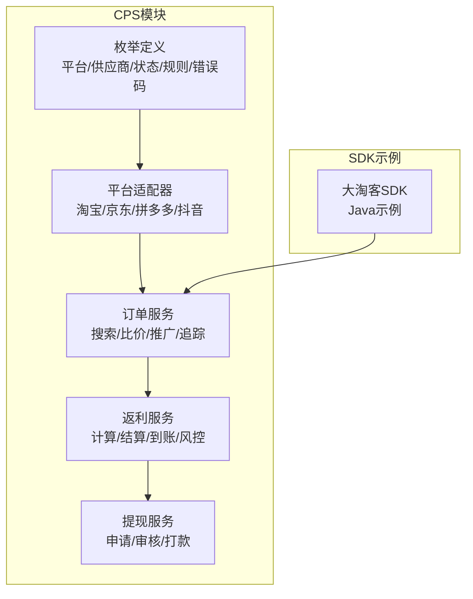
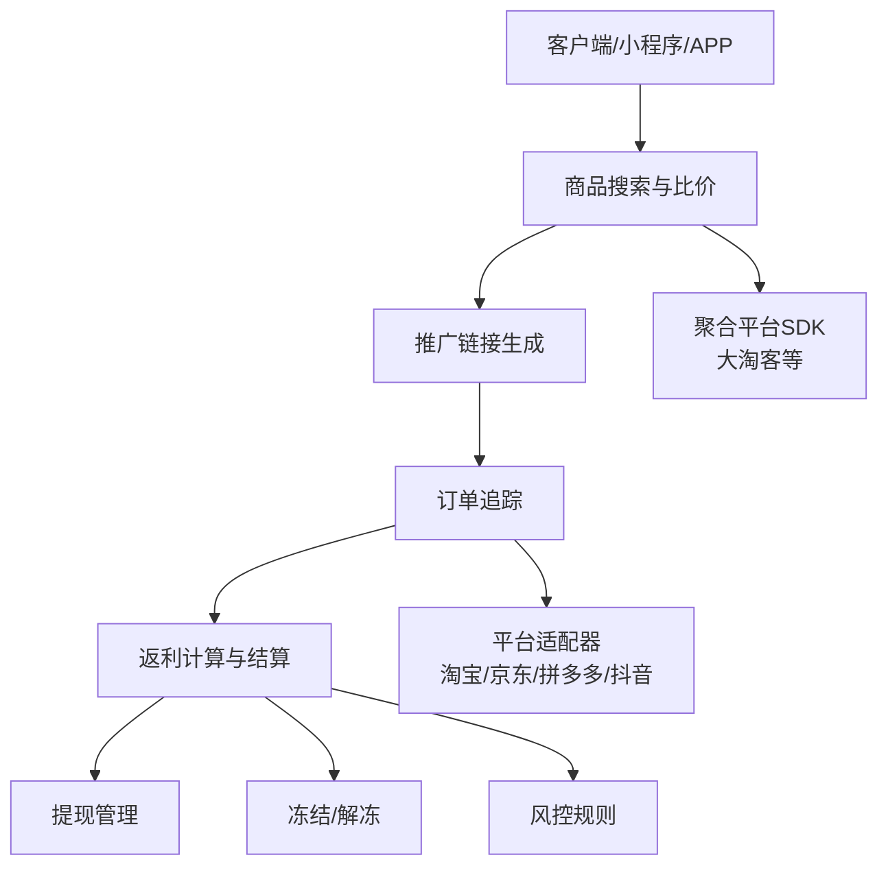
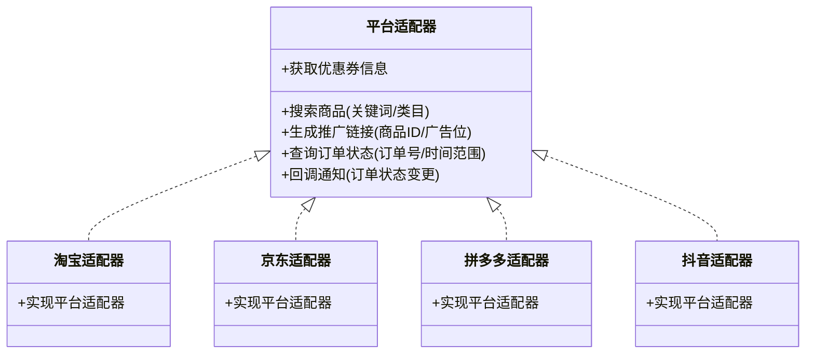
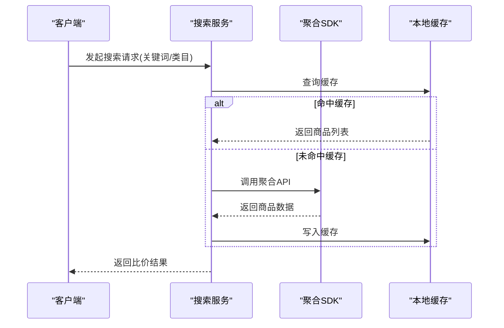
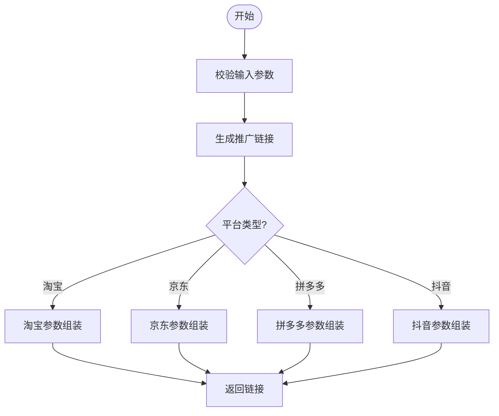
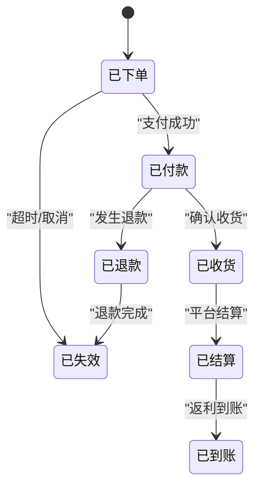
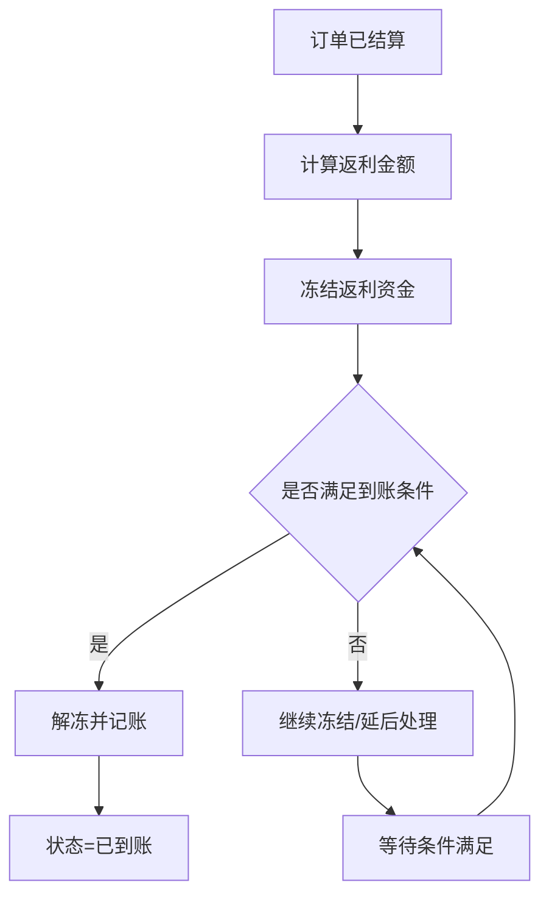
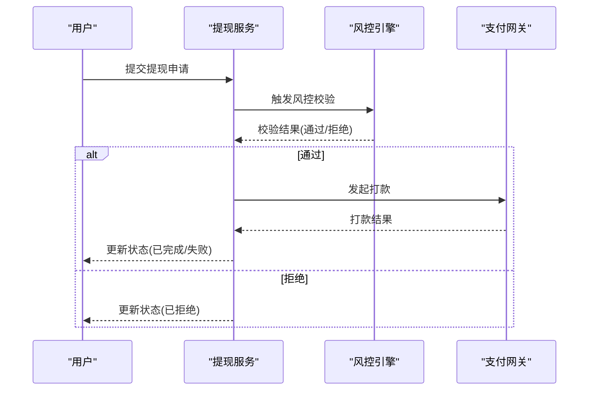
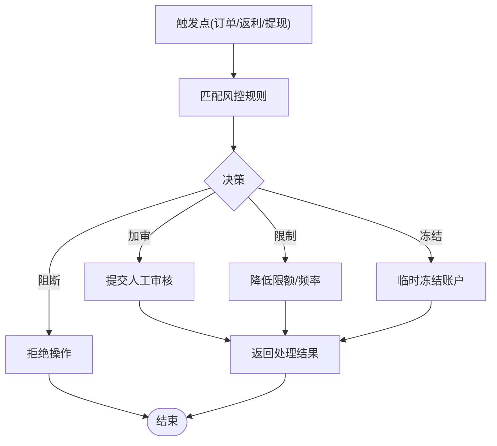
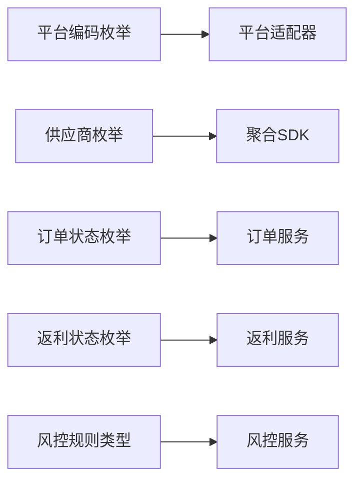

# CPS联盟返利模块

<cite>
**本文引用的文件**
- [CpsPlatformCodeEnum.java](file://backend/qiji-module-cps/qiji-module-cps-api/src/main/java/com/qiji/cps/module/cps/enums/CpsPlatformCodeEnum.java)
- [CpsVendorCodeEnum.java](file://backend/qiji-module-cps/qiji-module-cps-api/src/main/java/com/qiji/cps/module/cps/enums/CpsVendorCodeEnum.java)
- [CpsOrderStatusEnum.java](file://backend/qiji-module-cps/qiji-module-cps-api/src/main/java/com/qiji/cps/module/cps/enums/CpsOrderStatusEnum.java)
- [CpsRebateStatusEnum.java](file://backend/qiji-module-cps/qiji-module-cps-api/src/main/java/com/qiji/cps/module/cps/enums/CpsRebateStatusEnum.java)
- [CpsAdzoneTypeEnum.java](file://backend/qiji-module-cps/qiji-module-cps-api/src/main/java/com/qiji/cps/module/cps/enums/CpsAdzoneTypeEnum.java)
- [CpsFreezeStatusEnum.java](file://backend/qiji-module-cps/qiji-module-cps-api/src/main/java/com/qiji/cps/module/cps/enums/CpsFreezeStatusEnum.java)
- [CpsRebateTypeEnum.java](file://backend/qiji-module-cps/qiji-module-cps-api/src/main/java/com/qiji/cps/module/cps/enums/CpsRebateTypeEnum.java)
- [CpsRiskRuleTypeEnum.java](file://backend/qiji-module-cps/qiji-module-cps-api/src/main/java/com/qiji/cps/module/cps/enums/CpsRiskRuleTypeEnum.java)
- [CpsWithdrawStatusEnum.java](file://backend/qiji-module-cps/qiji-module-cps-api/src/main/java/com/qiji/cps/module/cps/enums/CpsWithdrawStatusEnum.java)
- [CpsErrorCodeConstants.java](file://backend/qiji-module-cps/qiji-module-cps-api/src/main/java/com/qiji/cps/module/cps/enums/CpsErrorCodeConstants.java)
- [DtkJavaOpenPlatformSdkApplication.java](file://agent_improvement/sdk_demo/dataoke-sdk-java/src/main/java/com/dtk/api/DtkJavaOpenPlatformSdkApplication.java)
- [BaseController.java](file://agent_improvement/sdk_demo/dataoke-sdk-java/src/main/java/com/dtk/api/controller/base/BaseController.java)
- [SwaggerConfiguration.java](file://agent_improvement/sdk_demo/dataoke-sdk-java/src/main/java/com/dtk/api/controller/config/SwaggerConfiguration.java)
- [README.md](file://agent_improvement/sdk_demo/dataoke-sdk-java/README.md)
- [pom.xml](file://agent_improvement/sdk_demo/dataoke-sdk-java/pom.xml)
- [CPS系统PRD文档.md](file://docs/CPS系统PRD文档.md)
- [好单库OpenAPI接口文档.md](file://docs/好单库OpenAPI接口文档.md)
</cite>

## 目录
1. [引言](#引言)
2. [项目结构](#项目结构)
3. [核心组件](#核心组件)
4. [架构总览](#架构总览)
5. [详细组件分析](#详细组件分析)
6. [依赖关系分析](#依赖关系分析)
7. [性能考虑](#性能考虑)
8. [故障排查指南](#故障排查指南)
9. [结论](#结论)
10. [附录](#附录)

## 引言
本技术文档面向AgenticCPS CPS联盟返利模块，系统性阐述多平台适配器设计、商品搜索比价、推广链接生成、订单追踪、返利计算与提现管理、风控体系等核心能力。文档以策略模式组织平台适配器（淘宝、京东、拼多多、抖音等），并结合枚举化状态与规则体系，构建从商品搜索到返利到账的全链路闭环。

## 项目结构
CPS模块位于后端工程的独立模块中，采用分层+领域驱动的设计理念：
- 枚举层：统一定义平台、供应商、订单状态、返利状态、冻结状态、返利类型、风控规则类型、提现状态、错误码等
- SDK示例：提供第三方开放平台（如大淘客）的Java SDK示例，便于快速对接聚合API
- 文档：包含系统PRD与第三方OpenAPI接口文档，指导业务与集成

图表来源
- [CpsPlatformCodeEnum.java:1-47](file://backend/qiji-module-cps/qiji-module-cps-api/src/main/java/com/qiji/cps/module/cps/enums/CpsPlatformCodeEnum.java#L1-L47)
- [CpsVendorCodeEnum.java:1-52](file://backend/qiji-module-cps/qiji-module-cps-api/src/main/java/com/qiji/cps/module/cps/enums/CpsVendorCodeEnum.java#L1-L52)
- [CpsOrderStatusEnum.java:1-48](file://backend/qiji-module-cps/qiji-module-cps-api/src/main/java/com/qiji/cps/module/cps/enums/CpsOrderStatusEnum.java#L1-L48)
- [CpsRebateStatusEnum.java:1-40](file://backend/qiji-module-cps/qiji-module-cps-api/src/main/java/com/qiji/cps/module/cps/enums/CpsRebateStatusEnum.java#L1-L40)

章节来源
- [CpsPlatformCodeEnum.java:1-47](file://backend/qiji-module-cps/qiji-module-cps-api/src/main/java/com/qiji/cps/module/cps/enums/CpsPlatformCodeEnum.java#L1-L47)
- [CpsVendorCodeEnum.java:1-52](file://backend/qiji-module-cps/qiji-module-cps-api/src/main/java/com/qiji/cps/module/cps/enums/CpsVendorCodeEnum.java#L1-L52)

## 核心组件
- 平台与供应商枚举：统一平台编码（淘宝/京东/拼多多/抖音等）与供应商类型（聚合平台/官方API）
- 订单状态枚举：覆盖从下单到返利到账的完整生命周期
- 返利状态枚举：待结算、已到账、已扣回
- 冻结与提现状态：账户/返利资金的冻结与提现状态
- 风控规则类型：用于识别不同维度的风控策略
- 错误码常量：标准化错误返回，便于前端与运营定位问题

章节来源
- [CpsPlatformCodeEnum.java:1-47](file://backend/qiji-module-cps/qiji-module-cps-api/src/main/java/com/qiji/cps/module/cps/enums/CpsPlatformCodeEnum.java#L1-L47)
- [CpsVendorCodeEnum.java:1-52](file://backend/qiji-module-cps/qiji-module-cps-api/src/main/java/com/qiji/cps/module/cps/enums/CpsVendorCodeEnum.java#L1-L52)
- [CpsOrderStatusEnum.java:1-48](file://backend/qiji-module-cps/qiji-module-cps-api/src/main/java/com/qiji/cps/module/cps/enums/CpsOrderStatusEnum.java#L1-L48)
- [CpsRebateStatusEnum.java:1-40](file://backend/qiji-module-cps/qiji-module-cps-api/src/main/java/com/qiji/cps/module/cps/enums/CpsRebateStatusEnum.java#L1-L40)
- [CpsFreezeStatusEnum.java](file://backend/qiji-module-cps/qiji-module-cps-api/src/main/java/com/qiji/cps/module/cps/enums/CpsFreezeStatusEnum.java)
- [CpsWithdrawStatusEnum.java](file://backend/qiji-module-cps/qiji-module-cps-api/src/main/java/com/qiji/cps/module/cps/enums/CpsWithdrawStatusEnum.java)
- [CpsRiskRuleTypeEnum.java](file://backend/qiji-module-cps/qiji-module-cps-api/src/main/java/com/qiji/cps/module/cps/enums/CpsRiskRuleTypeEnum.java)
- [CpsErrorCodeConstants.java](file://backend/qiji-module-cps/qiji-module-cps-api/src/main/java/com/qiji/cps/module/cps/enums/CpsErrorCodeConstants.java)

## 架构总览
CPS返利系统采用“策略+适配器”架构，围绕多平台API进行解耦：
- 平台适配器：针对不同联盟平台（淘宝、京东、拼多多、抖音等）抽象统一接口，屏蔽差异
- 商品搜索与比价：通过聚合平台SDK或官方API获取商品信息与优惠券，支持价格对比
- 推广链接生成：根据商品与广告位生成带推广参数的跳转链接
- 订单追踪：订阅/轮询平台订单状态，同步至本地订单表，推进生命周期流转
- 返利计算与结算：基于订单状态与佣金比例计算返利，完成结算与到账
- 提现管理：用户发起提现，风控校验通过后进入打款流程
- 风控系统：基于规则类型对异常行为进行拦截与处理

图表来源
- [CpsPlatformCodeEnum.java:18-24](file://backend/qiji-module-cps/qiji-module-cps-api/src/main/java/com/qiji/cps/module/cps/enums/CpsPlatformCodeEnum.java#L18-L24)
- [CpsVendorCodeEnum.java:20-24](file://backend/qiji-module-cps/qiji-module-cps-api/src/main/java/com/qiji/cps/module/cps/enums/CpsVendorCodeEnum.java#L20-L24)
- [CpsOrderStatusEnum.java:18-25](file://backend/qiji-module-cps/qiji-module-cps-api/src/main/java/com/qiji/cps/module/cps/enums/CpsOrderStatusEnum.java#L18-L25)
- [CpsRebateStatusEnum.java:18-21](file://backend/qiji-module-cps/qiji-module-cps-api/src/main/java/com/qiji/cps/module/cps/enums/CpsRebateStatusEnum.java#L18-L21)

## 详细组件分析

### 平台适配器与策略模式
平台适配器通过策略模式实现，统一对外接口，内部按平台差异封装调用细节。核心平台包括：
- 淘宝联盟
- 京东联盟
- 拼多多联盟
- 抖音联盟
- 其他：唯品会、美团联盟

图表来源
- [CpsPlatformCodeEnum.java:18-24](file://backend/qiji-module-cps/qiji-module-cps-api/src/main/java/com/qiji/cps/module/cps/enums/CpsPlatformCodeEnum.java#L18-L24)

章节来源
- [CpsPlatformCodeEnum.java:1-47](file://backend/qiji-module-cps/qiji-module-cps-api/src/main/java/com/qiji/cps/module/cps/enums/CpsPlatformCodeEnum.java#L1-L47)

### 商品搜索与比价
- 聚合平台接入：通过大淘客等聚合SDK批量获取商品信息、券后价、佣金比例等
- 本地缓存与去重：对热门商品建立索引，避免重复抓取
- 比价逻辑：按平台、类目、销量、佣金率等维度排序，输出最优商品

图表来源
- [CpsVendorCodeEnum.java:20-24](file://backend/qiji-module-cps/qiji-module-cps-api/src/main/java/com/qiji/cps/module/cps/enums/CpsVendorCodeEnum.java#L20-L24)
- [DtkJavaOpenPlatformSdkApplication.java](file://agent_improvement/sdk_demo/dataoke-sdk-java/src/main/java/com/dtk/api/DtkJavaOpenPlatformSdkApplication.java)
- [BaseController.java](file://agent_improvement/sdk_demo/dataoke-sdk-java/src/main/java/com/dtk/api/controller/base/BaseController.java)

章节来源
- [CpsVendorCodeEnum.java:1-52](file://backend/qiji-module-cps/qiji-module-cps-api/src/main/java/com/qiji/cps/module/cps/enums/CpsVendorCodeEnum.java#L1-L52)
- [README.md](file://agent_improvement/sdk_demo/dataoke-sdk-java/README.md)

### 推广链接生成
- 输入：商品ID、广告位ID、渠道标识
- 输出：带推广参数的落地页链接（含推广位、优惠券、返佣比例等）
- 平台差异：各平台参数命名与字段略有不同，适配器内部统一封装

图表来源
- [CpsPlatformCodeEnum.java:18-24](file://backend/qiji-module-cps/qiji-module-cps-api/src/main/java/com/qiji/cps/module/cps/enums/CpsPlatformCodeEnum.java#L18-L24)

章节来源
- [CpsPlatformCodeEnum.java:1-47](file://backend/qiji-module-cps/qiji-module-cps-api/src/main/java/com/qiji/cps/module/cps/enums/CpsPlatformCodeEnum.java#L1-L47)

### 订单追踪与生命周期
订单生命周期从“已下单”到“已结算/已到账”，期间可能触发“已退款/已失效”。系统通过主动轮询或平台回调同步订单状态。

图表来源
- [CpsOrderStatusEnum.java:18-25](file://backend/qiji-module-cps/qiji-module-cps-api/src/main/java/com/qiji/cps/module/cps/enums/CpsOrderStatusEnum.java#L18-L25)
- [CpsRebateStatusEnum.java:18-21](file://backend/qiji-module-cps/qiji-module-cps-api/src/main/java/com/qiji/cps/module/cps/enums/CpsRebateStatusEnum.java#L18-L21)

章节来源
- [CpsOrderStatusEnum.java:1-48](file://backend/qiji-module-cps/qiji-module-cps-api/src/main/java/com/qiji/cps/module/cps/enums/CpsOrderStatusEnum.java#L1-L48)
- [CpsRebateStatusEnum.java:1-40](file://backend/qiji-module-cps/qiji-module-cps-api/src/main/java/com/qiji/cps/module/cps/enums/CpsRebateStatusEnum.java#L1-L40)

### 返利计算与结算
- 计算依据：订单金额、佣金比例、平台补贴、活动返利
- 结算时机：订单“已结算”后，生成返利记录，状态置为“待结算”
- 到账：结算完成后，资金解冻并计入用户余额，状态置为“已到账”
- 扣回：若发生退款或违规，执行“已扣回”

图表来源
- [CpsRebateStatusEnum.java:18-21](file://backend/qiji-module-cps/qiji-module-cps-api/src/main/java/com/qiji/cps/module/cps/enums/CpsRebateStatusEnum.java#L18-L21)
- [CpsFreezeStatusEnum.java](file://backend/qiji-module-cps/qiji-module-cps-api/src/main/java/com/qiji/cps/module/cps/enums/CpsFreezeStatusEnum.java)

章节来源
- [CpsRebateStatusEnum.java:1-40](file://backend/qiji-module-cps/qiji-module-cps-api/src/main/java/com/qiji/cps/module/cps/enums/CpsRebateStatusEnum.java#L1-L40)

### 提现管理流程
- 用户申请：填写提现金额、银行账户、手续费承担方式
- 风控校验：额度、频次、黑名单、异常交易等
- 审核与打款：人工复核或自动审批后发起打款
- 状态更新：申请中、已完成、已拒绝、已撤销

图表来源
- [CpsWithdrawStatusEnum.java](file://backend/qiji-module-cps/qiji-module-cps-api/src/main/java/com/qiji/cps/module/cps/enums/CpsWithdrawStatusEnum.java)
- [CpsRiskRuleTypeEnum.java](file://backend/qiji-module-cps/qiji-module-cps-api/src/main/java/com/qiji/cps/module/cps/enums/CpsRiskRuleTypeEnum.java)

章节来源
- [CpsWithdrawStatusEnum.java](file://backend/qiji-module-cps/qiji-module-cps-api/src/main/java/com/qiji/cps/module/cps/enums/CpsWithdrawStatusEnum.java)
- [CpsRiskRuleTypeEnum.java](file://backend/qiji-module-cps/qiji-module-cps-api/src/main/java/com/qiji/cps/module/cps/enums/CpsRiskRuleTypeEnum.java)

### 风控系统设计
- 规则类型：异常登录、频繁提现、高风险IP、刷单行为、设备指纹异常
- 处理策略：阻断、加审、限制额度、冻结账户
- 与订单/返利/提现联动：在关键节点触发校验，确保资金安全

图表来源
- [CpsRiskRuleTypeEnum.java](file://backend/qiji-module-cps/qiji-module-cps-api/src/main/java/com/qiji/cps/module/cps/enums/CpsRiskRuleTypeEnum.java)

章节来源
- [CpsRiskRuleTypeEnum.java](file://backend/qiji-module-cps/qiji-module-cps-api/src/main/java/com/qiji/cps/module/cps/enums/CpsRiskRuleTypeEnum.java)

## 依赖关系分析
- 平台与供应商：平台编码与供应商类型相互独立，但通常存在“平台-供应商”映射关系
- 状态与流程：订单状态与返利状态共同决定业务流程走向
- SDK与平台：聚合SDK用于快速接入，官方API用于稳定与合规

图表来源
- [CpsPlatformCodeEnum.java:1-47](file://backend/qiji-module-cps/qiji-module-cps-api/src/main/java/com/qiji/cps/module/cps/enums/CpsPlatformCodeEnum.java#L1-L47)
- [CpsVendorCodeEnum.java:1-52](file://backend/qiji-module-cps/qiji-module-cps-api/src/main/java/com/qiji/cps/module/cps/enums/CpsVendorCodeEnum.java#L1-L52)
- [CpsOrderStatusEnum.java:1-48](file://backend/qiji-module-cps/qiji-module-cps-api/src/main/java/com/qiji/cps/module/cps/enums/CpsOrderStatusEnum.java#L1-L48)
- [CpsRebateStatusEnum.java:1-40](file://backend/qiji-module-cps/qiji-module-cps-api/src/main/java/com/qiji/cps/module/cps/enums/CpsRebateStatusEnum.java#L1-L40)
- [CpsRiskRuleTypeEnum.java](file://backend/qiji-module-cps/qiji-module-cps-api/src/main/java/com/qiji/cps/module/cps/enums/CpsRiskRuleTypeEnum.java)

章节来源
- [CpsPlatformCodeEnum.java:1-47](file://backend/qiji-module-cps/qiji-module-cps-api/src/main/java/com/qiji/cps/module/cps/enums/CpsPlatformCodeEnum.java#L1-L47)
- [CpsVendorCodeEnum.java:1-52](file://backend/qiji-module-cps/qiji-module-cps-api/src/main/java/com/qiji/cps/module/cps/enums/CpsVendorCodeEnum.java#L1-L52)
- [CpsOrderStatusEnum.java:1-48](file://backend/qiji-module-cps/qiji-module-cps-api/src/main/java/com/qiji/cps/module/cps/enums/CpsOrderStatusEnum.java#L1-L48)
- [CpsRebateStatusEnum.java:1-40](file://backend/qiji-module-cps/qiji-module-cps-api/src/main/java/com/qiji/cps/module/cps/enums/CpsRebateStatusEnum.java#L1-L40)

## 性能考虑
- 缓存策略：热点商品与优惠信息使用本地缓存，降低聚合API调用频率
- 异步处理：订单同步、返利计算、提现打款采用消息队列异步执行
- 分页与限流：聚合API调用需遵循限流策略，避免触发平台风控
- 幂等设计：订单回调与轮询均需保证幂等，防止重复结算
- 监控与告警：对关键链路埋点，设置延迟与成功率阈值告警

## 故障排查指南
- 错误码定位：参考错误码常量，快速定位问题类型（参数错误、权限不足、接口限流、上游异常）
- 日志追踪：为每个请求生成唯一traceId，串联搜索、推广、订单、返利、提现全流程日志
- 回放与重试：对失败的回调与打款任务提供重试与回放机制
- 平台差异：针对不同平台的特殊字段与错误信息，准备差异化处理分支

章节来源
- [CpsErrorCodeConstants.java](file://backend/qiji-module-cps/qiji-module-cps-api/src/main/java/com/qiji/cps/module/cps/enums/CpsErrorCodeConstants.java)

## 结论
CPS联盟返利模块通过策略化平台适配器与标准化状态机，实现了多平台、多场景的一致体验；配合聚合SDK与官方API，既能快速扩展又能满足合规要求。完善的风控与提现体系保障了资金安全与用户体验。

## 附录

### API接口文档与集成指南
- 聚合平台OpenAPI：参考“好单库OpenAPI接口文档”，了解商品搜索、优惠券、推广链接等接口规范
- SDK示例：参考“大淘客Java SDK示例”，学习初始化、认证、调用与回调处理
- Swagger文档：可在SDK示例工程中启用Swagger，查看接口清单与参数说明

章节来源
- [好单库OpenAPI接口文档.md](file://docs/好单库OpenAPI接口文档.md)
- [README.md](file://agent_improvement/sdk_demo/dataoke-sdk-java/README.md)
- [SwaggerConfiguration.java](file://agent_improvement/sdk_demo/dataoke-sdk-java/src/main/java/com/dtk/api/controller/config/SwaggerConfiguration.java)

### 配置示例与最佳实践
- 平台接入：在平台枚举中新增平台编码，并在适配器中实现对应方法
- 供应商选择：优先使用官方API以保证稳定性，聚合API用于快速扩展
- 状态管理：严格遵循订单与返利状态机，避免状态错乱
- 风控策略：结合业务场景动态调整规则阈值，定期评估效果

章节来源
- [CpsPlatformCodeEnum.java:1-47](file://backend/qiji-module-cps/qiji-module-cps-api/src/main/java/com/qiji/cps/module/cps/enums/CpsPlatformCodeEnum.java#L1-L47)
- [CpsVendorCodeEnum.java:1-52](file://backend/qiji-module-cps/qiji-module-cps-api/src/main/java/com/qiji/cps/module/cps/enums/CpsVendorCodeEnum.java#L1-L52)