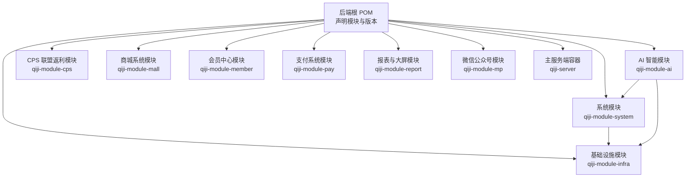
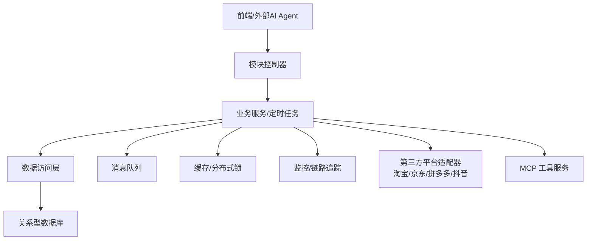
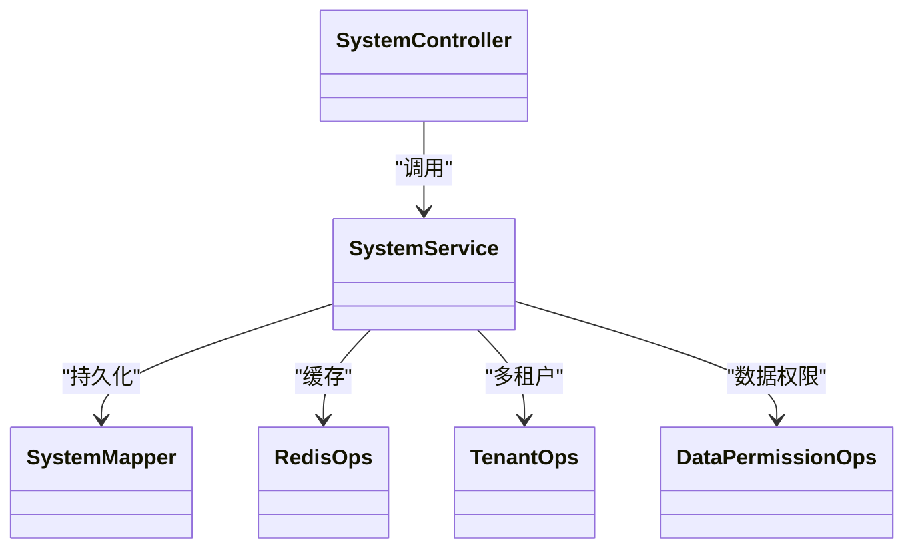
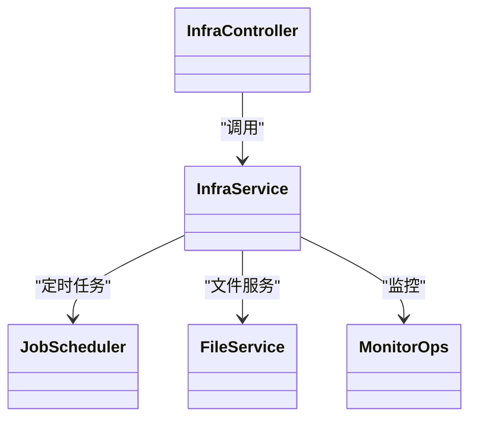
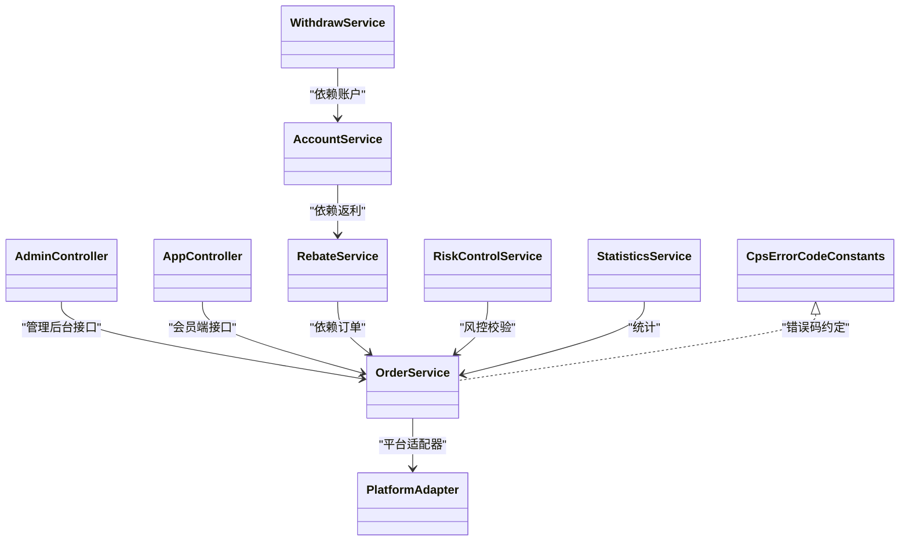
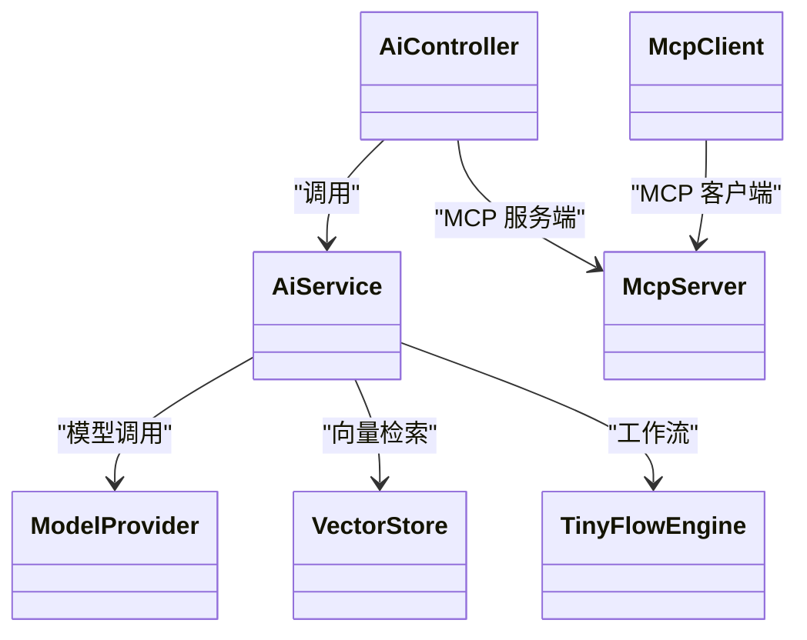
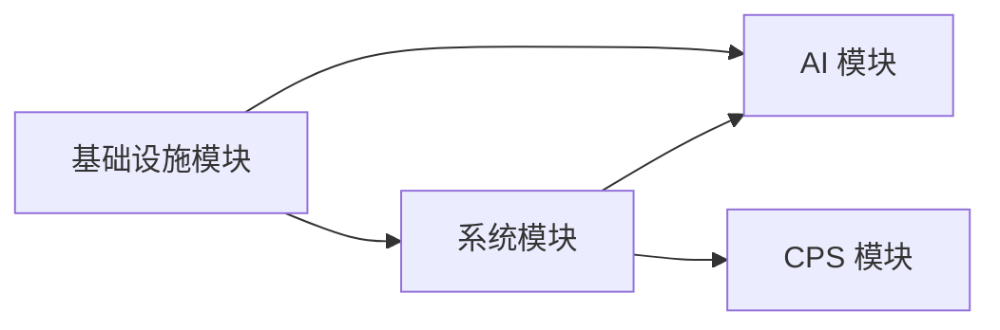

# 业务模块

<cite>
**本文引用的文件**
- [后端根 POM](file://backend/pom.xml)
- [系统模块 POM](file://backend/qiji-module-system/pom.xml)
- [基础设施模块 POM](file://backend/qiji-module-infra/pom.xml)
- [AI 模块 POM](file://backend/qiji-module-ai/pom.xml)
- [CPS 模块 POM](file://backend/qiji-module-cps/pom.xml)
- [CPS 错误码枚举](file://backend/qiji-module-cps/qiji-module-cps-api/src/main/java/com/qiji/cps/module/cps/enums/CpsErrorCodeConstants.java)
- [系统模块 README](file://backend/README.md)
</cite>

## 目录
1. [简介](#简介)
2. [项目结构](#项目结构)
3. [核心模块](#核心模块)
4. [架构总览](#架构总览)
5. [详细模块分析](#详细模块分析)
6. [依赖关系分析](#依赖关系分析)
7. [性能考量](#性能考量)
8. [故障排查指南](#故障排查指南)
9. [结论](#结论)
10. [附录](#附录)

## 简介
AgenticCPS 是一套融合“氛围编程（Vibe Coding）”“低代码”“AI 自主编程”的开箱即用型 CPS 联盟返利与导购平台。其业务模块围绕系统管理、基础设施、CPS 联盟返利、AI 智能等核心领域展开，形成“基础设施支撑 + 系统管理 + 业务域（CPS/商城/会员/报表等） + AI 能力”的分层架构。模块间通过清晰的依赖与接口契约协同，配合定时任务、消息队列、监控与多租户等基础设施能力，实现从商品搜索、订单追踪、返利结算到 MCP AI 工具调用的完整闭环。

## 项目结构
后端采用 Maven 多模块组织，顶层 POM 声明了核心模块集合与版本管理。系统模块与基础设施模块位于模块树底部，向上为通用业务与核心业务域，AI 模块与 CPS 模块分别承载大模型能力与返利业务域。

**图示来源**
- [后端根 POM:10-25](file://backend/pom.xml#L10-L25)
- [系统模块 POM:21-35](file://backend/qiji-module-system/pom.xml#L21-L35)
- [基础设施模块 POM:21-27](file://backend/qiji-module-infra/pom.xml#L21-L27)
- [AI 模块 POM:29-38](file://backend/qiji-module-ai/pom.xml#L29-L38)
- [CPS 模块 POM:21-24](file://backend/qiji-module-cps/pom.xml#L21-L24)

**章节来源**
- [后端根 POM:10-25](file://backend/pom.xml#L10-L25)
- [系统模块 README:261-279](file://backend/README.md#L261-L279)

## 核心模块
- 系统管理模块（qiji-module-system）
  - 职责：用户、角色、菜单、部门、字典、日志、验证码、社交登录、邮件等通用能力，为上层业务提供统一的安全、权限与数据治理基础。
  - 依赖：基础设施模块；集成安全、多租户、IP、数据权限、定时任务、消息队列、Excel 工具等。
- 基础设施模块（qiji-module-infra）
  - 职责：运维与研发工具，包括定时任务、WebSocket、代码生成器、接口文档、Spring Boot Admin、文件服务（FTP/SFTP/OSS）、监控等。
  - 依赖：多租户等业务组件。
- CPS 联盟返利模块（qiji-module-cps）
  - 职责：平台接入、推广位、订单同步、返利计算、提现、风控、统计、MCP AI 接口等。
  - 组织：API 定义层（枚举、远程接口）与业务实现层（控制器、服务、平台适配器、定时任务、MCP 接口）。
- AI 智能模块（qiji-module-ai）
  - 职责：接入多种大模型（OpenAI、通义、文心、DeepSeek、Ollama、Stable Diffusion 等），提供聊天、图像生成、向量检索、TinyFlow 工作流与 MCP 服务端/客户端能力，支撑 MCP AI 工具调用。

**章节来源**
- [系统模块 README:247-258](file://backend/README.md#L247-L258)
- [系统模块 POM:20-122](file://backend/qiji-module-system/pom.xml#L20-L122)
- [基础设施模块 POM:21-117](file://backend/qiji-module-infra/pom.xml#L21-L117)
- [CPS 模块 POM:21-24](file://backend/qiji-module-cps/pom.xml#L21-L24)
- [AI 模块 POM:28-262](file://backend/qiji-module-ai/pom.xml#L28-L262)

## 架构总览
系统采用“分层 + 分域”的架构设计：
- 表现层：前端（Vue3/UniApp）与 MCP 工具调用入口。
- 控制层：模块内的 Controller/Handler，负责参数校验、鉴权与路由。
- 业务层：Service/Job/Adapter，封装业务规则与流程。
- 数据访问层：Mapper/DO/DAO，抽象数据库访问。
- 基础设施层：定时任务、消息队列、缓存、监控、文件服务、多租户、安全等。

**图示来源**
- [系统模块 README:223-243](file://backend/README.md#L223-L243)
- [AI 模块 POM:198-221](file://backend/qiji-module-ai/pom.xml#L198-L221)

## 详细模块分析

### 系统管理模块（qiji-module-system）
- 设计目标
  - 为上层业务提供统一的安全、权限、数据字典、日志与通用功能，降低重复开发。
- 职责划分
  - 用户与组织：用户、部门、岗位、角色、菜单、字典、操作日志、登录日志。
  - 安全与认证：Spring Security、验证码、社交登录（微信等）。
  - 运维与工具：邮件、Excel 导出、定时任务、消息队列、数据权限、多租户、IP 组件。
- 分层架构
  - 控制层：系统管理相关 Controller。
  - 业务层：系统管理相关 Service。
  - 数据层：MyBatis Plus Mapper/DO。
  - 基础设施：Redis、定时任务、MQ、监控等。
- 生命周期与扩展
  - 通过 Starter 组件按需启用，支持多租户隔离与数据权限控制。
  - 可扩展社交登录、验证码、邮件等通用能力。

**图示来源**
- [系统模块 POM:20-122](file://backend/qiji-module-system/pom.xml#L20-L122)

**章节来源**
- [系统模块 POM:20-122](file://backend/qiji-module-system/pom.xml#L20-L122)

### 基础设施模块（qiji-module-infra）
- 设计目标
  - 提供运维与研发工具能力，支撑上层通用与核心业务稳定运行。
- 职责划分
  - 运维：定时任务、WebSocket、Spring Boot Admin。
  - 研发工具：代码生成器、接口文档、文件服务（FTP/SFTP/OSS）、监控。
- 分层架构
  - 控制层：定时任务、文件上传/下载、WebSocket 等接口。
  - 业务层：任务调度、文件处理、监控采集等。
  - 基础设施：Redis、MQ、监控、文件客户端等。
- 生命周期与扩展
  - 通过 Starter 组件启用，支持多数据库方言与代码生成模板扩展。

**图示来源**
- [基础设施模块 POM:21-117](file://backend/qiji-module-infra/pom.xml#L21-L117)

**章节来源**
- [基础设施模块 POM:21-117](file://backend/qiji-module-infra/pom.xml#L21-L117)

### CPS 联盟返利模块（qiji-module-cps）
- 设计目标
  - 聚合主流电商联盟平台，提供从搜索、比价、转链、下单到返利结算与提现的全链路能力。
- 职责划分
  - API 定义层：平台编码、订单状态、返利类型、错误码等枚举与远程接口。
  - 业务实现层：管理后台与会员端接口、7 大业务服务、平台适配器（策略扩展）、定时任务、MCP 工具。
- 分层架构
  - 控制层：admin/app 控制器。
  - 业务层：订单、返利、账户、提现、风控、统计、MCP 等服务。
  - 数据层：核心业务表（订单、返利、账户、提现、冻结、风控等）。
- 错误码与接口约定
  - 采用统一错误码常量接口，按模块段落划分，便于前端与 MCP 工具侧统一处理。
- 生命周期与扩展
  - 平台适配器采用策略模式，新增平台只需实现适配器接口并注册，即可无缝接入。

**图示来源**
- [CPS 错误码枚举:10-68](file://backend/qiji-module-cps/qiji-module-cps-api/src/main/java/com/qiji/cps/module/cps/enums/CpsErrorCodeConstants.java#L10-L68)
- [系统模块 README:223-243](file://backend/README.md#L223-L243)

**章节来源**
- [CPS 错误码枚举:10-68](file://backend/qiji-module-cps/qiji-module-cps-api/src/main/java/com/qiji/cps/module/cps/enums/CpsErrorCodeConstants.java#L10-L68)
- [系统模块 README:223-243](file://backend/README.md#L223-L243)

### AI 智能模块（qiji-module-ai）
- 设计目标
  - 提供多模态与多模型接入能力，结合 TinyFlow 工作流与 MCP 协议，实现零代码接入的 AI 工具服务。
- 职责划分
  - 多模型接入：OpenAI、Azure OpenAI、Anthropic、DeepSeek、Ollama、Stability AI、通义、文心、Moonshot 等。
  - 向量检索：Qdrant、Redis、Milvus 等向量存储。
  - MCP：服务端与客户端，支持外部 AI Agent 直接调用。
  - 工作流：TinyFlow Java 核心，支持复杂 AI 工作流编排。
- 分层架构
  - 控制层：MCP 工具服务端控制器。
  - 业务层：模型调用、向量检索、工作流编排。
  - 基础设施：Redis、MQ、监控等。
- 生命周期与扩展
  - 通过 Starter 组件按需引入模型与向量存储，支持新模型与向量库的快速接入。

**图示来源**
- [AI 模块 POM:77-261](file://backend/qiji-module-ai/pom.xml#L77-L261)

**章节来源**
- [AI 模块 POM:28-262](file://backend/qiji-module-ai/pom.xml#L28-L262)

## 依赖关系分析
- 模块依赖
  - 系统模块依赖基础设施模块，提供安全、多租户、数据权限等通用能力。
  - AI 模块同时依赖系统与基础设施模块，承接统一安全与运维能力。
  - CPS 模块为业务域模块，向上依赖系统/基础设施能力。
- 外部依赖
  - 各模块通过 Starter 组件引入安全、缓存、定时任务、消息队列、监控、Excel、WebSocket 等能力。
  - AI 模块引入多模型与向量存储 Starter，并集成 MCP 服务端/客户端。

**图示来源**
- [系统模块 POM:21-35](file://backend/qiji-module-system/pom.xml#L21-L35)
- [基础设施模块 POM:22-26](file://backend/qiji-module-infra/pom.xml#L22-L26)
- [AI 模块 POM:29-38](file://backend/qiji-module-ai/pom.xml#L29-L38)
- [CPS 模块 POM:21-24](file://backend/qiji-module-cps/pom.xml#L21-L24)

**章节来源**
- [系统模块 POM:21-35](file://backend/qiji-module-system/pom.xml#L21-L35)
- [基础设施模块 POM:22-26](file://backend/qiji-module-infra/pom.xml#L22-L26)
- [AI 模块 POM:29-38](file://backend/qiji-module-ai/pom.xml#L29-L38)
- [CPS 模块 POM:21-24](file://backend/qiji-module-cps/pom.xml#L21-L24)

## 性能考量
- 搜索与比价：单平台搜索 P99 < 2 秒，多平台比价 P99 < 5 秒。
- 转链生成：P99 < 1 秒。
- 订单同步：延迟 < 30 分钟。
- 返利入账：平台结算后 24 小时内。
- MCP 工具调用：搜索类 < 3 秒，查询类 < 1 秒。
- 缓存与并发：结合 Redis 与分布式锁，优化热点数据与并发一致性。
- 监控与可观测性：集成 SkyWalking、Spring Boot Admin，保障线上问题快速定位。

**章节来源**
- [系统模块 README:326-336](file://backend/README.md#L326-L336)

## 故障排查指南
- 错误码定位
  - 使用 CPS 错误码常量接口，按模块段落快速定位错误类型与上下文信息。
- 日志与链路追踪
  - 通过 Spring Boot Admin 与 SkyWalking 查看服务健康与调用链路。
- 定时任务与消息队列
  - 检查任务调度状态与消息投递情况，确保订单同步与返利结算按时执行。
- 缓存一致性
  - 核对缓存键命名与失效策略，避免脏读与雪崩。
- MCP 工具调用
  - 校验 MCP 服务端/客户端配置，确保外部 AI Agent 能正常调用工具。

**章节来源**
- [CPS 错误码枚举:10-68](file://backend/qiji-module-cps/qiji-module-cps-api/src/main/java/com/qiji/cps/module/cps/enums/CpsErrorCodeConstants.java#L10-L68)
- [系统模块 README:326-336](file://backend/README.md#L326-L336)

## 结论
AgenticCPS 的业务模块以“基础设施 + 系统管理 + 业务域 + AI 能力”为主线，通过清晰的分层与模块化设计，实现了从返利闭环到 MCP 工具生态的全面覆盖。系统模块与基础设施模块提供统一的安全、权限、运维与研发工具能力；CPS 模块聚焦联盟返利全链路；AI 模块则通过多模型与 MCP 协议，为外部 AI Agent 提供零代码接入能力。整体架构具备良好的扩展性与可维护性，适合一人公司或小型团队快速落地与持续演进。

## 附录
- 快速开始与环境要求
  - JDK 17/21、MySQL 5.7/8.0+、Redis 5.0+、Maven 3.8+、Node.js 16+。
- 模块能力矩阵
  - 系统管理、会员中心、支付系统、工作流、数据报表、AI 大模型、微信公众号、商城系统、基础设施等模块均提供低代码与可视化能力。

**章节来源**
- [系统模块 README:299-336](file://backend/README.md#L299-L336)
- [系统模块 README:245-258](file://backend/README.md#L245-L258)