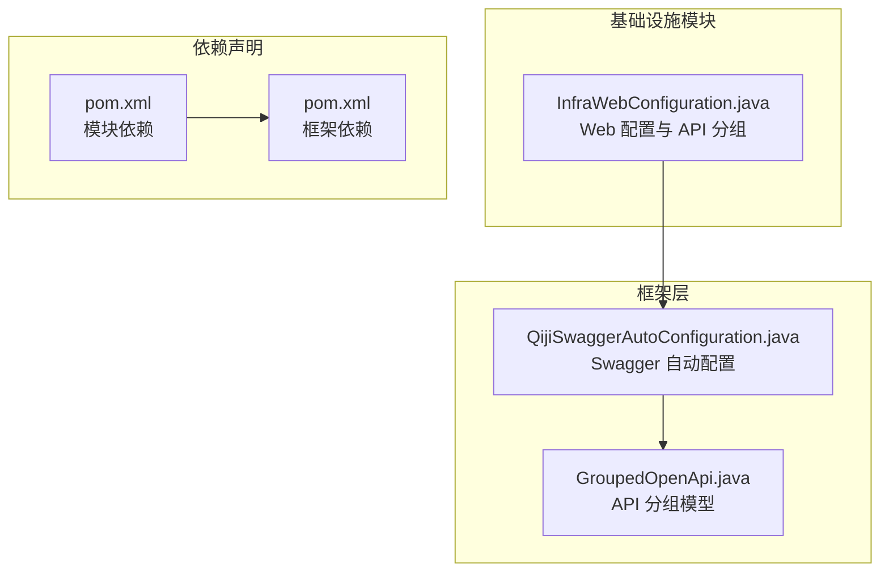
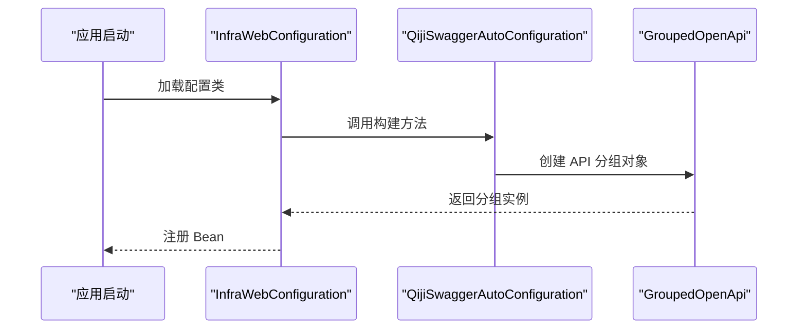
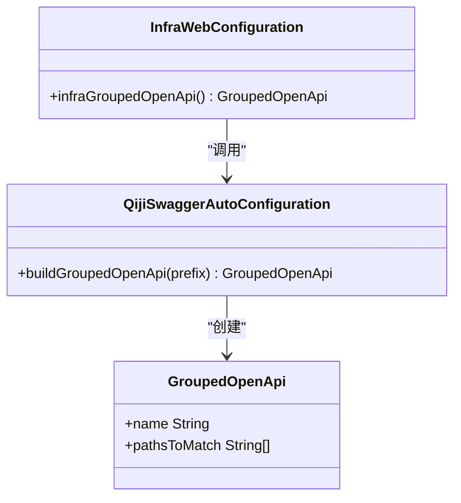
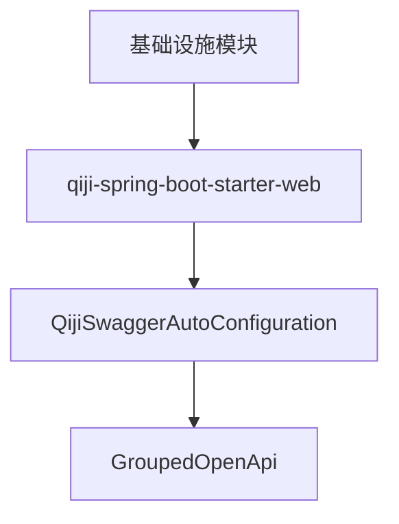

# 基础设施模块

<cite>
**本文档引用的文件**
- [InfraWebConfiguration.java](file://backend/qiji-module-infra/src/main/java/com/qiji/cps/module/infra/framework/web/config/InfraWebConfiguration.java)
- [QijiSwaggerAutoConfiguration.java](file://backend/qiji-framework/qiji-spring-boot-starter-web/src/main/java/com/qiji/cps/framework/swagger/config/QijiSwaggerAutoConfiguration.java)
- [GroupedOpenApi.java](file://backend/qiji-framework/qiji-spring-boot-starter-web/src/main/java/org/springdoc/core/models/GroupedOpenApi.java)
- [pom.xml](file://backend/qiji-module-infra/pom.xml)
- [pom.xml](file://backend/qiji-framework/qiji-spring-boot-starter-web/pom.xml)
- [README.md](file://backend/README.md)
</cite>

## 目录
1. [简介](#简介)
2. [项目结构](#项目结构)
3. [核心组件](#核心组件)
4. [架构总览](#架构总览)
5. [详细组件分析](#详细组件分析)
6. [依赖分析](#依赖分析)
7. [性能考虑](#性能考虑)
8. [故障排除指南](#故障排除指南)
9. [结论](#结论)

## 简介
本文件为 AgenticCPS 基础设施模块的综合技术文档，聚焦于支撑层能力的架构与实现，包括但不限于：
- Web 层配置与 API 文档分组
- 文件管理与存储（本地/云）能力
- 代码生成器（模板引擎、批量生成）
- 定时任务框架（调度、执行监控、失败重试）
- 数据源配置与 API 访问日志
- 运维相关：配置管理、监控告警、性能优化

说明：当前仓库中基础设施模块的实现以 Web 配置与 API 文档分组为主，其他能力在后续版本中逐步完善。本文将基于现有代码进行深入分析，并提供面向未来的扩展建议与最佳实践。

## 项目结构
基础设施模块位于后端工程的独立模块中，采用标准 Maven 多模块结构组织，核心职责是为上层业务提供通用的 Web 配置与 API 文档分组能力。

**图表来源**
- [InfraWebConfiguration.java:1-25](file://backend/qiji-module-infra/src/main/java/com/qiji/cps/module/infra/framework/web/config/InfraWebConfiguration.java#L1-L25)
- [QijiSwaggerAutoConfiguration.java](file://backend/qiji-framework/qiji-spring-boot-starter-web/src/main/java/com/qiji/cps/framework/swagger/config/QijiSwaggerAutoConfiguration.java)
- [GroupedOpenApi.java](file://backend/qiji-framework/qiji-spring-boot-starter-web/src/main/java/org/springdoc/core/models/GroupedOpenApi.java)
- [pom.xml](file://backend/qiji-module-infra/pom.xml)
- [pom.xml](file://backend/qiji-framework/qiji-spring-boot-starter-web/pom.xml)

**章节来源**
- [InfraWebConfiguration.java:1-25](file://backend/qiji-module-infra/src/main/java/com/qiji/cps/module/infra/framework/web/config/InfraWebConfiguration.java#L1-L25)
- [pom.xml](file://backend/qiji-module-infra/pom.xml)
- [pom.xml](file://backend/qiji-framework/qiji-spring-boot-starter-web/pom.xml)

## 核心组件
- Web 配置与 API 文档分组：通过基础设施模块的配置类，定义并注册 API 分组，便于统一管理与文档化。
- Swagger 自动配置：基于框架提供的自动配置能力，快速构建 API 分组对象。
- 依赖声明：模块与框架层的依赖关系清晰，确保功能可复用与升级。

**章节来源**
- [InfraWebConfiguration.java:13-22](file://backend/qiji-module-infra/src/main/java/com/qiji/cps/module/infra/framework/web/config/InfraWebConfiguration.java#L13-L22)
- [QijiSwaggerAutoConfiguration.java](file://backend/qiji-framework/qiji-spring-boot-starter-web/src/main/java/com/qiji/cps/framework/swagger/config/QijiSwaggerAutoConfiguration.java)
- [GroupedOpenApi.java](file://backend/qiji-framework/qiji-spring-boot-starter-web/src/main/java/org/springdoc/core/models/GroupedOpenApi.java)

## 架构总览
基础设施模块的架构围绕“配置即服务”的理念展开，通过最小化的代码实现最大化的可扩展性。其核心交互如下：

**图表来源**
- [InfraWebConfiguration.java:19-22](file://backend/qiji-module-infra/src/main/java/com/qiji/cps/module/infra/framework/web/config/InfraWebConfiguration.java#L19-L22)
- [QijiSwaggerAutoConfiguration.java](file://backend/qiji-framework/qiji-spring-boot-starter-web/src/main/java/com/qiji/cps/framework/swagger/config/QijiSwaggerAutoConfiguration.java)
- [GroupedOpenApi.java](file://backend/qiji-framework/qiji-spring-boot-starter-web/src/main/java/org/springdoc/core/models/GroupedOpenApi.java)

## 详细组件分析

### Web 配置与 API 文档分组
- 职责：为基础设施模块提供统一的 Web 配置与 API 文档分组能力。
- 关键点：
  - 使用注解驱动的配置类，避免 XML 配置。
  - 通过框架提供的自动配置能力，简化 API 分组对象的创建。
  - 将模块 API 收敛到特定分组，便于文档化与治理。

**图表来源**
- [InfraWebConfiguration.java:13-22](file://backend/qiji-module-infra/src/main/java/com/qiji/cps/module/infra/framework/web/config/InfraWebConfiguration.java#L13-L22)
- [QijiSwaggerAutoConfiguration.java](file://backend/qiji-framework/qiji-spring-boot-starter-web/src/main/java/com/qiji/cps/framework/swagger/config/QijiSwaggerAutoConfiguration.java)
- [GroupedOpenApi.java](file://backend/qiji-framework/qiji-spring-boot-starter-web/src/main/java/org/springdoc/core/models/GroupedOpenApi.java)

**章节来源**
- [InfraWebConfiguration.java:13-22](file://backend/qiji-module-infra/src/main/java/com/qiji/cps/module/infra/framework/web/config/InfraWebConfiguration.java#L13-L22)

### 代码生成器（模板引擎、批量生成）
- 当前状态：仓库中未发现代码生成器的具体实现文件。
- 建议架构（概念性）：
  - 模板引擎：支持多模板格式（如 Velocity、Freemarker），提供上下文渲染能力。
  - 批量生成：基于配置驱动，支持按规则批量生成文件，输出至本地或云存储。
  - 错误处理：对模板解析、渲染、写入过程进行异常捕获与重试策略。
- 参考实现模式（非仓库内容）：
  - 模板加载与缓存
  - 上下文构建与变量替换
  - 输出路径规划与权限控制
  - 生成进度与结果回传

[本节为概念性说明，不直接分析具体文件，故无“章节来源”]

### 定时任务框架（调度、执行监控、失败重试）
- 当前状态：仓库中未发现定时任务框架的具体实现文件。
- 建议架构（概念性）：
  - 调度层：基于 Quartz 或 Spring Task，支持 Cron 表达式与动态调度。
  - 执行层：任务隔离与超时控制，失败时记录日志并触发重试。
  - 监控层：任务状态上报、执行耗时统计、告警阈值设置。
- 参考实现模式（非仓库内容）：
  - 任务注册与元数据管理
  - 并发控制与资源限制
  - 重试策略（指数退避、最大重试次数）
  - 历史记录归档与清理

[本节为概念性说明，不直接分析具体文件，故无“章节来源”]

### 文件存储服务（本地/云存储、上传下载）
- 当前状态：仓库中未发现文件存储服务的具体实现文件。
- 建议架构（概念性）：
  - 抽象存储接口：统一本地与云存储的访问方式。
  - 上传流程：鉴权、格式校验、分片上传、断点续传。
  - 下载流程：签名访问、带宽控制、防盗链策略。
  - 生命周期管理：过期清理、配额控制、成本优化。
- 参考实现模式（非仓库内容）：
  - 存储桶/目录结构设计
  - 元数据索引与检索
  - 并发安全与一致性保障

[本节为概念性说明，不直接分析具体文件，故无“章节来源”]

### 数据源配置与 API 访问日志
- 当前状态：仓库中未发现数据源配置与 API 日志的具体实现文件。
- 建议架构（概念性）：
  - 数据源配置：支持多数据源、读写分离、连接池参数调优。
  - API 日志：请求/响应体采集、敏感信息脱敏、异步落库与查询。
  - 监控指标：吞吐量、延迟分布、错误率、热点接口识别。
- 参考实现模式（非仓库内容）：
  - 动态数据源切换
  - 结构化日志格式与索引字段
  - 日志聚合与可视化面板

[本节为概念性说明，不直接分析具体文件，故无“章节来源”]

## 依赖分析
基础设施模块与框架层的依赖关系清晰，模块通过引入框架提供的 Swagger 自动配置能力，实现 API 分组的快速构建与注册。

**图表来源**
- [InfraWebConfiguration.java:3-4](file://backend/qiji-module-infra/src/main/java/com/qiji/cps/module/infra/framework/web/config/InfraWebConfiguration.java#L3-L4)
- [QijiSwaggerAutoConfiguration.java](file://backend/qiji-framework/qiji-spring-boot-starter-web/src/main/java/com/qiji/cps/framework/swagger/config/QijiSwaggerAutoConfiguration.java)
- [GroupedOpenApi.java](file://backend/qiji-framework/qiji-spring-boot-starter-web/src/main/java/org/springdoc/core/models/GroupedOpenApi.java)

**章节来源**
- [pom.xml](file://backend/qiji-module-infra/pom.xml)
- [pom.xml](file://backend/qiji-framework/qiji-spring-boot-starter-web/pom.xml)

## 性能考虑
- 启动性能：减少不必要的 Bean 初始化，按需加载配置。
- API 文档：仅在开发环境启用详细文档，生产环境关闭冗余扫描。
- 依赖精简：避免重复依赖，统一版本管理，降低包体积。
- 缓存策略：对静态资源与常用配置进行缓存，提升响应速度。

[本节提供一般性指导，不直接分析具体文件，故无“章节来源”]

## 故障排除指南
- API 文档不可见：
  - 检查模块是否正确注册了 API 分组 Bean。
  - 确认框架自动配置是否生效。
- 启动报错：
  - 核对依赖版本是否与框架要求一致。
  - 清理缓存并重新编译模块。
- 配置不生效：
  - 确认配置类被 Spring 扫描到。
  - 检查是否存在同名 Bean 导致覆盖。

[本节提供一般性指导，不直接分析具体文件，故无“章节来源”]

## 结论
基础设施模块当前以 Web 配置与 API 文档分组为核心能力，通过框架层的自动配置实现低代码接入。未来可在文件管理、代码生成、定时任务、数据源与日志等方面持续扩展，形成完整的基础设施支撑体系。建议遵循“配置即服务”的设计理念，保持模块间的低耦合与高内聚，确保可维护性与可扩展性。