# 平台管理功能增强

<cite>
**本文档引用的文件**
- [pom.xml](file://backend/pom.xml)
- [ModuleSystemApplication.java](file://backend/qiji-module-system/src/main/java/com/qiji/cps/ModuleSystemApplication.java)
- [DeptApi.java](file://backend/qiji-module-system/src/main/java/com/qiji/cps/module/system/api/dept/DeptApi.java)
- [DictDataApi.java](file://backend/qiji-module-system/src/main/java/com/qiji/cps/module/system/api/dict/DictDataApi.java)
- [package.json](file://frontend/admin-uniapp/package.json)
</cite>

## 目录
1. [项目概述](#项目概述)
2. [项目架构](#项目架构)
3. [核心组件分析](#核心组件分析)
4. [系统架构概览](#系统架构概览)
5. [详细组件分析](#详细组件分析)
6. [依赖关系分析](#依赖关系分析)
7. [性能考虑](#性能考虑)
8. [故障排除指南](#故障排除指南)
9. [结论](#结论)

## 项目概述

AgenticCPS是一个基于Spring Boot 3.5.9和Vue.js技术栈的企业级应用平台，采用模块化架构设计。该项目旨在提供一个完整的业务支撑平台，包含系统管理、基础设施管理、会员管理、支付管理等多个业务模块。

项目采用前后端分离架构，后端使用Java 17开发，前端使用UniApp框架构建跨平台应用。整体架构体现了现代化企业应用的特点，具备良好的扩展性和维护性。

## 项目架构

AgenticCPS项目采用多模块Maven架构，主要包含以下核心模块：

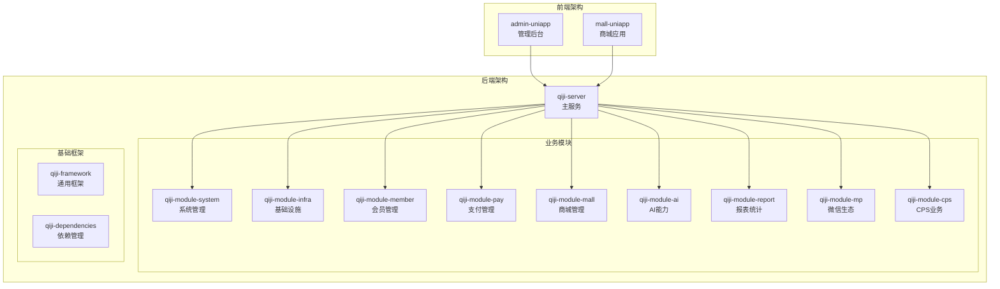

**图表来源**
- [pom.xml:10-25](file://backend/pom.xml#L10-L25)
- [pom.xml:31-45](file://backend/pom.xml#L31-L45)

**章节来源**
- [pom.xml:1-176](file://backend/pom.xml#L1-L176)

## 核心组件分析

### 系统模块核心组件

系统模块作为平台的核心管理模块，提供了完整的组织架构管理和字典数据管理功能：

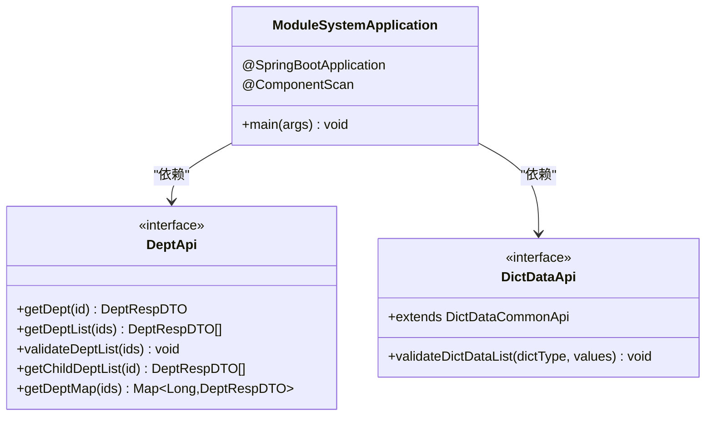

**图表来源**
- [ModuleSystemApplication.java:1-15](file://backend/qiji-module-system/src/main/java/com/qiji/cps/ModuleSystemApplication.java#L1-L15)
- [DeptApi.java:15-61](file://backend/qiji-module-system/src/main/java/com/qiji/cps/module/system/api/dept/DeptApi.java#L15-L61)
- [DictDataApi.java:12-24](file://backend/qiji-module-system/src/main/java/com/qiji/cps/module/system/api/dict/DictDataApi.java#L12-L24)

### 前端管理界面架构

前端采用UniApp框架构建，支持多端部署：

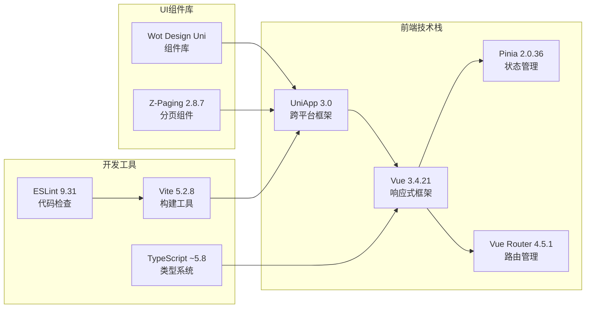

**图表来源**
- [package.json:99-127](file://frontend/admin-uniapp/package.json#L99-L127)
- [package.json:128-177](file://frontend/admin-uniapp/package.json#L128-L177)

**章节来源**
- [ModuleSystemApplication.java:1-15](file://backend/qiji-module-system/src/main/java/com/qiji/cps/ModuleSystemApplication.java#L1-L15)
- [DeptApi.java:1-62](file://backend/qiji-module-system/src/main/java/com/qiji/cps/module/system/api/dept/DeptApi.java#L1-L62)
- [DictDataApi.java:1-25](file://backend/qiji-module-system/src/main/java/com/qiji/cps/module/system/api/dict/DictDataApi.java#L1-L25)
- [package.json:1-194](file://frontend/admin-uniapp/package.json#L1-L194)

## 系统架构概览

### 整体架构设计

AgenticCPS采用了分层架构设计，确保了系统的可维护性和可扩展性：

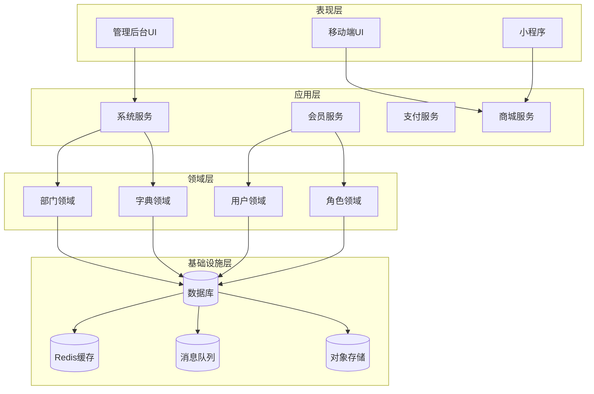

**图表来源**
- [pom.xml:10-25](file://backend/pom.xml#L10-L25)

### 数据流处理流程

系统中的核心数据处理流程体现了良好的解耦设计：

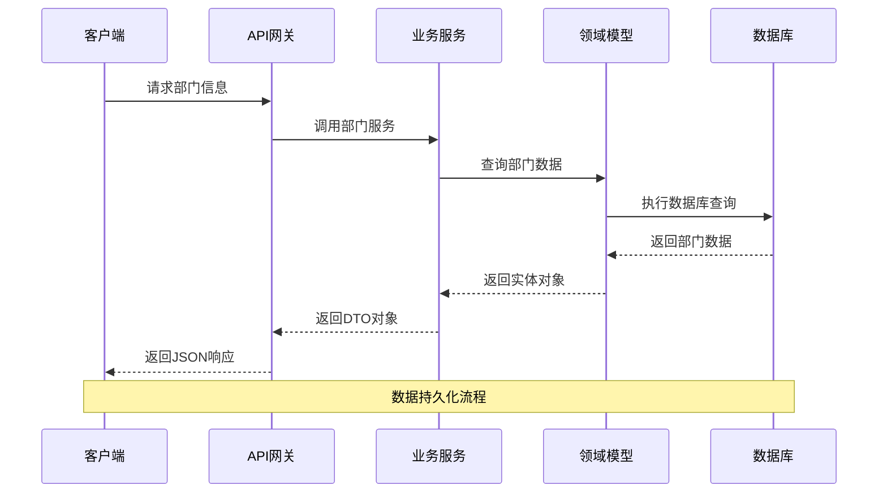

**图表来源**
- [DeptApi.java:17-23](file://backend/qiji-module-system/src/main/java/com/qiji/cps/module/system/api/dept/DeptApi.java#L17-L23)

## 详细组件分析

### 部门管理模块

部门管理模块提供了完整的组织架构管理功能，支持层级化的部门结构和灵活的权限控制。

#### 部门API接口设计

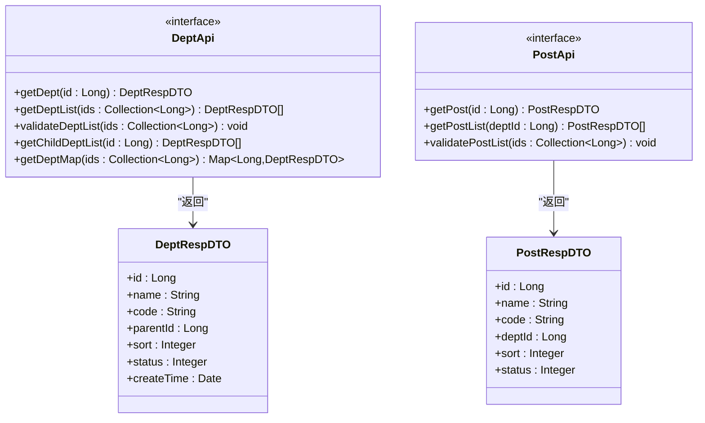

**图表来源**
- [DeptApi.java:15-61](file://backend/qiji-module-system/src/main/java/com/qiji/cps/module/system/api/dept/DeptApi.java#L15-L61)

#### 部门验证流程

部门验证是系统安全的重要环节，确保了数据的完整性和有效性：

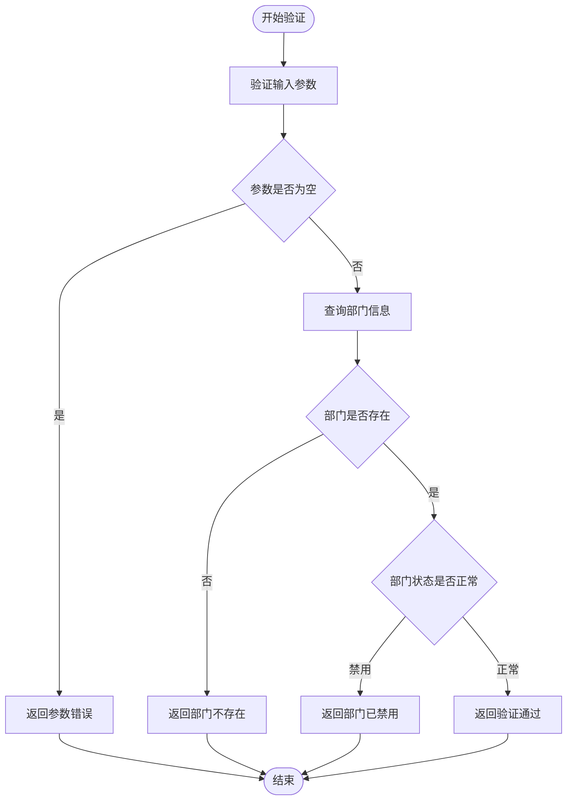

**图表来源**
- [DeptApi.java:33-40](file://backend/qiji-module-system/src/main/java/com/qiji/cps/module/system/api/dept/DeptApi.java#L33-L40)

**章节来源**
- [DeptApi.java:15-61](file://backend/qiji-module-system/src/main/java/com/qiji/cps/module/system/api/dept/DeptApi.java#L15-L61)

### 字典数据管理模块

字典数据管理模块提供了统一的数据字典管理功能，支持多种数据类型的标准化管理。

#### 字典数据接口设计

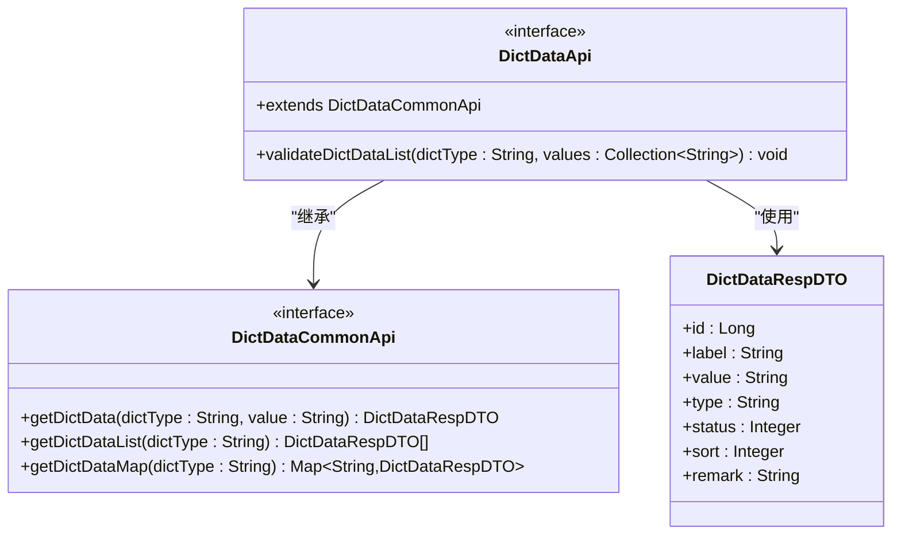

**图表来源**
- [DictDataApi.java:12-24](file://backend/qiji-module-system/src/main/java/com/qiji/cps/module/system/api/dict/DictDataApi.java#L12-L24)

**章节来源**
- [DictDataApi.java:12-24](file://backend/qiji-module-system/src/main/java/com/qiji/cps/module/system/api/dict/DictDataApi.java#L12-L24)

### 日志管理模块

系统提供了完善的日志记录功能，包括登录日志和操作日志管理。

#### 日志管理架构

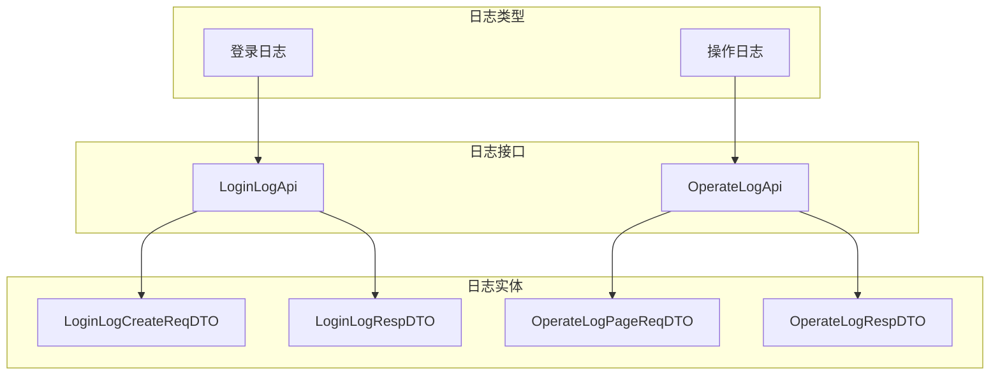

**图表来源**
- [DeptApi.java:15-61](file://backend/qiji-module-system/src/main/java/com/qiji/cps/module/system/api/dept/DeptApi.java#L15-L61)

## 依赖关系分析

### 后端依赖管理

项目采用Maven进行依赖管理，统一版本控制和依赖传递：

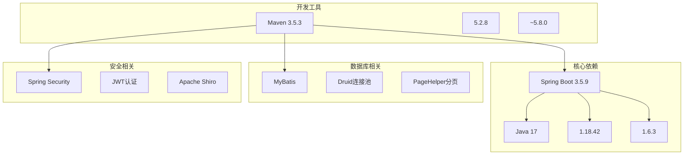

**图表来源**
- [pom.xml:31-45](file://backend/pom.xml#L31-L45)

### 前端依赖分析

前端项目采用现代化的开发工具链，确保开发效率和用户体验：

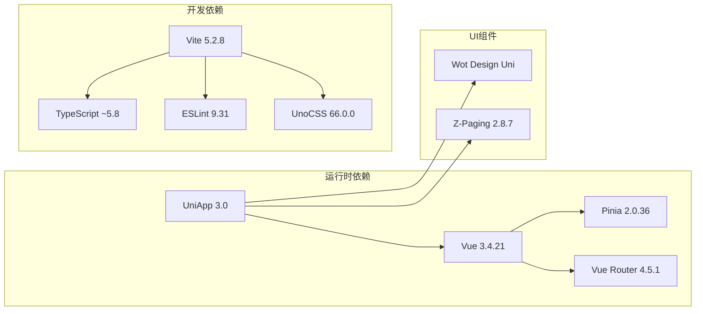

**图表来源**
- [package.json:99-127](file://frontend/admin-uniapp/package.json#L99-L127)
- [package.json:128-177](file://frontend/admin-uniapp/package.json#L128-L177)

**章节来源**
- [pom.xml:31-45](file://backend/pom.xml#L31-L45)
- [package.json:99-177](file://frontend/admin-uniapp/package.json#L99-L177)

## 性能考虑

### 系统性能优化策略

1. **数据库优化**
   - 使用连接池管理数据库连接
   - 实现分页查询避免大数据量加载
   - 建立合适的索引提高查询性能

2. **缓存策略**
   - Redis缓存热点数据
   - 分布式缓存一致性保证
   - 缓存失效策略设计

3. **异步处理**
   - 消息队列异步处理耗时任务
   - 异步邮件发送
   - 异步文件上传处理

4. **前端性能**
   - 组件懒加载
   - 图片资源优化
   - CDN加速静态资源

### 架构扩展性

系统设计充分考虑了未来的扩展需求：

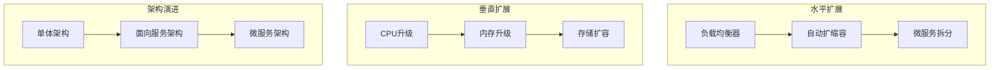

## 故障排除指南

### 常见问题诊断

1. **启动失败排查**
   - 检查JDK版本是否为17+
   - 验证数据库连接配置
   - 确认端口占用情况

2. **接口调用异常**
   - 检查请求参数格式
   - 验证用户权限认证
   - 查看服务日志输出

3. **前端页面加载问题**
   - 清理浏览器缓存
   - 检查网络连接状态
   - 验证API接口可用性

### 日志分析方法

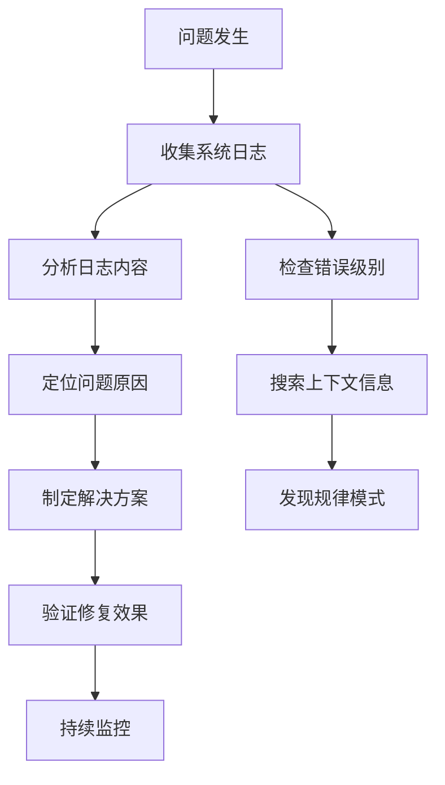

## 结论

AgenticCPS平台管理功能经过精心设计和实现，具备以下特点：

1. **架构先进性**：采用模块化、分层架构设计，具备良好的可维护性和扩展性
2. **功能完整性**：涵盖系统管理、用户管理、权限控制等核心功能
3. **技术先进性**：使用最新的Spring Boot 3.5.9和Vue.js技术栈
4. **开发效率**：提供完善的开发工具链和组件库支持
5. **性能优化**：从架构层面考虑性能优化和扩展性

该平台为后续的功能增强和业务扩展奠定了坚实的基础，能够满足企业级应用的各种需求。通过持续的优化和完善，AgenticCPS将成为一个功能完善、性能优异的企业级管理平台。