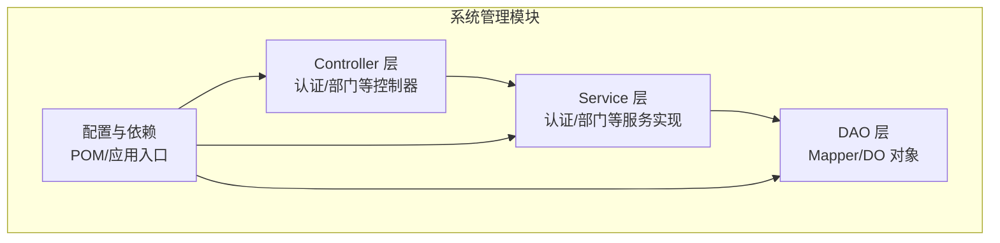
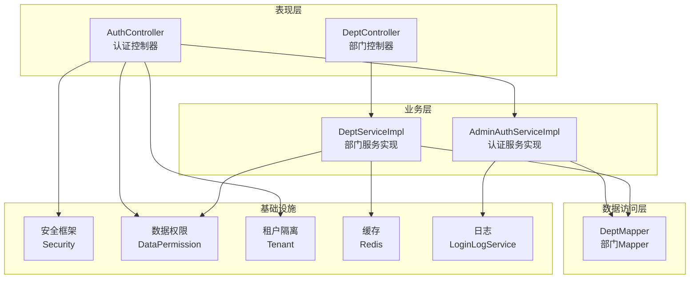
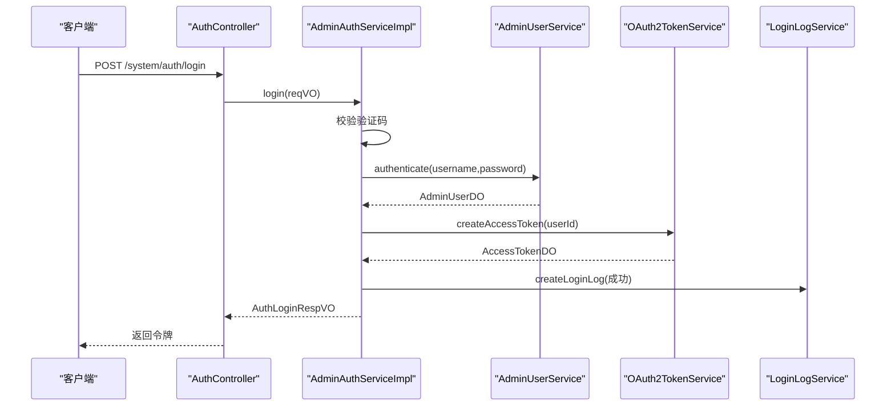
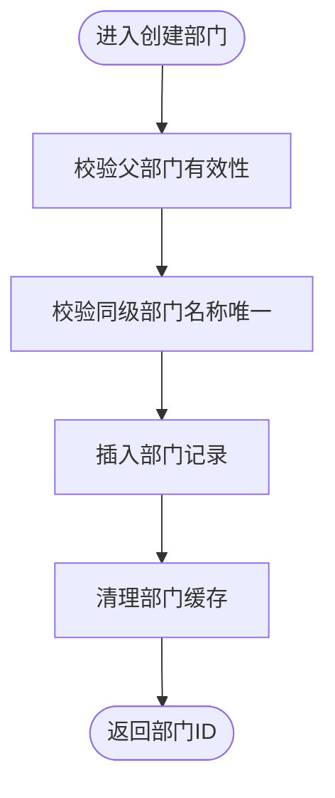
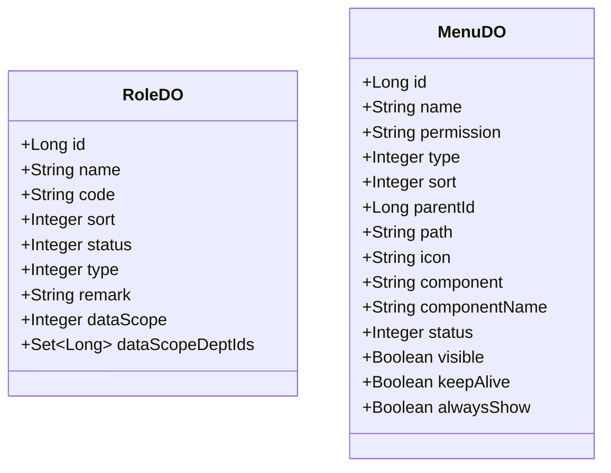
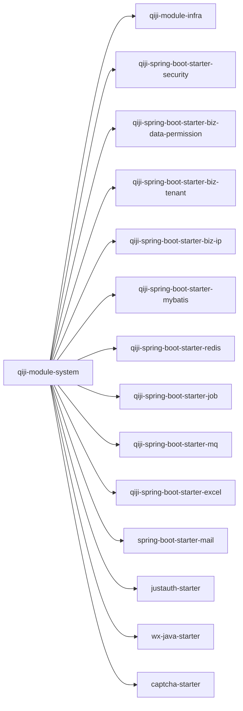

# 系统管理模块

<cite>
**本文引用的文件**
- [ModuleSystemApplication.java](file://backend/qiji-module-system/src/main/java/com/qiji/cps/ModuleSystemApplication.java)
- [pom.xml](file://backend/qiji-module-system/pom.xml)
- [AuthController.java](file://backend/qiji-module-system/src/main/java/com/qiji/cps/module/system/controller/admin/auth/AuthController.java)
- [AdminAuthServiceImpl.java](file://backend/qiji-module-system/src/main/java/com/qiji/cps/module/system/service/auth/AdminAuthServiceImpl.java)
- [DeptController.java](file://backend/qiji-module-system/src/main/java/com/qiji/cps/module/system/controller/admin/dept/DeptController.java)
- [DeptServiceImpl.java](file://backend/qiji-module-system/src/main/java/com/qiji/cps/module/system/service/dept/DeptServiceImpl.java)
- [RoleDO.java](file://backend/qiji-module-system/src/main/java/com/qiji/cps/module/system/dal/dataobject/permission/RoleDO.java)
- [MenuDO.java](file://backend/qiji-module-system/src/main/java/com/qiji/cps/module/system/dal/dataobject/permission/MenuDO.java)
</cite>

## 目录
1. [简介](#简介)
2. [项目结构](#项目结构)
3. [核心组件](#核心组件)
4. [架构总览](#架构总览)
5. [详细组件分析](#详细组件分析)
6. [依赖分析](#依赖分析)
7. [性能考量](#性能考量)
8. [故障排查指南](#故障排查指南)
9. [结论](#结论)
10. [附录](#附录)

## 简介
本文件面向 AgenticCPS 系统的“系统管理模块”，系统性梳理其在用户管理、部门管理、权限控制、数据字典、角色管理等核心领域的职责与实现，并深入解析其分层架构（Controller 层、Service 层、DAO 层）、权限控制机制、数据权限管理、租户隔离、认证授权流程、菜单权限控制、操作日志记录等关键特性。同时提供 API 接口清单、配置要点与最佳实践建议，帮助开发者快速理解并高效扩展。

## 项目结构
系统管理模块位于后端工程的独立模块中，采用标准的分层架构组织，结合基础设施与业务能力，提供统一的系统管理能力。

- 应用入口与模块描述
  - 模块应用入口类负责启动模块，扫描基础包路径，启用 Spring Boot 自动装配。
  - 模块 POM 中声明了系统管理所需的基础依赖，包括安全、数据权限、租户、MyBatis、Redis、定时任务、消息队列、Excel、邮件、社交登录等能力。

- 分层结构概览
  - Controller 层：对外暴露 REST API，处理请求参数校验、鉴权与权限检查，调用 Service 层完成业务逻辑。
  - Service 层：封装业务规则与流程编排，协调 DAO、缓存、日志、第三方服务等。
  - DAO 层：基于 MyBatis-Plus 的 Mapper 与 DO 对象，负责数据持久化与查询。
  - DO/枚举：定义数据模型与枚举常量，确保领域语义清晰。

**章节来源**
- [ModuleSystemApplication.java:1-15](file://backend/qiji-module-system/src/main/java/com/qiji/cps/ModuleSystemApplication.java#L1-L15)
- [pom.xml:1-125](file://backend/qiji-module-system/pom.xml#L1-L125)

## 核心组件
系统管理模块围绕以下核心能力展开：

- 用户与认证
  - 支持账号密码登录、短信验证码登录、刷新令牌、登出、注册、重置密码、社交登录（含授权跳转与快捷登录）。
  - 集成验证码校验、登录日志记录、OAuth2 访问令牌生成与管理。
- 部门管理
  - 提供部门的创建、更新、删除、批量删除、列表查询、树形结构查询、领导关联查询、缓存与数据权限支持。
- 权限与角色
  - 角色数据对象包含角色类型、状态、数据范围、自定义部门集合等字段，支撑精细化数据权限控制。
  - 菜单数据对象包含权限标识、类型、路由、组件、可见性、缓存策略等，支撑前后端权限联动。
- 日志与审计
  - 登录日志与操作日志记录，便于审计与问题定位。

**章节来源**
- [AuthController.java:1-177](file://backend/qiji-module-system/src/main/java/com/qiji/cps/module/system/controller/admin/auth/AuthController.java#L1-L177)
- [AdminAuthServiceImpl.java:1-307](file://backend/qiji-module-system/src/main/java/com/qiji/cps/module/system/service/auth/AdminAuthServiceImpl.java#L1-L307)
- [DeptController.java:1-94](file://backend/qiji-module-system/src/main/java/com/qiji/cps/module/system/controller/admin/dept/DeptController.java#L1-L94)
- [DeptServiceImpl.java:1-239](file://backend/qiji-module-system/src/main/java/com/qiji/cps/module/system/service/dept/DeptServiceImpl.java#L1-L239)
- [RoleDO.java:1-79](file://backend/qiji-module-system/src/main/java/com/qiji/cps/module/system/dal/dataobject/permission/RoleDO.java#L1-L79)
- [MenuDO.java:1-110](file://backend/qiji-module-system/src/main/java/com/qiji/cps/module/system/dal/dataobject/permission/MenuDO.java#L1-L110)

## 架构总览
系统管理模块遵循经典的三层架构，结合安全、数据权限、租户、缓存与日志等横切能力，形成高内聚、低耦合的模块化体系。

**图表来源**
- [AuthController.java:1-177](file://backend/qiji-module-system/src/main/java/com/qiji/cps/module/system/controller/admin/auth/AuthController.java#L1-L177)
- [AdminAuthServiceImpl.java:1-307](file://backend/qiji-module-system/src/main/java/com/qiji/cps/module/system/service/auth/AdminAuthServiceImpl.java#L1-L307)
- [DeptController.java:1-94](file://backend/qiji-module-system/src/main/java/com/qiji/cps/module/system/controller/admin/dept/DeptController.java#L1-L94)
- [DeptServiceImpl.java:1-239](file://backend/qiji-module-system/src/main/java/com/qiji/cps/module/system/service/dept/DeptServiceImpl.java#L1-L239)

## 详细组件分析

### 认证与授权组件
- 控制器职责
  - 提供登录、登出、刷新令牌、获取权限信息、注册、短信登录、发送验证码、重置密码、社交授权跳转、社交快捷登录等接口。
  - 使用注解进行权限控制与参数校验，统一返回包装结构。
- 服务实现职责
  - 账号密码认证：校验用户存在性、密码匹配、状态有效性；支持社交绑定与登录日志记录。
  - 短信登录：校验短信验证码，根据手机号查找用户并发放令牌。
  - 刷新令牌：基于 OAuth2 令牌刷新能力。
  - 登出：移除访问令牌并记录登出日志。
  - 注册与重置密码：集成验证码校验与短信验证码使用。
  - 登录日志：记录登录/登出轨迹，包含用户代理、IP、结果等。
- 关键流程图（登录）

**图表来源**
- [AuthController.java:66-118](file://backend/qiji-module-system/src/main/java/com/qiji/cps/module/system/controller/admin/auth/AuthController.java#L66-L118)
- [AdminAuthServiceImpl.java:102-220](file://backend/qiji-module-system/src/main/java/com/qiji/cps/module/system/service/auth/AdminAuthServiceImpl.java#L102-L220)

**章节来源**
- [AuthController.java:1-177](file://backend/qiji-module-system/src/main/java/com/qiji/cps/module/system/controller/admin/auth/AuthController.java#L1-L177)
- [AdminAuthServiceImpl.java:1-307](file://backend/qiji-module-system/src/main/java/com/qiji/cps/module/system/service/auth/AdminAuthServiceImpl.java#L1-L307)

### 部门管理组件
- 控制器职责
  - 提供创建、更新、删除、批量删除、列表查询、精简列表、详情查询等接口，并通过权限注解保护。
- 服务实现职责
  - 校验父部门有效性、部门名称唯一性、禁止自环设置；支持批量删除前的子部门检查；提供树形递归查询与缓存支持。
  - 使用缓存键常量清理与读取，避免脏数据；提供数据权限开关以保证缓存一致性。
- 关键流程图（创建部门）

**图表来源**
- [DeptController.java:34-40](file://backend/qiji-module-system/src/main/java/com/qiji/cps/module/system/controller/admin/dept/DeptController.java#L34-L40)
- [DeptServiceImpl.java:40-56](file://backend/qiji-module-system/src/main/java/com/qiji/cps/module/system/service/dept/DeptServiceImpl.java#L40-L56)

**章节来源**
- [DeptController.java:1-94](file://backend/qiji-module-system/src/main/java/com/qiji/cps/module/system/controller/admin/dept/DeptController.java#L1-L94)
- [DeptServiceImpl.java:1-239](file://backend/qiji-module-system/src/main/java/com/qiji/cps/module/system/service/dept/DeptServiceImpl.java#L1-L239)

### 权限与角色数据模型
- 角色数据对象
  - 字段覆盖角色基本信息、状态、类型、排序、备注、数据范围与自定义部门集合，支持租户继承基类。
- 菜单数据对象
  - 字段覆盖菜单/目录/按钮类型、权限标识、路由、组件、可见性、缓存策略、状态等，支持租户忽略注解。

**图表来源**
- [RoleDO.java:1-79](file://backend/qiji-module-system/src/main/java/com/qiji/cps/module/system/dal/dataobject/permission/RoleDO.java#L1-L79)
- [MenuDO.java:1-110](file://backend/qiji-module-system/src/main/java/com/qiji/cps/module/system/dal/dataobject/permission/MenuDO.java#L1-L110)

**章节来源**
- [RoleDO.java:1-79](file://backend/qiji-module-system/src/main/java/com/qiji/cps/module/system/dal/dataobject/permission/RoleDO.java#L1-L79)
- [MenuDO.java:1-110](file://backend/qiji-module-system/src/main/java/com/qiji/cps/module/system/dal/dataobject/permission/MenuDO.java#L1-L110)

## 依赖分析
系统管理模块通过 POM 聚合多种基础设施与业务能力，形成统一的系统管理底座。

- 核心依赖类别
  - 基础设施：安全、数据权限、租户、IP、MyBatis、Redis、定时任务、消息队列、Excel、邮件、社交登录、验证码等。
  - 业务能力：认证、部门、权限、日志、邮件等。
- 依赖关系示意

**图表来源**
- [pom.xml:20-121](file://backend/qiji-module-system/pom.xml#L20-L121)

**章节来源**
- [pom.xml:1-125](file://backend/qiji-module-system/pom.xml#L1-L125)

## 性能考量
- 缓存策略
  - 部门子节点缓存：通过缓存键常量维护树形结构查询结果，减少重复计算与数据库压力。
  - 缓存失效：在部门创建/更新/删除时清空相关缓存，确保一致性。
- 数据权限与租户隔离
  - 在敏感查询或缓存场景中显式关闭数据权限，避免缓存污染；租户注解用于跨租户隔离。
- 并发与事务
  - 登录/注册/重置密码等关键流程使用事务保障一致性；验证码与短信验证码使用校验器与服务保障正确性。
- 日志与监控
  - 登录日志记录包含 TraceId、用户代理、IP、结果等，便于问题定位与审计。

**章节来源**
- [DeptServiceImpl.java:40-104](file://backend/qiji-module-system/src/main/java/com/qiji/cps/module/system/service/dept/DeptServiceImpl.java#L40-L104)
- [AdminAuthServiceImpl.java:102-220](file://backend/qiji-module-system/src/main/java/com/qiji/cps/module/system/service/auth/AdminAuthServiceImpl.java#L102-L220)

## 故障排查指南
- 常见错误与定位
  - 登录失败：检查账号是否存在、密码是否匹配、账户是否启用；查看登录日志中的结果与异常。
  - 验证码错误：确认验证码开关配置、校验参数是否正确。
  - 短信验证码错误：确认短信场景、验证码是否已使用、是否在有效期内。
  - 部门删除失败：检查是否存在子部门，避免删除非叶子节点。
  - 权限不足：确认用户角色与菜单权限标识是否正确配置。
- 建议排查步骤
  - 查看登录日志与操作日志，定位失败原因。
  - 核对数据权限与租户配置，避免缓存或隔离导致的异常。
  - 检查验证码与短信服务可用性，确认网络与第三方配置。

**章节来源**
- [AdminAuthServiceImpl.java:152-169](file://backend/qiji-module-system/src/main/java/com/qiji/cps/module/system/service/auth/AdminAuthServiceImpl.java#L152-L169)
- [DeptServiceImpl.java:80-104](file://backend/qiji-module-system/src/main/java/com/qiji/cps/module/system/service/dept/DeptServiceImpl.java#L80-L104)

## 结论
系统管理模块通过清晰的分层设计与完善的基础设施依赖，提供了从认证授权、部门管理到权限控制与日志审计的一体化能力。其在数据权限、租户隔离、缓存与日志方面的设计，既满足了多租户场景下的隔离需求，也兼顾了性能与可观测性。建议在扩展新功能时遵循现有分层与命名规范，复用数据权限与租户能力，确保一致的安全与性能表现。

## 附录

### API 接口清单（认证）
- POST /system/auth/login：账号密码登录
- POST /system/auth/logout：登出
- GET /system/auth/refresh-token：刷新令牌
- GET /system/auth/get-permission-info：获取权限信息
- POST /system/auth/register：注册
- POST /system/auth/sms-login：短信登录
- POST /system/auth/send-sms-code：发送短信验证码
- POST /system/auth/reset-password：重置密码
- GET /system/auth/social-auth-redirect：社交授权跳转
- POST /system/auth/social-login：社交快捷登录

**章节来源**
- [AuthController.java:66-176](file://backend/qiji-module-system/src/main/java/com/qiji/cps/module/system/controller/admin/auth/AuthController.java#L66-L176)

### API 接口清单（部门）
- POST /system/dept/create：创建部门
- PUT /system/dept/update：更新部门
- DELETE /system/dept/delete：删除部门
- DELETE /system/dept/delete-list：批量删除部门
- GET /system/dept/list：获取部门列表
- GET /system/dept/list-all-simple：获取部门精简列表
- GET /system/dept/get：获得部门信息

**章节来源**
- [DeptController.java:34-91](file://backend/qiji-module-system/src/main/java/com/qiji/cps/module/system/controller/admin/dept/DeptController.java#L34-L91)

### 配置示例与最佳实践
- 验证码开关
  - 通过配置项控制验证码启用/禁用，便于测试与生产环境切换。
- 权限注解
  - 使用 @PreAuthorize 保护接口，权限标识建议采用“模块:功能:动作”的规范。
- 数据权限与租户
  - 在需要缓存或跨租户查询时，合理使用数据权限开关与租户注解，避免缓存污染与越权访问。
- 缓存与失效
  - 对树形结构与频繁查询结果使用缓存；在变更时及时清理相关缓存键。
- 日志与审计
  - 登录/登出与关键操作均应记录日志，包含 TraceId、用户代理、IP、结果等字段，便于审计与问题定位。

**章节来源**
- [AdminAuthServiceImpl.java:76-78](file://backend/qiji-module-system/src/main/java/com/qiji/cps/module/system/service/auth/AdminAuthServiceImpl.java#L76-L78)
- [DeptServiceImpl.java:41-42](file://backend/qiji-module-system/src/main/java/com/qiji/cps/module/system/service/dept/DeptServiceImpl.java#L41-L42)
- [MenuDO.java:40-48](file://backend/qiji-module-system/src/main/java/com/qiji/cps/module/system/dal/dataobject/permission/MenuDO.java#L40-L48)