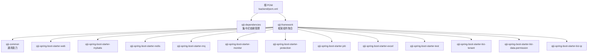
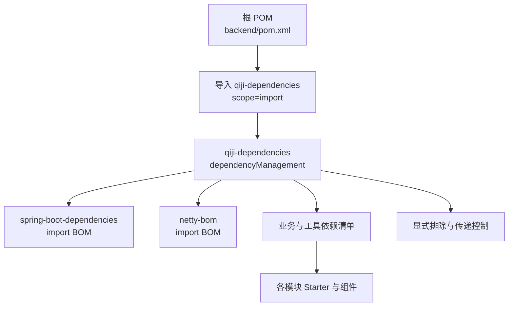
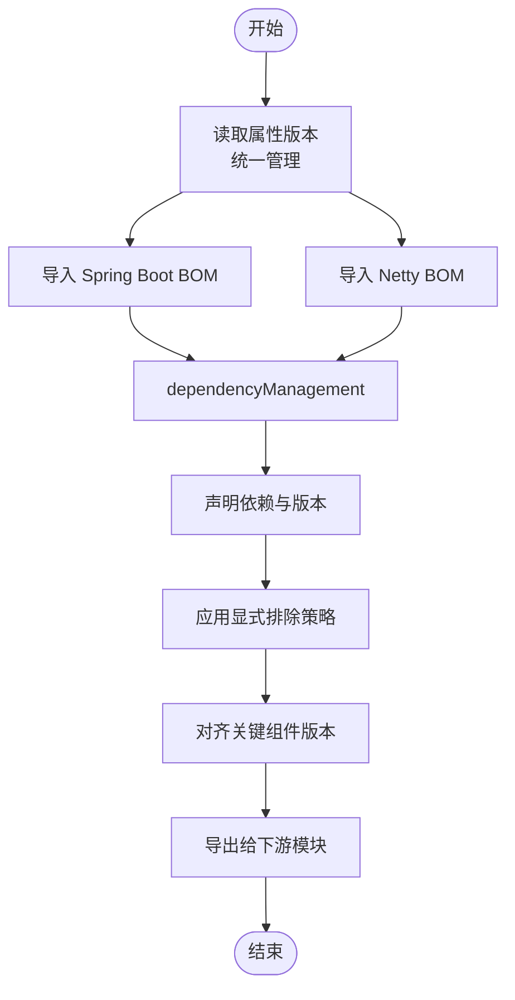
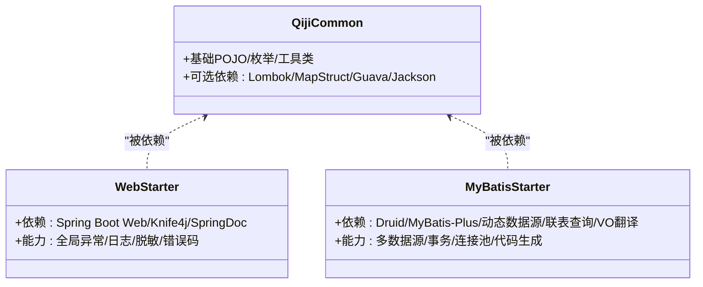
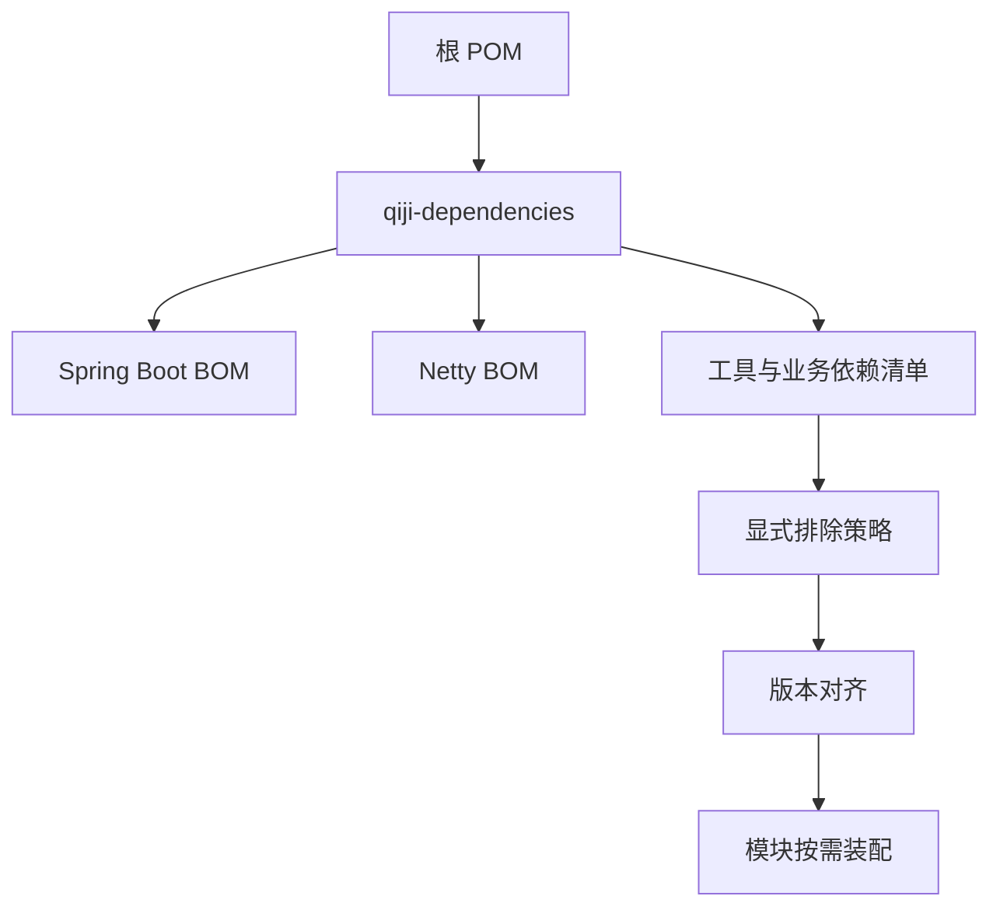

# 依赖管理

<cite>
**本文引用的文件**
- [backend/pom.xml](file://backend/pom.xml)
- [backend/qiji-dependencies/pom.xml](file://backend/qiji-dependencies/pom.xml)
- [backend/qiji-dependencies/.flattened-pom.xml](file://backend/qiji-dependencies/.flattened-pom.xml)
- [backend/qiji-framework/pom.xml](file://backend/qiji-framework/pom.xml)
- [backend/qiji-framework/qiji-common/pom.xml](file://backend/qiji-framework/qiji-common/pom.xml)
- [backend/qiji-framework/qiji-spring-boot-starter-web/pom.xml](file://backend/qiji-framework/qiji-spring-boot-starter-web/pom.xml)
- [backend/qiji-framework/qiji-spring-boot-starter-mybatis/pom.xml](file://backend/qiji-framework/qiji-spring-boot-starter-mybatis/pom.xml)
</cite>

## 目录
1. [简介](#简介)
2. [项目结构](#项目结构)
3. [核心组件](#核心组件)
4. [架构总览](#架构总览)
5. [详细组件分析](#详细组件分析)
6. [依赖分析](#依赖分析)
7. [性能考虑](#性能考虑)
8. [故障排查指南](#故障排查指南)
9. [结论](#结论)
10. [附录](#附录)

## 简介
本文件聚焦 AgenticCPS 项目的依赖管理，系统性阐述 qiji-dependencies 模块的作用与实现方式，包括版本号管理策略、依赖传递控制、模块间依赖关系的统一管理；说明如何通过集中式依赖管理简化构建流程、避免版本冲突；给出依赖注入最佳实践、可选依赖的使用场景、新增依赖项的操作步骤，并提供依赖冲突排查与解决方法。

## 项目结构
AgenticCPS 采用多模块 Maven 结构，根 POM 将 qiji-dependencies 作为 BOM 导入，统一管理所有子模块的依赖版本与传递行为。qiji-framework 子模块进一步拆分为多个 Spring Boot Starter，覆盖 Web、安全、数据库、缓存、消息队列、监控、保护、定时任务、Excel、测试、业务能力等能力层，形成“框架组件 + 业务模块”的分层体系。

图表来源
- [backend/pom.xml:47-57](file://backend/pom.xml#L47-L57)
- [backend/qiji-dependencies/pom.xml:84-687](file://backend/qiji-dependencies/pom.xml#L84-L687)
- [backend/qiji-framework/pom.xml:12-31](file://backend/qiji-framework/pom.xml#L12-L31)

章节来源
- [backend/pom.xml:10-25](file://backend/pom.xml#L10-L25)
- [backend/qiji-framework/pom.xml:12-31](file://backend/qiji-framework/pom.xml#L12-L31)

## 核心组件
- qiji-dependencies：集中式 BOM，统一管理版本号、依赖传递与排除策略，确保各模块依赖一致性。
- qiji-framework：框架组件聚合，提供 Web、安全、数据库、缓存、MQ、监控、保护、定时任务、Excel、测试、业务能力等 Starter，供业务模块按需装配。
- qiji-common：通用能力模块，提供基础 POJO、枚举、工具类、注解与可选依赖，作为各 Starter 的基础依赖。

章节来源
- [backend/qiji-dependencies/pom.xml:16-82](file://backend/qiji-dependencies/pom.xml#L16-L82)
- [backend/qiji-framework/pom.xml:34-43](file://backend/qiji-framework/pom.xml#L34-L43)
- [backend/qiji-framework/qiji-common/pom.xml:18-147](file://backend/qiji-framework/qiji-common/pom.xml#L18-L147)

## 架构总览
集中式依赖管理通过根 POM 导入 qiji-dependencies，使所有模块共享同一套版本与传递规则。qiji-dependencies 内部以 dependencyManagement 管理依赖坐标与版本，同时通过 import 方式引入 Spring Boot BOM 与 Netty BOM，保证核心框架版本的一致性。模块间通过 Starter 形式的可选依赖进行装配，避免不必要的传递。

图表来源
- [backend/pom.xml:47-57](file://backend/pom.xml#L47-L57)
- [backend/qiji-dependencies/pom.xml:84-100](file://backend/qiji-dependencies/pom.xml#L84-L100)
- [backend/qiji-dependencies/pom.xml:84-687](file://backend/qiji-dependencies/pom.xml#L84-L687)

## 详细组件分析

### qiji-dependencies：集中式依赖管理
- 版本号管理
  - 使用属性统一管理版本，如 Spring Boot、MyBatis、MyBatis-Plus、Redisson、Knife4j、SkyWalking、JustAuth、Weixin-Java SDK、OkHttp、Vert.x、MQTT、Californium、AWSSDK 等。
  - 通过 flatten-maven-plugin 在构建时生成扁平化 POM，便于下游模块直接继承版本信息。
- 依赖传递控制
  - 对关键依赖进行显式排除，避免传递冲突，如 knife4j 与 springdoc 的互斥、bizlog-sdk 与 Spring Boot Starter 的排除、easy-trans 与 Spring Cloud 的排除、redisson 与 actuator 的排除、justauth 与 hutool-core 的排除、alipay-sdk-java 与 bcprov-jdk15on 的排除等。
  - 对多数据源、MyBatis 版本进行强制对齐，避免 flowable 与 mybatis-plus 引入的 mybatis 版本不一致。
- 模块间依赖关系统一管理
  - 将 qiji-framework 下的 Starter 与通用组件以固定版本号导入，确保模块间版本一致。
  - 通过 provided 或 optional 控制传递范围，减少无关模块的依赖负担。

图表来源
- [backend/qiji-dependencies/pom.xml:16-82](file://backend/qiji-dependencies/pom.xml#L16-L82)
- [backend/qiji-dependencies/pom.xml:84-100](file://backend/qiji-dependencies/pom.xml#L84-L100)
- [backend/qiji-dependencies/pom.xml:107-112](file://backend/qiji-dependencies/pom.xml#L107-L112)
- [backend/qiji-dependencies/pom.xml:221-232](file://backend/qiji-dependencies/pom.xml#L221-L232)
- [backend/qiji-dependencies/pom.xml:254-260](file://backend/qiji-dependencies/pom.xml#L254-L260)
- [backend/qiji-dependencies/pom.xml:628-635](file://backend/qiji-dependencies/pom.xml#L628-L635)
- [backend/qiji-dependencies/pom.xml:641-647](file://backend/qiji-dependencies/pom.xml#L641-L647)

章节来源
- [backend/qiji-dependencies/pom.xml:16-82](file://backend/qiji-dependencies/pom.xml#L16-L82)
- [backend/qiji-dependencies/pom.xml:84-687](file://backend/qiji-dependencies/pom.xml#L84-L687)
- [backend/qiji-dependencies/.flattened-pom.xml:68-686](file://backend/qiji-dependencies/.flattened-pom.xml#L68-L686)

### qiji-framework：框架组件聚合与 Starter 设计
- 组件划分
  - 框架组件：Web、Security、Redis、MyBatis、MQ、Monitor、Protection、Job、Excel、Test 等。
  - 业务组件：Biz-Tenant、Biz-DataPermission、Biz-IP 等。
- Starter 设计原则
  - 以 qiji-common 为基础，按功能拆分，仅暴露必要依赖，其余通过 optional 或 provided 控制传递。
  - 通过 qiji-dependencies 统一版本，避免模块间重复声明版本。
- 示例：Web Starter
  - 依赖 qiji-common 与 Spring Boot Web、Knife4j、SpringDoc、Guava、Jsoup 等。
  - 提供全局异常处理、API 日志、脱敏、错误码等能力。
- 示例：MyBatis Starter
  - 依赖 qiji-common 与 Druid、MyBatis-Plus、动态数据源、联表查询扩展、VO 翻译等。
  - 提供多数据源、事务、连接池、代码生成等能力。

图表来源
- [backend/qiji-framework/qiji-common/pom.xml:18-147](file://backend/qiji-framework/qiji-common/pom.xml#L18-L147)
- [backend/qiji-framework/qiji-spring-boot-starter-web/pom.xml:18-79](file://backend/qiji-framework/qiji-spring-boot-starter-web/pom.xml#L18-L79)
- [backend/qiji-framework/qiji-spring-boot-starter-mybatis/pom.xml:18-108](file://backend/qiji-framework/qiji-spring-boot-starter-mybatis/pom.xml#L18-L108)

章节来源
- [backend/qiji-framework/pom.xml:12-31](file://backend/qiji-framework/pom.xml#L12-L31)
- [backend/qiji-framework/qiji-common/pom.xml:18-147](file://backend/qiji-framework/qiji-common/pom.xml#L18-L147)
- [backend/qiji-framework/qiji-spring-boot-starter-web/pom.xml:18-79](file://backend/qiji-framework/qiji-spring-boot-starter-web/pom.xml#L18-L79)
- [backend/qiji-framework/qiji-spring-boot-starter-mybatis/pom.xml:18-108](file://backend/qiji-framework/qiji-spring-boot-starter-mybatis/pom.xml#L18-L108)

### 依赖注入最佳实践
- 使用 Starter 装配能力
  - 业务模块仅引入所需的 qiji-* Starter，避免手动声明底层依赖。
- 明确传递范围
  - 对非必要依赖使用 optional 或 provided，降低传递风险与打包体积。
- 统一版本来源
  - 所有依赖版本由 qiji-dependencies 提供，模块内不重复声明版本。
- 显式排除冲突依赖
  - 当第三方库存在版本冲突或不兼容时，通过 exclusions 显式排除，再由 qiji-dependencies 提供正确版本。

章节来源
- [backend/qiji-dependencies/pom.xml:107-112](file://backend/qiji-dependencies/pom.xml#L107-L112)
- [backend/qiji-dependencies/pom.xml:160-167](file://backend/qiji-dependencies/pom.xml#L160-L167)
- [backend/qiji-dependencies/pom.xml:221-232](file://backend/qiji-dependencies/pom.xml#L221-L232)
- [backend/qiji-dependencies/pom.xml:254-260](file://backend/qiji-dependencies/pom.xml#L254-L260)
- [backend/qiji-dependencies/pom.xml:628-635](file://backend/qiji-dependencies/pom.xml#L628-L635)
- [backend/qiji-dependencies/pom.xml:641-647](file://backend/qiji-dependencies/pom.xml#L641-L647)

### 可选依赖的使用场景
- provided 场景
  - 某些工具类或接口仅在特定环境下使用，如 Spring Expression、AspectJ、Servlet API、Validation API、Jackson 系列、SLF4J 等，通过 provided 减少对业务模块的影响。
- optional 圾场景
  - 数据库驱动（MySQL、Oracle、PostgreSQL、SQLServer、达梦、人大金仓、华为 GaussDB、TAOS）与第三方云服务 SDK（AWS S3、JustAuth、Alipay、Weixin-Java）等，按需启用，避免无用依赖进入最终产物。
- 测试依赖
  - 单元测试与 Mock 工具（Mockito Inline、Jedis-Mock、Podam）仅在测试阶段生效，避免污染生产环境。

章节来源
- [backend/qiji-framework/qiji-common/pom.xml:20-39](file://backend/qiji-framework/qiji-common/pom.xml#L20-L39)
- [backend/qiji-framework/qiji-common/pom.xml:50-59](file://backend/qiji-framework/qiji-common/pom.xml#L50-L59)
- [backend/qiji-framework/qiji-common/pom.xml:93-112](file://backend/qiji-framework/qiji-common/pom.xml#L93-L112)
- [backend/qiji-framework/qiji-spring-boot-starter-mybatis/pom.xml:33-70](file://backend/qiji-framework/qiji-spring-boot-starter-mybatis/pom.xml#L33-L70)
- [backend/qiji-dependencies/pom.xml:612-647](file://backend/qiji-dependencies/pom.xml#L612-L647)

### 如何添加新的依赖项
- 在 qiji-dependencies 中声明版本与坐标
  - 在 properties 中新增版本属性，在 dependencyManagement 中新增依赖条目。
- 必要时添加显式排除
  - 若与现有依赖存在冲突，先添加 exclusions，再由 qiji-dependencies 提供统一版本。
- 在具体模块中按需引入
  - 业务模块仅引入所需的 qiji-* Starter 或组件，避免重复声明版本。
- 验证传递范围
  - 使用 Maven 命令检查依赖树，确认传递范围符合预期（provided/optional）。

章节来源
- [backend/qiji-dependencies/pom.xml:16-82](file://backend/qiji-dependencies/pom.xml#L16-L82)
- [backend/qiji-dependencies/pom.xml:84-687](file://backend/qiji-dependencies/pom.xml#L84-L687)
- [backend/qiji-framework/pom.xml:12-31](file://backend/qiji-framework/pom.xml#L12-L31)

## 依赖分析
- 根 POM 导入 qiji-dependencies，统一版本来源，简化模块配置。
- qiji-dependencies 通过 import 方式引入 Spring Boot 与 Netty BOM，确保核心框架版本一致。
- 对关键依赖进行显式排除，避免传递冲突，如 knife4j 与 springdoc、easy-trans 与 Spring Cloud、redisson 与 actuator、justauth 与 hutool-core、alipay-sdk-java 与 bcprov-jdk15on 等。
- Starter 通过 optional/ provided 控制传递范围，减少模块间耦合。

图表来源
- [backend/pom.xml:47-57](file://backend/pom.xml#L47-L57)
- [backend/qiji-dependencies/pom.xml:84-100](file://backend/qiji-dependencies/pom.xml#L84-L100)
- [backend/qiji-dependencies/pom.xml:160-167](file://backend/qiji-dependencies/pom.xml#L160-L167)
- [backend/qiji-dependencies/pom.xml:221-232](file://backend/qiji-dependencies/pom.xml#L221-L232)
- [backend/qiji-dependencies/pom.xml:254-260](file://backend/qiji-dependencies/pom.xml#L254-L260)
- [backend/qiji-dependencies/pom.xml:628-635](file://backend/qiji-dependencies/pom.xml#L628-L635)
- [backend/qiji-dependencies/pom.xml:641-647](file://backend/qiji-dependencies/pom.xml#L641-L647)

章节来源
- [backend/pom.xml:47-57](file://backend/pom.xml#L47-L57)
- [backend/qiji-dependencies/pom.xml:84-687](file://backend/qiji-dependencies/pom.xml#L84-L687)

## 性能考虑
- 通过 provided/optional 减少传递依赖，降低打包体积与启动时间。
- 使用 flatten-maven-plugin 生成扁平化 POM，提升构建稳定性与可维护性。
- 对多数据源与 MyBatis 版本进行对齐，避免运行期因版本不一致导致的性能回退或异常。

## 故障排查指南
- 版本冲突
  - 现象：编译或运行时报错，提示某依赖版本不兼容。
  - 排查：使用 Maven 命令查看依赖树，定位冲突来源；在 qiji-dependencies 中添加显式排除，统一版本。
- 传递依赖过多
  - 现象：模块打包体积过大，启动缓慢。
  - 排查：检查是否误用 provided/optional；将非必要依赖标记为 optional 或移除；确认 Starter 是否按需装配。
- 第三方 SDK 冲突
  - 现象：引入 JustAuth、Alipay、Weixin-Java 等 SDK 时出现冲突。
  - 排查：在 qiji-dependencies 中添加对应 exclusions，并统一版本；确保下游模块不再重复引入冲突版本。
- Spring Boot 与 Netty 版本不匹配
  - 现象：运行期出现 Netty 相关异常。
  - 排查：确认 qiji-dependencies 已通过 import 方式引入 netty-bom，且版本与 Spring Boot 兼容。

章节来源
- [backend/qiji-dependencies/pom.xml:107-112](file://backend/qiji-dependencies/pom.xml#L107-L112)
- [backend/qiji-dependencies/pom.xml:160-167](file://backend/qiji-dependencies/pom.xml#L160-L167)
- [backend/qiji-dependencies/pom.xml:221-232](file://backend/qiji-dependencies/pom.xml#L221-L232)
- [backend/qiji-dependencies/pom.xml:254-260](file://backend/qiji-dependencies/pom.xml#L254-L260)
- [backend/qiji-dependencies/pom.xml:628-635](file://backend/qiji-dependencies/pom.xml#L628-L635)
- [backend/qiji-dependencies/pom.xml:641-647](file://backend/qiji-dependencies/pom.xml#L641-L647)
- [backend/qiji-dependencies/pom.xml:84-100](file://backend/qiji-dependencies/pom.xml#L84-L100)

## 结论
qiji-dependencies 通过集中式 BOM 管理版本与传递，结合 qiji-framework 的 Starter 设计，实现了模块间依赖关系的统一管理与构建流程的简化。遵循 provided/optional 与显式排除策略，可有效避免版本冲突，提升可维护性与构建效率。新增依赖应遵循“先在 BOM 中声明，再在模块中按需装配”的流程，确保一致性与可控性。

## 附录
- 关键文件路径
  - 根 POM：[backend/pom.xml](file://backend/pom.xml)
  - 集中式依赖：[backend/qiji-dependencies/pom.xml](file://backend/qiji-dependencies/pom.xml)
  - 扁平化依赖：[backend/qiji-dependencies/.flattened-pom.xml](file://backend/qiji-dependencies/.flattened-pom.xml)
  - 框架聚合：[backend/qiji-framework/pom.xml](file://backend/qiji-framework/pom.xml)
  - 通用模块：[backend/qiji-framework/qiji-common/pom.xml](file://backend/qiji-framework/qiji-common/pom.xml)
  - Web Starter：[backend/qiji-framework/qiji-spring-boot-starter-web/pom.xml](file://backend/qiji-framework/qiji-spring-boot-starter-web/pom.xml)
  - MyBatis Starter：[backend/qiji-framework/qiji-spring-boot-starter-mybatis/pom.xml](file://backend/qiji-framework/qiji-spring-boot-starter-mybatis/pom.xml)