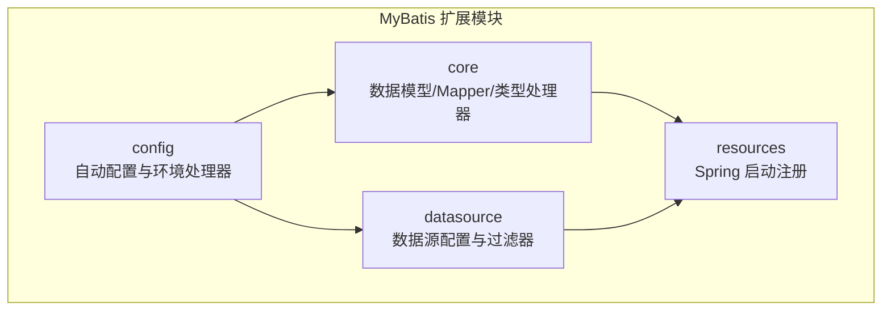
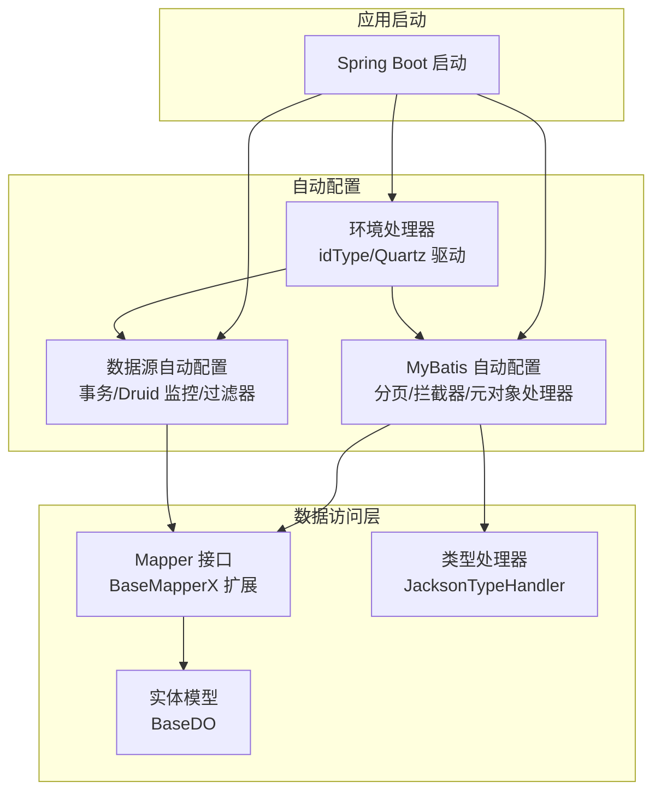
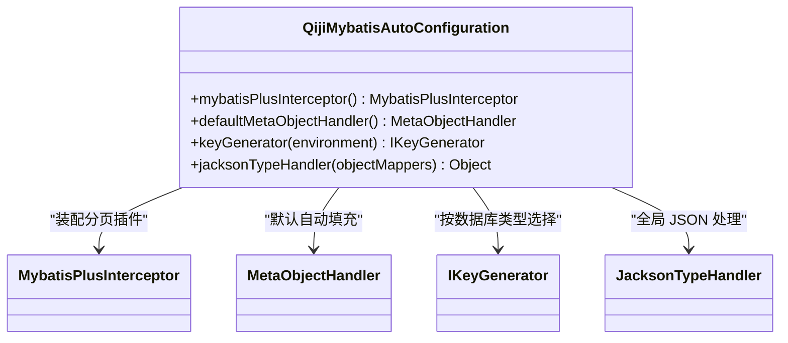
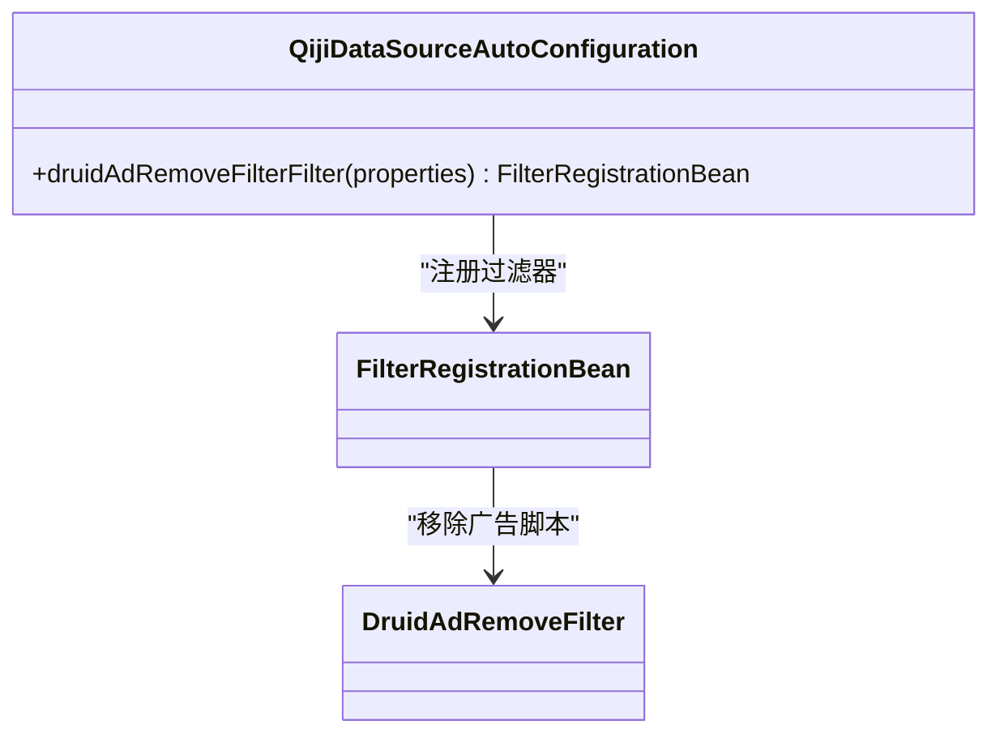
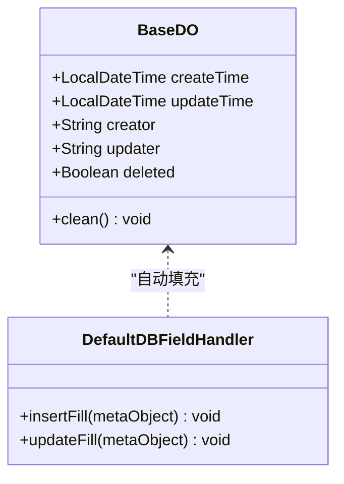
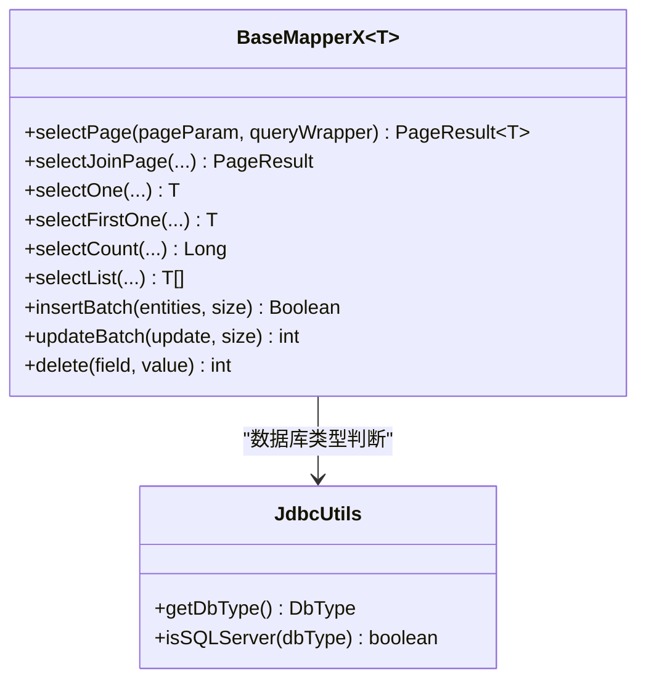
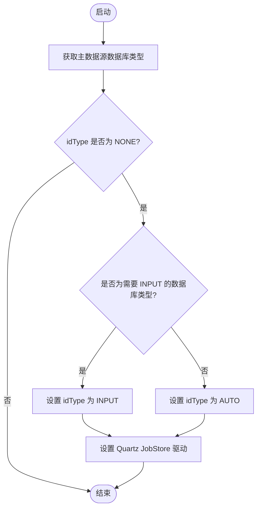
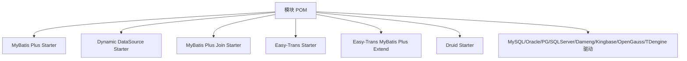

# MyBatis扩展模块

<cite>
**本文档引用的文件**
- [QijiMybatisAutoConfiguration.java](file://backend/qiji-framework/qiji-spring-boot-starter-mybatis/src/main/java/com/qiji/cps/framework/mybatis/config/QijiMybatisAutoConfiguration.java)
- [QijiDataSourceAutoConfiguration.java](file://backend/qiji-framework/qiji-spring-boot-starter-mybatis/src/main/java/com/qiji/cps/framework/datasource/config/QijiDataSourceAutoConfiguration.java)
- [BaseDO.java](file://backend/qiji-framework/qiji-spring-boot-starter-mybatis/src/main/java/com/qiji/cps/framework/mybatis/core/dataobject/BaseDO.java)
- [BaseMapperX.java](file://backend/qiji-framework/qiji-spring-boot-starter-mybatis/src/main/java/com/qiji/cps/framework/mybatis/core/mapper/BaseMapperX.java)
- [DefaultDBFieldHandler.java](file://backend/qiji-framework/qiji-spring-boot-starter-mybatis/src/main/java/com/qiji/cps/framework/mybatis/core/handler/DefaultDBFieldHandler.java)
- [IdTypeEnvironmentPostProcessor.java](file://backend/qiji-framework/qiji-spring-boot-starter-mybatis/src/main/java/com/qiji/cps/framework/mybatis/config/IdTypeEnvironmentPostProcessor.java)
- [DruidAdRemoveFilter.java](file://backend/qiji-framework/qiji-spring-boot-starter-mybatis/src/main/java/com/qiji/cps/framework/datasource/core/filter/DruidAdRemoveFilter.java)
- [pom.xml](file://backend/qiji-framework/qiji-spring-boot-starter-mybatis/pom.xml)
</cite>

## 目录
1. [简介](#简介)
2. [项目结构](#项目结构)
3. [核心组件](#核心组件)
4. [架构概览](#架构概览)
5. [详细组件分析](#详细组件分析)
6. [依赖关系分析](#依赖关系分析)
7. [性能考量](#性能考量)
8. [故障排除指南](#故障排除指南)
9. [结论](#结论)

## 简介
本文件为 AgenticCPS 项目中 qiji-spring-boot-starter-mybatis 扩展模块的详细技术文档。该模块在 MyBatis Plus 的基础上进行了深度定制与增强，重点覆盖以下方面：
- 数据源自动配置与 Druid 监控集成
- 多数据源支持（基于 dynamic-datasource）
- 分页插件与 SQL 注入防护
- MyBatis 配置类与自定义扩展（实体映射、XML 配置、动态 SQL）
- 连接池集成与性能优化（连接池配置、SQL 日志输出、批量操作）
- 最佳实践与常见问题解决方案

## 项目结构
该模块位于后端框架的 qiji-framework 子模块中，采用按功能域划分的包结构：
- config：自动配置类与环境处理器
- core：核心数据模型、Mapper 扩展、类型处理器与工具类
- datasource：数据源相关配置与过滤器
- resources：Spring 启动注册资源

**图表来源**
- [QijiMybatisAutoConfiguration.java:1-96](file://backend/qiji-framework/qiji-spring-boot-starter-mybatis/src/main/java/com/qiji/cps/framework/mybatis/config/QijiMybatisAutoConfiguration.java#L1-L96)
- [QijiDataSourceAutoConfiguration.java:1-41](file://backend/qiji-framework/qiji-spring-boot-starter-mybatis/src/main/java/com/qiji/cps/framework/datasource/config/QijiDataSourceAutoConfiguration.java#L1-L41)

**章节来源**
- [pom.xml:1-111](file://backend/qiji-framework/qiji-spring-boot-starter-mybatis/pom.xml#L1-L111)

## 核心组件
本模块的核心由以下组件构成：
- MyBatis 自动配置类：负责分页插件、元对象处理器、键生成器、JSON 类型处理器等的装配
- 数据源自动配置类：启用事务管理、Druid 统计监控、移除广告脚本过滤器
- 基础实体与 Mapper 扩展：提供统一的审计字段、分页查询、联表查询、批量操作等能力
- 环境处理器：根据数据库类型自动设置 MyBatis Plus 的 idType 与 Quartz JobStore 驱动
- Druid 广告移除过滤器：净化 Druid 监控页面的底部广告脚本

**章节来源**
- [QijiMybatisAutoConfiguration.java:1-96](file://backend/qiji-framework/qiji-spring-boot-starter-mybatis/src/main/java/com/qiji/cps/framework/mybatis/config/QijiMybatisAutoConfiguration.java#L1-L96)
- [QijiDataSourceAutoConfiguration.java:1-41](file://backend/qiji-framework/qiji-spring-boot-starter-mybatis/src/main/java/com/qiji/cps/framework/datasource/config/QijiDataSourceAutoConfiguration.java#L1-L41)
- [BaseDO.java:1-67](file://backend/qiji-framework/qiji-spring-boot-starter-mybatis/src/main/java/com/qiji/cps/framework/mybatis/core/dataobject/BaseDO.java#L1-L67)
- [BaseMapperX.java:1-250](file://backend/qiji-framework/qiji-spring-boot-starter-mybatis/src/main/java/com/qiji/cps/framework/mybatis/core/mapper/BaseMapperX.java#L1-L250)
- [DefaultDBFieldHandler.java:1-64](file://backend/qiji-framework/qiji-spring-boot-starter-mybatis/src/main/java/com/qiji/cps/framework/mybatis/core/handler/DefaultDBFieldHandler.java#L1-L64)
- [IdTypeEnvironmentPostProcessor.java:1-120](file://backend/qiji-framework/qiji-spring-boot-starter-mybatis/src/main/java/com/qiji/cps/framework/mybatis/config/IdTypeEnvironmentPostProcessor.java#L1-L120)
- [DruidAdRemoveFilter.java:1-39](file://backend/qiji-framework/qiji-spring-boot-starter-mybatis/src/main/java/com/qiji/cps/framework/datasource/core/filter/DruidAdRemoveFilter.java#L1-L39)

## 架构概览
该模块通过 Spring Boot 自动配置机制，在应用启动阶段完成 MyBatis Plus 与 Druid 的初始化，并提供统一的数据库访问层抽象。

**图表来源**
- [QijiMybatisAutoConfiguration.java:1-96](file://backend/qiji-framework/qiji-spring-boot-starter-mybatis/src/main/java/com/qiji/cps/framework/mybatis/config/QijiMybatisAutoConfiguration.java#L1-L96)
- [QijiDataSourceAutoConfiguration.java:1-41](file://backend/qiji-framework/qiji-spring-boot-starter-mybatis/src/main/java/com/qiji/cps/framework/datasource/config/QijiDataSourceAutoConfiguration.java#L1-L41)
- [IdTypeEnvironmentPostProcessor.java:1-120](file://backend/qiji-framework/qiji-spring-boot-starter-mybatis/src/main/java/com/qiji/cps/framework/mybatis/config/IdTypeEnvironmentPostProcessor.java#L1-L120)
- [BaseMapperX.java:1-250](file://backend/qiji-framework/qiji-spring-boot-starter-mybatis/src/main/java/com/qiji/cps/framework/mybatis/core/mapper/BaseMapperX.java#L1-L250)
- [BaseDO.java:1-67](file://backend/qiji-framework/qiji-spring-boot-starter-mybatis/src/main/java/com/qiji/cps/framework/mybatis/core/dataobject/BaseDO.java#L1-L67)

## 详细组件分析

### MyBatis 自动配置类
该类负责 MyBatis Plus 的核心扩展配置，确保在 MyBatis Plus 自动配置之前执行，避免 Mapper 扫描警告；同时提供分页插件、元对象处理器、键生成器与 JSON 类型处理器的装配。

**图表来源**
- [QijiMybatisAutoConfiguration.java:1-96](file://backend/qiji-framework/qiji-spring-boot-starter-mybatis/src/main/java/com/qiji/cps/framework/mybatis/config/QijiMybatisAutoConfiguration.java#L1-L96)

**章节来源**
- [QijiMybatisAutoConfiguration.java:29-96](file://backend/qiji-framework/qiji-spring-boot-starter-mybatis/src/main/java/com/qiji/cps/framework/mybatis/config/QijiMybatisAutoConfiguration.java#L29-L96)

### 数据源自动配置类
该类启用事务管理，注册 Druid 统计监控与广告移除过滤器，确保监控页面的用户体验。

**图表来源**
- [QijiDataSourceAutoConfiguration.java:1-41](file://backend/qiji-framework/qiji-spring-boot-starter-mybatis/src/main/java/com/qiji/cps/framework/datasource/config/QijiDataSourceAutoConfiguration.java#L1-L41)
- [DruidAdRemoveFilter.java:1-39](file://backend/qiji-framework/qiji-spring-boot-starter-mybatis/src/main/java/com/qiji/cps/framework/datasource/core/filter/DruidAdRemoveFilter.java#L1-L39)

**章节来源**
- [QijiDataSourceAutoConfiguration.java:12-41](file://backend/qiji-framework/qiji-spring-boot-starter-mybatis/src/main/java/com/qiji/cps/framework/datasource/config/QijiDataSourceAutoConfiguration.java#L12-L41)
- [DruidAdRemoveFilter.java:12-39](file://backend/qiji-framework/qiji-spring-boot-starter-mybatis/src/main/java/com/qiji/cps/framework/datasource/core/filter/DruidAdRemoveFilter.java#L12-L39)

### 基础实体与自动填充
基础实体提供统一的审计字段（创建时间、更新时间、创建者、更新者、逻辑删除），并通过元对象处理器实现自动填充。

**图表来源**
- [BaseDO.java:1-67](file://backend/qiji-framework/qiji-spring-boot-starter-mybatis/src/main/java/com/qiji/cps/framework/mybatis/core/dataobject/BaseDO.java#L1-L67)
- [DefaultDBFieldHandler.java:1-64](file://backend/qiji-framework/qiji-spring-boot-starter-mybatis/src/main/java/com/qiji/cps/framework/mybatis/core/handler/DefaultDBFieldHandler.java#L1-L64)

**章节来源**
- [BaseDO.java:14-67](file://backend/qiji-framework/qiji-spring-boot-starter-mybatis/src/main/java/com/qiji/cps/framework/mybatis/core/dataobject/BaseDO.java#L14-L67)
- [DefaultDBFieldHandler.java:11-64](file://backend/qiji-framework/qiji-spring-boot-starter-mybatis/src/main/java/com/qiji/cps/framework/mybatis/core/handler/DefaultDBFieldHandler.java#L11-L64)

### Mapper 扩展与批量操作
BaseMapperX 在 MyBatis Plus 的基础上扩展了分页查询、联表查询、批量插入与批量更新等能力，并针对不同数据库类型进行兼容处理。

**图表来源**
- [BaseMapperX.java:1-250](file://backend/qiji-framework/qiji-spring-boot-starter-mybatis/src/main/java/com/qiji/cps/framework/mybatis/core/mapper/BaseMapperX.java#L1-L250)

**章节来源**
- [BaseMapperX.java:26-249](file://backend/qiji-framework/qiji-spring-boot-starter-mybatis/src/main/java/com/qiji/cps/framework/mybatis/core/mapper/BaseMapperX.java#L26-L249)

### 环境处理器与数据库适配
IdTypeEnvironmentPostProcessor 根据主数据源的数据库类型自动设置 MyBatis Plus 的 idType，并为 Quartz JobStore 设置相应的驱动委托类。

**图表来源**
- [IdTypeEnvironmentPostProcessor.java:1-120](file://backend/qiji-framework/qiji-spring-boot-starter-mybatis/src/main/java/com/qiji/cps/framework/mybatis/config/IdTypeEnvironmentPostProcessor.java#L1-L120)

**章节来源**
- [IdTypeEnvironmentPostProcessor.java:18-120](file://backend/qiji-framework/qiji-spring-boot-starter-mybatis/src/main/java/com/qiji/cps/framework/mybatis/config/IdTypeEnvironmentPostProcessor.java#L18-L120)

## 依赖关系分析
该模块通过 Maven 引入 MyBatis Plus、Druid、动态数据源、联表查询与数据翻译等依赖，并提供数据库驱动的可选依赖以支持多种数据库。

**图表来源**
- [pom.xml:18-108](file://backend/qiji-framework/qiji-spring-boot-starter-mybatis/pom.xml#L18-L108)

**章节来源**
- [pom.xml:18-108](file://backend/qiji-framework/qiji-spring-boot-starter-mybatis/pom.xml#L18-L108)

## 性能考量
- 分页插件：内置分页拦截器，建议在大数据量场景下合理设置分页参数，避免一次性加载过多数据
- 动态 SQL 解析缓存：启用 jsqlparser 的本地缓存以提升复杂 XML 动态 SQL 的解析性能
- 批量操作：针对 SQL Server 的批量插入回写主键问题做了特殊处理，其他数据库可使用 Db.saveBatch 进行高效批量插入
- 连接池：使用 Druid 连接池，建议结合业务并发与慢 SQL 监控调优连接数与超时参数
- JSON 类型处理：通过 JacksonTypeHandler 统一处理 JSON 字段，避免全局使用导致的兼容性问题

## 故障排除指南
- 分页查询异常：确认分页参数是否正确传入，以及排序字段是否存在
- 批量插入失败或主键回写异常：检查数据库类型，SQL Server 场景下会降级为逐条插入
- 自动填充字段为空：确认实体继承 BaseDO，且当前登录用户上下文可用
- Druid 监控页面广告干扰：启用过滤器后，监控页面的 common.js 将被净化
- idType 配置冲突：当 idType 设为 NONE 时，环境处理器会根据数据库类型自动设置为 INPUT 或 AUTO

**章节来源**
- [BaseMapperX.java:196-220](file://backend/qiji-framework/qiji-spring-boot-starter-mybatis/src/main/java/com/qiji/cps/framework/mybatis/core/mapper/BaseMapperX.java#L196-L220)
- [DefaultDBFieldHandler.java:20-62](file://backend/qiji-framework/qiji-spring-boot-starter-mybatis/src/main/java/com/qiji/cps/framework/mybatis/core/handler/DefaultDBFieldHandler.java#L20-L62)
- [DruidAdRemoveFilter.java:24-36](file://backend/qiji-framework/qiji-spring-boot-starter-mybatis/src/main/java/com/qiji/cps/framework/datasource/core/filter/DruidAdRemoveFilter.java#L24-L36)
- [IdTypeEnvironmentPostProcessor.java:47-59](file://backend/qiji-framework/qiji-spring-boot-starter-mybatis/src/main/java/com/qiji/cps/framework/mybatis/config/IdTypeEnvironmentPostProcessor.java#L47-L59)

## 结论
qiji-spring-boot-starter-mybatis 通过自动配置、实体扩展、Mapper 增强与环境适配，为 AgenticCPS 提供了稳定、高性能且易用的数据库访问层。建议在生产环境中结合监控与性能分析工具持续优化连接池与 SQL 执行计划，并遵循模块提供的最佳实践以降低维护成本与风险。