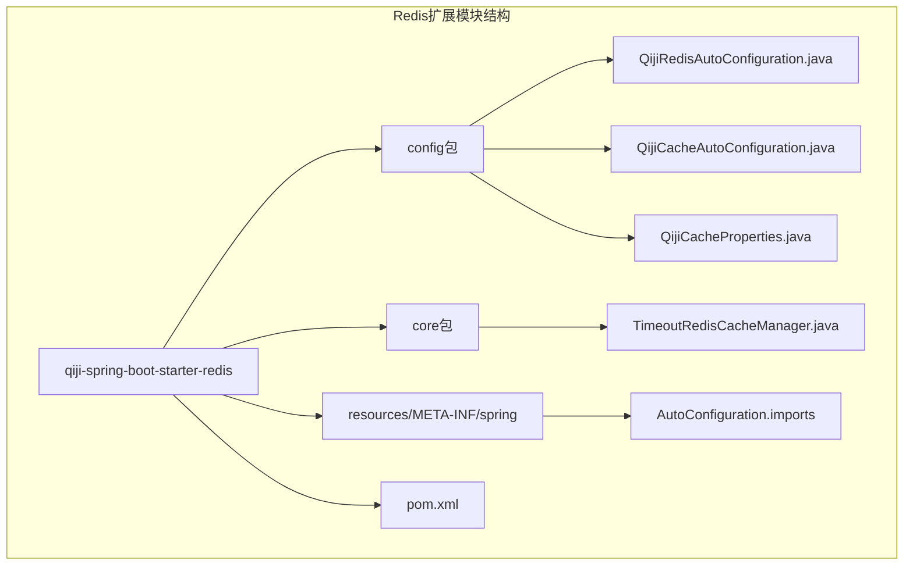
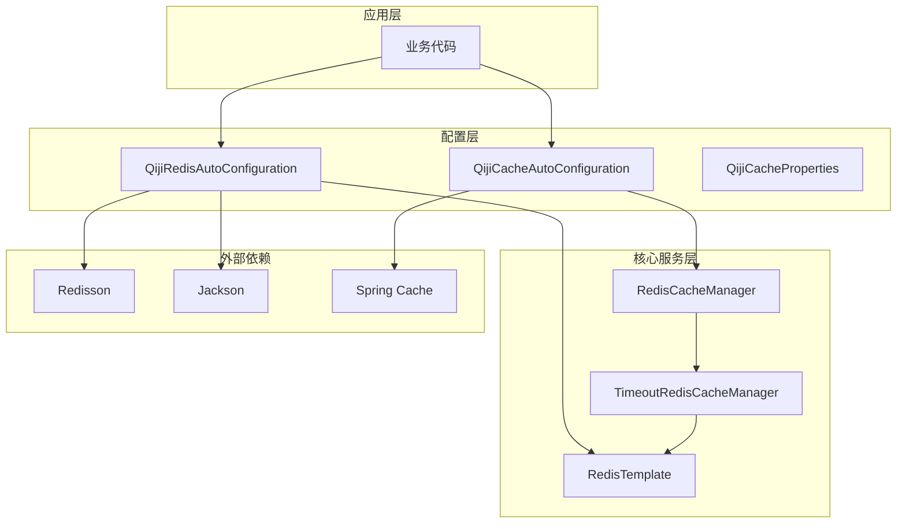
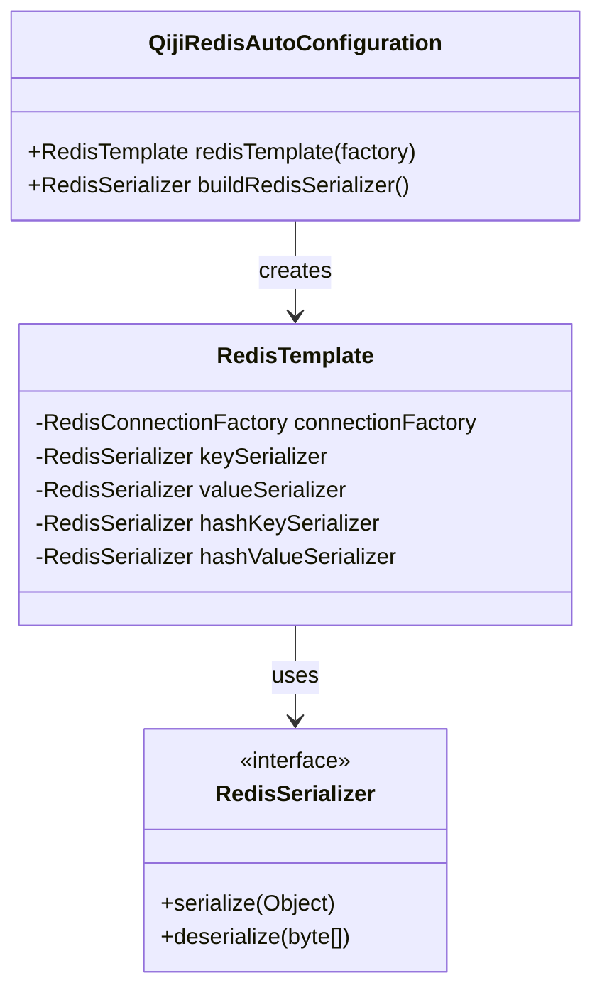
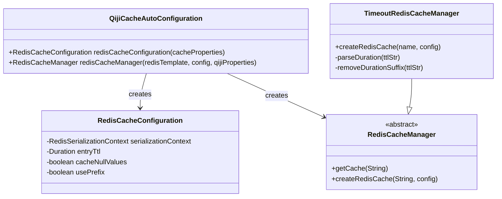
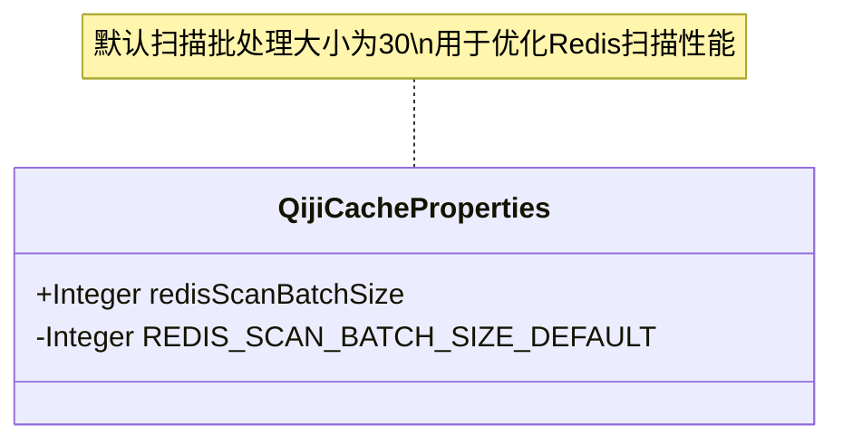
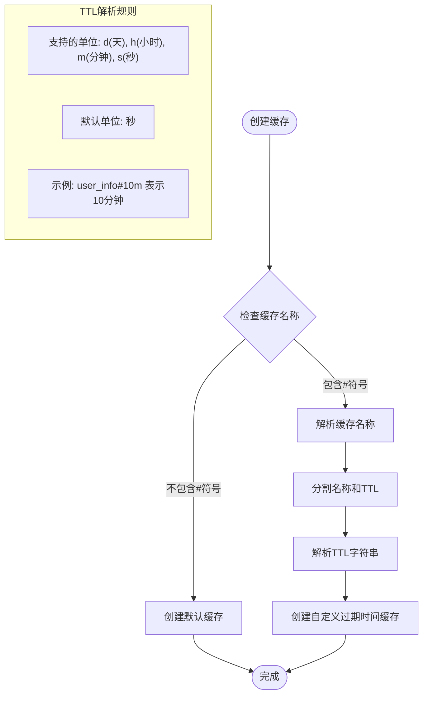
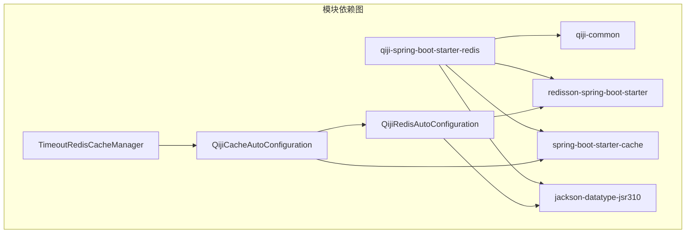

# Redis扩展模块

<cite>
**本文档引用的文件**
- [QijiRedisAutoConfiguration.java](file://backend/qiji-framework/qiji-spring-boot-starter-redis/src/main/java/com/qiji/cps/framework/redis/config/QijiRedisAutoConfiguration.java)
- [QijiCacheAutoConfiguration.java](file://backend/qiji-framework/qiji-spring-boot-starter-redis/src/main/java/com/qiji/cps/framework/redis/config/QijiCacheAutoConfiguration.java)
- [QijiCacheProperties.java](file://backend/qiji-framework/qiji-spring-boot-starter-redis/src/main/java/com/qiji/cps/framework/redis/config/QijiCacheProperties.java)
- [TimeoutRedisCacheManager.java](file://backend/qiji-framework/qiji-spring-boot-starter-redis/src/main/java/com/qiji/cps/framework/redis/core/TimeoutRedisCacheManager.java)
- [pom.xml](file://backend/qiji-framework/qiji-spring-boot-starter-redis/pom.xml)
</cite>

## 目录
1. [简介](#简介)
2. [项目结构](#项目结构)
3. [核心组件](#核心组件)
4. [架构概览](#架构概览)
5. [详细组件分析](#详细组件分析)
6. [依赖关系分析](#依赖关系分析)
7. [性能考虑](#性能考虑)
8. [故障排除指南](#故障排除指南)
9. [结论](#结论)

## 简介

AgenticCPS项目的Redis扩展模块是一个基于Spring Boot Starter的Redis封装扩展，旨在为项目提供完整的Redis缓存解决方案。该模块不仅提供了RedisTemplate的自动配置和JSON序列化支持，还集成了Redisson分布式锁功能，并实现了智能的缓存管理策略。

该扩展模块的主要目标是简化Redis在Spring Boot环境中的使用，提供开箱即用的配置选项，同时保持高度的可定制性和性能优化。通过集成Redisson分布式锁，模块能够支持复杂的并发控制场景，确保数据的一致性和完整性。

## 项目结构

Redis扩展模块采用标准的Spring Boot Starter结构，主要包含以下核心目录和文件：

**图表来源**
- [QijiRedisAutoConfiguration.java:1-46](file://backend/qiji-framework/qiji-spring-boot-starter-redis/src/main/java/com/qiji/cps/framework/redis/config/QijiRedisAutoConfiguration.java#L1-L46)
- [QijiCacheAutoConfiguration.java:1-83](file://backend/qiji-framework/qiji-spring-boot-starter-redis/src/main/java/com/qiji/cps/framework/redis/config/QijiCacheAutoConfiguration.java#L1-L83)

**章节来源**
- [pom.xml:1-42](file://backend/qiji-framework/qiji-spring-boot-starter-redis/pom.xml#L1-L42)

## 核心组件

Redis扩展模块包含四个核心组件，每个组件都有特定的功能和职责：

### Redis自动配置组件
负责RedisTemplate的自动配置，包括连接工厂设置、序列化器配置等基础Redis操作支持。

### 缓存自动配置组件  
提供基于Redis的缓存管理功能，包括缓存配置、缓存管理器创建等高级缓存特性。

### 缓存属性配置组件
定义了自定义的缓存配置属性，特别是Redis扫描批处理大小等性能相关参数。

### 超时缓存管理组件
实现了支持自定义过期时间的Redis缓存管理器，允许在缓存名称中指定过期时间。

**章节来源**
- [QijiRedisAutoConfiguration.java:13-46](file://backend/qiji-framework/qiji-spring-boot-starter-redis/src/main/java/com/qiji/cps/framework/redis/config/QijiRedisAutoConfiguration.java#L13-L46)
- [QijiCacheAutoConfiguration.java:24-83](file://backend/qiji-framework/qiji-spring-boot-starter-redis/src/main/java/com/qiji/cps/framework/redis/config/QijiCacheAutoConfiguration.java#L24-L83)
- [QijiCacheProperties.java:7-28](file://backend/qiji-framework/qiji-spring-boot-starter-redis/src/main/java/com/qiji/cps/framework/redis/config/QijiCacheProperties.java#L7-L28)
- [TimeoutRedisCacheManager.java:13-87](file://backend/qiji-framework/qiji-spring-boot-starter-redis/src/main/java/com/qiji/cps/framework/redis/core/TimeoutRedisCacheManager.java#L13-L87)

## 架构概览

Redis扩展模块的整体架构设计体现了分层和解耦的原则，通过自动配置机制实现无缝集成：

**图表来源**
- [QijiRedisAutoConfiguration.java:16-43](file://backend/qiji-framework/qiji-spring-boot-starter-redis/src/main/java/com/qiji/cps/framework/redis/config/QijiRedisAutoConfiguration.java#L16-L43)
- [QijiCacheAutoConfiguration.java:27-80](file://backend/qiji-framework/qiji-spring-boot-starter-redis/src/main/java/com/qiji/cps/framework/redis/config/QijiCacheAutoConfiguration.java#L27-L80)

该架构通过自动配置类实现了以下关键特性：
- 自动检测和配置Redis连接
- 提供JSON序列化支持
- 集成Redisson分布式锁
- 支持自定义缓存过期时间
- 优化的缓存扫描性能

## 详细组件分析

### Redis自动配置组件分析

Redis自动配置组件是整个模块的基础，负责创建和配置RedisTemplate实例：

**图表来源**
- [QijiRedisAutoConfiguration.java:17-43](file://backend/qiji-framework/qiji-spring-boot-starter-redis/src/main/java/com/qiji/cps/framework/redis/config/QijiRedisAutoConfiguration.java#L17-L43)

该组件的关键特性包括：
- **连接工厂配置**：自动注入RedisConnectionFactory
- **键序列化**：使用String序列化器处理KEY
- **值序列化**：使用JSON序列化器处理VALUE
- **时间序列化支持**：通过反射机制注册JavaTimeModule

**章节来源**
- [QijiRedisAutoConfiguration.java:19-43](file://backend/qiji-framework/qiji-spring-boot-starter-redis/src/main/java/com/qiji/cps/framework/redis/config/QijiRedisAutoConfiguration.java#L19-L43)

### 缓存自动配置组件分析

缓存自动配置组件提供了完整的Redis缓存解决方案：

**图表来源**
- [QijiCacheAutoConfiguration.java:30-80](file://backend/qiji-framework/qiji-spring-boot-starter-redis/src/main/java/com/qiji/cps/framework/redis/config/QijiCacheAutoConfiguration.java#L30-L80)
- [TimeoutRedisCacheManager.java:21-52](file://backend/qiji-framework/qiji-spring-boot-starter-redis/src/main/java/com/qiji/cps/framework/redis/core/TimeoutRedisCacheManager.java#L21-L52)

**章节来源**
- [QijiCacheAutoConfiguration.java:32-80](file://backend/qiji-framework/qiji-spring-boot-starter-redis/src/main/java/com/qiji/cps/framework/redis/config/QijiCacheAutoConfiguration.java#L32-L80)

### 缓存属性配置组件分析

缓存属性配置组件定义了模块的可配置参数：

**图表来源**
- [QijiCacheProperties.java:15-27](file://backend/qiji-framework/qiji-spring-boot-starter-redis/src/main/java/com/qiji/cps/framework/redis/config/QijiCacheProperties.java#L15-L27)

**章节来源**
- [QijiCacheProperties.java:17-25](file://backend/qiji-framework/qiji-spring-boot-starter-redis/src/main/java/com/qiji/cps/framework/redis/config/QijiCacheProperties.java#L17-L25)

### 超时缓存管理组件分析

超时缓存管理组件是模块的核心创新，实现了灵活的过期时间控制：

**图表来源**
- [TimeoutRedisCacheManager.java:29-52](file://backend/qiji-framework/qiji-spring-boot-starter-redis/src/main/java/com/qiji/cps/framework/redis/core/TimeoutRedisCacheManager.java#L29-L52)

**章节来源**
- [TimeoutRedisCacheManager.java:29-84](file://backend/qiji-framework/qiji-spring-boot-starter-redis/src/main/java/com/qiji/cps/framework/redis/core/TimeoutRedisCacheManager.java#L29-L84)

## 依赖关系分析

Redis扩展模块的依赖关系体现了清晰的层次结构和松耦合设计：

**图表来源**
- [pom.xml:18-39](file://backend/qiji-framework/qiji-spring-boot-starter-redis/pom.xml#L18-L39)

**章节来源**
- [pom.xml:18-39](file://backend/qiji-framework/qiji-spring-boot-starter-redis/pom.xml#L18-L39)

### 外部依赖分析

模块对外部依赖的使用体现了最佳实践：

| 依赖组件 | 版本 | 用途 | 关键特性 |
|---------|------|------|----------|
| redisson-spring-boot-starter | 最新版本 | Redisson集成 | 分布式锁、限流、集群支持 |
| spring-boot-starter-cache | 2.x | 缓存抽象 | @Cacheable注解支持 |
| jackson-datatype-jsr310 | 2.x | 时间序列化 | LocalDateTime等JSR-310类型 |

## 性能考虑

Redis扩展模块在设计时充分考虑了性能优化，主要体现在以下几个方面：

### 缓存扫描优化
通过可配置的扫描批处理大小来平衡内存使用和CPU消耗：
- 默认批处理大小：30个元素
- 可通过配置调整以适应不同场景
- 使用SCAN命令进行非阻塞遍历

### 序列化性能
- JSON序列化相比默认Java序列化具有更好的跨语言兼容性
- 针对时间类型的特殊处理避免了序列化异常
- 减少了不必要的对象转换开销

### 连接池优化
- 利用Spring Boot自动配置的连接池
- 支持Redisson的高性能连接管理
- 优化的连接复用策略

## 故障排除指南

### 常见问题及解决方案

**问题1：Redis连接失败**
- 检查Redis服务器状态和网络连通性
- 验证application.yml中的Redis配置
- 确认防火墙设置允许连接

**问题2：序列化异常**
- 确保缓存对象实现Serializable接口
- 检查Jackson依赖是否正确引入
- 验证时间类型的序列化配置

**问题3：缓存过期时间不生效**
- 确认缓存名称格式正确（cacheName#ttl）
- 检查TTL字符串格式是否符合规范
- 验证TimeoutRedisCacheManager是否被正确加载

**问题4：分布式锁无法获取**
- 检查Redisson配置是否正确
- 确认锁的超时时间和重试机制
- 验证Redis集群的可用性

**章节来源**
- [QijiCacheAutoConfiguration.java:70-80](file://backend/qiji-framework/qiji-spring-boot-starter-redis/src/main/java/com/qiji/cps/framework/redis/config/QijiCacheAutoConfiguration.java#L70-L80)
- [TimeoutRedisCacheManager.java:29-52](file://backend/qiji-framework/qiji-spring-boot-starter-redis/src/main/java/com/qiji/cps/framework/redis/core/TimeoutRedisCacheManager.java#L29-L52)

## 结论

AgenticCPS项目的Redis扩展模块通过精心设计的架构和实现，为Spring Boot应用提供了完整而高效的Redis解决方案。模块的主要优势包括：

1. **开箱即用**：通过自动配置实现零样板代码
2. **高度可定制**：支持丰富的配置选项和自定义扩展
3. **性能优化**：针对缓存扫描、序列化等关键环节进行了专门优化
4. **企业级特性**：集成Redisson分布式锁，支持高并发场景
5. **易用性**：简洁的API设计和完善的错误处理机制

该模块不仅满足了当前项目的需求，也为未来的扩展和维护奠定了坚实的基础。通过遵循Spring Boot的自动配置原则和最佳实践，模块能够在保证功能完整性的同时，提供优秀的开发体验和运行性能。