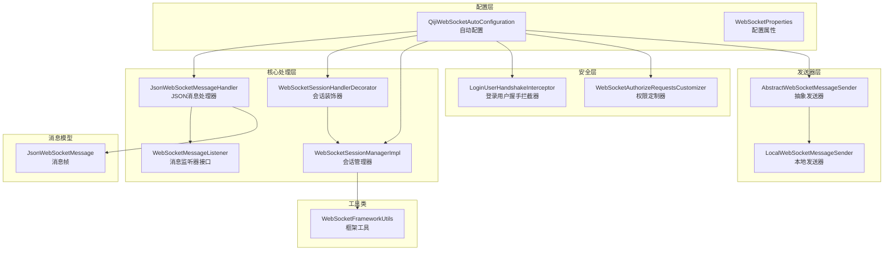
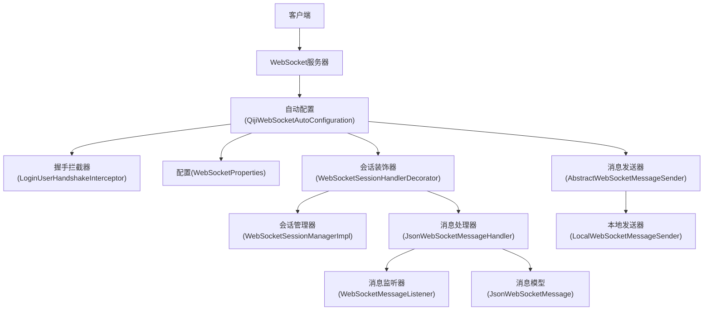
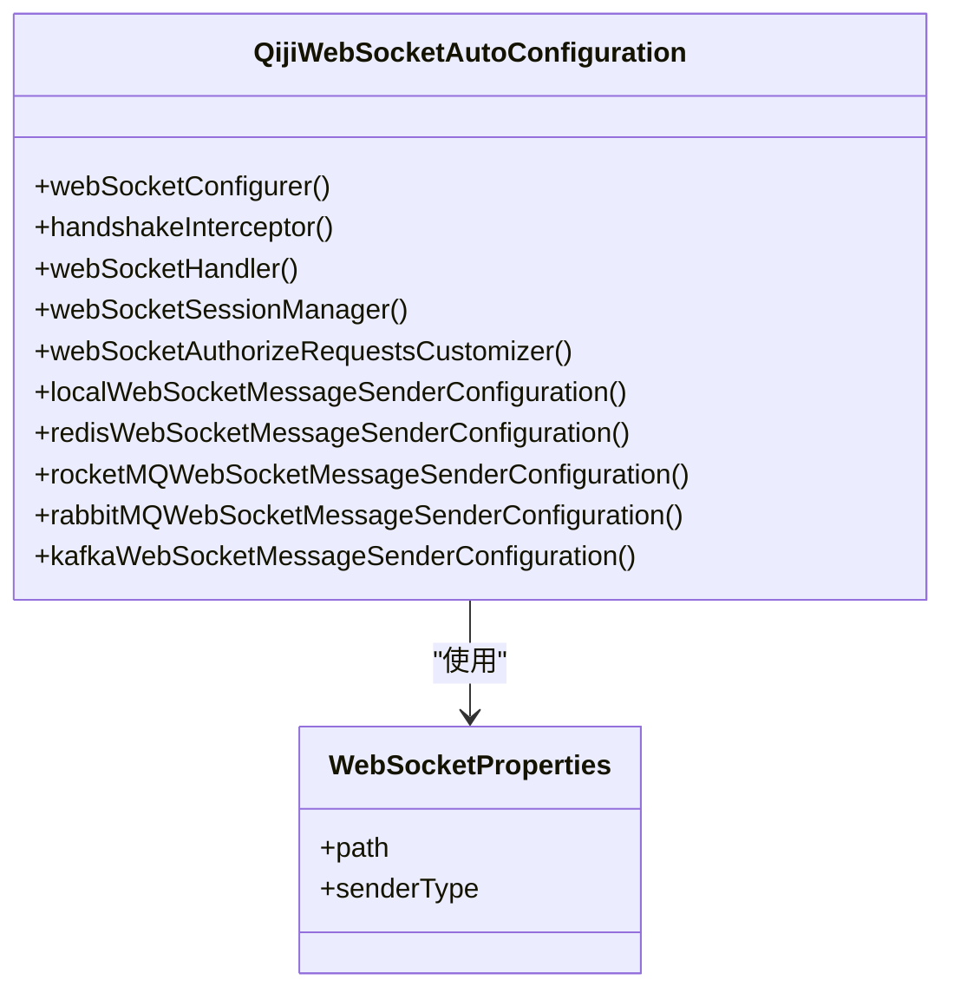
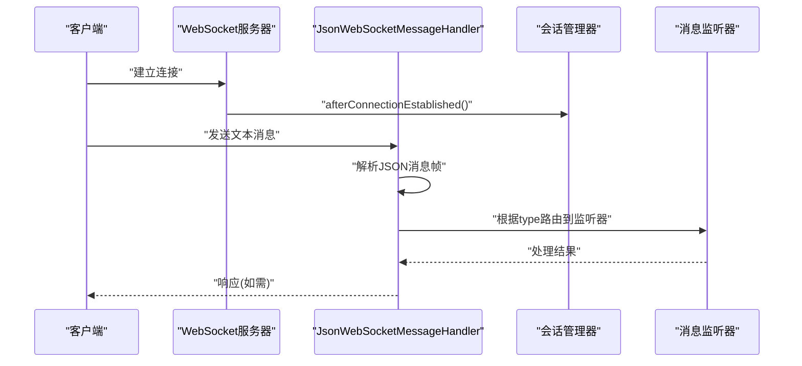
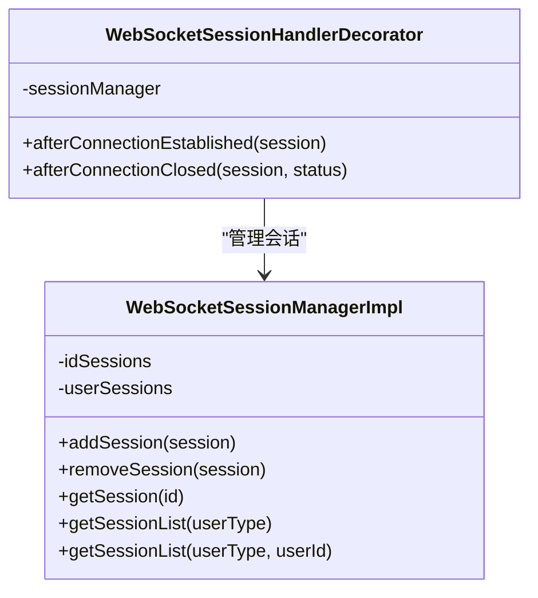
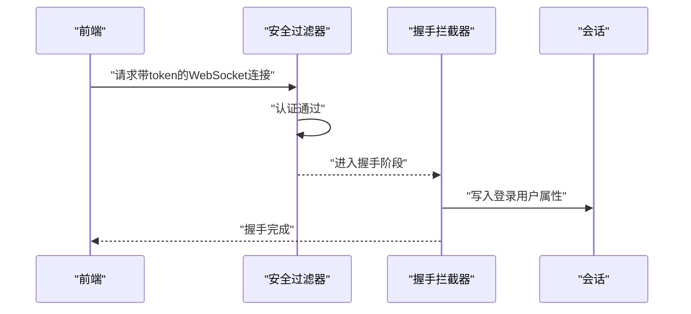
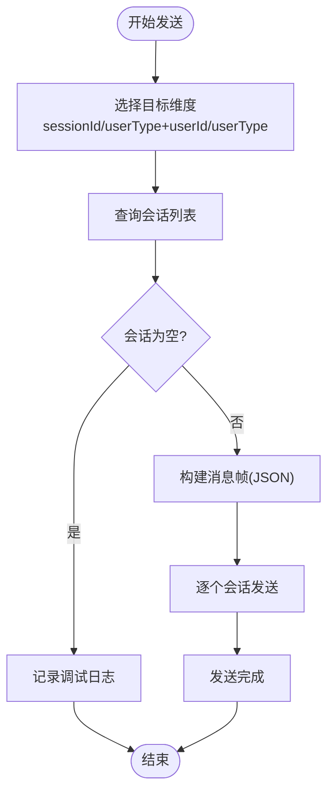
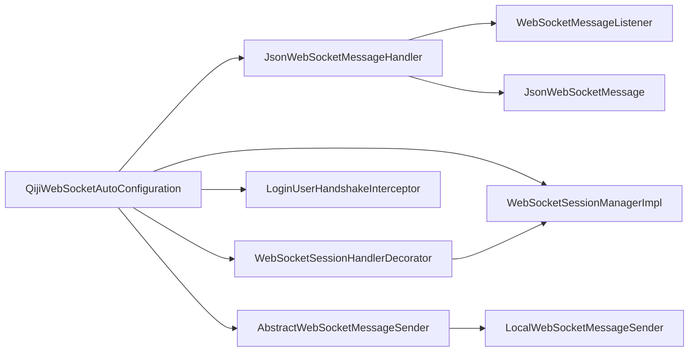

# WebSocket扩展模块

<cite>
**本文档引用的文件**
- [QijiWebSocketAutoConfiguration.java](file://backend/qiji-framework/qiji-spring-boot-starter-websocket/src/main/java/com/qiji/cps/framework/websocket/config/QijiWebSocketAutoConfiguration.java)
- [WebSocketProperties.java](file://backend/qiji-framework/qiji-spring-boot-starter-websocket/src/main/java/com/qiji/cps/framework/websocket/config/WebSocketProperties.java)
- [JsonWebSocketMessageHandler.java](file://backend/qiji-framework/qiji-spring-boot-starter-websocket/src/main/java/com/qiji/cps/framework/websocket/core/handler/JsonWebSocketMessageHandler.java)
- [WebSocketSessionManagerImpl.java](file://backend/qiji-framework/qiji-spring-boot-starter-websocket/src/main/java/com/qiji/cps/framework/websocket/core/session/WebSocketSessionManagerImpl.java)
- [WebSocketSessionHandlerDecorator.java](file://backend/qiji-framework/qiji-spring-boot-starter-websocket/src/main/java/com/qiji/cps/framework/websocket/core/session/WebSocketSessionHandlerDecorator.java)
- [WebSocketMessageListener.java](file://backend/qiji-framework/qiji-spring-boot-starter-websocket/src/main/java/com/qiji/cps/framework/websocket/core/listener/WebSocketMessageListener.java)
- [LoginUserHandshakeInterceptor.java](file://backend/qiji-framework/qiji-spring-boot-starter-websocket/src/main/java/com/qiji/cps/framework/websocket/core/security/LoginUserHandshakeInterceptor.java)
- [WebSocketAuthorizeRequestsCustomizer.java](file://backend/qiji-framework/qiji-spring-boot-starter-websocket/src/main/java/com/qiji/cps/framework/websocket/core/security/WebSocketAuthorizeRequestsCustomizer.java)
- [AbstractWebSocketMessageSender.java](file://backend/qiji-framework/qiji-spring-boot-starter-websocket/src/main/java/com/qiji/cps/framework/websocket/core/sender/AbstractWebSocketMessageSender.java)
- [LocalWebSocketMessageSender.java](file://backend/qiji-framework/qiji-spring-boot-starter-websocket/src/main/java/com/qiji/cps/framework/websocket/core/sender/local/LocalWebSocketMessageSender.java)
- [WebSocketFrameworkUtils.java](file://backend/qiji-framework/qiji-spring-boot-starter-websocket/src/main/java/com/qiji/cps/framework/websocket/core/util/WebSocketFrameworkUtils.java)
- [JsonWebSocketMessage.java](file://backend/qiji-framework/qiji-spring-boot-starter-websocket/src/main/java/com/qiji/cps/framework/websocket/core/message/JsonWebSocketMessage.java)
</cite>

## 目录
1. [简介](#简介)
2. [项目结构](#项目结构)
3. [核心组件](#核心组件)
4. [架构总览](#架构总览)
5. [详细组件分析](#详细组件分析)
6. [依赖关系分析](#依赖关系分析)
7. [性能考虑](#性能考虑)
8. [故障排查指南](#故障排查指南)
9. [结论](#结论)

## 简介
本文件面向AgenticCPS项目的qiji-spring-boot-starter-websocket扩展模块，系统性阐述其WebSocket自动配置与扩展机制，涵盖处理器注册、消息广播、用户会话管理、握手与鉴权、消息编解码、心跳检测等关键能力，并给出实时通信的应用场景、最佳实践与性能优化建议。

## 项目结构
该模块位于后端框架层，采用按功能域分层的组织方式：
- config：自动配置与属性定义
- core：核心业务逻辑（处理器、监听器、会话管理、消息发送器、工具类）
- message：消息模型
- security：安全与鉴权相关
- sender：消息发送器实现（本地/Redis/RocketMQ/Kafka/RabbitMQ）

**图表来源**
- [QijiWebSocketAutoConfiguration.java:1-183](file://backend/qiji-framework/qiji-spring-boot-starter-websocket/src/main/java/com/qiji/cps/framework/websocket/config/QijiWebSocketAutoConfiguration.java#L1-L183)
- [WebSocketProperties.java:1-35](file://backend/qiji-framework/qiji-spring-boot-starter-websocket/src/main/java/com/qiji/cps/framework/websocket/config/WebSocketProperties.java#L1-L35)
- [JsonWebSocketMessageHandler.java:1-84](file://backend/qiji-framework/qiji-spring-boot-starter-websocket/src/main/java/com/qiji/cps/framework/websocket/core/handler/JsonWebSocketMessageHandler.java#L1-L84)
- [WebSocketSessionHandlerDecorator.java:1-50](file://backend/qiji-framework/qiji-spring-boot-starter-websocket/src/main/java/com/qiji/cps/framework/websocket/core/session/WebSocketSessionHandlerDecorator.java#L1-L50)
- [WebSocketSessionManagerImpl.java:1-126](file://backend/qiji-framework/qiji-spring-boot-starter-websocket/src/main/java/com/qiji/cps/framework/websocket/core/session/WebSocketSessionManagerImpl.java#L1-L126)
- [WebSocketMessageListener.java:1-32](file://backend/qiji-framework/qiji-spring-boot-starter-websocket/src/main/java/com/qiji/cps/framework/websocket/core/listener/WebSocketMessageListener.java#L1-L32)
- [LoginUserHandshakeInterceptor.java:1-43](file://backend/qiji-framework/qiji-spring-boot-starter-websocket/src/main/java/com/qiji/cps/framework/websocket/core/security/LoginUserHandshakeInterceptor.java#L1-L43)
- [WebSocketAuthorizeRequestsCustomizer.java:1-25](file://backend/qiji-framework/qiji-spring-boot-starter-websocket/src/main/java/com/qiji/cps/framework/websocket/core/security/WebSocketAuthorizeRequestsCustomizer.java#L1-L25)
- [AbstractWebSocketMessageSender.java:1-107](file://backend/qiji-framework/qiji-spring-boot-starter-websocket/src/main/java/com/qiji/cps/framework/websocket/core/sender/AbstractWebSocketMessageSender.java#L1-L107)
- [LocalWebSocketMessageSender.java:1-21](file://backend/qiji-framework/qiji-spring-boot-starter-websocket/src/main/java/com/qiji/cps/framework/websocket/core/sender/local/LocalWebSocketMessageSender.java#L1-L21)
- [WebSocketFrameworkUtils.java:1-68](file://backend/qiji-framework/qiji-spring-boot-starter-websocket/src/main/java/com/qiji/cps/framework/websocket/core/util/WebSocketFrameworkUtils.java#L1-L68)
- [JsonWebSocketMessage.java:1-30](file://backend/qiji-framework/qiji-spring-boot-starter-websocket/src/main/java/com/qiji/cps/framework/websocket/core/message/JsonWebSocketMessage.java#L1-L30)

**章节来源**
- [QijiWebSocketAutoConfiguration.java:1-183](file://backend/qiji-framework/qiji-spring-boot-starter-websocket/src/main/java/com/qiji/cps/framework/websocket/config/QijiWebSocketAutoConfiguration.java#L1-L183)
- [WebSocketProperties.java:1-35](file://backend/qiji-framework/qiji-spring-boot-starter-websocket/src/main/java/com/qiji/cps/framework/websocket/config/WebSocketProperties.java#L1-L35)

## 核心组件
- 自动配置与注册
  - 通过@EnableWebSocket启用WebSocket，基于WebSocketProperties.path注册WebSocket处理器，添加跨域支持。
  - 注入HandshakeInterceptor完成登录用户上下文注入，确保会话具备用户信息。
  - 条件化装配多种消息发送器（本地/Redis/RocketMQ/Kafka/RabbitMQ），由qiji.websocket.sender-type控制。
- 消息处理与分发
  - JsonWebSocketMessageHandler解析JSON消息帧，根据type路由至对应WebSocketMessageListener实现。
  - 内置心跳检测：收到"ping"直接返回"pong"。
- 会话管理
  - WebSocketSessionManagerImpl维护按id与按用户维度的会话映射，支持多会话并发访问。
  - WebSocketSessionHandlerDecorator在连接建立时进行并发封装与会话登记，在断开时移除。
- 安全与鉴权
  - LoginUserHandshakeInterceptor将登录用户信息写入会话属性，供后续处理使用。
  - WebSocketAuthorizeRequestsCustomizer允许指定WebSocket路径无需认证。
- 消息发送
  - AbstractWebSocketMessageSender统一发送流程，支持按sessionId、userType+userId、仅userType三种维度查找会话并广播。
  - LocalWebSocketMessageSender为单机场景提供本地直发能力。

**章节来源**
- [QijiWebSocketAutoConfiguration.java:47-183](file://backend/qiji-framework/qiji-spring-boot-starter-websocket/src/main/java/com/qiji/cps/framework/websocket/config/QijiWebSocketAutoConfiguration.java#L47-L183)
- [JsonWebSocketMessageHandler.java:31-84](file://backend/qiji-framework/qiji-spring-boot-starter-websocket/src/main/java/com/qiji/cps/framework/websocket/core/handler/JsonWebSocketMessageHandler.java#L31-L84)
- [WebSocketSessionManagerImpl.java:22-126](file://backend/qiji-framework/qiji-spring-boot-starter-websocket/src/main/java/com/qiji/cps/framework/websocket/core/session/WebSocketSessionManagerImpl.java#L22-L126)
- [WebSocketSessionHandlerDecorator.java:17-50](file://backend/qiji-framework/qiji-spring-boot-starter-websocket/src/main/java/com/qiji/cps/framework/websocket/core/session/WebSocketSessionHandlerDecorator.java#L17-L50)
- [LoginUserHandshakeInterceptor.java:24-43](file://backend/qiji-framework/qiji-spring-boot-starter-websocket/src/main/java/com/qiji/cps/framework/websocket/core/security/LoginUserHandshakeInterceptor.java#L24-L43)
- [WebSocketAuthorizeRequestsCustomizer.java:14-25](file://backend/qiji-framework/qiji-spring-boot-starter-websocket/src/main/java/com/qiji/cps/framework/websocket/core/security/WebSocketAuthorizeRequestsCustomizer.java#L14-L25)
- [AbstractWebSocketMessageSender.java:23-107](file://backend/qiji-framework/qiji-spring-boot-starter-websocket/src/main/java/com/qiji/cps/framework/websocket/core/sender/AbstractWebSocketMessageSender.java#L23-L107)
- [LocalWebSocketMessageSender.java:14-21](file://backend/qiji-framework/qiji-spring-boot-starter-websocket/src/main/java/com/qiji/cps/framework/websocket/core/sender/local/LocalWebSocketMessageSender.java#L14-L21)

## 架构总览
WebSocket扩展模块遵循“自动配置—处理器—会话—发送器—消息模型”的分层设计，通过条件化装配与策略模式支持多后端消息通道，既满足单机场景，也便于横向扩展到分布式消息中间件。

**图表来源**
- [QijiWebSocketAutoConfiguration.java:47-183](file://backend/qiji-framework/qiji-spring-boot-starter-websocket/src/main/java/com/qiji/cps/framework/websocket/config/QijiWebSocketAutoConfiguration.java#L47-L183)
- [LoginUserHandshakeInterceptor.java:24-43](file://backend/qiji-framework/qiji-spring-boot-starter-websocket/src/main/java/com/qiji/cps/framework/websocket/core/security/LoginUserHandshakeInterceptor.java#L24-L43)
- [WebSocketSessionHandlerDecorator.java:17-50](file://backend/qiji-framework/qiji-spring-boot-starter-websocket/src/main/java/com/qiji/cps/framework/websocket/core/session/WebSocketSessionHandlerDecorator.java#L17-L50)
- [WebSocketSessionManagerImpl.java:22-126](file://backend/qiji-framework/qiji-spring-boot-starter-websocket/src/main/java/com/qiji/cps/framework/websocket/core/session/WebSocketSessionManagerImpl.java#L22-L126)
- [JsonWebSocketMessageHandler.java:31-84](file://backend/qiji-framework/qiji-spring-boot-starter-websocket/src/main/java/com/qiji/cps/framework/websocket/core/handler/JsonWebSocketMessageHandler.java#L31-L84)
- [WebSocketMessageListener.java:13-32](file://backend/qiji-framework/qiji-spring-boot-starter-websocket/src/main/java/com/qiji/cps/framework/websocket/core/listener/WebSocketMessageListener.java#L13-L32)
- [AbstractWebSocketMessageSender.java:23-107](file://backend/qiji-framework/qiji-spring-boot-starter-websocket/src/main/java/com/qiji/cps/framework/websocket/core/sender/AbstractWebSocketMessageSender.java#L23-L107)
- [LocalWebSocketMessageSender.java:14-21](file://backend/qiji-framework/qiji-spring-boot-starter-websocket/src/main/java/com/qiji/cps/framework/websocket/core/sender/local/LocalWebSocketMessageSender.java#L14-L21)
- [JsonWebSocketMessage.java:14-30](file://backend/qiji-framework/qiji-spring-boot-starter-websocket/src/main/java/com/qiji/cps/framework/websocket/core/message/JsonWebSocketMessage.java#L14-L30)

## 详细组件分析

### 自动配置与扩展机制
- 功能要点
  - 使用@EnableWebSocket开启WebSocket支持。
  - 通过webSocketConfigurer注册WebSocket处理器，设置路径与跨域策略。
  - 注入HandshakeInterceptor完成用户上下文注入。
  - 条件化装配不同消息发送器，sender-type支持local/redis/rocketmq/kafka/rabbitmq。
- 扩展方式
  - 通过修改qiji.websocket.sender-type切换发送器实现。
  - 通过qiji.websocket.path自定义WebSocket路径。
  - 通过WebSocketAuthorizeRequestsCustomizer扩展权限规则。

**图表来源**
- [QijiWebSocketAutoConfiguration.java:47-183](file://backend/qiji-framework/qiji-spring-boot-starter-websocket/src/main/java/com/qiji/cps/framework/websocket/config/QijiWebSocketAutoConfiguration.java#L47-L183)
- [WebSocketProperties.java:18-35](file://backend/qiji-framework/qiji-spring-boot-starter-websocket/src/main/java/com/qiji/cps/framework/websocket/config/WebSocketProperties.java#L18-L35)

**章节来源**
- [QijiWebSocketAutoConfiguration.java:47-183](file://backend/qiji-framework/qiji-spring-boot-starter-websocket/src/main/java/com/qiji/cps/framework/websocket/config/QijiWebSocketAutoConfiguration.java#L47-L183)
- [WebSocketProperties.java:18-35](file://backend/qiji-framework/qiji-spring-boot-starter-websocket/src/main/java/com/qiji/cps/framework/websocket/config/WebSocketProperties.java#L18-L35)

### WebSocket处理器与消息分发
- 功能要点
  - 继承TextWebSocketHandler，处理文本消息。
  - 解析JsonWebSocketMessage，按type路由到对应监听器。
  - 内置心跳：收到"ping"立即返回"pong"。
- 处理流程

**图表来源**
- [JsonWebSocketMessageHandler.java:44-81](file://backend/qiji-framework/qiji-spring-boot-starter-websocket/src/main/java/com/qiji/cps/framework/websocket/core/handler/JsonWebSocketMessageHandler.java#L44-L81)
- [WebSocketSessionHandlerDecorator.java:36-47](file://backend/qiji-framework/qiji-spring-boot-starter-websocket/src/main/java/com/qiji/cps/framework/websocket/core/session/WebSocketSessionHandlerDecorator.java#L36-L47)
- [WebSocketMessageListener.java:13-32](file://backend/qiji-framework/qiji-spring-boot-starter-websocket/src/main/java/com/qiji/cps/framework/websocket/core/listener/WebSocketMessageListener.java#L13-L32)

**章节来源**
- [JsonWebSocketMessageHandler.java:31-84](file://backend/qiji-framework/qiji-spring-boot-starter-websocket/src/main/java/com/qiji/cps/framework/websocket/core/handler/JsonWebSocketMessageHandler.java#L31-L84)
- [JsonWebSocketMessage.java:14-30](file://backend/qiji-framework/qiji-spring-boot-starter-websocket/src/main/java/com/qiji/cps/framework/websocket/core/message/JsonWebSocketMessage.java#L14-L30)

### 会话管理与并发控制
- 功能要点
  - 维护idSessions与userSessions两级映射，支持按用户类型/用户ID查询。
  - 连接建立时并发封装会话，断开时清理。
  - 支持租户隔离，避免跨租户会话泄露。
- 并发与一致性
  - 使用ConcurrentHashMap与CopyOnWriteArrayList保证高并发下的读写安全。

**图表来源**
- [WebSocketSessionManagerImpl.java:22-126](file://backend/qiji-framework/qiji-spring-boot-starter-websocket/src/main/java/com/qiji/cps/framework/websocket/core/session/WebSocketSessionManagerImpl.java#L22-L126)
- [WebSocketSessionHandlerDecorator.java:17-50](file://backend/qiji-framework/qiji-spring-boot-starter-websocket/src/main/java/com/qiji/cps/framework/websocket/core/session/WebSocketSessionHandlerDecorator.java#L17-L50)

**章节来源**
- [WebSocketSessionManagerImpl.java:22-126](file://backend/qiji-framework/qiji-spring-boot-starter-websocket/src/main/java/com/qiji/cps/framework/websocket/core/session/WebSocketSessionManagerImpl.java#L22-L126)
- [WebSocketSessionHandlerDecorator.java:17-50](file://backend/qiji-framework/qiji-spring-boot-starter-websocket/src/main/java/com/qiji/cps/framework/websocket/core/session/WebSocketSessionHandlerDecorator.java#L17-L50)

### 握手拦截与鉴权
- 功能要点
  - LoginUserHandshakeInterceptor从当前安全上下文中获取登录用户，写入会话属性。
  - WebSocketAuthorizeRequestsCustomizer允许WebSocket路径免认证访问。
- 应用场景
  - 前端通过URL参数携带token，经过滤器认证后，拦截器将用户信息注入会话。

**图表来源**
- [LoginUserHandshakeInterceptor.java:24-43](file://backend/qiji-framework/qiji-spring-boot-starter-websocket/src/main/java/com/qiji/cps/framework/websocket/core/security/LoginUserHandshakeInterceptor.java#L24-L43)
- [WebSocketAuthorizeRequestsCustomizer.java:14-25](file://backend/qiji-framework/qiji-spring-boot-starter-websocket/src/main/java/com/qiji/cps/framework/websocket/core/security/WebSocketAuthorizeRequestsCustomizer.java#L14-L25)

**章节来源**
- [LoginUserHandshakeInterceptor.java:24-43](file://backend/qiji-framework/qiji-spring-boot-starter-websocket/src/main/java/com/qiji/cps/framework/websocket/core/security/LoginUserHandshakeInterceptor.java#L24-L43)
- [WebSocketAuthorizeRequestsCustomizer.java:14-25](file://backend/qiji-framework/qiji-spring-boot-starter-websocket/src/main/java/com/qiji/cps/framework/websocket/core/security/WebSocketAuthorizeRequestsCustomizer.java#L14-L25)

### 消息发送与广播
- 功能要点
  - AbstractWebSocketMessageSender统一发送入口，支持按sessionId、userType+userId、userType三种维度查找会话。
  - doSend执行实际发送，包含会话有效性校验与异常处理。
  - LocalWebSocketMessageSender为单机直发实现。
- 广播策略
  - 可按用户维度批量推送，或针对特定会话精准投递。

**图表来源**
- [AbstractWebSocketMessageSender.java:53-104](file://backend/qiji-framework/qiji-spring-boot-starter-websocket/src/main/java/com/qiji/cps/framework/websocket/core/sender/AbstractWebSocketMessageSender.java#L53-L104)
- [JsonWebSocketMessage.java:14-30](file://backend/qiji-framework/qiji-spring-boot-starter-websocket/src/main/java/com/qiji/cps/framework/websocket/core/message/JsonWebSocketMessage.java#L14-L30)

**章节来源**
- [AbstractWebSocketMessageSender.java:23-107](file://backend/qiji-framework/qiji-spring-boot-starter-websocket/src/main/java/com/qiji/cps/framework/websocket/core/sender/AbstractWebSocketMessageSender.java#L23-L107)
- [LocalWebSocketMessageSender.java:14-21](file://backend/qiji-framework/qiji-spring-boot-starter-websocket/src/main/java/com/qiji/cps/framework/websocket/core/sender/local/LocalWebSocketMessageSender.java#L14-L21)

### 心跳检测机制
- 实现方式
  - 处理器对长度为4且内容为"ping"的消息直接返回"pong"。
- 适用场景
  - 保持长连接活跃，检测网络与服务端健康状态。

**章节来源**
- [JsonWebSocketMessageHandler.java:50-54](file://backend/qiji-framework/qiji-spring-boot-starter-websocket/src/main/java/com/qiji/cps/framework/websocket/core/handler/JsonWebSocketMessageHandler.java#L50-L54)

### 实时通信应用场景
- 消息推送
  - 基于用户维度广播或单点直发，适用于系统通知、订单状态变更等。
- 在线状态管理
  - 通过会话管理器维护用户在线状态，结合业务侧状态更新。
- 房间聊天
  - 可扩展为按房间维度的会话集合，结合消息监听器实现房间级广播。

[本节为概念性说明，不涉及具体文件分析]

## 依赖关系分析
- 组件耦合
  - 自动配置类聚合处理器、拦截器、会话管理器与发送器。
  - 处理器依赖监听器接口，会话装饰器依赖会话管理器。
- 条件化装配
  - 通过属性开关控制发送器实现，避免不必要的依赖加载。
- 外部集成
  - 支持Redis/RocketMQ/Kafka/RabbitMQ作为消息通道，便于水平扩展。

**图表来源**
- [QijiWebSocketAutoConfiguration.java:47-183](file://backend/qiji-framework/qiji-spring-boot-starter-websocket/src/main/java/com/qiji/cps/framework/websocket/config/QijiWebSocketAutoConfiguration.java#L47-L183)
- [JsonWebSocketMessageHandler.java:31-84](file://backend/qiji-framework/qiji-spring-boot-starter-websocket/src/main/java/com/qiji/cps/framework/websocket/core/handler/JsonWebSocketMessageHandler.java#L31-L84)
- [WebSocketSessionHandlerDecorator.java:17-50](file://backend/qiji-framework/qiji-spring-boot-starter-websocket/src/main/java/com/qiji/cps/framework/websocket/core/session/WebSocketSessionHandlerDecorator.java#L17-L50)
- [WebSocketSessionManagerImpl.java:22-126](file://backend/qiji-framework/qiji-spring-boot-starter-websocket/src/main/java/com/qiji/cps/framework/websocket/core/session/WebSocketSessionManagerImpl.java#L22-L126)
- [AbstractWebSocketMessageSender.java:23-107](file://backend/qiji-framework/qiji-spring-boot-starter-websocket/src/main/java/com/qiji/cps/framework/websocket/core/sender/AbstractWebSocketMessageSender.java#L23-L107)
- [LocalWebSocketMessageSender.java:14-21](file://backend/qiji-framework/qiji-spring-boot-starter-websocket/src/main/java/com/qiji/cps/framework/websocket/core/sender/local/LocalWebSocketMessageSender.java#L14-L21)
- [WebSocketMessageListener.java:13-32](file://backend/qiji-framework/qiji-spring-boot-starter-websocket/src/main/java/com/qiji/cps/framework/websocket/core/listener/WebSocketMessageListener.java#L13-L32)
- [JsonWebSocketMessage.java:14-30](file://backend/qiji-framework/qiji-spring-boot-starter-websocket/src/main/java/com/qiji/cps/framework/websocket/core/message/JsonWebSocketMessage.java#L14-L30)

**章节来源**
- [QijiWebSocketAutoConfiguration.java:47-183](file://backend/qiji-framework/qiji-spring-boot-starter-websocket/src/main/java/com/qiji/cps/framework/websocket/config/QijiWebSocketAutoConfiguration.java#L47-L183)

## 性能考虑
- 会话并发
  - 使用并发装饰器提升多线程发送性能，合理设置发送时间限制与缓冲区大小。
- 发送策略
  - 优先按用户维度批量发送，减少重复查找；对单点发送使用sessionId直达。
- 心跳与保活
  - 合理的心跳检测降低无效连接占用，避免资源浪费。
- 扩展与隔离
  - 分布式场景下选择Redis/RocketMQ/Kafka/RabbitMQ发送器，避免单机内存压力。
- 日志与监控
  - 对发送失败与空会话场景进行日志记录，便于问题定位与性能调优。

[本节提供通用指导，不涉及具体文件分析]

## 故障排查指南
- 连接失败
  - 检查WebSocket路径是否正确，确认跨域配置已生效。
  - 核对握手拦截器是否成功注入登录用户信息。
- 消息无法接收
  - 确认消息类型type是否与监听器一致，监听器是否正确注册。
  - 检查消息内容是否为合法JSON对象。
- 发送无响应
  - 查看会话是否仍处于打开状态，是否存在租户隔离导致的会话缺失。
  - 关注发送器实现类型与配置，确保对应中间件可用。
- 心跳异常
  - 确认客户端发送的是"ping"，服务端是否返回"pong"。

**章节来源**
- [QijiWebSocketAutoConfiguration.java:47-183](file://backend/qiji-framework/qiji-spring-boot-starter-websocket/src/main/java/com/qiji/cps/framework/websocket/config/QijiWebSocketAutoConfiguration.java#L47-L183)
- [JsonWebSocketMessageHandler.java:44-81](file://backend/qiji-framework/qiji-spring-boot-starter-websocket/src/main/java/com/qiji/cps/framework/websocket/core/handler/JsonWebSocketMessageHandler.java#L44-L81)
- [AbstractWebSocketMessageSender.java:83-104](file://backend/qiji-framework/qiji-spring-boot-starter-websocket/src/main/java/com/qiji/cps/framework/websocket/core/sender/AbstractWebSocketMessageSender.java#L83-L104)

## 结论
qiji-spring-boot-starter-websocket通过自动配置与条件化装配，提供了从握手鉴权、消息处理、会话管理到多通道消息发送的完整解决方案。其模块化设计便于在单机与分布式场景间灵活切换，既满足快速开发需求，又为后续扩展与性能优化预留空间。