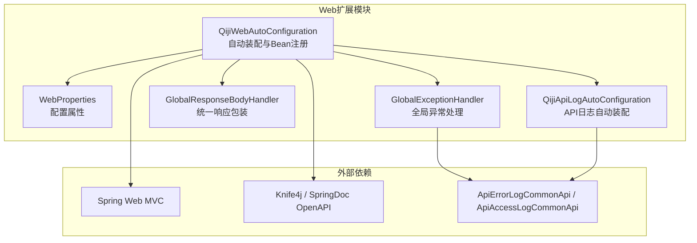
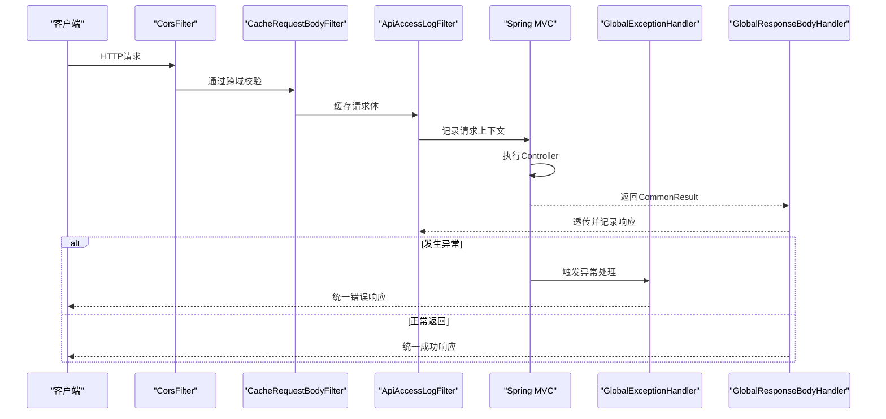
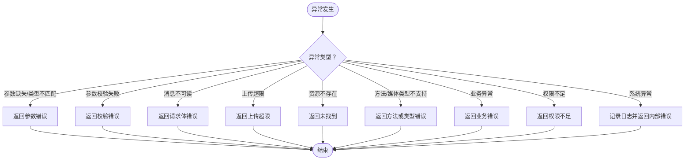
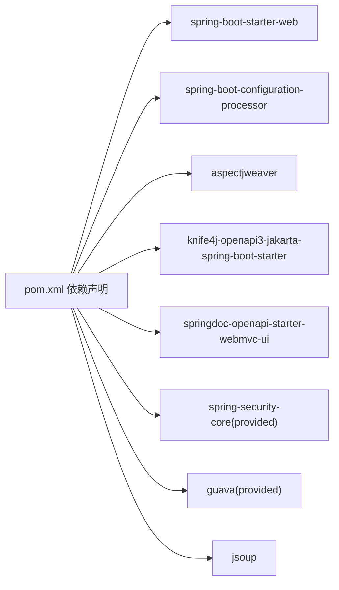

# Web扩展模块

<cite>
**本文引用的文件**
- [pom.xml](file://backend/qiji-framework/qiji-spring-boot-starter-web/pom.xml)
- [QijiWebAutoConfiguration.java](file://backend/qiji-framework/qiji-spring-boot-starter-web/src/main/java/com/qiji/cps/framework/web/config/QijiWebAutoConfiguration.java)
- [WebProperties.java](file://backend/qiji-framework/qiji-spring-boot-starter-web/src/main/java/com/qiji/cps/framework/web/config/WebProperties.java)
- [GlobalExceptionHandler.java](file://backend/qiji-framework/qiji-spring-boot-starter-web/src/main/java/com/qiji/cps/framework/web/core/handler/GlobalExceptionHandler.java)
- [GlobalResponseBodyHandler.java](file://backend/qiji-framework/qiji-spring-boot-starter-web/src/main/java/com/qiji/cps/framework/web/core/handler/GlobalResponseBodyHandler.java)
- [QijiApiLogAutoConfiguration.java](file://backend/qiji-framework/qiji-spring-boot-starter-web/src/main/java/com/qiji/cps/framework/apilog/config/QijiApiLogAutoConfiguration.java)
</cite>

## 目录
1. [简介](#简介)
2. [项目结构](#项目结构)
3. [核心组件](#核心组件)
4. [架构总览](#架构总览)
5. [详细组件分析](#详细组件分析)
6. [依赖关系分析](#依赖关系分析)
7. [性能考虑](#性能考虑)
8. [故障排查指南](#故障排查指南)
9. [结论](#结论)
10. [附录](#附录)

## 简介
本文件面向AgenticCPS项目的qiji-spring-boot-starter-web扩展模块，系统性阐述其作为Web基础设施的能力与配置机制。模块围绕Spring MVC自动装配、全局异常处理、跨域配置、参数校验、API访问日志、统一响应包装、以及与OpenAPI/Swagger生态的集成展开，帮助开发者快速理解并定制化扩展。

## 项目结构
该模块位于后端框架的qiji-framework下，作为独立starter提供Web相关能力的自动装配与默认配置。其关键特性包括：
- 基于Spring Boot Starter的自动装配
- Web层统一异常处理与错误日志上报
- 跨域过滤器与请求体缓存过滤器
- API访问日志的过滤器与拦截器
- 统一响应包装与返回值透传
- OpenAPI/Swagger集成支持

图表来源
- [QijiWebAutoConfiguration.java:35-156](file://backend/qiji-framework/qiji-spring-boot-starter-web/src/main/java/com/qiji/cps/framework/web/config/QijiWebAutoConfiguration.java#L35-L156)
- [WebProperties.java:14-67](file://backend/qiji-framework/qiji-spring-boot-starter-web/src/main/java/com/qiji/cps/framework/web/config/WebProperties.java#L14-L67)
- [GlobalExceptionHandler.java:50-454](file://backend/qiji-framework/qiji-spring-boot-starter-web/src/main/java/com/qiji/cps/framework/web/core/handler/GlobalExceptionHandler.java#L50-L454)
- [GlobalResponseBodyHandler.java:13-46](file://backend/qiji-framework/qiji-spring-boot-starter-web/src/main/java/com/qiji/cps/framework/web/core/handler/GlobalResponseBodyHandler.java#L13-L46)
- [QijiApiLogAutoConfiguration.java:18-45](file://backend/qiji-framework/qiji-spring-boot-starter-web/src/main/java/com/qiji/cps/framework/apilog/config/QijiApiLogAutoConfiguration.java#L18-L45)

章节来源
- [pom.xml:18-82](file://backend/qiji-framework/qiji-spring-boot-starter-web/pom.xml#L18-L82)

## 核心组件
- 自动装配与Bean注册：负责Web层的自动装配、请求映射前缀、跨域、请求体缓存、演示模式过滤器、RestTemplate构建等。
- 配置属性：定义API前缀、控制器包匹配规则、UI访问地址等。
- 全局异常处理：覆盖Spring MVC常见异常、业务异常、权限异常、文件大小限制、资源不存在、请求方法/媒体类型不支持等，并异步记录错误日志。
- 统一响应包装：仅对返回类型为统一结果类型的响应进行透传记录，便于日志统计。
- API访问日志：提供过滤器与拦截器两套方案，支持按开关启用，记录请求上下文与响应结果。

章节来源
- [QijiWebAutoConfiguration.java:35-156](file://backend/qiji-framework/qiji-spring-boot-starter-web/src/main/java/com/qiji/cps/framework/web/config/QijiWebAutoConfiguration.java#L35-L156)
- [WebProperties.java:14-67](file://backend/qiji-framework/qiji-spring-boot-starter-web/src/main/java/com/qiji/cps/framework/web/config/WebProperties.java#L14-L67)
- [GlobalExceptionHandler.java:50-454](file://backend/qiji-framework/qiji-spring-boot-starter-web/src/main/java/com/qiji/cps/framework/web/core/handler/GlobalExceptionHandler.java#L50-L454)
- [GlobalResponseBodyHandler.java:13-46](file://backend/qiji-framework/qiji-spring-boot-starter-web/src/main/java/com/qiji/cps/framework/web/core/handler/GlobalResponseBodyHandler.java#L13-L46)
- [QijiApiLogAutoConfiguration.java:18-45](file://backend/qiji-framework/qiji-spring-boot-starter-web/src/main/java/com/qiji/cps/framework/apilog/config/QijiApiLogAutoConfiguration.java#L18-L45)

## 架构总览
Web扩展模块通过自动装配类集中注册各类组件，形成“过滤器链 + 控制器增强 + 全局异常兜底”的整体架构。请求从进入过滤器链开始，经过跨域、请求体缓存、API日志等处理，再进入Spring MVC，最终由全局异常处理器与统一响应包装协同保证一致的错误与返回格式。

图表来源
- [QijiWebAutoConfiguration.java:106-136](file://backend/qiji-framework/qiji-spring-boot-starter-web/src/main/java/com/qiji/cps/framework/web/config/QijiWebAutoConfiguration.java#L106-L136)
- [GlobalExceptionHandler.java:78-119](file://backend/qiji-framework/qiji-spring-boot-starter-web/src/main/java/com/qiji/cps/framework/web/core/handler/GlobalExceptionHandler.java#L78-L119)
- [GlobalResponseBodyHandler.java:26-43](file://backend/qiji-framework/qiji-spring-boot-starter-web/src/main/java/com/qiji/cps/framework/web/core/handler/GlobalResponseBodyHandler.java#L26-L43)

## 详细组件分析

### Web自动装配与配置
- 请求映射前缀：基于配置属性动态为特定包下的@RestController添加统一前缀，避免Swagger/Actuator等意外暴露。
- 跨域配置：注册CorsFilter，允许任意来源、头与方法，适用于开发环境；生产环境建议收紧策略。
- 请求体缓存：注册CacheRequestBodyFilter，支持多次读取请求体，便于日志与安全校验。
- 演示模式：当开启演示开关时注册DemoFilter，用于演示环境的特殊处理。
- RestTemplate：基于RestTemplateBuilder构建实例，避免重复声明。

章节来源
- [QijiWebAutoConfiguration.java:46-81](file://backend/qiji-framework/qiji-spring-boot-starter-web/src/main/java/com/qiji/cps/framework/web/config/QijiWebAutoConfiguration.java#L46-L81)
- [QijiWebAutoConfiguration.java:106-136](file://backend/qiji-framework/qiji-spring-boot-starter-web/src/main/java/com/qiji/cps/framework/web/config/QijiWebAutoConfiguration.java#L106-L136)
- [WebProperties.java:19-25](file://backend/qiji-framework/qiji-spring-boot-starter-web/src/main/java/com/qiji/cps/framework/web/config/WebProperties.java#L19-L25)

### 配置属性（WebProperties）
- appApi/adminApi：分别定义APP与管理端API的前缀与控制器包匹配规则，默认前缀与包路径已内置。
- adminUi：管理端UI访问地址，便于日志与跳转。
- 校验约束：前缀与包路径均要求非空，确保前缀装配有效。

章节来源
- [WebProperties.java:14-67](file://backend/qiji-framework/qiji-spring-boot-starter-web/src/main/java/com/qiji/cps/framework/web/config/WebProperties.java#L14-L67)

### 全局异常处理（GlobalExceptionHandler）
- 覆盖范围：参数缺失、类型不匹配、参数校验失败、消息不可读、上传超限、资源不存在、方法/媒体类型不支持、业务异常、权限不足、系统异常等。
- 错误日志：捕获异常后异步记录到错误日志服务，包含用户信息、请求参数、堆栈信息等。
- 特殊处理：针对“表不存在”类异常，根据模块前缀返回对应提示，辅助功能模块启用指引。
- 兜底策略：未识别异常统一返回内部错误，确保对外一致的错误格式。

图表来源
- [GlobalExceptionHandler.java:126-340](file://backend/qiji-framework/qiji-spring-boot-starter-web/src/main/java/com/qiji/cps/framework/web/core/handler/GlobalExceptionHandler.java#L126-L340)

章节来源
- [GlobalExceptionHandler.java:50-454](file://backend/qiji-framework/qiji-spring-boot-starter-web/src/main/java/com/qiji/cps/framework/web/core/handler/GlobalExceptionHandler.java#L50-L454)

### 统一响应包装（GlobalResponseBodyHandler）
- 作用：仅对返回类型为统一结果类型的响应进行透传，同时将响应结果写入请求上下文，供API日志过滤器记录。
- 设计原则：避免改变Controller返回结构，通过AOP增强实现日志采集。

章节来源
- [GlobalResponseBodyHandler.java:13-46](file://backend/qiji-framework/qiji-spring-boot-starter-web/src/main/java/com/qiji/cps/framework/web/core/handler/GlobalResponseBodyHandler.java#L13-L46)

### API访问日志（QijiApiLogAutoConfiguration）
- 过滤器：注册ApiAccessLogFilter，按开关启用，记录请求上下文与响应结果。
- 拦截器：注册ApiAccessLogInterceptor，补充拦截器维度的日志采集。
- 依赖：与WebProperties、应用名、错误日志服务配合使用。

章节来源
- [QijiApiLogAutoConfiguration.java:18-45](file://backend/qiji-framework/qiji-spring-boot-starter-web/src/main/java/com/qiji/cps/framework/apilog/config/QijiApiLogAutoConfiguration.java#L18-L45)

## 依赖关系分析
模块依赖Spring Web、配置处理器、AOP织入、Knife4j/SpringDoc OpenAPI、Security核心等，形成Web层基础能力与文档生成能力的组合。

图表来源
- [pom.xml:18-82](file://backend/qiji-framework/qiji-spring-boot-starter-web/pom.xml#L18-L82)

章节来源
- [pom.xml:18-82](file://backend/qiji-framework/qiji-spring-boot-starter-web/pom.xml#L18-L82)

## 性能考虑
- 过滤器链顺序：跨域过滤器需保证在其他过滤器之前生效，避免跨域配置被后续过滤器覆盖。
- 请求体缓存：缓存请求体便于二次读取，但会增加内存占用，建议在必要场景启用。
- 异步日志：错误日志采用异步写入，降低异常处理对主线程的影响。
- OpenAPI文档：Knife4j与SpringDoc均为运行期增强，建议在开发环境启用，生产环境可通过开关关闭以减少开销。

## 故障排查指南
- 跨域不生效：确认CorsFilter的注册顺序与路径匹配规则，确保优先级高于其他过滤器。
- 参数校验异常：检查Controller参数注解与前端传参是否一致，关注MethodArgumentNotValidException与ConstraintViolationException的处理分支。
- 上传文件失败：核对MaxUploadSizeExceededException处理与全局配置，确认文件大小限制是否合理。
- 资源不存在：确认spring.mvc.throw-exception-if-no-handler-found与spring.mvc.static-path-pattern配置。
- 权限不足：检查Spring Security相关配置与@PreAuthorize注解使用。
- API日志未记录：确认QijiApiLogAutoConfiguration的开关与过滤器/拦截器注册是否生效。

章节来源
- [QijiWebAutoConfiguration.java:106-136](file://backend/qiji-framework/qiji-spring-boot-starter-web/src/main/java/com/qiji/cps/framework/web/config/QijiWebAutoConfiguration.java#L106-L136)
- [GlobalExceptionHandler.java:233-246](file://backend/qiji-framework/qiji-spring-boot-starter-web/src/main/java/com/qiji/cps/framework/web/core/handler/GlobalExceptionHandler.java#L233-L246)
- [QijiApiLogAutoConfiguration.java:24-42](file://backend/qiji-framework/qiji-spring-boot-starter-web/src/main/java/com/qiji/cps/framework/apilog/config/QijiApiLogAutoConfiguration.java#L24-L42)

## 结论
qiji-spring-boot-starter-web模块通过自动装配与统一配置，为AgenticCPS提供了开箱即用的Web基础设施：统一的异常处理、跨域支持、请求体缓存、API日志、统一响应包装与OpenAPI集成。开发者可在不侵入业务代码的前提下，快速启用这些能力，并通过配置属性与开关灵活定制。

## 附录

### 配置示例与使用场景
- 启用演示模式：通过开关启用DemoFilter，适用于演示环境的特殊处理。
- 自定义API前缀：在配置中修改appApi/adminApi的prefix与controller匹配规则，实现多租户或多入口的路由隔离。
- 跨域策略：根据部署环境调整CorsFilter的allowCredentials、allowedOriginPattern、allowedHeader与allowedMethod。
- API文档：模块同时引入Knife4j与SpringDoc，可在开发环境查看交互式文档；生产环境可通过开关关闭以减少开销。
- 自定义Web组件扩展：通过实现WebMvcConfigurer或注册FilterRegistrationBean等方式扩展拦截器、过滤器与监听器，注意与现有过滤器顺序协调。

章节来源
- [QijiWebAutoConfiguration.java:132-136](file://backend/qiji-framework/qiji-spring-boot-starter-web/src/main/java/com/qiji/cps/framework/web/config/QijiWebAutoConfiguration.java#L132-L136)
- [WebProperties.java:19-25](file://backend/qiji-framework/qiji-spring-boot-starter-web/src/main/java/com/qiji/cps/framework/web/config/WebProperties.java#L19-L25)
- [pom.xml:42-48](file://backend/qiji-framework/qiji-spring-boot-starter-web/pom.xml#L42-L48)