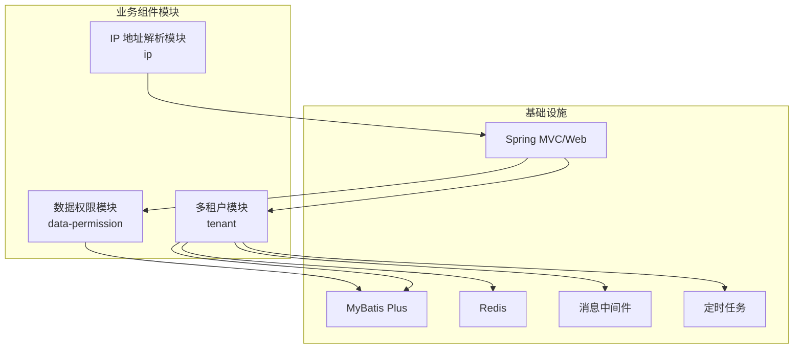
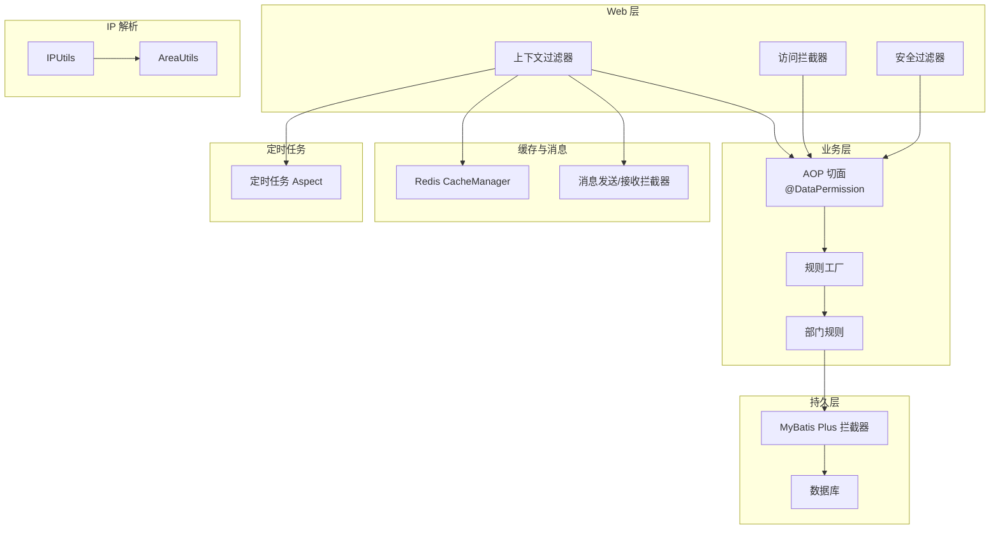
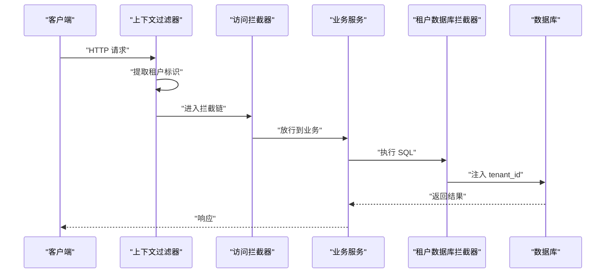
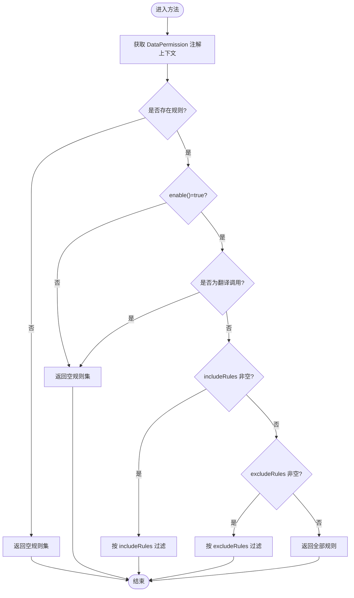
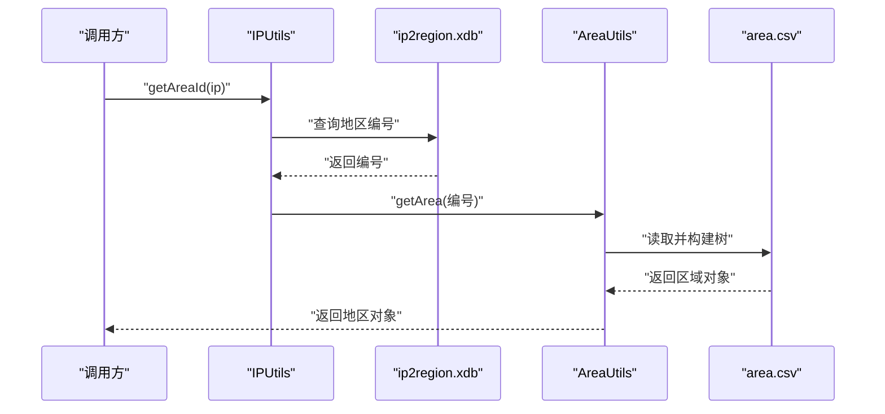
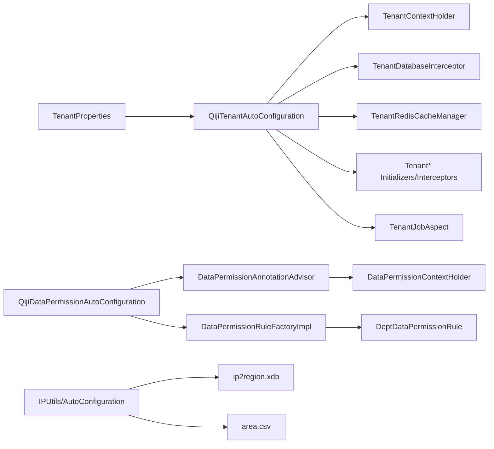

# 业务组件模块

<cite>
**本文引用的文件**
- [QijiTenantAutoConfiguration.java](file://backend/qiji-framework/qiji-spring-boot-starter-biz-tenant/src/main/java/com/qiji/cps/framework/tenant/config/QijiTenantAutoConfiguration.java)
- [TenantProperties.java](file://backend/qiji-framework/qiji-spring-boot-starter-biz-tenant/src/main/java/com/qiji/cps/framework/tenant/config/TenantProperties.java)
- [TenantContextHolder.java](file://backend/qiji-framework/qiji-spring-boot-starter-biz-tenant/src/main/java/com/qiji/cps/framework/tenant/core/context/TenantContextHolder.java)
- [TenantDatabaseInterceptor.java](file://backend/qiji-framework/qiji-spring-boot-starter-biz-tenant/src/main/java/com/qiji/cps/framework/tenant/core/db/TenantDatabaseInterceptor.java)
- [QijiDataPermissionAutoConfiguration.java](file://backend/qiji-framework/qiji-spring-boot-starter-biz-data-permission/src/main/java/com/qiji/cps/framework/datapermission/config/QijiDataPermissionAutoConfiguration.java)
- [DataPermission.java](file://backend/qiji-framework/qiji-spring-boot-starter-biz-data-permission/src/main/java/com/qiji/cps/framework/datapermission/core/annotation/DataPermission.java)
- [DataPermissionAnnotationAdvisor.java](file://backend/qiji-framework/qiji-spring-boot-starter-biz-data-permission/src/main/java/com/qiji/cps/framework/datapermission/core/aop/DataPermissionAnnotationAdvisor.java)
- [DataPermissionContextHolder.java](file://backend/qiji-framework/qiji-spring-boot-starter-biz-data-permission/src/main/java/com/qiji/cps/framework/datapermission/core/aop/DataPermissionContextHolder.java)
- [DataPermissionRuleFactoryImpl.java](file://backend/qiji-framework/qiji-spring-boot-starter-biz-data-permission/src/main/java/com/qiji/cps/framework/datapermission/core/rule/DataPermissionRuleFactoryImpl.java)
- [DeptDataPermissionRule.java](file://backend/qiji-framework/qiji-spring-boot-starter-biz-data-permission/src/main/java/com/qiji/cps/framework/datapermission/core/rule/dept/DeptDataPermissionRule.java)
- [IPUtils.java](file://backend/qiji-framework/qiji-spring-boot-starter-biz-ip/src/main/java/com/qiji/cps/framework/ip/core/utils/IPUtils.java)
- [AreaUtils.java](file://backend/qiji-framework/qiji-spring-boot-starter-biz-ip/src/main/java/com/qiji/cps/framework/ip/core/utils/AreaUtils.java)
</cite>

## 目录
1. [引言](#引言)
2. [项目结构](#项目结构)
3. [核心组件](#核心组件)
4. [架构总览](#架构总览)
5. [详细组件分析](#详细组件分析)
6. [依赖分析](#依赖分析)
7. [性能考虑](#性能考虑)
8. [故障排查指南](#故障排查指南)
9. [结论](#结论)
10. [附录](#附录)

## 引言
本文件面向 AgenticCPS 项目的 qiji-spring-boot-starter-biz 业务组件模块，聚焦三大能力：多租户、数据权限、IP 地址解析与地理位置查询。文档将从架构设计、组件职责、数据流与处理逻辑、配置机制、错误处理与性能优化等方面进行系统性阐述，并提供最佳实践与扩展建议，帮助开发者快速理解并正确使用这些业务组件。

## 项目结构
业务组件模块位于后端框架层，分别提供多租户、数据权限、IP 解析三个独立的 starter 模块。它们通过 Spring Boot 自动装配机制按需启用，彼此之间保持低耦合，同时在 Web、数据库、缓存、消息队列、定时任务等横切面协同工作。

图示来源
- [QijiTenantAutoConfiguration.java:51-199](file://backend/qiji-framework/qiji-spring-boot-starter-biz-tenant/src/main/java/com/qiji/cps/framework/tenant/config/QijiTenantAutoConfiguration.java#L51-L199)
- [QijiDataPermissionAutoConfiguration.java](file://backend/qiji-framework/qiji-spring-boot-starter-biz-data-permission/src/main/java/com/qiji/cps/framework/datapermission/config/QijiDataPermissionAutoConfiguration.java)
- [IPUtils.java:17-86](file://backend/qiji-framework/qiji-spring-boot-starter-biz-ip/src/main/java/com/qiji/cps/framework/ip/core/utils/IPUtils.java#L17-L86)

章节来源
- [QijiTenantAutoConfiguration.java:51-199](file://backend/qiji-framework/qiji-spring-boot-starter-biz-tenant/src/main/java/com/qiji/cps/framework/tenant/config/QijiTenantAutoConfiguration.java#L51-L199)
- [QijiDataPermissionAutoConfiguration.java](file://backend/qiji-framework/qiji-spring-boot-starter-biz-data-permission/src/main/java/com/qiji/cps/framework/datapermission/config/QijiDataPermissionAutoConfiguration.java)
- [IPUtils.java:17-86](file://backend/qiji-framework/qiji-spring-boot-starter-biz-ip/src/main/java/com/qiji/cps/framework/ip/core/utils/IPUtils.java#L17-L86)

## 核心组件
- 多租户组件
  - 自动装配与配置：通过条件化装配启用，支持禁用开关、忽略 URL/表/缓存等配置项。
  - Web 层：上下文过滤器与访问拦截器负责提取/传递租户标识，支持忽略跨租户访问。
  - 数据库层：基于 MyBatis Plus 的租户行级拦截器，自动注入 tenant_id。
  - 缓存与消息：Redis CacheManager 与多种 MQ 发送/接收拦截器均支持按租户隔离。
  - 作业：定时任务 Aspect 支持按租户执行。
- 数据权限组件
  - 注解驱动：@DataPermission 支持在类或方法级别启用/禁用及规则选择。
  - AOP 切面：Advisor/Interceptor 负责在方法执行前后维护上下文并应用规则。
  - 规则工厂：根据注解与上下文动态筛选生效规则，支持翻译场景的特殊处理。
  - 部门规则：DeptDataPermissionRule 基于部门集合与“仅本人”策略生成 SQL 条件。
- IP 地址解析与地理信息
  - IP 查询：内置 ip2region.xdb，启动时加载到内存，提供 IP 到地区编号与对象的查询。
  - 地区解析：area.csv 加载为内存树，支持父子关系构建、路径格式化、按类型筛选等。

章节来源
- [TenantProperties.java:15-58](file://backend/qiji-framework/qiji-spring-boot-starter-biz-tenant/src/main/java/com/qiji/cps/framework/tenant/config/TenantProperties.java#L15-L58)
- [TenantContextHolder.java:11-69](file://backend/qiji-framework/qiji-spring-boot-starter-biz-tenant/src/main/java/com/qiji/cps/framework/tenant/core/context/TenantContextHolder.java#L11-L69)
- [TenantDatabaseInterceptor.java:21-84](file://backend/qiji-framework/qiji-spring-boot-starter-biz-tenant/src/main/java/com/qiji/cps/framework/tenant/core/db/TenantDatabaseInterceptor.java#L21-L84)
- [DataPermission.java:7-36](file://backend/qiji-framework/qiji-spring-boot-starter-biz-data-permission/src/main/java/com/qiji/cps/framework/datapermission/core/annotation/DataPermission.java#L7-L36)
- [DataPermissionAnnotationAdvisor.java:12-37](file://backend/qiji-framework/qiji-spring-boot-starter-biz-data-permission/src/main/java/com/qiji/cps/framework/datapermission/core/aop/DataPermissionAnnotationAdvisor.java#L12-L37)
- [DataPermissionContextHolder.java:14-73](file://backend/qiji-framework/qiji-spring-boot-starter-biz-data-permission/src/main/java/com/qiji/cps/framework/datapermission/core/aop/DataPermissionContextHolder.java#L14-L73)
- [DataPermissionRuleFactoryImpl.java:20-85](file://backend/qiji-framework/qiji-spring-boot-starter-biz-data-permission/src/main/java/com/qiji/cps/framework/datapermission/core/rule/DataPermissionRuleFactoryImpl.java#L20-L85)
- [DeptDataPermissionRule.java:33-208](file://backend/qiji-framework/qiji-spring-boot-starter-biz-data-permission/src/main/java/com/qiji/cps/framework/datapermission/core/rule/dept/DeptDataPermissionRule.java#L33-L208)
- [IPUtils.java:17-86](file://backend/qiji-framework/qiji-spring-boot-starter-biz-ip/src/main/java/com/qiji/cps/framework/ip/core/utils/IPUtils.java#L17-L86)
- [AreaUtils.java:28-218](file://backend/qiji-framework/qiji-spring-boot-starter-biz-ip/src/main/java/com/qiji/cps/framework/ip/core/utils/AreaUtils.java#L28-L218)

## 架构总览
多租户与数据权限在 Web、DB、缓存、消息、定时任务等多个层面协同，形成统一的租户隔离与数据权限控制闭环；IP 解析作为独立工具服务于日志、风控、运营统计等场景。

图示来源
- [QijiTenantAutoConfiguration.java:84-199](file://backend/qiji-framework/qiji-spring-boot-starter-biz-tenant/src/main/java/com/qiji/cps/framework/tenant/config/QijiTenantAutoConfiguration.java#L84-L199)
- [QijiDataPermissionAutoConfiguration.java](file://backend/qiji-framework/qiji-spring-boot-starter-biz-data-permission/src/main/java/com/qiji/cps/framework/datapermission/config/QijiDataPermissionAutoConfiguration.java)
- [IPUtils.java:17-86](file://backend/qiji-framework/qiji-spring-boot-starter-biz-ip/src/main/java/com/qiji/cps/framework/ip/core/utils/IPUtils.java#L17-L86)

## 详细组件分析

### 多租户组件分析
- 配置与自动装配
  - 通过条件属性 qiji.tenant.enable 控制是否启用，默认启用。
  - 支持忽略 URL、忽略访问 URL、忽略表、忽略缓存等配置，便于对回调、公共接口、共享表等场景放行。
- Web 层
  - 上下文过滤器负责从请求中提取租户标识并写入线程上下文，确保后续 DB/缓存/消息等组件可用。
  - 访问拦截器支持忽略跨租户访问，避免越权读取他人租户数据。
  - 安全过滤器结合忽略 URL 列表，保障回调/开放接口的安全边界。
- 数据库层
  - 基于 MyBatis Plus 的租户行级拦截器，自动在 SQL 中注入 tenant_id。
  - 表忽略策略：对非项目内表、继承特定基类、或标注忽略注解的表进行放行。
- 缓存与消息
  - Redis CacheManager 支持按租户隔离缓存键空间。
  - 多种 MQ 的初始化与拦截器确保消息发送/消费时携带租户上下文。
- 定时任务
  - 通过 Aspect 在任务执行前设置租户上下文，保证任务在正确租户上下文中运行。

图示来源
- [QijiTenantAutoConfiguration.java:84-111](file://backend/qiji-framework/qiji-spring-boot-starter-biz-tenant/src/main/java/com/qiji/cps/framework/tenant/config/QijiTenantAutoConfiguration.java#L84-L111)
- [TenantDatabaseInterceptor.java:40-84](file://backend/qiji-framework/qiji-spring-boot-starter-biz-tenant/src/main/java/com/qiji/cps/framework/tenant/core/db/TenantDatabaseInterceptor.java#L40-L84)
- [TenantContextHolder.java:28-44](file://backend/qiji-framework/qiji-spring-boot-starter-biz-tenant/src/main/java/com/qiji/cps/framework/tenant/core/context/TenantContextHolder.java#L28-L44)

章节来源
- [TenantProperties.java:15-58](file://backend/qiji-framework/qiji-spring-boot-starter-biz-tenant/src/main/java/com/qiji/cps/framework/tenant/config/TenantProperties.java#L15-L58)
- [QijiTenantAutoConfiguration.java:51-199](file://backend/qiji-framework/qiji-spring-boot-starter-biz-tenant/src/main/java/com/qiji/cps/framework/tenant/config/QijiTenantAutoConfiguration.java#L51-L199)
- [TenantDatabaseInterceptor.java:21-84](file://backend/qiji-framework/qiji-spring-boot-starter-biz-tenant/src/main/java/com/qiji/cps/framework/tenant/core/db/TenantDatabaseInterceptor.java#L21-L84)
- [TenantContextHolder.java:11-69](file://backend/qiji-framework/qiji-spring-boot-starter-biz-tenant/src/main/java/com/qiji/cps/framework/tenant/core/context/TenantContextHolder.java#L11-L69)

### 数据权限组件分析
- 注解与 AOP
  - @DataPermission 支持在类/方法上启用/禁用，并可选择/include/exclude 规则。
  - Advisor/Interceptor 维护注解上下文栈，确保嵌套调用时规则正确生效。
- 规则工厂
  - 根据注解与上下文动态选择规则集合，支持翻译场景的强制忽略，避免数据泄露。
- 部门规则
  - 基于登录用户的角色类型、部门集合、以及“仅本人”策略生成 SQL 条件表达式。
  - 支持按表自定义 dept_id/user_id 字段名，灵活适配不同表结构。
  - 当无有效条件时返回恒假表达式，确保零数据返回。

图示来源
- [DataPermissionRuleFactoryImpl.java:28-65](file://backend/qiji-framework/qiji-spring-boot-starter-biz-data-permission/src/main/java/com/qiji/cps/framework/datapermission/core/rule/DataPermissionRuleFactoryImpl.java#L28-L65)
- [DataPermission.java:16-36](file://backend/qiji-framework/qiji-spring-boot-starter-biz-data-permission/src/main/java/com/qiji/cps/framework/datapermission/core/annotation/DataPermission.java#L16-L36)

章节来源
- [DataPermission.java:7-36](file://backend/qiji-framework/qiji-spring-boot-starter-biz-data-permission/src/main/java/com/qiji/cps/framework/datapermission/core/annotation/DataPermission.java#L7-L36)
- [DataPermissionAnnotationAdvisor.java:12-37](file://backend/qiji-framework/qiji-spring-boot-starter-biz-data-permission/src/main/java/com/qiji/cps/framework/datapermission/core/aop/DataPermissionAnnotationAdvisor.java#L12-L37)
- [DataPermissionContextHolder.java:14-73](file://backend/qiji-framework/qiji-spring-boot-starter-biz-data-permission/src/main/java/com/qiji/cps/framework/datapermission/core/aop/DataPermissionContextHolder.java#L14-L73)
- [DataPermissionRuleFactoryImpl.java:20-85](file://backend/qiji-framework/qiji-spring-boot-starter-biz-data-permission/src/main/java/com/qiji/cps/framework/datapermission/core/rule/DataPermissionRuleFactoryImpl.java#L20-L85)
- [DeptDataPermissionRule.java:33-208](file://backend/qiji-framework/qiji-spring-boot-starter-biz-data-permission/src/main/java/com/qiji/cps/framework/datapermission/core/rule/dept/DeptDataPermissionRule.java#L33-L208)

### IP 地址解析与地理信息分析
- IP 查询
  - 启动时从资源加载 ip2region.xdb 到内存，提供字符串与长整型 IP 的查询接口。
  - 返回地区编号或地区对象，支持按时间戳格式的 IP 输入。
- 地区解析
  - 启动时从 area.csv 构建内存树，建立父子关系，支持路径格式化、按类型筛选、按类型向上查找父级区域等。
  - 提供区域路径解析、全路径名称列表生成等工具方法。

图示来源
- [IPUtils.java:33-84](file://backend/qiji-framework/qiji-spring-boot-starter-biz-ip/src/main/java/com/qiji/cps/framework/ip/core/utils/IPUtils.java#L33-L84)
- [AreaUtils.java:44-69](file://backend/qiji-framework/qiji-spring-boot-starter-biz-ip/src/main/java/com/qiji/cps/framework/ip/core/utils/AreaUtils.java#L44-L69)

章节来源
- [IPUtils.java:17-86](file://backend/qiji-framework/qiji-spring-boot-starter-biz-ip/src/main/java/com/qiji/cps/framework/ip/core/utils/IPUtils.java#L17-L86)
- [AreaUtils.java:28-218](file://backend/qiji-framework/qiji-spring-boot-starter-biz-ip/src/main/java/com/qiji/cps/framework/ip/core/utils/AreaUtils.java#L28-L218)

## 依赖分析
- 多租户
  - 依赖 Web 过滤器/拦截器、MyBatis Plus 拦截器、Redis CacheManager、多种 MQ 初始化与拦截器、定时任务 Aspect。
  - 通过 TenantProperties 控制行为，TenantContextHolder 传递租户标识。
- 数据权限
  - 依赖 AOP 切面、规则工厂、具体规则实现（如部门规则）、SQL 表达式构建工具。
  - 通过 DataPermission 注解与 DataPermissionContextHolder 控制规则生效范围。
- IP 解析
  - 依赖 ip2region.xdb 与 area.csv 资源文件，启动时一次性加载到内存，避免频繁 IO。

图示来源
- [QijiTenantAutoConfiguration.java:51-199](file://backend/qiji-framework/qiji-spring-boot-starter-biz-tenant/src/main/java/com/qiji/cps/framework/tenant/config/QijiTenantAutoConfiguration.java#L51-L199)
- [TenantProperties.java:15-58](file://backend/qiji-framework/qiji-spring-boot-starter-biz-tenant/src/main/java/com/qiji/cps/framework/tenant/config/TenantProperties.java#L15-L58)
- [QijiDataPermissionAutoConfiguration.java](file://backend/qiji-framework/qiji-spring-boot-starter-biz-data-permission/src/main/java/com/qiji/cps/framework/datapermission/config/QijiDataPermissionAutoConfiguration.java)
- [DataPermissionRuleFactoryImpl.java:20-85](file://backend/qiji-framework/qiji-spring-boot-starter-biz-data-permission/src/main/java/com/qiji/cps/framework/datapermission/core/rule/DataPermissionRuleFactoryImpl.java#L20-L85)
- [DeptDataPermissionRule.java:33-208](file://backend/qiji-framework/qiji-spring-boot-starter-biz-data-permission/src/main/java/com/qiji/cps/framework/datapermission/core/rule/dept/DeptDataPermissionRule.java#L33-L208)
- [IPUtils.java:17-86](file://backend/qiji-framework/qiji-spring-boot-starter-biz-ip/src/main/java/com/qiji/cps/framework/ip/core/utils/IPUtils.java#L17-L86)
- [AreaUtils.java:28-218](file://backend/qiji-framework/qiji-spring-boot-starter-biz-ip/src/main/java/com/qiji/cps/framework/ip/core/utils/AreaUtils.java#L28-L218)

章节来源
- [QijiTenantAutoConfiguration.java:51-199](file://backend/qiji-framework/qiji-spring-boot-starter-biz-tenant/src/main/java/com/qiji/cps/framework/tenant/config/QijiTenantAutoConfiguration.java#L51-L199)
- [QijiDataPermissionAutoConfiguration.java](file://backend/qiji-framework/qiji-spring-boot-starter-biz-data-permission/src/main/java/com/qiji/cps/framework/datapermission/config/QijiDataPermissionAutoConfiguration.java)
- [IPUtils.java:17-86](file://backend/qiji-framework/qiji-spring-boot-starter-biz-ip/src/main/java/com/qiji/cps/framework/ip/core/utils/IPUtils.java#L17-L86)

## 性能考虑
- 多租户
  - DB 拦截器优先级需置于分页插件之前，避免额外扫描成本。
  - 缓存隔离与 MQ 拦截器采用批量扫描策略，减少 Redis 扫描开销。
- 数据权限
  - 部门规则在登录用户上下文中缓存数据权限 DTO，避免重复拉取。
  - 规则工厂在翻译场景强制忽略，减少不必要的规则计算。
- IP 解析
  - ip2region.xdb 与 area.csv 在启动阶段一次性加载到内存，查询为纯内存操作，延迟极低。

章节来源
- [QijiTenantAutoConfiguration.java:73-81](file://backend/qiji-framework/qiji-spring-boot-starter-biz-tenant/src/main/java/com/qiji/cps/framework/tenant/config/QijiTenantAutoConfiguration.java#L73-L81)
- [DataPermissionRuleFactoryImpl.java:48-51](file://backend/qiji-framework/qiji-spring-boot-starter-biz-data-permission/src/main/java/com/qiji/cps/framework/datapermission/core/rule/DataPermissionRuleFactoryImpl.java#L48-L51)
- [DeptDataPermissionRule.java:103-114](file://backend/qiji-framework/qiji-spring-boot-starter-biz-data-permission/src/main/java/com/qiji/cps/framework/datapermission/core/rule/dept/DeptDataPermissionRule.java#L103-L114)
- [IPUtils.java:26-42](file://backend/qiji-framework/qiji-spring-boot-starter-biz-ip/src/main/java/com/qiji/cps/framework/ip/core/utils/IPUtils.java#L26-L42)
- [AreaUtils.java:44-69](file://backend/qiji-framework/qiji-spring-boot-starter-biz-ip/src/main/java/com/qiji/cps/framework/ip/core/utils/AreaUtils.java#L44-L69)

## 故障排查指南
- 多租户
  - 现象：请求无租户标识导致异常。
  - 排查：确认请求头是否包含租户标识；检查忽略 URL 配置；核对上下文过滤器顺序。
  - 参考：租户上下文持有者在无租户 ID 时抛出明确异常提示。
- 数据权限
  - 现象：规则未生效或权限过大/过小。
  - 排查：确认 @DataPermission 注解位置与 enable/include/exclude 设置；检查规则工厂是否被翻译场景忽略；核对部门规则的表字段映射。
- IP 解析
  - 现象：IP 查询异常或返回 null。
  - 排查：确认 ip2region.xdb 与 area.csv 资源是否存在；检查 IP 格式是否符合要求；验证地区编号是否在内存树中存在。

章节来源
- [TenantContextHolder.java:37-44](file://backend/qiji-framework/qiji-spring-boot-starter-biz-tenant/src/main/java/com/qiji/cps/framework/tenant/core/context/TenantContextHolder.java#L37-L44)
- [DataPermissionRuleFactoryImpl.java:74-82](file://backend/qiji-framework/qiji-spring-boot-starter-biz-data-permission/src/main/java/com/qiji/cps/framework/datapermission/core/rule/DataPermissionRuleFactoryImpl.java#L74-L82)
- [DeptDataPermissionRule.java:108-114](file://backend/qiji-framework/qiji-spring-boot-starter-biz-data-permission/src/main/java/com/qiji/cps/framework/datapermission/core/rule/dept/DeptDataPermissionRule.java#L108-L114)
- [IPUtils.java:39-42](file://backend/qiji-framework/qiji-spring-boot-starter-biz-ip/src/main/java/com/qiji/cps/framework/ip/core/utils/IPUtils.java#L39-L42)

## 结论
qiji-spring-boot-starter-biz 业务组件模块以“注解 + AOP + 自动装配”的方式，提供了稳定可靠的多租户与数据权限能力，并通过 IP 解析工具满足运营与风控场景需求。其设计强调可配置、可扩展与高性能，适合在复杂业务系统中落地实施。

## 附录
- 最佳实践
  - 多租户
    - 明确区分“忽略 URL/表/缓存”，避免误放行导致数据泄露。
    - 在回调/开放接口处使用 @TenantIgnore 或配置 ignoreUrls。
    - 对共享表/公共数据保留 ignoreTables/ignoreCaches。
  - 数据权限
    - 在聚合查询或批量操作处谨慎使用 @DataPermission，必要时通过 includeRules 精准限定。
    - 部门规则需确保表中存在 dept_id/user_id 字段映射，避免条件为空。
    - 翻译场景尽量避免触发数据权限规则，保持查询性能。
  - IP 解析
    - 将 IP 查询封装为服务方法，避免直接暴露底层实现细节。
    - 对外部输入进行严格校验，防止非法 IP 导致异常。
- 扩展建议
  - 多租户：新增 MQ/缓存隔离策略时，遵循现有拦截器/管理器模式，确保租户上下文透传。
  - 数据权限：新增规则时，实现 DataPermissionRule 接口并注册到规则工厂，注意与翻译场景的兼容。
  - IP 解析：若需支持更丰富的地理信息，可在 Area 对象基础上扩展字段，并更新 area.csv 结构。