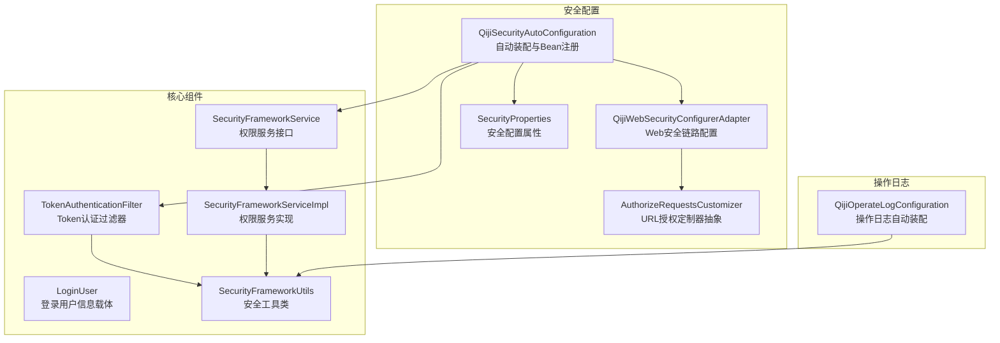
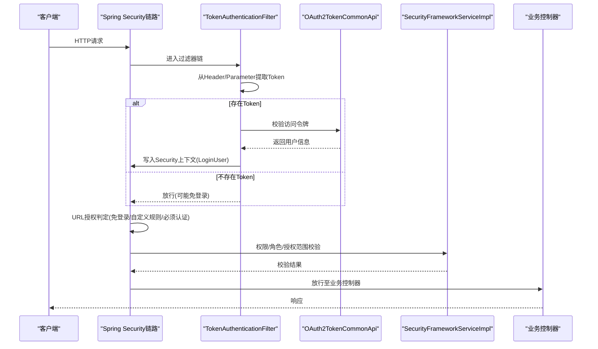
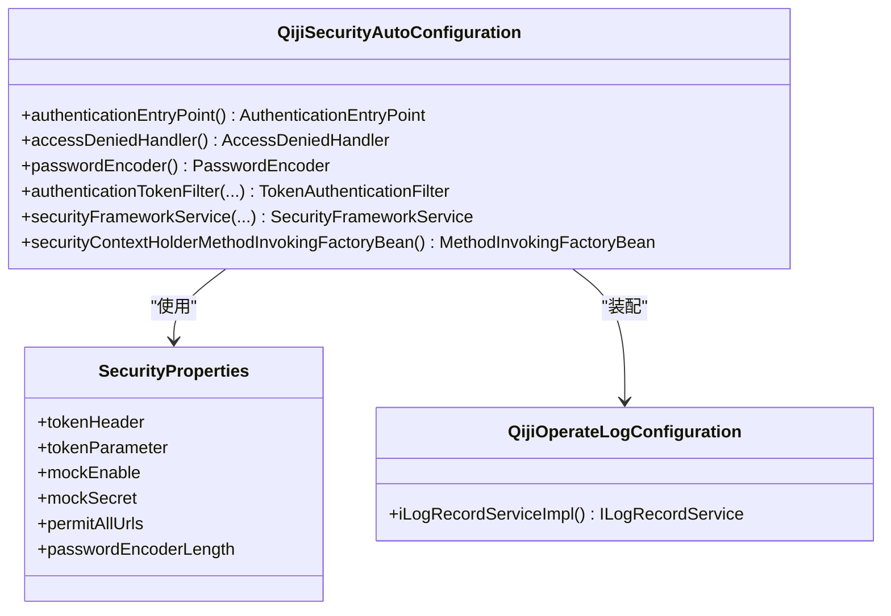
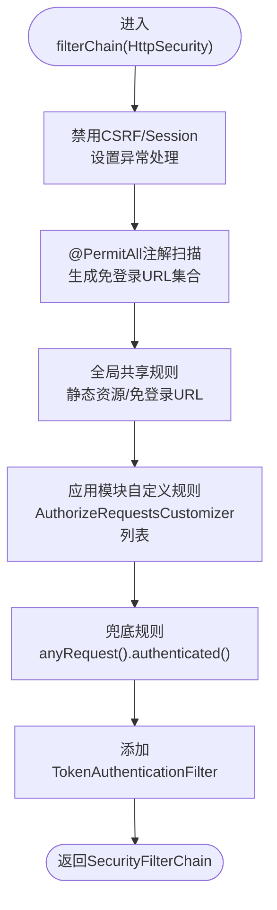
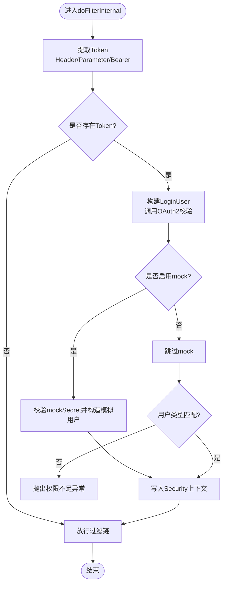
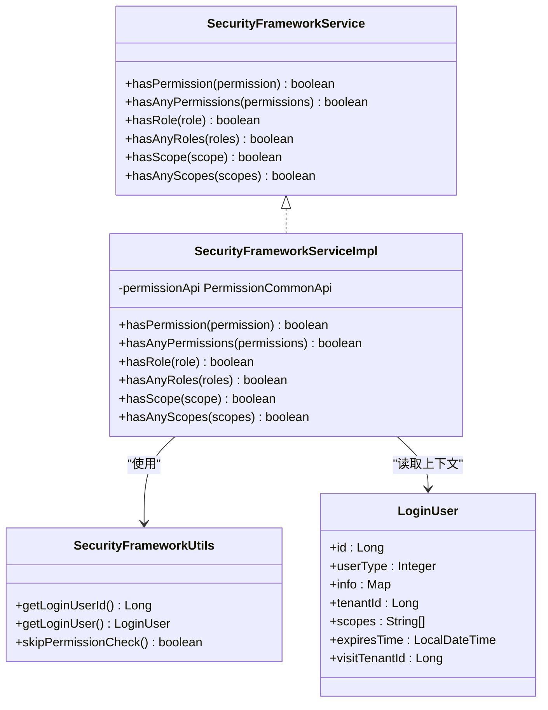
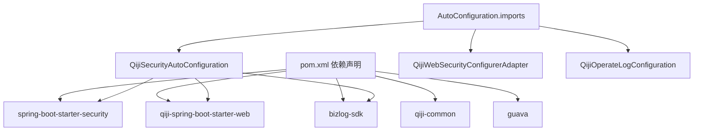

# 安全扩展模块

<cite>
**本文引用的文件**
- [QijiSecurityAutoConfiguration.java](file://backend/qiji-framework/qiji-spring-boot-starter-security/src/main/java/com/qiji/cps/framework/security/config/QijiSecurityAutoConfiguration.java)
- [QijiWebSecurityConfigurerAdapter.java](file://backend/qiji-framework/qiji-spring-boot-starter-security/src/main/java/com/qiji/cps/framework/security/config/QijiWebSecurityConfigurerAdapter.java)
- [AuthorizeRequestsCustomizer.java](file://backend/qiji-framework/qiji-spring-boot-starter-security/src/main/java/com/qiji/cps/framework/security/config/AuthorizeRequestsCustomizer.java)
- [SecurityProperties.java](file://backend/qiji-framework/qiji-spring-boot-starter-security/src/main/java/com/qiji/cps/framework/security/config/SecurityProperties.java)
- [TokenAuthenticationFilter.java](file://backend/qiji-framework/qiji-spring-boot-starter-security/src/main/java/com/qiji/cps/framework/security/core/filter/TokenAuthenticationFilter.java)
- [SecurityFrameworkService.java](file://backend/qiji-framework/qiji-spring-boot-starter-security/src/main/java/com/qiji/cps/framework/security/core/service/SecurityFrameworkService.java)
- [SecurityFrameworkServiceImpl.java](file://backend/qiji-framework/qiji-spring-boot-starter-security/src/main/java/com/qiji/cps/framework/security/core/service/SecurityFrameworkServiceImpl.java)
- [LoginUser.java](file://backend/qiji-framework/qiji-spring-boot-starter-security/src/main/java/com/qiji/cps/framework/security/core/LoginUser.java)
- [SecurityFrameworkUtils.java](file://backend/qiji-framework/qiji-spring-boot-starter-security/src/main/java/com/qiji/cps/framework/security/core/util/SecurityFrameworkUtils.java)
- [AuthenticationEntryPointImpl.java](file://backend/qiji-framework/qiji-spring-boot-starter-security/src/main/java/com/qiji/cps/framework/security/core/handler/AuthenticationEntryPointImpl.java)
- [QijiOperateLogConfiguration.java](file://backend/qiji-framework/qiji-spring-boot-starter-security/src/main/java/com/qiji/cps/framework/operatelog/config/QijiOperateLogConfiguration.java)
- [org.springframework.boot.autoconfigure.AutoConfiguration.imports](file://backend/qiji-framework/qiji-spring-boot-starter-security/src/main/resources/META-INF/spring/org.springframework.boot.autoconfigure.AutoConfiguration.imports)
- [pom.xml](file://backend/qiji-framework/qiji-spring-boot-starter-security/pom.xml)
</cite>

## 目录
1. [简介](#简介)
2. [项目结构](#项目结构)
3. [核心组件](#核心组件)
4. [架构总览](#架构总览)
5. [详细组件分析](#详细组件分析)
6. [依赖关系分析](#依赖关系分析)
7. [性能考量](#性能考量)
8. [故障排查指南](#故障排查指南)
9. [结论](#结论)
10. [附录](#附录)

## 简介
本文件面向 AgenticCPS 项目的 qiji-spring-boot-starter-security 安全扩展模块，系统性阐述 Spring Security 的安全配置与扩展机制，覆盖认证与授权实现、操作日志记录、自动装配流程、自定义安全过滤器开发、RBAC 权限模型与注解使用、动态权限配置、与业务系统的集成方式以及安全最佳实践（密码加密、会话管理、安全审计）。文档以代码为依据，提供分层讲解与可视化图示，帮助读者快速理解并正确使用该模块。

## 项目结构
该模块位于 backend/qiji-framework/qiji-spring-boot-starter-security，采用按功能域分层的组织方式：
- security.config：自动装配与 Web 安全配置、URL 授权定制器、安全属性
- security.core：认证主体 LoginUser、安全工具类、自定义过滤器、权限服务接口与实现
- operatelog.config：操作日志自动装配与实现
- resources/META-INF/spring：Spring Boot 自动装配导入清单

图表来源
- [QijiSecurityAutoConfiguration.java:32-94](file://backend/qiji-framework/qiji-spring-boot-starter-security/src/main/java/com/qiji/cps/framework/security/config/QijiSecurityAutoConfiguration.java#L32-L94)
- [QijiWebSecurityConfigurerAdapter.java:46-221](file://backend/qiji-framework/qiji-spring-boot-starter-security/src/main/java/com/qiji/cps/framework/security/config/QijiWebSecurityConfigurerAdapter.java#L46-L221)
- [AuthorizeRequestsCustomizer.java:16-35](file://backend/qiji-framework/qiji-spring-boot-starter-security/src/main/java/com/qiji/cps/framework/security/config/AuthorizeRequestsCustomizer.java#L16-L35)
- [SecurityProperties.java:12-51](file://backend/qiji-framework/qiji-spring-boot-starter-security/src/main/java/com/qiji/cps/framework/security/config/SecurityProperties.java#L12-L51)
- [TokenAuthenticationFilter.java:31-119](file://backend/qiji-framework/qiji-spring-boot-starter-security/src/main/java/com/qiji/cps/framework/security/core/filter/TokenAuthenticationFilter.java#L31-L119)
- [SecurityFrameworkService.java:8-59](file://backend/qiji-framework/qiji-spring-boot-starter-security/src/main/java/com/qiji/cps/framework/security/core/service/SecurityFrameworkService.java#L8-L59)
- [SecurityFrameworkServiceImpl.java:19-84](file://backend/qiji-framework/qiji-spring-boot-starter-security/src/main/java/com/qiji/cps/framework/security/core/service/SecurityFrameworkServiceImpl.java#L19-L84)
- [LoginUser.java:18-75](file://backend/qiji-framework/qiji-spring-boot-starter-security/src/main/java/com/qiji/cps/framework/security/core/LoginUser.java#L18-L75)
- [SecurityFrameworkUtils.java:24-160](file://backend/qiji-framework/qiji-spring-boot-starter-security/src/main/java/com/qiji/cps/framework/security/core/util/SecurityFrameworkUtils.java#L24-L160)
- [QijiOperateLogConfiguration.java:16-27](file://backend/qiji-framework/qiji-spring-boot-starter-security/src/main/java/com/qiji/cps/framework/operatelog/config/QijiOperateLogConfiguration.java#L16-L27)

章节来源
- [pom.xml:21-64](file://backend/qiji-framework/qiji-spring-boot-starter-security/pom.xml#L21-L64)
- [org.springframework.boot.autoconfigure.AutoConfiguration.imports:1-3](file://backend/qiji-framework/qiji-spring-boot-starter-security/src/main/resources/META-INF/spring/org.springframework.boot.autoconfigure.AutoConfiguration.imports#L1-L3)

## 核心组件
- 自动装配与Bean注册：负责注册认证入口、权限不足处理器、密码编码器、Token认证过滤器、安全框架服务、以及设置安全上下文策略。
- Web安全链路：禁用CSRF与Session，基于状态的会话策略，统一异常处理，动态解析免登录URL，添加自定义过滤器。
- 自定义URL授权：通过 AuthorizeRequestsCustomizer 抽象，允许各模块按需扩展授权规则。
- 认证过滤器：从请求头或参数提取Token，调用OAuth2校验接口构建LoginUser，注入Security上下文。
- 权限服务：提供hasPermission/hasRole/hasScope系列判定，结合业务权限API完成校验。
- 登录用户载体：承载用户标识、类型、额外信息、租户、授权范围与过期时间等。
- 安全工具类：提供从请求提取Token、获取当前用户、设置上下文、跨租户权限跳过判断等能力。
- 操作日志：启用bizlog-sdk，提供注解式操作日志记录能力。

章节来源
- [QijiSecurityAutoConfiguration.java:32-94](file://backend/qiji-framework/qiji-spring-boot-starter-security/src/main/java/com/qiji/cps/framework/security/config/QijiSecurityAutoConfiguration.java#L32-L94)
- [QijiWebSecurityConfigurerAdapter.java:46-221](file://backend/qiji-framework/qiji-spring-boot-starter-security/src/main/java/com/qiji/cps/framework/security/config/QijiWebSecurityConfigurerAdapter.java#L46-L221)
- [AuthorizeRequestsCustomizer.java:16-35](file://backend/qiji-framework/qiji-spring-boot-starter-security/src/main/java/com/qiji/cps/framework/security/config/AuthorizeRequestsCustomizer.java#L16-L35)
- [TokenAuthenticationFilter.java:31-119](file://backend/qiji-framework/qiji-spring-boot-starter-security/src/main/java/com/qiji/cps/framework/security/core/filter/TokenAuthenticationFilter.java#L31-L119)
- [SecurityFrameworkService.java:8-59](file://backend/qiji-framework/qiji-spring-boot-starter-security/src/main/java/com/qiji/cps/framework/security/core/service/SecurityFrameworkService.java#L8-L59)
- [SecurityFrameworkServiceImpl.java:19-84](file://backend/qiji-framework/qiji-spring-boot-starter-security/src/main/java/com/qiji/cps/framework/security/core/service/SecurityFrameworkServiceImpl.java#L19-L84)
- [LoginUser.java:18-75](file://backend/qiji-framework/qiji-spring-boot-starter-security/src/main/java/com/qiji/cps/framework/security/core/LoginUser.java#L18-L75)
- [SecurityFrameworkUtils.java:24-160](file://backend/qiji-framework/qiji-spring-boot-starter-security/src/main/java/com/qiji/cps/framework/security/core/util/SecurityFrameworkUtils.java#L24-L160)
- [QijiOperateLogConfiguration.java:16-27](file://backend/qiji-framework/qiji-spring-boot-starter-security/src/main/java/com/qiji/cps/framework/operatelog/config/QijiOperateLogConfiguration.java#L16-L27)

## 架构总览
该模块通过 Spring Boot 自动装配机制，将安全配置与业务权限解耦，形成“配置层 + 过滤器层 + 权限服务层 + 日志层”的分层架构。核心流程为：请求进入后由 TokenAuthenticationFilter 提取并校验Token，构建LoginUser并写入Security上下文；随后由Web安全链路进行URL授权判定；最后由权限服务完成细粒度校验；操作日志在业务层通过注解记录。

图表来源
- [QijiWebSecurityConfigurerAdapter.java:110-153](file://backend/qiji-framework/qiji-spring-boot-starter-security/src/main/java/com/qiji/cps/framework/security/config/QijiWebSecurityConfigurerAdapter.java#L110-L153)
- [TokenAuthenticationFilter.java:40-69](file://backend/qiji-framework/qiji-spring-boot-starter-security/src/main/java/com/qiji/cps/framework/security/core/filter/TokenAuthenticationFilter.java#L40-L69)
- [SecurityFrameworkServiceImpl.java:24-82](file://backend/qiji-framework/qiji-spring-boot-starter-security/src/main/java/com/qiji/cps/framework/security/core/service/SecurityFrameworkServiceImpl.java#L24-L82)

## 详细组件分析

### 自动装配与安全上下文策略
- 自动装配类负责注册认证入口、权限不足处理器、BCrypt密码编码器、Token认证过滤器、安全框架服务、以及设置安全上下文策略为TransmittableThreadLocalSecurityContextHolderStrategy，确保线程上下文传递。
- 通过 AutoConfiguration.imports 文件声明自动装配入口，确保模块被Spring Boot自动发现。

图表来源
- [QijiSecurityAutoConfiguration.java:32-94](file://backend/qiji-framework/qiji-spring-boot-starter-security/src/main/java/com/qiji/cps/framework/security/config/QijiSecurityAutoConfiguration.java#L32-L94)
- [SecurityProperties.java:12-51](file://backend/qiji-framework/qiji-spring-boot-starter-security/src/main/java/com/qiji/cps/framework/security/config/SecurityProperties.java#L12-L51)
- [QijiOperateLogConfiguration.java:16-27](file://backend/qiji-framework/qiji-spring-boot-starter-security/src/main/java/com/qiji/cps/framework/operatelog/config/QijiOperateLogConfiguration.java#L16-L27)

章节来源
- [QijiSecurityAutoConfiguration.java:32-94](file://backend/qiji-framework/qiji-spring-boot-starter-security/src/main/java/com/qiji/cps/framework/security/config/QijiSecurityAutoConfiguration.java#L32-L94)
- [org.springframework.boot.autoconfigure.AutoConfiguration.imports:1-3](file://backend/qiji-framework/qiji-spring-boot-starter-security/src/main/resources/META-INF/spring/org.springframework.boot.autoconfigure.AutoConfiguration.imports#L1-L3)

### Web安全链路与URL授权
- 禁用CSRF与Session，采用STATELESS策略；统一异常处理绑定认证入口与权限不足处理器。
- 动态解析免登录URL：扫描@RequestMapping上的@PermitAll注解，生成免登录URL集合；同时支持配置项qiji.security.permit-all-urls。
- 自定义授权规则：通过List<AuthorizeRequestsCustomizer>逐个应用模块自定义规则；最终兜底规则要求认证。
- 添加Token认证过滤器到UsernamePasswordAuthenticationFilter之前。

图表来源
- [QijiWebSecurityConfigurerAdapter.java:110-153](file://backend/qiji-framework/qiji-spring-boot-starter-security/src/main/java/com/qiji/cps/framework/security/config/QijiWebSecurityConfigurerAdapter.java#L110-L153)
- [QijiWebSecurityConfigurerAdapter.java:159-219](file://backend/qiji-framework/qiji-spring-boot-starter-security/src/main/java/com/qiji/cps/framework/security/config/QijiWebSecurityConfigurerAdapter.java#L159-L219)

章节来源
- [QijiWebSecurityConfigurerAdapter.java:46-221](file://backend/qiji-framework/qiji-spring-boot-starter-security/src/main/java/com/qiji/cps/framework/security/config/QijiWebSecurityConfigurerAdapter.java#L46-L221)
- [AuthorizeRequestsCustomizer.java:16-35](file://backend/qiji-framework/qiji-spring-boot-starter-security/src/main/java/com/qiji/cps/framework/security/config/AuthorizeRequestsCustomizer.java#L16-L35)

### 自定义URL授权定制器
- AuthorizeRequestsCustomizer为抽象类，提供buildAdminApi/buildAppApi便捷方法，便于在各模块中拼接/admin-api与/app-api前缀。
- 通过实现该抽象类并注入容器，即可向filterChain追加自定义授权规则。

章节来源
- [AuthorizeRequestsCustomizer.java:16-35](file://backend/qiji-framework/qiji-spring-boot-starter-security/src/main/java/com/qiji/cps/framework/security/config/AuthorizeRequestsCustomizer.java#L16-L35)

### Token认证过滤器
- 从请求头或参数提取Token，支持Bearer前缀去除；调用OAuth2TokenCommonApi校验Token，成功则构建LoginUser并写入Security上下文。
- 支持mock模式（开发调试），通过配置密钥与开关控制；当用户类型不匹配时抛出权限不足异常。
- 异常统一交由GlobalExceptionHandler处理并输出JSON。

图表来源
- [TokenAuthenticationFilter.java:40-93](file://backend/qiji-framework/qiji-spring-boot-starter-security/src/main/java/com/qiji/cps/framework/security/core/filter/TokenAuthenticationFilter.java#L40-L93)
- [TokenAuthenticationFilter.java:105-117](file://backend/qiji-framework/qiji-spring-boot-starter-security/src/main/java/com/qiji/cps/framework/security/core/filter/TokenAuthenticationFilter.java#L105-L117)

章节来源
- [TokenAuthenticationFilter.java:31-119](file://backend/qiji-framework/qiji-spring-boot-starter-security/src/main/java/com/qiji/cps/framework/security/core/filter/TokenAuthenticationFilter.java#L31-L119)

### 权限服务与RBAC实现
- SecurityFrameworkService定义了权限、角色、授权范围的判定接口；SecurityFrameworkServiceImpl基于已登录用户ID或当前LoginUser执行校验。
- 跨租户访问场景下，若visitTenantId与tenantId不一致则跳过权限校验，避免误判。
- 权限来源依赖PermissionCommonApi，角色与权限的语义由上层业务系统定义。

图表来源
- [SecurityFrameworkService.java:8-59](file://backend/qiji-framework/qiji-spring-boot-starter-security/src/main/java/com/qiji/cps/framework/security/core/service/SecurityFrameworkService.java#L8-L59)
- [SecurityFrameworkServiceImpl.java:19-84](file://backend/qiji-framework/qiji-spring-boot-starter-security/src/main/java/com/qiji/cps/framework/security/core/service/SecurityFrameworkServiceImpl.java#L19-L84)
- [SecurityFrameworkUtils.java:24-160](file://backend/qiji-framework/qiji-spring-boot-starter-security/src/main/java/com/qiji/cps/framework/security/core/util/SecurityFrameworkUtils.java#L24-L160)
- [LoginUser.java:18-75](file://backend/qiji-framework/qiji-spring-boot-starter-security/src/main/java/com/qiji/cps/framework/security/core/LoginUser.java#L18-L75)

章节来源
- [SecurityFrameworkService.java:8-59](file://backend/qiji-framework/qiji-spring-boot-starter-security/src/main/java/com/qiji/cps/framework/security/core/service/SecurityFrameworkService.java#L8-L59)
- [SecurityFrameworkServiceImpl.java:19-84](file://backend/qiji-framework/qiji-spring-boot-starter-security/src/main/java/com/qiji/cps/framework/security/core/service/SecurityFrameworkServiceImpl.java#L19-L84)
- [SecurityFrameworkUtils.java:24-160](file://backend/qiji-framework/qiji-spring-boot-starter-security/src/main/java/com/qiji/cps/framework/security/core/util/SecurityFrameworkUtils.java#L24-L160)
- [LoginUser.java:18-75](file://backend/qiji-framework/qiji-spring-boot-starter-security/src/main/java/com/qiji/cps/framework/security/core/LoginUser.java#L18-L75)

### 安全工具类与上下文
- 提供obtainAuthorization从请求中提取Token，支持Header与Parameter两种来源，并去除Bearer前缀。
- setLoginUser将LoginUser封装为Authentication并写入SecurityContextHolder，同时写入Web上下文以便后续日志记录。
- skipPermissionCheck用于跨租户场景下的权限跳过判断。

章节来源
- [SecurityFrameworkUtils.java:24-160](file://backend/qiji-framework/qiji-spring-boot-starter-security/src/main/java/com/qiji/cps/framework/security/core/util/SecurityFrameworkUtils.java#L24-L160)

### 操作日志记录
- 通过@EnableLogRecord启用bizlog-sdk，QijiOperateLogConfiguration注册ILogRecordService实现，提供注解式操作日志能力。
- 与Web层配合，可在业务方法上使用注解记录“谁、何时、对何、做了何事”。

章节来源
- [QijiOperateLogConfiguration.java:16-27](file://backend/qiji-framework/qiji-spring-boot-starter-security/src/main/java/com/qiji/cps/framework/operatelog/config/QijiOperateLogConfiguration.java#L16-L27)

## 依赖关系分析
- 模块依赖qiji-common与qiji-spring-boot-starter-web，引入Spring Security与AOP支持。
- 通过AutoConfiguration.imports自动装配，确保安全配置与操作日志配置生效。
- 与OAuth2TokenCommonApi、PermissionCommonApi协作完成Token校验与权限判定。

图表来源
- [pom.xml:21-64](file://backend/qiji-framework/qiji-spring-boot-starter-security/pom.xml#L21-L64)
- [org.springframework.boot.autoconfigure.AutoConfiguration.imports:1-3](file://backend/qiji-framework/qiji-spring-boot-starter-security/src/main/resources/META-INF/spring/org.springframework.boot.autoconfigure.AutoConfiguration.imports#L1-L3)

章节来源
- [pom.xml:21-64](file://backend/qiji-framework/qiji-spring-boot-starter-security/pom.xml#L21-L64)
- [org.springframework.boot.autoconfigure.AutoConfiguration.imports:1-3](file://backend/qiji-framework/qiji-spring-boot-starter-security/src/main/resources/META-INF/spring/org.springframework.boot.autoconfigure.AutoConfiguration.imports#L1-L3)

## 性能考量
- 密码加密采用BCrypt，复杂度由配置项控制，默认值较低以平衡性能与安全；生产环境建议提升复杂度。
- Token认证过滤器仅在存在Token时进行校验，否则直接放行，减少无谓开销。
- 权限校验通过PermissionCommonApi进行，建议在业务侧做好缓存与批量查询优化。
- 跨租户场景下skipPermissionCheck直接返回true，避免不必要的远程调用。

## 故障排查指南
- 401未认证：AuthenticationEntryPointImpl统一返回未认证错误码，前端据此跳转登录页。
- 权限不足：AccessDeniedHandlerImpl由Web安全链路触发，返回权限不足响应。
- Token无效或过期：TokenAuthenticationFilter捕获ServiceException并返回null，允许后续免登录逻辑或继续处理。
- 跨租户访问：若visitTenantId与tenantId不一致，权限校验被跳过，需确认业务逻辑是否符合预期。

章节来源
- [AuthenticationEntryPointImpl.java:24-35](file://backend/qiji-framework/qiji-spring-boot-starter-security/src/main/java/com/qiji/cps/framework/security/core/handler/AuthenticationEntryPointImpl.java#L24-L35)
- [QijiWebSecurityConfigurerAdapter.java:110-153](file://backend/qiji-framework/qiji-spring-boot-starter-security/src/main/java/com/qiji/cps/framework/security/config/QijiWebSecurityConfigurerAdapter.java#L110-L153)
- [TokenAuthenticationFilter.java:89-93](file://backend/qiji-framework/qiji-spring-boot-starter-security/src/main/java/com/qiji/cps/framework/security/core/filter/TokenAuthenticationFilter.java#L89-L93)
- [SecurityFrameworkUtils.java:148-158](file://backend/qiji-framework/qiji-spring-boot-starter-security/src/main/java/com/qiji/cps/framework/security/core/util/SecurityFrameworkUtils.java#L148-L158)

## 结论
该安全扩展模块通过自动装配、Web安全链路、自定义授权、Token认证过滤器与权限服务，构建了清晰的认证与授权体系；结合操作日志能力，满足业务系统的安全审计需求。模块设计强调可扩展性与可维护性，支持多模块按需定制授权规则，并提供完善的上下文传递与跨租户处理机制。建议在生产环境中合理配置密码复杂度、严格管控mock开关，并完善权限与日志的监控告警。

## 附录
- 安全配置属性参考
  - tokenHeader：HTTP请求头中的Token键名
  - tokenParameter：HTTP请求参数中的Token键名
  - mockEnable：是否启用mock模式
  - mockSecret：mock模式密钥
  - permitAllUrls：免登录URL列表
  - passwordEncoderLength：BCrypt加密复杂度

章节来源
- [SecurityProperties.java:12-51](file://backend/qiji-framework/qiji-spring-boot-starter-security/src/main/java/com/qiji/cps/framework/security/config/SecurityProperties.java#L12-L51)