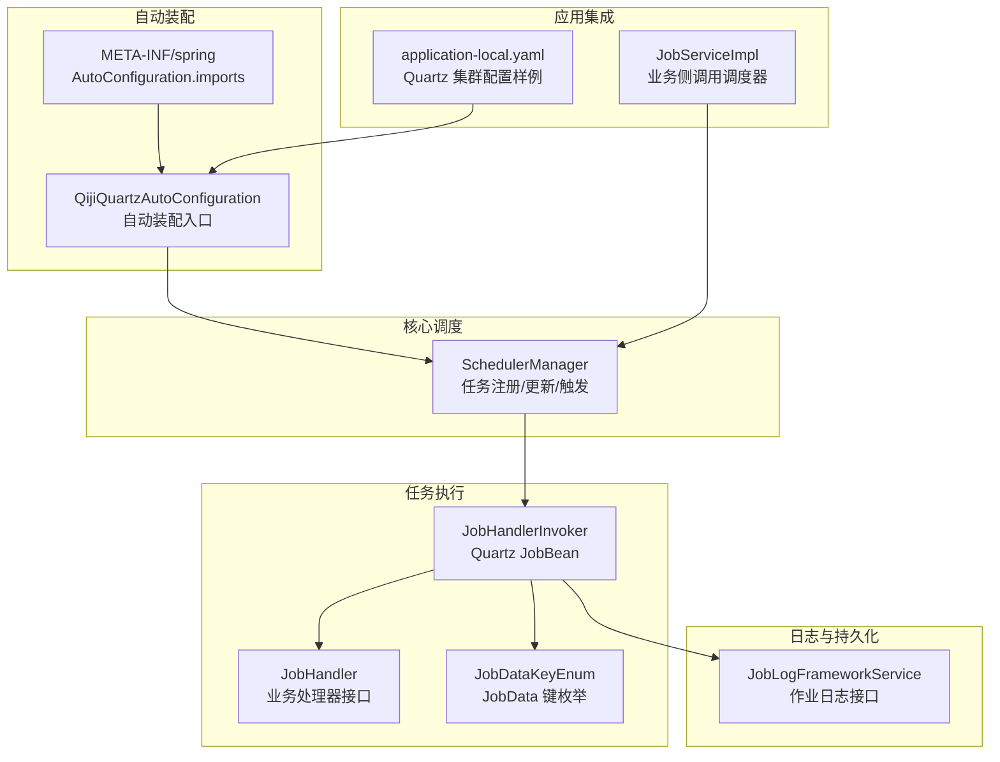
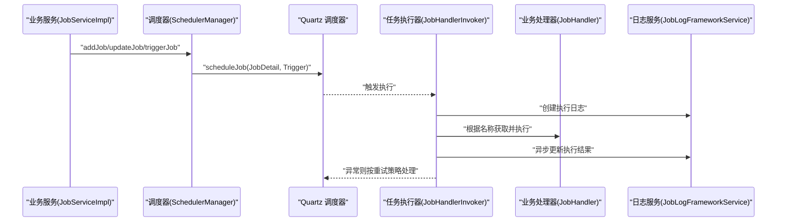
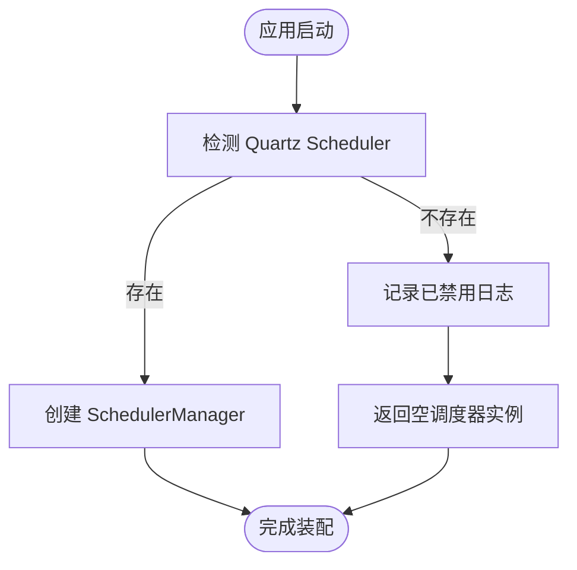
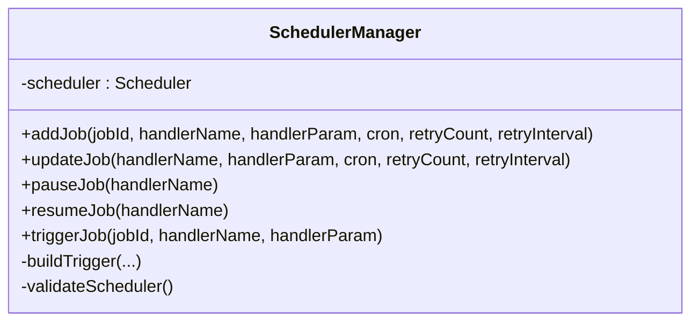
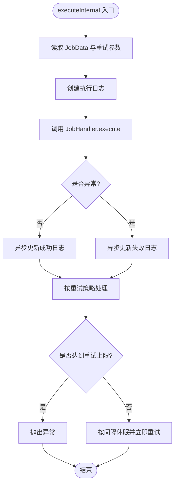
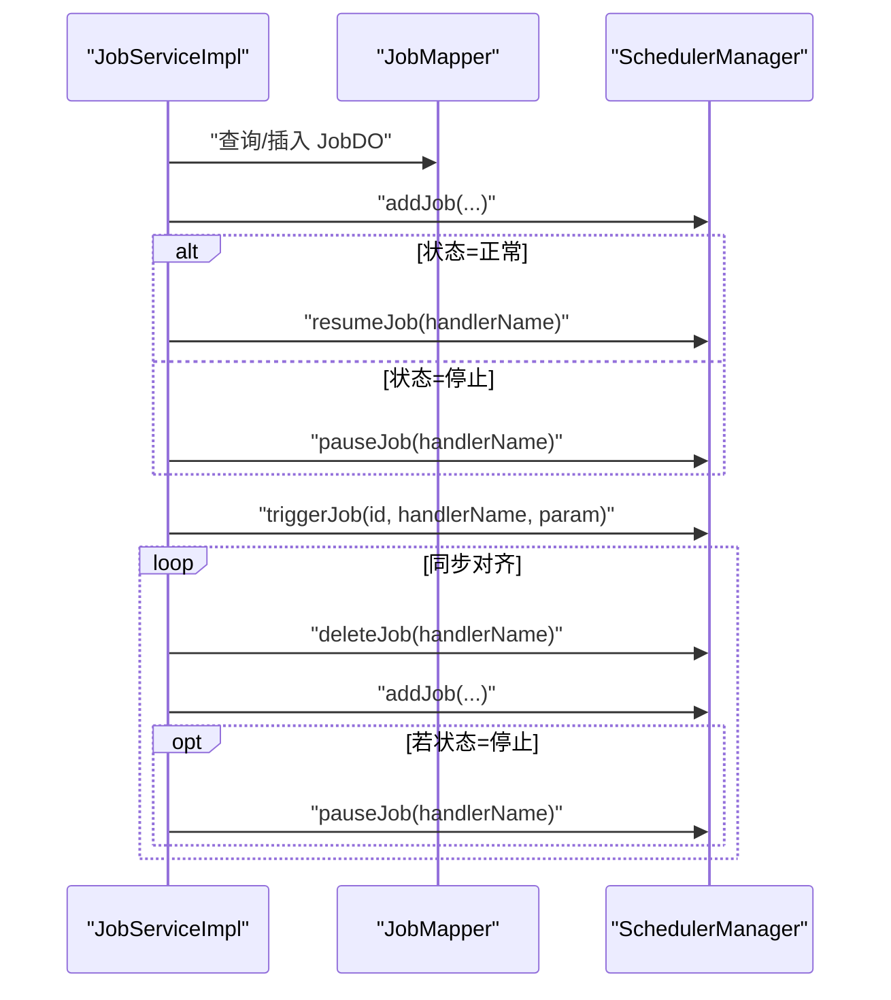
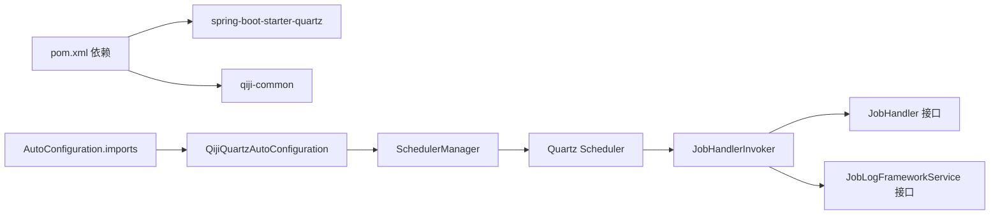

# 定时任务扩展模块

<cite>
**本文引用的文件**
- [QijiQuartzAutoConfiguration.java](file://backend/qiji-framework/qiji-spring-boot-starter-job/src/main/java/com/qiji/cps/framework/quartz/config/QijiQuartzAutoConfiguration.java)
- [SchedulerManager.java](file://backend/qiji-framework/qiji-spring-boot-starter-job/src/main/java/com/qiji/cps/framework/quartz/core/scheduler/SchedulerManager.java)
- [JobHandler.java](file://backend/qiji-framework/qiji-spring-boot-starter-job/src/main/java/com/qiji/cps/framework/quartz/core/handler/JobHandler.java)
- [JobHandlerInvoker.java](file://backend/qiji-framework/qiji-spring-boot-starter-job/src/main/java/com/qiji/cps/framework/quartz/core/handler/JobHandlerInvoker.java)
- [JobDataKeyEnum.java](file://backend/qiji-framework/qiji-spring-boot-starter-job/src/main/java/com/qiji/cps/framework/quartz/core/enums/JobDataKeyEnum.java)
- [JobLogFrameworkService.java](file://backend/qiji-framework/qiji-spring-boot-starter-job/src/main/java/com/qiji/cps/framework/quartz/core/service/JobLogFrameworkService.java)
- [application-local.yaml](file://backend/qiji-server/src/main/resources/application-local.yaml)
- [JobServiceImpl.java](file://backend/qiji-module-infra/src/main/java/com/qiji/cps/module/infra/service/job/JobServiceImpl.java)
- [JobService.java](file://backend/qiji-module-infra/src/main/java/com/qiji/cps/module/infra/service/job/JobService.java)
- [org.springframework.boot.autoconfigure.AutoConfiguration.imports](file://backend/qiji-framework/qiji-spring-boot-starter-job/src/main/resources/META-INF/spring/org.springframework.boot.autoconfigure.AutoConfiguration.imports)
- [pom.xml](file://backend/qiji-framework/qiji-spring-boot-starter-job/pom.xml)
</cite>

## 目录
1. [简介](#简介)
2. [项目结构](#项目结构)
3. [核心组件](#核心组件)
4. [架构总览](#架构总览)
5. [详细组件分析](#详细组件分析)
6. [依赖关系分析](#依赖关系分析)
7. [性能考虑](#性能考虑)
8. [故障排查指南](#故障排查指南)
9. [结论](#结论)
10. [附录](#附录)

## 简介
本文件面向 AgenticCPS 项目的 qiji-spring-boot-starter-job 定时任务扩展模块，系统性阐述基于 Quartz 的自动配置与扩展机制，涵盖任务注册、调度策略、集群部署、配置类作用与自定义方式、任务生命周期与错误处理（含重试、失败告警、状态持久化），并提供最佳实践与性能优化建议。读者无需深厚的 Quartz 背景知识，也能通过本文件快速理解并正确使用该模块。

## 项目结构
该模块位于后端框架的 qiji-framework 子工程中，采用“自动装配 + 核心调度器 + 任务处理器 + 日志服务”的分层设计，并通过 Spring Boot 的条件装配与 SPI 扩展点实现开箱即用与灵活定制。

图示来源
- [QijiQuartzAutoConfiguration.java:15-29](file://backend/qiji-framework/qiji-spring-boot-starter-job/src/main/java/com/qiji/cps/framework/quartz/config/QijiQuartzAutoConfiguration.java#L15-L29)
- [org.springframework.boot.autoconfigure.AutoConfiguration.imports:1-2](file://backend/qiji-framework/qiji-spring-boot-starter-job/src/main/resources/META-INF/spring/org.springframework.boot.autoconfigure.AutoConfiguration.imports#L1-L2)
- [SchedulerManager.java:21-53](file://backend/qiji-framework/qiji-spring-boot-starter-job/src/main/java/com/qiji/cps/framework/quartz/core/scheduler/SchedulerManager.java#L21-L53)
- [JobHandlerInvoker.java:29-66](file://backend/qiji-framework/qiji-spring-boot-starter-job/src/main/java/com/qiji/cps/framework/quartz/core/handler/JobHandlerInvoker.java#L29-L66)
- [JobHandler.java:8-19](file://backend/qiji-framework/qiji-spring-boot-starter-job/src/main/java/com/qiji/cps/framework/quartz/core/handler/JobHandler.java#L8-L19)
- [JobDataKeyEnum.java:6-14](file://backend/qiji-framework/qiji-spring-boot-starter-job/src/main/java/com/qiji/cps/framework/quartz/core/enums/JobDataKeyEnum.java#L6-L14)
- [JobLogFrameworkService.java:12-43](file://backend/qiji-framework/qiji-spring-boot-starter-job/src/main/java/com/qiji/cps/framework/quartz/core/service/JobLogFrameworkService.java#L12-L43)
- [application-local.yaml:90-113](file://backend/qiji-server/src/main/resources/application-local.yaml#L90-L113)
- [JobServiceImpl.java:46-64](file://backend/qiji-module-infra/src/main/java/com/qiji/cps/module/infra/service/job/JobServiceImpl.java#L46-L64)

章节来源
- [pom.xml:21-38](file://backend/qiji-framework/qiji-spring-boot-starter-job/pom.xml#L21-L38)
- [org.springframework.boot.autoconfigure.AutoConfiguration.imports:1-2](file://backend/qiji-framework/qiji-spring-boot-starter-job/src/main/resources/META-INF/spring/org.springframework.boot.autoconfigure.AutoConfiguration.imports#L1-L2)

## 核心组件
- 自动装配入口：通过 AutoConfiguration 导入并暴露 SchedulerManager，支持禁用 Quartz 时的安全降级。
- 调度器管理：封装 Quartz Scheduler，提供 addJob/updateJob/pause/resume/trigger 等统一方法。
- 任务执行器：Quartz JobBean，从 JobData 中解析任务参数，调用业务 JobHandler 并记录日志。
- 任务处理器：业务侧实现接口，提供字符串参数的 execute 方法。
- 日志服务：抽象作业日志接口，负责创建与异步更新执行结果。
- 配置类：通过 Spring Boot 配置文件启用 Quartz 集群、线程池与存储等能力。

章节来源
- [QijiQuartzAutoConfiguration.java:15-29](file://backend/qiji-framework/qiji-spring-boot-starter-job/src/main/java/com/qiji/cps/framework/quartz/config/QijiQuartzAutoConfiguration.java#L15-L29)
- [SchedulerManager.java:21-150](file://backend/qiji-framework/qiji-spring-boot-starter-job/src/main/java/com/qiji/cps/framework/quartz/core/scheduler/SchedulerManager.java#L21-L150)
- [JobHandlerInvoker.java:29-114](file://backend/qiji-framework/qiji-spring-boot-starter-job/src/main/java/com/qiji/cps/framework/quartz/core/handler/JobHandlerInvoker.java#L29-L114)
- [JobHandler.java:8-19](file://backend/qiji-framework/qiji-spring-boot-starter-job/src/main/java/com/qiji/cps/framework/quartz/core/handler/JobHandler.java#L8-L19)
- [JobLogFrameworkService.java:12-43](file://backend/qiji-framework/qiji-spring-boot-starter-job/src/main/java/com/qiji/cps/framework/quartz/core/service/JobLogFrameworkService.java#L12-L43)
- [application-local.yaml:90-113](file://backend/qiji-server/src/main/resources/application-local.yaml#L90-L113)

## 架构总览
下图展示从应用侧调用到 Quartz 执行再到日志落库的完整链路，体现模块的解耦与扩展点。

图示来源
- [JobServiceImpl.java:46-64](file://backend/qiji-module-infra/src/main/java/com/qiji/cps/module/infra/service/job/JobServiceImpl.java#L46-L64)
- [SchedulerManager.java:40-53](file://backend/qiji-framework/qiji-spring-boot-starter-job/src/main/java/com/qiji/cps/framework/quartz/core/scheduler/SchedulerManager.java#L40-L53)
- [JobHandlerInvoker.java:37-66](file://backend/qiji-framework/qiji-spring-boot-starter-job/src/main/java/com/qiji/cps/framework/quartz/core/handler/JobHandlerInvoker.java#L37-L66)
- [JobLogFrameworkService.java:24-42](file://backend/qiji-framework/qiji-spring-boot-starter-job/src/main/java/com/qiji/cps/framework/quartz/core/service/JobLogFrameworkService.java#L24-L42)

## 详细组件分析

### 自动装配与配置类
- 自动装配入口：在存在 Quartz Scheduler 的情况下注入 SchedulerManager；若不存在则返回空调度器实例，避免启动失败并提示启用方式。
- 配置导入：通过 META-INF/spring 的 AutoConfiguration.imports 文件声明自动装配类，确保被 Spring Boot 发现。
- Quartz 配置：通过 application-local.yaml 展示了集群、存储、线程池等关键参数，便于生产环境落地。

图示来源
- [QijiQuartzAutoConfiguration.java:20-27](file://backend/qiji-framework/qiji-spring-boot-starter-job/src/main/java/com/qiji/cps/framework/quartz/config/QijiQuartzAutoConfiguration.java#L20-L27)
- [org.springframework.boot.autoconfigure.AutoConfiguration.imports:1-2](file://backend/qiji-framework/qiji-spring-boot-starter-job/src/main/resources/META-INF/spring/org.springframework.boot.autoconfigure.AutoConfiguration.imports#L1-L2)

章节来源
- [QijiQuartzAutoConfiguration.java:15-29](file://backend/qiji-framework/qiji-spring-boot-starter-job/src/main/java/com/qiji/cps/framework/quartz/config/QijiQuartzAutoConfiguration.java#L15-L29)
- [application-local.yaml:90-113](file://backend/qiji-server/src/main/resources/application-local.yaml#L90-L113)

### 调度器管理器（SchedulerManager）
- 任务注册：构建 JobDetail（以处理器名为唯一标识），并创建 CronTrigger，将 Job 注册到 Quartz。
- 任务更新：支持更新处理器参数、表达式与重试策略。
- 任务控制：提供暂停、恢复、立即触发等操作。
- 参数传递：通过 JobData 将任务编号、处理器名、参数、重试次数与间隔传入执行器。
- 安全校验：当调度器为空时抛出明确异常，提示启用 Quartz。

图示来源
- [SchedulerManager.java:21-150](file://backend/qiji-framework/qiji-spring-boot-starter-job/src/main/java/com/qiji/cps/framework/quartz/core/scheduler/SchedulerManager.java#L21-L150)

章节来源
- [SchedulerManager.java:29-141](file://backend/qiji-framework/qiji-spring-boot-starter-job/src/main/java/com/qiji/cps/framework/quartz/core/scheduler/SchedulerManager.java#L29-L141)

### 任务执行器（JobHandlerInvoker）
- 执行入口：从 JobExecutionContext 的合并 JobData 中读取任务元数据与重试信息。
- 任务调用：通过 ApplicationContext 获取具体 JobHandler Bean 并执行其 execute 方法。
- 日志记录：先创建执行日志，再异步更新执行结果（包含耗时、成功与否、根因信息）。
- 错误处理：根据重试次数与间隔决定是否重试或抛出异常；异常信息取根因以便定位。

图示来源
- [JobHandlerInvoker.java:37-111](file://backend/qiji-framework/qiji-spring-boot-starter-job/src/main/java/com/qiji/cps/framework/quartz/core/handler/JobHandlerInvoker.java#L37-L111)

章节来源
- [JobHandlerInvoker.java:29-114](file://backend/qiji-framework/qiji-spring-boot-starter-job/src/main/java/com/qiji/cps/framework/quartz/core/handler/JobHandlerInvoker.java#L29-L114)
- [JobDataKeyEnum.java:6-14](file://backend/qiji-framework/qiji-spring-boot-starter-job/src/main/java/com/qiji/cps/framework/quartz/core/enums/JobDataKeyEnum.java#L6-L14)
- [JobLogFrameworkService.java:12-43](file://backend/qiji-framework/qiji-spring-boot-starter-job/src/main/java/com/qiji/cps/framework/quartz/core/service/JobLogFrameworkService.java#L12-L43)

### 任务处理器（JobHandler）
- 接口职责：定义 execute(String param) 方法，业务侧实现具体逻辑。
- 命名约定：处理器 Bean 名称即为调度时使用的唯一标识，需保证全局唯一且可解析。

章节来源
- [JobHandler.java:8-19](file://backend/qiji-framework/qiji-spring-boot-starter-job/src/main/java/com/qiji/cps/framework/quartz/core/handler/JobHandler.java#L8-L19)

### 日志服务（JobLogFrameworkService）
- 创建日志：记录任务编号、开始时间、处理器名、参数与执行序号。
- 更新结果：异步更新结束时间、耗时、成功标志与结果数据（失败时为根因）。

章节来源
- [JobLogFrameworkService.java:12-43](file://backend/qiji-framework/qiji-spring-boot-starter-job/src/main/java/com/qiji/cps/framework/quartz/core/service/JobLogFrameworkService.java#L12-L43)

### 应用集成（JobServiceImpl）
- 任务创建：校验 Cron 表达式与处理器唯一性，插入持久化记录后调用调度器添加任务。
- 状态变更：根据状态开启/暂停处理器对应的 Job。
- 立即触发：手动触发某任务执行。
- 同步对齐：遍历持久化任务，先删除后重建，确保与 Quartz 一致；如为停止状态则暂停。

图示来源
- [JobServiceImpl.java:46-155](file://backend/qiji-module-infra/src/main/java/com/qiji/cps/module/infra/service/job/JobServiceImpl.java#L46-L155)
- [JobService.java:17-53](file://backend/qiji-module-infra/src/main/java/com/qiji/cps/module/infra/service/job/JobService.java#L17-L53)

章节来源
- [JobServiceImpl.java:46-155](file://backend/qiji-module-infra/src/main/java/com/qiji/cps/module/infra/service/job/JobServiceImpl.java#L46-L155)
- [JobService.java:17-53](file://backend/qiji-module-infra/src/main/java/com/qiji/cps/module/infra/service/job/JobService.java#L17-L53)

## 依赖关系分析
- 模块依赖：依赖 spring-boot-starter-quartz 与 qiji-common，提供 Quartz 与通用能力。
- 自动装配：通过 AutoConfiguration.imports 自动发现并装配。
- 组件耦合：SchedulerManager 与 Quartz 解耦良好；JobHandlerInvoker 仅依赖接口与上下文；日志服务可替换实现。

图示来源
- [pom.xml:21-38](file://backend/qiji-framework/qiji-spring-boot-starter-job/pom.xml#L21-L38)
- [org.springframework.boot.autoconfigure.AutoConfiguration.imports:1-2](file://backend/qiji-framework/qiji-spring-boot-starter-job/src/main/resources/META-INF/spring/org.springframework.boot.autoconfigure.AutoConfiguration.imports#L1-L2)
- [QijiQuartzAutoConfiguration.java:15-29](file://backend/qiji-framework/qiji-spring-boot-starter-job/src/main/java/com/qiji/cps/framework/quartz/config/QijiQuartzAutoConfiguration.java#L15-L29)

章节来源
- [pom.xml:21-38](file://backend/qiji-framework/qiji-spring-boot-starter-job/pom.xml#L21-L38)

## 性能考虑
- 线程池大小：根据任务并发需求与 CPU 核数合理设置线程池大小，避免过多上下文切换。
- 集群一致性：开启集群模式并配置合理的集群检查间隔，确保节点间任务负载均衡与高可用。
- 存储选择：生产环境优先使用 JDBC 存储，保障任务状态持久化与跨节点共享。
- 触发策略：Cron 表达式避免过于密集的高频任务，必要时引入任务去重与限流。
- 日志异步：执行日志更新采用异步，降低阻塞风险；同时注意日志表的索引与分区策略。
- 重试策略：合理设置最大重试次数与重试间隔，避免雪崩效应；对幂等性不强的任务谨慎重试。

## 故障排查指南
- 定时任务未生效
  - 检查 Quartz 是否被禁用（自动装配返回空调度器）。
  - 确认 Cron 表达式是否有效。
- 任务重复执行或并发冲突
  - 确认是否启用并发限制注解（如并发执行注解）。
  - 检查集群配置与线程池大小。
- 任务日志缺失
  - 核对日志服务实现是否正确注入与初始化。
  - 关注异步更新过程中的异常日志。
- 重试无效或过早退出
  - 校验重试次数与间隔参数是否正确传入 JobData。
  - 查看异常根因是否被捕获并按策略处理。

章节来源
- [QijiQuartzAutoConfiguration.java:20-27](file://backend/qiji-framework/qiji-spring-boot-starter-job/src/main/java/com/qiji/cps/framework/quartz/config/QijiQuartzAutoConfiguration.java#L20-L27)
- [JobHandlerInvoker.java:93-111](file://backend/qiji-framework/qiji-spring-boot-starter-job/src/main/java/com/qiji/cps/framework/quartz/core/handler/JobHandlerInvoker.java#L93-L111)
- [application-local.yaml:90-113](file://backend/qiji-server/src/main/resources/application-local.yaml#L90-L113)

## 结论
qiji-spring-boot-starter-job 通过自动装配、调度器管理、任务执行器与日志服务的清晰分层，提供了开箱即用且易于扩展的 Quartz 定时任务能力。结合集群配置与完善的错误处理机制，可在生产环境中稳定运行。建议在实际使用中遵循本文的最佳实践与性能优化建议，确保任务的可靠性与可维护性。

## 附录
- 集群部署要点
  - 启用集群模式并配置唯一实例标识。
  - 使用 JDBC JobStore 保存任务状态。
  - 合理设置线程池大小与集群检查间隔。
- 自定义扩展建议
  - 实现自定义 JobHandler 并以处理器名作为 Bean 名称。
  - 提供自定义 JobLogFrameworkService 实现以适配不同日志存储。
  - 如需更细粒度的触发策略，可在 Trigger 构建处扩展。

章节来源
- [application-local.yaml:90-113](file://backend/qiji-server/src/main/resources/application-local.yaml#L90-L113)
- [JobHandler.java:8-19](file://backend/qiji-framework/qiji-spring-boot-starter-job/src/main/java/com/qiji/cps/framework/quartz/core/handler/JobHandler.java#L8-L19)
- [JobLogFrameworkService.java:12-43](file://backend/qiji-framework/qiji-spring-boot-starter-job/src/main/java/com/qiji/cps/framework/quartz/core/service/JobLogFrameworkService.java#L12-L43)