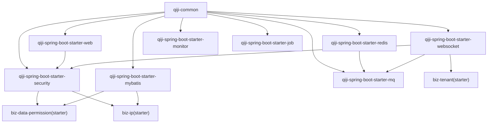
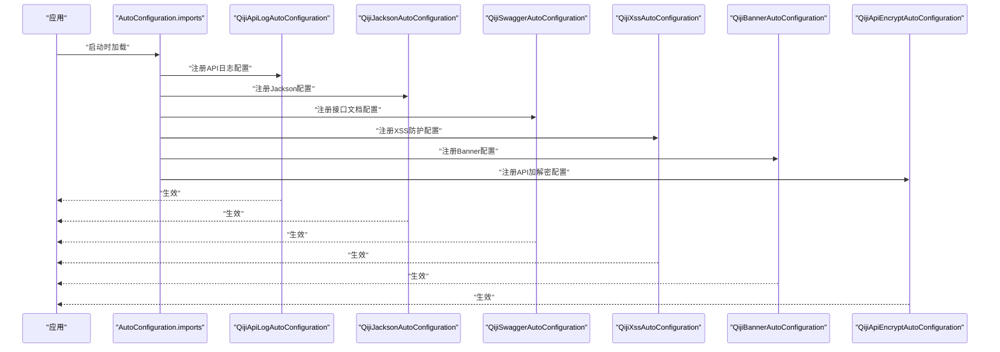
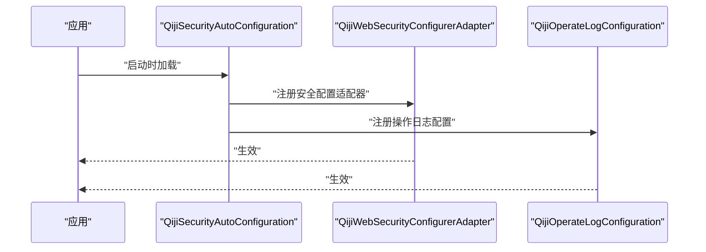
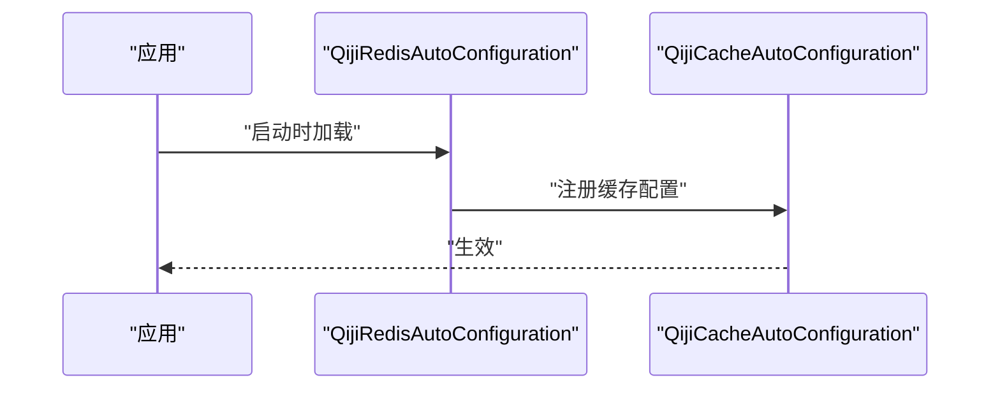
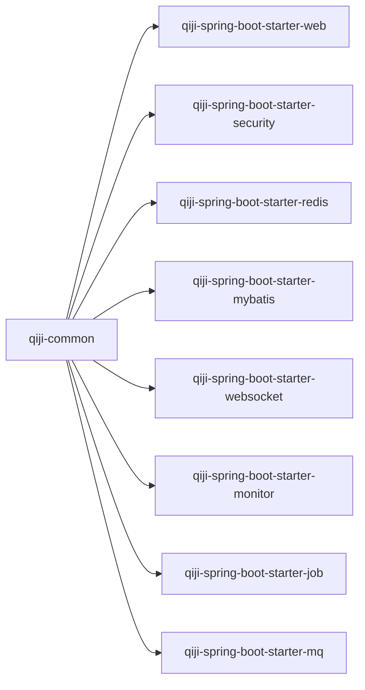

# 框架扩展模块

<cite>
**本文引用的文件**
- [pom.xml](file://backend/qiji-framework/pom.xml)
- [qiji-common/pom.xml](file://backend/qiji-framework/qiji-common/pom.xml)
- [qiji-spring-boot-starter-web/pom.xml](file://backend/qiji-framework/qiji-spring-boot-starter-web/pom.xml)
- [qiji-spring-boot-starter-security/pom.xml](file://backend/qiji-framework/qiji-spring-boot-starter-security/pom.xml)
- [qiji-spring-boot-starter-redis/pom.xml](file://backend/qiji-framework/qiji-spring-boot-starter-redis/pom.xml)
- [qiji-spring-boot-starter-mybatis/pom.xml](file://backend/qiji-framework/qiji-spring-boot-starter-mybatis/pom.xml)
- [qiji-spring-boot-starter-websocket/pom.xml](file://backend/qiji-framework/qiji-spring-boot-starter-websocket/pom.xml)
- [qiji-spring-boot-starter-monitor/pom.xml](file://backend/qiji-framework/qiji-spring-boot-starter-monitor/pom.xml)
- [qiji-spring-boot-starter-job/pom.xml](file://backend/qiji-framework/qiji-spring-boot-starter-job/pom.xml)
- [qiji-spring-boot-starter-mq/pom.xml](file://backend/qiji-framework/qiji-spring-boot-starter-mq/pom.xml)
- [qiji-spring-boot-starter-web/src/main/resources/META-INF/spring/org.springframework.boot.autoconfigure.AutoConfiguration.imports](file://backend/qiji-framework/qiji-spring-boot-starter-web/src/main/resources/META-INF/spring/org.springframework.boot.autoconfigure.AutoConfiguration.imports)
- [qiji-spring-boot-starter-security/src/main/resources/META-INF/spring/org.springframework.boot.autoconfigure.AutoConfiguration.imports](file://backend/qiji-framework/qiji-spring-boot-starter-security/src/main/resources/META-INF/spring/org.springframework.boot.autoconfigure.AutoConfiguration.imports)
- [qiji-spring-boot-starter-redis/src/main/resources/META-INF/spring/org.springframework.boot.autoconfigure.AutoConfiguration.imports](file://backend/qiji-framework/qiji-spring-boot-starter-redis/src/main/resources/META-INF/spring/org.springframework.boot.autoconfigure.AutoConfiguration.imports)
</cite>

## 目录
1. [引言](#引言)
2. [项目结构](#项目结构)
3. [核心组件](#核心组件)
4. [架构总览](#架构总览)
5. [详细组件分析](#详细组件分析)
6. [依赖关系分析](#依赖关系分析)
7. [性能考虑](#性能考虑)
8. [故障排查指南](#故障排查指南)
9. [结论](#结论)
10. [附录](#附录)

## 引言
本文件面向AgenticCPS项目的qiji-framework框架扩展模块，系统化梳理通用模块与各starter组件的设计理念、职责边界与集成方式。重点覆盖以下方面：
- 通用模块(qiji-common)：基础POJO、枚举、工具类与跨模块复用能力
- Web模块：全局异常、API日志、脱敏、错误码、接口文档等
- 安全模块：认证授权、操作日志、安全切面
- Redis模块：缓存与分布式锁等能力
- MyBatis模块：数据库连接池、多数据源、事务、MyBatis拓展
- 其他支撑模块：定时任务、消息队列、监控、WebSocket、Excel、测试、业务能力等

同时，文档解释自动配置机制、条件注解的使用方式，并给出扩展自定义starter的最佳实践。

## 项目结构
qiji-framework采用多模块聚合管理，父POM统一版本与模块清单，每个子模块对应一个独立的starter或通用模块，遵循“框架组件”和“业务组件”的分类原则。

```mermaid
graph TB
parent["父模块<br/>qiji-framework(pom)"] --> common["通用模块<br/>qiji-common"]
parent --> web["Web模块<br/>qiji-spring-boot-starter-web"]
parent --> security["安全模块<br/>qiji-spring-boot-starter-security"]
parent --> redis["Redis模块<br/>qiji-spring-boot-starter-redis"]
parent --> mybatis["MyBatis模块<br/>qiji-spring-boot-starter-mybatis"]
parent --> websocket["WebSocket模块<br/>qiji-spring-boot-starter-websocket"]
parent --> monitor["监控模块<br/>qiji-spring-boot-starter-monitor"]
parent --> job["任务模块<br/>qiji-spring-boot-starter-job"]
parent --> mq["消息队列模块<br/>qiji-spring-boot-starter-mq"]
parent --> excel["Excel模块<br/>qiji-spring-boot-starter-excel"]
parent --> test["测试模块<br/>qiji-spring-boot-starter-test"]
parent --> biz_tenant["业务组件<br/>qiji-spring-boot-starter-biz-tenant"]
parent --> biz_data_permission["业务组件<br/>qiji-spring-boot-starter-biz-data-permission"]
parent --> biz_ip["业务组件<br/>qiji-spring-boot-starter-biz-ip"]
```

图表来源
- [pom.xml:12-31](file://backend/qiji-framework/pom.xml#L12-L31)

章节来源
- [pom.xml:12-31](file://backend/qiji-framework/pom.xml#L12-L31)

## 核心组件
本节从设计理念、职责边界、依赖关系与典型使用场景四个维度，系统阐述各核心模块。

- 通用模块(qiji-common)
  - 设计理念：提供跨模块的基础类型、工具类与公共依赖，降低重复代码，统一风格
  - 关键特性：基础POJO/枚举、工具类、参数校验、序列化、国际化、链路追踪等
  - 典型使用：被所有starter模块作为依赖，确保一致的基础设施

- Web模块(qiji-spring-boot-starter-web)
  - 设计理念：统一Web层接入，提供全局异常处理、API日志、XSS防护、接口文档、加密等
  - 自动配置：通过META-INF/spring自动注册多个AutoConfiguration
  - 典型使用：在应用中引入即可获得开箱即用的Web增强能力

- 安全模块(qiji-spring-boot-starter-security)
  - 设计理念：围绕“谁对什么做什么”的权限模型，结合操作日志实现审计闭环
  - 自动配置：注册安全自动配置与WebSecurityConfigurerAdapter
  - 典型使用：与Web模块配合，提供认证授权与操作审计

- Redis模块(qiji-spring-boot-starter-redis)
  - 设计理念：基于Redisson提供缓存、分布式锁、限流等能力
  - 自动配置：注册Redis与Cache自动配置
  - 典型使用：在业务中直接使用@Cacheable/@CacheEvict等注解

- MyBatis模块(qiji-spring-boot-starter-mybatis)
  - 设计理念：整合Druid、MyBatis-Plus、动态数据源与联表查询能力
  - 典型使用：多数据源、读写分离、复杂联表查询、字段处理器等

章节来源
- [qiji-common/pom.xml:18-147](file://backend/qiji-framework/qiji-common/pom.xml#L18-L147)
- [qiji-spring-boot-starter-web/pom.xml:18-82](file://backend/qiji-framework/qiji-spring-boot-starter-web/pom.xml#L18-L82)
- [qiji-spring-boot-starter-security/pom.xml:21-65](file://backend/qiji-framework/qiji-spring-boot-starter-security/pom.xml#L21-L65)
- [qiji-spring-boot-starter-redis/pom.xml:18-42](file://backend/qiji-framework/qiji-spring-boot-starter-redis/pom.xml#L18-L42)
- [qiji-spring-boot-starter-mybatis/pom.xml:18-111](file://backend/qiji-framework/qiji-spring-boot-starter-mybatis/pom.xml#L18-L111)

## 架构总览
下图展示qiji-framework各模块之间的依赖关系与集成路径，体现“通用模块”作为基础设施，“框架组件”与“业务组件”分层设计。

图表来源
- [pom.xml:12-31](file://backend/qiji-framework/pom.xml#L12-L31)
- [qiji-spring-boot-starter-websocket/pom.xml:19-73](file://backend/qiji-framework/qiji-spring-boot-starter-websocket/pom.xml#L19-L73)
- [qiji-spring-boot-starter-security/pom.xml:21-65](file://backend/qiji-framework/qiji-spring-boot-starter-security/pom.xml#L21-L65)
- [qiji-spring-boot-starter-mybatis/pom.xml:18-111](file://backend/qiji-framework/qiji-spring-boot-starter-mybatis/pom.xml#L18-L111)

## 详细组件分析

### Web模块（qiji-spring-boot-starter-web）
- 自动配置机制
  - 通过META-INF/spring自动注册多个AutoConfiguration，覆盖API日志、Jackson、Swagger、XSS、Banner、API加密等
  - 便于在应用中零配置启用Web增强能力
- 条件注解与可选依赖
  - 部分依赖标记为provided，仅在工具类使用时生效，避免对使用者产生不必要的传递依赖
- 典型使用
  - 引入后即可获得Knife4j/SpringDoc接口文档、全局异常处理、XSS防护、API加解密等能力

图表来源
- [qiji-spring-boot-starter-web/src/main/resources/META-INF/spring/org.springframework.boot.autoconfigure.AutoConfiguration.imports:1-7](file://backend/qiji-framework/qiji-spring-boot-starter-web/src/main/resources/META-INF/spring/org.springframework.boot.autoconfigure.AutoConfiguration.imports#L1-L7)

章节来源
- [qiji-spring-boot-starter-web/pom.xml:18-82](file://backend/qiji-framework/qiji-spring-boot-starter-web/pom.xml#L18-L82)
- [qiji-spring-boot-starter-web/src/main/resources/META-INF/spring/org.springframework.boot.autoconfigure.AutoConfiguration.imports:1-7](file://backend/qiji-framework/qiji-spring-boot-starter-web/src/main/resources/META-INF/spring/org.springframework.boot.autoconfigure.AutoConfiguration.imports#L1-L7)

### 安全模块（qiji-spring-boot-starter-security）
- 自动配置机制
  - 注册安全自动配置与WebSecurityConfigurerAdapter，提供统一的安全入口
  - 集成操作日志组件，记录“谁、何时、对什么、做了什么”
- 条件注解与可选依赖
  - 部分依赖标记为provided，避免对使用者产生不必要影响
- 典型使用
  - 在Web模块基础上，快速实现认证授权与操作审计

图表来源
- [qiji-spring-boot-starter-security/src/main/resources/META-INF/spring/org.springframework.boot.autoconfigure.AutoConfiguration.imports:1-3](file://backend/qiji-framework/qiji-spring-boot-starter-security/src/main/resources/META-INF/spring/org.springframework.boot.autoconfigure.AutoConfiguration.imports#L1-L3)

章节来源
- [qiji-spring-boot-starter-security/pom.xml:21-65](file://backend/qiji-framework/qiji-spring-boot-starter-security/pom.xml#L21-L65)
- [qiji-spring-boot-starter-security/src/main/resources/META-INF/spring/org.springframework.boot.autoconfigure.AutoConfiguration.imports:1-3](file://backend/qiji-framework/qiji-spring-boot-starter-security/src/main/resources/META-INF/spring/org.springframework.boot.autoconfigure.AutoConfiguration.imports#L1-L3)

### Redis模块（qiji-spring-boot-starter-redis）
- 自动配置机制
  - 注册Redis与Cache自动配置，支持Spring Cache注解与Redisson能力
- 典型使用
  - 使用@Cacheable/@CacheEvict等注解实现缓存；使用Redisson实现分布式锁与限流

图表来源
- [qiji-spring-boot-starter-redis/src/main/resources/META-INF/spring/org.springframework.boot.autoconfigure.AutoConfiguration.imports:1-2](file://backend/qiji-framework/qiji-spring-boot-starter-redis/src/main/resources/META-INF/spring/org.springframework.boot.autoconfigure.AutoConfiguration.imports#L1-L2)

章节来源
- [qiji-spring-boot-starter-redis/pom.xml:18-42](file://backend/qiji-framework/qiji-spring-boot-starter-redis/pom.xml#L18-L42)
- [qiji-spring-boot-starter-redis/src/main/resources/META-INF/spring/org.springframework.boot.autoconfigure.AutoConfiguration.imports:1-2](file://backend/qiji-framework/qiji-spring-boot-starter-redis/src/main/resources/META-INF/spring/org.springframework.boot.autoconfigure.AutoConfiguration.imports#L1-L2)

### MyBatis模块（qiji-spring-boot-starter-mybatis）
- 设计理念
  - 整合Druid连接池、MyBatis-Plus、动态数据源、联表查询与字段处理器
  - 支持多数据库驱动，满足不同环境需求
- 典型使用
  - 多数据源读写分离、复杂联表查询、统一字段处理、数据翻译等

章节来源
- [qiji-spring-boot-starter-mybatis/pom.xml:18-111](file://backend/qiji-framework/qiji-spring-boot-starter-mybatis/pom.xml#L18-L111)

### 其他模块概览
- WebSocket模块：提供多节点广播能力，依赖安全模块与消息队列模块
- 监控模块：提供链路追踪、日志服务、指标采集与Spring Boot Admin客户端
- 任务模块：基于Quartz与Spring Async的定时与异步任务拓展
- 消息队列模块：统一抽象Redis/主流MQ，便于切换与扩展
- Excel/测试/业务组件：按需引入，覆盖导出、单元测试与业务域能力

章节来源
- [qiji-spring-boot-starter-websocket/pom.xml:19-73](file://backend/qiji-framework/qiji-spring-boot-starter-websocket/pom.xml#L19-L73)
- [qiji-spring-boot-starter-monitor/pom.xml:18-79](file://backend/qiji-framework/qiji-spring-boot-starter-monitor/pom.xml#L18-L79)
- [qiji-spring-boot-starter-job/pom.xml:21-42](file://backend/qiji-framework/qiji-spring-boot-starter-job/pom.xml#L21-L42)
- [qiji-spring-boot-starter-mq/pom.xml:18-43](file://backend/qiji-framework/qiji-spring-boot-starter-mq/pom.xml#L18-L43)

## 依赖关系分析
- 模块内聚与耦合
  - 通用模块(qiji-common)作为基础设施，被所有框架组件依赖，保持高内聚低耦合
  - 框架组件之间通过明确的依赖关系协作，避免循环依赖
- 外部依赖与集成点
  - Web模块集成Knife4j/SpringDoc、XSS防护、API加解密
  - 安全模块集成Spring Security与操作日志SDK
  - Redis模块集成Redisson与Spring Cache
  - MyBatis模块集成Druid、MyBatis-Plus、动态数据源与联表查询
  - 监控模块集成SkyWalking、Micrometer与Spring Boot Admin
  - 任务模块集成Quartz与Spring Async
  - 消息队列模块集成多种MQ实现

图表来源
- [pom.xml:12-31](file://backend/qiji-framework/pom.xml#L12-L31)

章节来源
- [pom.xml:12-31](file://backend/qiji-framework/pom.xml#L12-L31)

## 性能考虑
- 连接池与SQL优化
  - 使用Druid连接池，结合MyBatis-Plus与动态数据源，合理配置连接数与超时
  - 利用联表查询与字段处理器减少N+1与重复映射
- 缓存策略
  - 使用Redis缓存热点数据，结合@Cacheable/@CacheEvict实现精准缓存
  - 分布式锁用于并发控制，避免脏写
- 监控与可观测性
  - 启用SkyWalking链路追踪与Micrometer指标采集，结合Prometheus/Grafana进行可视化
  - Spring Boot Admin集中管理服务实例状态
- 异步与定时任务
  - 使用Quartz与Spring Async处理耗时任务，避免阻塞主线程

## 故障排查指南
- Web模块常见问题
  - 接口文档未显示：检查Knife4j/SpringDoc依赖是否正确引入
  - XSS防护导致请求失败：确认请求参数是否被误判
  - API加解密异常：核对密钥与算法配置
- 安全模块常见问题
  - 认证失败：检查Security配置与用户权限
  - 操作日志未记录：确认操作日志组件是否启用
- Redis模块常见问题
  - 缓存失效：检查Key过期策略与缓存穿透防护
  - 分布式锁异常：确认锁释放逻辑与重入处理
- MyBatis模块常见问题
  - 多数据源切换异常：核对数据源配置与路由规则
  - 联表查询性能差：优化SQL与索引，减少不必要的联表
- 监控模块常见问题
  - 链路追踪缺失：检查SkyWalking Agent与探针配置
  - 指标未上报：确认Micrometer与Prometheus配置

## 结论
qiji-framework通过清晰的模块划分与自动配置机制，为AgenticCPS提供了统一、可扩展且高性能的技术基座。通用模块奠定基础，框架组件覆盖Web、安全、缓存、持久化、消息、任务与监控等关键领域；业务组件则按需组合，形成灵活的解决方案。建议在新项目中优先引入通用模块与核心框架组件，再根据业务场景选择性启用业务组件与扩展模块。

## 附录
- 扩展自定义starter最佳实践
  - 明确职责边界：每个starter聚焦单一能力域
  - 使用自动配置：通过META-INF/spring自动注册配置类
  - 条件注解：合理使用@ConditionalOnProperty/@ConditionalOnMissingBean等
  - 依赖最小化：尽量将非必需依赖标记为provided或optional
  - 文档与示例：提供README与简单示例，降低使用者上手成本