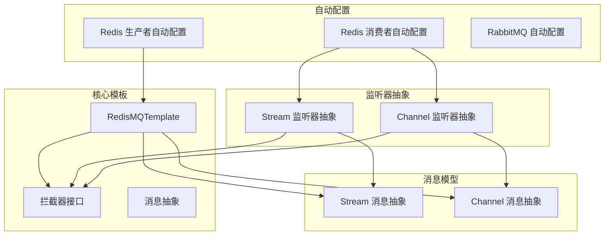
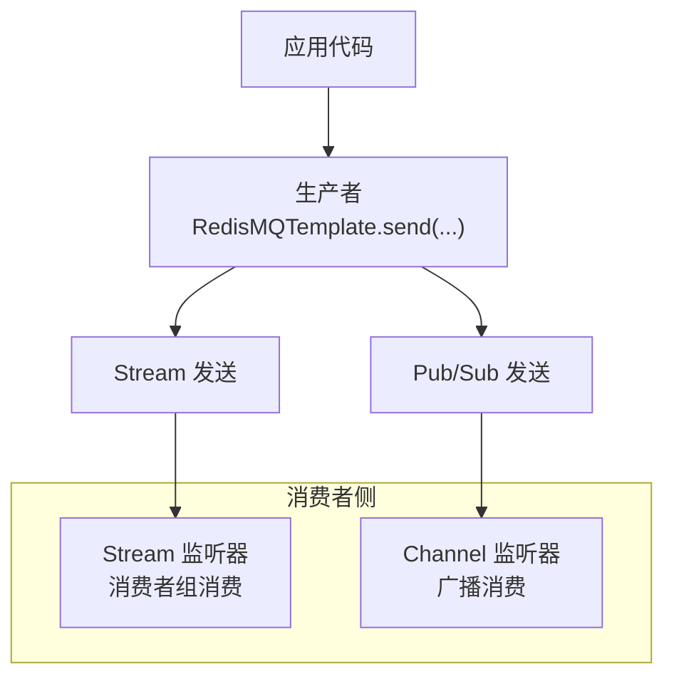
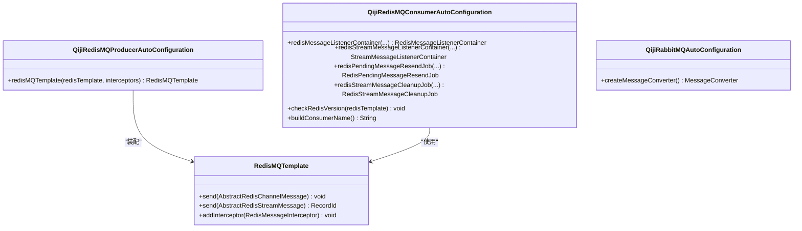
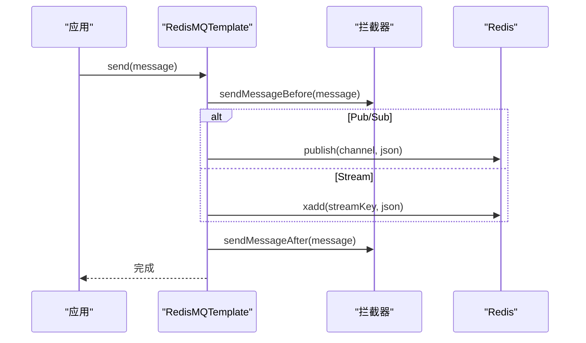
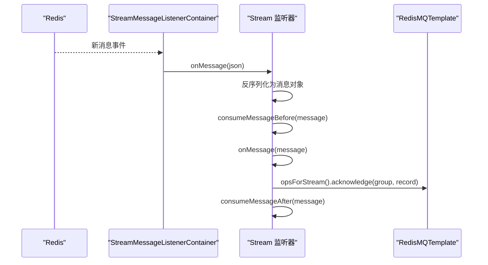
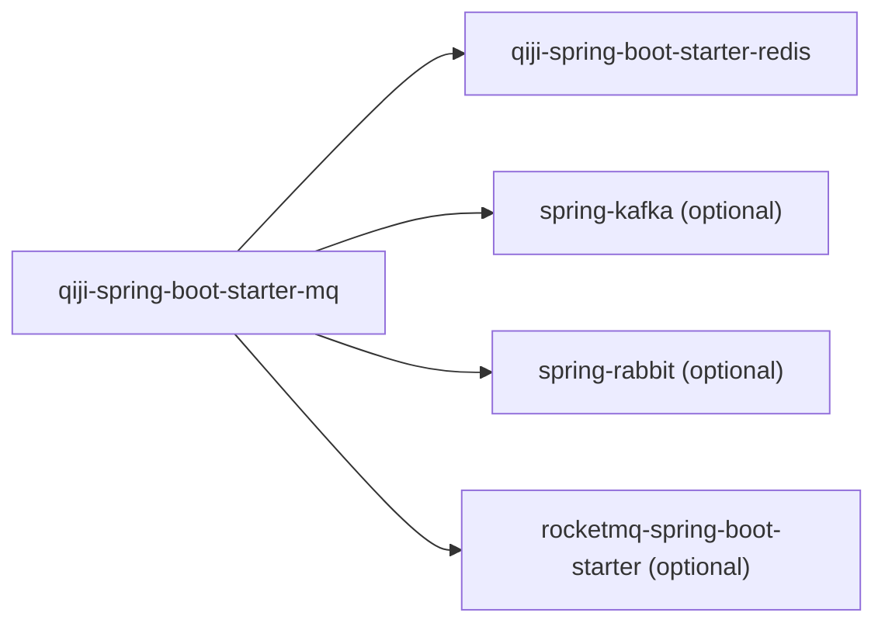

# 消息队列扩展模块

<cite>
**本文引用的文件**
- [pom.xml](file://backend/qiji-framework/qiji-spring-boot-starter-mq/pom.xml)
- [AutoConfiguration.imports](file://backend/qiji-framework/qiji-spring-boot-starter-mq/src/main/resources/META-INF/spring/org.springframework.boot.autoconfigure.AutoConfiguration.imports)
- [QijiRedisMQProducerAutoConfiguration.java](file://backend/qiji-framework/qiji-spring-boot-starter-mq/src/main/java/com/qiji/cps/framework/mq/redis/config/QijiRedisMQProducerAutoConfiguration.java)
- [QijiRedisMQConsumerAutoConfiguration.java](file://backend/qiji-framework/qiji-spring-boot-starter-mq/src/main/java/com/qiji/cps/framework/mq/redis/config/QijiRedisMQConsumerAutoConfiguration.java)
- [QijiRabbitMQAutoConfiguration.java](file://backend/qiji-framework/qiji-spring-boot-starter-mq/src/main/java/com/qiji/cps/framework/mq/rabbitmq/config/QijiRabbitMQAutoConfiguration.java)
- [RedisMQTemplate.java](file://backend/qiji-framework/qiji-spring-boot-starter-mq/src/main/java/com/qiji/cps/framework/mq/redis/core/RedisMQTemplate.java)
- [RedisMessageInterceptor.java](file://backend/qiji-framework/qiji-spring-boot-starter-mq/src/main/java/com/qiji/cps/framework/mq/redis/core/interceptor/RedisMessageInterceptor.java)
- [AbstractRedisMessage.java](file://backend/qiji-framework/qiji-spring-boot-starter-mq/src/main/java/com/qiji/cps/framework/mq/redis/core/message/AbstractRedisMessage.java)
- [AbstractRedisStreamMessage.java](file://backend/qiji-framework/qiji-spring-boot-starter-mq/src/main/java/com/qiji/cps/framework/mq/redis/core/stream/AbstractRedisStreamMessage.java)
- [AbstractRedisChannelMessage.java](file://backend/qiji-framework/qiji-spring-boot-starter-mq/src/main/java/com/qiji/cps/framework/mq/redis/core/pubsub/AbstractRedisChannelMessage.java)
- [AbstractRedisStreamMessageListener.java](file://backend/qiji-framework/qiji-spring-boot-starter-mq/src/main/java/com/qiji/cps/framework/mq/redis/core/stream/AbstractRedisStreamMessageListener.java)
- [AbstractRedisChannelMessageListener.java](file://backend/qiji-framework/qiji-spring-boot-starter-mq/src/main/java/com/qiji/cps/framework/mq/redis/core/pubsub/AbstractRedisChannelMessageListener.java)
</cite>

## 目录
1. [简介](#简介)
2. [项目结构](#项目结构)
3. [核心组件](#核心组件)
4. [架构总览](#架构总览)
5. [详细组件分析](#详细组件分析)
6. [依赖关系分析](#依赖关系分析)
7. [性能考量](#性能考量)
8. [故障排查指南](#故障排查指南)
9. [结论](#结论)
10. [附录](#附录)

## 简介
本模块为 AgenticCPS 项目提供的 Spring Boot 消息队列扩展 Starter，目标是统一接入多种消息中间件，当前已内置对 Redis、RabbitMQ 的开箱即用支持，并预留 RocketMQ、Kafka 的集成入口。模块通过自动配置与模板类，提供生产者与消费者的统一编程模型，支持拦截器扩展、序列化策略、消费者组管理、消息重试与积压处理等能力。

## 项目结构
模块采用按协议分层的组织方式：
- 自动配置层：根据运行时依赖自动装配生产者、消费者与序列化器
- 核心模板层：提供统一的发送与接收操作封装
- 监听器抽象层：定义 Stream 与 Pub/Sub 两种消费模式的抽象监听器
- 消息模型层：定义消息头、消息体与路由键的约定
- 拦截器层：提供消息发送/消费前后钩子，便于扩展如多租户、埋点等

图表来源
- [QijiRedisMQProducerAutoConfiguration.java:1-32](file://backend/qiji-framework/qiji-spring-boot-starter-mq/src/main/java/com/qiji/cps/framework/mq/redis/config/QijiRedisMQProducerAutoConfiguration.java#L1-L32)
- [QijiRedisMQConsumerAutoConfiguration.java:1-163](file://backend/qiji-framework/qiji-spring-boot-starter-mq/src/main/java/com/qiji/cps/framework/mq/redis/config/QijiRedisMQConsumerAutoConfiguration.java#L1-L163)
- [QijiRabbitMQAutoConfiguration.java:1-29](file://backend/qiji-framework/qiji-spring-boot-starter-mq/src/main/java/com/qiji/cps/framework/mq/rabbitmq/config/QijiRabbitMQAutoConfiguration.java#L1-L29)
- [RedisMQTemplate.java:1-88](file://backend/qiji-framework/qiji-spring-boot-starter-mq/src/main/java/com/qiji/cps/framework/mq/redis/core/RedisMQTemplate.java#L1-L88)
- [AbstractRedisStreamMessageListener.java:1-120](file://backend/qiji-framework/qiji-spring-boot-starter-mq/src/main/java/com/qiji/cps/framework/mq/redis/core/stream/AbstractRedisStreamMessageListener.java#L1-L120)
- [AbstractRedisChannelMessageListener.java:1-104](file://backend/qiji-framework/qiji-spring-boot-starter-mq/src/main/java/com/qiji/cps/framework/mq/redis/core/pubsub/AbstractRedisChannelMessageListener.java#L1-L104)
- [AbstractRedisStreamMessage.java:1-24](file://backend/qiji-framework/qiji-spring-boot-starter-mq/src/main/java/com/qiji/cps/framework/mq/redis/core/stream/AbstractRedisStreamMessage.java#L1-L24)
- [AbstractRedisChannelMessage.java:1-24](file://backend/qiji-framework/qiji-spring-boot-starter-mq/src/main/java/com/qiji/cps/framework/mq/redis/core/pubsub/AbstractRedisChannelMessage.java#L1-L24)
- [RedisMessageInterceptor.java:1-27](file://backend/qiji-framework/qiji-spring-boot-starter-mq/src/main/java/com/qiji/cps/framework/mq/redis/core/interceptor/RedisMessageInterceptor.java#L1-L27)

章节来源
- [pom.xml:1-43](file://backend/qiji-framework/qiji-spring-boot-starter-mq/pom.xml#L1-L43)
- [AutoConfiguration.imports:1-3](file://backend/qiji-framework/qiji-spring-boot-starter-mq/src/main/resources/META-INF/spring/org.springframework.boot.autoconfigure.AutoConfiguration.imports#L1-L3)

## 核心组件
- 自动配置
  - Redis 生产者自动配置：注入 RedisMQTemplate，并加载拦截器列表
  - Redis 消费者自动配置：按需注册 Pub/Sub 容器、Stream 集群消费容器、重放与清理作业
  - RabbitMQ 自动配置：条件装配 Jackson2JsonMessageConverter
- 核心模板
  - RedisMQTemplate：统一封装 Redis 发送（Pub/Sub 与 Stream），支持拦截器链式调用
- 监听器抽象
  - Stream 监听器：基于 Redis Stream 的消费者组消费，支持手动 ACK
  - Channel 监听器：基于 Redis Pub/Sub 的广播消费
- 消息模型
  - 抽象消息：统一消息头 Map，支持动态扩展
  - Stream/Channel 消息：默认路由键为类简单名
- 拦截器
  - 提供发送/消费前后的钩子，便于扩展多租户、埋点、幂等等

章节来源
- [QijiRedisMQProducerAutoConfiguration.java:1-32](file://backend/qiji-framework/qiji-spring-boot-starter-mq/src/main/java/com/qiji/cps/framework/mq/redis/config/QijiRedisMQProducerAutoConfiguration.java#L1-L32)
- [QijiRedisMQConsumerAutoConfiguration.java:1-163](file://backend/qiji-framework/qiji-spring-boot-starter-mq/src/main/java/com/qiji/cps/framework/mq/redis/config/QijiRedisMQConsumerAutoConfiguration.java#L1-L163)
- [QijiRabbitMQAutoConfiguration.java:1-29](file://backend/qiji-framework/qiji-spring-boot-starter-mq/src/main/java/com/qiji/cps/framework/mq/rabbitmq/config/QijiRabbitMQAutoConfiguration.java#L1-L29)
- [RedisMQTemplate.java:1-88](file://backend/qiji-framework/qiji-spring-boot-starter-mq/src/main/java/com/qiji/cps/framework/mq/redis/core/RedisMQTemplate.java#L1-L88)
- [AbstractRedisStreamMessageListener.java:1-120](file://backend/qiji-framework/qiji-spring-boot-starter-mq/src/main/java/com/qiji/cps/framework/mq/redis/core/stream/AbstractRedisStreamMessageListener.java#L1-L120)
- [AbstractRedisChannelMessageListener.java:1-104](file://backend/qiji-framework/qiji-spring-boot-starter-mq/src/main/java/com/qiji/cps/framework/mq/redis/core/pubsub/AbstractRedisChannelMessageListener.java#L1-L104)
- [AbstractRedisStreamMessage.java:1-24](file://backend/qiji-framework/qiji-spring-boot-starter-mq/src/main/java/com/qiji/cps/framework/mq/redis/core/stream/AbstractRedisStreamMessage.java#L1-L24)
- [AbstractRedisChannelMessage.java:1-24](file://backend/qiji-framework/qiji-spring-boot-starter-mq/src/main/java/com/qiji/cps/framework/mq/redis/core/pubsub/AbstractRedisChannelMessage.java#L1-L24)
- [RedisMessageInterceptor.java:1-27](file://backend/qiji-framework/qiji-spring-boot-starter-mq/src/main/java/com/qiji/cps/framework/mq/redis/core/interceptor/RedisMessageInterceptor.java#L1-L27)

## 架构总览
模块通过 Spring Boot 自动配置机制，在存在相应依赖时自动装配对应组件。生产者通过 RedisMQTemplate 统一发送消息；消费者通过两类监听器分别接入 Redis Pub/Sub 与 Redis Stream 的消费者组模式。

图表来源
- [QijiRedisMQProducerAutoConfiguration.java:1-32](file://backend/qiji-framework/qiji-spring-boot-starter-mq/src/main/java/com/qiji/cps/framework/mq/redis/config/QijiRedisMQProducerAutoConfiguration.java#L1-L32)
- [QijiRedisMQConsumerAutoConfiguration.java:1-163](file://backend/qiji-framework/qiji-spring-boot-starter-mq/src/main/java/com/qiji/cps/framework/mq/redis/config/QijiRedisMQConsumerAutoConfiguration.java#L1-L163)
- [RedisMQTemplate.java:1-88](file://backend/qiji-framework/qiji-spring-boot-starter-mq/src/main/java/com/qiji/cps/framework/mq/redis/core/RedisMQTemplate.java#L1-L88)
- [AbstractRedisStreamMessageListener.java:1-120](file://backend/qiji-framework/qiji-spring-boot-starter-mq/src/main/java/com/qiji/cps/framework/mq/redis/core/stream/AbstractRedisStreamMessageListener.java#L1-L120)
- [AbstractRedisChannelMessageListener.java:1-104](file://backend/qiji-framework/qiji-spring-boot-starter-mq/src/main/java/com/qiji/cps/framework/mq/redis/core/pubsub/AbstractRedisChannelMessageListener.java#L1-L104)

## 详细组件分析

### 自动配置与扩展机制
- Redis 生产者自动配置
  - 在 Redis 自动配置之后装配，注入 RedisMQTemplate，并加载拦截器列表
- Redis 消费者自动配置
  - 条件装配：仅当存在对应监听器时才注册容器与作业
  - 注册 RedisMessageListenerContainer（Pub/Sub）
  - 注册 StreamMessageListenerContainer（Stream 消费者组）
  - 注册重放与清理作业（Pending 消息重发、过期消息清理）
  - Redis 版本校验（最低 5.0.0）
- RabbitMQ 自动配置
  - 条件装配 Jackson2JsonMessageConverter，确保 JSON 序列化

图表来源
- [QijiRedisMQProducerAutoConfiguration.java:1-32](file://backend/qiji-framework/qiji-spring-boot-starter-mq/src/main/java/com/qiji/cps/framework/mq/redis/config/QijiRedisMQProducerAutoConfiguration.java#L1-L32)
- [QijiRedisMQConsumerAutoConfiguration.java:1-163](file://backend/qiji-framework/qiji-spring-boot-starter-mq/src/main/java/com/qiji/cps/framework/mq/redis/config/QijiRedisMQConsumerAutoConfiguration.java#L1-L163)
- [QijiRabbitMQAutoConfiguration.java:1-29](file://backend/qiji-framework/qiji-spring-boot-starter-mq/src/main/java/com/qiji/cps/framework/mq/rabbitmq/config/QijiRabbitMQAutoConfiguration.java#L1-L29)
- [RedisMQTemplate.java:1-88](file://backend/qiji-framework/qiji-spring-boot-starter-mq/src/main/java/com/qiji/cps/framework/mq/redis/core/RedisMQTemplate.java#L1-L88)

章节来源
- [QijiRedisMQProducerAutoConfiguration.java:1-32](file://backend/qiji-framework/qiji-spring-boot-starter-mq/src/main/java/com/qiji/cps/framework/mq/redis/config/QijiRedisMQProducerAutoConfiguration.java#L1-L32)
- [QijiRedisMQConsumerAutoConfiguration.java:1-163](file://backend/qiji-framework/qiji-spring-boot-starter-mq/src/main/java/com/qiji/cps/framework/mq/redis/config/QijiRedisMQConsumerAutoConfiguration.java#L1-L163)
- [QijiRabbitMQAutoConfiguration.java:1-29](file://backend/qiji-framework/qiji-spring-boot-starter-mq/src/main/java/com/qiji/cps/framework/mq/rabbitmq/config/QijiRabbitMQAutoConfiguration.java#L1-L29)

### 消息生产者与消费者配置

#### 生产者配置
- 使用 RedisMQTemplate 发送消息
  - Pub/Sub：send(AbstractRedisChannelMessage)
  - Stream：send(AbstractRedisStreamMessage)，返回 RecordId
- 拦截器链：发送前正序执行，发送后倒序执行，便于扩展埋点、多租户等

图表来源
- [RedisMQTemplate.java:1-88](file://backend/qiji-framework/qiji-spring-boot-starter-mq/src/main/java/com/qiji/cps/framework/mq/redis/core/RedisMQTemplate.java#L1-L88)
- [RedisMessageInterceptor.java:1-27](file://backend/qiji-framework/qiji-spring-boot-starter-mq/src/main/java/com/qiji/cps/framework/mq/redis/core/interceptor/RedisMessageInterceptor.java#L1-L27)

章节来源
- [RedisMQTemplate.java:1-88](file://backend/qiji-framework/qiji-spring-boot-starter-mq/src/main/java/com/qiji/cps/framework/mq/redis/core/RedisMQTemplate.java#L1-L88)
- [RedisMessageInterceptor.java:1-27](file://backend/qiji-framework/qiji-spring-boot-starter-mq/src/main/java/com/qiji/cps/framework/mq/redis/core/interceptor/RedisMessageInterceptor.java#L1-L27)

#### 消费者配置
- Pub/Sub 广播消费
  - 通过 AbstractRedisChannelMessageListener 定义订阅频道与消息类型
  - 由 RedisMessageListenerContainer 统一管理
- Stream 集群消费
  - 通过 AbstractRedisStreamMessageListener 定义 Stream Key 与消费者组
  - 由 StreamMessageListenerContainer 统一管理，支持消费者组与手动 ACK
  - 自动创建消费者组，构建消费者名为“IP@PID”
- 重试与清理
  - Pending 消息重发作业：扫描未确认消息并重发
  - Stream 消息清理作业：清理过期消息，避免无限增长

图表来源
- [QijiRedisMQConsumerAutoConfiguration.java:1-163](file://backend/qiji-framework/qiji-spring-boot-starter-mq/src/main/java/com/qiji/cps/framework/mq/redis/config/QijiRedisMQConsumerAutoConfiguration.java#L1-L163)
- [AbstractRedisStreamMessageListener.java:1-120](file://backend/qiji-framework/qiji-spring-boot-starter-mq/src/main/java/com/qiji/cps/framework/mq/redis/core/stream/AbstractRedisStreamMessageListener.java#L1-L120)
- [RedisMQTemplate.java:1-88](file://backend/qiji-framework/qiji-spring-boot-starter-mq/src/main/java/com/qiji/cps/framework/mq/redis/core/RedisMQTemplate.java#L1-L88)

章节来源
- [QijiRedisMQConsumerAutoConfiguration.java:1-163](file://backend/qiji-framework/qiji-spring-boot-starter-mq/src/main/java/com/qiji/cps/framework/mq/redis/config/QijiRedisMQConsumerAutoConfiguration.java#L1-L163)
- [AbstractRedisStreamMessageListener.java:1-120](file://backend/qiji-framework/qiji-spring-boot-starter-mq/src/main/java/com/qiji/cps/framework/mq/redis/core/stream/AbstractRedisStreamMessageListener.java#L1-L120)
- [AbstractRedisChannelMessageListener.java:1-104](file://backend/qiji-framework/qiji-spring-boot-starter-mq/src/main/java/com/qiji/cps/framework/mq/redis/core/pubsub/AbstractRedisChannelMessageListener.java#L1-L104)

### 消息序列化与路由策略
- 序列化
  - RabbitMQ：Jackson2JsonMessageConverter，统一 JSON 序列化
  - Redis：RedisMQTemplate 将消息转为 JSON 字符串后发送
- 路由策略
  - Pub/Sub：channel 默认使用消息类的简单类名
  - Stream：stream key 默认使用消息类的简单类名
  - 消费者组：默认使用 spring.application.name，可自定义

章节来源
- [QijiRabbitMQAutoConfiguration.java:1-29](file://backend/qiji-framework/qiji-spring-boot-starter-mq/src/main/java/com/qiji/cps/framework/mq/rabbitmq/config/QijiRabbitMQAutoConfiguration.java#L1-L29)
- [RedisMQTemplate.java:1-88](file://backend/qiji-framework/qiji-spring-boot-starter-mq/src/main/java/com/qiji/cps/framework/mq/redis/core/RedisMQTemplate.java#L1-L88)
- [AbstractRedisStreamMessage.java:1-24](file://backend/qiji-framework/qiji-spring-boot-starter-mq/src/main/java/com/qiji/cps/framework/mq/redis/core/stream/AbstractRedisStreamMessage.java#L1-L24)
- [AbstractRedisChannelMessage.java:1-24](file://backend/qiji-framework/qiji-spring-boot-starter-mq/src/main/java/com/qiji/cps/framework/mq/redis/core/pubsub/AbstractRedisChannelMessage.java#L1-L24)
- [AbstractRedisStreamMessageListener.java:1-120](file://backend/qiji-framework/qiji-spring-boot-starter-mq/src/main/java/com/qiji/cps/framework/mq/redis/core/stream/AbstractRedisStreamMessageListener.java#L1-L120)

### 事务消息实现
- 当前实现
  - Stream 消费：手动 ACK，消费成功后确认；未显式实现跨服务事务
- 建议实现思路
  - 生产：先写本地事务日志，再发送消息；失败则回滚
  - 消费：在业务处理前标记“处理中”，成功后删除标记并 ACK；失败重试或死信
  - 参考：RocketMQ/事务消息、Kafka 的幂等+重试/死信队列

章节来源
- [AbstractRedisStreamMessageListener.java:1-120](file://backend/qiji-framework/qiji-spring-boot-starter-mq/src/main/java/com/qiji/cps/framework/mq/redis/core/stream/AbstractRedisStreamMessageListener.java#L1-L120)

### 监控与管理
- 消息积压检测
  - 通过 Stream 长度与 Pending 列表长度评估积压
  - 建议：结合指标系统统计 Stream 长度、Pending 数量、消费速率
- 消费者组管理
  - 自动创建消费者组；消费者名为“IP@PID”；支持多实例横向扩展
- 消息重试机制
  - Pending 消息重发作业：定期扫描未确认消息并重发
  - 清理过期消息：避免消息无限增长导致内存压力

章节来源
- [QijiRedisMQConsumerAutoConfiguration.java:1-163](file://backend/qiji-framework/qiji-spring-boot-starter-mq/src/main/java/com/qiji/cps/framework/mq/redis/config/QijiRedisMQConsumerAutoConfiguration.java#L1-L163)

### 最佳实践与性能优化
- 生产者
  - 使用拦截器做统一埋点与多租户隔离
  - Pub/Sub 适合广播场景；Stream 适合可靠投递与消费者组
- 消费者
  - 合理设置批量拉取大小与线程数
  - 手动 ACK，确保幂等与最终一致性
  - 分离高频/低频 Topic，避免互相影响
- Redis
  - 确保 Redis 版本 ≥ 5.0.0
  - 合理设置 Stream 过期时间与最大长度，防止无限增长
- 事务与重试
  - 业务处理与 ACK 分离，失败重试与死信队列配合
  - 控制重试次数与退避策略，避免雪崩

## 依赖关系分析
模块通过 AutoConfiguration.imports 声明自动配置类，依赖 Redis 自动配置与可选的消息中间件依赖。

图表来源
- [pom.xml:1-43](file://backend/qiji-framework/qiji-spring-boot-starter-mq/pom.xml#L1-L43)
- [AutoConfiguration.imports:1-3](file://backend/qiji-framework/qiji-spring-boot-starter-mq/src/main/resources/META-INF/spring/org.springframework.boot.autoconfigure.AutoConfiguration.imports#L1-L3)

章节来源
- [pom.xml:1-43](file://backend/qiji-framework/qiji-spring-boot-starter-mq/pom.xml#L1-L43)
- [AutoConfiguration.imports:1-3](file://backend/qiji-framework/qiji-spring-boot-starter-mq/src/main/resources/META-INF/spring/org.springframework.boot.autoconfigure.AutoConfiguration.imports#L1-L3)

## 性能考量
- 拉取批次与并发
  - Stream 拉取批次建议根据消费能力调整，避免过多上下文切换
- 序列化成本
  - 统一 JSON 序列化，注意字段精简与避免大对象
- Redis 内存
  - 合理设置 Stream 过期时间与最大长度，定期清理
- 拦截器链
  - 拦截器逻辑尽量轻量，避免阻塞消息处理主路径

## 故障排查指南
- Redis 版本过低
  - 现象：启动时报 Redis 版本不满足最低要求
  - 处理：升级 Redis 至 5.0.0 或以上
- 消费者组未创建
  - 现象：首次启动无消息消费
  - 处理：确认消费者组已自动创建；检查消费者组名与实例名
- 消息未确认导致重复消费
  - 现象：消息被重复处理
  - 处理：确保业务处理成功后再 ACK；启用 Pending 重发作业
- Pub/Sub 未收到消息
  - 现象：发布方已发送，订阅方未收到
  - 处理：确认订阅频道与消息类一致；检查监听器注册

章节来源
- [QijiRedisMQConsumerAutoConfiguration.java:1-163](file://backend/qiji-framework/qiji-spring-boot-starter-mq/src/main/java/com/qiji/cps/framework/mq/redis/config/QijiRedisMQConsumerAutoConfiguration.java#L1-L163)

## 结论
本模块通过自动配置与模板抽象，提供了统一的 Redis 消息队列编程体验，并对 RabbitMQ 提供了基础序列化支持。借助拦截器、消费者组与重试/清理作业，能够满足大多数异步解耦与事件驱动场景。对于 RocketMQ 与 Kafka 的集成，可在现有自动配置基础上扩展，遵循相同的拦截器与模板设计原则。

## 附录
- 集成步骤建议
  - 引入模块依赖
  - 配置 Redis 连接信息
  - 定义消息类与监听器
  - 启动应用观察日志与指标
- 扩展建议
  - 增加 RocketMQ/Kafka 自动配置类
  - 提供统一的事务消息模板
  - 增加指标埋点与告警规则