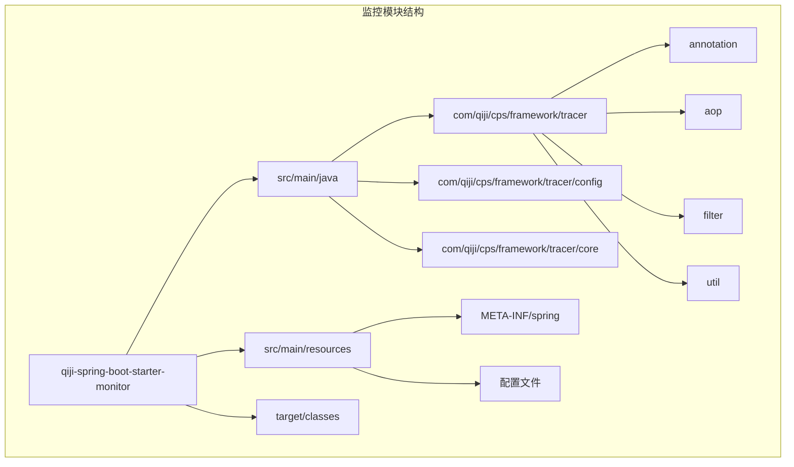
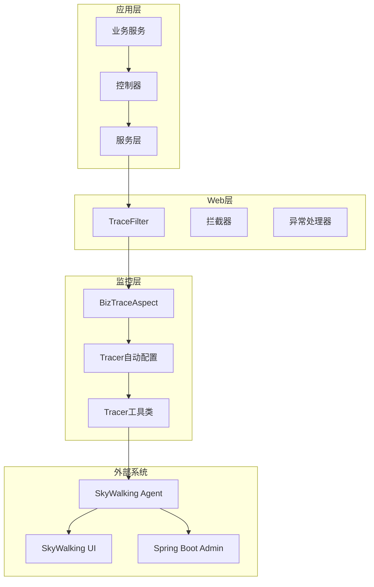
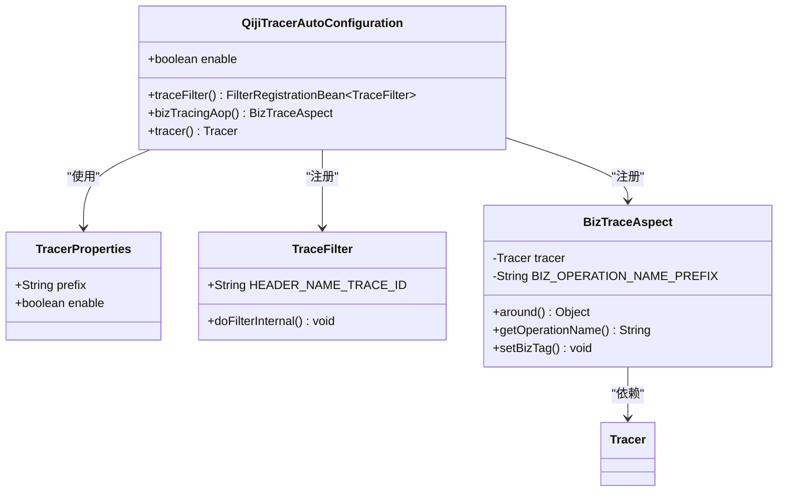
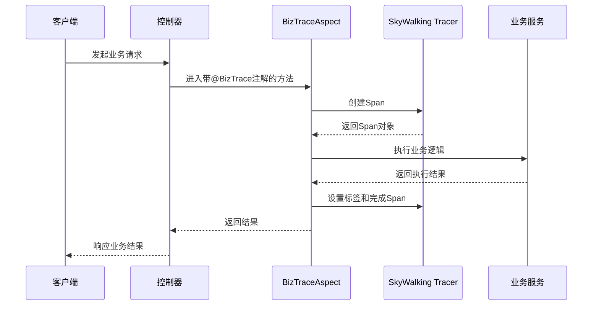
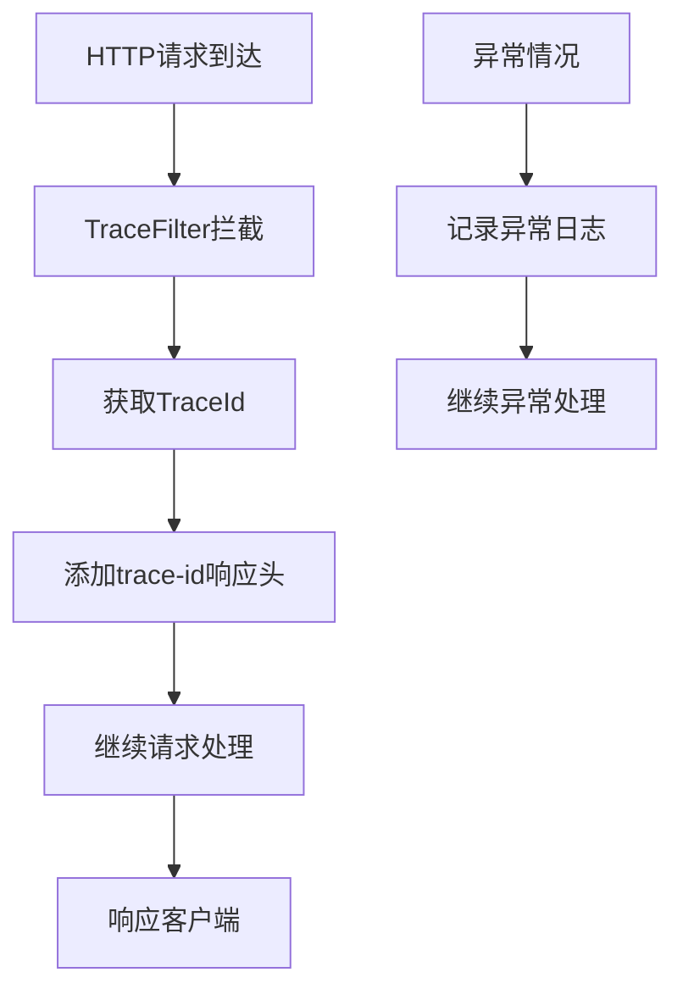
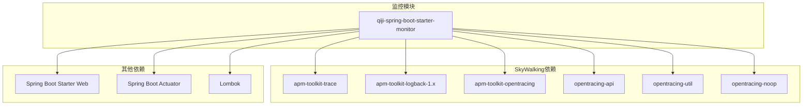

# 监控扩展模块

<cite>
**本文档引用的文件**
- [QijiTracerAutoConfiguration.java](file://backend/qiji-framework/qiji-spring-boot-starter-monitor/src/main/java/com/qiji/cps/framework/tracer/config/QijiTracerAutoConfiguration.java)
- [TracerProperties.java](file://backend/qiji-framework/qiji-spring-boot-starter-monitor/src/main/java/com/qiji/cps/framework/tracer/config/TracerProperties.java)
- [BizTraceAspect.java](file://backend/qiji-framework/qiji-spring-boot-starter-monitor/src/main/java/com/qiji/cps/framework/tracer/core/aop/BizTraceAspect.java)
- [TraceFilter.java](file://backend/qiji-framework/qiji-spring-boot-starter-monitor/src/main/java/com/qiji/cps/framework/tracer/core/filter/TraceFilter.java)
- [TracerUtils.java](file://backend/qiji-framework/qiji-common/src/main/java/com/qiji/cps/framework/common/util/monitor/TracerUtils.java)
- [package-info.java](file://backend/qiji-framework/qiji-spring-boot-starter-monitor/src/main/java/com/qiji/cps/framework/TracerAutoConfiguration.java)
- [org.springframework.boot.autoconfigure.AutoConfiguration.imports](file://backend/qiji-framework/qiji-spring-boot-starter-monitor/src/main/resources/META-INF/spring/org.springframework.boot.autoconfigure.AutoConfiguration.imports)
- [pom.xml](file://backend/qiji-framework/qiji-spring-boot-starter-monitor/pom.xml)
- [qiji-dependencies.pom.xml](file://backend/qiji-dependencies/pom.xml)
- [qiji-dependencies.flattened-pom.xml](file://backend/qiji-dependencies/.flattened-pom.xml)
- [index.vue](file://frontend/admin-vue3/src/views/infra/skywalking/index.vue)
</cite>

## 目录
1. [简介](#简介)
2. [项目结构](#项目结构)
3. [核心组件](#核心组件)
4. [架构概览](#架构概览)
5. [详细组件分析](#详细组件分析)
6. [依赖分析](#依赖分析)
7. [性能考虑](#性能考虑)
8. [故障排查指南](#故障排查指南)
9. [结论](#结论)
10. [附录](#附录)

## 简介

AgenticCPS项目的qiji-spring-boot-starter-monitor监控扩展模块是一个基于Spring Boot的监控解决方案，专注于链路追踪、监控端点和性能指标收集。该模块采用SkyWalking作为核心链路追踪引擎，提供了完整的监控基础设施，包括自动配置、AOP切面、过滤器和工具类。

该监控模块的主要特点包括：
- 基于SkyWalking的分布式链路追踪
- 自动配置的监控组件
- AOP切面实现的业务追踪
- HTTP过滤器支持的请求追踪
- 集成Spring Boot Actuator监控端点
- 支持Spring Boot Admin可视化管理

## 项目结构

监控扩展模块采用标准的Spring Boot Starter结构，主要包含以下目录结构：



**图表来源**
- [QijiTracerAutoConfiguration.java:1-54](file://backend/qiji-framework/qiji-spring-boot-starter-monitor/src/main/java/com/qiji/cps/framework/tracer/config/QijiTracerAutoConfiguration.java#L1-L54)
- [package-info.java:1-6](file://backend/qiji-framework/qiji-spring-boot-starter-monitor/src/main/java/com/qiji/cps/framework/TracerAutoConfiguration.java#L1-L6)

**章节来源**
- [QijiTracerAutoConfiguration.java:1-54](file://backend/qiji-framework/qiji-spring-boot-starter-monitor/src/main/java/com/qiji/cps/framework/tracer/config/QijiTracerAutoConfiguration.java#L1-L54)
- [org.springframework.boot.autoconfigure.AutoConfiguration.imports:1-200](file://backend/qiji-framework/qiji-spring-boot-starter-monitor/src/main/resources/META-INF/spring/org.springframework.boot.autoconfigure.AutoConfiguration.imports)

## 核心组件

监控模块的核心组件包括自动配置类、属性配置类、AOP切面、HTTP过滤器和工具类。这些组件协同工作，提供完整的监控功能。

### 自动配置类

自动配置类是监控模块的核心，负责根据条件自动配置监控组件。当前实现主要负责注册TraceFilter过滤器。

### 属性配置类

TracerProperties类提供监控相关的配置属性，目前为空配置类，预留未来扩展空间。

### AOP切面组件

BizTraceAspect类实现了业务追踪的AOP切面，通过注解驱动的方式自动记录业务操作的链路信息。

### HTTP过滤器组件

TraceFilter类在HTTP请求处理过程中添加trace-id响应头，便于客户端和服务端之间的链路追踪。

**章节来源**
- [QijiTracerAutoConfiguration.java:17-53](file://backend/qiji-framework/qiji-spring-boot-starter-monitor/src/main/java/com/qiji/cps/framework/tracer/config/QijiTracerAutoConfiguration.java#L17-L53)
- [TracerProperties.java:11-14](file://backend/qiji-framework/qiji-spring-boot-starter-monitor/src/main/java/com/qiji/cps/framework/tracer/config/TracerProperties.java#L11-L14)
- [BizTraceAspect.java:26-78](file://backend/qiji-framework/qiji-spring-boot-starter-monitor/src/main/java/com/qiji/cps/framework/tracer/core/aop/BizTraceAspect.java#L26-L78)
- [TraceFilter.java:17-34](file://backend/qiji-framework/qiji-spring-boot-starter-monitor/src/main/java/com/qiji/cps/framework/tracer/core/filter/TraceFilter.java#L17-L34)

## 架构概览

监控模块的整体架构采用分层设计，从上到下依次为应用层、Web层、监控层和外部系统层。



**图表来源**
- [QijiTracerAutoConfiguration.java:17-53](file://backend/qiji-framework/qiji-spring-boot-starter-monitor/src/main/java/com/qiji/cps/framework/tracer/config/QijiTracerAutoConfiguration.java#L17-L53)
- [BizTraceAspect.java:26-78](file://backend/qiji-framework/qiji-spring-boot-starter-monitor/src/main/java/com/qiji/cps/framework/tracer/core/aop/BizTraceAspect.java#L26-L78)
- [TraceFilter.java:17-34](file://backend/qiji-framework/qiji-spring-boot-starter-monitor/src/main/java/com/qiji/cps/framework/tracer/core/filter/TraceFilter.java#L17-L34)
- [TracerUtils.java:12-30](file://backend/qiji-framework/qiji-common/src/main/java/com/qiji/cps/framework/common/util/monitor/TracerUtils.java#L12-L30)

## 详细组件分析

### Tracer自动配置类分析

QijiTracerAutoConfiguration类是监控模块的核心自动配置类，负责根据条件自动注册监控组件。



**图表来源**
- [QijiTracerAutoConfiguration.java:17-53](file://backend/qiji-framework/qiji-spring-boot-starter-monitor/src/main/java/com/qiji/cps/framework/tracer/config/QijiTracerAutoConfiguration.java#L17-L53)
- [TracerProperties.java:11-14](file://backend/qiji-framework/qiji-spring-boot-starter-monitor/src/main/java/com/qiji/cps/framework/tracer/config/TracerProperties.java#L11-L14)
- [BizTraceAspect.java:26-78](file://backend/qiji-framework/qiji-spring-boot-starter-monitor/src/main/java/com/qiji/cps/framework/tracer/core/aop/BizTraceAspect.java#L26-L78)
- [TraceFilter.java:17-34](file://backend/qiji-framework/qiji-spring-boot-starter-monitor/src/main/java/com/qiji/cps/framework/tracer/core/filter/TraceFilter.java#L17-L34)

#### 自动配置条件分析

自动配置类使用了多个条件注解来控制组件的注册：

1. `@ConditionalOnClass`: 确保SkyWalking相关类存在
2. `@ConditionalOnProperty`: 基于配置属性控制启用状态
3. `@EnableConfigurationProperties`: 启用属性绑定

**章节来源**
- [QijiTracerAutoConfiguration.java:17-25](file://backend/qiji-framework/qiji-spring-boot-starter-monitor/src/main/java/com/qiji/cps/framework/tracer/config/QijiTracerAutoConfiguration.java#L17-L25)

### 业务追踪AOP切面分析

BizTraceAspect类实现了基于注解的业务追踪功能，通过AOP技术自动记录业务操作的链路信息。



**图表来源**
- [BizTraceAspect.java:35-54](file://backend/qiji-framework/qiji-spring-boot-starter-monitor/src/main/java/com/qiji/cps/framework/tracer/core/aop/BizTraceAspect.java#L35-L54)

#### 切面执行流程

1. **前置处理**: 创建Span并设置组件标签
2. **业务执行**: 调用目标方法
3. **异常处理**: 记录异常信息
4. **后置处理**: 设置业务标签并完成Span

**章节来源**
- [BizTraceAspect.java:35-75](file://backend/qiji-framework/qiji-spring-boot-starter-monitor/src/main/java/com/qiji/cps/framework/tracer/core/aop/BizTraceAspect.java#L35-L75)

### HTTP过滤器分析

TraceFilter类实现了HTTP请求的链路追踪功能，在请求处理过程中添加trace-id响应头。



**图表来源**
- [TraceFilter.java:24-31](file://backend/qiji-framework/qiji-spring-boot-starter-monitor/src/main/java/com/qiji/cps/framework/tracer/core/filter/TraceFilter.java#L24-L31)

#### 过滤器工作原理

1. **请求拦截**: 在请求进入时被拦截
2. **TraceId获取**: 通过TracerUtils获取当前请求的TraceId
3. **响应头设置**: 将TraceId添加到HTTP响应头中
4. **请求转发**: 继续处理后续的请求链

**章节来源**
- [TraceFilter.java:24-31](file://backend/qiji-framework/qiji-spring-boot-starter-monitor/src/main/java/com/qiji/cps/framework/tracer/core/filter/TraceFilter.java#L24-L31)

### 工具类分析

TracerUtils类提供了链路追踪相关的工具方法，目前主要提供TraceId获取功能。

**章节来源**
- [TracerUtils.java:26-28](file://backend/qiji-framework/qiji-common/src/main/java/com/qiji/cps/framework/common/util/monitor/TracerUtils.java#L26-L28)

## 依赖分析

监控模块的依赖关系相对简单，主要依赖SkyWalking相关的组件。



**图表来源**
- [qiji-dependencies.pom.xml:331-357](file://backend/qiji-dependencies/pom.xml#L331-L357)
- [qiji-dependencies.flattened-pom.xml:283-319](file://backend/qiji-dependencies/.flattened-pom.xml#L283-L319)

### 核心依赖说明

1. **apm-toolkit-trace**: SkyWalking提供的追踪工具包
2. **apm-toolkit-logback-1.x**: SkyWalking与Logback的日志集成
3. **apm-toolkit-opentracing**: OpenTracing规范的SkyWalking实现
4. **opentracing-api**: OpenTracing API规范

**章节来源**
- [qiji-dependencies.pom.xml:331-357](file://backend/qiji-dependencies/pom.xml#L331-L357)
- [qiji-dependencies.flattened-pom.xml:283-319](file://backend/qiji-dependencies/.flattened-pom.xml#L283-L319)

## 性能考虑

监控系统的性能优化是确保不影响业务正常运行的关键因素。以下是针对监控模块的性能考虑：

### 1. 异步处理
- SkyWalking Agent默认使用异步方式上报数据
- 减少对业务请求的阻塞影响

### 2. 缓存机制
- TraceId缓存避免重复计算
- 日志缓冲减少I/O操作

### 3. 条件启用
- 通过配置属性控制监控功能开关
- 在生产环境可以按需启用

### 4. 资源限制
- 设置最大缓冲区大小
- 限制Span数量和大小

## 故障排查指南

### 常见问题及解决方案

#### 1. SkyWalking Agent无法启动

**症状**: 应用启动时报错，提示SkyWalking Agent相关错误

**排查步骤**:
1. 检查SkyWalking Agent配置文件是否存在
2. 验证Agent版本与JVM版本兼容性
3. 确认Agent路径配置正确

**解决方案**:
- 更新SkyWalking Agent到兼容版本
- 检查JVM启动参数配置
- 验证网络连通性

#### 2. 链路追踪数据缺失

**症状**: SkyWalking UI中看不到链路数据

**排查步骤**:
1. 检查TraceFilter是否正确注册
2. 验证BizTrace注解是否正确使用
3. 确认TracerProperties配置正确

**解决方案**:
- 确保自动配置类正确加载
- 检查注解使用方式
- 验证配置属性值

#### 3. 性能问题

**症状**: 应用响应变慢，怀疑监控影响性能

**排查步骤**:
1. 检查监控数据上报频率
2. 分析内存使用情况
3. 监控CPU占用率

**解决方案**:
- 调整采样策略
- 优化数据上报配置
- 考虑降级监控功能

### 调试技巧

#### 1. 启用调试日志
```properties
logging.level.com.qiji.cps.framework.tracer=DEBUG
```

#### 2. 检查配置
验证监控相关配置是否正确加载：
- `qiji.tracer.enable=true`
- SkyWalking Agent配置正确

#### 3. 使用诊断工具
- Spring Boot Actuator端点
- SkyWalking UI诊断功能
- JVM性能监控工具

**章节来源**
- [QijiTracerAutoConfiguration.java:27-40](file://backend/qiji-framework/qiji-spring-boot-starter-monitor/src/main/java/com/qiji/cps/framework/tracer/config/QijiTracerAutoConfiguration.java#L27-L40)

## 结论

qiji-spring-boot-starter-monitor监控扩展模块为AgenticCPS项目提供了完整的监控解决方案。通过SkyWalking集成，该模块实现了分布式链路追踪、业务操作监控和性能指标收集。

### 主要优势

1. **自动配置**: 基于Spring Boot的自动配置机制，简化了监控组件的集成
2. **注解驱动**: 通过@BizTrace注解实现业务追踪，使用简单
3. **AOP切面**: 提供了强大的横切能力，无需修改业务代码
4. **HTTP过滤器**: 确保所有请求都有完整的链路追踪信息
5. **工具类支持**: 提供了便捷的Tracer工具类

### 最佳实践建议

1. **合理配置**: 根据业务需求调整监控粒度和采样策略
2. **性能监控**: 定期检查监控系统的性能影响
3. **数据治理**: 建立监控数据的生命周期管理
4. **安全考虑**: 确保监控数据的安全性和隐私保护
5. **成本控制**: 平衡监控精度和资源消耗

该监控模块为AgenticCPS项目提供了坚实的技术基础，有助于提升系统的可观测性和运维效率。

## 附录

### 配置示例

#### 基础配置
```yaml
qiji:
  tracer:
    enable: true
```

#### SkyWalking集成配置
```yaml
skywalking:
  agent:
    collector_backend_services: 127.0.0.1:11800
    service_name: agentic-cps
  tool:
    trace:
      enable: true
```

### 监控端点

#### Spring Boot Actuator
- `/actuator` - 基础监控端点
- `/actuator/metrics` - 指标数据
- `/actuator/health` - 健康检查

#### SkyWalking UI
- `/skywalking` - 可视化界面
- 支持实时链路追踪和性能分析

### 故障排查清单

- [ ] 确认SkyWalking Agent正确启动
- [ ] 验证TracerFilter正常工作
- [ ] 检查BizTrace注解使用正确性
- [ ] 确认配置属性加载成功
- [ ] 测试链路追踪数据上报
- [ ] 监控系统性能影响评估