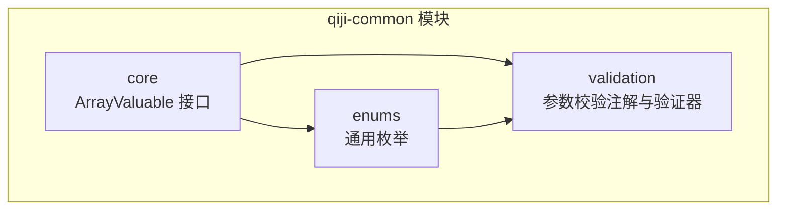
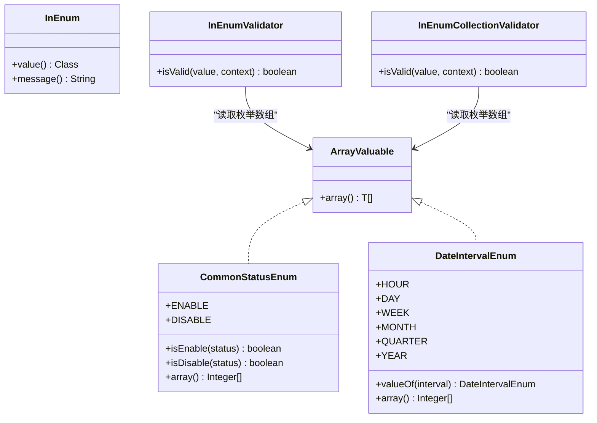
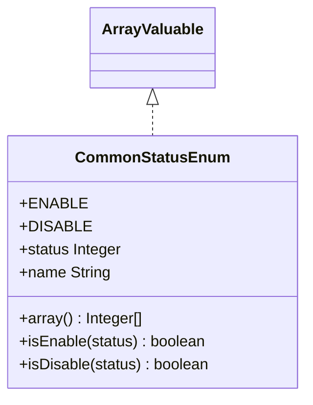
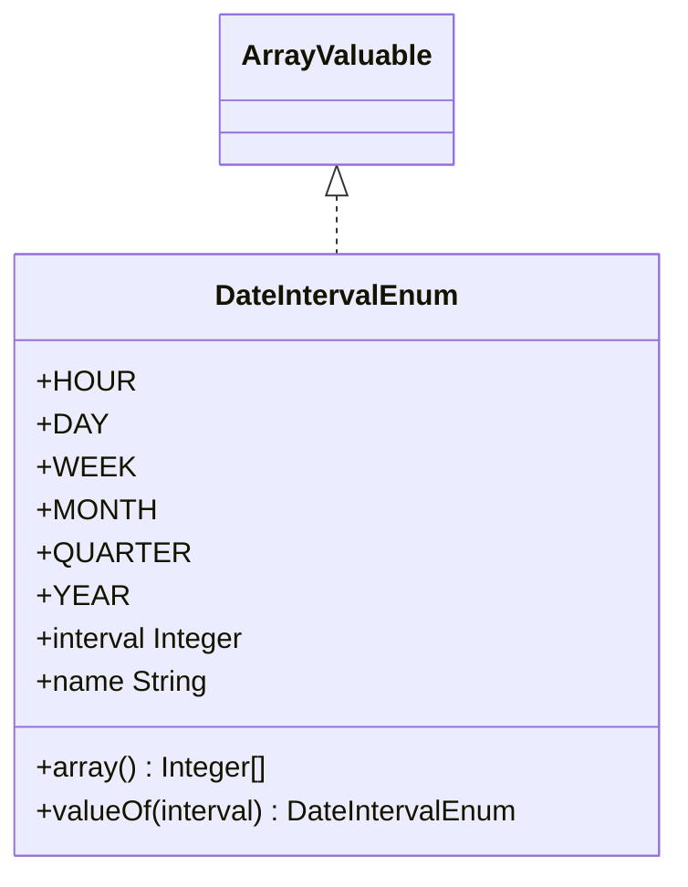
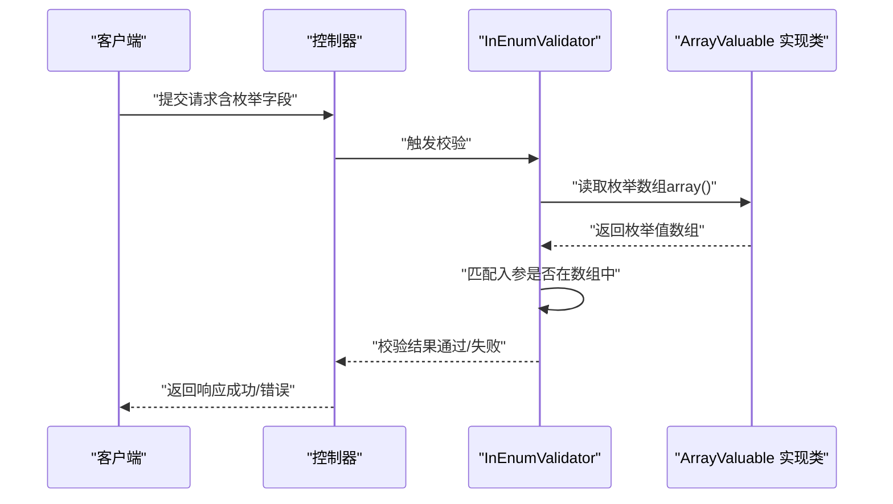
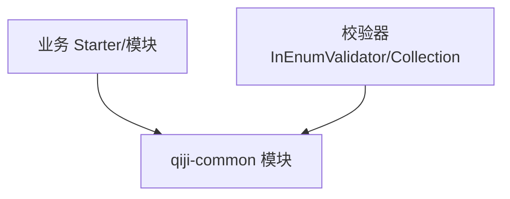

# 通用工具模块

<cite>
**本文引用的文件**
- [ArrayValuable.java](file://backend/qiji-framework/qiji-common/src/main/java/com/qiji/cps/framework/common/core/ArrayValuable.java)
- [CommonStatusEnum.java](file://backend/qiji-framework/qiji-common/src/main/java/com/qiji/cps/framework/common/enums/CommonStatusEnum.java)
- [DateIntervalEnum.java](file://backend/qiji-framework/qiji-common/src/main/java/com/qiji/cps/framework/common/enums/DateIntervalEnum.java)
- [InEnum.java](file://backend/qiji-framework/qiji-common/src/main/java/com/qiji/cps/framework/common/validation/InEnum.java)
- [InEnumValidator.java](file://backend/qiji-framework/qiji-common/src/main/java/com/qiji/cps/framework/common/validation/InEnumValidator.java)
- [InEnumCollectionValidator.java](file://backend/qiji-framework/qiji-common/src/main/java/com/qiji/cps/framework/common/validation/InEnumCollectionValidator.java)
- [pom.xml](file://backend/qiji-framework/qiji-common/pom.xml)
</cite>

## 目录
1. [简介](#简介)
2. [项目结构](#项目结构)
3. [核心组件](#核心组件)
4. [架构总览](#架构总览)
5. [详细组件分析](#详细组件分析)
6. [依赖关系分析](#依赖关系分析)
7. [性能考量](#性能考量)
8. [故障排查指南](#故障排查指南)
9. [结论](#结论)
10. [附录](#附录)

## 简介
本文件面向 AgenticCPS 项目的 qiji-common 通用工具模块，系统化梳理其设计理念、实现方式与最佳实践。该模块聚焦于“可复用、强约束、易扩展”的通用能力沉淀，覆盖以下方面：
- 枚举类型定义规范：统一数组生成接口、静态数组缓存、常用判断方法
- 校验注解与验证器：基于枚举数组进行参数合法性校验
- 基础接口与契约：定义可生成数组的统一接口，便于上层复用
- 业务异常处理机制：通过统一枚举与校验器形成“输入即约束”的防御式编程
- 公共常量与配置管理：通过枚举集中管理状态、区间等常量，避免散落配置

本模块不包含传统意义上的“字符串处理、集合操作、日期时间、加密解密”工具类，而是以“枚举+校验注解+基础接口”的组合方式，构建可复用的领域常量与参数校验能力。

## 项目结构
qiji-common 作为 qiji-framework 的子模块，采用 Maven 多模块组织，核心位于 core 与 enums 包下，并提供 validation 子包用于参数校验。其结构清晰、职责单一，便于被各业务模块依赖复用。

图表来源
- [ArrayValuable.java:1-15](file://backend/qiji-framework/qiji-common/src/main/java/com/qiji/cps/framework/common/core/ArrayValuable.java#L1-L15)
- [CommonStatusEnum.java:1-47](file://backend/qiji-framework/qiji-common/src/main/java/com/qiji/cps/framework/common/enums/CommonStatusEnum.java#L1-L47)
- [DateIntervalEnum.java:1-47](file://backend/qiji-framework/qiji-common/src/main/java/com/qiji/cps/framework/common/enums/DateIntervalEnum.java#L1-L47)
- [InEnum.java:1-40](file://backend/qiji-framework/qiji-common/src/main/java/com/qiji/cps/framework/common/validation/InEnum.java#L1-L40)
- [InEnumValidator.java:1-40](file://backend/qiji-framework/qiji-common/src/main/java/com/qiji/cps/framework/common/validation/InEnumValidator.java#L1-L40)
- [InEnumCollectionValidator.java:1-40](file://backend/qiji-framework/qiji-common/src/main/java/com/qiji/cps/framework/common/validation/InEnumCollectionValidator.java#L1-L40)

章节来源
- [pom.xml:1-16](file://backend/qiji-framework/qiji-common/pom.xml#L1-L16)

## 核心组件
- ArrayValuable 接口：定义统一的数组生成契约，所有实现类可暴露自身枚举值数组，便于上层进行批量校验与展示。
- 通用枚举：如 CommonStatusEnum、DateIntervalEnum，均实现 ArrayValuable，提供静态数组与常用判断方法，降低重复代码。
- 校验注解与验证器：InEnum、InEnumValidator、InEnumCollectionValidator，基于 ArrayValuable 的数组能力，对入参进行枚举范围校验。

章节来源
- [ArrayValuable.java:1-15](file://backend/qiji-framework/qiji-common/src/main/java/com/qiji/cps/framework/common/core/ArrayValuable.java#L1-L15)
- [CommonStatusEnum.java:1-47](file://backend/qiji-framework/qiji-common/src/main/java/com/qiji/cps/framework/common/enums/CommonStatusEnum.java#L1-L47)
- [DateIntervalEnum.java:1-47](file://backend/qiji-framework/qiji-common/src/main/java/com/qiji/cps/framework/common/enums/DateIntervalEnum.java#L1-L47)
- [InEnum.java:1-40](file://backend/qiji-framework/qiji-common/src/main/java/com/qiji/cps/framework/common/validation/InEnum.java#L1-L40)
- [InEnumValidator.java:1-40](file://backend/qiji-framework/qiji-common/src/main/java/com/qiji/cps/framework/common/validation/InEnumValidator.java#L1-L40)
- [InEnumCollectionValidator.java:1-40](file://backend/qiji-framework/qiji-common/src/main/java/com/qiji/cps/framework/common/validation/InEnumCollectionValidator.java#L1-L40)

## 架构总览
qiji-common 的架构围绕“接口 + 枚举 + 注解校验”的三层设计展开：
- 基础层：ArrayValuable 提供统一数组生成能力
- 业务层：通用枚举实现 ArrayValuable，提供静态数组与常用判断
- 应用层：InEnum 注解 + 验证器对请求参数进行枚举范围校验

图表来源
- [ArrayValuable.java:1-15](file://backend/qiji-framework/qiji-common/src/main/java/com/qiji/cps/framework/common/core/ArrayValuable.java#L1-L15)
- [CommonStatusEnum.java:1-47](file://backend/qiji-framework/qiji-common/src/main/java/com/qiji/cps/framework/common/enums/CommonStatusEnum.java#L1-L47)
- [DateIntervalEnum.java:1-47](file://backend/qiji-framework/qiji-common/src/main/java/com/qiji/cps/framework/common/enums/DateIntervalEnum.java#L1-L47)
- [InEnum.java:1-40](file://backend/qiji-framework/qiji-common/src/main/java/com/qiji/cps/framework/common/validation/InEnum.java#L1-L40)
- [InEnumValidator.java:1-40](file://backend/qiji-framework/qiji-common/src/main/java/com/qiji/cps/framework/common/validation/InEnumValidator.java#L1-L40)
- [InEnumCollectionValidator.java:1-40](file://backend/qiji-framework/qiji-common/src/main/java/com/qiji/cps/framework/common/validation/InEnumCollectionValidator.java#L1-L40)

## 详细组件分析

### ArrayValuable 接口
- 设计目的：为枚举类提供统一的数组生成能力，避免在每个枚举中重复实现数组转换逻辑。
- 关键点：
  - array() 方法返回泛型数组，便于上层以类型安全的方式使用
  - 与校验器配合，实现对入参的批量枚举范围校验
- 使用建议：
  - 所有需要暴露枚举值数组的枚举应实现该接口
  - 在枚举中维护静态数组，减少运行时计算开销

章节来源
- [ArrayValuable.java:1-15](file://backend/qiji-framework/qiji-common/src/main/java/com/qiji/cps/framework/common/core/ArrayValuable.java#L1-L15)

### 通用状态枚举（CommonStatusEnum）
- 功能概述：提供“启用/禁用”两类状态，内置静态数组与常用判断方法，简化状态判断逻辑。
- 关键点：
  - 实现 ArrayValuable<Integer>，提供整型状态值数组
  - 提供 isEnable/isDisable 静态方法，基于对象比较工具进行相等性判断
- 使用场景：
  - 用户状态、开关配置、业务流程状态等
- 最佳实践：
  - 与 InEnum 注解配合，确保入参仅允许枚举内的状态值
  - 在数据库字段与前端展示中保持一致的状态编码

图表来源
- [CommonStatusEnum.java:1-47](file://backend/qiji-framework/qiji-common/src/main/java/com/qiji/cps/framework/common/enums/CommonStatusEnum.java#L1-L47)

章节来源
- [CommonStatusEnum.java:1-47](file://backend/qiji-framework/qiji-common/src/main/java/com/qiji/cps/framework/common/enums/CommonStatusEnum.java#L1-L47)

### 时间间隔枚举（DateIntervalEnum）
- 功能概述：定义小时、天、周、月、季度、年等时间间隔，提供从整型到枚举的映射方法。
- 关键点：
  - 实现 ArrayValuable<Integer>，提供整型间隔数组
  - 提供 valueOf(Integer) 方法，基于数组匹配实现枚举查找
- 使用场景：
  - 报表统计周期、缓存过期策略、时间窗口计算等
- 最佳实践：
  - 与前端选择器联动，保证前后端对间隔值的一致理解
  - 在业务规则中优先使用枚举而非魔法数字

图表来源
- [DateIntervalEnum.java:1-47](file://backend/qiji-framework/qiji-common/src/main/java/com/qiji/cps/framework/common/enums/DateIntervalEnum.java#L1-L47)

章节来源
- [DateIntervalEnum.java:1-47](file://backend/qiji-framework/qiji-common/src/main/java/com/qiji/cps/framework/common/enums/DateIntervalEnum.java#L1-L47)

### 参数校验注解与验证器（InEnum 系列）
- InEnum 注解：声明某个字段必须属于指定的枚举数组范围内。
- InEnumValidator：单值校验器，遍历枚举数组进行匹配。
- InEnumCollectionValidator：集合校验器，逐项校验集合元素是否在枚举数组内。
- 工作流程：

图表来源
- [InEnum.java:1-40](file://backend/qiji-framework/qiji-common/src/main/java/com/qiji/cps/framework/common/validation/InEnum.java#L1-L40)
- [InEnumValidator.java:1-40](file://backend/qiji-framework/qiji-common/src/main/java/com/qiji/cps/framework/common/validation/InEnumValidator.java#L1-L40)
- [InEnumCollectionValidator.java:1-40](file://backend/qiji-framework/qiji-common/src/main/java/com/qiji/cps/framework/common/validation/InEnumCollectionValidator.java#L1-L40)
- [ArrayValuable.java:1-15](file://backend/qiji-framework/qiji-common/src/main/java/com/qiji/cps/framework/common/core/ArrayValuable.java#L1-L15)

章节来源
- [InEnum.java:1-40](file://backend/qiji-framework/qiji-common/src/main/java/com/qiji/cps/framework/common/validation/InEnum.java#L1-L40)
- [InEnumValidator.java:1-40](file://backend/qiji-framework/qiji-common/src/main/java/com/qiji/cps/framework/common/validation/InEnumValidator.java#L1-L40)
- [InEnumCollectionValidator.java:1-40](file://backend/qiji-framework/qiji-common/src/main/java/com/qiji/cps/framework/common/validation/InEnumCollectionValidator.java#L1-L40)

### 设计原则与最佳实践
- 单一职责：每个枚举只负责一种维度的常量定义，避免“大而全”的枚举类
- 类型安全：通过泛型与接口约束，确保 array() 返回类型与枚举值类型一致
- 性能友好：在枚举中缓存静态数组，避免每次调用重新构造
- 易扩展：新增枚举只需实现 ArrayValuable 并提供静态数组，即可被校验器自动识别
- 防御式编程：通过 InEnum 注解与验证器，在入口处拦截非法参数，降低后续处理成本

## 依赖关系分析
- qiji-common 作为基础模块，不直接依赖业务模块；其对外输出为接口与枚举，供上层模块依赖
- 上层模块（如各业务 starter 或具体业务模块）通过引入 qiji-common，获得统一的枚举与校验能力
- 校验器依赖 ArrayValuable 接口，间接依赖所有实现类的 array() 方法

图表来源
- [pom.xml:1-16](file://backend/qiji-framework/qiji-common/pom.xml#L1-L16)
- [InEnumValidator.java:1-40](file://backend/qiji-framework/qiji-common/src/main/java/com/qiji/cps/framework/common/validation/InEnumValidator.java#L1-L40)
- [InEnumCollectionValidator.java:1-40](file://backend/qiji-framework/qiji-common/src/main/java/com/qiji/cps/framework/common/validation/InEnumCollectionValidator.java#L1-L40)

章节来源
- [pom.xml:1-16](file://backend/qiji-framework/qiji-common/pom.xml#L1-L16)

## 性能考量
- 枚举数组缓存：在枚举中维护静态数组，避免运行时重复计算，降低 GC 压力
- 校验算法：InEnumValidator 与 InEnumCollectionValidator 基于线性扫描，复杂度 O(n)，n 为枚举数量；对于小规模枚举（通常几十以内）影响可忽略
- 扩展建议：若未来枚举规模扩大，可考虑将枚举值放入 Set 中进行 O(1) 查找，或在枚举内部维护有序数组并使用二分查找

## 故障排查指南
- 参数校验失败
  - 症状：接口返回参数非法错误
  - 排查要点：确认入参值是否在对应枚举的 array() 结果集中；检查枚举是否正确实现 ArrayValuable
  - 相关文件：[InEnum.java:1-40](file://backend/qiji-framework/qiji-common/src/main/java/com/qiji/cps/framework/common/validation/InEnum.java#L1-L40)、[InEnumValidator.java:1-40](file://backend/qiji-framework/qiji-common/src/main/java/com/qiji/cps/framework/common/validation/InEnumValidator.java#L1-L40)、[InEnumCollectionValidator.java:1-40](file://backend/qiji-framework/qiji-common/src/main/java/com/qiji/cps/framework/common/validation/InEnumCollectionValidator.java#L1-L40)
- 枚举映射异常
  - 症状：通过整型值无法映射到对应枚举
  - 排查要点：确认枚举的整型值是否唯一且与业务约定一致；检查 valueOf 方法的匹配逻辑
  - 相关文件：[DateIntervalEnum.java:1-47](file://backend/qiji-framework/qiji-common/src/main/java/com/qiji/cps/framework/common/enums/DateIntervalEnum.java#L1-L47)
- 状态判断错误
  - 症状：isEnable/isDisable 判断不符合预期
  - 排查要点：确认传入状态值与枚举定义的值一致；检查对象比较工具的使用
  - 相关文件：[CommonStatusEnum.java:1-47](file://backend/qiji-framework/qiji-common/src/main/java/com/qiji/cps/framework/common/enums/CommonStatusEnum.java#L1-L47)

章节来源
- [InEnum.java:1-40](file://backend/qiji-framework/qiji-common/src/main/java/com/qiji/cps/framework/common/validation/InEnum.java#L1-L40)
- [InEnumValidator.java:1-40](file://backend/qiji-framework/qiji-common/src/main/java/com/qiji/cps/framework/common/validation/InEnumValidator.java#L1-L40)
- [InEnumCollectionValidator.java:1-40](file://backend/qiji-framework/qiji-common/src/main/java/com/qiji/cps/framework/common/validation/InEnumCollectionValidator.java#L1-L40)
- [CommonStatusEnum.java:1-47](file://backend/qiji-framework/qiji-common/src/main/java/com/qiji/cps/framework/common/enums/CommonStatusEnum.java#L1-L47)
- [DateIntervalEnum.java:1-47](file://backend/qiji-framework/qiji-common/src/main/java/com/qiji/cps/framework/common/enums/DateIntervalEnum.java#L1-L47)

## 结论
qiji-common 通过“接口 + 枚举 + 注解校验”的组合，构建了高内聚、低耦合的通用工具能力。其设计遵循单一职责、类型安全与性能友好的原则，既满足当前业务需求，又为未来扩展预留空间。建议在新业务中优先复用该模块提供的枚举与校验能力，减少重复造轮子，提升整体一致性与可维护性。

## 附录
- 如何在业务模块中复用
  - 引入 qiji-common 依赖
  - 在实体类或 DTO 字段上使用 InEnum 注解，声明允许的枚举范围
  - 在枚举类中实现 ArrayValuable 并提供静态数组
  - 通过 Spring Boot 自动注册的校验器完成参数校验
- 如何扩展自定义工具类
  - 若需新增校验场景，可在 validation 包下新增注解与验证器，并遵循现有模式
  - 若需新增通用常量，建议以枚举形式封装，并实现 ArrayValuable 接口