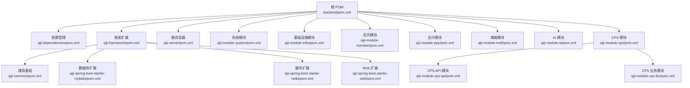
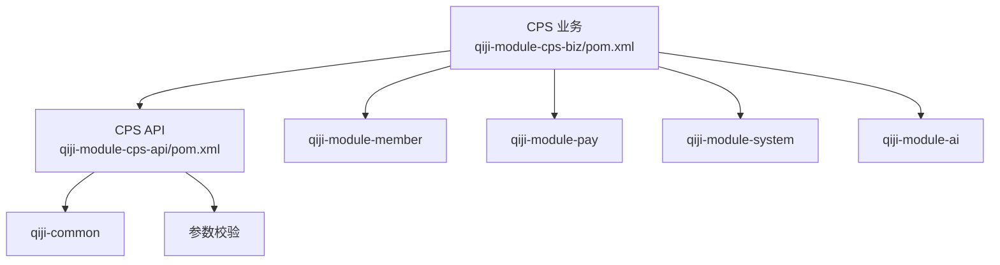
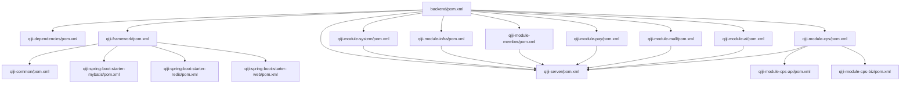

# 模块设计

<cite>
**本文引用的文件**
- [backend/pom.xml](file://backend/pom.xml)
- [backend/qiji-dependencies/pom.xml](file://backend/qiji-dependencies/pom.xml)
- [backend/qiji-framework/pom.xml](file://backend/qiji-framework/pom.xml)
- [backend/qiji-framework/qiji-common/pom.xml](file://backend/qiji-framework/qiji-common/pom.xml)
- [backend/qiji-framework/qiji-spring-boot-starter-mybatis/pom.xml](file://backend/qiji-framework/qiji-spring-boot-starter-mybatis/pom.xml)
- [backend/qiji-framework/qiji-spring-boot-starter-redis/pom.xml](file://backend/qiji-framework/qiji-spring-boot-starter-redis/pom.xml)
- [backend/qiji-framework/qiji-spring-boot-starter-web/pom.xml](file://backend/qiji-framework/qiji-spring-boot-starter-web/pom.xml)
- [backend/qiji-module-system/pom.xml](file://backend/qiji-module-system/pom.xml)
- [backend/qiji-module-infra/pom.xml](file://backend/qiji-module-infra/pom.xml)
- [backend/qiji-module-member/pom.xml](file://backend/qiji-module-member/pom.xml)
- [backend/qiji-module-pay/pom.xml](file://backend/qiji-module-pay/pom.xml)
- [backend/qiji-module-mall/pom.xml](file://backend/qiji-module-mall/pom.xml)
- [backend/qiji-module-cps/pom.xml](file://backend/qiji-module-cps/pom.xml)
- [backend/qiji-module-cps/qiji-module-cps-api/pom.xml](file://backend/qiji-module-cps/qiji-module-cps-api/pom.xml)
- [backend/qiji-module-cps/qiji-module-cps-biz/pom.xml](file://backend/qiji-module-cps/qiji-module-cps-biz/pom.xml)
- [backend/qiji-module-ai/pom.xml](file://backend/qiji-module-ai/pom.xml)
- [backend/qiji-server/pom.xml](file://backend/qiji-server/pom.xml)
</cite>

## 目录
1. [引言](#引言)
2. [项目结构](#项目结构)
3. [核心组件](#核心组件)
4. [架构总览](#架构总览)
5. [详细组件分析](#详细组件分析)
6. [依赖分析](#依赖分析)
7. [性能考虑](#性能考虑)
8. [故障排查指南](#故障排查指南)
9. [结论](#结论)
10. [附录](#附录)

## 引言
本文件面向 AgenticCPS 项目，系统性梳理其 Maven 多模块组织结构与模块间依赖关系，重点覆盖以下方面：
- 依赖管理：qiji-dependencies 的统一版本与依赖聚合
- 框架扩展：qiji-framework 的技术与业务组件封装
- 业务模块：系统管理、基础设施、CPS 联盟返利、AI 智能等模块的职责与边界
- 模块通信：API 模块与业务模块的解耦方式
- 配置与生命周期：如何通过 starter 组件实现自动装配与生命周期管理
- 模块化收益与挑战：可维护性、可扩展性与潜在复杂度

## 项目结构
AgenticCPS 后端采用多模块聚合工程，顶层 POM 声明了模块清单，并通过 qiji-dependencies 提供统一依赖版本管理；qiji-framework 将常用技术栈与业务组件抽象为可复用的 starter；业务模块围绕系统、基础设施、商城、支付、会员、AI、CPS 等领域展开；qiji-server 作为打包容器，按需装配业务模块。

图表来源
- [backend/pom.xml:10-25](file://backend/pom.xml#L10-L25)
- [backend/qiji-dependencies/pom.xml:84-687](file://backend/qiji-dependencies/pom.xml#L84-L687)
- [backend/qiji-framework/pom.xml:12-31](file://backend/qiji-framework/pom.xml#L12-L31)
- [backend/qiji-module-cps/pom.xml:21-24](file://backend/qiji-module-cps/pom.xml#L21-L24)

章节来源
- [backend/pom.xml:10-25](file://backend/pom.xml#L10-L25)
- [backend/qiji-dependencies/pom.xml:84-687](file://backend/qiji-dependencies/pom.xml#L84-L687)
- [backend/qiji-framework/pom.xml:12-31](file://backend/qiji-framework/pom.xml#L12-L31)
- [backend/qiji-module-cps/pom.xml:21-24](file://backend/qiji-module-cps/pom.xml#L21-L24)

## 核心组件
- 依赖管理（qiji-dependencies）
  - 作用：集中管理 Spring Boot、MyBatis、Redis、监控、安全、消息队列、工具类等生态组件的版本与依赖坐标，避免版本漂移与冲突
  - 关键点：通过 dependencyManagement 导入 spring-boot-dependencies 与各子依赖，业务模块仅需声明坐标即可继承版本
- 框架扩展（qiji-framework）
  - 作用：将通用技术能力封装为 starter，如 Web、MyBatis、Redis、Security、Monitor、Protection、Job、MQ、Excel、Test、Biz-tenant、Biz-data-permission、Biz-ip 等
  - 设计：每个 starter 下包含 core 与 config 两部分，便于按需装配与隔离
- 业务模块
  - 系统模块（qiji-module-system）：用户、部门、权限、数据字典、登录/操作日志、邮件、验证码等
  - 基础设施模块（qiji-module-infra）：定时任务、运维管理、代码生成、接口文档、Spring Boot Admin、文件客户端、监控等
  - 会员模块（qiji-module-member）：会员中心、用户画像、数据权限、IP 维度校验等
  - 支付模块（qiji-module-pay）：商户、应用、支付、退款、三方 SDK（支付宝、微信）
  - 商城模块（qiji-module-mall）：商品、营销、交易、统计，以及 trade-api 抽离以打破循环依赖
  - AI 模块（qiji-module-ai）：接入多模型（OpenAI、通义、文心、DeepSeek、Ollama、Stable Diffusion 等），向量存储、MCP、TinyFlow 工作流
  - CPS 模块（qiji-module-cps）：平台管理、推广位、订单同步、返利计算、提现、MCP AI 接口；拆分为 API 与 Biz 两层
  - 服务容器（qiji-server）：按需装配业务模块，打包为可执行 jar

章节来源
- [backend/qiji-dependencies/pom.xml:84-687](file://backend/qiji-dependencies/pom.xml#L84-L687)
- [backend/qiji-framework/pom.xml:12-31](file://backend/qiji-framework/pom.xml#L12-L31)
- [backend/qiji-module-system/pom.xml:20-122](file://backend/qiji-module-system/pom.xml#L20-L122)
- [backend/qiji-module-infra/pom.xml:21-117](file://backend/qiji-module-infra/pom.xml#L21-L117)
- [backend/qiji-module-member/pom.xml:20-84](file://backend/qiji-module-member/pom.xml#L20-L84)
- [backend/qiji-module-pay/pom.xml:21-81](file://backend/qiji-module-pay/pom.xml#L21-L81)
- [backend/qiji-module-mall/pom.xml:20-33](file://backend/qiji-module-mall/pom.xml#L20-L33)
- [backend/qiji-module-ai/pom.xml:28-262](file://backend/qiji-module-ai/pom.xml#L28-L262)
- [backend/qiji-module-cps/pom.xml:21-24](file://backend/qiji-module-cps/pom.xml#L21-L24)
- [backend/qiji-server/pom.xml:23-114](file://backend/qiji-server/pom.xml#L23-L114)

## 架构总览
AgenticCPS 采用“依赖管理 + 框架扩展 + 业务模块 + 服务容器”的分层架构：
- 依赖管理层：统一版本与坐标，确保一致性
- 框架扩展层：提供开箱即用的技术与业务组件
- 业务模块层：按领域划分，低耦合高内聚
- 服务容器层：按需装配，形成最终可运行的服务

```mermaid
graph TB
subgraph "依赖管理层"
Deps["qiji-dependencies"]
end
subgraph "框架扩展层"
Common["qiji-common"]
MyBatis["qiji-spring-boot-starter-mybatis"]
Redis["qiji-spring-boot-starter-redis"]
Web["qiji-spring-boot-starter-web"]
Sec["qiji-spring-boot-starter-security"]
MQ["qiji-spring-boot-starter-mq"]
Job["qiji-spring-boot-starter-job"]
Mon["qiji-spring-boot-starter-monitor"]
Test["qiji-spring-boot-starter-test"]
BizTenant["qiji-spring-boot-starter-biz-tenant"]
BizPerm["qiji-spring-boot-starter-biz-data-permission"]
BizIP["qiji-spring-boot-starter-biz-ip"]
end
subgraph "业务模块层"
Sys["qiji-module-system"]
Infra["qiji-module-infra"]
Member["qiji-module-member"]
Pay["qiji-module-pay"]
Mall["qiji-module-mall"]
AI["qiji-module-ai"]
CPS["qiji-module-cps"]
end
subgraph "服务容器层"
Server["qiji-server"]
end
Deps --> Common
Deps --> MyBatis
Deps --> Redis
Deps --> Web
Deps --> Sec
Deps --> MQ
Deps --> Job
Deps --> Mon
Deps --> Test
Deps --> BizTenant
Deps --> BizPerm
Deps --> BizIP
Common --> Sys
Common --> Infra
Common --> Member
Common --> Pay
Common --> Mall
Common --> AI
Common --> CPS
MyBatis --> Sys
MyBatis --> Infra
MyBatis --> Member
MyBatis --> Pay
MyBatis --> Mall
MyBatis --> AI
MyBatis --> CPS
Redis --> Sys
Redis --> Infra
Redis --> Member
Redis --> Pay
Redis --> Mall
Redis --> AI
Redis --> CPS
Web --> Sys
Web --> Infra
Web --> Member
Web --> Pay
Web --> Mall
Web --> AI
Web --> CPS
Sec --> Sys
Sec --> Infra
Sec --> Member
Sec --> Pay
Sec --> Mall
Sec --> AI
Sec --> CPS
MQ --> Sys
MQ --> Infra
MQ --> Member
MQ --> Pay
MQ --> Mall
MQ --> AI
MQ --> CPS
Job --> Sys
Job --> Infra
Job --> Member
Job --> Pay
Job --> Mall
Job --> AI
Job --> CPS
Mon --> Sys
Mon --> Infra
Mon --> Member
Mon --> Pay
Mon --> Mall
Mon --> AI
Mon --> CPS
Test --> Sys
Test --> Infra
Test --> Member
Test --> Pay
Test --> Mall
Test --> AI
Test --> CPS
BizTenant --> Sys
BizTenant --> Infra
BizTenant --> Member
BizTenant --> Pay
BizTenant --> Mall
BizTenant --> AI
BizTenant --> CPS
BizPerm --> Sys
BizPerm --> Infra
BizPerm --> Member
BizPerm --> Pay
BizPerm --> Mall
BizPerm --> AI
BizPerm --> CPS
BizIP --> Sys
BizIP --> Infra
BizIP --> Member
BizIP --> Pay
BizIP --> Mall
BizIP --> AI
BizIP --> CPS
Sys --> Server
Infra --> Server
Member --> Server
Pay --> Server
Mall --> Server
AI --> Server
CPS --> Server
```

图表来源
- [backend/qiji-dependencies/pom.xml:84-687](file://backend/qiji-dependencies/pom.xml#L84-L687)
- [backend/qiji-framework/pom.xml:12-31](file://backend/qiji-framework/pom.xml#L12-L31)
- [backend/qiji-server/pom.xml:23-99](file://backend/qiji-server/pom.xml#L23-L99)

## 详细组件分析

### 系统模块（qiji-module-system）
- 职责
  - 用户、部门、角色、菜单、字典、操作日志、登录日志、数据权限、租户隔离、IP 校验、验证码、社交登录、邮件发送等
- 依赖要点
  - 依赖 qiji-module-infra 提供的运维与研发工具能力
  - 依赖各类 starter（Web、Security、MyBatis、Redis、Job、MQ、Excel、Test 等）
- 生命周期与配置
  - 通过 qiji-spring-boot-starter-web、qiji-spring-boot-starter-security、qiji-spring-boot-starter-mybatis、qiji-spring-boot-starter-redis 等自动装配
  - 通过 qiji-dependencies 统一版本，避免冲突

章节来源
- [backend/qiji-module-system/pom.xml:20-122](file://backend/qiji-module-system/pom.xml#L20-L122)

### 基础设施模块（qiji-module-infra）
- 职责
  - 定时任务管理、服务器信息、代码生成器、接口文档、Spring Boot Admin、FTP/SFTP、S3、文件类型识别等
- 依赖要点
  - 依赖 qiji-spring-boot-starter-* 系列与 qiji-common
  - 依赖 mybatis-plus-generator、velocity、spring-boot-admin 等
- 生命周期与配置
  - 通过 qiji-spring-boot-starter-job、qiji-spring-boot-starter-websocket、qiji-spring-boot-starter-monitor 等自动装配

章节来源
- [backend/qiji-module-infra/pom.xml:21-117](file://backend/qiji-module-infra/pom.xml#L21-L117)

### 会员模块（qiji-module-member）
- 职责
  - 会员中心、用户画像、数据权限、IP 校验、消息队列事件等
- 依赖要点
  - 依赖 qiji-module-system 与 qiji-module-infra，复用其能力
  - 依赖 qiji-spring-boot-starter-* 系列与 qiji-common
- 生命周期与配置
  - 通过 starter 自动装配，结合业务组件（租户、数据权限、IP）实现多租户与安全控制

章节来源
- [backend/qiji-module-member/pom.xml:20-84](file://backend/qiji-module-member/pom.xml#L20-L84)

### 支付模块（qiji-module-pay）
- 职责
  - 商户、应用、支付、退款、三方支付 SDK（支付宝、微信）
- 依赖要点
  - 依赖 qiji-module-system（权限与日志）
  - 依赖 qiji-spring-boot-starter-* 系列与 qiji-common
- 生命周期与配置
  - 通过 starter 自动装配，结合定时任务处理对账与异步通知

章节来源
- [backend/qiji-module-pay/pom.xml:21-81](file://backend/qiji-module-pay/pom.xml#L21-L81)

### 商城模块（qiji-module-mall）
- 职责
  - 商品、营销、交易、统计四大子域；trade-api 抽离以消除循环依赖
- 依赖要点
  - 通过 trade-api 与 trade、promotion 解耦
  - 依赖 qiji-spring-boot-starter-* 系列与 qiji-common
- 生命周期与配置
  - 通过 starter 自动装配，结合 Job、MQ 实现异步与定时任务

章节来源
- [backend/qiji-module-mall/pom.xml:20-33](file://backend/qiji-module-mall/pom.xml#L20-L33)

### AI 模块（qiji-module-ai）
- 职责
  - 大模型接入（OpenAI、通义、文心、DeepSeek、Ollama、Stable Diffusion 等）、向量存储（Qdrant、Redis、Milvus）、MCP 服务端/客户端、TinyFlow 工作流
- 依赖要点
  - 依赖 qiji-module-system 与 qiji-module-infra 提供的基础能力
  - 依赖 qiji-dependencies 中的 Spring AI 与向量存储相关 starter
- 生命周期与配置
  - 通过 starter 自动装配，结合 Job、MQ 实现异步任务与事件驱动

章节来源
- [backend/qiji-module-ai/pom.xml:28-262](file://backend/qiji-module-ai/pom.xml#L28-L262)

### CPS 模块（qiji-module-cps）
- 职责
  - 平台管理、推广位、订单同步、返利计算、提现管理、MCP AI 接口
- 结构
  - API 层：对外暴露的接口与枚举，供其他模块复用
  - 业务层：核心业务逻辑，依赖 member、pay、system 等模块
- 依赖要点
  - API 层依赖 qiji-common 与参数校验
  - 业务层依赖 qiji-module-member、qiji-module-pay、qiji-module-system，以及 qiji-module-ai（MCP 工具函数）
- 生命周期与配置
  - 通过 starter 自动装配，结合 Job、MQ 实现定时同步与异步处理

图表来源
- [backend/qiji-module-cps/qiji-module-cps-api/pom.xml:19-31](file://backend/qiji-module-cps/qiji-module-cps-api/pom.xml#L19-L31)
- [backend/qiji-module-cps/qiji-module-cps-biz/pom.xml:20-99](file://backend/qiji-module-cps/qiji-module-cps-biz/pom.xml#L20-L99)

章节来源
- [backend/qiji-module-cps/pom.xml:21-24](file://backend/qiji-module-cps/pom.xml#L21-L24)
- [backend/qiji-module-cps/qiji-module-cps-api/pom.xml:19-31](file://backend/qiji-module-cps/qiji-module-cps-api/pom.xml#L19-L31)
- [backend/qiji-module-cps/qiji-module-cps-biz/pom.xml:20-99](file://backend/qiji-module-cps/qiji-module-cps-biz/pom.xml#L20-L99)

### 服务容器（qiji-server）
- 职责
  - 作为打包容器，按需装配业务模块，形成最终可运行的服务
- 依赖要点
  - 默认装配 system、infra、member、report、pay、mp、product、promotion、trade、statistics、ai、cps-biz
  - 通过 spring-boot-maven-plugin 打包为可执行 jar
- 生命周期与配置
  - 通过依赖装配实现自动装配，按需启用模块以优化编译与启动时间

章节来源
- [backend/qiji-server/pom.xml:23-114](file://backend/qiji-server/pom.xml#L23-L114)

## 依赖分析
- 顶层聚合
  - backend/pom.xml 声明模块清单并导入 qiji-dependencies，实现版本与依赖的集中管理
- 模块间依赖
  - 业务模块普遍依赖 qiji-common、starter 组件与 qiji-dependencies
  - CPS 模块拆分为 API 与 Biz，API 依赖 qiji-common，Biz 依赖 member、pay、system、ai
  - qiji-server 作为容器，按需装配业务模块
- 耦合与内聚
  - 通过 API 模块抽离公共契约，降低模块间耦合
  - 通过 trade-api 抽离避免 trade 与 promotion 的循环依赖

图表来源
- [backend/pom.xml:10-25](file://backend/pom.xml#L10-L25)
- [backend/qiji-dependencies/pom.xml:84-687](file://backend/qiji-dependencies/pom.xml#L84-L687)
- [backend/qiji-framework/pom.xml:12-31](file://backend/qiji-framework/pom.xml#L12-L31)
- [backend/qiji-module-cps/pom.xml:21-24](file://backend/qiji-module-cps/pom.xml#L21-L24)
- [backend/qiji-server/pom.xml:23-99](file://backend/qiji-server/pom.xml#L23-L99)

章节来源
- [backend/pom.xml:10-25](file://backend/pom.xml#L10-L25)
- [backend/qiji-module-cps/pom.xml:21-24](file://backend/qiji-module-cps/pom.xml#L21-L24)
- [backend/qiji-server/pom.xml:23-99](file://backend/qiji-server/pom.xml#L23-L99)

## 性能考虑
- 依赖版本统一：通过 qiji-dependencies 集中管理，减少版本冲突导致的额外依赖与类加载开销
- starter 自动装配：按需启用组件，避免不必要的自动配置与 Bean 初始化
- 多数据源与连接池：MyBatis starter 提供 Druid、动态数据源等能力，建议结合业务场景合理配置连接池大小与超时策略
- 缓存与分布式锁：Redis starter 与 lock4j 结合，建议针对热点数据设置合理的过期策略与缓存穿透防护
- 监控与链路追踪：Monitor starter 与 SkyWalking 集成，建议开启必要的指标与日志采样，平衡性能与可观测性
- 异步与定时任务：Job 与 MQ starter 有助于削峰填谷，但需注意消息幂等与重试策略，避免资源浪费

## 故障排查指南
- 版本冲突
  - 症状：编译或运行时报错，提示找不到类或方法签名不匹配
  - 排查：检查 qiji-dependencies 中的版本是否与业务模块显式声明冲突；优先使用依赖管理中的版本
- 自动装配未生效
  - 症状：某些 starter 未生效，如 Web、Security、MyBatis、Redis、Job、MQ、Monitor、Test 等
  - 排查：确认模块是否正确引入对应 starter；检查是否被条件注解排除；核对 Spring Boot 版本与 starter 版本兼容性
- 循环依赖
  - 症状：Maven 构建失败或 IDE 报告循环依赖
  - 排查：确认 trade 与 promotion 是否通过 trade-api 解耦；确认模块间依赖方向是否合理
- 启动失败
  - 症状：应用启动报错，常见于数据库连接、Redis 连接、MQ 连接、文件客户端等
  - 排查：检查配置文件中的连接参数；确认外部服务可用性；查看 Monitor 与日志输出定位具体异常

章节来源
- [backend/qiji-dependencies/pom.xml:84-687](file://backend/qiji-dependencies/pom.xml#L84-L687)
- [backend/qiji-module-mall/pom.xml:25-31](file://backend/qiji-module-mall/pom.xml#L25-L31)

## 结论
AgenticCPS 通过 qiji-dependencies 实现依赖统一，通过 qiji-framework 将技术与业务能力抽象为可复用的 starter，再以 qiji-module-* 模块聚焦具体业务域，最终由 qiji-server 按需装配形成完整服务。该架构提升了可维护性与可扩展性，同时通过 API 模块与 trade-api 抽离有效降低了模块间耦合与循环依赖风险。在实际落地中，应重视版本治理、自动装配与监控观测，以获得更稳健的性能表现与故障恢复能力。

## 附录
- 配置与生命周期管理
  - 通过 qiji-dependencies 的 dependencyManagement 与 pluginManagement，统一版本与插件行为
  - 通过 qiji-framework 的 starter，实现按需自动装配与最小化配置
  - 通过 qiji-server 的按需装配，控制编译与启动时间，提升开发效率
- 集成方式
  - 业务模块只需引入对应的 starter 与 qiji-common，即可获得完整的基础设施与业务组件
  - API 模块作为契约层，供其他模块复用，避免直接耦合具体实现